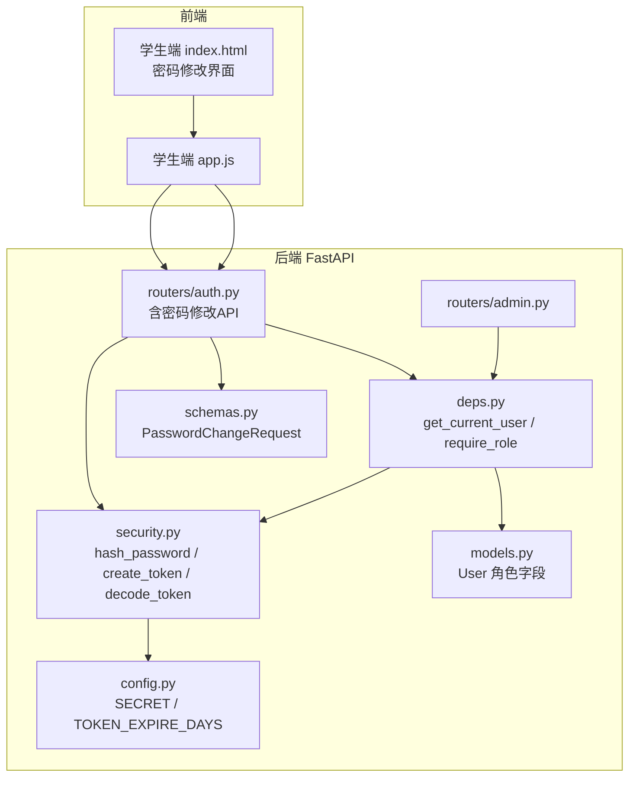
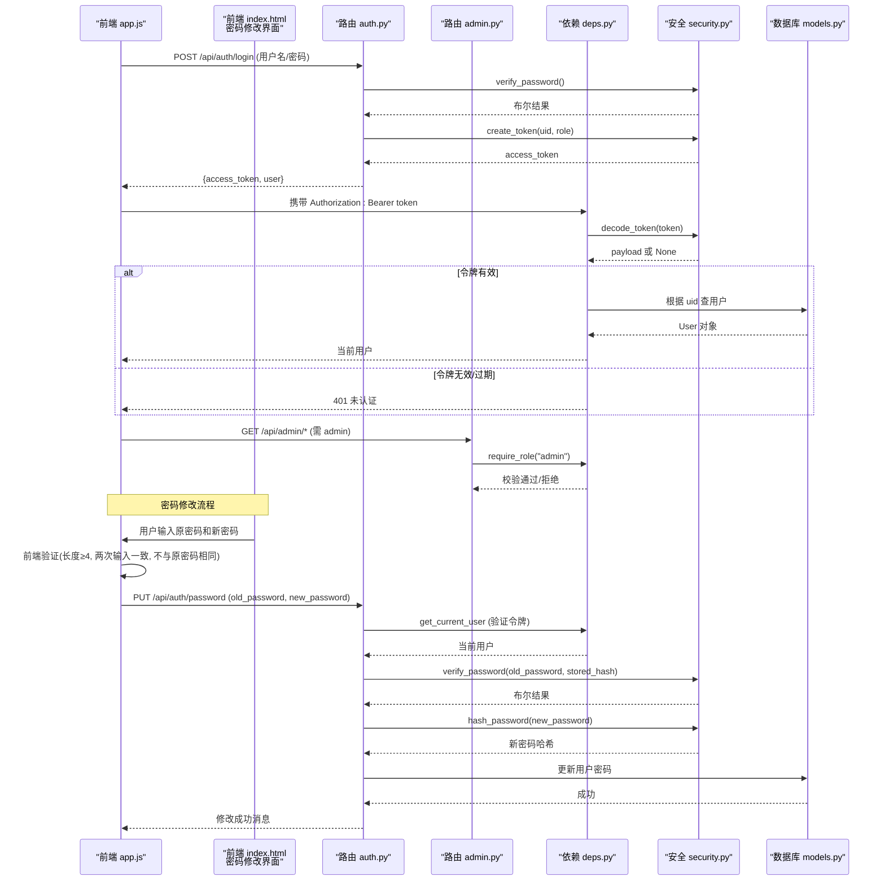
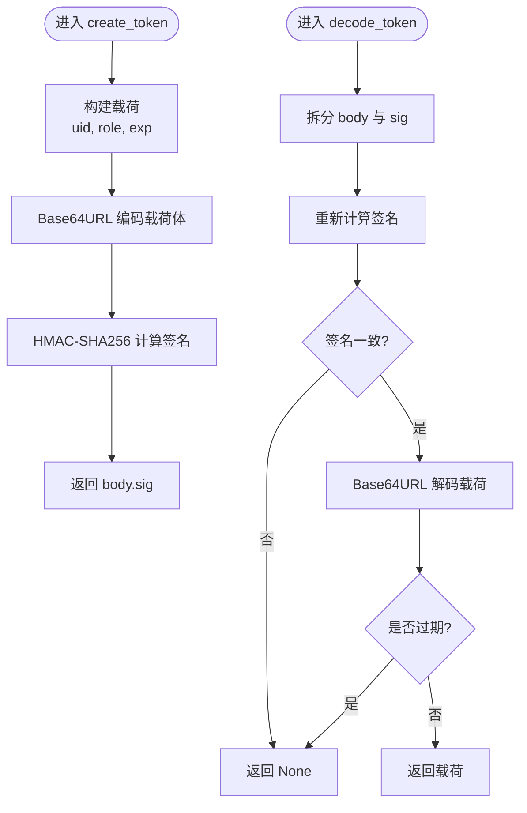
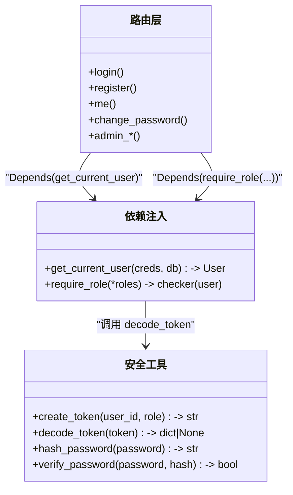
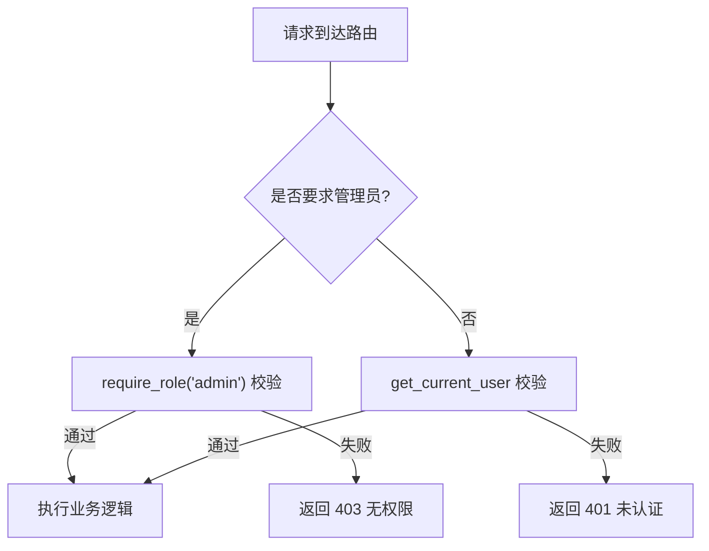
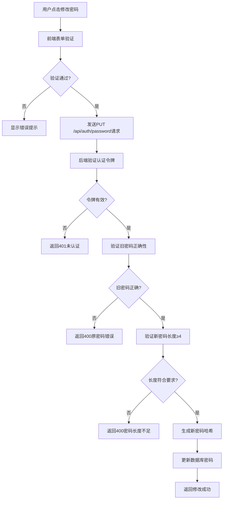
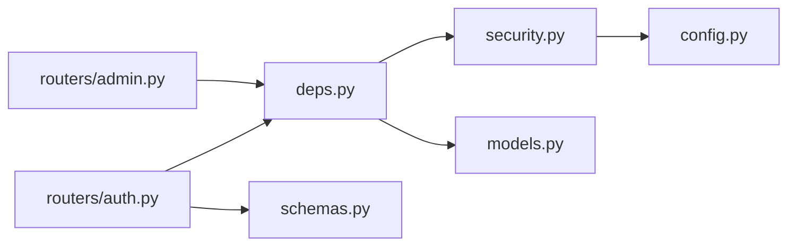

# 安全认证机制

<cite>
**本文引用的文件**   
- [security.py](file://summer-homework-checkin/backend/app/security.py)
- [deps.py](file://summer-homework-checkin/backend/app/deps.py)
- [auth.py](file://summer-homework-checkin/backend/app/routers/auth.py)
- [schemas.py](file://summer-homework-checkin/backend/app/schemas.py)
- [admin.py](file://summer-homework-checkin/backend/app/routers/admin.py)
- [models.py](file://summer-homework-checkin/backend/app/models.py)
- [config.py](file://summer-homework-checkin/backend/app/config.py)
- [student/app.js](file://summer-homework-checkin/frontend/student/app.js)
- [student/index.html](file://summer-homework-checkin/frontend/student/index.html)
</cite>

## 更新摘要
**变更内容**   
- 新增密码修改功能的安全实现章节
- 更新认证路由部分，包含密码修改API
- 添加前后端双重验证机制说明
- 完善用户安全策略章节

## 目录
1. [简介](#简介)
2. [项目结构](#项目结构)
3. [核心组件](#核心组件)
4. [架构总览](#架构总览)
5. [详细组件分析](#详细组件分析)
6. [依赖关系分析](#依赖关系分析)
7. [性能与安全考量](#性能与安全考量)
8. [故障排查指南](#故障排查指南)
9. [结论](#结论)
10. [附录](#附录)

## 简介
本技术文档围绕"安全认证机制"展开，聚焦以下目标：
- JWT（令牌）的生成、验证与刷新策略
- 用户角色与权限控制的设计与实现
- 密码加密存储与安全传输的最佳实践
- **密码修改功能的安全实现与验证机制**
- 会话管理与防重放攻击的安全策略
- 基于依赖注入的权限验证装饰器实现与使用方法
- 安全漏洞防护与敏感信息保护指导原则

本项目采用自定义的无状态令牌（类JWT格式），通过HMAC签名保证完整性，结合FastAPI的依赖注入完成鉴权与授权。前端以Authorization头携带令牌进行访问控制，并实现了完整的前后端双重密码修改验证机制。

## 项目结构
与认证相关的关键代码位于后端模块中，主要涉及：
- 安全工具：密码哈希、令牌生成/校验
- 依赖注入：当前用户解析、角色检查装饰器
- 路由层：登录、注册、获取当前用户、**密码修改**、管理员接口
- 数据模型：用户表及角色字段
- 配置：密钥与过期时间等
- 前端：登录流程、令牌持久化、**密码修改界面**

**图表来源**
- [auth.py:1-67](file://summer-homework-checkin/backend/app/routers/auth.py#L1-L67)
- [admin.py:1-214](file://summer-homework-checkin/backend/app/routers/admin.py#L1-L214)
- [deps.py:1-34](file://summer-homework-checkin/backend/app/deps.py#L1-L34)
- [security.py:1-47](file://summer-homework-checkin/backend/app/security.py#L1-L47)
- [schemas.py:40-43](file://summer-homework-checkin/backend/app/schemas.py#L40-L43)
- [models.py:11-20](file://summer-homework-checkin/backend/app/models.py#L11-L20)
- [config.py:19-21](file://summer-homework-checkin/backend/app/config.py#L19-L21)
- [student/index.html:232-244](file://summer-homework-checkin/frontend/student/index.html#L232-L244)

## 核心组件
- 安全工具（security.py）
  - 密码哈希与比对：使用PBKDF2-SHA256，固定盐（演示用），比较使用恒定时间函数防止时序攻击
  - 令牌生成：将用户ID、角色、过期时间编码为JSON并Base64URL，使用HMAC-SHA256对body签名，返回 body.sig 形式
  - 令牌解码：校验签名与过期时间，失败返回空
- 依赖注入（deps.py）
  - get_current_user：从请求头提取Bearer令牌，调用decode_token解析，再根据uid查询数据库用户对象
  - require_role：返回一个依赖，用于在路由中声明式地限制角色
- 路由层（auth.py、admin.py）
  - 登录/注册：校验凭据后签发令牌；注册时按角色写入不同字段
  - **密码修改：实现PUT /api/auth/password接口，支持旧密码验证、新密码长度检查、前后端双重验证**
  - 管理员接口：全部使用require_role("admin")保护
- 数据模型（models.py）
  - User.role 区分 student/parent/admin，作为授权判断依据
- 配置（config.py）
  - SECRET 与 TOKEN_EXPIRE_DAYS 控制签名密钥与令牌有效期
- **模式定义（schemas.py）**
  - PasswordChangeRequest：定义密码修改请求的数据结构，包含old_password和new_password字段

**章节来源**
- [security.py:10-46](file://summer-homework-checkin/backend/app/security.py#L10-L46)
- [deps.py:13-33](file://summer-homework-checkin/backend/app/deps.py#L13-L33)
- [auth.py:13-67](file://summer-homework-checkin/backend/app/routers/auth.py#L13-L67)
- [schemas.py:40-43](file://summer-homework-checkin/backend/app/schemas.py#L40-L43)
- [admin.py:16-50](file://summer-homework-checkin/backend/app/routers/admin.py#L16-L50)
- [models.py:11-20](file://summer-homework-checkin/backend/app/models.py#L11-L20)
- [config.py:19-21](file://summer-homework-checkin/backend/app/config.py#L19-L21)

## 架构总览
下图展示了从前端登录到受保护资源访问的完整流程，以及依赖注入如何参与鉴权与授权，**新增了密码修改功能的完整流程**。

**图表来源**
- [auth.py:40-67](file://summer-homework-checkin/backend/app/routers/auth.py#L40-L67)
- [admin.py:16-50](file://summer-homework-checkin/backend/app/routers/admin.py#L16-L50)
- [deps.py:13-33](file://summer-homework-checkin/backend/app/deps.py#L13-L33)
- [security.py:20-46](file://summer-homework-checkin/backend/app/security.py#L20-L46)
- [models.py:11-20](file://summer-homework-checkin/backend/app/models.py#L11-L20)
- [student/app.js:150-167](file://summer-homework-checkin/frontend/student/app.js#L150-L167)
- [student/index.html:232-244](file://summer-homework-checkin/frontend/student/index.html#L232-L244)

## 详细组件分析

### 令牌（类JWT）生成与验证
- 生成流程
  - 载荷包含用户ID、角色、过期时间
  - 使用Base64URL编码载荷体
  - 使用HMAC-SHA256对载荷体计算签名，拼接为 body.sig
- 验证流程
  - 拆分载荷与签名，重新计算签名并对比
  - 校验过期时间
  - 失败返回空，由上层统一处理为401

**图表来源**
- [security.py:20-46](file://summer-homework-checkin/backend/app/security.py#L20-L46)

**章节来源**
- [security.py:20-46](file://summer-homework-checkin/backend/app/security.py#L20-L46)

### 依赖注入的鉴权与授权
- 鉴权（身份确认）
  - get_current_user 从请求头解析Bearer令牌，调用decode_token，再从数据库加载用户实体
- 授权（权限控制）
  - require_role 返回依赖，在路由参数中声明式使用，如 require_role("admin")
  - 若当前用户角色不在允许集合内，返回403

**图表来源**
- [deps.py:13-33](file://summer-homework-checkin/backend/app/deps.py#L13-L33)
- [security.py:10-46](file://summer-homework-checkin/backend/app/security.py#L10-L46)
- [auth.py:13-67](file://summer-homework-checkin/backend/app/routers/auth.py#L13-L67)
- [admin.py:16-50](file://summer-homework-checkin/backend/app/routers/admin.py#L16-L50)

**章节来源**
- [deps.py:13-33](file://summer-homework-checkin/backend/app/deps.py#L13-L33)
- [auth.py:40-67](file://summer-homework-checkin/backend/app/routers/auth.py#L40-L67)
- [admin.py:16-50](file://summer-homework-checkin/backend/app/routers/admin.py#L16-L50)

### 用户角色与权限控制
- 角色定义
  - User.role 支持 student、parent、admin
- 权限策略
  - 普通接口：需要已认证用户（get_current_user）
  - 管理接口：需要管理员角色（require_role("admin")）
- 前端行为
  - 登录后将令牌存入本地存储，并在后续请求头中携带 Authorization: Bearer <token>
  - 遇到401自动登出并跳转登录页

**图表来源**
- [deps.py:28-33](file://summer-homework-checkin/backend/app/deps.py#L28-L33)
- [admin.py:16-50](file://summer-homework-checkin/backend/app/routers/admin.py#L16-L50)
- [auth.py:49-67](file://summer-homework-checkin/backend/app/routers/auth.py#L49-L67)
- [student/app.js:58-82](file://summer-homework-checkin/frontend/student/app.js#L58-L82)

**章节来源**
- [models.py:11-20](file://summer-homework-checkin/backend/app/models.py#L11-L20)
- [deps.py:28-33](file://summer-homework-checkin/backend/app/deps.py#L28-L33)
- [admin.py:16-50](file://summer-homework-checkin/backend/app/routers/admin.py#L16-L50)
- [student/app.js:58-82](file://summer-homework-checkin/frontend/student/app.js#L58-L82)

### 密码修改功能的安全实现

**新增** 系统实现了完整的密码修改功能，包含前后端双重验证机制和安全防护措施。

#### 后端安全验证
- **旧密码验证**：使用verify_password函数验证用户提供的原密码是否正确
- **新密码长度要求**：强制新密码至少4位字符
- **密码哈希更新**：使用hash_password函数生成新的密码哈希和盐值
- **原子性更新**：在同一事务中更新密码哈希和盐值，确保数据一致性

#### 前端安全验证
- **表单验证**：检查原密码是否为空
- **长度验证**：确保新密码至少4位字符
- **一致性验证**：验证两次输入的密码是否一致
- **安全性验证**：防止用户设置与原密码相同的新密码

#### API接口设计
- **接口路径**：PUT /api/auth/password
- **请求参数**：PasswordChangeRequest包含old_password和new_password
- **响应格式**：返回操作结果和提示信息
- **权限控制**：需要有效的认证令牌

**图表来源**
- [auth.py:56-67](file://summer-homework-checkin/backend/app/routers/auth.py#L56-L67)
- [student/app.js:150-167](file://summer-homework-checkin/frontend/student/app.js#L150-L167)
- [student/index.html:232-244](file://summer-homework-checkin/frontend/student/index.html#L232-L244)

**章节来源**
- [auth.py:56-67](file://summer-homework-checkin/backend/app/routers/auth.py#L56-L67)
- [schemas.py:40-43](file://summer-homework-checkin/backend/app/schemas.py#L40-L43)
- [student/app.js:150-167](file://summer-homework-checkin/frontend/student/app.js#L150-L167)
- [student/index.html:232-244](file://summer-homework-checkin/frontend/student/index.html#L232-L244)

### 密码加密存储与安全传输
- 存储安全
  - 使用PBKDF2-SHA256进行单向哈希，固定盐（演示用途），比较使用恒定时间函数避免时序侧信道
- 传输安全
  - 建议全站启用HTTPS，避免明文传输令牌与密码
  - 前端仅在必要范围存储令牌，避免跨站脚本风险

**章节来源**
- [security.py:10-17](file://summer-homework-checkin/backend/app/security.py#L10-L17)
- [student/app.js:58-94](file://summer-homework-checkin/frontend/student/app.js#L58-L94)

### 会话管理与令牌刷新
- 当前实现
  - 无状态令牌，含过期时间，服务端不维护会话
  - 前端在本地存储令牌，401时清理并跳转登录
- 刷新策略建议
  - 引入短生命周期访问令牌与长生命周期刷新令牌
  - 提供刷新接口，使用刷新令牌换取新访问令牌
  - 刷新令牌应更严格地绑定设备指纹或IP白名单，并记录审计日志

**章节来源**
- [security.py:20-46](file://summer-homework-checkin/backend/app/security.py#L20-L46)
- [student/app.js:58-111](file://summer-homework-checkin/frontend/student/app.js#L58-L111)

### 防重放攻击策略
- 建议措施
  - 请求级唯一标识：为每个请求生成nonce，服务端缓存最近使用的nonce并设置TTL
  - 时间戳校验：请求携带时间戳，服务端拒绝超过阈值的旧请求
  - 签名增强：对关键请求的参数进行二次签名，防止篡改
  - 速率限制：对敏感接口实施限流与熔断

[本节为通用安全建议，不直接分析具体文件]

## 依赖关系分析
- 组件耦合
  - 路由层依赖依赖注入模块完成鉴权与授权
  - 依赖注入模块依赖安全工具与数据库模型
  - 安全工具依赖配置中的密钥与过期时间
- 外部依赖
  - FastAPI 的 HTTPBearer 与 Depends
  - SQLAlchemy ORM 的用户查询

**图表来源**
- [auth.py:1-67](file://summer-homework-checkin/backend/app/routers/auth.py#L1-L67)
- [admin.py:1-214](file://summer-homework-checkin/backend/app/routers/admin.py#L1-L214)
- [deps.py:1-34](file://summer-homework-checkin/backend/app/deps.py#L1-L34)
- [security.py:1-47](file://summer-homework-checkin/backend/app/security.py#L1-L47)
- [schemas.py:40-43](file://summer-homework-checkin/backend/app/schemas.py#L40-L43)
- [models.py:11-20](file://summer-homework-checkin/backend/app/models.py#L11-L20)
- [config.py:19-21](file://summer-homework-checkin/backend/app/config.py#L19-L21)

**章节来源**
- [auth.py:1-67](file://summer-homework-checkin/backend/app/routers/auth.py#L1-L67)
- [admin.py:1-214](file://summer-homework-checkin/backend/app/routers/admin.py#L1-L214)
- [deps.py:1-34](file://summer-homework-checkin/backend/app/deps.py#L1-L34)
- [security.py:1-47](file://summer-homework-checkin/backend/app/security.py#L1-L47)
- [schemas.py:40-43](file://summer-homework-checkin/backend/app/schemas.py#L40-L43)
- [models.py:11-20](file://summer-homework-checkin/backend/app/models.py#L11-L20)
- [config.py:19-21](file://summer-homework-checkin/backend/app/config.py#L19-L21)

## 性能与安全考量
- 性能
  - PBKDF2迭代次数较高，登录/注册路径存在CPU开销，可考虑异步执行或预热策略
  - 令牌解码轻量，适合高频鉴权场景
  - 密码修改操作涉及数据库更新，需注意并发控制
- 安全
  - 固定盐仅用于演示，生产环境应为每用户独立随机盐
  - SECRET应从环境变量注入，禁止硬编码
  - 建议全站HTTPS，禁用HTTP明文传输
  - 对敏感接口增加速率限制与异常告警
  - **密码修改功能实现了多层安全防护，包括前后端双重验证和相同密码检测**

[本节为通用指导，不直接分析具体文件]

## 故障排查指南
- 常见错误码
  - 401：未提供令牌、令牌无效/过期、用户不存在
  - 403：角色不足
  - **400：原密码错误、新密码长度不足、密码修改失败**
- 定位步骤
  - 检查前端是否正确设置 Authorization 头
  - 检查服务端日志中令牌解码与数据库查询结果
  - 核对配置中的密钥与过期时间是否与客户端期望一致
  - **检查密码修改接口的请求参数和响应消息**
- 快速修复
  - 重置本地令牌并重新登录
  - 修正服务器时间与系统时区差异导致的过期误判
  - 确保SECRET在生产环境正确注入
  - **验证密码修改的前后端验证逻辑是否正常**

**章节来源**
- [deps.py:17-25](file://summer-homework-checkin/backend/app/deps.py#L17-L25)
- [deps.py:28-33](file://summer-homework-checkin/backend/app/deps.py#L28-L33)
- [auth.py:56-67](file://summer-homework-checkin/backend/app/routers/auth.py#L56-L67)
- [student/app.js:58-82](file://summer-homework-checkin/frontend/student/app.js#L58-L82)

## 结论
本项目实现了基于无状态令牌的认证与基于角色的授权，结合FastAPI依赖注入形成清晰的鉴权链路。**新增的密码修改功能提供了完整的前后端双重验证机制，增强了用户账户的安全性**。当前实现满足基础安全需求，但在生产环境中仍需完善：
- 引入动态盐与更强的密码哈希算法
- 实现访问令牌与刷新令牌的双令牌机制
- 全站HTTPS与严格的CORS策略
- 防重放、速率限制与审计日志
- 敏感配置的环境变量注入与最小权限原则
- **密码复杂度要求和定期更换策略**

## 附录
- 术语
  - 令牌：类JWT格式的无状态凭证，包含载荷与HMAC签名
  - 依赖注入：FastAPI提供的按需解析与装配机制
  - 角色：用户权限分类，如 student、parent、admin
  - **密码修改：用户自主更改账户密码的安全功能**
- 参考实现位置
  - 令牌生成与校验：[security.py](file://summer-homework-checkin/backend/app/security.py)
  - 鉴权与授权依赖：[deps.py](file://summer-homework-checkin/backend/app/deps.py)
  - 认证路由：**含密码修改功能**：[auth.py](file://summer-homework-checkin/backend/app/routers/auth.py)
  - 管理员路由：[admin.py](file://summer-homework-checkin/backend/app/routers/admin.py)
  - 用户模型：[models.py](file://summer-homework-checkin/backend/app/models.py)
  - 配置项：[config.py](file://summer-homework-checkin/backend/app/config.py)
  - **密码修改请求模式**：[schemas.py](file://summer-homework-checkin/backend/app/schemas.py)
  - 前端令牌使用：**含密码修改界面**：[student/app.js](file://summer-homework-checkin/frontend/student/app.js)
  - **密码修改UI界面**：[student/index.html](file://summer-homework-checkin/frontend/student/index.html)