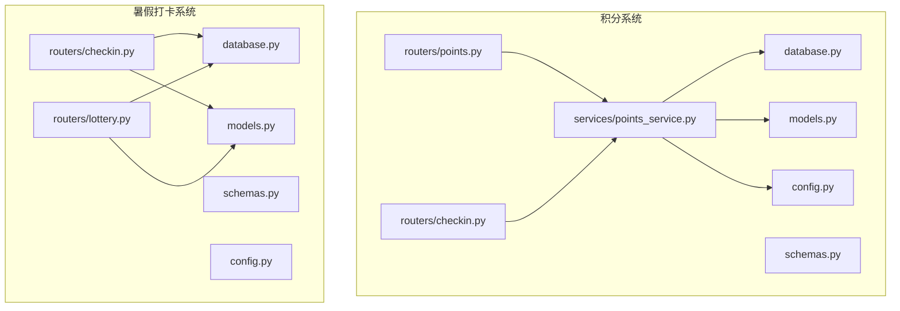
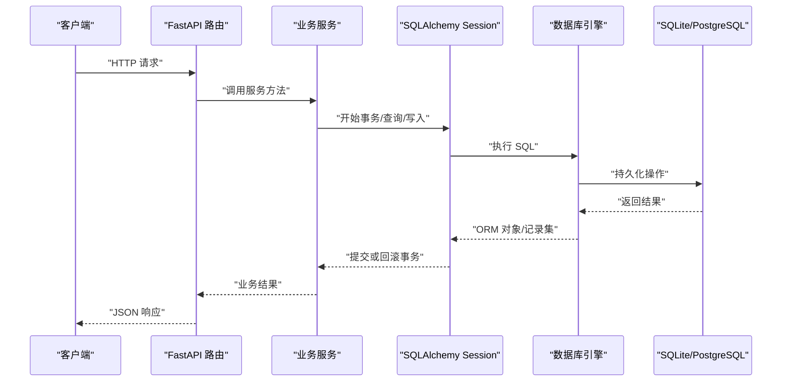
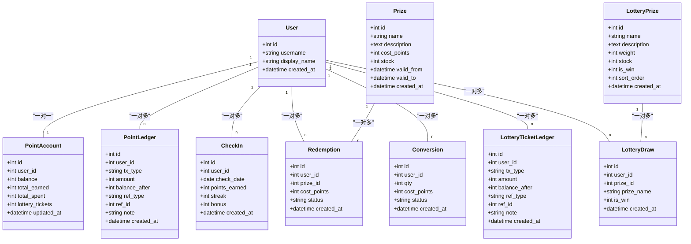
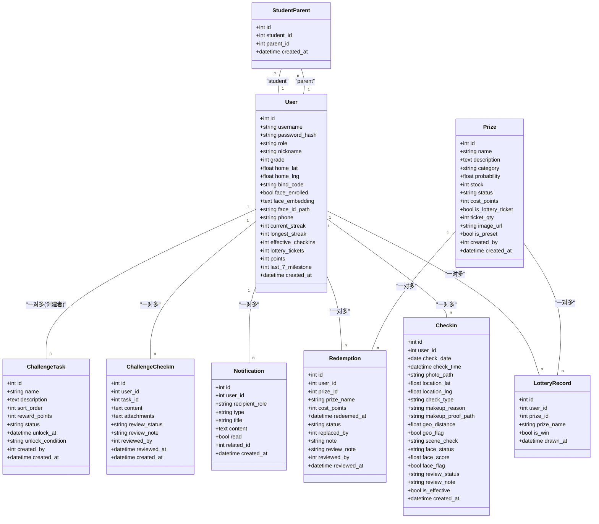
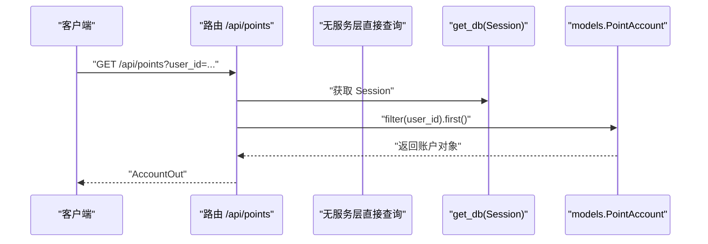
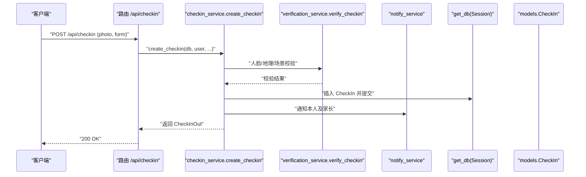
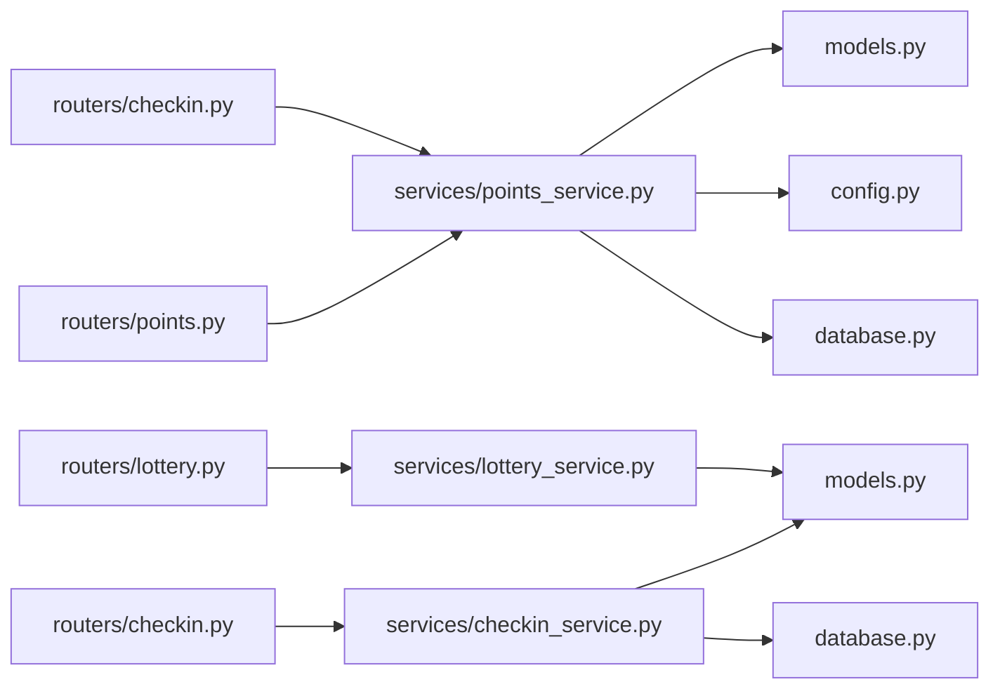

# 数据访问层

<cite>
**本文引用的文件列表**
- [points-system/backend/app/models.py](file://points-system/backend/app/models.py)
- [points-system/backend/app/database.py](file://points-system/backend/app/database.py)
- [points-system/backend/app/schemas.py](file://points-system/backend/app/schemas.py)
- [points-system/backend/app/config.py](file://points-system/backend/app/config.py)
- [points-system/backend/app/routers/points.py](file://points-system/backend/app/routers/points.py)
- [points-system/backend/app/routers/checkin.py](file://points-system/backend/app/routers/checkin.py)
- [points-system/backend/app/services/points_service.py](file://points-system/backend/app/services/points_service.py)
- [summer-homework-checkin/backend/app/models.py](file://summer-homework-checkin/backend/app/models.py)
- [summer-homework-checkin/backend/app/database.py](file://summer-homework-checkin/backend/app/database.py)
- [summer-homework-checkin/backend/app/schemas.py](file://summer-homework-checkin/backend/app/schemas.py)
- [summer-homework-checkin/backend/app/config.py](file://summer-homework-checkin/backend/app/config.py)
- [summer-homework-checkin/backend/app/routers/checkin.py](file://summer-homework-checkin/backend/app/routers/checkin.py)
- [summer-homework-checkin/backend/app/routers/lottery.py](file://summer-homework-checkin/backend/app/routers/lottery.py)
</cite>

## 目录
1. [简介](#简介)
2. [项目结构](#项目结构)
3. [核心组件](#核心组件)
4. [架构总览](#架构总览)
5. [详细组件分析](#详细组件分析)
6. [依赖关系分析](#依赖关系分析)
7. [性能与优化](#性能与优化)
8. [故障排查指南](#故障排查指南)
9. [结论](#结论)
10. [附录](#附录)

## 简介
本技术文档聚焦于两个后端项目的数据访问层：积分系统（points-system）与暑假作业打卡系统（summer-homework-checkin）。文档围绕以下目标展开：
- SQLAlchemy ORM 使用模式与数据库模型设计
- 数据表之间的关系映射、字段约束与索引策略
- Pydantic 数据验证模式与 API 请求/响应格式化
- 数据库连接与并发安全配置，以及性能优化技巧
- 数据迁移管理与版本控制策略建议
- 查询优化最佳实践与常见性能问题解决方案

## 项目结构
两个项目均采用 FastAPI + SQLAlchemy + Pydantic 的典型分层：
- models.py：SQLAlchemy 模型定义（表结构、关系、约束、索引）
- database.py：引擎、会话工厂、Base、初始化与依赖注入 get_db
- schemas.py：Pydantic 请求/响应模型
- routers/*：路由层调用服务层，使用 Session 进行数据访问
- services/*：业务逻辑封装，事务边界清晰
- config.py：运行期配置（数据库 URL、规则常量等）

图表来源
- [points-system/backend/app/database.py:1-39](file://points-system/backend/app/database.py#L1-L39)
- [points-system/backend/app/models.py:1-151](file://points-system/backend/app/models.py#L1-L151)
- [points-system/backend/app/schemas.py:1-147](file://points-system/backend/app/schemas.py#L1-L147)
- [points-system/backend/app/routers/points.py:1-28](file://points-system/backend/app/routers/points.py#L1-L28)
- [points-system/backend/app/routers/checkin.py:1-16](file://points-system/backend/app/routers/checkin.py#L1-L16)
- [points-system/backend/app/services/points_service.py:1-146](file://points-system/backend/app/services/points_service.py#L1-L146)
- [summer-homework-checkin/backend/app/database.py:1-22](file://summer-homework-checkin/backend/app/database.py#L1-L22)
- [summer-homework-checkin/backend/app/models.py:1-212](file://summer-homework-checkin/backend/app/models.py#L1-L212)
- [summer-homework-checkin/backend/app/schemas.py:1-322](file://summer-homework-checkin/backend/app/schemas.py#L1-L322)
- [summer-homework-checkin/backend/app/routers/checkin.py:1-80](file://summer-homework-checkin/backend/app/routers/checkin.py#L1-L80)
- [summer-homework-checkin/backend/app/routers/lottery.py:1-30](file://summer-homework-checkin/backend/app/routers/lottery.py#L1-L30)

章节来源
- [points-system/backend/app/database.py:1-39](file://points-system/backend/app/database.py#L1-L39)
- [summer-homework-checkin/backend/app/database.py:1-22](file://summer-homework-checkin/backend/app/database.py#L1-L22)

## 核心组件
- 数据库连接与会话管理
  - 通过 create_engine 创建引擎，sessionmaker 生成会话工厂，提供 get_db 依赖注入函数。
  - 在积分系统中对 SQLite 开启 WAL 日志与 busy_timeout，降低并发写冲突概率。
- 模型与关系
  - 使用 declarative_base 声明 Base，各模型继承 Base 并定义 __tablename__、主键、外键、唯一约束、索引等。
  - 通过 relationship 建立对象间关联，便于在应用层以面向对象方式访问。
- 数据校验与序列化
  - 使用 Pydantic BaseModel 定义输入输出模型，配合 response_model 实现自动校验与序列化。
  - 部分输出模型启用 from_attributes=True，以便直接从 ORM 对象构造响应。
- 路由与服务
  - 路由层仅做参数解析与权限检查，具体读写逻辑下沉至 services，保证事务边界与一致性。

章节来源
- [points-system/backend/app/database.py:1-39](file://points-system/backend/app/database.py#L1-L39)
- [points-system/backend/app/models.py:1-151](file://points-system/backend/app/models.py#L1-L151)
- [points-system/backend/app/schemas.py:1-147](file://points-system/backend/app/schemas.py#L1-L147)
- [summer-homework-checkin/backend/app/database.py:1-22](file://summer-homework-checkin/backend/app/database.py#L1-L22)
- [summer-homework-checkin/backend/app/models.py:1-212](file://summer-homework-checkin/backend/app/models.py#L1-L212)
- [summer-homework-checkin/backend/app/schemas.py:1-322](file://summer-homework-checkin/backend/app/schemas.py#L1-L322)

## 架构总览
下图展示了从 HTTP 请求到数据库的完整链路，包括路由、服务、ORM 与数据库交互。

图表来源
- [points-system/backend/app/routers/points.py:1-28](file://points-system/backend/app/routers/points.py#L1-L28)
- [points-system/backend/app/routers/checkin.py:1-16](file://points-system/backend/app/routers/checkin.py#L1-L16)
- [points-system/backend/app/services/points_service.py:1-146](file://points-system/backend/app/services/points_service.py#L1-L146)
- [summer-homework-checkin/backend/app/routers/checkin.py:1-80](file://summer-homework-checkin/backend/app/routers/checkin.py#L1-L80)
- [summer-homework-checkin/backend/app/routers/lottery.py:1-30](file://summer-homework-checkin/backend/app/routers/lottery.py#L1-L30)

## 详细组件分析

### 积分系统（points-system）数据模型与关系
- 用户与账户
  - User 与 PointAccount 为一对一关系，PointAccount.user_id 唯一且外键指向 users.id。
- 流水与防重
  - PointLedger 记录每次积分变动，包含 ref_type/ref_id 用于溯源。
  - CheckIn 表对 (user_id, check_date) 设置唯一约束，防止重复打卡；created_at 建索引加速时间排序。
- 奖品与兑换
  - Prize 支持有效期与库存；Redemption 记录兑换行为，cost_points 为快照值。
- 抽奖券与抽奖
  - Conversion 记录积分换券；LotteryTicketLedger 记录券发放/消耗；LotteryPrize 定义奖池权重与限量；LotteryDraw 记录抽奖结果。

图表来源
- [points-system/backend/app/models.py:1-151](file://points-system/backend/app/models.py#L1-L151)

章节来源
- [points-system/backend/app/models.py:1-151](file://points-system/backend/app/models.py#L1-L151)

### 暑假打卡系统（summer-homework-checkin）数据模型与关系
- 用户角色与扩展信息
  - User 通过 role 区分学生/家长/管理员，并包含人脸、位置、统计冗余字段等。
- 绑定关系
  - StudentParent 作为中间表实现学生与家长的多对多关系。
- 打卡与审核
  - CheckIn 记录照片、位置、人脸与场景检测结果，支持正常打卡与补卡，含审核状态与有效性标记。
- 奖品与抽奖
  - Prize 支持概率、库存、是否“抽奖机会”等；LotteryRecord 记录抽奖结果。
- 积分兑换
  - Redemption 支持替换（replaced_by），记录审核信息与操作人。
- 通知与任务
  - Notification 站内通知；ChallengeTask 与 ChallengeCheckIn 构成闯关任务体系。

图表来源
- [summer-homework-checkin/backend/app/models.py:1-212](file://summer-homework-checkin/backend/app/models.py#L1-L212)

章节来源
- [summer-homework-checkin/backend/app/models.py:1-212](file://summer-homework-checkin/backend/app/models.py#L1-L212)

### 数据表关系映射、字段约束与索引优化
- 关系映射
  - 一对一：User ↔ PointAccount（积分系统）
  - 一对多：User → CheckIn / PointLedger / Redemption / Conversion / LotteryTicketLedger / LotteryDraw（积分系统）
  - 多对多：Student ↔ Parent 通过 StudentParent 中间表（暑假打卡系统）
- 字段约束
  - 唯一性：users.username、point_accounts.user_id、checkins(user_id, check_date)
  - 非空：多数业务关键字段设为 nullable=False
  - 外键：广泛使用 ForeignKey 维护引用完整性
- 索引策略
  - 高频过滤与排序字段加索引：如 users.username、point_ledgers.created_at、checkins.check_date、lottery_draws.prize_id 等
  - 复合唯一约束替代额外唯一索引，减少冗余索引开销
- 冗余字段
  - 暑假打卡系统在 User 中缓存 streak、effective_checkins、lottery_tickets、points 等，减少复杂聚合计算，但需由服务层在关键路径更新保持一致性

章节来源
- [points-system/backend/app/models.py:1-151](file://points-system/backend/app/models.py#L1-L151)
- [summer-homework-checkin/backend/app/models.py:1-212](file://summer-homework-checkin/backend/app/models.py#L1-L212)

### Pydantic 数据验证模式与 API 格式化
- 输入模型
  - 例如 CheckInRequest、RedeemRequest、ConvertRequest、DrawRequest 等，限定必填字段与类型，避免非法输入进入服务层。
- 输出模型
  - AccountOut、LedgerOut、CheckInOut、PrizeOut、RedemptionOut、ConversionOut、LotteryPrizeOut、LotteryDrawOut 等，统一响应结构。
- 兼容 ORM 对象
  - 部分输出模型启用 model_config = ConfigDict(from_attributes=True)，可直接从 SQLAlchemy 对象构造响应，减少手动映射。
- 组合响应
  - CheckInResult、RedeemResult、ConvertResult、DrawResult 将实体与上下文信息（余额、剩余券数等）打包返回，提升前端消费体验。

章节来源
- [points-system/backend/app/schemas.py:1-147](file://points-system/backend/app/schemas.py#L1-L147)
- [summer-homework-checkin/backend/app/schemas.py:1-322](file://summer-homework-checkin/backend/app/schemas.py#L1-L322)

### 数据库连接池配置与并发安全
- 积分系统
  - SQLite 使用 connect_args={"check_same_thread": False} 允许线程池访问同一连接；通过事件监听设置 PRAGMA journal_mode=WAL 与 PRAGMA busy_timeout=5000，提高并发读能力并缩短写忙等待窗口。
- 暑假打卡系统
  - 同样设置 check_same_thread=False，并使用 future=True 启用新版会话语义；DATABASE_URL 来自配置文件，便于环境切换。
- 连接池建议
  - 当前未显式配置 pool_size/max_overflow/timeout 等参数；若迁移到 PostgreSQL/MySQL，应结合连接池参数与慢查询监控进行调优。

章节来源
- [points-system/backend/app/database.py:1-39](file://points-system/backend/app/database.py#L1-L39)
- [summer-homework-checkin/backend/app/database.py:1-22](file://summer-homework-checkin/backend/app/database.py#L1-L22)
- [summer-homework-checkin/backend/app/config.py:1-50](file://summer-homework-checkin/backend/app/config.py#L1-L50)

### 事务边界与一致性保障
- 积分系统
  - do_checkin/do_redeem 在同一 Session 内完成「读-改-写」，成功 commit，异常 rollback；利用 IntegrityError 兜底并发重复打卡。
- 暑假打卡系统
  - 打卡创建、审核通过/拒绝、连续天数重算与抽奖资格发放均按事务组织，确保积分、次数与通知的一致性。

章节来源
- [points-system/backend/app/services/points_service.py:1-146](file://points-system/backend/app/services/points_service.py#L1-L146)
- [summer-homework-checkin/backend/app/services/checkin_service.py:1-254](file://summer-homework-checkin/backend/app/services/checkin_service.py#L1-L254)

### 查询流程时序示例
- 积分查询

图表来源
- [points-system/backend/app/routers/points.py:1-28](file://points-system/backend/app/routers/points.py#L1-L28)
- [points-system/backend/app/database.py:28-33](file://points-system/backend/app/database.py#L28-L33)

- 打卡创建（暑假打卡系统）

图表来源
- [summer-homework-checkin/backend/app/routers/checkin.py:1-80](file://summer-homework-checkin/backend/app/routers/checkin.py#L1-L80)
- [summer-homework-checkin/backend/app/services/checkin_service.py:64-163](file://summer-homework-checkin/backend/app/services/checkin_service.py#L64-L163)

## 依赖关系分析
- 模块耦合
  - 路由层依赖数据库依赖注入 get_db 与业务服务；服务层依赖模型与配置；模型依赖 Base 与数据库引擎。
- 外部依赖
  - 积分系统：SQLite（WAL 模式）、FastAPI、SQLAlchemy、Pydantic
  - 暑假打卡系统：SQLite、FastAPI、SQLAlchemy、Pydantic、人脸识别与图片处理工具（utils）
- 潜在循环依赖
  - 模型之间通过 relationship 形成图结构，但导入仅在需要时触发（如 init_db 中 import app.models），避免启动时循环导入风险。

图表来源
- [points-system/backend/app/routers/points.py:1-28](file://points-system/backend/app/routers/points.py#L1-L28)
- [points-system/backend/app/routers/checkin.py:1-16](file://points-system/backend/app/routers/checkin.py#L1-L16)
- [points-system/backend/app/services/points_service.py:1-146](file://points-system/backend/app/services/points_service.py#L1-L146)
- [summer-homework-checkin/backend/app/routers/checkin.py:1-80](file://summer-homework-checkin/backend/app/routers/checkin.py#L1-L80)
- [summer-homework-checkin/backend/app/routers/lottery.py:1-30](file://summer-homework-checkin/backend/app/routers/lottery.py#L1-L30)

章节来源
- [points-system/backend/app/routers/points.py:1-28](file://points-system/backend/app/routers/points.py#L1-L28)
- [points-system/backend/app/routers/checkin.py:1-16](file://points-system/backend/app/routers/checkin.py#L1-L16)
- [summer-homework-checkin/backend/app/routers/checkin.py:1-80](file://summer-homework-checkin/backend/app/routers/checkin.py#L1-L80)
- [summer-homework-checkin/backend/app/routers/lottery.py:1-30](file://summer-homework-checkin/backend/app/routers/lottery.py#L1-L30)

## 性能与优化
- 连接与并发
  - SQLite 下开启 WAL 与 busy_timeout 可显著改善并发读性能；在高并发写场景建议迁移到 PostgreSQL/MySQL，并配置合适的连接池大小与超时。
- 索引与查询
  - 针对高频过滤与排序字段建立索引（如 created_at、check_date、user_id、prize_id 等）；避免 SELECT *，按需选择列以减少网络与内存开销。
- 事务与锁
  - 在热点资源（账户、库存）上采用单事务原子更新；若数据库支持，可使用悲观锁（with_for_update）进一步降低竞态条件。
- 冗余与计算
  - 在 User 中缓存 streak、effective_checkins、lottery_tickets、points 等字段，减少复杂聚合；但需在关键路径严格维护一致性。
- 批量与分页
  - 列表接口增加 limit/order_by，避免一次性加载大量数据；必要时引入游标分页。
- 存储与 I/O
  - 图片上传走独立存储目录并通过 public_url 暴露，避免将大对象存入数据库；合理限制图片体积与尺寸。

[本节为通用指导，不直接分析具体文件]

## 故障排查指南
- 重复打卡
  - 现象：并发提交导致重复打卡
  - 定位：服务层先查后写 + 唯一约束兜底；捕获 IntegrityError 并返回 409
  - 参考路径：[points-system/backend/app/services/points_service.py:77-82](file://points-system/backend/app/services/points_service.py#L77-L82)
- 库存不足/过期
  - 现象：兑换失败
  - 定位：服务层校验库存与有效期，抛出 400/409
  - 参考路径：[points-system/backend/app/services/points_service.py:94-116](file://points-system/backend/app/services/points_service.py#L94-L116)
- 人脸校验失败
  - 现象：打卡被拒或标记高风险
  - 定位：verify_checkin 返回 face_status，根据策略拒绝或放行
  - 参考路径：[summer-homework-checkin/backend/app/services/checkin_service.py:116-122](file://summer-homework-checkin/backend/app/services/checkin_service.py#L116-L122)
- 补卡超限
  - 现象：提示本月补卡次数已达上限
  - 定位：按月统计已生效补卡数量并与 MAX_MAKEUP_PER_MONTH 比较
  - 参考路径：[summer-homework-checkin/backend/app/services/checkin_service.py:88-100](file://summer-homework-checkin/backend/app/services/checkin_service.py#L88-L100)

章节来源
- [points-system/backend/app/services/points_service.py:77-116](file://points-system/backend/app/services/points_service.py#L77-L116)
- [summer-homework-checkin/backend/app/services/checkin_service.py:88-122](file://summer-homework-checkin/backend/app/services/checkin_service.py#L88-L122)

## 结论
- 两个项目均采用清晰的三层架构，数据访问层职责明确，事务边界严谨，具备较好的可维护性与可扩展性。
- 通过合理的索引、唯一约束与冗余字段设计，兼顾了正确性与性能；在 SQLite 环境下通过 WAL 与 busy_timeout 提升了并发能力。
- 建议在后续演进中引入正式的数据迁移工具（如 Alembic），完善连接池参数与环境变量管理，并对热点查询进行持续监控与优化。

[本节为总结性内容，不直接分析具体文件]

## 附录

### 数据迁移管理与版本控制策略（建议）
- 推荐方案
  - 使用 Alembic 管理 SQLAlchemy 模型变更，生成迁移脚本并进行版本控制；生产环境通过 CI/CD 流水线执行迁移。
- 基本步骤
  - 初始化迁移仓库：alembic init
  - 配置 alembic.ini 中的 sqlalchemy.url 指向 DATABASE_URL
  - 自动生成迁移：alembic revision --autogenerate -m "描述"
  - 执行迁移：alembic upgrade head
  - 回滚：alembic downgrade <revision>
- 注意事项
  - 谨慎修改已有表结构，尽量新增字段而非删除；对敏感数据变更需评估影响面与回滚策略。
  - 在部署前进行预发环境验证，确保迁移幂等与兼容性。

[本节为通用指导，不直接分析具体文件]

### 常用查询优化清单
- 为高频过滤与排序字段添加索引（如 created_at、check_date、user_id、prize_id）
- 使用 select_only 指定必要列，避免 N+1 查询与过度加载
- 对热点行使用 with_for_update（在支持的事务型数据库中）
- 分页与限流：limit/order_by 与游标分页
- 缓存热点只读数据（如奖品列表、用户基础信息）

[本节为通用指导，不直接分析具体文件]