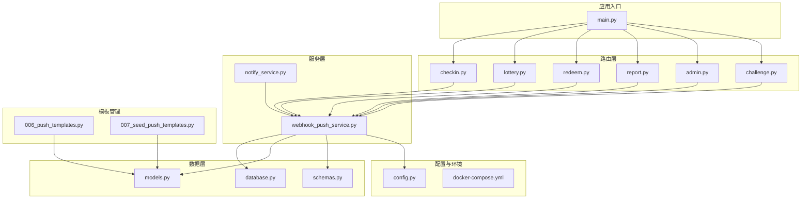
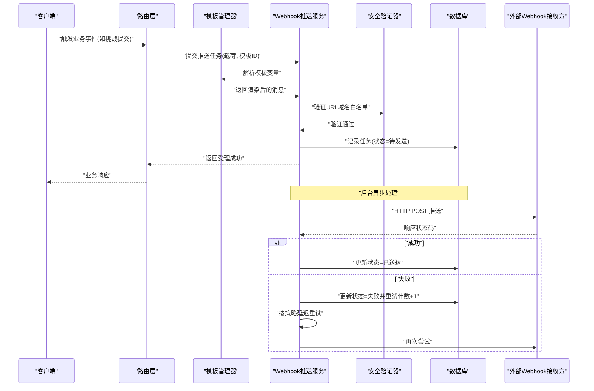
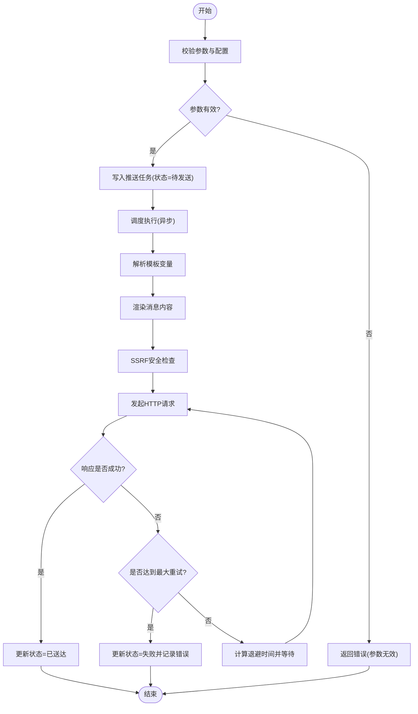
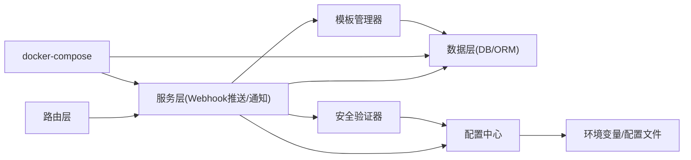

# Webhook推送服务

<cite>
**本文引用的文件**   
- [webhook_push_service.py](file://summer-homework-checkin/backend/app/services/webhook_push_service.py)
- [notify_service.py](file://summer-homework-checkin/backend/app/services/notify_service.py)
- [main.py](file://summer-homework-checkin/backend/app/main.py)
- [config.py](file://summer-homework-checkin/backend/app/config.py)
- [database.py](file://summer-homework-checkin/backend/app/database.py)
- [models.py](file://summer-homework-checkin/backend/app/models.py)
- [schemas.py](file://summer-homework-checkin/backend/app/schemas.py)
- [checkin.py](file://summer-homework-checkin/backend/app/routers/checkin.py)
- [lottery.py](file://summer-homework-checkin/backend/app/routers/lottery.py)
- [redeem.py](file://summer-homework-checkin/backend/app/routers/redeem.py)
- [report.py](file://summer-homework-checkin/backend/app/routers/report.py)
- [admin.py](file://summer-homework-checkin/backend/app/routers/admin.py)
- [challenge.py](file://summer-homework-checkin/backend/app/routers/challenge.py)
- [005_push_challenge.py](file://summer-homework-checkin/backend/alembic/versions/005_push_challenge.py)
- [006_push_templates.py](file://summer-homework-checkin/backend/alembic/versions/006_push_templates.py)
- [007_seed_push_templates.py](file://summer-homework-checkin/backend/alembic/versions/007_seed_push_templates.py)
- [docker-compose.yml](file://docker-compose.yml)
</cite>

## 更新摘要
**变更内容**   
- 新增模板管理系统，支持动态Webhook消息模板配置
- 集成挑战打卡事件（ch_submitted/ch_approved/ch_rejected）推送
- 增强SSRF安全防护，限制Webhook URL域名白名单
- 完善模板验证机制，确保消息格式正确性
- 扩展数据库模型以支持模板存储和管理

## 目录
1. [简介](#简介)
2. [项目结构](#项目结构)
3. [核心组件](#核心组件)
4. [架构总览](#架构总览)
5. [详细组件分析](#详细组件分析)
6. [依赖关系分析](#依赖关系分析)
7. [性能考虑](#性能考虑)
8. [故障排查指南](#故障排查指南)
9. [结论](#结论)
10. [附录](#附录)

## 简介
本仓库包含一个基于 FastAPI 的后端系统，其中"Webhook推送服务"负责将关键业务事件（如签到、抽奖、兑换、报表、挑战打卡等）以 Webhook 的形式异步推送到外部系统。该服务通过配置化的目标地址与重试策略，结合数据库持久化记录，保障消息的可靠投递与可观测性。**最新更新**引入了模板管理系统和SSRF安全防护，进一步提升了系统的灵活性和安全性。

## 项目结构
后端采用分层架构：路由层暴露 API，服务层封装业务逻辑，数据访问层通过 SQLAlchemy 操作数据库，配置由集中式配置文件管理。Webhook 推送能力作为独立服务模块被多个业务路由调用，实现解耦与复用。**新增**模板管理功能通过独立的迁移文件和增强的验证机制提供支持。

**图表来源**
- [main.py](file://summer-homework-checkin/backend/app/main.py)
- [checkin.py](file://summer-homework-checkin/backend/app/routers/checkin.py)
- [lottery.py](file://summer-homework-checkin/backend/app/routers/lottery.py)
- [redeem.py](file://summer-homework-checkin/backend/app/routers/redeem.py)
- [report.py](file://summer-homework-checkin/backend/app/routers/report.py)
- [admin.py](file://summer-homework-checkin/backend/app/routers/admin.py)
- [challenge.py](file://summer-homework-checkin/backend/app/routers/challenge.py)
- [webhook_push_service.py](file://summer-homework-checkin/backend/app/services/webhook_push_service.py)
- [notify_service.py](file://summer-homework-checkin/backend/app/services/notify_service.py)
- [database.py](file://summer-homework-checkin/backend/app/database.py)
- [models.py](file://summer-homework-checkin/backend/app/models.py)
- [schemas.py](file://summer-homework-checkin/backend/app/schemas.py)
- [config.py](file://summer-homework-checkin/backend/app/config.py)
- [006_push_templates.py](file://summer-homework-checkin/backend/alembic/versions/006_push_templates.py)
- [007_seed_push_templates.py](file://summer-homework-checkin/backend/alembic/versions/007_seed_push_templates.py)
- [docker-compose.yml](file://docker-compose.yml)

**章节来源**
- [main.py](file://summer-homework-checkin/backend/app/main.py)
- [config.py](file://summer-homework-checkin/backend/app/config.py)
- [database.py](file://summer-homework-checkin/backend/app/database.py)
- [models.py](file://summer-homework-checkin/backend/app/models.py)
- [schemas.py](file://summer-homework-checkin/backend/app/schemas.py)

## 核心组件
- **Webhook 推送服务**：提供统一的 Webhook 发送接口，支持队列化、重试、失败回退与日志记录，**新增**SSRF安全防护和模板解析功能。
- **通知服务**：聚合多种通知渠道（如站内通知、短信、邮件等），在需要时触发 Webhook 推送。
- **模板管理系统**：**新增**功能，支持动态配置Webhook消息模板，包括变量替换和格式验证。
- **挑战打卡集成**：**新增**对挑战提交(ch_submitted)、审批(ch_approved)、拒绝(ch_rejected)事件的推送支持。
- **路由层**：在关键业务节点（签到成功、抽奖结果、兑换完成、报表生成、管理员操作、挑战事件）中调用推送服务。
- **数据模型与模式**：定义推送任务、状态、错误码等数据结构，保证输入校验与一致性，**扩展**支持模板存储。
- **配置与环境**：集中管理 Webhook 目标地址、超时、重试次数、并发限制等参数，**增强**URL域名白名单验证。

**章节来源**
- [webhook_push_service.py](file://summer-homework-checkin/backend/app/services/webhook_push_service.py)
- [notify_service.py](file://summer-homework-checkin/backend/app/services/notify_service.py)
- [checkin.py](file://summer-homework-checkin/backend/app/routers/checkin.py)
- [lottery.py](file://summer-homework-checkin/backend/app/routers/lottery.py)
- [redeem.py](file://summer-homework-checkin/backend/app/routers/redeem.py)
- [report.py](file://summer-homework-checkin/backend/app/routers/report.py)
- [admin.py](file://summer-homework-checkin/backend/app/routers/admin.py)
- [challenge.py](file://summer-homework-checkin/backend/app/routers/challenge.py)
- [config.py](file://summer-homework-checkin/backend/app/config.py)
- [models.py](file://summer-homework-checkin/backend/app/models.py)
- [schemas.py](file://summer-homework-checkin/backend/app/schemas.py)

## 架构总览
Webhook 推送服务采用"事件驱动 + 异步处理"的模式。业务路由在关键事件发生时，构造推送载荷并交由推送服务入队；推送服务根据配置进行网络请求、重试与状态更新，确保最终一致性与可追溯性。**新增**模板解析和安全验证环节，进一步提升系统的灵活性和安全性。

**图表来源**
- [webhook_push_service.py](file://summer-homework-checkin/backend/app/services/webhook_push_service.py)
- [challenge.py](file://summer-homework-checkin/backend/app/routers/challenge.py)
- [database.py](file://summer-homework-checkin/backend/app/database.py)
- [models.py](file://summer-homework-checkin/backend/app/models.py)

## 详细组件分析

### Webhook 推送服务
- **职责**：统一封装 Webhook 发送逻辑，包括参数校验、请求构建、重试策略、错误分类与持久化记录。
- **关键点**：
  - 入队与调度：将推送任务写入数据库，并由后台任务或线程池异步执行。
  - 重试策略：指数退避或固定间隔，最大重试次数与超时控制。
  - 失败回退：达到上限后标记失败并记录错误原因，便于人工干预。
  - 可观测性：记录请求 ID、目标 URL、状态码、耗时与错误信息。
  - **SSRF防护**：**新增**域名白名单验证，防止内部网络攻击。
  - **模板解析**：**新增**动态模板渲染，支持变量替换和格式验证。

**图表来源**
- [webhook_push_service.py](file://summer-homework-checkin/backend/app/services/webhook_push_service.py)
- [config.py](file://summer-homework-checkin/backend/app/config.py)
- [models.py](file://summer-homework-checkin/backend/app/models.py)

**章节来源**
- [webhook_push_service.py](file://summer-homework-checkin/backend/app/services/webhook_push_service.py)
- [config.py](file://summer-homework-checkin/backend/app/config.py)
- [models.py](file://summer-homework-checkin/backend/app/models.py)

### 模板管理系统
- **职责**：**新增**功能，管理Webhook消息模板的CRUD操作，支持变量替换和格式验证。
- **关键点**：
  - 模板存储：使用数据库表存储模板定义，支持版本控制。
  - 变量解析：支持占位符替换，如{{user_name}}、{{event_time}}等。
  - 格式验证：确保模板语法正确，避免运行时错误。
  - 默认模板：预置常用场景的模板，开箱即用。

**章节来源**
- [006_push_templates.py](file://summer-homework-checkin/backend/alembic/versions/006_push_templates.py)
- [007_seed_push_templates.py](file://summer-homework-checkin/backend/alembic/versions/007_seed_push_templates.py)
- [webhook_push_service.py](file://summer-homework-checkin/backend/app/services/webhook_push_service.py)

### 挑战打卡事件集成
- **职责**：**新增**对挑战相关事件的推送支持，包括提交、审批、拒绝等状态变更。
- **关键点**：
  - 事件类型：ch_submitted（挑战提交）、ch_approved（挑战批准）、ch_rejected（挑战拒绝）。
  - 数据关联：携带挑战ID、用户信息、时间戳等上下文数据。
  - 路由集成：在challenge路由中触发相应的事件推送。

**章节来源**
- [challenge.py](file://summer-homework-checkin/backend/app/routers/challenge.py)
- [005_push_challenge.py](file://summer-homework-checkin/backend/alembic/versions/005_push_challenge.py)
- [webhook_push_service.py](file://summer-homework-checkin/backend/app/services/webhook_push_service.py)

### SSRF安全防护
- **职责**：**新增**安全验证机制，防止服务器端请求伪造攻击。
- **关键点**：
  - 域名白名单：只允许配置的域名列表进行Webhook推送。
  - IP地址检查：阻止内网IP地址的请求。
  - 协议限制：仅支持HTTPS协议，提升传输安全性。
  - 超时控制：设置合理的连接和读取超时时间。

**章节来源**
- [webhook_push_service.py](file://summer-homework-checkin/backend/app/services/webhook_push_service.py)
- [config.py](file://summer-homework-checkin/backend/app/config.py)

### 通知服务
- **职责**：聚合多渠道通知（站内、短信、邮件等），在特定场景下触发 Webhook 推送。
- **关键点**：
  - 事件映射：将业务事件映射为推送模板与目标渠道。
  - 条件判断：根据用户偏好、开关配置决定是否推送。
  - 幂等性：避免重复推送导致的外部系统重复消费。

**章节来源**
- [notify_service.py](file://summer-homework-checkin/backend/app/services/notify_service.py)
- [webhook_push_service.py](file://summer-homework-checkin/backend/app/services/webhook_push_service.py)

### 路由层集成点
- **签到路由**：在签到成功后触发推送，携带用户信息与签到时间。
- **抽奖路由**：在抽奖结果确定后推送中奖信息或参与记录。
- **兑换路由**：在兑换完成后推送订单状态与明细。
- **报表路由**：在报表生成完成后推送下载链接或摘要。
- **管理路由**：在管理员操作（如审核、封禁）后推送审计事件。
- **挑战路由**：**新增**在挑战状态变更时推送相关事件。

**章节来源**
- [checkin.py](file://summer-homework-checkin/backend/app/routers/checkin.py)
- [lottery.py](file://summer-homework-checkin/backend/app/routers/lottery.py)
- [redeem.py](file://summer-homework-checkin/backend/app/routers/redeem.py)
- [report.py](file://summer-homework-checkin/backend/app/routers/report.py)
- [admin.py](file://summer-homework-checkin/backend/app/routers/admin.py)
- [challenge.py](file://summer-homework-checkin/backend/app/routers/challenge.py)

### 数据模型与模式
- **推送任务模型**：包含任务 ID、目标 URL、载荷、状态、重试次数、错误信息等字段。
- **模板模型**：**新增**模板ID、模板名称、模板内容、变量定义等字段。
- **输入模式**：对请求体进行严格校验，确保必填字段与类型正确。
- **输出模式**：对外暴露统一的响应结构，便于前端或下游系统解析。

**章节来源**
- [models.py](file://summer-homework-checkin/backend/app/models.py)
- [schemas.py](file://summer-homework-checkin/backend/app/schemas.py)

### 配置与环境
- **推送配置**：目标地址列表、超时、重试次数、并发限制、代理设置等。
- **安全配置**：**新增**域名白名单、协议限制、IP过滤规则。
- **模板配置**：**新增**默认模板路径、变量解析策略、缓存设置。
- **环境隔离**：开发、测试、生产环境的差异化配置。
- **容器编排**：通过 docker-compose 统一管理服务依赖与启动顺序。

**章节来源**
- [config.py](file://summer-homework-checkin/backend/app/config.py)
- [docker-compose.yml](file://docker-compose.yml)

## 依赖关系分析
- **路由层依赖服务层**：各业务路由在关键事件处调用 Webhook 推送服务。
- **服务层依赖数据层**：推送服务读写数据库，维护任务状态与历史记录。
- **模板管理依赖**：**新增**模板服务依赖数据库和操作接口。
- **安全验证依赖**：**新增**SSRF防护依赖配置和白名单管理。
- **配置集中管理**：所有外部依赖（如 HTTP 客户端、重试策略）通过配置注入。
- **容器编排**：docker-compose 协调后端服务、数据库与可能的消息队列。

**图表来源**
- [webhook_push_service.py](file://summer-homework-checkin/backend/app/services/webhook_push_service.py)
- [notify_service.py](file://summer-homework-checkin/backend/app/services/notify_service.py)
- [database.py](file://summer-homework-checkin/backend/app/database.py)
- [config.py](file://summer-homework-checkin/backend/app/config.py)
- [docker-compose.yml](file://docker-compose.yml)

**章节来源**
- [webhook_push_service.py](file://summer-homework-checkin/backend/app/services/webhook_push_service.py)
- [notify_service.py](file://summer-homework-checkin/backend/app/services/notify_service.py)
- [database.py](file://summer-homework-checkin/backend/app/database.py)
- [config.py](file://summer-homework-checkin/backend/app/config.py)
- [docker-compose.yml](file://docker-compose.yml)

## 性能考虑
- **异步处理**：使用后台任务或线程池避免阻塞主请求链路。
- **批量推送**：合并同类事件减少网络开销。
- **连接池**：复用 HTTP 连接降低握手成本。
- **限流与熔断**：防止下游服务过载导致雪崩。
- **缓存热点**：对不频繁变化的配置进行本地缓存。
- **模板缓存**：**新增**对模板内容的内存缓存，提升解析性能。
- **安全验证优化**：**新增**域名白名单的快速查找算法。

## 故障排查指南
- **常见问题**：
  - 目标地址不可达：检查网络连通性与防火墙规则。
  - 认证失败：核对签名、Token 或证书配置。
  - 超时与重试：调整超时阈值与重试策略，观察错误日志。
  - 数据不一致：核对数据库任务状态与外部系统回执。
  - **模板解析错误**：**新增**检查模板语法和变量定义。
  - **SSRF拦截**：**新增**确认目标域名在白名单中。
- **诊断步骤**：
  - 查看推送任务记录的状态与错误信息。
  - 启用调试日志，捕获请求头与响应体。
  - 模拟外部回调，验证签名与载荷格式。
  - 逐步缩小范围，定位是网络、认证还是业务逻辑问题。
  - **模板调试**：**新增**验证模板渲染结果是否符合预期。
  - **安全排查**：**新增**检查域名白名单和协议配置。

**章节来源**
- [webhook_push_service.py](file://summer-homework-checkin/backend/app/services/webhook_push_service.py)
- [models.py](file://summer-homework-checkin/backend/app/models.py)
- [schemas.py](file://summer-homework-checkin/backend/app/schemas.py)

## 结论
Webhook 推送服务通过清晰的职责划分与可靠的异步机制，实现了高内聚、低耦合的事件推送能力。**最新增强**包括模板管理系统、挑战打卡事件集成、SSRF安全防护和增强的模板验证机制，进一步提升了系统的灵活性、安全性和可扩展性。配合完善的配置管理与错误处理，能够在复杂业务场景中稳定运行，并为后续扩展（如多通道、多租户、灰度发布）奠定基础。

## 附录
- **部署建议**：
  - 使用 docker-compose 编排后端与依赖服务。
  - 为不同环境准备独立的配置文件与密钥管理。
  - 监控关键指标：成功率、延迟、重试率、错误分布。
  - **模板管理**：**新增**定期备份模板配置，支持版本回滚。
  - **安全配置**：**新增**定期审查域名白名单，清理不再使用的条目。
- **最佳实践**：
  - 保持载荷最小化与幂等设计。
  - 明确错误语义与重试边界。
  - 定期清理历史任务与归档日志。
  - **模板设计**：**新增**使用语义化变量名，添加模板文档说明。
  - **安全防护**：**新增**实施最小权限原则，限制可访问的域名范围。