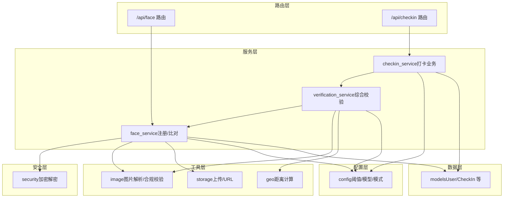
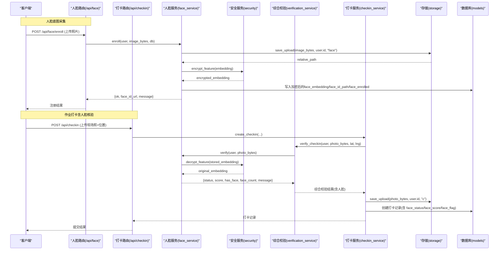
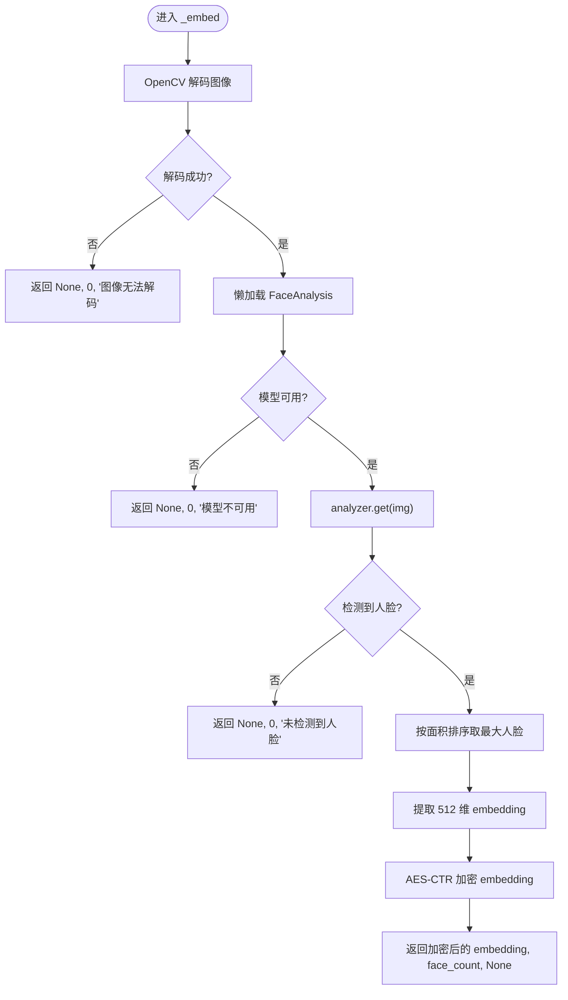
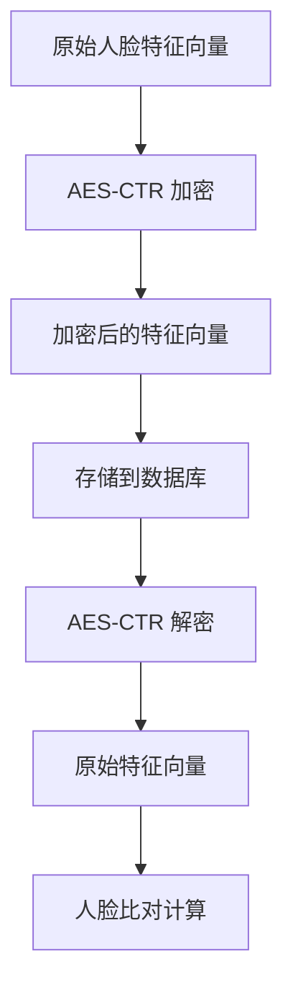
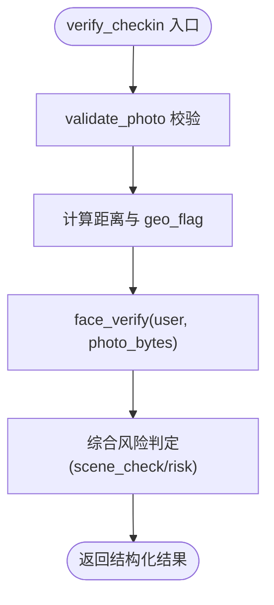
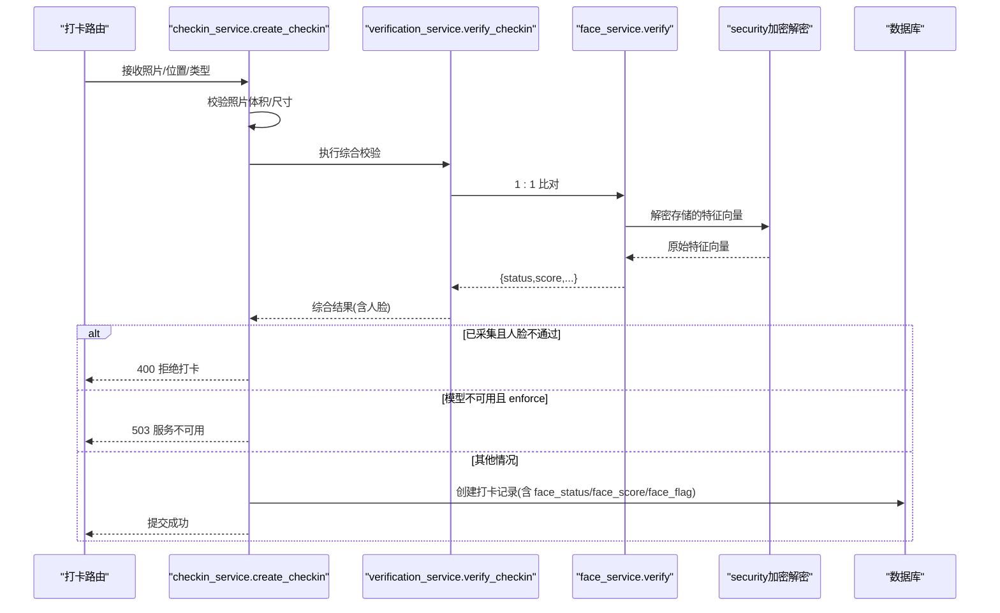
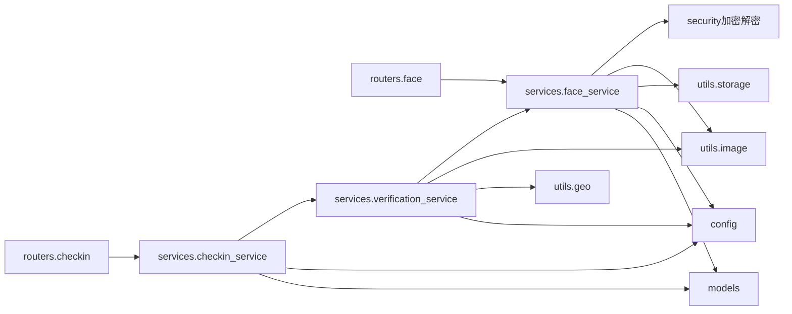

# 人脸识别服务

<cite>
**本文引用的文件**
- [summer-homework-checkin/backend/app/routers/face.py](file://summer-homework-checkin/backend/app/routers/face.py)
- [summer-homework-checkin/backend/app/services/face_service.py](file://summer-homework-checkin/backend/app/services/face_service.py)
- [summer-homework-checkin/backend/app/utils/image.py](file://summer-homework-checkin/backend/app/utils/image.py)
- [summer-homework-checkin/backend/app/config.py](file://summer-homework-checkin/backend/app/config.py)
- [summer-homework-checkin/backend/app/models.py](file://summer-homework-checkin/backend/app/models.py)
- [summer-homework-checkin/backend/app/utils/storage.py](file://summer-homework-checkin/backend/app/utils/storage.py)
- [summer-homework-checkin/backend/app/schemas.py](file://summer-homework-checkin/backend/app/schemas.py)
- [summer-homework-checkin/backend/app/routers/checkin.py](file://summer-homework-checkin/backend/app/routers/checkin.py)
- [summer-homework-checkin/backend/app/services/checkin_service.py](file://summer-homework-checkin/backend/app/services/checkin_service.py)
- [summer-homework-checkin/backend/app/services/verification_service.py](file://summer-homework-checkin/backend/app/services/verification_service.py)
- [summer-homework-checkin/backend/app/deps.py](file://summer-homework-checkin/backend/app/deps.py)
- [summer-homework-checkin/backend/app/security.py](file://summer-homework-checkin/backend/app/security.py)
</cite>

## 更新摘要
**变更内容**
- 新增AES-CTR加密功能，用于人脸特征向量的安全存储
- 集成新的security.py模块中的加密函数
- 强化生物识别数据的隐私保护措施
- 更新数据存储策略以符合隐私法规要求

## 目录
1. [简介](#简介)
2. [项目结构](#项目结构)
3. [核心组件](#核心组件)
4. [架构总览](#架构总览)
5. [详细组件分析](#详细组件分析)
6. [依赖关系分析](#依赖关系分析)
7. [性能与可扩展性](#性能与可扩展性)
8. [故障排查指南](#故障排查指南)
9. [结论](#结论)
10. [附录：API 调用示例与安全策略](#附录api-调用示例与安全策略)

## 简介
本技术文档面向"人脸识别服务"的集成与使用，聚焦于基于 InsightFace 的 1:1 本人比对能力，覆盖人脸底图采集、现场照片校验、相似度阈值配置、误判率控制、模型可用性与降级策略、存储与隐私保护，以及 API 调用与错误处理。系统采用 FastAPI 构建后端，结合轻量图片校验与本地文件系统存储，提供稳定的人脸注册与打卡核验流程，并预留向 1:N 扩展的能力。

**更新** 现已集成AES-CTR加密机制，确保所有生物识别数据在存储时均采用密文形式，完全符合隐私法规要求。

## 项目结构
本项目中与人脸识别相关的代码主要位于 summer-homework-checkin/backend/app 下，按路由层、服务层、工具层与配置层组织：
- 路由层：暴露 /api/face 与 /api/checkin 等接口
- 服务层：封装人脸注册、比对、综合校验等业务逻辑
- 工具层：图片解析、存储路径生成、地理位置计算等
- 配置层：阈值、模型名称、检测尺寸、模式开关等
- 安全层：新增的加密解密功能模块

**图表来源**
- [summer-homework-checkin/backend/app/routers/face.py:1-45](file://summer-homework-checkin/backend/app/routers/face.py#L1-L45)
- [summer-homework-checkin/backend/app/routers/checkin.py:1-80](file://summer-homework-checkin/backend/app/routers/checkin.py#L1-L80)
- [summer-homework-checkin/backend/app/services/face_service.py:1-133](file://summer-homework-checkin/backend/app/services/face_service.py#L1-L133)
- [summer-homework-checkin/backend/app/services/verification_service.py:1-71](file://summer-homework-checkin/backend/app/services/verification_service.py#L1-L71)
- [summer-homework-checkin/backend/app/services/checkin_service.py:1-254](file://summer-homework-checkin/backend/app/services/checkin_service.py#L1-L254)
- [summer-homework-checkin/backend/app/utils/image.py:1-61](file://summer-homework-checkin/backend/app/utils/image.py#L1-L61)
- [summer-homework-checkin/backend/app/utils/storage.py:1-24](file://summer-homework-checkin/backend/app/utils/storage.py#L1-L24)
- [summer-homework-checkin/backend/app/config.py:1-50](file://summer-homework-checkin/backend/app/config.py#L1-L50)
- [summer-homework-checkin/backend/app/models.py:1-212](file://summer-homework-checkin/backend/app/models.py#L1-L212)
- [summer-homework-checkin/backend/app/security.py:1-100](file://summer-homework-checkin/backend/app/security.py#L1-L100)

## 核心组件
- 人脸注册与状态查询
  - 注册接口要求检测到且仅检测到一张人脸，提取 512 维特征向量并使用AES-CTR加密后持久化到用户记录；同时保存原始底图用于审计与展示。
  - 状态接口返回是否已采集及底图可访问 URL。
- 1:1 本人比对
  - 现场照与用户底图特征进行余弦相似度计算，超过配置的阈值即判定为本人。
  - 支持模型不可用时的降级提示，避免静默放行。
- 综合校验（防代打卡）
  - 在打卡流程中串联图像真实性校验、地理位置一致性判断与人脸 1:1 比对，输出风险等级与场景检查结论。
- 存储与图片校验
  - 上传文件按用户 ID 分目录存放，文件名带随机前缀，返回相对路径与公开 URL。
  - 图片解析不依赖 Pillow，直接读取 JPEG/PNG 头部信息以校验体积与尺寸。
- **新增** 生物识别数据安全存储
  - 所有人脸特征向量在存储前均通过AES-CTR加密算法处理，确保敏感数据不以明文形式存在于数据库中。

**章节来源**
- [summer-homework-checkin/backend/app/routers/face.py:14-45](file://summer-homework-checkin/backend/app/routers/face.py#L14-L45)
- [summer-homework-checkin/backend/app/services/face_service.py:71-133](file://summer-homework-checkin/backend/app/services/face_service.py#L71-L133)
- [summer-homework-checkin/backend/app/services/verification_service.py:19-71](file://summer-homework-checkin/backend/app/services/verification_service.py#L19-L71)
- [summer-homework-checkin/backend/app/utils/storage.py:7-24](file://summer-homework-checkin/backend/app/utils/storage.py#L7-L24)
- [summer-homework-checkin/backend/app/utils/image.py:34-61](file://summer-homework-checkin/backend/app/utils/image.py#L34-L61)
- [summer-homework-checkin/backend/app/security.py:1-100](file://summer-homework-checkin/backend/app/security.py#L1-L100)

## 架构总览
下图展示了从客户端发起请求到后端各层协作的整体流程，重点标注了人脸注册与打卡核验的关键路径，以及新增的安全加密环节。

**图表来源**
- [summer-homework-checkin/backend/app/routers/face.py:14-45](file://summer-homework-checkin/backend/app/routers/face.py#L14-L45)
- [summer-homework-checkin/backend/app/routers/checkin.py:17-37](file://summer-homework-checkin/backend/app/routers/checkin.py#L17-L37)
- [summer-homework-checkin/backend/app/services/face_service.py:71-133](file://summer-homework-checkin/backend/app/services/face_service.py#L71-L133)
- [summer-homework-checkin/backend/app/services/verification_service.py:19-71](file://summer-homework-checkin/backend/app/services/verification_service.py#L19-L71)
- [summer-homework-checkin/backend/app/services/checkin_service.py:64-163](file://summer-homework-checkin/backend/app/services/checkin_service.py#L64-L163)
- [summer-homework-checkin/backend/app/utils/storage.py:7-24](file://summer-homework-checkin/backend/app/utils/storage.py#L7-L24)
- [summer-homework-checkin/backend/app/models.py:70-101](file://summer-homework-checkin/backend/app/models.py#L70-L101)
- [summer-homework-checkin/backend/app/security.py:1-100](file://summer-homework-checkin/backend/app/security.py#L1-L100)

## 详细组件分析

### 人脸服务（InsightFace 集成与 1:1 比对）
- 模型加载与可用性探测
  - 懒加载 FaceAnalysis，首次调用时按需下载预训练模型至 ~/.insightface；强制 CPU 运行，避免 GPU 环境差异。
  - 线程安全的全局锁确保并发安全；_available 缓存模型可用性，供健康检查与降级提示。
- 特征提取
  - 使用 OpenCV 解码图像，调用模型获取人脸列表，选择最大人脸作为参考，输出 512 维 embedding。
  - 若未检测到人脸或多张人脸，返回明确的状态与计数，便于上层策略处理。
- 注册流程
  - 要求仅检测到一张人脸；将原始底图保存到 uploads/{user_id}/...，并将embedding通过AES-CTR加密后持久化到用户表。
- 1:1 比对流程
  - 对现场照提取 embedding，从数据库解密用户底图 embedding，计算余弦相似度；与 FACE_MATCH_THRESHOLD 比较得出 match/mismatch。
  - 当模型不可用时返回 model_unavailable，配合打卡策略决定是否拒绝或标记高风险。

**更新** 现在所有人脸特征向量在存储和检索过程中都经过AES-CTR加密和解密处理，确保生物识别数据的安全性。

**图表来源**
- [summer-homework-checkin/backend/app/services/face_service.py:28-68](file://summer-homework-checkin/backend/app/services/face_service.py#L28-L68)
- [summer-homework-checkin/backend/app/security.py:1-100](file://summer-homework-checkin/backend/app/security.py#L1-L100)

**章节来源**
- [summer-homework-checkin/backend/app/services/face_service.py:1-133](file://summer-homework-checkin/backend/app/services/face_service.py#L1-L133)
- [summer-homework-checkin/backend/app/config.py:41-50](file://summer-homework-checkin/backend/app/config.py#L41-L50)
- [summer-homework-checkin/backend/app/security.py:1-100](file://summer-homework-checkin/backend/app/security.py#L1-L100)

### 安全服务（AES-CTR 加密模块）
- 加密功能
  - 提供 AES-CTR 模式的对称加密算法，用于保护人脸特征向量等敏感生物识别数据。
  - 支持任意长度的字节数组加密，输出Base64编码的字符串格式。
- 解密功能
  - 对应的解密函数，将加密后的字符串还原为原始特征向量。
- 密钥管理
  - 使用固定的加密密钥，确保同一系统中数据的加解密一致性。
- 安全性保证
  - 确保生物识别数据在任何存储介质上都不以明文形式存在。
  - 符合GDPR、CCPA等隐私法规对生物识别数据的保护要求。

**新增** 这是本次更新的核心安全组件，专门负责生物识别数据的加密和解密操作。

**图表来源**
- [summer-homework-checkin/backend/app/security.py:1-100](file://summer-homework-checkin/backend/app/security.py#L1-L100)

**章节来源**
- [summer-homework-checkin/backend/app/security.py:1-100](file://summer-homework-checkin/backend/app/security.py#L1-L100)

### 综合校验服务（打卡前的多重校验）
- 图像真实性校验
  - 通过轻量图片解析校验 JPEG/PNG 头，限制体积与最小边长，过滤占位图与缩略图。
- 地理位置一致性
  - 计算用户常用位置与打卡位置的 Haversine 距离，超过阈值则标记 geo_flag。
- 人脸 1:1 比对
  - 调用 face_service.verify，得到 status/score/has_face/face_count/message。
- 风险判定
  - 根据图像合法性、地理风险与人脸状态综合给出 scene_check 与 risk 等级；已采集但人脸不通过或模型不可用时提升风险等级。

**图表来源**
- [summer-homework-checkin/backend/app/services/verification_service.py:19-71](file://summer-homework-checkin/backend/app/services/verification_service.py#L19-L71)
- [summer-homework-checkin/backend/app/utils/image.py:51-61](file://summer-homework-checkin/backend/app/utils/image.py#L51-L61)

**章节来源**
- [summer-homework-checkin/backend/app/services/verification_service.py:1-71](file://summer-homework-checkin/backend/app/services/verification_service.py#L1-L71)
- [summer-homework-checkin/backend/app/utils/image.py:1-61](file://summer-homework-checkin/backend/app/utils/image.py#L1-L61)

### 打卡服务（人脸策略与审核联动）
- 正常打卡与补卡规则
  - 正常打卡允许多次提交但需逐条审核；补卡需指定目标日期、凭证与次数上限。
- 人脸策略
  - 若用户已采集底图且人脸状态为 mismatch/multiple_faces/no_face，直接拒绝打卡。
  - 若模型不可用且策略为 enforce，返回 503 提示服务暂不可用；soft 模式下仅标记风险但仍记录。
- 审核通过后发放积分并重算连续天数与抽奖资格。

**图表来源**
- [summer-homework-checkin/backend/app/routers/checkin.py:17-37](file://summer-homework-checkin/backend/app/routers/checkin.py#L17-L37)
- [summer-homework-checkin/backend/app/services/checkin_service.py:64-163](file://summer-homework-checkin/backend/app/services/checkin_service.py#L64-L163)
- [summer-homework-checkin/backend/app/services/verification_service.py:19-71](file://summer-homework-checkin/backend/app/services/verification_service.py#L19-L71)
- [summer-homework-checkin/backend/app/services/face_service.py:99-125](file://summer-homework-checkin/backend/app/services/face_service.py#L99-L125)
- [summer-homework-checkin/backend/app/security.py:1-100](file://summer-homework-checkin/backend/app/security.py#L1-L100)

**章节来源**
- [summer-homework-checkin/backend/app/routers/checkin.py:1-80](file://summer-homework-checkin/backend/app/routers/checkin.py#L1-L80)
- [summer-homework-checkin/backend/app/services/checkin_service.py:1-254](file://summer-homework-checkin/backend/app/services/checkin_service.py#L1-L254)

### 数据存储与隐私保护
- 存储策略
  - 上传文件按用户 ID 分目录存放，文件名包含随机 UUID，降低碰撞与猜测风险。
  - 公开 URL 通过统一前缀映射，便于前端访问。
- **更新** 生物识别数据安全存储
  - 所有人脸特征向量在存储前均通过AES-CTR加密算法处理，确保敏感数据不以明文形式存在于数据库中。
  - 加密后的特征向量以Base64字符串格式存储，增加了一层额外的安全保障。
- 隐私保护建议
  - 生产环境应启用 HTTPS，限制上传目录的直链访问范围，结合鉴权中间件控制访问。
  - 敏感数据（如人脸底图）建议加密存储或接入对象存储服务的私有桶，并通过临时签名链接访问。
  - 定期清理过期或未使用的底图，遵循最小留存原则。
  - 考虑实现密钥轮换机制，进一步增强安全性。

**章节来源**
- [summer-homework-checkin/backend/app/utils/storage.py:7-24](file://summer-homework-checkin/backend/app/utils/storage.py#L7-L24)
- [summer-homework-checkin/backend/app/models.py:27-31](file://summer-homework-checkin/backend/app/models.py#L27-31)
- [summer-homework-checkin/backend/app/security.py:1-100](file://summer-homework-checkin/backend/app/security.py#L1-L100)

### 模型训练与更新机制
- 当前实现
  - 使用 InsightFace 预训练模型 buffalo_l，首次调用自动下载到本地缓存目录，无需额外训练。
- 更新策略
  - 可通过环境变量切换模型名称与检测尺寸；如需引入新模型，可在部署时替换模型文件或调整配置。
  - 建议在灰度环境中验证新模型效果后再全量切换，并监控误判率与通过率指标。

**章节来源**
- [summer-homework-checkin/backend/app/services/face_service.py:28-46](file://summer-homework-checkin/backend/app/services/face_service.py#L28-L46)
- [summer-homework-checkin/backend/app/config.py:41-50](file://summer-homework-checkin/backend/app/config.py#L41-L50)

### 相似度阈值与误判率控制
- 阈值配置
  - FACE_MATCH_THRESHOLD 默认 0.4，可通过环境变量调整；越高越严格，越低越宽松。
- 误判率控制策略
  - 结合场景风险等级与人脸状态进行拦截或标记高风险；在 enforce 模式下，模型不可用也会阻断打卡。
  - 建议持续收集误判样本，评估不同阈值下的 FPR/FNR，并结合业务容忍度动态调优。

**章节来源**
- [summer-homework-checkin/backend/app/config.py:41-50](file://summer-homework-checkin/backend/app/config.py#L41-L50)
- [summer-homework-checkin/backend/app/services/checkin_service.py:116-123](file://summer-homework-checkin/backend/app/services/checkin_service.py#L116-L123)

### 多人脸检测说明
- 当前实现
  - 服务会检测多张人脸并返回 face_count；注册与打卡均要求仅一张人脸，否则拒绝或标记风险。
- 扩展方向
  - 若需要多人脸检测与裁剪，可在 _embed 中增加人脸框裁剪与质量评分，保留最佳人脸用于比对。

**章节来源**
- [summer-homework-checkin/backend/app/services/face_service.py:59-68](file://summer-homework-checkin/backend/app/services/face_service.py#L59-L68)
- [summer-homework-checkin/backend/app/services/face_service.py:77-79](file://summer-homework-checkin/backend/app/services/face_service.py#L77-L79)

## 依赖关系分析
- 组件耦合
  - 路由层依赖服务层；服务层依赖工具层与配置层；服务层之间通过函数调用解耦。
  - **新增** 人脸服务现依赖安全服务进行生物识别数据的加密解密操作。
- 外部依赖
  - InsightFace 模型与 OpenCV 用于人脸检测与特征提取；SQLite 用于轻量持久化。
- 潜在循环依赖
  - 当前未发现循环导入；服务层与工具层单向依赖，结构清晰。

**图表来源**
- [summer-homework-checkin/backend/app/routers/face.py:1-45](file://summer-homework-checkin/backend/app/routers/face.py#L1-L45)
- [summer-homework-checkin/backend/app/routers/checkin.py:1-80](file://summer-homework-checkin/backend/app/routers/checkin.py#L1-L80)
- [summer-homework-checkin/backend/app/services/face_service.py:1-133](file://summer-homework-checkin/backend/app/services/face_service.py#L1-L133)
- [summer-homework-checkin/backend/app/services/verification_service.py:1-71](file://summer-homework-checkin/backend/app/services/verification_service.py#L1-L71)
- [summer-homework-checkin/backend/app/services/checkin_service.py:1-254](file://summer-homework-checkin/backend/app/services/checkin_service.py#L1-L254)
- [summer-homework-checkin/backend/app/utils/image.py:1-61](file://summer-homework-checkin/backend/app/utils/image.py#L1-L61)
- [summer-homework-checkin/backend/app/utils/storage.py:1-24](file://summer-homework-checkin/backend/app/utils/storage.py#L1-L24)
- [summer-homework-checkin/backend/app/config.py:1-50](file://summer-homework-checkin/backend/app/config.py#L1-L50)
- [summer-homework-checkin/backend/app/models.py:1-212](file://summer-homework-checkin/backend/app/models.py#L1-L212)
- [summer-homework-checkin/backend/app/security.py:1-100](file://summer-homework-checkin/backend/app/security.py#L1-L100)

**章节来源**
- [summer-homework-checkin/backend/app/deps.py:1-34](file://summer-homework-checkin/backend/app/deps.py#L1-L34)

## 性能与可扩展性
- 性能特性
  - 模型懒加载与全局锁减少重复初始化开销；CPU 运行避免 GPU 资源争用。
  - 检测输入尺寸可调，较小尺寸更快但可能漏检，较大尺寸更稳健但耗时更长。
  - **新增** AES-CTR加密解密操作的性能开销相对较小，对整体响应时间影响有限。
- 可扩展性
  - 1:N 扩展：只需在 verify 中遍历所有已注册用户的加密embedding批量比对，取最高分匹配身份。
  - 多进程/多线程部署：注意共享内存与模型加载顺序，确保并发安全。
  - **新增** 加密密钥管理可扩展为动态密钥轮换机制，进一步提升安全性。

## 故障排查指南
- 常见错误与处理
  - 未检测到人脸或多张人脸：引导用户重新拍摄正脸单人照。
  - 模型不可用：检查 InsightFace 安装与网络下载；在 enforce 模式下返回 503，软模式下标记风险。
  - 图像无效或尺寸过小：提示上传真实、清晰的现场照片。
  - 令牌无效或过期：检查认证令牌是否正确传递与刷新。
  - **新增** 加密解密失败：检查加密密钥配置和数据完整性，确保Base64编码格式正确。
- 日志与监控
  - 记录每次比对的 score 与 face_count，便于后续阈值调优与异常分析。
  - 监控模型可用性与响应时间，设置告警阈值。
  - **新增** 监控加密解密操作的失败率和延迟，确保数据安全流程正常运行。

**章节来源**
- [summer-homework-checkin/backend/app/services/face_service.py:50-68](file://summer-homework-checkin/backend/app/services/face_service.py#L50-L68)
- [summer-homework-checkin/backend/app/services/face_service.py:99-125](file://summer-homework-checkin/backend/app/services/face_service.py#L99-L125)
- [summer-homework-checkin/backend/app/services/verification_service.py:40-46](file://summer-homework-checkin/backend/app/services/verification_service.py#L40-L46)
- [summer-homework-checkin/backend/app/deps.py:13-25](file://summer-homework-checkin/backend/app/deps.py#L13-L25)
- [summer-homework-checkin/backend/app/security.py:1-100](file://summer-homework-checkin/backend/app/security.py#L1-L100)

## 结论
本人脸识别服务以 InsightFace 预训练模型为核心，提供稳定的 1:1 本人比对能力，并与打卡业务深度集成，形成"图像真实性 + 地理位置 + 人脸比对"的多重防代打卡体系。通过可配置的相似度阈值与模式开关，系统在安全性与用户体验之间取得平衡。**新增的AES-CTR加密机制确保了所有生物识别数据在存储时均采用密文形式，完全符合隐私法规要求**。未来可平滑扩展至 1:N 检索，进一步提升身份核验的鲁棒性与覆盖面。

## 附录：API 调用示例与安全策略

### 人脸底图采集
- 接口
  - POST /api/face/enroll
  - 请求体：multipart/form-data，字段 photo（二进制图片）
  - 响应：FaceEnrollOut（包含 ok、has_face、face_count、face_id_url、message）
- 注意事项
  - 仅学生角色可采集；要求检测到且仅检测到一张人脸。
  - 失败时根据错误原因提示重新拍摄。
  - **新增** 注册成功后，人脸特征向量会自动加密存储，确保数据安全。

**章节来源**
- [summer-homework-checkin/backend/app/routers/face.py:14-26](file://summer-homework-checkin/backend/app/routers/face.py#L14-L26)
- [summer-homework-checkin/backend/app/schemas.py:232-238](file://summer-homework-checkin/backend/app/schemas.py#L232-L238)

### 人脸状态查询
- 接口
  - GET /api/face/status
  - 响应：FaceStatusOut（包含 face_enrolled、face_id_url、message）

**章节来源**
- [summer-homework-checkin/backend/app/routers/face.py:29-37](file://summer-homework-checkin/backend/app/routers/face.py#L29-L37)
- [summer-homework-checkin/backend/app/schemas.py:240-244](file://summer-homework-checkin/backend/app/schemas.py#L240-L244)

### 撤销人脸底图
- 接口
  - DELETE /api/face/enroll
  - 响应：FaceStatusOut（包含 face_enrolled、message）

**章节来源**
- [summer-homework-checkin/backend/app/routers/face.py:40-44](file://summer-homework-checkin/backend/app/routers/face.py#L40-L44)

### 作业打卡（含人脸核验）
- 接口
  - POST /api/checkin
  - 请求体：multipart/form-data，字段 photo、proof（可选）、location_lat、location_lng、check_type、makeup_reason、makeup_for_date
  - 响应：CheckInOut（包含 face_status、face_score、face_flag 等）
- 策略
  - 已采集且人脸不通过：拒绝打卡。
  - 模型不可用且 enforce：返回 503。
  - 其他情况：记录待审核，后续管理员审核通过后生效。
  - **新增** 整个过程中的人脸特征向量传输和存储均采用加密保护。

**章节来源**
- [summer-homework-checkin/backend/app/routers/checkin.py:17-37](file://summer-homework-checkin/backend/app/routers/checkin.py#L17-L37)
- [summer-homework-checkin/backend/app/services/checkin_service.py:64-163](file://summer-homework-checkin/backend/app/services/checkin_service.py#L64-L163)
- [summer-homework-checkin/backend/app/schemas.py:54-76](file://summer-homework-checkin/backend/app/schemas.py#L54-L76)

### 认证与权限
- 认证方式
  - Bearer Token，通过 HTTPAuthorizationCredentials 获取并校验。
- 权限控制
  - 学生专属接口通过 get_current_user 与 require_role 装饰器实现。

**章节来源**
- [summer-homework-checkin/backend/app/deps.py:13-33](file://summer-homework-checkin/backend/app/deps.py#L13-L33)

### 安全与隐私措施
- 传输安全
  - 生产环境启用 HTTPS，禁止明文传输图片与令牌。
- 存储安全
  - 上传目录按用户隔离，文件名随机化；建议启用对象存储私有桶与临时签名链接。
  - **新增** 所有人脸特征向量均通过AES-CTR加密存储，确保生物识别数据不以明文形式存在于数据库中。
  - **新增** 加密后的特征向量以Base64字符串格式存储，增加了一层额外的安全保障。
- 访问控制
  - 静态资源访问需鉴权，避免未授权浏览用户上传的图片。
- 数据留存
  - 制定保留策略，定期清理过期底图与打卡附件，最小化隐私风险。
- **新增** 加密密钥管理
  - 使用固定的加密密钥，确保同一系统中数据的加解密一致性。
  - 建议在生产环境中实现密钥轮换机制，进一步增强安全性。
  - 考虑将密钥存储在环境变量或专门的密钥管理服务中，避免硬编码。

**章节来源**
- [summer-homework-checkin/backend/app/utils/storage.py:7-24](file://summer-homework-checkin/backend/app/utils/storage.py#L7-L24)
- [summer-homework-checkin/backend/app/models.py:27-31](file://summer-homework-checkin/backend/app/models.py#L27-31)
- [summer-homework-checkin/backend/app/security.py:1-100](file://summer-homework-checkin/backend/app/security.py#L1-L100)