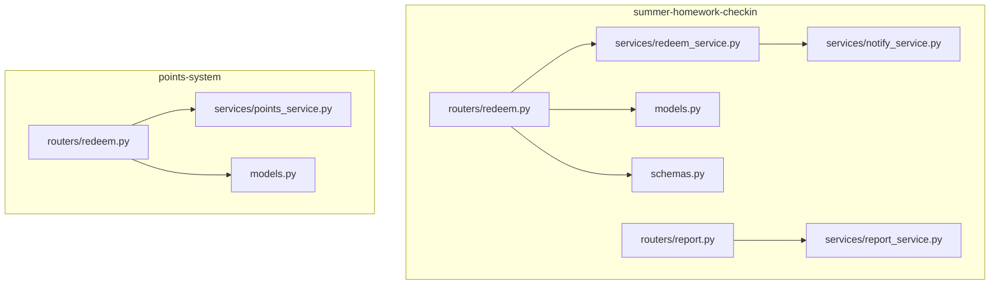
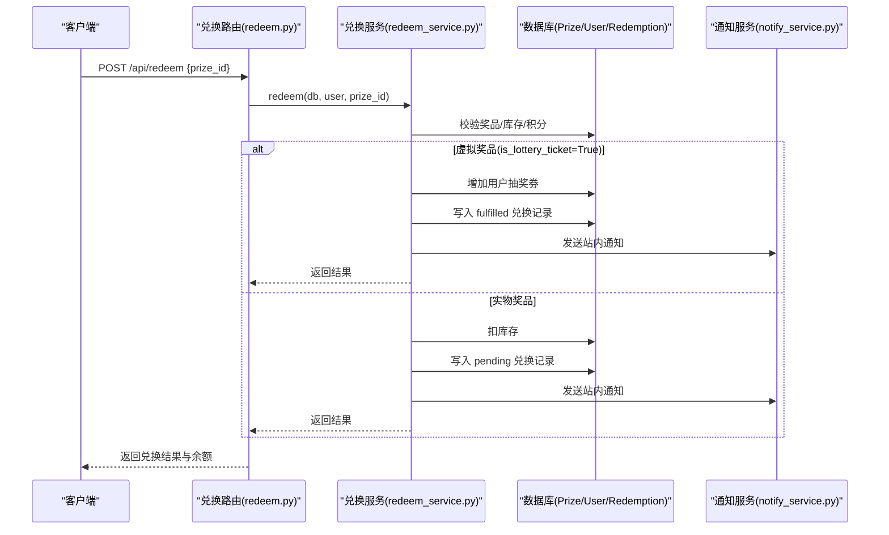
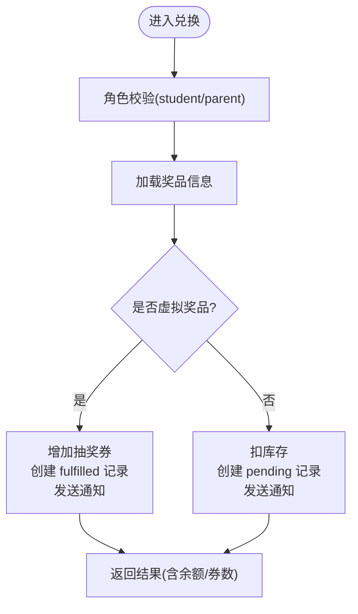
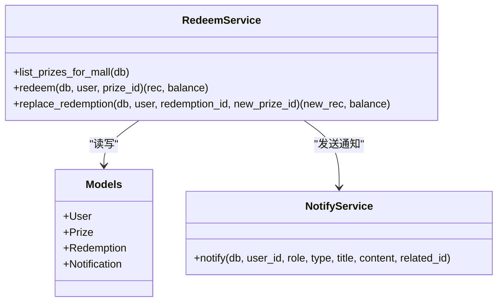
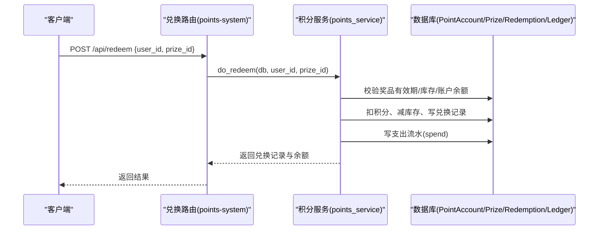
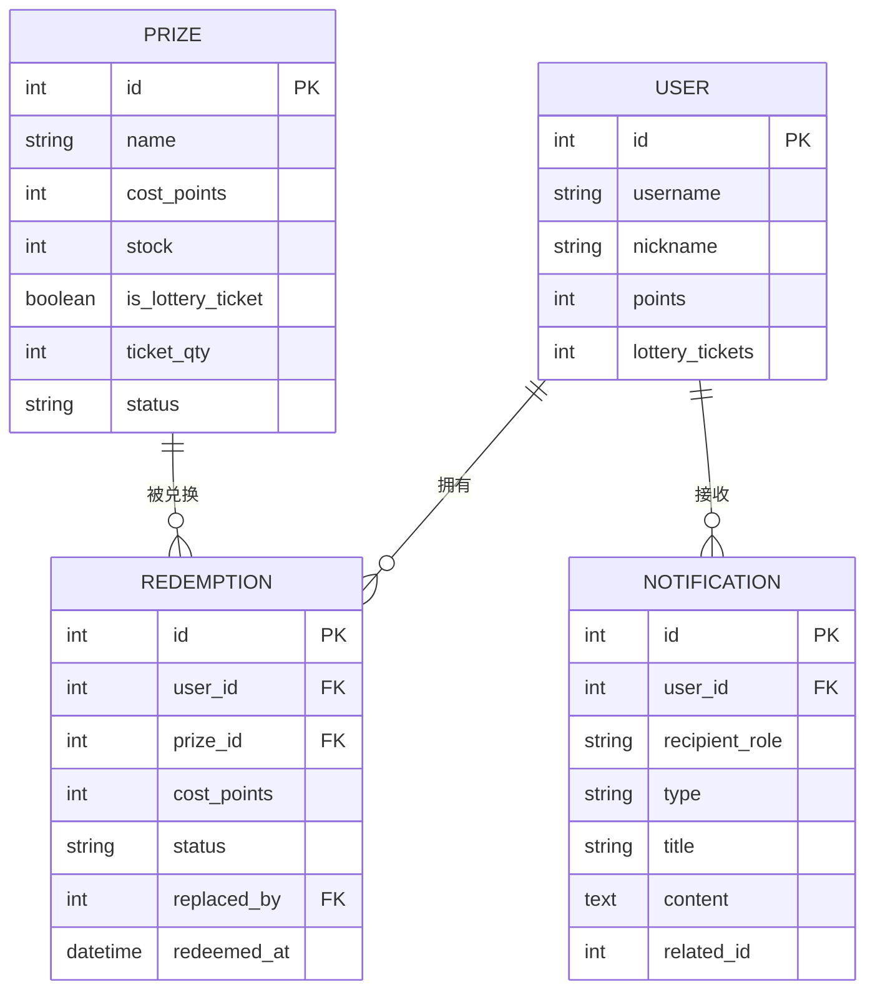
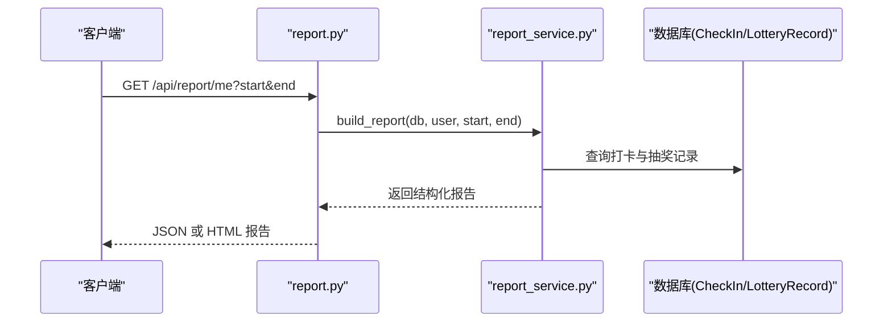
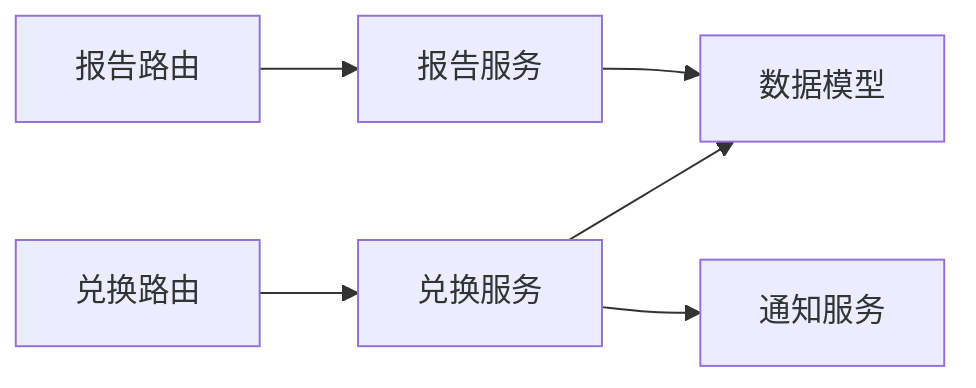

# 兑换服务

<cite>
**本文引用的文件列表**
- [points-system/backend/app/routers/redeem.py](file://points-system/backend/app/routers/redeem.py)
- [points-system/backend/app/services/points_service.py](file://points-system/backend/app/services/points_service.py)
- [points-system/backend/app/models.py](file://points-system/backend/app/models.py)
- [summer-homework-checkin/backend/app/routers/redeem.py](file://summer-homework-checkin/backend/app/routers/redeem.py)
- [summer-homework-checkin/backend/app/services/redeem_service.py](file://summer-homework-checkin/backend/app/services/redeem_service.py)
- [summer-homework-checkin/backend/app/schemas.py](file://summer-homework-checkin/backend/app/schemas.py)
- [summer-homework-checkin/backend/app/models.py](file://summer-homework-checkin/backend/app/models.py)
- [summer-homework-checkin/backend/app/services/notify_service.py](file://summer-homework-checkin/backend/app/services/notify_service.py)
- [summer-homework-checkin/backend/app/routers/report.py](file://summer-homework-checkin/backend/app/routers/report.py)
- [summer-homework-checkin/backend/app/services/report_service.py](file://summer-homework-checkin/backend/app/services/report_service.py)
</cite>

## 目录
1. [引言](#引言)
2. [项目结构](#项目结构)
3. [核心组件](#核心组件)
4. [架构总览](#架构总览)
5. [详细组件分析](#详细组件分析)
6. [依赖关系分析](#依赖关系分析)
7. [性能与一致性](#性能与一致性)
8. [异常处理与补偿机制](#异常处理与补偿机制)
9. [外部系统集成与数据同步](#外部系统集成与数据同步)
10. [故障排查指南](#故障排查指南)
11. [结论](#结论)

## 引言
本技术文档围绕“兑换服务”展开，覆盖积分扣除、库存检查、订单生成（兑换记录）、状态跟踪、不同兑换类型（虚拟物品即时发放与实物奖品待核实）的处理流程、兑换限制规则与业务约束、兑换历史查询统计与报表输出、异常处理与补偿策略，以及与外部系统的集成接口和数据同步策略。代码库包含两套实现：
- points-system：以独立账户与流水为核心的通用积分系统，提供基础的兑换能力。
- summer-homework-checkin：面向打卡场景的扩展实现，支持虚拟奖品（抽奖券）即时发放、实物奖品待管理员核实、替换兑换、站内通知等。

## 项目结构
本项目采用 FastAPI + SQLAlchemy 的后端分层结构，按路由层、服务层、模型层组织。兑换相关的关键路径如下：
- 路由层：接收请求、鉴权、参数校验、调用服务层。
- 服务层：封装业务逻辑（扣积分、减库存、写记录、发通知）。
- 模型层：定义数据库表结构与关系。
- 模式层（schemas）：定义请求/响应数据结构。

图表来源
- [summer-homework-checkin/backend/app/routers/redeem.py:1-81](file://summer-homework-checkin/backend/app/routers/redeem.py#L1-L81)
- [summer-homework-checkin/backend/app/services/redeem_service.py:1-168](file://summer-homework-checkin/backend/app/services/redeem_service.py#L1-L168)
- [summer-homework-checkin/backend/app/services/notify_service.py:1-20](file://summer-homework-checkin/backend/app/services/notify_service.py#L1-L20)
- [summer-homework-checkin/backend/app/routers/report.py:1-36](file://summer-homework-checkin/backend/app/routers/report.py#L1-L36)
- [summer-homework-checkin/backend/app/services/report_service.py:1-109](file://summer-homework-checkin/backend/app/services/report_service.py#L1-L109)
- [points-system/backend/app/routers/redeem.py:1-52](file://points-system/backend/app/routers/redeem.py#L1-L52)
- [points-system/backend/app/services/points_service.py:1-146](file://points-system/backend/app/services/points_service.py#L1-L146)

章节来源
- [summer-homework-checkin/backend/app/routers/redeem.py:1-81](file://summer-homework-checkin/backend/app/routers/redeem.py#L1-L81)
- [summer-homework-checkin/backend/app/services/redeem_service.py:1-168](file://summer-homework-checkin/backend/app/services/redeem_service.py#L1-L168)
- [summer-homework-checkin/backend/app/services/notify_service.py:1-20](file://summer-homework-checkin/backend/app/services/notify_service.py#L1-L20)
- [summer-homework-checkin/backend/app/routers/report.py:1-36](file://summer-homework-checkin/backend/app/routers/report.py#L1-L36)
- [summer-homework-checkin/backend/app/services/report_service.py:1-109](file://summer-homework-checkin/backend/app/services/report_service.py#L1-L109)
- [points-system/backend/app/routers/redeem.py:1-52](file://points-system/backend/app/routers/redeem.py#L1-L52)
- [points-system/backend/app/services/points_service.py:1-146](file://points-system/backend/app/services/points_service.py#L1-L146)

## 核心组件
- 兑换路由（summer-homework-checkin）
  - 聚合商城数据：余额、可兑奖品、我的兑换、抽奖记录。
  - 普通兑换：根据奖品类型分支处理（虚拟/实物）。
  - 替换兑换：将已有兑换替换为另一奖品，多退少补并回滚原库存。
- 兑换服务（summer-homework-checkin）
  - 校验：奖品存在、上架、成本有效、库存充足、用户积分足够。
  - 虚拟奖品：自动成功，增加抽奖券数量，创建 fulfilled 状态的兑换记录。
  - 实物奖品：扣库存，创建 pending 状态的兑换记录，等待管理员核实。
  - 通知：通过站内通知服务推送消息。
- 兑换路由（points-system）
  - 基础兑换：校验用户、奖品有效期、库存、余额；在同一事务内扣积分、减库存、写兑换记录与支出流水。
- 报告服务（summer-homework-checkin）
  - 汇总用户打卡、抽奖与完成度，并提供 HTML 可视化报告下载。

章节来源
- [summer-homework-checkin/backend/app/routers/redeem.py:1-81](file://summer-homework-checkin/backend/app/routers/redeem.py#L1-L81)
- [summer-homework-checkin/backend/app/services/redeem_service.py:1-168](file://summer-homework-checkin/backend/app/services/redeem_service.py#L1-L168)
- [points-system/backend/app/routers/redeem.py:1-52](file://points-system/backend/app/routers/redeem.py#L1-L52)
- [points-system/backend/app/services/points_service.py:1-146](file://points-system/backend/app/services/points_service.py#L1-L146)
- [summer-homework-checkin/backend/app/routers/report.py:1-36](file://summer-homework-checkin/backend/app/routers/report.py#L1-L36)
- [summer-homework-checkin/backend/app/services/report_service.py:1-109](file://summer-homework-checkin/backend/app/services/report_service.py#L1-L109)

## 架构总览
兑换服务在 summer-homework-checkin 中实现了更完整的业务流程，包括虚拟与实物两类奖品的差异化处理、替换兑换、站内通知与报表输出。points-system 提供了通用的积分账户与流水保障。

图表来源
- [summer-homework-checkin/backend/app/routers/redeem.py:48-69](file://summer-homework-checkin/backend/app/routers/redeem.py#L48-L69)
- [summer-homework-checkin/backend/app/services/redeem_service.py:22-94](file://summer-homework-checkin/backend/app/services/redeem_service.py#L22-L94)
- [summer-homework-checkin/backend/app/services/notify_service.py:5-13](file://summer-homework-checkin/backend/app/services/notify_service.py#L5-L13)

## 详细组件分析

### 兑换路由（summer-homework-checkin）
- GET /api/mall：聚合当前用户的积分、抽奖券、可兑奖品、我的兑换、抽奖记录。
- POST /api/redeem：执行兑换，区分虚拟与实物奖品，返回统一结果结构。
- POST /api/redeem/{rid}/replace：对已存在的兑换进行替换，支持多退少补与库存回滚。

图表来源
- [summer-homework-checkin/backend/app/routers/redeem.py:48-69](file://summer-homework-checkin/backend/app/routers/redeem.py#L48-L69)
- [summer-homework-checkin/backend/app/services/redeem_service.py:22-94](file://summer-homework-checkin/backend/app/services/redeem_service.py#L22-L94)

章节来源
- [summer-homework-checkin/backend/app/routers/redeem.py:1-81](file://summer-homework-checkin/backend/app/routers/redeem.py#L1-L81)

### 兑换服务（summer-homework-checkin）
- list_prizes_for_mall：仅返回上架且 cost_points > 0 的奖品。
- redeem：核心兑换逻辑，包含前置校验、分支处理、通知。
- replace_redemption：替换兑换，保证原子性（同一会话提交），涉及库存回滚与积分差额结算。

图表来源
- [summer-homework-checkin/backend/app/services/redeem_service.py:1-168](file://summer-homework-checkin/backend/app/services/redeem_service.py#L1-L168)
- [summer-homework-checkin/backend/app/services/notify_service.py:1-20](file://summer-homework-checkin/backend/app/services/notify_service.py#L1-L20)
- [summer-homework-checkin/backend/app/models.py:103-161](file://summer-homework-checkin/backend/app/models.py#L103-L161)

章节来源
- [summer-homework-checkin/backend/app/services/redeem_service.py:1-168](file://summer-homework-checkin/backend/app/services/redeem_service.py#L1-L168)

### 兑换路由（points-system）
- POST /api/redeem：基于独立账户与流水的通用兑换流程，确保事务一致性。
- GET /api/redemptions：查询某用户的兑换记录。

图表来源
- [points-system/backend/app/routers/redeem.py:11-28](file://points-system/backend/app/routers/redeem.py#L11-L28)
- [points-system/backend/app/services/points_service.py:94-146](file://points-system/backend/app/services/points_service.py#L94-L146)

章节来源
- [points-system/backend/app/routers/redeem.py:1-52](file://points-system/backend/app/routers/redeem.py#L1-L52)
- [points-system/backend/app/services/points_service.py:1-146](file://points-system/backend/app/services/points_service.py#L1-L146)

### 数据模型与状态机
- Prize：奖品主数据，支持 is_lottery_ticket 标记虚拟奖品、ticket_qty 指定每次兑换获得的券数。
- Redemption：兑换记录，支持状态 pending/fulfilled/replaced/cancelled，以及 replaced_by 指向新记录。
- Notification：站内通知，用于兑换事件的消息推送。

图表来源
- [summer-homework-checkin/backend/app/models.py:103-161](file://summer-homework-checkin/backend/app/models.py#L103-L161)
- [summer-homework-checkin/backend/app/models.py:163-176](file://summer-homework-checkin/backend/app/models.py#L163-L176)

章节来源
- [summer-homework-checkin/backend/app/models.py:103-161](file://summer-homework-checkin/backend/app/models.py#L103-L161)
- [summer-homework-checkin/backend/app/models.py:163-176](file://summer-homework-checkin/backend/app/models.py#L163-L176)

### 报表与统计
- GET /api/report/me：返回学生维度的学习报告（打卡、完成率、每周分布、中奖记录等）。
- GET /api/report/me/html：返回可视化的 HTML 报告，便于打印与下载。

图表来源
- [summer-homework-checkin/backend/app/routers/report.py:17-35](file://summer-homework-checkin/backend/app/routers/report.py#L17-L35)
- [summer-homework-checkin/backend/app/services/report_service.py:6-50](file://summer-homework-checkin/backend/app/services/report_service.py#L6-L50)

章节来源
- [summer-homework-checkin/backend/app/routers/report.py:1-36](file://summer-homework-checkin/backend/app/routers/report.py#L1-L36)
- [summer-homework-checkin/backend/app/services/report_service.py:1-109](file://summer-homework-checkin/backend/app/services/report_service.py#L1-L109)

## 依赖关系分析
- 路由层依赖服务层与模型层，服务层依赖数据库模型与通知服务。
- 兑换服务与通知服务解耦，通过函数调用传递上下文。
- 报告服务独立于兑换服务，但共享用户与抽奖记录数据。

图表来源
- [summer-homework-checkin/backend/app/routers/redeem.py:1-81](file://summer-homework-checkin/backend/app/routers/redeem.py#L1-L81)
- [summer-homework-checkin/backend/app/services/redeem_service.py:1-168](file://summer-homework-checkin/backend/app/services/redeem_service.py#L1-L168)
- [summer-homework-checkin/backend/app/services/notify_service.py:1-20](file://summer-homework-checkin/backend/app/services/notify_service.py#L1-L20)
- [summer-homework-checkin/backend/app/routers/report.py:1-36](file://summer-homework-checkin/backend/app/routers/report.py#L1-L36)
- [summer-homework-checkin/backend/app/services/report_service.py:1-109](file://summer-homework-checkin/backend/app/services/report_service.py#L1-L109)

章节来源
- [summer-homework-checkin/backend/app/routers/redeem.py:1-81](file://summer-homework-checkin/backend/app/routers/redeem.py#L1-L81)
- [summer-homework-checkin/backend/app/services/redeem_service.py:1-168](file://summer-homework-checkin/backend/app/services/redeem_service.py#L1-L168)
- [summer-homework-checkin/backend/app/services/notify_service.py:1-20](file://summer-homework-checkin/backend/app/services/notify_service.py#L1-L20)
- [summer-homework-checkin/backend/app/routers/report.py:1-36](file://summer-homework-checkin/backend/app/routers/report.py#L1-L36)
- [summer-homework-checkin/backend/app/services/report_service.py:1-109](file://summer-homework-checkin/backend/app/services/report_service.py#L1-L109)

## 性能与一致性
- 事务一致性：所有读-改-写操作在同一会话内完成，commit 前不持久化，失败时 rollback，避免半更新。
- 并发控制：SQLite 行锁有限，依赖单事务原子性；若迁移至 PostgreSQL，可在关键资源上加悲观锁提升并发安全。
- 索引优化：用户、奖品、兑换记录常用查询字段建立索引以提升检索性能。
- 批量操作：报表生成按需分页与过滤，避免一次性拉取全量数据。

[本节为通用性能建议，不直接分析具体文件]

## 异常处理与补偿机制
- 前置校验失败：奖品不存在、下架、未开始/过期、库存不足、积分不足，均返回明确错误码与提示。
- 重复操作保护：替换兑换时对原记录状态进行校验，防止重复替换或取消。
- 事务回滚：任何中间步骤失败，整体回滚，保证积分与库存一致。
- 通知幂等：通知写入独立事务，不影响主流程；如需强一致，可将通知纳入主事务或引入消息队列重试。

章节来源
- [summer-homework-checkin/backend/app/services/redeem_service.py:22-94](file://summer-homework-checkin/backend/app/services/redeem_service.py#L22-L94)
- [summer-homework-checkin/backend/app/services/redeem_service.py:97-168](file://summer-homework-checkin/backend/app/services/redeem_service.py#L97-L168)
- [points-system/backend/app/services/points_service.py:94-146](file://points-system/backend/app/services/points_service.py#L94-L146)

## 外部系统集成与数据同步
- 站内通知：通过 notify_service 写入 Notification 表，供前端展示。
- 物流对接（规划）：对于实物奖品，pending 状态需后续由管理员核实后触发发货流程。建议在审核通过后调用外部物流 API，并回写物流单号到兑换记录的备注字段。
- 数据同步策略：
  - 实时同步：兑换成功后立即写入兑换记录与通知，保证前端可见。
  - 异步补偿：如外部系统不可用，使用任务队列重试，并在本地记录补偿日志，定期核对差异。
  - 审计追踪：保留操作人、时间与备注，便于问题定位与合规审计。

章节来源
- [summer-homework-checkin/backend/app/services/notify_service.py:1-20](file://summer-homework-checkin/backend/app/services/notify_service.py#L1-L20)
- [summer-homework-checkin/backend/app/models.py:163-176](file://summer-homework-checkin/backend/app/models.py#L163-L176)

## 故障排查指南
- 常见问题
  - 积分不足：检查用户 points 与奖品 cost_points，确认未发生并发扣减导致负余额。
  - 库存不足：检查奖品 stock 是否为 0 或负值，确认是否存在超卖。
  - 兑换记录状态异常：检查是否已被替换或取消，确认 replaced_by 指向是否正确。
  - 通知未送达：检查 Notification 表是否有记录，确认前端轮询或 WebSocket 是否正常。
- 定位方法
  - 查看兑换路由与服务层日志，确认异常抛出位置与错误码。
  - 核对数据库事务提交情况，确认 commit 是否成功。
  - 对比 PointLedger（points-system）或用户积分字段变化，验证收支一致性。

章节来源
- [summer-homework-checkin/backend/app/routers/redeem.py:48-69](file://summer-homework-checkin/backend/app/routers/redeem.py#L48-L69)
- [summer-homework-checkin/backend/app/services/redeem_service.py:22-94](file://summer-homework-checkin/backend/app/services/redeem_service.py#L22-L94)
- [points-system/backend/app/services/points_service.py:94-146](file://points-system/backend/app/services/points_service.py#L94-L146)

## 结论
兑换服务在 summer-homework-checkin 中实现了完整的业务流程与状态管理，支持虚拟与实物两类奖品的差异化处理、替换兑换与站内通知；points-system 提供了通用积分账户与流水保障。通过事务一致性、前置校验与明确的错误码，系统在功能与可靠性上具备良好基础。未来可扩展外部物流对接与异步补偿机制，进一步提升生产环境的健壮性与可观测性。