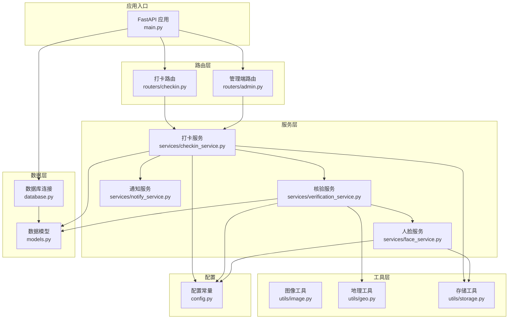
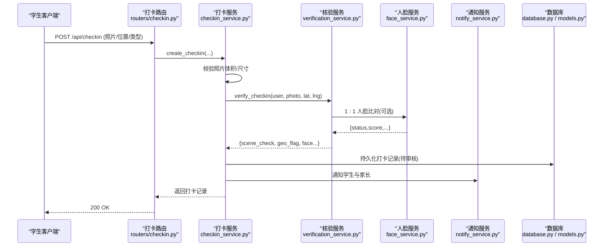
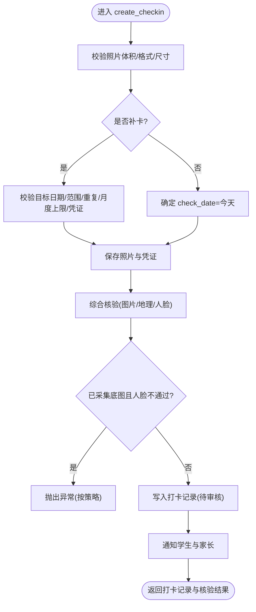
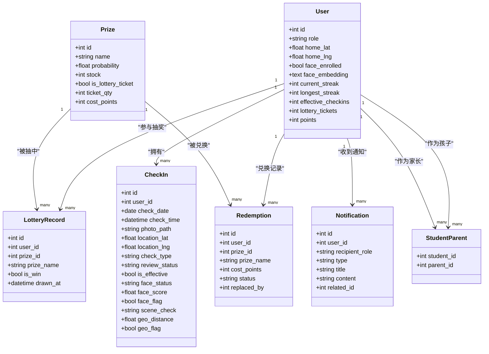
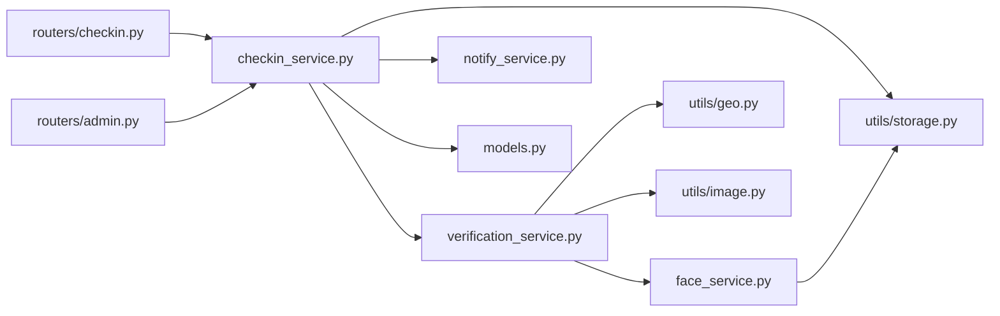

# 打卡服务

<cite>
**本文引用的文件**   
- [main.py](file://summer-homework-checkin/backend/app/main.py)
- [models.py](file://summer-homework-checkin/backend/app/models.py)
- [schemas.py](file://summer-homework-checkin/backend/app/schemas.py)
- [config.py](file://summer-homework-checkin/backend/app/config.py)
- [checkin_service.py](file://summer-homework-checkin/backend/app/services/checkin_service.py)
- [verification_service.py](file://summer-homework-checkin/backend/app/services/verification_service.py)
- [face_service.py](file://summer-homework-checkin/backend/app/services/face_service.py)
- [notify_service.py](file://summer-homework-checkin/backend/app/services/notify_service.py)
- [geo.py](file://summer-homework-checkin/backend/app/utils/geo.py)
- [image.py](file://summer-homework-checkin/backend/app/utils/image.py)
- [storage.py](file://summer-homework-checkin/backend/app/utils/storage.py)
- [database.py](file://summer-homework-checkin/backend/app/database.py)
- [routers/checkin.py](file://summer-homework-checkin/backend/app/routers/checkin.py)
- [routers/admin.py](file://summer-homework-checkin/backend/app/routers/admin.py)
</cite>

## 目录
1. [简介](#简介)
2. [项目结构](#项目结构)
3. [核心组件](#核心组件)
4. [架构总览](#架构总览)
5. [详细组件分析](#详细组件分析)
6. [依赖关系分析](#依赖关系分析)
7. [性能与可扩展性](#性能与可扩展性)
8. [故障排查指南](#故障排查指南)
9. [结论](#结论)
10. [附录](#附录)

## 简介
本技术文档围绕“暑假作业打卡系统”的打卡服务展开，聚焦以下目标：
- 正常打卡与补卡流程的核心逻辑与边界条件
- 连续天数计算算法、积分发放机制与抽奖资格解锁规则
- 打卡记录生命周期管理（提交—审核通过/拒绝）
- 照片验证、地理位置校验与人脸识别集成方式
- 异常处理策略与事务管理机制
- 通知系统集成与用户状态更新逻辑

## 项目结构
后端采用 FastAPI + SQLAlchemy（SQLite）分层架构：
- 路由层：HTTP 接口定义与参数绑定
- 服务层：业务编排与规则实现
- 工具层：图片解析、地理距离、文件存储等通用能力
- 数据模型层：ORM 实体与关系映射
- 配置层：阈值、开关、统计窗口等可配置项

图表来源
- [main.py:1-49](file://summer-homework-checkin/backend/app/main.py#L1-L49)
- [routers/checkin.py:1-80](file://summer-homework-checkin/backend/app/routers/checkin.py#L1-L80)
- [routers/admin.py:1-214](file://summer-homework-checkin/backend/app/routers/admin.py#L1-L214)
- [checkin_service.py:1-254](file://summer-homework-checkin/backend/app/services/checkin_service.py#L1-L254)
- [verification_service.py:1-71](file://summer-homework-checkin/backend/app/services/verification_service.py#L1-L71)
- [face_service.py:1-133](file://summer-homework-checkin/backend/app/services/face_service.py#L1-L133)
- [notify_service.py:1-20](file://summer-homework-checkin/backend/app/services/notify_service.py#L1-L20)
- [image.py:1-61](file://summer-homework-checkin/backend/app/utils/image.py#L1-L61)
- [geo.py:1-24](file://summer-homework-checkin/backend/app/utils/geo.py#L1-L24)
- [storage.py:1-24](file://summer-homework-checkin/backend/app/utils/storage.py#L1-L24)
- [database.py:1-22](file://summer-homework-checkin/backend/app/database.py#L1-L22)
- [models.py:1-212](file://summer-homework-checkin/backend/app/models.py#L1-L212)
- [config.py:1-50](file://summer-homework-checkin/backend/app/config.py#L1-L50)

章节来源
- [main.py:1-49](file://summer-homework-checkin/backend/app/main.py#L1-L49)
- [database.py:1-22](file://summer-homework-checkin/backend/app/database.py#L1-L22)
- [config.py:1-50](file://summer-homework-checkin/backend/app/config.py#L1-L50)

## 核心组件
- 打卡服务（checkin_service）：封装正常打卡、补卡、审核通过/拒绝、连续天数重算、积分发放、抽奖资格解锁与通知。
- 核验服务（verification_service）：聚合图片合规、地理位置一致性、人脸识别 1:1 比对，输出场景风险等级。
- 人脸服务（face_service）：基于 insightface 的人脸检测与特征提取，提供注册采集与 1:1 比对。
- 通知服务（notify_service）：站内通知写入与家长联动通知。
- 工具层：图片解析（image）、地理距离（geo）、文件存储（storage）。
- 数据模型（models）：用户、打卡记录、奖品、兑换、通知、家长绑定等实体。
- 路由层：学生端打卡与管理端审核接口。

章节来源
- [checkin_service.py:1-254](file://summer-homework-checkin/backend/app/services/checkin_service.py#L1-L254)
- [verification_service.py:1-71](file://summer-homework-checkin/backend/app/services/verification_service.py#L1-L71)
- [face_service.py:1-133](file://summer-homework-checkin/backend/app/services/face_service.py#L1-L133)
- [notify_service.py:1-20](file://summer-homework-checkin/backend/app/services/notify_service.py#L1-L20)
- [image.py:1-61](file://summer-homework-checkin/backend/app/utils/image.py#L1-L61)
- [geo.py:1-24](file://summer-homework-checkin/backend/app/utils/geo.py#L1-L24)
- [storage.py:1-24](file://summer-homework-checkin/backend/app/utils/storage.py#L1-L24)
- [models.py:1-212](file://summer-homework-checkin/backend/app/models.py#L1-L212)
- [routers/checkin.py:1-80](file://summer-homework-checkin/backend/app/routers/checkin.py#L1-L80)
- [routers/admin.py:1-214](file://summer-homework-checkin/backend/app/routers/admin.py#L1-L214)

## 架构总览
从请求到落库的关键路径如下：
- 学生端提交打卡：路由接收表单与文件 → 调用打卡服务创建记录 → 触发核验（图片/地理/人脸）→ 保存记录并通知本人及家长 → 返回结果。
- 管理端审核：路由获取待审记录 → 调用打卡服务批准/拒绝 → 更新有效性与积分 → 重算连续天数与抽奖资格 → 发送通知。

图表来源
- [routers/checkin.py:17-37](file://summer-homework-checkin/backend/app/routers/checkin.py#L17-L37)
- [checkin_service.py:64-163](file://summer-homework-checkin/backend/app/services/checkin_service.py#L64-L163)
- [verification_service.py:19-71](file://summer-homework-checkin/backend/app/services/verification_service.py#L19-L71)
- [face_service.py:99-125](file://summer-homework-checkin/backend/app/services/face_service.py#L99-L125)
- [notify_service.py:5-20](file://summer-homework-checkin/backend/app/services/notify_service.py#L5-L20)
- [database.py:16-22](file://summer-homework-checkin/backend/app/database.py#L16-L22)
- [models.py:70-96](file://summer-homework-checkin/backend/app/models.py#L70-L96)

## 详细组件分析

### 打卡服务（checkin_service）
职责与要点：
- 正常打卡：当日日期；允许多次提交但需逐条审核；审核通过后计入有效打卡。
- 补卡：仅能补过去日期且在暑假统计范围内；同一天不可重复补；单自然月有上限；需上传凭证。
- 防代打卡：照片合规校验、地理位置一致性、人脸识别 1:1 比对；已采集底图且人脸不通过时按策略拦截或降级。
- 审核通过：标记有效、发放积分、重算连续天数与抽奖资格、发送通知。
- 审核拒绝：标记无效、发送通知。
- 连续天数与里程碑：按有效打卡日期排序计算当前连续与历史最长；每达到 7 天里程碑自动发放抽奖券并记录通知。

关键流程图（创建打卡）：

图表来源
- [checkin_service.py:64-163](file://summer-homework-checkin/backend/app/services/checkin_service.py#L64-L163)
- [image.py:51-61](file://summer-homework-checkin/backend/app/utils/image.py#L51-L61)
- [verification_service.py:19-71](file://summer-homework-checkin/backend/app/services/verification_service.py#L19-L71)
- [face_service.py:99-125](file://summer-homework-checkin/backend/app/services/face_service.py#L99-L125)

连续天数与积分/抽奖规则：
- 连续天数：对有效打卡日期去重排序，遍历计算最长连续段；若最近有效日为今天或昨天，则倒推得到当前连续天数。
- 积分发放：正常打卡与补卡分别对应不同分值；审核通过即加至用户积分余额。
- 抽奖资格：当 current_streak // 7 超过上次里程碑时，差额即为新增抽奖券数量，并写入通知。

章节来源
- [checkin_service.py:12-62](file://summer-homework-checkin/backend/app/services/checkin_service.py#L12-L62)
- [checkin_service.py:166-209](file://summer-homework-checkin/backend/app/services/checkin_service.py#L166-L209)
- [config.py:34-42](file://summer-homework-checkin/backend/app/config.py#L34-L42)

### 核验服务（verification_service）
职责与要点：
- 图片基础校验：调用 image.validate_photo 确保非占位图/缩略图。
- 地理位置一致性：计算距常用位置距离，超过阈值标记风险。
- 人脸识别 1:1 比对：调用 face_service.verify，结合策略决定 scene_check 与 risk。
- 输出结构化结果供打卡服务使用。

章节来源
- [verification_service.py:1-71](file://summer-homework-checkin/backend/app/services/verification_service.py#L1-L71)
- [image.py:51-61](file://summer-homework-checkin/backend/app/utils/image.py#L51-L61)
- [geo.py:6-24](file://summer-homework-checkin/backend/app/utils/geo.py#L6-L24)
- [face_service.py:99-125](file://summer-homework-checkin/backend/app/services/face_service.py#L99-L125)

### 人脸服务（face_service）
职责与要点：
- 懒加载 insightface 分析器，CPU 模式运行，支持模型下载与缓存。
- enroll：要求检测到且仅一张人脸，生成 512 维 embedding 并持久化。
- verify：现场照与底图进行余弦相似度比对，超过阈值判定为本人。
- 可用性探测：is_available 用于健康检查与降级提示。

章节来源
- [face_service.py:1-133](file://summer-homework-checkin/backend/app/services/face_service.py#L1-L133)
- [config.py:41-49](file://summer-homework-checkin/backend/app/config.py#L41-L49)

### 通知服务（notify_service）
职责与要点：
- notify：向指定用户写入站内通知。
- notify_parents_of_student：根据家长-孩子绑定关系，批量推送通知给家长。

章节来源
- [notify_service.py:1-20](file://summer-homework-checkin/backend/app/services/notify_service.py#L1-L20)
- [models.py:163-176](file://summer-homework-checkin/backend/app/models.py#L163-L176)

### 路由层（学生端与管理端）
- 学生端打卡：POST /api/checkin，支持 normal/makeup 两种类型，携带照片、位置、补卡原因与目标日期等。
- 今日状态与连续天数：GET /api/checkin/today 与 GET /api/checkin/streak。
- 管理端审核：PUT /api/admin/checkins/{id}/review，支持 approved/rejected，批准后自动发放积分并重算连续天数。

章节来源
- [routers/checkin.py:17-80](file://summer-homework-checkin/backend/app/routers/checkin.py#L17-L80)
- [routers/admin.py:84-103](file://summer-homework-checkin/backend/app/routers/admin.py#L84-L103)

### 数据模型与关系
核心实体与关键字段：
- User：角色、家庭坐标、人脸信息、连续天数、积分、抽奖券等统计字段。
- CheckIn：打卡记录，含地点、人脸与场景检查结果、审核状态、有效性等。
- Prize/LotteryRecord/Redemption：奖品、抽奖记录、积分兑换记录。
- Notification：站内通知。
- StudentParent：家长与孩子绑定关系。

图表来源
- [models.py:11-55](file://summer-homework-checkin/backend/app/models.py#L11-L55)
- [models.py:70-96](file://summer-homework-checkin/backend/app/models.py#L70-L96)
- [models.py:103-139](file://summer-homework-checkin/backend/app/models.py#L103-L139)
- [models.py:141-161](file://summer-homework-checkin/backend/app/models.py#L141-L161)
- [models.py:163-176](file://summer-homework-checkin/backend/app/models.py#L163-L176)
- [models.py:57-68](file://summer-homework-checkin/backend/app/models.py#L57-L68)

## 依赖关系分析
- 路由层依赖服务层与依赖注入（数据库会话、当前用户）。
- 服务层依赖工具层（图片、地理、存储）与数据模型。
- 人脸服务依赖外部库 insightface，具备降级策略。
- 通知服务依赖模型与数据库会话。

图表来源
- [routers/checkin.py:1-80](file://summer-homework-checkin/backend/app/routers/checkin.py#L1-L80)
- [routers/admin.py:1-214](file://summer-homework-checkin/backend/app/routers/admin.py#L1-L214)
- [checkin_service.py:1-254](file://summer-homework-checkin/backend/app/services/checkin_service.py#L1-L254)
- [verification_service.py:1-71](file://summer-homework-checkin/backend/app/services/verification_service.py#L1-L71)
- [face_service.py:1-133](file://summer-homework-checkin/backend/app/services/face_service.py#L1-L133)
- [notify_service.py:1-20](file://summer-homework-checkin/backend/app/services/notify_service.py#L1-L20)
- [image.py:1-61](file://summer-homework-checkin/backend/app/utils/image.py#L1-L61)
- [geo.py:1-24](file://summer-homework-checkin/backend/app/utils/geo.py#L1-L24)
- [storage.py:1-24](file://summer-homework-checkin/backend/app/utils/storage.py#L1-L24)
- [models.py:1-212](file://summer-homework-checkin/backend/app/models.py#L1-L212)

章节来源
- [routers/checkin.py:1-80](file://summer-homework-checkin/backend/app/routers/checkin.py#L1-L80)
- [routers/admin.py:1-214](file://summer-homework-checkin/backend/app/routers/admin.py#L1-L214)
- [checkin_service.py:1-254](file://summer-homework-checkin/backend/app/services/checkin_service.py#L1-L254)

## 性能与可扩展性
- 人脸模型懒加载与线程锁保护，避免重复初始化；首次调用按需下载模型，后续复用。
- 图片解析轻量实现，避免引入重型图像处理库，降低依赖与启动开销。
- SQLite 适合轻量部署；生产环境可替换为更健壮的数据库以增强并发与可靠性。
- 连续天数计算在用户维度进行，时间复杂度 O(n)，n 为有效打卡日数，通常较小。
- 建议：
  - 将通知写入改为异步队列，避免阻塞主流程。
  - 人脸比对失败时的重试与熔断策略，提升鲁棒性。
  - 对热点查询（今日状态、连续天数）增加缓存层。

[本节为通用指导，无需源码引用]

## 故障排查指南
常见问题与定位思路：
- 人脸服务不可用：
  - 现象：返回 model_unavailable 或 503。
  - 排查：确认 insightface 安装与环境变量 FACE_MODEL_NAME/FACE_DET_SIZE；查看 is_available 健康检查。
  - 参考：[face_service.py:28-46](file://summer-homework-checkin/backend/app/services/face_service.py#L28-L46)、[face_service.py:128-133](file://summer-homework-checkin/backend/app/services/face_service.py#L128-L133)
- 照片不符合要求：
  - 现象：体积过小/过大、非 JPEG/PNG、尺寸过低。
  - 排查：检查 MIN_PHOTO_BYTES/MIN_PHOTO_DIM/PHOTO_MAX_BYTES 配置；确认前端压缩策略。
  - 参考：[image.py:51-61](file://summer-homework-checkin/backend/app/utils/image.py#L51-L61)、[config.py:27-33](file://summer-homework-checkin/backend/app/config.py#L27-L33)
- 地理位置风险：
  - 现象：geo_flag=True，scene_check=warn。
  - 排查：核对 home_lat/home_lng 与上报坐标；调整 GEO_THRESHOLD_METERS。
  - 参考：[geo.py:6-24](file://summer-homework-checkin/backend/app/utils/geo.py#L6-L24)、[config.py:27-28](file://summer-homework-checkin/backend/app/config.py#L27-L28)
- 补卡失败：
  - 现象：目标日期无效、超出暑假范围、重复补卡、月度上限。
  - 排查：检查 makeup_for_date 格式与范围；确认当月已用次数。
  - 参考：[checkin_service.py:72-103](file://summer-homework-checkin/backend/app/services/checkin_service.py#L72-L103)
- 审核未生效：
  - 现象：批准后未获得积分或未重算连续天数。
  - 排查：确认管理员路由调用 approve_checkin；检查事务提交顺序与通知是否发出。
  - 参考：[routers/admin.py:84-103](file://summer-homework-checkin/backend/app/routers/admin.py#L84-L103)、[checkin_service.py:166-191](file://summer-homework-checkin/backend/app/services/checkin_service.py#L166-L191)

章节来源
- [face_service.py:28-46](file://summer-homework-checkin/backend/app/services/face_service.py#L28-L46)
- [face_service.py:128-133](file://summer-homework-checkin/backend/app/services/face_service.py#L128-L133)
- [image.py:51-61](file://summer-homework-checkin/backend/app/utils/image.py#L51-L61)
- [config.py:27-33](file://summer-homework-checkin/backend/app/config.py#L27-L33)
- [geo.py:6-24](file://summer-homework-checkin/backend/app/utils/geo.py#L6-L24)
- [checkin_service.py:72-103](file://summer-homework-checkin/backend/app/services/checkin_service.py#L72-L103)
- [routers/admin.py:84-103](file://summer-homework-checkin/backend/app/routers/admin.py#L84-L103)
- [checkin_service.py:166-191](file://summer-homework-checkin/backend/app/services/checkin_service.py#L166-L191)

## 结论
打卡服务通过清晰的分层设计与完善的校验策略，实现了从提交到审核的全链路闭环。其亮点包括：
- 严格的照片与地理位置校验，结合人脸识别 1:1 比对，显著降低代打卡风险。
- 明确的连续天数计算与里程碑奖励机制，激励持续打卡。
- 灵活的补卡规则与月度上限控制，兼顾用户体验与公平性。
- 完善的通知体系，及时同步学生与家长。

在生产环境中，建议引入异步通知、缓存与更强的数据库支撑，进一步提升稳定性与扩展性。

[本节为总结，无需源码引用]

## 附录

### API 概览（学生端）
- POST /api/checkin：提交打卡（normal/makeup），返回打卡记录。
- GET /api/checkin/today：查询今日打卡状态。
- GET /api/checkin/streak：查询连续天数、有效次数、剩余补卡次数等。
- GET /api/checkin/history：查询历史打卡记录。

章节来源
- [routers/checkin.py:17-80](file://summer-homework-checkin/backend/app/routers/checkin.py#L17-L80)

### API 概览（管理端）
- PUT /api/admin/checkins/{id}/review：审核打卡记录（approved/rejected）。
- GET /api/admin/stats：系统统计概览。
- GET /api/admin/users：用户列表。
- GET /api/admin/checkins：打卡记录列表。

章节来源
- [routers/admin.py:16-103](file://summer-homework-checkin/backend/app/routers/admin.py#L16-L103)

### 配置项速览
- 地理阈值：GEO_THRESHOLD_METERS
- 补卡上限：MAX_MAKEUP_PER_MONTH
- 照片限制：MIN_PHOTO_BYTES、MIN_PHOTO_DIM、PHOTO_MAX_BYTES
- 抽奖门槛：LOTTERY_STREAK_THRESHOLD
- 积分规则：CHECKIN_POINTS、MAKEUP_POINTS
- 人脸策略：FACE_MATCH_THRESHOLD、FACE_MODE_ON_ENROLLED、FACE_DET_SIZE、FACE_MODEL_NAME

章节来源
- [config.py:27-50](file://summer-homework-checkin/backend/app/config.py#L27-L50)