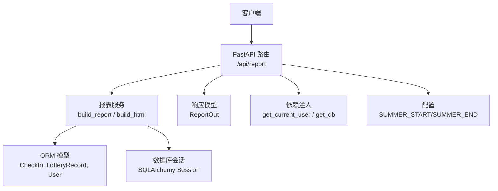
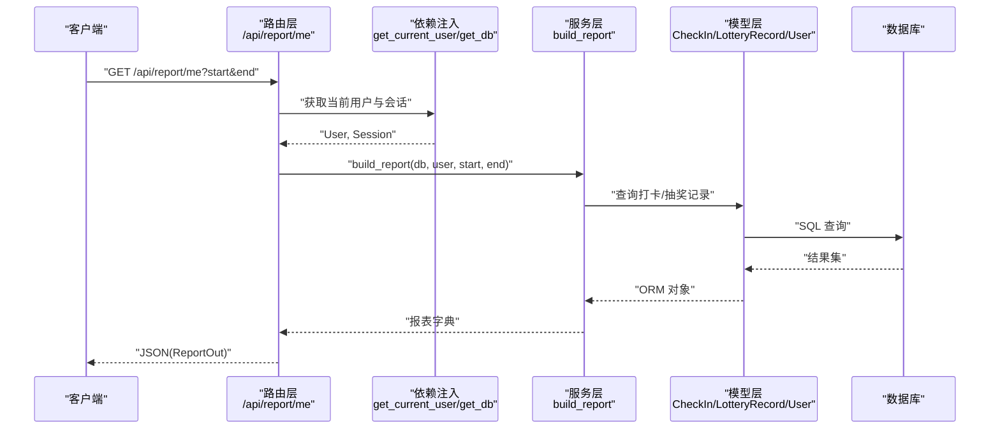
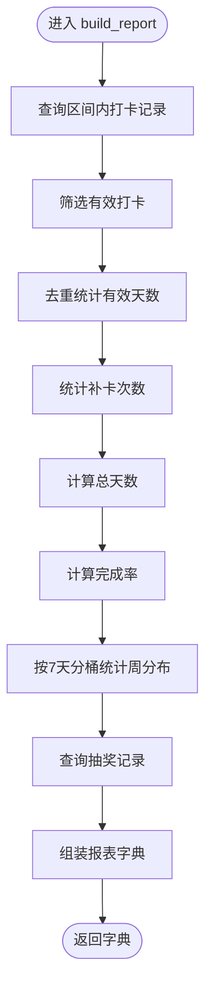
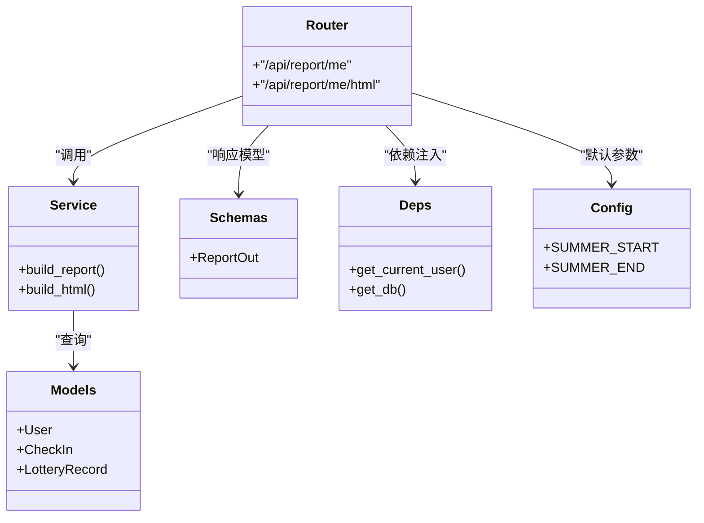
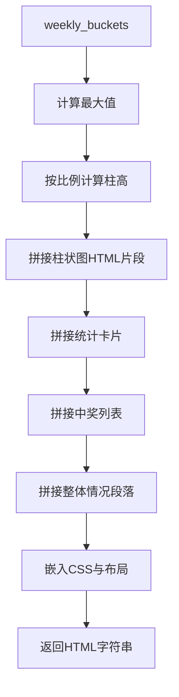

# 报表服务

<cite>
**本文引用的文件**   
- [report.py](file://summer-homework-checkin/backend/app/routers/report.py)
- [report_service.py](file://summer-homework-checkin/backend/app/services/report_service.py)
- [models.py](file://summer-homework-checkin/backend/app/models.py)
- [schemas.py](file://summer-homework-checkin/backend/app/schemas.py)
- [deps.py](file://summer-homework-checkin/backend/app/deps.py)
- [database.py](file://summer-homework-checkin/backend/app/database.py)
- [config.py](file://summer-homework-checkin/backend/app/config.py)
</cite>

## 目录
1. [简介](#简介)
2. [项目结构](#项目结构)
3. [核心组件](#核心组件)
4. [架构总览](#架构总览)
5. [详细组件分析](#详细组件分析)
6. [依赖关系分析](#依赖关系分析)
7. [性能与大数据优化](#性能与大数据优化)
8. [可视化数据生成流程](#可视化数据生成流程)
9. [多维度报表构建方法](#多维度报表构建方法)
10. [自定义报表接口与模板系统](#自定义报表接口与模板系统)
11. [导出功能与格式支持](#导出功能与格式支持)
12. [数据权限控制与访问审计](#数据权限控制与访问审计)
13. [故障排查指南](#故障排查指南)
14. [结论](#结论)

## 简介
本技术文档围绕“暑假作业打卡”系统中的报表服务，系统性阐述数据统计与分析引擎的实现，包括打卡率统计、学习进度分析与趋势展示；说明可视化数据的生成与处理流程；给出多维度报表的构建思路（按班级、个人、时间维度）；提供大数据量查询优化与缓存策略建议；定义可扩展的自定义报表接口与模板体系；说明导出能力与格式支持（HTML/打印、PDF、Excel等）；并完善数据权限控制与访问审计机制。

## 项目结构
当前仓库包含多个子项目，本次文档聚焦 summer-homework-checkin 后端的报表相关实现。关键路径如下：
- 路由层：/api/report/*
- 服务层：报告聚合与 HTML 渲染
- 模型层：用户、打卡记录、抽奖记录等
- 模式层：Pydantic 输出模型
- 依赖注入：认证与数据库会话
- 配置：默认统计周期、存储路径等

图表来源
- [report.py:1-36](file://summer-homework-checkin/backend/app/routers/report.py#L1-L36)
- [report_service.py:1-109](file://summer-homework-checkin/backend/app/services/report_service.py#L1-L109)
- [models.py:70-139](file://summer-homework-checkin/backend/app/models.py#L70-L139)
- [schemas.py:215-230](file://summer-homework-checkin/backend/app/schemas.py#L215-L230)
- [deps.py:13-25](file://summer-homework-checkin/backend/app/deps.py#L13-L25)
- [database.py:16-22](file://summer-homework-checkin/backend/app/database.py#L16-L22)
- [config.py:27-29](file://summer-homework-checkin/backend/app/config.py#L27-L29)

章节来源
- [report.py:1-36](file://summer-homework-checkin/backend/app/routers/report.py#L1-L36)
- [report_service.py:1-109](file://summer-homework-checkin/backend/app/services/report_service.py#L1-L109)
- [models.py:70-139](file://summer-homework-checkin/backend/app/models.py#L70-L139)
- [schemas.py:215-230](file://summer-homework-checkin/backend/app/schemas.py#L215-L230)
- [deps.py:13-25](file://summer-homework-checkin/backend/app/deps.py#L13-L25)
- [database.py:16-22](file://summer-homework-checkin/backend/app/database.py#L16-L22)
- [config.py:27-29](file://summer-homework-checkin/backend/app/config.py#L27-L29)

## 核心组件
- 路由层
  - GET /api/report/me：返回学生个人的 JSON 报表（ReportOut）。
  - GET /api/report/me/html：返回可打印的 HTML 报表页面。
- 服务层
  - build_report：基于日期区间聚合打卡与抽奖数据，计算完成率、周分布、连续打卡等指标。
  - build_html：将报表数据渲染为卡通风格 HTML，内置柱状图与统计卡片，支持浏览器打印。
- 数据模型
  - CheckIn：打卡记录，含有效标记、补卡类型、审核状态等。
  - LotteryRecord：抽奖行为记录，含中奖结果与时间。
  - User：用户信息，含角色、连续打卡、积分等冗余统计字段。
- 模式层
  - ReportOut：JSON 报表输出结构，包含基础指标与可视化所需数组。
- 依赖注入
  - get_current_user：校验 Bearer Token，解析用户身份。
  - get_db：提供 SQLAlchemy 会话。
- 配置
  - SUMMER_START/SUMMER_END：默认统计窗口（暑假全周期）。

章节来源
- [report.py:17-35](file://summer-homework-checkin/backend/app/routers/report.py#L17-L35)
- [report_service.py:6-50](file://summer-homework-checkin/backend/app/services/report_service.py#L6-L50)
- [report_service.py:53-108](file://summer-homework-checkin/backend/app/services/report_service.py#L53-L108)
- [models.py:70-139](file://summer-homework-checkin/backend/app/models.py#L70-L139)
- [schemas.py:215-230](file://summer-homework-checkin/backend/app/schemas.py#L215-L230)
- [deps.py:13-25](file://summer-homework-checkin/backend/app/deps.py#L13-L25)
- [database.py:16-22](file://summer-homework-checkin/backend/app/database.py#L16-L22)
- [config.py:27-29](file://summer-homework-checkin/backend/app/config.py#L27-L29)

## 架构总览
报表服务采用 FastAPI 路由 + 服务层 + ORM 模型的三层结构。路由负责鉴权与参数校验，服务层进行数据聚合与可视化渲染，模型层映射数据库表。

图表来源
- [report.py:17-24](file://summer-homework-checkin/backend/app/routers/report.py#L17-L24)
- [report_service.py:6-50](file://summer-homework-checkin/backend/app/services/report_service.py#L6-L50)
- [models.py:70-139](file://summer-homework-checkin/backend/app/models.py#L70-L139)
- [deps.py:13-25](file://summer-homework-checkin/backend/app/deps.py#L13-L25)
- [database.py:16-22](file://summer-homework-checkin/backend/app/database.py#L16-L22)

## 详细组件分析

### 路由层：/api/report
- 职责
  - 接收请求参数（start/end），执行角色校验（仅学生可查看自己的报告）。
  - 调用服务层生成报表数据，并以 JSON 或 HTML 形式返回。
- 关键点
  - 使用 Depends(get_current_user) 确保身份合法。
  - 使用 Depends(get_db) 获取数据库会话。
  - 使用 config 中的默认统计周期作为参数默认值。

章节来源
- [report.py:17-35](file://summer-homework-checkin/backend/app/routers/report.py#L17-L35)
- [deps.py:13-25](file://summer-homework-checkin/backend/app/deps.py#L13-L25)
- [config.py:27-29](file://summer-homework-checkin/backend/app/config.py#L27-L29)

### 服务层：report_service
- build_report
  - 输入：数据库会话、当前学生、起止日期。
  - 逻辑：
    - 过滤该学生在区间内的打卡记录，筛选有效打卡。
    - 去重统计有效打卡天数，计算补卡次数。
    - 计算总天数与完成率。
    - 以 7 天为一块统计每周打卡数量，形成 weekly_buckets。
    - 查询抽奖记录，汇总中奖奖品列表与抽奖次数。
  - 输出：包含基础指标与可视化所需数组的字典。
- build_html
  - 输入：报表字典。
  - 逻辑：
    - 根据 weekly_buckets 的最大值动态计算柱高。
    - 拼接统计卡片、柱状图区域、中奖列表与整体情况段落。
    - 内嵌 CSS，适配打印样式。
  - 输出：可直接在浏览器打开并可打印的 HTML 字符串。

图表来源
- [report_service.py:6-50](file://summer-homework-checkin/backend/app/services/report_service.py#L6-L50)

章节来源
- [report_service.py:6-50](file://summer-homework-checkin/backend/app/services/report_service.py#L6-L50)
- [report_service.py:53-108](file://summer-homework-checkin/backend/app/services/report_service.py#L53-L108)

### 数据模型：CheckIn、LotteryRecord、User
- CheckIn
  - 关键字段：user_id、check_date、is_effective、check_type（normal/makeup）、review_status 等。
  - 索引：user_id、check_date 用于高效范围查询与用户维度聚合。
- LotteryRecord
  - 关键字段：user_id、prize_name、is_win、drawn_at。
  - 索引：user_id 用于用户维度抽奖统计。
- User
  - 关键字段：role、nickname、current_streak、longest_streak、effective_checkins 等。
  - 作用：承载用户基本信息与部分冗余统计字段，便于快速读取。

章节来源
- [models.py:70-139](file://summer-homework-checkin/backend/app/models.py#L70-L139)
- [models.py:11-44](file://summer-homework-checkin/backend/app/models.py#L11-L44)

### 模式层：ReportOut
- 字段覆盖：学生标识、昵称、统计区间、总天数、有效天数、有效打卡次数、补卡次数、连续打卡、完成率、周分布、中奖列表、抽奖次数。
- 用途：统一 JSON 输出结构，供前端消费。

章节来源
- [schemas.py:215-230](file://summer-homework-checkin/backend/app/schemas.py#L215-L230)

### 依赖注入：认证与会话
- get_current_user
  - 校验 Bearer Token，解码后从数据库加载用户对象。
  - 未提供或无效令牌返回 401。
- get_db
  - 提供 SQLAlchemy 会话，自动关闭。

章节来源
- [deps.py:13-25](file://summer-homework-checkin/backend/app/deps.py#L13-L25)
- [database.py:16-22](file://summer-homework-checkin/backend/app/database.py#L16-L22)

## 依赖关系分析
- 路由层依赖：
  - 依赖注入：get_current_user、get_db。
  - 服务层：report_service.build_report、build_html。
  - 配置：SUMMER_START、SUMMER_END。
  - 模式层：ReportOut。
- 服务层依赖：
  - 模型层：CheckIn、LotteryRecord、User。
  - 数据库会话：通过传入的 Session 执行查询。
- 模型层依赖：
  - 数据库表映射，建立外键与关系。

图表来源
- [report.py:1-36](file://summer-homework-checkin/backend/app/routers/report.py#L1-L36)
- [report_service.py:1-109](file://summer-homework-checkin/backend/app/services/report_service.py#L1-L109)
- [models.py:70-139](file://summer-homework-checkin/backend/app/models.py#L70-L139)
- [schemas.py:215-230](file://summer-homework-checkin/backend/app/schemas.py#L215-L230)
- [deps.py:13-25](file://summer-homework-checkin/backend/app/deps.py#L13-L25)
- [config.py:27-29](file://summer-homework-checkin/backend/app/config.py#L27-L29)

章节来源
- [report.py:1-36](file://summer-homework-checkin/backend/app/routers/report.py#L1-L36)
- [report_service.py:1-109](file://summer-homework-checkin/backend/app/services/report_service.py#L1-L109)
- [models.py:70-139](file://summer-homework-checkin/backend/app/models.py#L70-L139)
- [schemas.py:215-230](file://summer-homework-checkin/backend/app/schemas.py#L215-L230)
- [deps.py:13-25](file://summer-homework-checkin/backend/app/deps.py#L13-L25)
- [config.py:27-29](file://summer-homework-checkin/backend/app/config.py#L27-L29)

## 性能与大数据优化
- 查询优化
  - 利用现有索引（user_id、check_date）进行范围过滤与用户维度聚合，避免全表扫描。
  - 在服务层对打卡日期去重后再计数，减少重复计算。
- 分页与分批
  - 当统计区间较大时，建议引入分页或分批查询，降低单次内存占用。
- 预聚合与物化视图
  - 针对高频多维统计（如按班级、年级、周/月聚合），可考虑定时任务生成中间表或物化视图，提升查询性能。
- 缓存策略
  - 对同一用户+区间的报表结果进行短期缓存（如 Redis），设置合理过期时间，避免重复计算。
  - 对静态配置（如统计周期）与服务端常量进行内存级缓存。
- 并发与连接池
  - 调整数据库连接池大小，结合 Gunicorn/Uvicorn 工作进程数，避免连接耗尽。
- 异步与后台任务
  - 对于复杂报表（跨多表、大区间），可拆分为异步任务，返回任务 ID 供前端轮询结果。

[本节为通用性能建议，不直接分析具体文件]

## 可视化数据生成流程
- 数据准备
  - 服务层生成 weekly_buckets 数组，每个元素包含周序号、起止日期与打卡数量。
- 渲染逻辑
  - 计算最大打卡数量，按比例换算柱高。
  - 拼接统计卡片（有效天数、完成率、最长/当前连续打卡）。
  - 生成中奖列表与整体情况段落。
  - 内嵌 CSS，适配移动端与打印样式。
- 输出
  - HTMLResponse 直接返回完整页面，支持浏览器打印。

图表来源
- [report_service.py:53-108](file://summer-homework-checkin/backend/app/services/report_service.py#L53-L108)

章节来源
- [report_service.py:53-108](file://summer-homework-checkin/backend/app/services/report_service.py#L53-L108)

## 多维度报表构建方法
- 按个人维度
  - 已实现：/api/report/me 基于当前登录学生，统计其打卡与抽奖情况。
- 按班级维度
  - 扩展思路：
    - 在 User 模型中增加 grade/class 字段（已有 grade 字段，可按年级聚合）。
    - 新增路由 /api/report/class/{class_id}，聚合该班级所有学生的打卡数据。
    - 服务层按班级分组统计：总天数、平均完成率、周分布合并、连续打卡分布等。
- 按时间维度
  - 支持任意 start/end 参数，服务层按 7 天分桶生成周分布。
  - 可扩展按月/季度分桶，或滑动窗口趋势分析。
- 趋势预测
  - 基于历史打卡序列，可采用简单移动平均或指数平滑进行短期趋势预测。
  - 可在服务层新增 predict_trend(start, end, window) 方法，返回预测曲线点集。

[本节为扩展设计建议，不直接分析具体文件]

## 自定义报表接口与模板系统
- 自定义报表接口
  - 新增路由 /api/report/custom，接受模板名与参数，返回结构化数据或渲染后的内容。
  - 服务层提供模板注册与解析机制，支持不同维度的聚合函数组合。
- 模板系统
  - 模板语言：可选 Jinja2 或轻量模板引擎。
  - 模板结构：
    - 头部：标题、统计区间、用户信息。
    - 主体：指标卡片、图表容器、明细表格。
    - 尾部：导出按钮、版权信息。
  - 变量注入：由服务层填充报表数据，模板只负责展示。
- 扩展点
  - 图表插件：支持折线、饼图、热力图等。
  - 主题切换：通过配置项选择不同配色与字体。

[本节为扩展设计建议，不直接分析具体文件]

## 导出功能与格式支持
- 当前支持
  - HTML：/api/report/me/html 返回可打印页面，支持浏览器打印为 PDF。
- 计划支持
  - PDF：服务端集成 PDF 生成库（如 WeasyPrint、pdfkit），将 HTML 转换为 PDF 下载。
  - Excel：服务端集成 openpyxl/xlsxwriter，将报表数据写入 .xlsx 文件并提供下载。
  - CSV：轻量导出，适合批量数据分析。
- 实现要点
  - 统一导出控制器：根据 Accept 头或 query 参数决定返回格式。
  - 流式下载：对大文件采用流式响应，避免内存峰值过高。
  - 安全校验：导出前再次校验用户权限与数据范围。

[本节为扩展设计建议，不直接分析具体文件]

## 数据权限控制与访问审计
- 权限控制
  - 当前实现：仅学生可查看自己的报告（路由层 role 校验）。
  - 家长查看孩子：需扩展绑定关系校验，允许家长查看已绑定的学生报告。
  - 管理员查看任意：新增 require_role("admin") 装饰器，限制管理端访问。
- 访问审计
  - 建议在路由层或中间件记录访问日志：用户ID、IP、时间、请求路径、参数、结果码。
  - 审计日志落盘或入库，支持后续检索与合规审查。
- 数据隔离
  - 按用户维度严格隔离数据，禁止越权访问其他用户数据。
  - 对批量导出场景，增加二次确认与限流保护。

章节来源
- [report.py:22-24](file://summer-homework-checkin/backend/app/routers/report.py#L22-L24)
- [deps.py:28-33](file://summer-homework-checkin/backend/app/deps.py#L28-L33)

## 故障排查指南
- 常见问题
  - 401 未授权：检查是否携带有效的 Bearer Token。
  - 403 无权限：非学生角色访问 /api/report/me。
  - 数据为空：确认统计区间内是否存在打卡记录，或用户是否被正确关联。
- 定位步骤
  - 查看路由层日志，确认请求参数与用户身份。
  - 检查服务层生成的报表字典字段是否齐全。
  - 核对数据库索引与查询条件，确保范围查询命中索引。
- 性能问题
  - 若响应缓慢，优先检查 SQL 执行计划与索引使用情况。
  - 引入缓存或预聚合，降低实时计算压力。

章节来源
- [deps.py:13-25](file://summer-homework-checkin/backend/app/deps.py#L13-L25)
- [report.py:22-24](file://summer-homework-checkin/backend/app/routers/report.py#L22-L24)

## 结论
当前报表服务实现了学生个人维度的打卡率统计、学习进度展示与可视化 HTML 输出。通过清晰的三层架构与明确的权限控制，保证了数据安全与可维护性。面向未来，建议扩展多维度报表（班级/年级）、趋势预测、模板系统与多格式导出，并结合缓存与预聚合策略应对大数据量场景，进一步提升性能与用户体验。