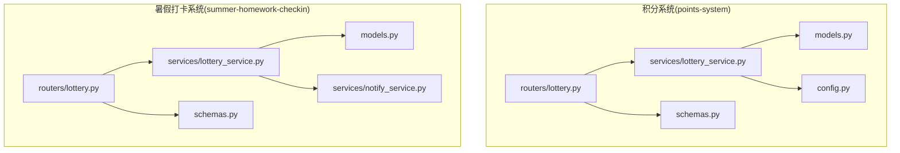
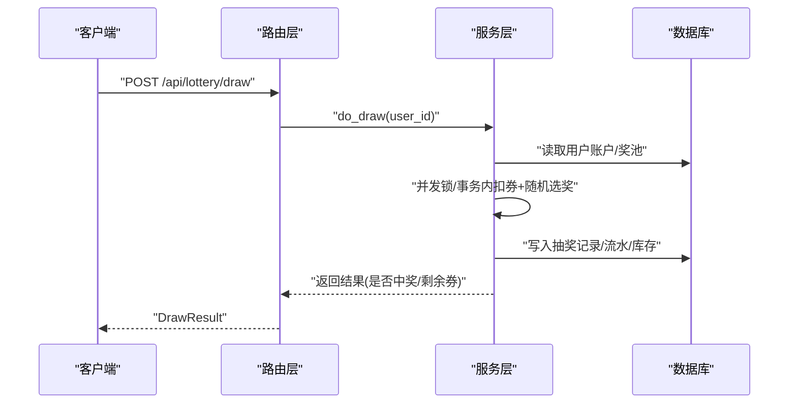
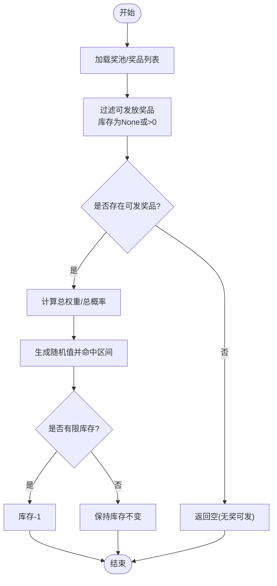
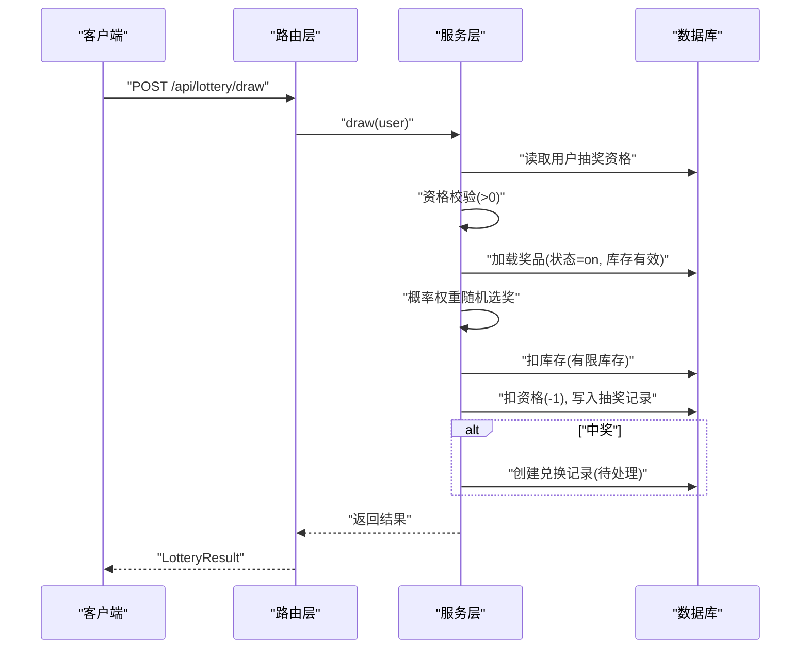
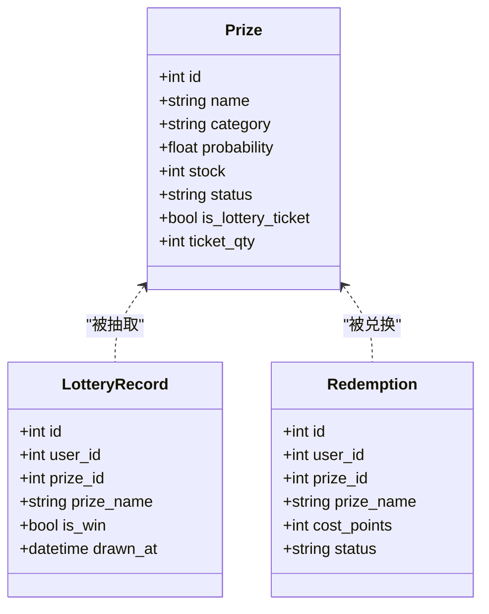
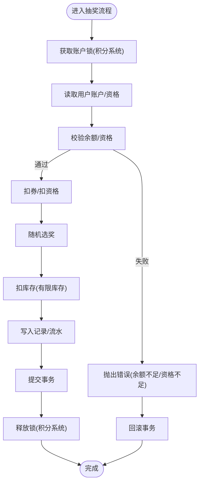
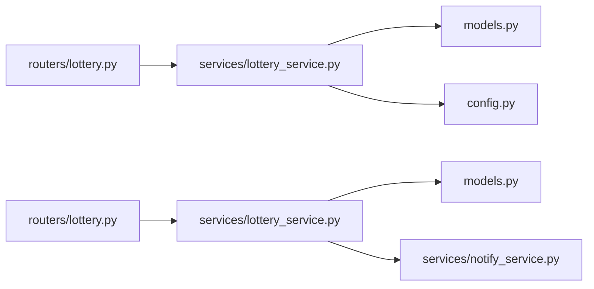

# 抽奖服务

<cite>
**本文引用的文件列表**
- [points-system/backend/app/routers/lottery.py](file://points-system/backend/app/routers/lottery.py)
- [points-system/backend/app/services/lottery_service.py](file://points-system/backend/app/services/lottery_service.py)
- [points-system/backend/app/models.py](file://points-system/backend/app/models.py)
- [points-system/backend/app/config.py](file://points-system/backend/app/config.py)
- [points-system/backend/app/schemas.py](file://points-system/backend/app/schemas.py)
- [summer-homework-checkin/backend/app/routers/lottery.py](file://summer-homework-checkin/backend/app/routers/lottery.py)
- [summer-homework-checkin/backend/app/services/lottery_service.py](file://summer-homework-checkin/backend/app/services/lottery_service.py)
- [summer-homework-checkin/backend/app/models.py](file://summer-homework-checkin/backend/app/models.py)
- [summer-homework-checkin/backend/app/config.py](file://summer-homework-checkin/backend/app/config.py)
- [summer-homework-checkin/backend/app/schemas.py](file://summer-homework-checkin/backend/app/schemas.py)
</cite>

## 目录
1. [简介](#简介)
2. [项目结构](#项目结构)
3. [核心组件](#核心组件)
4. [架构总览](#架构总览)
5. [详细组件分析](#详细组件分析)
6. [依赖关系分析](#依赖关系分析)
7. [性能与并发控制](#性能与并发控制)
8. [配置管理与动态调整](#配置管理与动态调整)
9. [防刷与安全防护](#防刷与安全防护)
10. [审计追踪与统计分析](#审计追踪与统计分析)
11. [故障排查指南](#故障排查指南)
12. [结论](#结论)

## 简介
本技术文档围绕仓库中的两套“抽奖服务”实现进行系统化说明：
- 积分系统（points-system）：基于“积分兑换抽奖券 + 加权随机奖池”的抽奖机制，强调事务一致性与并发安全。
- 暑假打卡系统（summer-homework-checkin）：基于“连续打卡解锁抽奖资格 + 概率权重奖品池”的抽奖机制，支持通知与家长联动。

文档将深入解释加权随机算法、库存管理、资格获取与消耗、并发控制、审计追踪、配置管理与安全防护等关键主题，并提供架构图与流程图帮助理解。

## 项目结构
两个后端子项目均使用 FastAPI + SQLAlchemy 构建，采用路由层调用服务层的分层设计；数据模型定义在 models.py，业务逻辑集中在 services/lottery_service.py，接口定义在 routers/lottery.py，配置项在 config.py，请求/响应模型在 schemas.py。

图表来源
- [points-system/backend/app/routers/lottery.py:1-55](file://points-system/backend/app/routers/lottery.py#L1-L55)
- [points-system/backend/app/services/lottery_service.py:1-174](file://points-system/backend/app/services/lottery_service.py#L1-L174)
- [points-system/backend/app/models.py:1-151](file://points-system/backend/app/models.py#L1-L151)
- [points-system/backend/app/config.py:1-17](file://points-system/backend/app/config.py#L1-L17)
- [points-system/backend/app/schemas.py:1-147](file://points-system/backend/app/schemas.py#L1-L147)
- [summer-homework-checkin/backend/app/routers/lottery.py:1-30](file://summer-homework-checkin/backend/app/routers/lottery.py#L1-L30)
- [summer-homework-checkin/backend/app/services/lottery_service.py:1-77](file://summer-homework-checkin/backend/app/services/lottery_service.py#L1-L77)
- [summer-homework-checkin/backend/app/models.py:1-212](file://summer-homework-checkin/backend/app/models.py#L1-L212)
- [summer-homework-checkin/backend/app/schemas.py:1-322](file://summer-homework-checkin/backend/app/schemas.py#L1-322)

章节来源
- [points-system/backend/app/routers/lottery.py:1-55](file://points-system/backend/app/routers/lottery.py#L1-L55)
- [summer-homework-checkin/backend/app/routers/lottery.py:1-30](file://summer-homework-checkin/backend/app/routers/lottery.py#L1-L30)

## 核心组件
- 路由层
  - 积分系统：提供奖池查询、抽奖、抽奖记录查询接口。
  - 暑假打卡系统：提供抽奖次数与记录查询、抽奖执行接口（含角色校验）。
- 服务层
  - 积分系统：负责积分兑换抽奖券、抽奖券扣减、加权随机选奖、库存扣减、流水写入与事务一致性。
  - 暑假打卡系统：负责资格校验、按概率权重选择奖品、库存扣减、记录写入、中奖后创建兑换记录并发送通知。
- 数据模型
  - 积分系统：用户、积分账户、积分流水、抽奖券流水、抽奖奖池、抽奖记录、兑换记录等。
  - 暑假打卡系统：用户（含抽奖资格字段）、奖品（含概率与库存）、抽奖记录、兑换记录、通知等。
- 配置与模式
  - 积分系统：每次抽奖消耗的券数、积分换券比例等。
  - 暑假打卡系统：打卡解锁阈值、人脸策略、上传路径等。

章节来源
- [points-system/backend/app/services/lottery_service.py:1-174](file://points-system/backend/app/services/lottery_service.py#L1-L174)
- [summer-homework-checkin/backend/app/services/lottery_service.py:1-77](file://summer-homework-checkin/backend/app/services/lottery_service.py#L1-L77)
- [points-system/backend/app/models.py:1-151](file://points-system/backend/app/models.py#L1-L151)
- [summer-homework-checkin/backend/app/models.py:1-212](file://summer-homework-checkin/backend/app/models.py#L1-L212)
- [points-system/backend/app/config.py:1-17](file://points-system/backend/app/config.py#L1-L17)
- [summer-homework-checkin/backend/app/config.py:1-54](file://summer-homework-checkin/backend/app/config.py#L1-54)

## 架构总览
整体采用“路由 -> 服务 -> 数据库”的分层架构。服务层封装核心业务规则（并发控制、事务、随机算法），路由层仅做参数校验与权限检查。

图表来源
- [points-system/backend/app/routers/lottery.py:24-37](file://points-system/backend/app/routers/lottery.py#L24-L37)
- [points-system/backend/app/services/lottery_service.py:117-174](file://points-system/backend/app/services/lottery_service.py#L117-L174)

## 详细组件分析

### 加权随机算法与库存管理
- 积分系统
  - 从数据库中加载所有奖池条目，过滤出可发放的奖品（库存为 None 或 >0）。
  - 计算可用奖品的总权重，生成 [0, total_weight) 的随机值，按累计权重区间命中目标奖品。
  - 若奖品有有限库存则扣减 1。
- 暑假打卡系统
  - 从数据库中加载状态为“上架”的奖品，过滤库存有效（stock == -1 表示不限量，或 stock > 0）。
  - 以 probability 作为权重，计算总权重并随机命中。
  - 若库存有限则扣减 1。

图表来源
- [points-system/backend/app/services/lottery_service.py:101-114](file://points-system/backend/app/services/lottery_service.py#L101-L114)
- [summer-homework-checkin/backend/app/services/lottery_service.py:14-33](file://summer-homework-checkin/backend/app/services/lottery_service.py#L14-L33)

章节来源
- [points-system/backend/app/services/lottery_service.py:101-114](file://points-system/backend/app/services/lottery_service.py#L101-L114)
- [summer-homework-checkin/backend/app/services/lottery_service.py:14-33](file://summer-homework-checkin/backend/app/services/lottery_service.py#L14-L33)

### 抽奖资格获取与消耗逻辑
- 积分系统
  - 通过积分兑换获得抽奖券：校验最低门槛与余额，同事务内扣积分、加券，并写积分支出流水与抽奖券发放流水。
  - 抽奖权限由“抽奖券余额 ≥ 1”派生，无需额外状态位。
  - 抽奖时先扣券再随机选奖，保证原子性。
- 暑假打卡系统
  - 抽奖资格来源于用户表中的 lottery_tickets 字段，需大于 0 才能抽奖。
  - 抽奖成功后扣减 1 次资格，并写入抽奖记录；若中奖且奖品存在，同时创建待处理兑换记录。

图表来源
- [summer-homework-checkin/backend/app/routers/lottery.py:25-29](file://summer-homework-checkin/backend/app/routers/lottery.py#L25-L29)
- [summer-homework-checkin/backend/app/services/lottery_service.py:9-77](file://summer-homework-checkin/backend/app/services/lottery_service.py#L9-L77)

章节来源
- [points-system/backend/app/services/lottery_service.py:30-98](file://points-system/backend/app/services/lottery_service.py#L30-L98)
- [points-system/backend/app/services/lottery_service.py:117-174](file://points-system/backend/app/services/lottery_service.py#L117-L174)
- [summer-homework-checkin/backend/app/services/lottery_service.py:9-77](file://summer-homework-checkin/backend/app/services/lottery_service.py#L9-L77)

### 奖品类型支持与兑换流程
- 积分系统
  - 奖池模型包含 is_win 标记，用于区分“中奖”与“未中奖（谢谢参与）”。
  - 库存字段 stock 为 None 表示不限量，否则为有限库存。
- 暑假打卡系统
  - 奖品模型支持 category 分类（文具、户外、兴趣），probability 表示概率权重，stock=-1 表示不限量。
  - 特殊“抽奖机会”奖品（is_lottery_ticket=True）可通过积分兑换直接增加抽奖券数量，不扣库存，可无限兑换。
  - 实物奖品（is_lottery_ticket=False）需要管理员审核兑现，状态流转包括 pending、fulfilled、replaced、cancelled。

图表来源
- [summer-homework-checkin/backend/app/models.py:103-124](file://summer-homework-checkin/backend/app/models.py#L103-L124)
- [summer-homework-checkin/backend/app/models.py:126-139](file://summer-homework-checkin/backend/app/models.py#L126-L139)
- [summer-homework-checkin/backend/app/models.py:141-161](file://summer-homework-checkin/backend/app/models.py#L141-L161)

章节来源
- [points-system/backend/app/models.py:125-151](file://points-system/backend/app/models.py#L125-L151)
- [summer-homework-checkin/backend/app/models.py:103-161](file://summer-homework-checkin/backend/app/models.py#L103-L161)

### 并发控制策略（防止超发与重复抽奖）
- 积分系统
  - 使用进程内线程锁 _account_lock 对同一用户的读-改-写操作串行化，避免 SQLite 下丢失更新问题。
  - 所有变更在同一 SQLAlchemy Session 事务中完成，成功 commit，异常 rollback，确保一致性。
  - 注释建议多实例部署时使用数据库悲观锁（如 with_for_update()）。
- 暑假打卡系统
  - 当前实现未显式加锁，但通过单事务内扣资格、写记录与库存，减少竞争窗口；在高并发场景建议引入数据库级行级锁或分布式锁。

图表来源
- [points-system/backend/app/services/lottery_service.py:23-27](file://points-system/backend/app/services/lottery_service.py#L23-L27)
- [points-system/backend/app/services/lottery_service.py:117-174](file://points-system/backend/app/services/lottery_service.py#L117-L174)

章节来源
- [points-system/backend/app/services/lottery_service.py:23-27](file://points-system/backend/app/services/lottery_service.py#L23-L27)
- [points-system/backend/app/services/lottery_service.py:117-174](file://points-system/backend/app/services/lottery_service.py#L117-L174)

### 审计追踪与统计分析
- 积分系统
  - 积分支出流水 PointLedger：记录每次积分变动后的余额，便于对账。
  - 抽奖券流水 LotteryTicketLedger：记录发放与消耗，附带 ref_type/ref_id 关联业务主键。
  - 抽奖记录 LotteryDraw：记录每次抽奖的用户、奖品名称与是否中奖。
  - 用户详情接口聚合展示最近 20 条券流水、兑换记录与抽奖记录，以及奖池信息供前端转盘初始化。
- 暑假打卡系统
  - 抽奖记录 LotteryRecord：记录用户、奖品信息与时间戳。
  - 中奖后自动创建 Redemption 记录，状态为 pending，后续可由管理员审核兑现。
  - 通知服务 notify 与 notify_parents_of_student 在中奖时推送站内消息给与学生绑定的家长。

章节来源
- [points-system/backend/app/models.py:35-48](file://points-system/backend/app/models.py#L35-L48)
- [points-system/backend/app/models.py:110-123](file://points-system/backend/app/models.py#L110-L123)
- [points-system/backend/app/models.py:139-151](file://points-system/backend/app/models.py#L139-L151)
- [points-system/backend/app/routers/users.py:104-136](file://points-system/backend/app/routers/users.py#L104-L136)
- [summer-homework-checkin/backend/app/models.py:126-139](file://summer-homework-checkin/backend/app/models.py#L126-L139)
- [summer-homework-checkin/backend/app/models.py:141-161](file://summer-homework-checkin/backend/app/models.py#L141-L161)
- [summer-homework-checkin/backend/app/services/lottery_service.py:59-68](file://summer-homework-checkin/backend/app/services/lottery_service.py#L59-L68)

## 依赖关系分析
- 路由层依赖服务层与数据库会话，服务层依赖数据模型与配置。
- 暑假打卡系统的抽奖服务还依赖通知服务，用于中奖通知与家长联动。

图表来源
- [points-system/backend/app/routers/lottery.py:1-55](file://points-system/backend/app/routers/lottery.py#L1-L55)
- [points-system/backend/app/services/lottery_service.py:1-174](file://points-system/backend/app/services/lottery_service.py#L1-L174)
- [summer-homework-checkin/backend/app/routers/lottery.py:1-30](file://summer-homework-checkin/backend/app/routers/lottery.py#L1-L30)
- [summer-homework-checkin/backend/app/services/lottery_service.py:1-77](file://summer-homework-checkin/backend/app/services/lottery_service.py#L1-L77)

章节来源
- [points-system/backend/app/routers/lottery.py:1-55](file://points-system/backend/app/routers/lottery.py#L1-L55)
- [summer-homework-checkin/backend/app/routers/lottery.py:1-30](file://summer-homework-checkin/backend/app/routers/lottery.py#L1-L30)

## 性能与并发控制
- 积分系统
  - 使用线程锁串行化同一用户的账户读写，避免 SQLite 下的丢失更新。
  - 事务内批量写入（账户余额、流水、记录），减少多次提交开销。
  - 建议生产环境使用支持行级锁的数据库（如 PostgreSQL），并通过 with_for_update() 实现跨进程并发安全。
- 暑假打卡系统
  - 当前未显式加锁，高并发下可能出现竞态条件；建议引入数据库行级锁或分布式锁（如 Redis 分布式锁）保护抽奖资格与库存扣减。

[本节为通用性能指导，不直接分析具体文件]

## 配置管理与动态调整
- 积分系统
  - POINTS_PER_TICKET：每多少积分兑换 1 张抽奖券。
  - TICKETS_PER_DRAW：每次抽奖消耗的抽奖券数量。
- 暑假打卡系统
  - LOTTERY_STREAK_THRESHOLD：连续有效打卡天数达到该值解锁 1 次抽奖资格。
  - FACE_MODE_ON_ENROLLED：已采集人脸后的打卡策略（enforce/soft）。
  - UPLOAD_DIR、DB_PATH、SECRET 等运行期配置。

章节来源
- [points-system/backend/app/config.py:1-17](file://points-system/backend/app/config.py#L1-L17)
- [summer-homework-checkin/backend/app/config.py:38-54](file://summer-homework-checkin/backend/app/config.py#L38-L54)

## 防刷与安全防护
- 路由层权限校验
  - 暑假打卡系统：仅学生角色可抽奖，非学生返回 403。
- 业务层校验
  - 积分系统：兑换前校验最低门槛与余额；抽奖前校验券余额。
  - 暑假打卡系统：抽奖前校验抽奖资格 > 0。
- 并发与一致性
  - 积分系统：线程锁 + 事务保证一致性。
  - 暑假打卡系统：建议引入数据库行级锁或分布式锁。
- 其他安全措施
  - 暑假打卡系统：人脸识别与地理围栏策略（enforce/soft），降低代打卡风险。

章节来源
- [summer-homework-checkin/backend/app/routers/lottery.py:25-29](file://summer-homework-checkin/backend/app/routers/lottery.py#L25-L29)
- [points-system/backend/app/services/lottery_service.py:30-98](file://points-system/backend/app/services/lottery_service.py#L30-L98)
- [points-system/backend/app/services/lottery_service.py:117-174](file://points-system/backend/app/services/lottery_service.py#L117-L174)
- [summer-homework-checkin/backend/app/services/lottery_service.py:9-12](file://summer-homework-checkin/backend/app/services/lottery_service.py#L9-L12)
- [summer-homework-checkin/backend/app/config.py:50-54](file://summer-homework-checkin/backend/app/config.py#L50-L54)

## 审计追踪与统计分析
- 积分系统
  - 用户详情接口聚合展示：
    - 最近 20 条抽奖券流水（发放/消耗）。
    - 兑换抽奖券记录（convert）。
    - 抽奖记录（draw）。
    - 奖池信息（weight、stock、is_win）。
- 暑假打卡系统
  - 抽奖记录列表（按时间倒序）。
  - 中奖后自动创建兑换记录，便于统计与审核。
  - 通知记录可用于统计中奖触达情况。

章节来源
- [points-system/backend/app/routers/users.py:104-136](file://points-system/backend/app/routers/users.py#L104-L136)
- [summer-homework-checkin/backend/app/routers/lottery.py:13-22](file://summer-homework-checkin/backend/app/routers/lottery.py#L13-L22)
- [summer-homework-checkin/backend/app/services/lottery_service.py:44-68](file://summer-homework-checkin/backend/app/services/lottery_service.py#L44-L68)

## 故障排查指南
- 常见问题
  - 积分不足无法兑换抽奖券：检查 POINTS_PER_TICKET 与用户余额。
  - 抽奖券不足无法抽奖：检查 TICKETS_PER_DRAW 与用户券余额。
  - 奖池无可发放奖品：检查奖品库存与状态。
  - 并发冲突导致处理失败：检查 IntegrityError 捕获与重试逻辑。
- 定位方法
  - 查看对应流水表（PointLedger、LotteryTicketLedger）核对余额变化。
  - 查看抽奖记录（LotteryDraw/LotteryRecord）确认结果。
  - 检查通知记录（Notification）确认中奖通知是否发出。

章节来源
- [points-system/backend/app/services/lottery_service.py:87-98](file://points-system/backend/app/services/lottery_service.py#L87-L98)
- [points-system/backend/app/services/lottery_service.py:161-174](file://points-system/backend/app/services/lottery_service.py#L161-L174)
- [summer-homework-checkin/backend/app/services/lottery_service.py:59-68](file://summer-homework-checkin/backend/app/services/lottery_service.py#L59-L68)

## 结论
两套抽奖服务分别面向不同业务场景：
- 积分系统强调事务一致性与并发安全，适合资源型奖品与严格风控。
- 暑假打卡系统强调用户体验与家校联动，适合活动激励与轻量运营。

在生产环境中，建议统一引入数据库行级锁或分布式锁，完善限流与风控策略，并对统计报表与审计日志进行长期留存与分析，以支撑运营决策与合规审计。