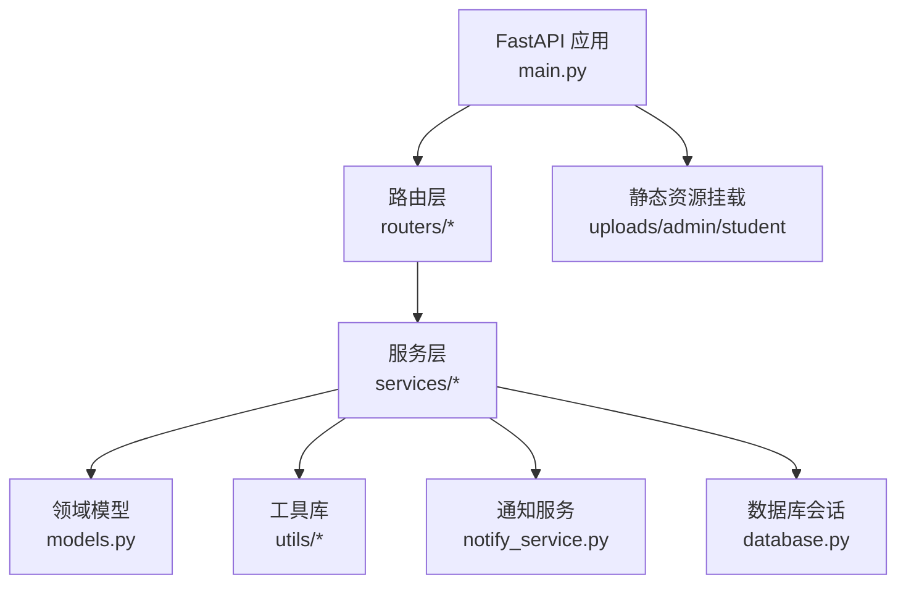
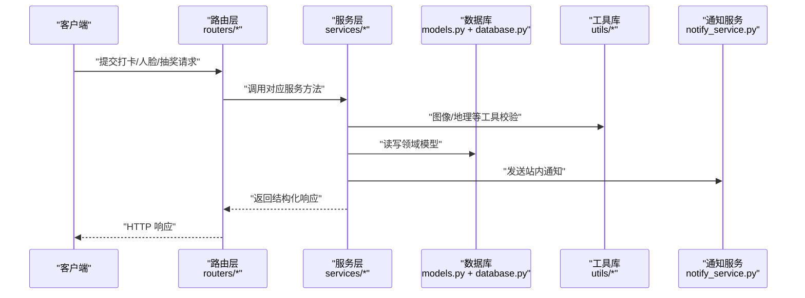
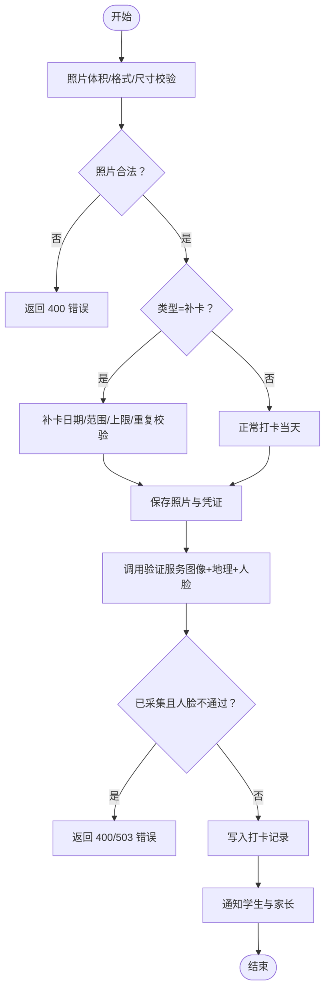
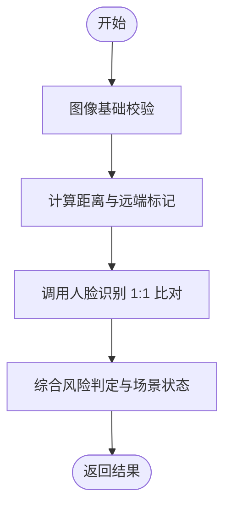
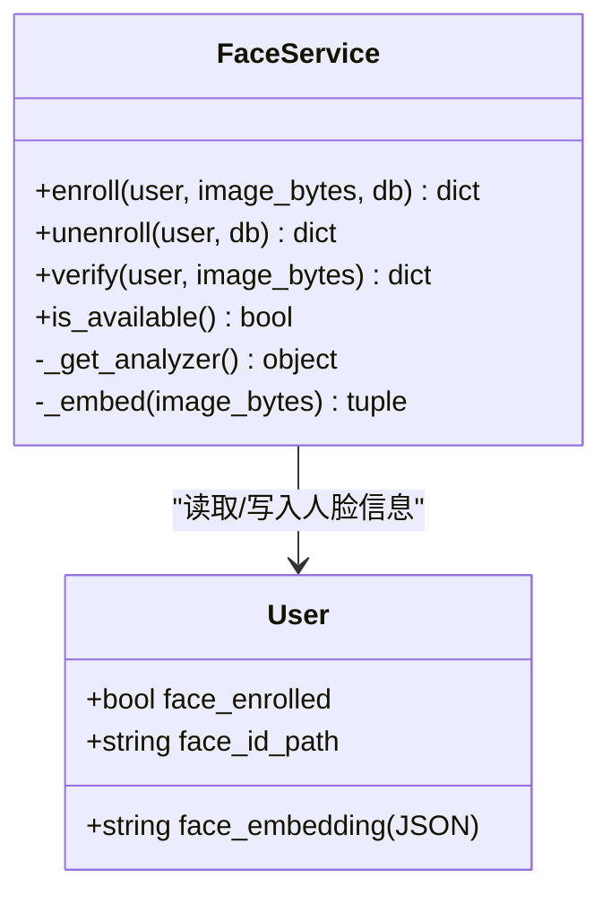
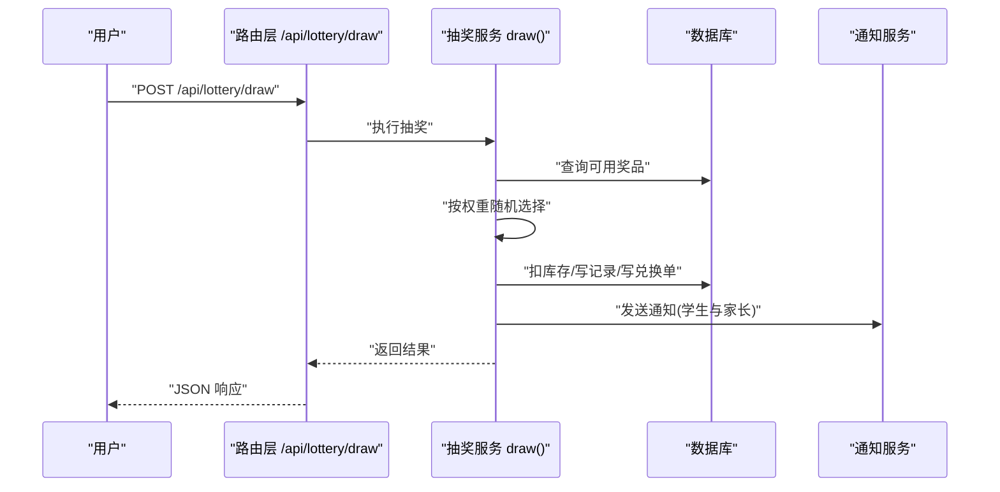
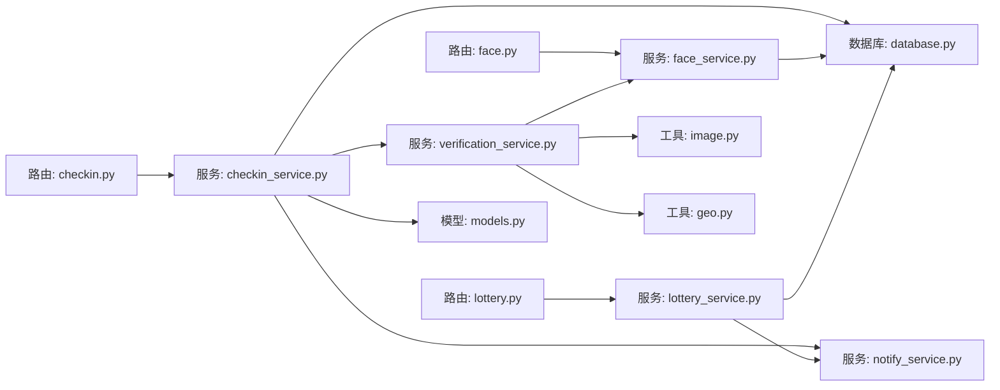

# 服务层架构

<cite>
**本文引用的文件**   
- [main.py](file://summer-homework-checkin/backend/app/main.py)
- [config.py](file://summer-homework-checkin/backend/app/config.py)
- [database.py](file://summer-homework-checkin/backend/app/database.py)
- [models.py](file://summer-homework-checkin/backend/app/models.py)
- [checkin_service.py](file://summer-homework-checkin/backend/app/services/checkin_service.py)
- [verification_service.py](file://summer-homework-checkin/backend/app/services/verification_service.py)
- [face_service.py](file://summer-homework-checkin/backend/app/services/face_service.py)
- [lottery_service.py](file://summer-homework-checkin/backend/app/services/lottery_service.py)
- [notify_service.py](file://summer-homework-checkin/backend/app/services/notify_service.py)
- [image.py](file://summer-homework-checkin/backend/app/utils/image.py)
- [geo.py](file://summer-homework-checkin/backend/app/utils/geo.py)
- [checkin.py](file://summer-homework-checkin/backend/app/routers/checkin.py)
- [face.py](file://summer-homework-checkin/backend/app/routers/face.py)
- [lottery.py](file://summer-homework-checkin/backend/app/routers/lottery.py)
</cite>

## 目录
1. [简介](#简介)
2. [项目结构](#项目结构)
3. [核心组件](#核心组件)
4. [架构总览](#架构总览)
5. [详细组件分析](#详细组件分析)
6. [依赖关系分析](#依赖关系分析)
7. [性能考量](#性能考量)
8. [故障排查指南](#故障排查指南)
9. [结论](#结论)
10. [附录：扩展开发指南](#附录扩展开发指南)

## 简介
本技术文档聚焦于“暑假作业打卡系统”的服务层架构，围绕职责分离与业务逻辑封装原则，深入解析以下核心服务模块：
- 打卡服务：负责打卡创建、补卡规则、审核通过/拒绝、连续天数重算与抽奖资格发放。
- 验证服务：聚合图像真实性、场景合规性与地理位置一致性校验，并集成人脸识别 1:1 比对结果进行风险判定。
- 人脸识别服务：基于 insightface 的 1:1 本人比对（注册底图 vs 现场照），提供采集、撤销、比对与健康检查能力。
- 抽奖服务：按概率与库存加权随机抽取，记录中奖与兑换信息，并发出通知。

同时阐述服务间依赖关系与数据流转机制，给出事务管理、异常处理与日志记录的最佳实践建议，并提供扩展新业务服务与第三方 API 集成的开发指南。

## 项目结构
后端采用 FastAPI 作为应用框架，路由层仅做参数校验与权限控制，核心业务逻辑下沉至 services 层；utils 提供通用工具（图像处理、地理计算等）；models 定义领域模型；database 提供数据库连接与会话管理；config 集中配置项。

图示来源
- [main.py:1-49](file://summer-homework-checkin/backend/app/main.py#L1-L49)
- [checkin.py:1-80](file://summer-homework-checkin/backend/app/routers/checkin.py#L1-L80)
- [face.py:1-45](file://summer-homework-checkin/backend/app/routers/face.py#L1-L45)
- [lottery.py:1-30](file://summer-homework-checkin/backend/app/routers/lottery.py#L1-L30)

章节来源
- [main.py:1-49](file://summer-homework-checkin/backend/app/main.py#L1-L49)
- [config.py:1-50](file://summer-homework-checkin/backend/app/config.py#L1-L50)
- [database.py:1-22](file://summer-homework-checkin/backend/app/database.py#L1-L22)
- [models.py:1-212](file://summer-homework-checkin/backend/app/models.py#L1-L212)

## 核心组件
本节从职责边界、输入输出、关键流程与异常策略角度，对四大核心服务进行概览式说明。

- 打卡服务
  - 职责：创建打卡记录（含正常/补卡）、照片与凭证上传、防代打卡综合校验、管理员审核通过/拒绝、积分发放、连续天数与里程碑重算、通知发送。
  - 关键流程：照片合规校验 → 补卡规则校验 → 保存文件 → 调用验证服务 → 人脸策略拦截 → 写入记录 → 通知 → 审核时更新有效性与积分并重算。
  - 异常策略：参数错误返回 400；人脸识别服务不可用且强制模式返回 503；重复或越界操作返回 400。
  - 参考路径：[create_checkin:64-163](file://summer-homework-checkin/backend/app/services/checkin_service.py#L64-L163)、[approve_checkin:166-191](file://summer-homework-checkin/backend/app/services/checkin_service.py#L166-L191)、[reject_checkin:194-209](file://summer-homework-checkin/backend/app/services/checkin_service.py#L194-L209)、[recompute_and_grant:39-61](file://summer-homework-checkin/backend/app/services/checkin_service.py#L39-L61)。

- 验证服务
  - 职责：统一入口聚合图像校验、地理位置一致性、人脸识别 1:1 比对，输出结构化风险判定结果。
  - 关键流程：图片基础校验 → 距离计算与阈值判断 → 调用人脸识别服务 → 综合风险等级与场景状态。
  - 异常策略：人脸识别服务异常降级为“模型不可用”，不静默放行。
  - 参考路径：[verify_checkin:19-70](file://summer-homework-checkin/backend/app/services/verification_service.py#L19-L70)。

- 人脸识别服务
  - 职责：人脸底图采集、撤销、1:1 比对、可用性探测。
  - 关键流程：懒加载模型 → 提取 embedding → 余弦相似度计算 → 阈值判定 → 返回结构化结果。
  - 异常策略：模型不可用时返回明确状态；多脸/无脸/未注册等分支清晰。
  - 参考路径：[enroll:71-87](file://summer-homework-checkin/backend/app/services/face_service.py#L71-L87)、[verify:99-125](file://summer-homework-checkin/backend/app/services/face_service.py#L99-L125)、[is_available:128-132](file://summer-homework-checkin/backend/app/services/face_service.py#L128-L132)。

- 抽奖服务
  - 职责：消耗抽奖资格、按概率与库存加权随机抽取、记录中奖与兑换、通知用户与家长。
  - 关键流程：资格校验 → 候选奖品筛选 → 权重随机 → 扣库存（若有限量）→ 写记录与兑换单 → 通知。
  - 异常策略：无资格返回 400。
  - 参考路径：[draw:9-76](file://summer-homework-checkin/backend/app/services/lottery_service.py#L9-L76)。

章节来源
- [checkin_service.py:1-254](file://summer-homework-checkin/backend/app/services/checkin_service.py#L1-L254)
- [verification_service.py:1-71](file://summer-homework-checkin/backend/app/services/verification_service.py#L1-L71)
- [face_service.py:1-133](file://summer-homework-checkin/backend/app/services/face_service.py#L1-L133)
- [lottery_service.py:1-77](file://summer-homework-checkin/backend/app/services/lottery_service.py#L1-L77)

## 架构总览
下图展示请求从路由到服务再到数据层的完整链路，以及服务间的协作关系。

图示来源
- [checkin.py:1-80](file://summer-homework-checkin/backend/app/routers/checkin.py#L1-L80)
- [face.py:1-45](file://summer-homework-checkin/backend/app/routers/face.py#L1-L45)
- [lottery.py:1-30](file://summer-homework-checkin/backend/app/routers/lottery.py#L1-L30)
- [checkin_service.py:1-254](file://summer-homework-checkin/backend/app/services/checkin_service.py#L1-L254)
- [verification_service.py:1-71](file://summer-homework-checkin/backend/app/services/verification_service.py#L1-L71)
- [face_service.py:1-133](file://summer-homework-checkin/backend/app/services/face_service.py#L1-L133)
- [lottery_service.py:1-77](file://summer-homework-checkin/backend/app/services/lottery_service.py#L1-L77)
- [notify_service.py:1-20](file://summer-homework-checkin/backend/app/services/notify_service.py#L1-L20)
- [image.py:1-61](file://summer-homework-checkin/backend/app/utils/image.py#L1-L61)
- [geo.py:1-24](file://summer-homework-checkin/backend/app/utils/geo.py#L1-L24)
- [database.py:1-22](file://summer-homework-checkin/backend/app/database.py#L1-L22)
- [models.py:1-212](file://summer-homework-checkin/backend/app/models.py#L1-L212)

## 详细组件分析

### 打卡服务（CheckIn Service）
- 职责边界
  - 业务规则：补卡日期范围、月度上限、是否重复打卡、审核通过后的积分发放与连续天数重算、7 天里程碑解锁抽奖资格。
  - 安全策略：人脸 1:1 比对失败在已采集模式下直接拒绝；模型不可用时根据策略返回 503 或标记高风险。
  - 通知：提交后通知学生与家长；审核通过后再次通知。
- 关键流程（创建打卡）
  - 照片体积/格式/尺寸校验 → 补卡规则校验 → 保存照片与凭证 → 调用验证服务 → 人脸策略拦截 → 写入 CheckIn 记录 → 通知学生与家长 → 返回结果。
- 关键流程（审核通过）
  - 标记有效 → 发放积分 → 刷新用户 → 重算连续天数与里程碑 → 可能发放抽奖资格 → 通知学生。
- 异常与边界
  - 参数错误（如补卡日期无效、超出统计周期、重复打卡、次数超限）→ 400。
  - 人脸识别服务不可用且强制模式 → 503。
  - 重复审核 → 400。
- 复杂度与性能
  - 连续天数计算 O(n log n)（排序）+ O(n) 扫描；单次请求开销主要来自 I/O 与可选的人脸推理。
- 参考路径
  - [create_checkin:64-163](file://summer-homework-checkin/backend/app/services/checkin_service.py#L64-L163)
  - [approve_checkin:166-191](file://summer-homework-checkin/backend/app/services/checkin_service.py#L166-L191)
  - [reject_checkin:194-209](file://summer-homework-checkin/backend/app/services/checkin_service.py#L194-L209)
  - [recompute_and_grant:39-61](file://summer-homework-checkin/backend/app/services/checkin_service.py#L39-L61)
  - [get_today_status:225-253](file://summer-homework-checkin/backend/app/services/checkin_service.py#L225-L253)

图示来源
- [checkin_service.py:64-163](file://summer-homework-checkin/backend/app/services/checkin_service.py#L64-L163)
- [verification_service.py:19-70](file://summer-homework-checkin/backend/app/services/verification_service.py#L19-L70)
- [image.py:51-61](file://summer-homework-checkin/backend/app/utils/image.py#L51-L61)
- [geo.py:1-24](file://summer-homework-checkin/backend/app/utils/geo.py#L1-L24)

章节来源
- [checkin_service.py:1-254](file://summer-homework-checkin/backend/app/services/checkin_service.py#L1-L254)
- [checkin.py:17-37](file://summer-homework-checkin/backend/app/routers/checkin.py#L17-L37)

### 验证服务（Verification Service）
- 职责边界
  - 统一聚合图像真实性、场景合规性、地理位置一致性与人脸识别 1:1 比对结果，输出结构化风险判定。
- 关键流程
  - 图片基础校验 → 计算距家距离与远端标记 → 调用人脸识别服务 → 综合风险等级与场景状态。
- 异常与降级
  - 人脸识别服务异常捕获，返回“模型不可用”状态，确保不会静默放行。
- 参考路径
  - [verify_checkin:19-70](file://summer-homework-checkin/backend/app/services/verification_service.py#L19-L70)

图示来源
- [verification_service.py:19-70](file://summer-homework-checkin/backend/app/services/verification_service.py#L19-L70)
- [face_service.py:99-125](file://summer-homework-checkin/backend/app/services/face_service.py#L99-L125)
- [geo.py:6-24](file://summer-homework-checkin/backend/app/utils/geo.py#L6-L24)
- [image.py:51-61](file://summer-homework-checkin/backend/app/utils/image.py#L51-L61)

章节来源
- [verification_service.py:1-71](file://summer-homework-checkin/backend/app/services/verification_service.py#L1-L71)

### 人脸识别服务（Face Service）
- 职责边界
  - 人脸底图采集（要求单人正脸）、撤销、1:1 比对、可用性探测。
- 关键流程
  - 懒加载模型 → 解码图像 → 检测人脸 → 选择最大人脸 → 提取 512 维 embedding → 与底图向量计算余弦相似度 → 阈值判定。
- 异常与降级
  - 模型不可用、无脸、多脸、未注册等分支均有明确返回状态与消息。
- 参考路径
  - [enroll:71-87](file://summer-homework-checkin/backend/app/services/face_service.py#L71-L87)
  - [verify:99-125](file://summer-homework-checkin/backend/app/services/face_service.py#L99-L125)
  - [is_available:128-132](file://summer-homework-checkin/backend/app/services/face_service.py#L128-L132)

图示来源
- [face_service.py:1-133](file://summer-homework-checkin/backend/app/services/face_service.py#L1-L133)
- [models.py:11-44](file://summer-homework-checkin/backend/app/models.py#L11-L44)

章节来源
- [face_service.py:1-133](file://summer-homework-checkin/backend/app/services/face_service.py#L1-L133)
- [face.py:14-26](file://summer-homework-checkin/backend/app/routers/face.py#L14-L26)

### 抽奖服务（Lottery Service）
- 职责边界
  - 消耗抽奖资格、按概率与库存加权随机抽取、记录中奖与兑换、通知用户与家长。
- 关键流程
  - 资格校验 → 候选奖品筛选（开启且有库存）→ 权重随机 → 扣减库存（限量）→ 写入抽奖记录与兑换单 → 通知。
- 异常与边界
  - 无资格返回 400；未中奖也生成记录以便追溯。
- 参考路径
  - [draw:9-76](file://summer-homework-checkin/backend/app/services/lottery_service.py#L9-L76)

图示来源
- [lottery.py:25-29](file://summer-homework-checkin/backend/app/routers/lottery.py#L25-L29)
- [lottery_service.py:9-76](file://summer-homework-checkin/backend/app/services/lottery_service.py#L9-L76)
- [notify_service.py:5-13](file://summer-homework-checkin/backend/app/services/notify_service.py#L5-L13)

章节来源
- [lottery_service.py:1-77](file://summer-homework-checkin/backend/app/services/lottery_service.py#L1-L77)
- [lottery.py:1-30](file://summer-homework-checkin/backend/app/routers/lottery.py#L1-L30)

## 依赖关系分析
- 路由层依赖服务层，服务层依赖领域模型与工具库，并通过数据库会话访问持久化存储。
- 打卡服务依赖验证服务与通知服务；验证服务依赖人脸识别服务与地理/图像工具；人脸识别服务依赖外部模型库（insightface）。
- 抽奖服务依赖通知服务与数据库模型。

图示来源
- [checkin.py:1-80](file://summer-homework-checkin/backend/app/routers/checkin.py#L1-L80)
- [face.py:1-45](file://summer-homework-checkin/backend/app/routers/face.py#L1-L45)
- [lottery.py:1-30](file://summer-homework-checkin/backend/app/routers/lottery.py#L1-L30)
- [checkin_service.py:1-254](file://summer-homework-checkin/backend/app/services/checkin_service.py#L1-L254)
- [verification_service.py:1-71](file://summer-homework-checkin/backend/app/services/verification_service.py#L1-L71)
- [face_service.py:1-133](file://summer-homework-checkin/backend/app/services/face_service.py#L1-L133)
- [lottery_service.py:1-77](file://summer-homework-checkin/backend/app/services/lottery_service.py#L1-L77)
- [notify_service.py:1-20](file://summer-homework-checkin/backend/app/services/notify_service.py#L1-L20)
- [image.py:1-61](file://summer-homework-checkin/backend/app/utils/image.py#L1-L61)
- [geo.py:1-24](file://summer-homework-checkin/backend/app/utils/geo.py#L1-L24)
- [database.py:1-22](file://summer-homework-checkin/backend/app/database.py#L1-L22)
- [models.py:1-212](file://summer-homework-checkin/backend/app/models.py#L1-L212)

章节来源
- [main.py:1-49](file://summer-homework-checkin/backend/app/main.py#L1-L49)
- [config.py:1-50](file://summer-homework-checkin/backend/app/config.py#L1-L50)

## 性能考量
- 人脸识别服务
  - 懒加载与全局锁保护避免重复初始化；CPU 模式运行降低 GPU 依赖；首次调用可能触发模型下载，应预热或在启动阶段完成。
  - 建议：进程内缓存 analyzer 实例；必要时引入异步队列将人脸比对任务异步化，提升吞吐。
- 打卡服务
  - 连续天数计算涉及排序与线性扫描，建议在热点查询上增加索引（check_date、user_id、is_effective）。
  - 批量重算可考虑定时任务或增量更新，避免每次审核都全量重算。
- 数据库
  - SQLite 适合轻量部署，但高并发写入需关注锁竞争；生产环境可迁移至 PostgreSQL/MySQL，并启用连接池与事务隔离级别优化。
- 图片处理
  - 使用轻量解析避免重型依赖；限制最大体积与最小尺寸减少大对象传输与存储压力。

[本节为通用性能建议，不直接分析具体文件]

## 故障排查指南
- 常见问题定位
  - 人脸比对失败：检查是否已采集底图、是否为单人正脸、相似度阈值配置；查看“模型不可用”提示以确认依赖安装与环境。
  - 打卡被拒：核对照片体积/尺寸、补卡日期是否在统计周期内、当月补卡次数是否超限、是否存在重复打卡。
  - 位置风险：检查用户常用位置坐标是否设置、GPS 精度与网络定位差异。
- 日志与监控建议
  - 在服务层关键节点添加结构化日志（入参摘要、耗时、异常堆栈、风险等级）。
  - 暴露健康检查接口（如 /api/health）与人脸识别可用性探测，便于运维监控。
- 事务与一致性
  - 当前实现中多次 commit 分散在各步骤，建议将同一业务动作的多步写操作合并到单一事务中，保证原子性。
  - 对并发写冲突（如库存扣减、抽奖资格消耗）引入乐观锁或行级锁，防止超发。

章节来源
- [face_service.py:99-125](file://summer-homework-checkin/backend/app/services/face_service.py#L99-L125)
- [checkin_service.py:64-163](file://summer-homework-checkin/backend/app/services/checkin_service.py#L64-L163)
- [lottery_service.py:9-76](file://summer-homework-checkin/backend/app/services/lottery_service.py#L9-L76)
- [main.py:33-35](file://summer-homework-checkin/backend/app/main.py#L33-L35)

## 结论
该服务层设计遵循清晰的职责分离：路由层专注协议与鉴权，服务层承载业务规则与编排，工具层提供可复用能力，模型层描述领域实体。打卡、验证、人脸、抽奖四大服务形成稳定的依赖链，配合通知服务完善用户体验。后续可在事务管理、并发控制与可观测性方面进一步增强，以提升系统的健壮性与可维护性。

[本节为总结性内容，不直接分析具体文件]

## 附录：扩展开发指南
- 新增业务服务的步骤
  - 在 services 下新建服务模块，定义函数式接口，保持幂等与纯函数风格（尽量不直接持有外部状态）。
  - 在 routers 下新增路由，仅做参数校验、权限检查与调用服务，返回 Pydantic 模型。
  - 如需持久化，扩展 models 并使用 database.get_db 注入会话。
  - 需要通知时，调用 notify_service.notify 或面向家长的通知函数。
- 集成第三方 API 的建议
  - 抽象适配器：为第三方能力（如短信、邮件、OCR、AI 服务）定义统一接口，提供本地 Mock 与线上实现。
  - 超时与重试：为外部调用设置合理超时与重试策略，区分可重试与不可重试错误。
  - 降级与熔断：当外部服务不可用时，回退到保守策略（如标记高风险、延迟处理、告警）。
  - 配置化：将密钥、URL、阈值等放入 config 并通过环境变量注入。
- 事务与异常最佳实践
  - 使用单一事务包裹一次业务操作的多个写步骤，确保成功/失败的一致性。
  - 对外抛出明确的 HTTP 状态码与错误信息，内部记录详细上下文日志。
  - 对并发敏感字段（库存、积分、抽奖资格）使用数据库约束或乐观锁版本号。
- 测试与可观测性
  - 为服务函数编写单元测试，覆盖边界条件与异常分支。
  - 接入结构化日志与指标收集（QPS、P99 延迟、错误率），结合健康检查接口进行巡检。

[本节为通用指导，不直接分析具体文件]