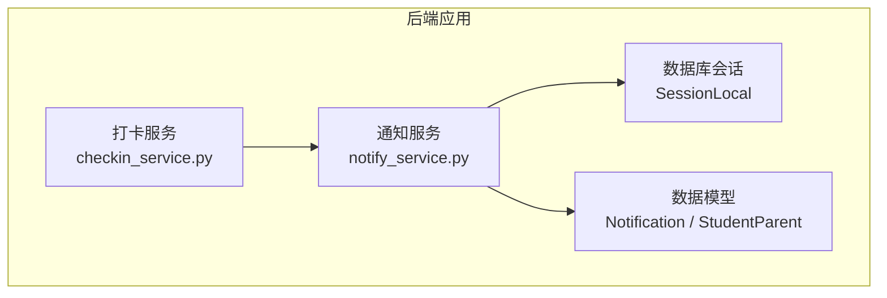
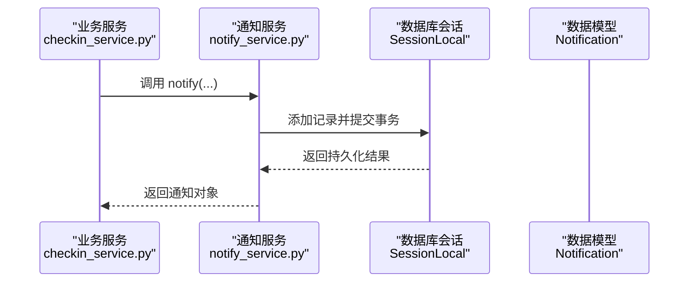
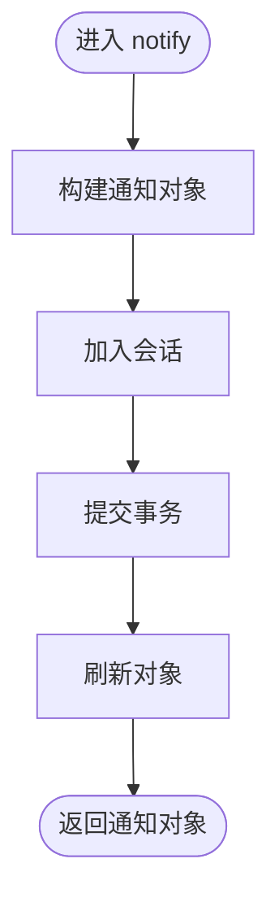
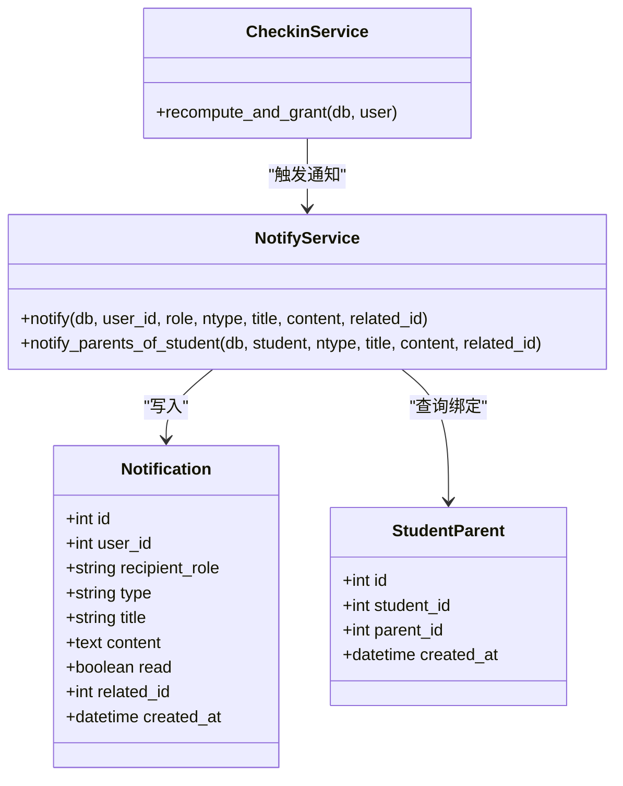

# 通知服务

<cite>
**本文引用的文件**   
- [notify_service.py](file://summer-homework-checkin/backend/app/services/notify_service.py)
- [models.py](file://summer-homework-checkin/backend/app/models.py)
- [checkin_service.py](file://summer-homework-checkin/backend/app/services/checkin_service.py)
</cite>

## 目录
1. [简介](#简介)
2. [项目结构](#项目结构)
3. [核心组件](#核心组件)
4. [架构总览](#架构总览)
5. [详细组件分析](#详细组件分析)
6. [依赖分析](#依赖分析)
7. [性能考虑](#性能考虑)
8. [故障排查指南](#故障排查指南)
9. [结论](#结论)
10. [附录](#附录)

## 简介
本技术文档围绕“通知服务”展开，聚焦于当前代码库中已实现的站内信通知能力，并在此基础上给出可扩展的推送架构设计蓝图。当前实现以数据库持久化的站内消息为主，支持按用户角色（学生、家长）与消息类型进行记录；同时提供面向业务场景的便捷方法，如为某学生的所有家长批量创建通知。

在后续扩展中，可基于统一的消息模型与接口，逐步接入短信、微信等外部渠道，形成多通道、异步化、可观测的通知体系。

## 项目结构
与通知相关的后端代码主要位于 summer-homework-checkin 项目的 backend 模块：
- 通知服务层：services/notify_service.py
- 数据模型：app/models.py（包含 Notification 表定义）
- 业务触发点：services/checkin_service.py（在连续打卡里程碑达成时写入系统通知）

图表来源
- [notify_service.py:1-20](file://summer-homework-checkin/backend/app/services/notify_service.py#L1-L20)
- [models.py:163-176](file://summer-homework-checkin/backend/app/models.py#L163-L176)
- [checkin_service.py:39-61](file://summer-homework-checkin/backend/app/services/checkin_service.py#L39-L61)

章节来源
- [notify_service.py:1-20](file://summer-homework-checkin/backend/app/services/notify_service.py#L1-L20)
- [models.py:163-176](file://summer-homework-checkin/backend/app/models.py#L163-L176)
- [checkin_service.py:39-61](file://summer-homework-checkin/backend/app/services/checkin_service.py#L39-L61)

## 核心组件
- 通知服务函数
  - notify(db, user_id, role, ntype, title, content="", related_id=None)：向指定用户写入一条站内通知记录。
  - notify_parents_of_student(db, student, ntype, title, content="", related_id=None)：根据学生查询绑定关系，为其所有家长批量写入通知。
- 数据模型
  - Notification：站内通知实体，包含接收者、角色、类型、标题、内容、关联ID、阅读状态与时间戳等字段。
  - StudentParent：家长与学生绑定关系，用于批量通知家长。
- 业务触发
  - 在打卡服务的里程碑计算逻辑中，当达到新的 7 天里程碑时，调用通知服务为学生写入系统通知。

章节来源
- [notify_service.py:5-13](file://summer-homework-checkin/backend/app/services/notify_service.py#L5-L13)
- [notify_service.py:16-19](file://summer-homework-checkin/backend/app/services/notify_service.py#L16-L19)
- [models.py:163-176](file://summer-homework-checkin/backend/app/models.py#L163-L176)
- [models.py:57-68](file://summer-homework-checkin/backend/app/models.py#L57-L68)
- [checkin_service.py:47-56](file://summer-homework-checkin/backend/app/services/checkin_service.py#L47-L56)

## 架构总览
当前通知架构采用“同步写库 + 业务内联触发”的模式：
- 业务服务在关键事件发生时直接调用通知服务写入站内消息。
- 通知服务通过 ORM 将消息持久化到数据库，供前端或管理端读取展示。

图表来源
- [checkin_service.py:47-56](file://summer-homework-checkin/backend/app/services/checkin_service.py#L47-L56)
- [notify_service.py:5-13](file://summer-homework-checkin/backend/app/services/notify_service.py#L5-L13)
- [models.py:163-176](file://summer-homework-checkin/backend/app/models.py#L163-L176)

## 详细组件分析

### 通知服务（notify_service.py）
- 职责
  - 封装站内通知的创建流程，屏蔽底层 ORM 细节。
  - 提供面向“家长群发”的便捷方法，简化业务侧对多收件人的处理。
- 关键方法
  - notify：构造 Notification 实例，加入会话并提交事务，刷新后返回。
  - notify_parents_of_student：查询学生绑定的所有家长，逐个调用 notify 写入通知。
- 复杂度与性能
  - notify：O(1) 单次写库。
  - notify_parents_of_student：O(k)，k 为绑定家长数量，存在 k 次写库操作。
- 错误处理
  - 当前未显式捕获异常，若写库失败会向上抛出，由调用方事务边界决定回滚策略。
- 扩展建议
  - 增加幂等键（如 event_hash）以避免重复通知。
  - 引入重试与失败队列，提升可靠性。
  - 抽象出 Channel 接口，便于接入短信、微信等外部通道。

图表来源
- [notify_service.py:5-13](file://summer-homework-checkin/backend/app/services/notify_service.py#L5-L13)

章节来源
- [notify_service.py:5-13](file://summer-homework-checkin/backend/app/services/notify_service.py#L5-L13)
- [notify_service.py:16-19](file://summer-homework-checkin/backend/app/services/notify_service.py#L16-L19)

### 数据模型（models.py）
- Notification 字段要点
  - user_id：接收者用户标识。
  - recipient_role：接收者角色（student/parent）。
  - type：消息类型（system 等），可用于模板路由与分类。
  - title/content：标题与正文。
  - read：是否已读。
  - related_id：关联业务对象 ID（如打卡记录、抽奖结果等）。
  - created_at：创建时间。
- 使用建议
  - 结合 type 与 related_id 实现消息聚合与详情跳转。
  - 可在 read 字段上建立索引，优化“未读计数”查询。

章节来源
- [models.py:163-176](file://summer-homework-checkin/backend/app/models.py#L163-L176)

### 业务触发点（checkin_service.py）
- 触发时机
  - 重新计算连续打卡天数与有效次数后，若达到新的 7 天里程碑，则为学生写入系统通知。
- 影响范围
  - 仅涉及站内通知写入，不影响其他外部通道。
- 扩展建议
  - 将“里程碑达成”抽象为领域事件，由事件总线驱动多渠道通知。

章节来源
- [checkin_service.py:39-61](file://summer-homework-checkin/backend/app/services/checkin_service.py#L39-L61)

## 依赖分析
- 内部依赖
  - notify_service 依赖 models 中的 Notification 与 StudentParent。
  - checkin_service 依赖 notify_service 提供的通知写入能力。
- 外部依赖
  - 数据库会话 SessionLocal（通过 models/database 导入，具体实现不在本节展开）。

图表来源
- [models.py:163-176](file://summer-homework-checkin/backend/app/models.py#L163-L176)
- [models.py:57-68](file://summer-homework-checkin/backend/app/models.py#L57-L68)
- [notify_service.py:5-19](file://summer-homework-checkin/backend/app/services/notify_service.py#L5-L19)
- [checkin_service.py:39-61](file://summer-homework-checkin/backend/app/services/checkin_service.py#L39-L61)

章节来源
- [notify_service.py:5-19](file://summer-homework-checkin/backend/app/services/notify_service.py#L5-L19)
- [models.py:57-68](file://summer-homework-checkin/backend/app/models.py#L57-L68)
- [models.py:163-176](file://summer-homework-checkin/backend/app/models.py#L163-L176)
- [checkin_service.py:39-61](file://summer-homework-checkin/backend/app/services/checkin_service.py#L39-L61)

## 性能考虑
- 批量家长通知
  - 当前实现逐条插入，家长数量较多时可能成为瓶颈。建议：
    - 使用批量插入 API（如 executemany 或 bulk insert）减少往返开销。
    - 对高并发场景引入消息队列，削峰填谷。
- 读写分离与索引
  - 为 user_id、recipient_role、read、created_at 建立合适索引，优化列表与统计查询。
- 事务粒度
  - 将通知写入与主业务事务解耦，避免长事务导致锁竞争。

[本节为通用性能建议，不直接分析具体文件]

## 故障排查指南
- 常见问题定位
  - 通知未写入：检查数据库连接与会话是否正确传递；确认事务是否提交。
  - 家长未收到：核对学生与家长绑定关系是否存在；确认 notify_parents_of_student 的入参是否正确。
  - 重复通知：当前无去重机制，建议在业务侧增加幂等键或在通知服务层实现去重。
- 日志与追踪
  - 建议在 notify 与 notify_parents_of_student 入口与出口处记录关键参数与耗时，便于问题回溯。
- 回滚与补偿
  - 若通知写入失败，应保证主业务一致性；必要时引入补偿任务对缺失通知进行补发。

章节来源
- [notify_service.py:5-13](file://summer-homework-checkin/backend/app/services/notify_service.py#L5-L13)
- [notify_service.py:16-19](file://summer-homework-checkin/backend/app/services/notify_service.py#L16-L19)

## 结论
当前通知服务实现了稳定可靠的站内消息能力，并通过便捷方法支撑了家长群发场景。为进一步满足多通道、高可用与可观测的需求，建议逐步引入以下能力：
- 统一消息模型与通道抽象，支持短信、微信等多渠道。
- 异步队列与重试机制，提升发送成功率与系统弹性。
- 消息去重、模板系统与个性化定制，增强运营灵活性。
- 用户偏好与免打扰模式，改善用户体验。
- 统计分析与效果追踪，支撑精细化运营。

[本节为总结性内容，不直接分析具体文件]

## 附录

### 扩展蓝图（概念性）
以下为面向未来的扩展方向说明，不涉及现有代码改动：
- 多通道集成
  - 抽象 Channel 接口，实现 SmsChannel、WechatChannel、InboxChannel 等。
  - 根据用户偏好与渠道可用性选择投递策略。
- 消息模板与个性化
  - 维护模板库（含变量占位符），渲染后生成最终标题与正文。
  - 支持 A/B 测试与版本管理。
- 队列与重试
  - 使用消息队列（如 Redis/RabbitMQ/Kafka）承载待发送任务。
  - 配置指数退避重试与死信队列，保障最终一致。
- 去重与幂等
  - 基于事件哈希或业务唯一键实现去重，防止重复投递。
- 用户偏好与免打扰
  - 存储用户通知偏好（渠道开关、免打扰时段、频率限制）。
  - 在调度阶段过滤不符合偏好的消息。
- 统计与追踪
  - 记录发送成功/失败、到达率、打开率等指标。
  - 提供报表与告警，辅助运营决策。

[本节为概念性内容，不直接分析具体文件]