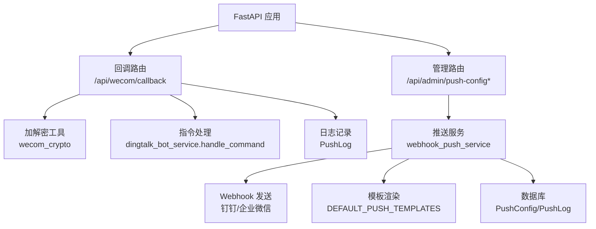
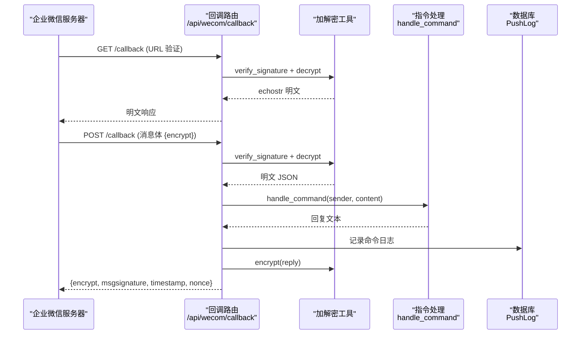
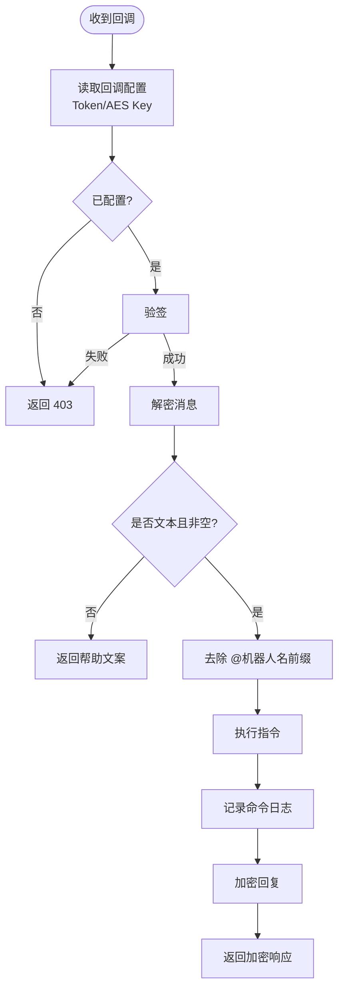
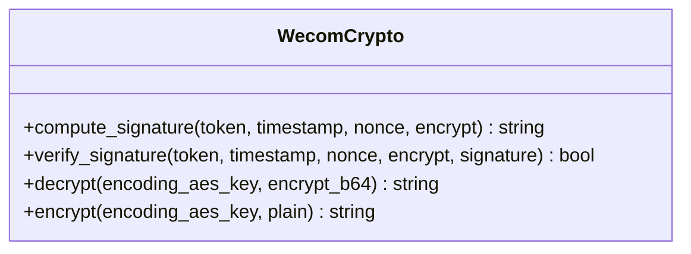
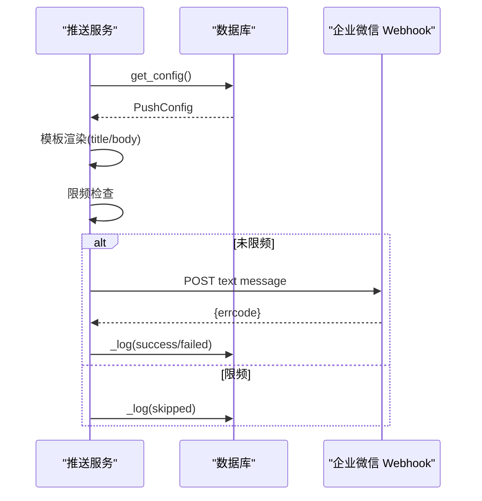
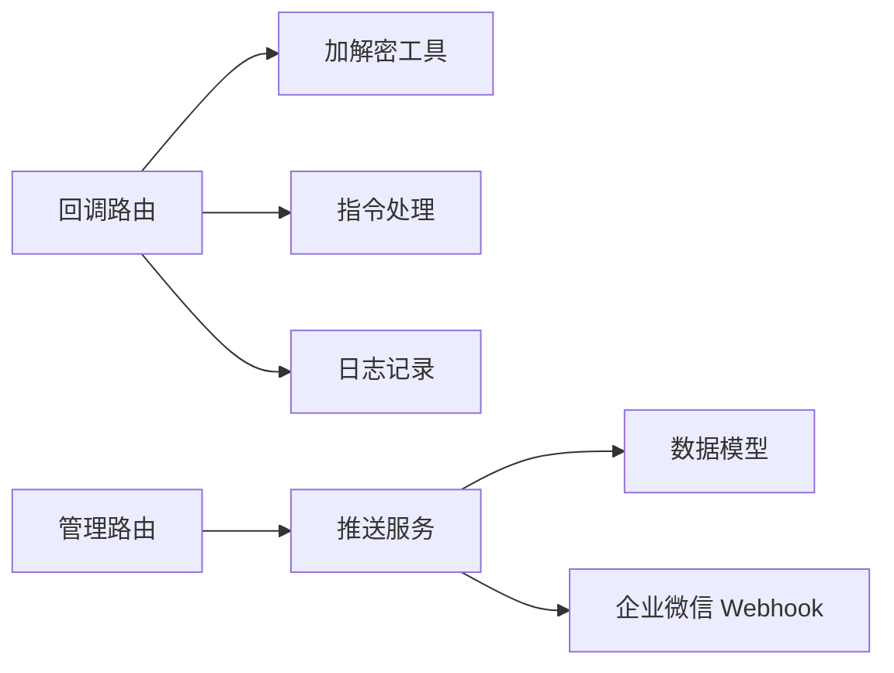

# 企业微信机器人集成

<cite>
**本文引用的文件**
- [wecom_bot.py](file://summer-homework-checkin/backend/app/routers/wecom_bot.py)
- [webhook_push_service.py](file://summer-homework-checkin/backend/app/services/webhook_push_service.py)
- [wecom_crypto.py](file://summer-homework-checkin/backend/app/utils/wecom_crypto.py)
- [config.py](file://summer-homework-checkin/backend/app/config.py)
- [models.py](file://summer-homework-checkin/backend/app/models.py)
- [admin.py](file://summer-homework-checkin/backend/app/routers/admin.py)
- [schemas.py](file://summer-homework-checkin/backend/app/schemas.py)
- [009_wecom_bot.py](file://summer-homework-checkin/backend/alembic/versions/009_wecom_bot.py)
</cite>

## 目录
1. [简介](#简介)
2. [项目结构](#项目结构)
3. [核心组件](#核心组件)
4. [架构总览](#架构总览)
5. [详细组件分析](#详细组件分析)
6. [依赖关系分析](#依赖关系分析)
7. [性能与可靠性](#性能与可靠性)
8. [故障排查指南](#故障排查指南)
9. [结论](#结论)
10. [附录：配置项说明](#附录配置项说明)

## 简介
本仓库在企业微信智能机器人方向实现了“双向消息”能力：支持在企微后台配置回调地址后，系统可接收群/单聊消息，解析指令并返回加密的被动回复；同时提供 Webhook 推送能力，将打卡事件（提交、通过、拒绝等）推送到企业微信群机器人。整体设计遵循官方协议，包含签名校验、AES 加解密、消息去重、限频与日志记录等关键安全与稳定性机制。

## 项目结构
与企业微信机器人相关的后端代码主要位于 summer-homework-checkin/backend 下，涉及路由、服务、工具、模型与迁移等模块：
- 路由层：处理回调接口与管理员配置接口
- 服务层：封装推送逻辑、模板渲染、限频与异步执行
- 工具层：实现企业微信回调消息的签名验证与 AES 加解密
- 数据层：存储推送配置、日志及业务实体
- 迁移脚本：为推送配置表新增企业微信回调所需字段

图表来源
- [wecom_bot.py:59-132](file://summer-homework-checkin/backend/app/routers/wecom_bot.py#L59-L132)
- [webhook_push_service.py:243-327](file://summer-homework-checkin/backend/app/services/webhook_push_service.py#L243-L327)
- [wecom_crypto.py:29-71](file://summer-homework-checkin/backend/app/utils/wecom_crypto.py#L29-L71)
- [config.py:114-122](file://summer-homework-checkin/backend/app/config.py#L114-L122)
- [models.py:229-271](file://summer-homework-checkin/backend/app/models.py#L229-L271)

章节来源
- [wecom_bot.py:1-133](file://summer-homework-checkin/backend/app/routers/wecom_bot.py#L1-L133)
- [webhook_push_service.py:1-327](file://summer-homework-checkin/backend/app/services/webhook_push_service.py#L1-L327)
- [wecom_crypto.py:1-71](file://summer-homework-checkin/backend/app/utils/wecom_crypto.py#L1-L71)
- [config.py:1-123](file://summer-homework-checkin/backend/app/config.py#L1-L123)
- [models.py:229-271](file://summer-homework-checkin/backend/app/models.py#L229-L271)
- [admin.py:402-487](file://summer-homework-checkin/backend/app/routers/admin.py#L402-L487)
- [schemas.py:350-394](file://summer-homework-checkin/backend/app/schemas.py#L350-L394)
- [009_wecom_bot.py:20-45](file://summer-homework-checkin/backend/alembic/versions/009_wecom_bot.py#L20-L45)

## 核心组件
- 回调路由：提供 GET/POST /api/wecom/callback，分别用于 URL 有效性验证与接收消息并返回加密回复
- 加解密工具：基于 AES-256-CBC 与 PKCS7 填充，实现消息明文/密文转换与 SHA1 签名校验
- 推送服务：负责将打卡事件按模板渲染后发送到企业微信 Webhook，支持限频、过滤、日志记录与测试
- 配置管理：管理员可通过后台保存推送配置与企业微信回调 Token/AES Key，并进行模板预览与测试
- 数据模型：PushConfig 存储推送开关、渠道 URL、事件过滤、限频、模板与回调密钥；PushLog 记录推送历史

章节来源
- [wecom_bot.py:28-132](file://summer-homework-checkin/backend/app/routers/wecom_bot.py#L28-L132)
- [wecom_crypto.py:18-71](file://summer-homework-checkin/backend/app/utils/wecom_crypto.py#L18-L71)
- [webhook_push_service.py:60-327](file://summer-homework-checkin/backend/app/services/webhook_push_service.py#L60-L327)
- [models.py:229-271](file://summer-homework-checkin/backend/app/models.py#L229-L271)
- [admin.py:402-487](file://summer-homework-checkin/backend/app/routers/admin.py#L402-L487)
- [schemas.py:350-394](file://summer-homework-checkin/backend/app/schemas.py#L350-L394)

## 架构总览
企业微信机器人集成分为两条主线：
- 双向消息（回调）：企微服务器向 /api/wecom/callback 发起请求，系统验签解密后解析指令，调用指令处理器生成回复文本，再加密并以 stream 一次性返回
- 事件推送（Webhook）：当打卡事件发生时，服务异步将事件按模板渲染后 POST 到企业微信 Webhook，并记录成功/失败日志

图表来源
- [wecom_bot.py:59-132](file://summer-homework-checkin/backend/app/routers/wecom_bot.py#L59-L132)
- [wecom_crypto.py:29-71](file://summer-homework-checkin/backend/app/utils/wecom_crypto.py#L29-L71)
- [models.py:260-271](file://summer-homework-checkin/backend/app/models.py#L260-L271)

## 详细组件分析

### 回调路由（/api/wecom/callback）
- GET 验证：从查询参数获取 msg_signature、timestamp、nonce、echostr，读取 PushConfig 中的回调 Token 与 AES Key，进行签名校验与解密，必须裸文本返回明文
- POST 接收：读取请求体中的 encrypt，验签并解密得到消息 JSON；若为非文本消息或内容为空，则返回帮助文案；否则去除 @机器人名前缀后交由指令处理器处理
- 消息去重：使用 LRU 缓存按 msgid 去重，避免网络重试导致重复执行
- 被动回复：仅支持 stream 类型，一次性 finish=true；回复体需加密并附带签名、时间戳与随机数

图表来源
- [wecom_bot.py:36-132](file://summer-homework-checkin/backend/app/routers/wecom_bot.py#L36-L132)
- [wecom_crypto.py:29-71](file://summer-homework-checkin/backend/app/utils/wecom_crypto.py#L29-L71)

章节来源
- [wecom_bot.py:28-132](file://summer-homework-checkin/backend/app/routers/wecom_bot.py#L28-L132)

### 加解密工具（wecom_crypto）
- 签名计算：对 token、timestamp、nonce、encrypt 字典序拼接后做 SHA1 哈希
- 签名校验：恒定时间比较，防时序侧信道攻击
- 解密流程：Base64 解码 → AES-256-CBC 解密 → 去除 PKCS7 填充 → 截取 16 字节随机串与 4 字节长度 → 提取明文
- 加密流程：构造明文结构（16 随机 + 长度 + 明文 + 空 receiveid）→ PKCS7 填充 → AES 加密 → Base64 编码

图表来源
- [wecom_crypto.py:18-71](file://summer-homework-checkin/backend/app/utils/wecom_crypto.py#L18-L71)

章节来源
- [wecom_crypto.py:1-71](file://summer-homework-checkin/backend/app/utils/wecom_crypto.py#L1-L71)

### 推送服务（webhook_push_service）
- 配置读取：get_config 懒创建默认行，并在首次初始化时补种默认模板
- 模板渲染：_render 安全替换已知占位符，未知占位符原样保留；空行自动清理
- 渠道发送：_send_webhook 严格校验 Webhook URL 前缀，禁止重定向，POST 文本消息并检查 errcode
- 限频控制：近 60 秒内成功推送条数达到上限则跳过
- 事件过滤：根据 PushConfig 的事件开关决定是否推送
- 日志记录：_log 写入 PushLog，不记录敏感信息（如 URL）
- 测试与预览：send_test 用当前模板渲染样例数据发送测试；render_preview 用于后台预览

图表来源
- [webhook_push_service.py:60-327](file://summer-homework-checkin/backend/app/services/webhook_push_service.py#L60-L327)
- [models.py:229-271](file://summer-homework-checkin/backend/app/models.py#L229-L271)

章节来源
- [webhook_push_service.py:1-327](file://summer-homework-checkin/backend/app/services/webhook_push_service.py#L1-L327)

### 配置管理（admin 路由与 Schema）
- 获取配置：GET /api/admin/push-config 返回 PushConfigOut
- 保存配置：PUT /api/admin/push-config 校验 Webhook URL 前缀、企微 EncodingAESKey 长度（必须 43 字符），回填默认模板，更新开关与限频
- 测试推送：POST /api/admin/push-config/test 发送测试消息
- 模板预览：POST /api/admin/push-config/preview 用样例数据预览渲染效果

章节来源
- [admin.py:402-487](file://summer-homework-checkin/backend/app/routers/admin.py#L402-L487)
- [schemas.py:350-394](file://summer-homework-checkin/backend/app/schemas.py#L350-L394)

### 数据模型与迁移
- PushConfig：新增 wecom_bot_token 与 wecom_bot_aes_key 字段，用于启用双向消息
- PushLog：记录推送历史，包含渠道、事件类型、标题摘要、状态与错误信息
- 迁移脚本：009_wecom_bot 为 push_config 表添加回调相关字段，并提供降级回滚

章节来源
- [models.py:229-271](file://summer-homework-checkin/backend/app/models.py#L229-L271)
- [009_wecom_bot.py:20-45](file://summer-homework-checkin/backend/alembic/versions/009_wecom_bot.py#L20-L45)

## 依赖关系分析
- 回调路由依赖：
  - 加解密工具：签名校验与 AES 加解密
  - 指令处理：复用钉钉机器人指令处理逻辑（handle_command），统一指令语义
  - 数据库：记录命令日志
- 推送服务依赖：
  - 配置：PushConfig 控制开关、渠道 URL、事件过滤、限频与模板
  - 工具：时间工具、模板常量
  - 外部：企业微信 Webhook 接口
- 配置管理依赖：
  - 推送服务：校验 URL、读取/保存配置、测试与预览
  - Schema：定义输入输出结构

图表来源
- [wecom_bot.py:20-132](file://summer-homework-checkin/backend/app/routers/wecom_bot.py#L20-L132)
- [webhook_push_service.py:17-327](file://summer-homework-checkin/backend/app/services/webhook_push_service.py#L17-L327)
- [models.py:229-271](file://summer-homework-checkin/backend/app/models.py#L229-L271)

章节来源
- [wecom_bot.py:20-132](file://summer-homework-checkin/backend/app/routers/wecom_bot.py#L20-L132)
- [webhook_push_service.py:17-327](file://summer-homework-checkin/backend/app/services/webhook_push_service.py#L17-L327)
- [models.py:229-271](file://summer-homework-checkin/backend/app/models.py#L229-L271)

## 性能与可靠性
- 消息去重：LRU 缓存限制最大条目数，避免内存无限增长
- 异步推送：使用守护线程异步执行推送，不影响主流程
- 限频保护：每分钟成功推送条数上限，防止触发平台限流
- 安全加固：
  - 严格校验 Webhook URL 前缀，禁止重定向，防 SSRF
  - 恒定时间签名比对，防时序侧信道
  - 回调接口在未配置 Token/AES Key 时直接 403
- 容错策略：推送异常仅记录日志，不中断主流程

[本节为通用指导，无需特定文件引用]

## 故障排查指南
- 回调 403：检查 PushConfig 中 wecom_bot_token 与 wecom_bot_aes_key 是否已配置且正确
- 签名失败：确认回调地址已在企微后台配置，且 Token/AES Key 与后台一致
- 解密失败：检查 EncodingAESKey 是否为 43 字符 Base64 字符串，且与企微后台一致
- 推送失败：查看 PushLog 中 error 字段，确认 Webhook URL 合法且企业微信返回 errcode==0
- 限频跳过：检查 rate_limit_per_min 设置，必要时提高阈值或降低推送频率

章节来源
- [wecom_bot.py:36-132](file://summer-homework-checkin/backend/app/routers/wecom_bot.py#L36-L132)
- [webhook_push_service.py:133-148](file://summer-homework-checkin/backend/app/services/webhook_push_service.py#L133-L148)
- [models.py:260-271](file://summer-homework-checkin/backend/app/models.py#L260-L271)

## 结论
本项目在企业微信机器人方向提供了完整的双向消息与事件推送能力，涵盖签名校验、AES 加解密、消息去重、限频、模板渲染与日志记录等关键特性。通过管理员后台可灵活配置回调密钥、推送开关与模板，满足日常打卡通知与群内指令交互需求。建议在生产环境严格配置环境变量与密钥，并定期审查 PushLog 以保障系统稳定与安全。

[本节为总结性内容，无需特定文件引用]

## 附录：配置项说明
- 回调密钥：
  - wecom_bot_token：企业微信智能机器人回调 Token
  - wecom_bot_aes_key：EncodingAESKey（43 字符 Base64）
- 推送开关：
  - enabled：总开关
  - push_on_submitted/push_on_approved/push_on_rejected：事件过滤
  - push_on_challenge：闯关打卡独立开关
- 渠道 URL：
  - dingtalk_url/wechat_url：钉钉/企业微信 Webhook 地址（需严格前缀校验）
- 限频：
  - rate_limit_per_min：每分钟最大推送条数（0=不限）
- 模板：
  - tpl_daily_title/body：日常打卡标题与正文
  - tpl_challenge_title/body：闯关打卡标题与正文
  - tpl_signature：签名（清空则不追加）

章节来源
- [models.py:229-257](file://summer-homework-checkin/backend/app/models.py#L229-L257)
- [admin.py:402-487](file://summer-homework-checkin/backend/app/routers/admin.py#L402-L487)
- [schemas.py:350-394](file://summer-homework-checkin/backend/app/schemas.py#L350-L394)