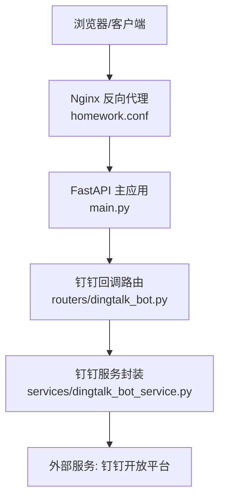
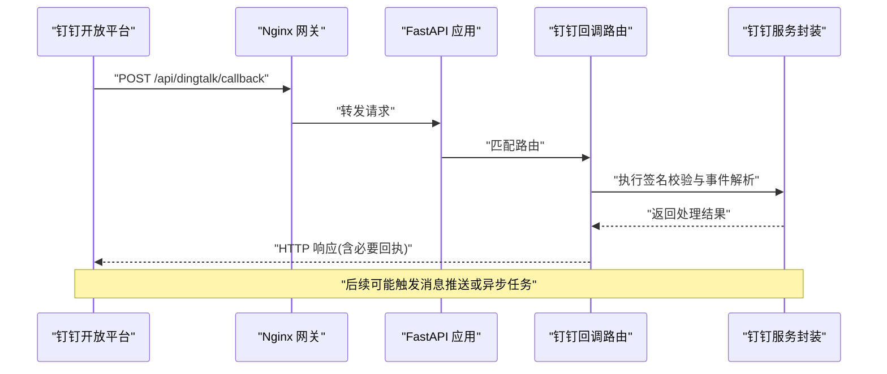
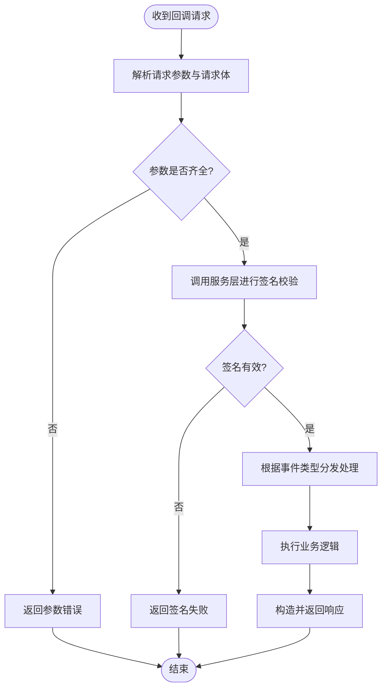
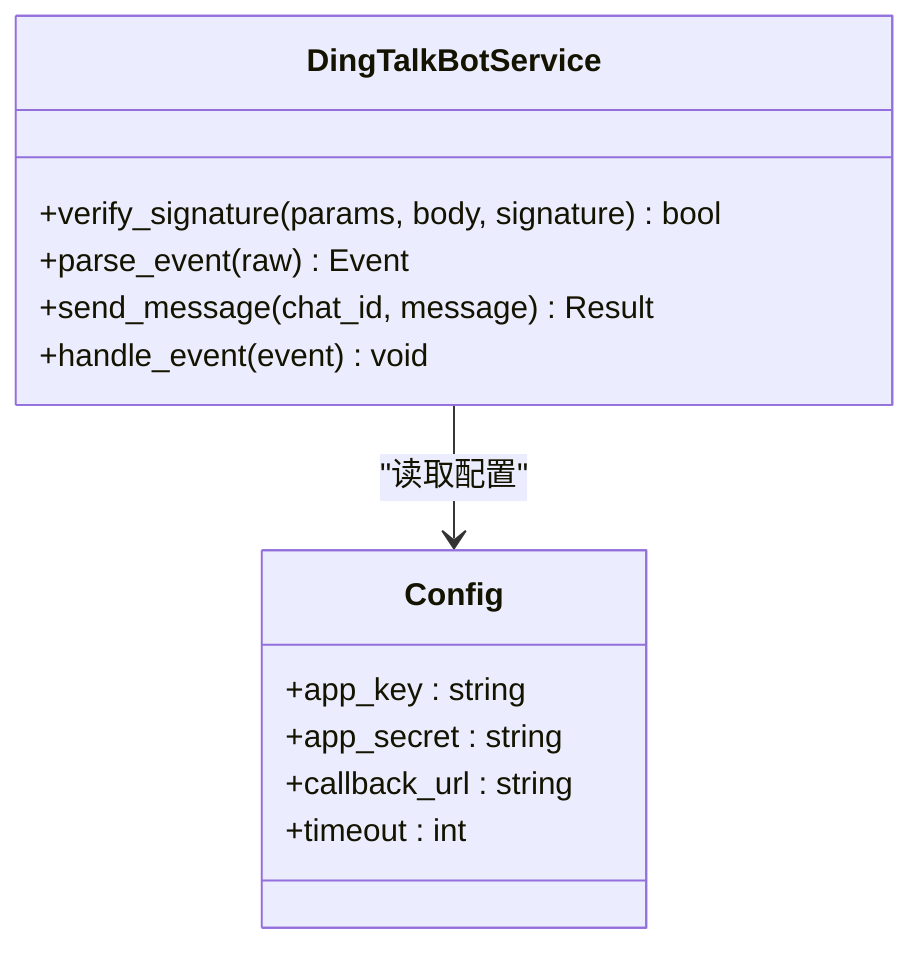
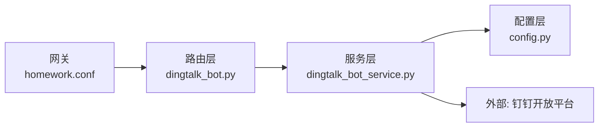

# 钉钉机器人集成

<cite>
**本文档引用的文件**   
- [summer-homework-checkin/backend/app/routers/dingtalk_bot.py](file://summer-homework-checkin/backend/app/routers/dingtalk_bot.py)
- [summer-homework-checkin/backend/app/services/dingtalk_bot_service.py](file://summer-homework-checkin/backend/app/services/dingtalk_bot_service.py)
- [summer-homework-checkin/backend/app/config.py](file://summer-homework-checkin/backend/app/config.py)
- [summer-homework-checkin/backend/app/main.py](file://summer-homework-checkin/backend/app/main.py)
- [nginx/sites/homework.conf](file://nginx/sites/homework.conf)
</cite>

## 目录
1. [简介](#简介)
2. [项目结构](#项目结构)
3. [核心组件](#核心组件)
4. [架构总览](#架构总览)
5. [详细组件分析](#详细组件分析)
6. [依赖关系分析](#依赖关系分析)
7. [性能考虑](#性能考虑)
8. [故障排查指南](#故障排查指南)
9. [结论](#结论)
10. [附录](#附录)

## 简介
本文件面向“暑期作业打卡”后端服务中的钉钉机器人集成，聚焦于事件回调处理、消息推送与配置管理。文档从系统架构、数据流、关键组件与接口调用流程出发，帮助读者快速理解并落地钉钉机器人能力（如事件订阅、签名校验、消息发送等）。

## 项目结构
围绕钉钉机器人集成的代码主要位于 summer-homework-checkin 后端模块中：
- 路由层：提供钉钉回调入口与相关 API
- 服务层：封装钉钉交互逻辑（签名校验、消息发送、事件解析）
- 配置层：集中管理钉钉应用凭据与回调地址
- 网关层：通过 Nginx 暴露回调路径并转发到后端服务

图表来源 
- [summer-homework-checkin/backend/app/main.py](file://summer-homework-checkin/backend/app/main.py)
- [summer-homework-checkin/backend/app/routers/dingtalk_bot.py](file://summer-homework-checkin/backend/app/routers/dingtalk_bot.py)
- [summer-homework-checkin/backend/app/services/dingtalk_bot_service.py](file://summer-homework-checkin/backend/app/services/dingtalk_bot_service.py)
- [nginx/sites/homework.conf](file://nginx/sites/homework.conf)

章节来源
- [summer-homework-checkin/backend/app/main.py](file://summer-homework-checkin/backend/app/main.py)
- [summer-homework-checkin/backend/app/routers/dingtalk_bot.py](file://summer-homework-checkin/backend/app/routers/dingtalk_bot.py)
- [summer-homework-checkin/backend/app/services/dingtalk_bot_service.py](file://summer-homework-checkin/backend/app/services/dingtalk_bot_service.py)
- [summer-homework-checkin/backend/app/config.py](file://summer-homework-checkin/backend/app/config.py)
- [nginx/sites/homework.conf](file://nginx/sites/homework.conf)

## 核心组件
- 路由层（dingtalk_bot.py）
  - 职责：接收钉钉回调请求，进行基础参数校验与鉴权，将业务委派给服务层处理。
  - 关键点：回调路径注册、请求体解析、响应格式适配。
- 服务层（dingtalk_bot_service.py）
  - 职责：实现钉钉签名校验、事件解析、消息发送等核心逻辑；与配置层解耦。
  - 关键点：安全校验、错误分类、重试策略（如有）、日志记录。
- 配置层（config.py）
  - 职责：集中管理钉钉 AppKey、AppSecret、回调 URL、超时等配置项。
  - 关键点：环境变量注入、默认值与安全读取。
- 网关层（homework.conf）
  - 职责：对外暴露回调路径，统一转发至后端服务，必要时做限流与访问控制。
  - 关键点：location 映射、proxy_pass、SSL 终止。

章节来源
- [summer-homework-checkin/backend/app/routers/dingtalk_bot.py](file://summer-homework-checkin/backend/app/routers/dingtalk_bot.py)
- [summer-homework-checkin/backend/app/services/dingtalk_bot_service.py](file://summer-homework-checkin/backend/app/services/dingtalk_bot_service.py)
- [summer-homework-checkin/backend/app/config.py](file://summer-homework-checkin/backend/app/config.py)
- [nginx/sites/homework.conf](file://nginx/sites/homework.conf)

## 架构总览
下图展示了从钉钉开放平台到后端服务的完整调用链路，包括回调验证、事件处理与消息推送。

图表来源 
- [summer-homework-checkin/backend/app/routers/dingtalk_bot.py](file://summer-homework-checkin/backend/app/routers/dingtalk_bot.py)
- [summer-homework-checkin/backend/app/services/dingtalk_bot_service.py](file://summer-homework-checkin/backend/app/services/dingtalk_bot_service.py)
- [nginx/sites/homework.conf](file://nginx/sites/homework.conf)

## 详细组件分析

### 路由层：钉钉回调入口
- 功能要点
  - 定义回调路径，接收钉钉事件 POST 请求
  - 解析请求体与查询参数（如时间戳、随机串、签名）
  - 调用服务层完成签名校验与事件分发
  - 返回钉钉要求的响应格式
- 设计模式
  - 路由与服务解耦，便于单元测试与扩展
  - 异常捕获与标准化错误响应

图表来源 
- [summer-homework-checkin/backend/app/routers/dingtalk_bot.py](file://summer-homework-checkin/backend/app/routers/dingtalk_bot.py)
- [summer-homework-checkin/backend/app/services/dingtalk_bot_service.py](file://summer-homework-checkin/backend/app/services/dingtalk_bot_service.py)

章节来源
- [summer-homework-checkin/backend/app/routers/dingtalk_bot.py](file://summer-homework-checkin/backend/app/routers/dingtalk_bot.py)

### 服务层：钉钉交互封装
- 功能要点
  - 实现签名校验算法（基于 AppKey/AppSecret 与请求参数）
  - 解析钉钉事件 JSON，提取用户、群聊、动作等上下文
  - 封装消息发送接口（文本、富文本、卡片等），支持可选重试
  - 统一错误码与日志埋点
- 数据结构
  - 事件对象：包含事件类型、时间戳、操作者、目标对象等字段
  - 消息对象：包含内容类型、正文、附件、跳转链接等
- 复杂度与性能
  - 签名校验为 O(n) 字符串处理，开销低
  - 消息发送为 I/O 操作，建议异步化与连接池优化

图表来源 
- [summer-homework-checkin/backend/app/services/dingtalk_bot_service.py](file://summer-homework-checkin/backend/app/services/dingtalk_bot_service.py)
- [summer-homework-checkin/backend/app/config.py](file://summer-homework-checkin/backend/app/config.py)

章节来源
- [summer-homework-checkin/backend/app/services/dingtalk_bot_service.py](file://summer-homework-checkin/backend/app/services/dingtalk_bot_service.py)
- [summer-homework-checkin/backend/app/config.py](file://summer-homework-checkin/backend/app/config.py)

### 配置层：钉钉凭据与环境变量
- 功能要点
  - 集中管理 AppKey、AppSecret、回调 URL、超时等
  - 支持从环境变量加载，避免硬编码敏感信息
  - 提供默认值与校验，确保启动时配置可用
- 最佳实践
  - 使用只读配置对象
  - 在测试环境提供 Mock 配置

章节来源
- [summer-homework-checkin/backend/app/config.py](file://summer-homework-checkin/backend/app/config.py)

### 网关层：Nginx 回调路径映射
- 功能要点
  - 定义 location 匹配回调路径
  - proxy_pass 转发到后端服务
  - 可配置 SSL、限流、访问白名单
- 注意事项
  - 确保路径与后端路由一致
  - 注意请求体大小限制与超时设置

章节来源
- [nginx/sites/homework.conf](file://nginx/sites/homework.conf)

## 依赖关系分析
- 组件耦合
  - 路由层仅依赖服务层与配置层，保持高内聚低耦合
  - 服务层依赖配置层与外部 HTTP 客户端（钉钉开放平台）
- 外部依赖
  - 钉钉开放平台 API（事件订阅、消息发送）
  - Nginx 作为反向代理
- 潜在循环依赖
  - 当前分层清晰，未见循环导入

图表来源 
- [summer-homework-checkin/backend/app/routers/dingtalk_bot.py](file://summer-homework-checkin/backend/app/routers/dingtalk_bot.py)
- [summer-homework-checkin/backend/app/services/dingtalk_bot_service.py](file://summer-homework-checkin/backend/app/services/dingtalk_bot_service.py)
- [summer-homework-checkin/backend/app/config.py](file://summer-homework-checkin/backend/app/config.py)
- [nginx/sites/homework.conf](file://nginx/sites/homework.conf)

章节来源
- [summer-homework-checkin/backend/app/routers/dingtalk_bot.py](file://summer-homework-checkin/backend/app/routers/dingtalk_bot.py)
- [summer-homework-checkin/backend/app/services/dingtalk_bot_service.py](file://summer-homework-checkin/backend/app/services/dingtalk_bot_service.py)
- [summer-homework-checkin/backend/app/config.py](file://summer-homework-checkin/backend/app/config.py)
- [nginx/sites/homework.conf](file://nginx/sites/homework.conf)

## 性能考虑
- 签名校验
  - 尽量复用计算结果，避免重复哈希
  - 对超大请求体进行前置长度限制
- 消息发送
  - 使用连接池与超时控制
  - 对高频场景采用队列异步化与批量发送
- 网关层
  - 合理设置 worker 进程与缓存
  - 启用 gzip 压缩与静态资源缓存

[本节为通用指导，不直接分析具体文件]

## 故障排查指南
- 常见问题
  - 回调签名失败：检查 AppKey/AppSecret、时间戳与随机串、请求体一致性
  - 回调路径不可达：确认 Nginx location 与 proxy_pass 配置正确
  - 事件未触发：核对钉钉开放平台的事件订阅配置与回调 URL 可达性
- 定位方法
  - 查看服务层日志输出（请求入参、签名结果、事件类型）
  - 使用抓包工具验证请求头与请求体
  - 逐步关闭中间件以隔离问题

章节来源
- [summer-homework-checkin/backend/app/services/dingtalk_bot_service.py](file://summer-homework-checkin/backend/app/services/dingtalk_bot_service.py)
- [summer-homework-checkin/backend/app/routers/dingtalk_bot.py](file://summer-homework-checkin/backend/app/routers/dingtalk_bot.py)
- [nginx/sites/homework.conf](file://nginx/sites/homework.conf)

## 结论
本集成方案通过清晰的分层设计与安全的签名校验机制，实现了钉钉事件回调与消息推送的稳定对接。建议在后续迭代中引入异步队列、重试与监控告警，以提升系统的可靠性与可观测性。

[本节为总结性内容，不直接分析具体文件]

## 附录
- 术语说明
  - 回调：钉钉开放平台向你的服务发起的 HTTP 请求，用于通知事件
  - 签名校验：基于密钥与请求参数的完整性与真实性验证
  - 事件：用户或系统在钉钉侧触发的行为（如打卡、审批等）
- 参考路径
  - 路由实现：[summer-homework-checkin/backend/app/routers/dingtalk_bot.py](file://summer-homework-checkin/backend/app/routers/dingtalk_bot.py)
  - 服务实现：[summer-homework-checkin/backend/app/services/dingtalk_bot_service.py](file://summer-homework-checkin/backend/app/services/dingtalk_bot_service.py)
  - 配置管理：[summer-homework-checkin/backend/app/config.py](file://summer-homework-checkin/backend/app/config.py)
  - 网关配置：[nginx/sites/homework.conf](file://nginx/sites/homework.conf)