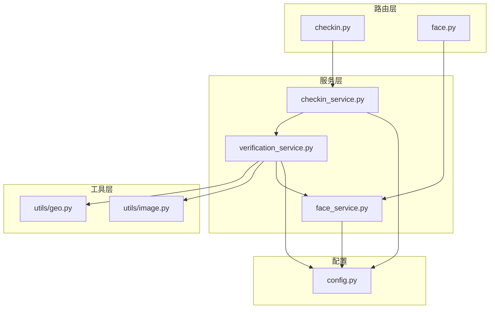
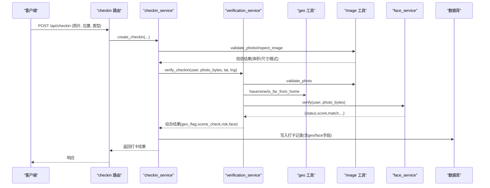
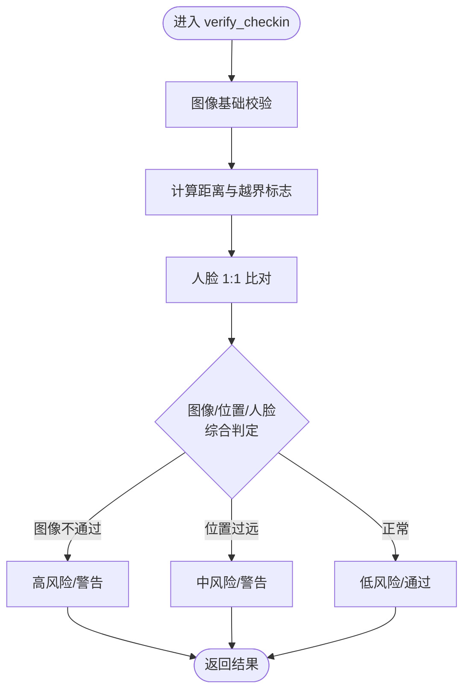
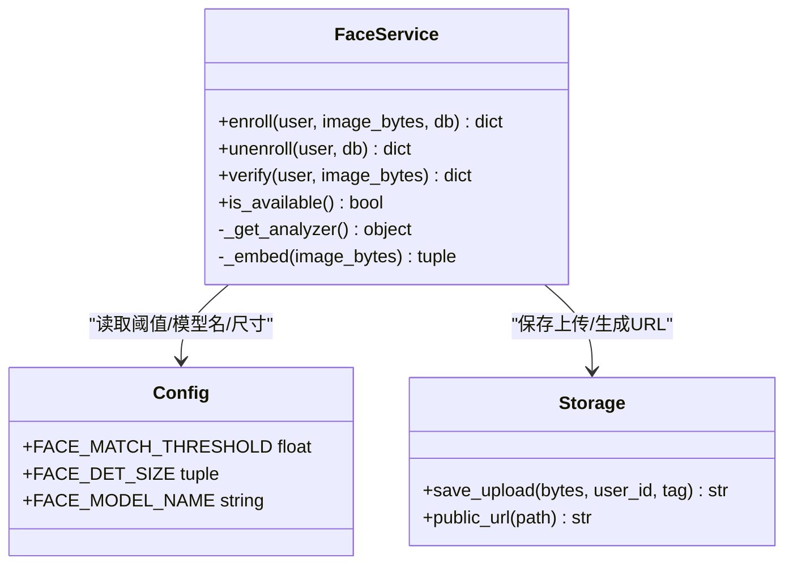
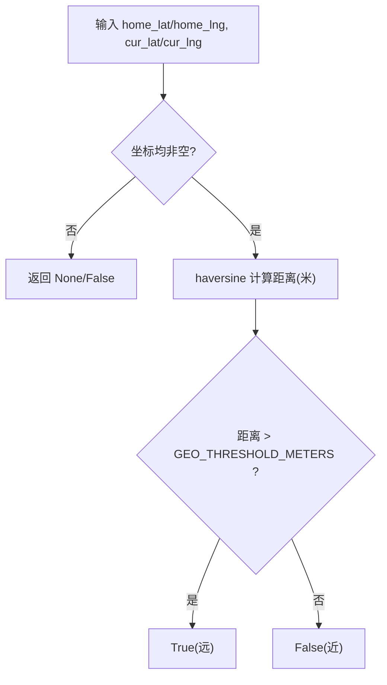
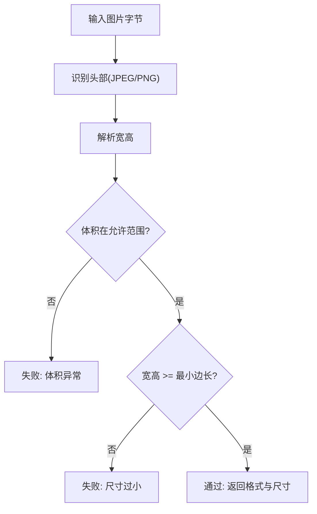
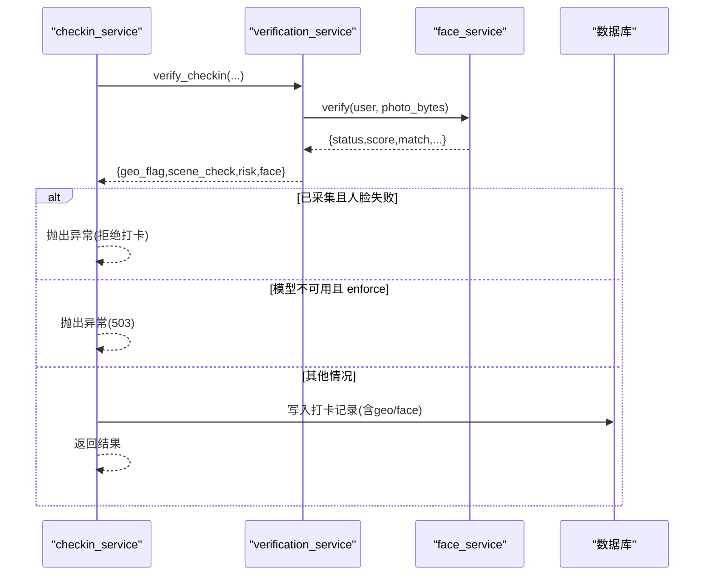
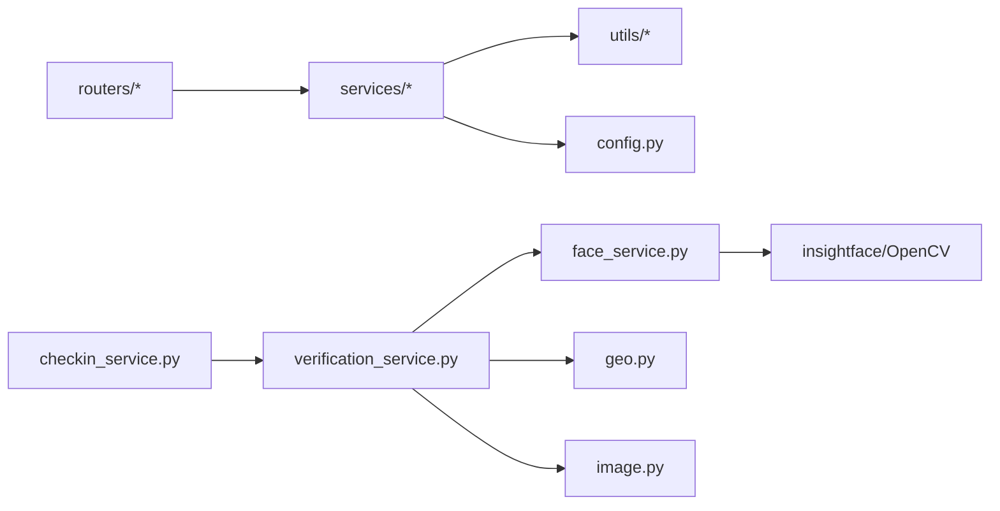

# 验证服务

<cite>
**本文引用的文件列表**
- [verification_service.py](file://summer-homework-checkin/backend/app/services/verification_service.py)
- [face_service.py](file://summer-homework-checkin/backend/app/services/face_service.py)
- [geo.py](file://summer-homework-checkin/backend/app/utils/geo.py)
- [image.py](file://summer-homework-checkin/backend/app/utils/image.py)
- [config.py](file://summer-homework-checkin/backend/app/config.py)
- [checkin_service.py](file://summer-homework-checkin/backend/app/services/checkin_service.py)
- [checkin.py](file://summer-homework-checkin/backend/app/routers/checkin.py)
- [face.py](file://summer-homework-checkin/backend/app/routers/face.py)
</cite>

## 目录
1. [简介](#简介)
2. [项目结构](#项目结构)
3. [核心组件](#核心组件)
4. [架构总览](#架构总览)
5. [详细组件分析](#详细组件分析)
6. [依赖关系分析](#依赖关系分析)
7. [性能与缓存优化](#性能与缓存优化)
8. [配置参数与调优建议](#配置参数与调优建议)
9. [故障排查指南](#故障排查指南)
10. [结论](#结论)

## 简介
本技术文档围绕“暑假作业打卡”系统中的“验证服务”，系统性阐述多重验证机制的实现与集成，包括：
- 地理位置一致性校验
- 图像真实性与场景合规性检测
- 人脸识别（1:1 本人比对）的集成与降级策略
- 防作弊算法设计原理（位置偏差计算、图像真实性检测、人脸比对策略）
- 验证结果评分体系与判定规则
- 第三方 AI 服务调用封装与错误处理
- 配置参数说明与调优建议
- 性能优化与缓存机制

该服务以“可插拔、可降级、可审计”为原则，在保障用户体验的同时最大化降低代打卡风险。

## 项目结构
验证相关代码主要位于 summer-homework-checkin/backend 下，采用按功能分层组织：
- routers：HTTP 路由层，负责请求解析与响应组装
- services：业务逻辑与服务编排
- utils：通用工具（地理距离、图像解析等）
- config：全局配置与环境变量注入

图示来源
- [checkin.py:1-80](file://summer-homework-checkin/backend/app/routers/checkin.py#L1-L80)
- [face.py:1-45](file://summer-homework-checkin/backend/app/routers/face.py#L1-L45)
- [checkin_service.py:1-254](file://summer-homework-checkin/backend/app/services/checkin_service.py#L1-L254)
- [verification_service.py:1-71](file://summer-homework-checkin/backend/app/services/verification_service.py#L1-L71)
- [face_service.py:1-133](file://summer-homework-checkin/backend/app/services/face_service.py#L1-L133)
- [geo.py:1-24](file://summer-homework-checkin/backend/app/utils/geo.py#L1-L24)
- [image.py:1-61](file://summer-homework-checkin/backend/app/utils/image.py#L1-L61)
- [config.py:1-50](file://summer-homework-checkin/backend/app/config.py#L1-L50)

章节来源
- [checkin.py:1-80](file://summer-homework-checkin/backend/app/routers/checkin.py#L1-L80)
- [face.py:1-45](file://summer-homework-checkin/backend/app/routers/face.py#L1-L45)
- [checkin_service.py:1-254](file://summer-homework-checkin/backend/app/services/checkin_service.py#L1-L254)
- [verification_service.py:1-71](file://summer-homework-checkin/backend/app/services/verification_service.py#L1-L71)
- [face_service.py:1-133](file://summer-homework-checkin/backend/app/services/face_service.py#L1-L133)
- [geo.py:1-24](file://summer-homework-checkin/backend/app/utils/geo.py#L1-L24)
- [image.py:1-61](file://summer-homework-checkin/backend/app/utils/image.py#L1-L61)
- [config.py:1-50](file://summer-homework-checkin/backend/app/config.py#L1-L50)

## 核心组件
- 验证服务编排器 verification_service.verify_checkin：串联图像校验、地理位置校验、人脸 1:1 比对，输出结构化结果与风险等级。
- 人脸识别服务 face_service：基于 insightface 模型实现人脸检测、特征提取与 1:1 余弦相似度比对；提供 enroll/unenroll/verify/is_available 能力。
- 地理位置工具 geo.haversine/is_far_from_home：计算经纬度距离并判断是否超出阈值。
- 图像工具 image.validate_photo/inspect_image：轻量级 JPEG/PNG 解析，校验体积与尺寸，过滤占位图/缩略图。
- 配置中心 config：集中管理阈值、路径、模型名称、人脸策略等环境变量。
- 打卡服务 checkin_service.create_checkin：整合上述能力，执行补卡规则、保存凭证、触发通知，并根据人脸策略决定是否放行或拒绝。

章节来源
- [verification_service.py:1-71](file://summer-homework-checkin/backend/app/services/verification_service.py#L1-L71)
- [face_service.py:1-133](file://summer-homework-checkin/backend/app/services/face_service.py#L1-L133)
- [geo.py:1-24](file://summer-homework-checkin/backend/app/utils/geo.py#L1-L24)
- [image.py:1-61](file://summer-homework-checkin/backend/app/utils/image.py#L1-L61)
- [config.py:1-50](file://summer-homework-checkin/backend/app/config.py#L1-L50)
- [checkin_service.py:1-254](file://summer-homework-checkin/backend/app/services/checkin_service.py#L1-L254)

## 架构总览
下图展示一次打卡请求从路由到验证落库的完整流程，以及关键分支（人脸策略、服务不可用降级）。

图示来源
- [checkin.py:1-80](file://summer-homework-checkin/backend/app/routers/checkin.py#L1-L80)
- [checkin_service.py:64-163](file://summer-homework-checkin/backend/app/services/checkin_service.py#L64-L163)
- [verification_service.py:19-71](file://summer-homework-checkin/backend/app/services/verification_service.py#L19-L71)
- [geo.py:6-24](file://summer-homework-checkin/backend/app/utils/geo.py#L6-L24)
- [image.py:51-61](file://summer-homework-checkin/backend/app/utils/image.py#L51-L61)
- [face_service.py:99-125](file://summer-homework-checkin/backend/app/services/face_service.py#L99-L125)

## 详细组件分析

### 验证服务编排（verification_service.verify_checkin）
- 输入：用户对象、照片字节、经纬度
- 处理：
  - 图像基础校验（体积、格式、最小边长）
  - 地理位置一致性（计算距常用位置距离，标记是否过远）
  - 人脸 1:1 比对（调用 face_service.verify）
  - 综合风险判定：根据图像、位置、人脸状态组合出 scene_check 与 risk
- 输出：包含 photo_ok/detail、geo_distance/geo_flag、face 子结果、scene_check、risk 的结构化字典

图示来源
- [verification_service.py:19-71](file://summer-homework-checkin/backend/app/services/verification_service.py#L19-L71)
- [image.py:51-61](file://summer-homework-checkin/backend/app/utils/image.py#L51-L61)
- [geo.py:6-24](file://summer-homework-checkin/backend/app/utils/geo.py#L6-L24)
- [face_service.py:99-125](file://summer-homework-checkin/backend/app/services/face_service.py#L99-L125)

章节来源
- [verification_service.py:1-71](file://summer-homework-checkin/backend/app/services/verification_service.py#L1-L71)

### 人脸识别服务（face_service）
- 模型加载：懒加载 insightface FaceAnalysis，线程安全，仅加载一次；首次按需下载模型至本地缓存目录。
- 特征提取：对现场照解码、检测最大人脸、提取 512 维 embedding。
- 注册 enroll：要求检测到且仅一张人脸，保存底图路径与 embedding，标记已采集。
- 撤销 unenroll：清除采集状态与 embedding。
- 比对 verify：将现场 embedding 与底图 embedding 做余弦相似度，超过阈值即匹配成功。
- 可用性 is_available：供健康检查与前端提示使用。

图示来源
- [face_service.py:1-133](file://summer-homework-checkin/backend/app/services/face_service.py#L1-L133)
- [config.py:41-49](file://summer-homework-checkin/backend/app/config.py#L41-L49)
- [storage.py](file://summer-homework-checkin/backend/app/utils/storage.py)

章节来源
- [face_service.py:1-133](file://summer-homework-checkin/backend/app/services/face_service.py#L1-L133)
- [config.py:41-49](file://summer-homework-checkin/backend/app/config.py#L41-L49)

### 地理位置工具（geo）
- haversine：基于球面三角公式计算两点间距离（米），任一坐标为 None 时返回 None。
- is_far_from_home：比较距离与阈值，返回是否“远离常用位置”。

图示来源
- [geo.py:6-24](file://summer-homework-checkin/backend/app/utils/geo.py#L6-L24)
- [config.py:28-28](file://summer-homework-checkin/backend/app/config.py#L28-L28)

章节来源
- [geo.py:1-24](file://summer-homework-checkin/backend/app/utils/geo.py#L1-L24)
- [config.py:28-28](file://summer-homework-checkin/backend/app/config.py#L28-L28)

### 图像工具（image）
- inspect_image：识别 JPEG/PNG 头，解析宽高，返回格式与尺寸信息。
- validate_photo：校验体积范围与最小边长，过滤占位图/缩略图。

图示来源
- [image.py:5-61](file://summer-homework-checkin/backend/app/utils/image.py#L5-L61)
- [config.py:30-32](file://summer-homework-checkin/backend/app/config.py#L30-L32)

章节来源
- [image.py:1-61](file://summer-homework-checkin/backend/app/utils/image.py#L1-L61)
- [config.py:30-32](file://summer-homework-checkin/backend/app/config.py#L30-L32)

### 打卡服务集成（checkin_service.create_checkin）
- 前置校验：照片体积/尺寸合法性
- 补卡规则：目标日期有效性、重复校验、月度上限、凭证必填
- 保存凭证：照片与补充凭证落盘
- 防作弊校验：调用 verification_service.verify_checkin
- 人脸策略：
  - 若已采集底图且人脸比对失败（mismatch/no_face/multiple_faces），直接拒绝
  - 若已采集但模型不可用，且 FACE_MODE_ON_ENROLLED=“enforce”，返回 503 提示稍后重试
- 落库：写入打卡记录，附带 geo/face 字段，初始审核状态 pending
- 通知：向用户与家长发送提交通知，必要时提醒位置异常

图示来源
- [checkin_service.py:64-163](file://summer-homework-checkin/backend/app/services/checkin_service.py#L64-L163)
- [verification_service.py:19-71](file://summer-homework-checkin/backend/app/services/verification_service.py#L19-L71)
- [face_service.py:99-125](file://summer-homework-checkin/backend/app/services/face_service.py#L99-L125)

章节来源
- [checkin_service.py:1-254](file://summer-homework-checkin/backend/app/services/checkin_service.py#L1-L254)

### 路由层接口（routers）
- /api/checkin：接收打卡请求，委托 checkin_service 处理，返回标准化响应
- /api/face：人脸底图采集、查询与撤销

章节来源
- [checkin.py:1-80](file://summer-homework-checkin/backend/app/routers/checkin.py#L1-L80)
- [face.py:1-45](file://summer-homework-checkin/backend/app/routers/face.py#L1-L45)

## 依赖关系分析
- 耦合与内聚
  - verification_service 作为编排器，低耦合地聚合 image、geo、face 三个独立能力，内聚于“防作弊判定”职责
  - face_service 自包含模型加载、特征提取与比对逻辑，对外暴露简洁 API
  - checkin_service 聚焦业务规则（补卡、积分、连续天数、通知），将风控决策下沉至 verification_service
- 外部依赖
  - insightface 模型与 OpenCV 用于人脸检测与特征提取
  - SQLite 用于持久化
  - 文件系统用于存储上传的图片与人脸底图
- 潜在循环依赖
  - 当前模块间单向依赖清晰，未见循环导入

图示来源
- [checkin.py:1-80](file://summer-homework-checkin/backend/app/routers/checkin.py#L1-L80)
- [face.py:1-45](file://summer-homework-checkin/backend/app/routers/face.py#L1-L45)
- [checkin_service.py:1-254](file://summer-homework-checkin/backend/app/services/checkin_service.py#L1-L254)
- [verification_service.py:1-71](file://summer-homework-checkin/backend/app/services/verification_service.py#L1-L71)
- [face_service.py:1-133](file://summer-homework-checkin/backend/app/services/face_service.py#L1-L133)
- [geo.py:1-24](file://summer-homework-checkin/backend/app/utils/geo.py#L1-L24)
- [image.py:1-61](file://summer-homework-checkin/backend/app/utils/image.py#L1-L61)
- [config.py:1-50](file://summer-homework-checkin/backend/app/config.py#L1-L50)

## 性能与缓存优化
- 模型懒加载与单例
  - face_service 使用全局锁保护的单例模式，确保 insightface 分析器仅初始化一次，避免重复加载带来的延迟与内存开销
- 线程安全
  - 模型加载与推理阶段加锁，防止并发竞态
- 模型本地缓存
  - 模型首次运行自动下载到 ~/.insightface，后续启动无需网络下载
- 图像预处理
  - 使用轻量级 JPEG/PNG 解析，避免引入重型图像处理库，减少依赖与启动时间
- 建议
  - 在高并发场景可考虑将人脸比对结果短期缓存（如 Redis，按 user_id+date 维度），注意过期策略与一致性
  - 对大分辨率照片进行缩放后再入模，平衡精度与速度
  - 针对 CPU 环境，合理设置 det_size 与批处理策略

[本节为通用性能建议，不直接分析具体文件]

## 配置参数与调优建议
- 地理位置
  - GEO_THRESHOLD_METERS：默认 1500 米，可根据校园/社区范围调整
- 图像校验
  - MIN_PHOTO_BYTES/PHOTO_MAX_BYTES/MIN_PHOTO_DIM：控制体积与尺寸门槛，防止占位图/缩略图
- 人脸识别
  - FACE_MATCH_THRESHOLD：余弦相似度阈值，默认 0.4；提高更严格，降低误放但可能增加拒真率
  - FACE_DET_SIZE：检测输入尺寸，默认 (320,320)；更小更快但漏检风险上升
  - FACE_MODEL_NAME：模型名称，默认 buffalo_l
  - FACE_MODE_ON_ENROLLED：已采集后的策略，“enforce”强拦截、“soft”容错优先
- 打卡与补卡
  - MAX_MAKEUP_PER_MONTH：每月补卡次数上限
  - CHECKIN_POINTS/MAKEUP_POINTS：正常打卡与补卡积分

章节来源
- [config.py:28-50](file://summer-homework-checkin/backend/app/config.py#L28-L50)

## 故障排查指南
- 人脸识别服务不可用
  - 现象：返回 status=model_unavailable，或 503 错误
  - 排查：确认 insightface 安装与模型下载；检查 is_available 返回值；在 enforce 模式下需等待服务恢复
- 未检测到人脸或多张人脸
  - 现象：status=no_face 或 multiple_faces
  - 排查：指导用户正对镜头、单人拍摄；提升光照与清晰度
- 人脸比对不通过
  - 现象：status=mismatch，score 低于阈值
  - 排查：重新采集底图；适当下调阈值；检查底图质量
- 位置异常
  - 现象：geo_flag=True
  - 排查：校准设备定位；调整 GEO_THRESHOLD_METERS；结合场景判断是否为真实移动
- 图像校验失败
  - 现象：体积/尺寸不符合要求或非受支持格式
  - 排查：引导用户上传符合要求的原始照片

章节来源
- [face_service.py:99-133](file://summer-homework-checkin/backend/app/services/face_service.py#L99-L133)
- [verification_service.py:40-71](file://summer-homework-checkin/backend/app/services/verification_service.py#L40-L71)
- [checkin_service.py:113-123](file://summer-homework-checkin/backend/app/services/checkin_service.py#L113-L123)
- [image.py:51-61](file://summer-homework-checkin/backend/app/utils/image.py#L51-L61)
- [geo.py:19-24](file://summer-homework-checkin/backend/app/utils/geo.py#L19-L24)

## 结论
验证服务通过“图像真实性 + 地理位置一致性 + 人脸 1:1 比对”的多重校验，构建了稳健的防作弊体系。其模块化设计与可插拔接口便于接入更强大的视觉 AI 能力；同时具备完善的降级策略与错误处理，确保在第三方服务不可用时仍能给出明确反馈与风险提示。配合合理的配置与性能优化，可在不同部署环境下稳定运行，兼顾安全性与用户体验。