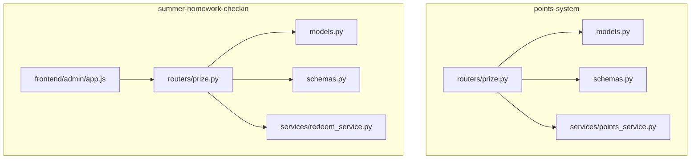
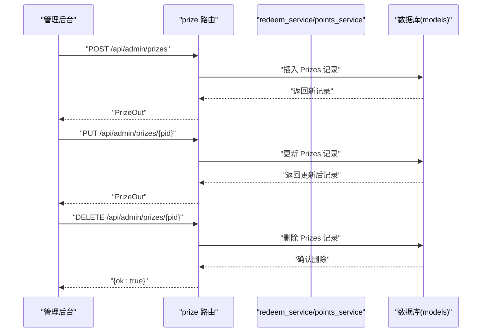
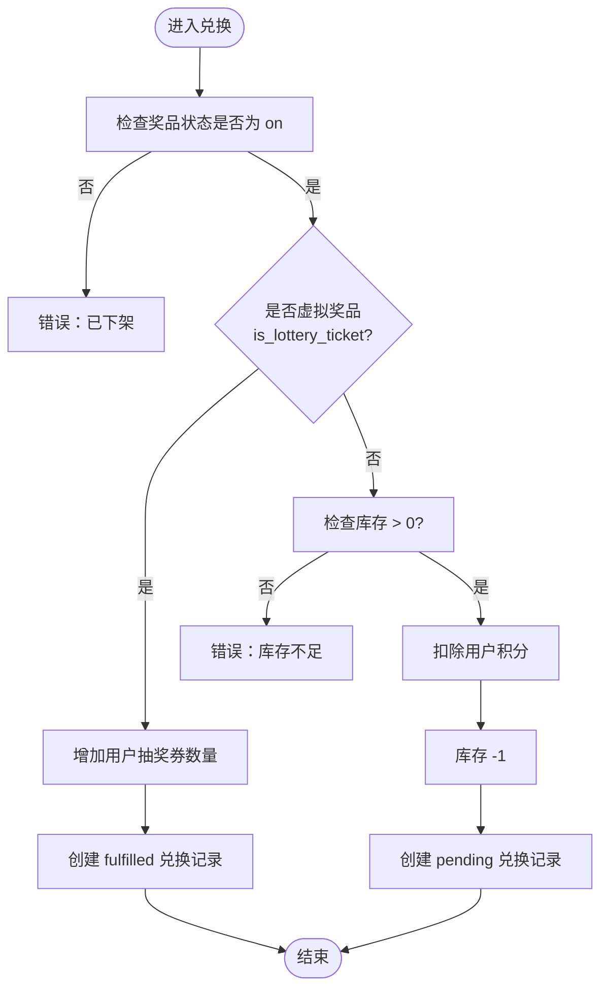
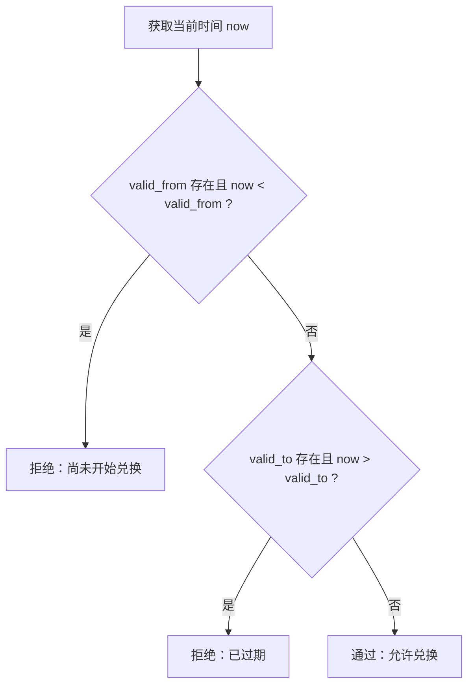
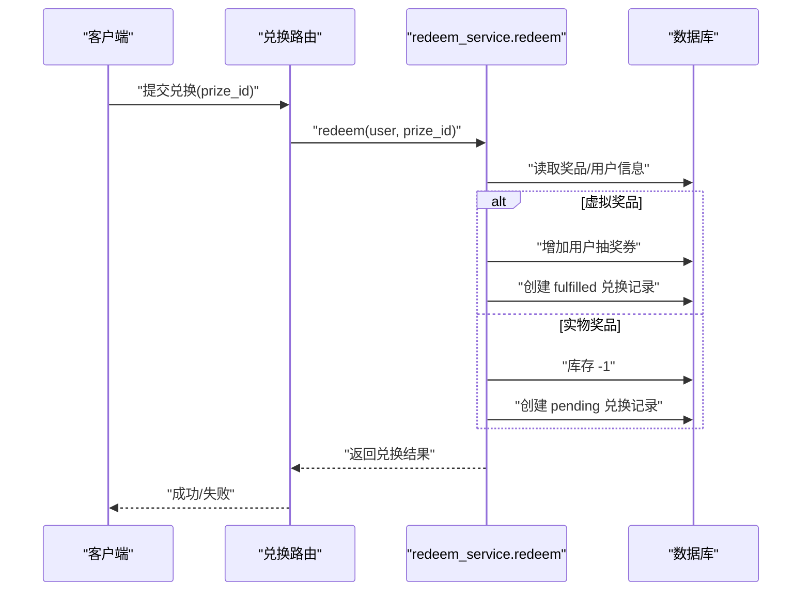
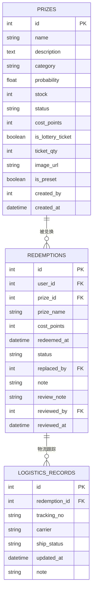
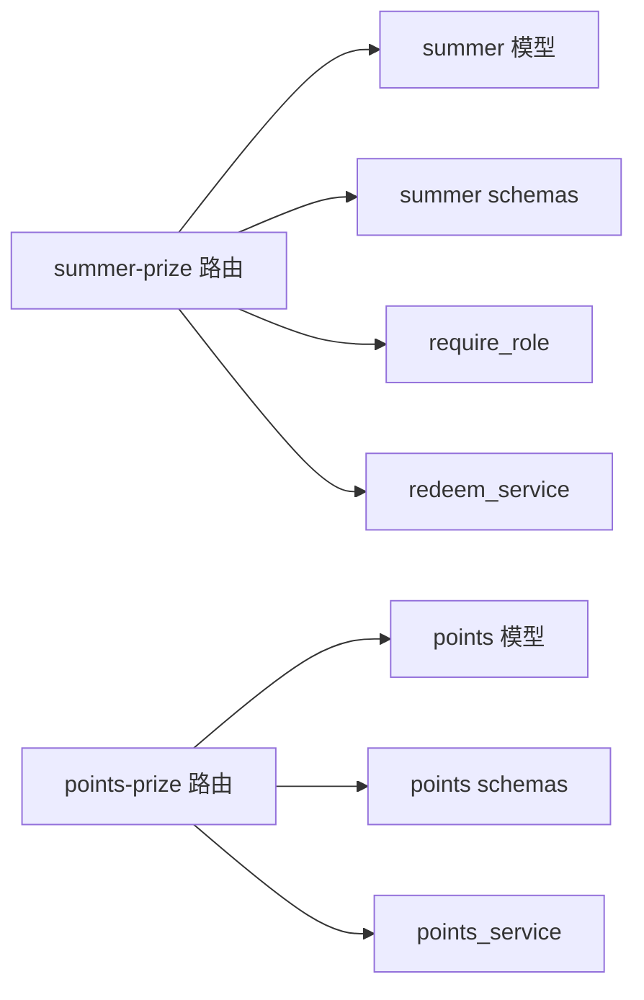

# 奖品管理路由

<cite>
**本文引用的文件**
- [points-system/backend/app/routers/prize.py](file://points-system/backend/app/routers/prize.py)
- [summer-homework-checkin/backend/app/routers/prize.py](file://summer-homework-checkin/backend/app/routers/prize.py)
- [points-system/backend/app/models.py](file://points-system/backend/app/models.py)
- [summer-homework-checkin/backend/app/models.py](file://summer-homework-checkin/backend/app/models.py)
- [points-system/backend/app/schemas.py](file://points-system/backend/app/schemas.py)
- [summer-homework-checkin/backend/app/schemas.py](file://summer-homework-checkin/backend/app/schemas.py)
- [points-system/backend/app/services/points_service.py](file://points-system/backend/app/services/points_service.py)
- [summer-homework-checkin/backend/app/services/redeem_service.py](file://summer-homework-checkin/backend/app/services/redeem_service.py)
- [summer-homework-checkin/frontend/admin/app.js](file://summer-homework-checkin/frontend/admin/app.js)
</cite>

## 目录
1. [简介](#简介)
2. [项目结构](#项目结构)
3. [核心组件](#核心组件)
4. [架构总览](#架构总览)
5. [详细组件分析](#详细组件分析)
6. [依赖关系分析](#依赖关系分析)
7. [性能与一致性](#性能与一致性)
8. [故障排查指南](#故障排查指南)
9. [结论](#结论)
10. [附录：API 示例与管理后台集成](#附录api-示例与管理后台集成)

## 简介
本技术文档围绕“奖品管理路由”展开，覆盖以下目标：
- 奖品增删改查接口设计与实现细节
- 奖品类型分类、库存管理与有效期控制的业务逻辑
- 积分兑换流程的状态管理与事务处理机制
- 发放记录与物流跟踪的数据结构设计建议
- 批量导入导出方案
- 完整 API 调用示例与管理后台集成方式
- 与积分兑换系统的关联关系和数据同步策略

仓库包含两套后端实现：
- points-system：面向积分账户与流水的轻量版（含基础奖品列表与兑换服务）
- summer-homework-checkin：面向打卡与抽奖场景的完整版（含管理员权限、分类、概率、虚拟奖品等）

## 项目结构
与奖品管理相关的关键位置如下：
- 路由层
  - points-system: /backend/app/routers/prize.py
  - summer-homework-checkin: /backend/app/routers/prize.py
- 数据模型
  - points-system: /backend/app/models.py
  - summer-homework-checkin: /backend/app/models.py
- 请求/响应模式
  - points-system: /backend/app/schemas.py
  - summer-homework-checkin: /backend/app/schemas.py
- 业务服务
  - points-system: /backend/app/services/points_service.py
  - summer-homework-checkin: /backend/app/services/redeem_service.py
- 管理前端
  - summer-homework-checkin: /frontend/admin/app.js

图表来源
- [points-system/backend/app/routers/prize.py:1-42](file://points-system/backend/app/routers/prize.py#L1-L42)
- [summer-homework-checkin/backend/app/routers/prize.py:1-66](file://summer-homework-checkin/backend/app/routers/prize.py#L1-L66)
- [points-system/backend/app/models.py:68-94](file://points-system/backend/app/models.py#L68-L94)
- [summer-homework-checkin/backend/app/models.py:103-161](file://summer-homework-checkin/backend/app/models.py#L103-L161)
- [points-system/backend/app/schemas.py:47-66](file://points-system/backend/app/schemas.py#L47-L66)
- [summer-homework-checkin/backend/app/schemas.py:98-138](file://summer-homework-checkin/backend/app/schemas.py#L98-L138)
- [points-system/backend/app/services/points_service.py:94-145](file://points-system/backend/app/services/points_service.py#L94-L145)
- [summer-homework-checkin/backend/app/services/redeem_service.py:22-94](file://summer-homework-checkin/backend/app/services/redeem_service.py#L22-L94)
- [summer-homework-checkin/frontend/admin/app.js:138-164](file://summer-homework-checkin/frontend/admin/app.js#L138-L164)

章节来源
- [points-system/backend/app/routers/prize.py:1-42](file://points-system/backend/app/routers/prize.py#L1-L42)
- [summer-homework-checkin/backend/app/routers/prize.py:1-66](file://summer-homework-checkin/backend/app/routers/prize.py#L1-L66)
- [points-system/backend/app/models.py:68-94](file://points-system/backend/app/models.py#L68-L94)
- [summer-homework-checkin/backend/app/models.py:103-161](file://summer-homework-checkin/backend/app/models.py#L103-L161)
- [points-system/backend/app/schemas.py:47-66](file://points-system/backend/app/schemas.py#L47-L66)
- [summer-homework-checkin/backend/app/schemas.py:98-138](file://summer-homework-checkin/backend/app/schemas.py#L98-L138)
- [points-system/backend/app/services/points_service.py:94-145](file://points-system/backend/app/services/points_service.py#L94-L145)
- [summer-homework-checkin/backend/app/services/redeem_service.py:22-94](file://summer-homework-checkin/backend/app/services/redeem_service.py#L22-L94)
- [summer-homework-checkin/frontend/admin/app.js:138-164](file://summer-homework-checkin/frontend/admin/app.js#L138-L164)

## 核心组件
- 路由层
  - points-system: 提供公开奖品列表，附带 can_redeem 标记（余额/库存/有效期综合判断）
  - summer-homework-checkin: 提供学生端仅上架奖品列表；管理员端全量 CRUD（创建、更新、删除）
- 数据模型
  - points-system: Prize(基础字段)、Redemption(兑换记录)
  - summer-homework-checkin: Prize(扩展字段：category/probability/stock/status/cost_points/is_lottery_ticket/ticket_qty/image_url/is_preset/created_by)、Redemption(支持替换、审核备注等)
- 请求/响应模式
  - 两套 schemas 分别定义 PrizeOut/PrizeCreate/PrizeUpdate 等
- 业务服务
  - points-service: do_redeem 在单事务内完成库存扣减、积分扣减、写入兑换与流水
  - redeem-service: 区分虚拟奖品（自动 fulfilled）与实物奖品（pending），并支持替换逻辑

章节来源
- [points-system/backend/app/routers/prize.py:11-41](file://points-system/backend/app/routers/prize.py#L11-L41)
- [summer-homework-checkin/backend/app/routers/prize.py:12-65](file://summer-homework-checkin/backend/app/routers/prize.py#L12-L65)
- [points-system/backend/app/models.py:68-94](file://points-system/backend/app/models.py#L68-L94)
- [summer-homework-checkin/backend/app/models.py:103-161](file://summer-homework-checkin/backend/app/models.py#L103-L161)
- [points-system/backend/app/schemas.py:47-66](file://points-system/backend/app/schemas.py#L47-L66)
- [summer-homework-checkin/backend/app/schemas.py:98-138](file://summer-homework-checkin/backend/app/schemas.py#L98-L138)
- [points-system/backend/app/services/points_service.py:94-145](file://points-system/backend/app/services/points_service.py#L94-L145)
- [summer-homework-checkin/backend/app/services/redeem_service.py:22-94](file://summer-homework-checkin/backend/app/services/redeem_service.py#L22-L94)

## 架构总览
下图展示从管理后台到后端路由、服务、模型的交互路径。

图表来源
- [summer-homework-checkin/backend/app/routers/prize.py:25-65](file://summer-homework-checkin/backend/app/routers/prize.py#L25-L65)
- [summer-homework-checkin/backend/app/models.py:103-123](file://summer-homework-checkin/backend/app/models.py#L103-L123)

## 详细组件分析

### 奖品分类与库存管理
- 分类体系
  - category 枚举：stationery(文具)、outdoor(户外)、interest(兴趣)
  - 校验：创建时强制限定合法类别
- 库存语义
  - stock > 0：有限库存
  - stock = -1：不限量（常用于虚拟奖品或无限次机会）
  - 兑换时按是否 is_lottery_ticket 分支：
    - 虚拟奖品：不扣库存，直接增加用户抽奖券数量
    - 实物奖品：库存 -1，并生成 pending 状态的兑换记录
- 状态控制
  - status: on/off 控制是否上架
  - 学生端仅展示 on 的奖品

图表来源
- [summer-homework-checkin/backend/app/services/redeem_service.py:22-94](file://summer-homework-checkin/backend/app/services/redeem_service.py#L22-L94)
- [summer-homework-checkin/backend/app/models.py:103-123](file://summer-homework-checkin/backend/app/models.py#L103-L123)

章节来源
- [summer-homework-checkin/backend/app/routers/prize.py:25-39](file://summer-homework-checkin/backend/app/routers/prize.py#L25-L39)
- [summer-homework-checkin/backend/app/models.py:103-123](file://summer-homework-checkin/backend/app/models.py#L103-L123)
- [summer-homework-checkin/backend/app/services/redeem_service.py:22-94](file://summer-homework-checkin/backend/app/services/redeem_service.py#L22-L94)

### 有效期控制
- points-system 版本
  - valid_from/valid_to 为 DateTime 可空字段
  - 列表接口根据当前时间与有效期计算 can_redeem
  - 兑换服务在 do_redeem 中校验有效期
- summer-homework-checkin 版本
  - 未使用 valid_from/valid_to，改用 status=on/off 控制上架期

图表来源
- [points-system/backend/app/routers/prize.py:20-28](file://points-system/backend/app/routers/prize.py#L20-L28)
- [points-system/backend/app/services/points_service.py:101-105](file://points-system/backend/app/services/points_service.py#L101-L105)

章节来源
- [points-system/backend/app/routers/prize.py:20-28](file://points-system/backend/app/routers/prize.py#L20-L28)
- [points-system/backend/app/services/points_service.py:101-105](file://points-system/backend/app/services/points_service.py#L101-L105)

### 积分兑换流程的状态管理与事务处理
- 状态机
  - pending：待管理员核实（实物奖品）
  - fulfilled：系统自动兑现（虚拟奖品）
  - replaced：被替换（原记录标记）
  - cancelled：取消（若后续扩展）
- 事务保证
  - points-service 在同一 Session 事务内完成：扣积分、扣库存、写兑换记录、写支出流水，统一 commit
  - redeem-service 对虚拟奖品与实物奖品分别处理，并在异常路径回滚积分与库存（替换流程）

图表来源
- [summer-homework-checkin/backend/app/services/redeem_service.py:22-94](file://summer-homework-checkin/backend/app/services/redeem_service.py#L22-L94)
- [points-system/backend/app/services/points_service.py:118-145](file://points-system/backend/app/services/points_service.py#L118-L145)

章节来源
- [summer-homework-checkin/backend/app/services/redeem_service.py:22-94](file://summer-homework-checkin/backend/app/services/redeem_service.py#L22-L94)
- [points-system/backend/app/services/points_service.py:118-145](file://points-system/backend/app/services/points_service.py#L118-L145)

### 数据模型设计（含发放记录与物流跟踪建议）
- 现有模型
  - Prize：名称、描述、分类、概率、库存、状态、积分成本、是否虚拟奖品、票券数量、图片链接、是否预设、创建人、创建时间
  - Redemption：用户、奖品、消耗积分快照、时间、状态、替换关系、备注、审核信息与操作人
- 发放记录
  - 以 Redemption 作为发放主记录，status 表达生命周期
- 物流跟踪（建议扩展）
  - 新增表 logistics_records：id、redemption_id(FK)、tracking_no、carrier、ship_status、updated_at、note
  - ship_status 枚举：shipped、in_transit、delivered、failed
  - 与 Redemption 一对多关系，便于追踪多次补发/异常处理

图表来源
- [summer-homework-checkin/backend/app/models.py:103-161](file://summer-homework-checkin/backend/app/models.py#L103-L161)

章节来源
- [summer-homework-checkin/backend/app/models.py:103-161](file://summer-homework-checkin/backend/app/models.py#L103-L161)

### 批量导入导出方案
- 导入
  - 输入格式：CSV/Excel，列包括 name、description、category、probability、stock、status、cost_points、is_lottery_ticket、ticket_qty、image_url
  - 校验规则：category 必须在枚举集合内；probability 在 0~1；stock >= -1；cost_points >= 0
  - 事务处理：逐行解析，批量插入，异常行记录日志并跳过，整体事务提交
- 导出
  - 输出 CSV/Excel，包含上述列及 created_at、is_preset、created_by
  - 分页/流式输出，避免大对象内存占用

说明：该方案为通用实现建议，仓库中未提供具体导入导出路由与服务代码。

[本节为概念性内容，无直接源码引用]

### 与积分兑换系统的关联关系与数据同步策略
- 关联关系
  - points-system：Prize 与 PointAccount/PointLedger/Redemption 联动，兑换时扣积分并写流水
  - summer-homework-checkin：Prize 与 User.points 联动，兑换时扣用户积分；虚拟奖品增加 lottery_tickets
- 同步策略
  - 单事务内完成所有变更，确保“积分-库存-记录”原子性
  - 对于高并发场景，建议引入悲观锁（如 PostgreSQL with_for_update）或分布式锁，防止超卖

章节来源
- [points-system/backend/app/services/points_service.py:118-145](file://points-system/backend/app/services/points_service.py#L118-L145)
- [summer-homework-checkin/backend/app/services/redeem_service.py:44-94](file://summer-homework-checkin/backend/app/services/redeem_service.py#L44-L94)

## 依赖关系分析
- 路由依赖
  - summer-homework-checkin 的 prize 路由依赖 models.Prize、schemas.PrizeCreate/Update/Out、deps.require_role
  - points-system 的 prize 路由依赖 models.Prize、schemas.PrizeOut、database.get_db
- 服务依赖
  - points_service.do_redeem 依赖 models.PointAccount/Prize/Redemption/PointLedger
  - redeem_service.redeem 依赖 models.Prize/Redemption，并调用 notify_service.notify

图表来源
- [summer-homework-checkin/backend/app/routers/prize.py:1-22](file://summer-homework-checkin/backend/app/routers/prize.py#L1-L22)
- [points-system/backend/app/routers/prize.py:1-14](file://points-system/backend/app/routers/prize.py#L1-L14)
- [summer-homework-checkin/backend/app/services/redeem_service.py:1-5](file://summer-homework-checkin/backend/app/services/redeem_service.py#L1-L5)
- [points-system/backend/app/services/points_service.py:1-16](file://points-system/backend/app/services/points_service.py#L1-L16)

章节来源
- [summer-homework-checkin/backend/app/routers/prize.py:1-22](file://summer-homework-checkin/backend/app/routers/prize.py#L1-L22)
- [points-system/backend/app/routers/prize.py:1-14](file://points-system/backend/app/routers/prize.py#L1-L14)
- [summer-homework-checkin/backend/app/services/redeem_service.py:1-5](file://summer-homework-checkin/backend/app/services/redeem_service.py#L1-L5)
- [points-system/backend/app/services/points_service.py:1-16](file://points-system/backend/app/services/points_service.py#L1-L16)

## 性能与一致性
- 事务边界
  - points-service 将库存与积分变更置于同一事务，避免半更新
- 并发控制
  - SQLite 下依靠单事务原子性；PostgreSQL 建议加 for update 行级锁
- 查询优化
  - 列表接口可按 category、status 过滤与排序
  - 大数据量导出采用流式输出

[本节为通用指导，无直接源码引用]

## 故障排查指南
- 常见错误码
  - 400：参数非法（类别不在枚举、概率越界）、奖品已下架、不支持积分兑换、库存不足、积分不足
  - 404：奖品不存在
  - 409：库存不足（并发竞争）
- 定位步骤
  - 核对请求体字段是否符合 schema 约束
  - 检查奖品状态与库存
  - 查看兑换记录状态与备注
  - 核对用户积分余额与流水记录

章节来源
- [summer-homework-checkin/backend/app/services/redeem_service.py:29-42](file://summer-homework-checkin/backend/app/services/redeem_service.py#L29-L42)
- [points-system/backend/app/services/points_service.py:97-116](file://points-system/backend/app/services/points_service.py#L97-L116)

## 结论
- 两套后端均实现了奖品管理的核心能力，summer-homework-checkin 版本更贴近生产需求（分类、概率、虚拟奖品、替换、通知）
- 事务与状态机保证了兑换一致性与可追溯性
- 建议补充物流跟踪与批量导入导出能力，完善运营闭环

[本节为总结性内容，无直接源码引用]

## 附录：API 示例与管理后台集成

### 管理后台集成
- 管理前端通过 REST 调用进行奖品 CRUD
- 关键交互
  - 新增：POST /api/admin/prizes
  - 编辑：PUT /api/admin/prizes/{pid}
  - 删除：DELETE /api/admin/prizes/{pid}
- 前端示例参考
  - 保存与删除逻辑见管理前端脚本

章节来源
- [summer-homework-checkin/frontend/admin/app.js:138-164](file://summer-homework-checkin/frontend/admin/app.js#L138-L164)

### API 清单与示例

- 列出公开奖品（学生端）
  - GET /api/prizes
  - 响应：PrizeOut[]
  - 行为：仅返回 status=on 的奖品，按 category、id 排序

- 列出全部奖品（管理员）
  - GET /api/admin/prizes
  - 鉴权：需要 admin 角色
  - 响应：PrizeOut[]

- 创建奖品（管理员）
  - POST /api/admin/prizes
  - 请求体：PrizeCreate
  - 校验：category 必须为 stationery/outdoor/interest；probability 在 0~1
  - 响应：PrizeOut

- 更新奖品（管理员）
  - PUT /api/admin/prizes/{pid}
  - 请求体：PrizeUpdate（仅更新非空字段）
  - 响应：PrizeOut

- 删除奖品（管理员）
  - DELETE /api/admin/prizes/{pid}
  - 响应：{ ok: true }

- 积分兑换（summer-homework-checkin）
  - 由 redeem_service.redeem 提供服务方法，通常由兑换路由调用
  - 行为：虚拟奖品自动 fulfilled；实物奖品 pending，需管理员后续处理

- 积分兑换（points-system）
  - 由 points_service.do_redeem 提供服务方法，通常由兑换路由调用
  - 行为：在同一事务内扣积分、扣库存、写兑换与流水

章节来源
- [summer-homework-checkin/backend/app/routers/prize.py:12-65](file://summer-homework-checkin/backend/app/routers/prize.py#L12-L65)
- [points-system/backend/app/routers/prize.py:11-41](file://points-system/backend/app/routers/prize.py#L11-L41)
- [summer-homework-checkin/backend/app/services/redeem_service.py:22-94](file://summer-homework-checkin/backend/app/services/redeem_service.py#L22-L94)
- [points-system/backend/app/services/points_service.py:94-145](file://points-system/backend/app/services/points_service.py#L94-L145)