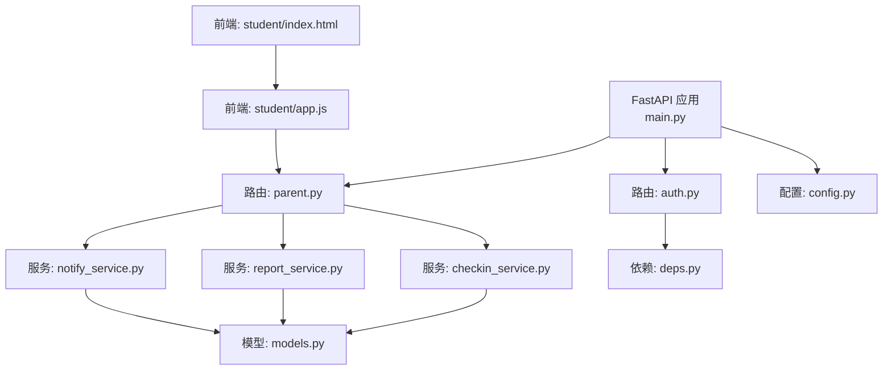
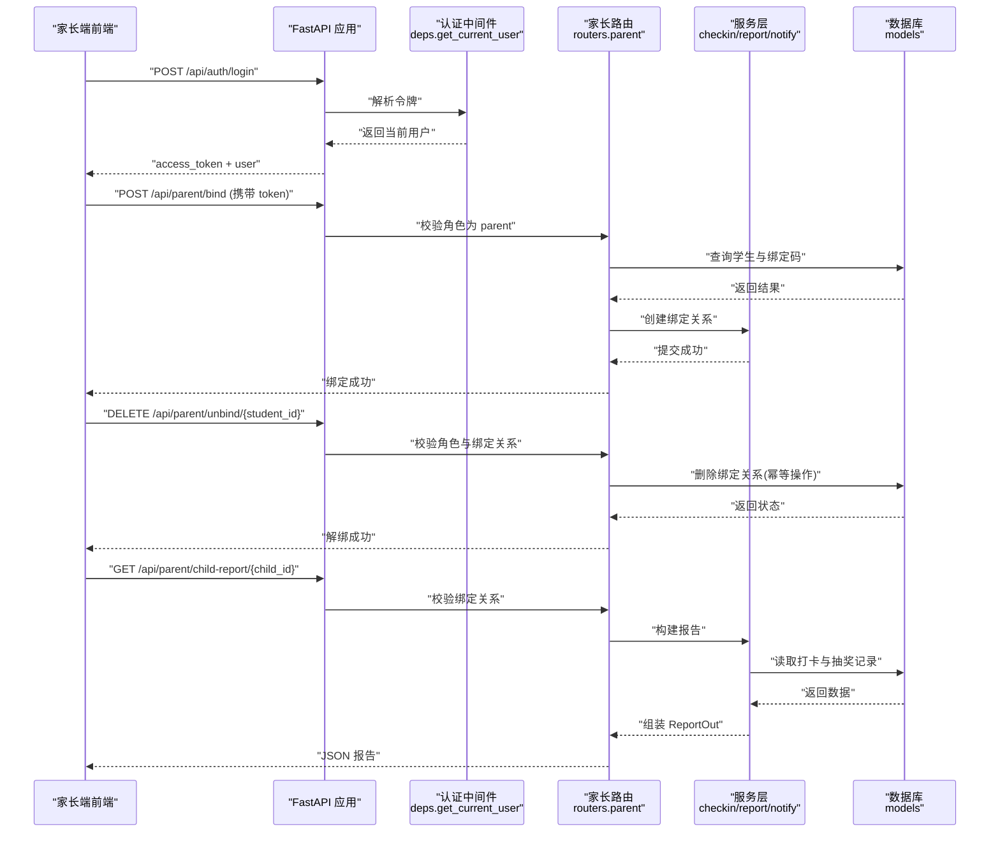
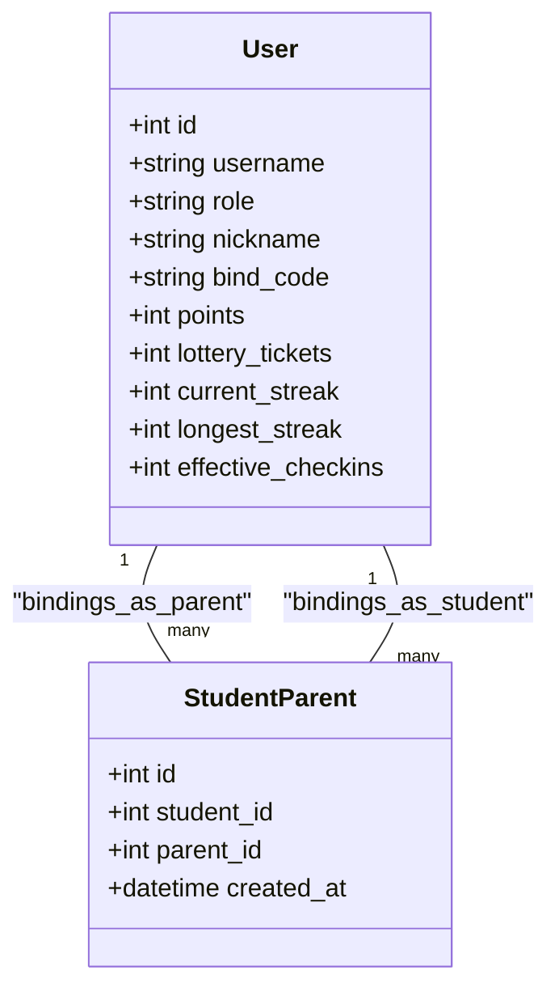
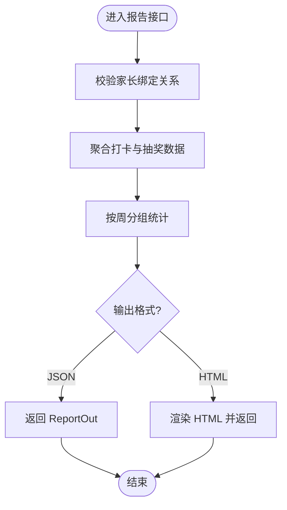
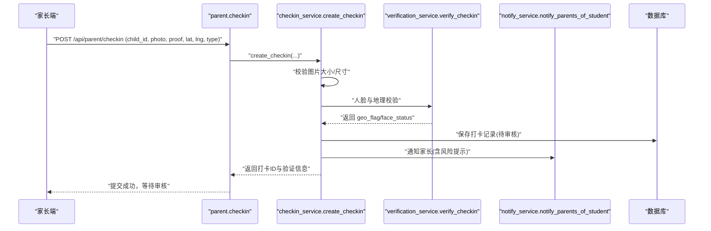
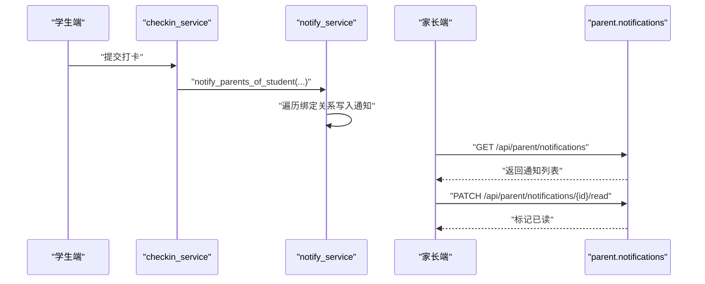
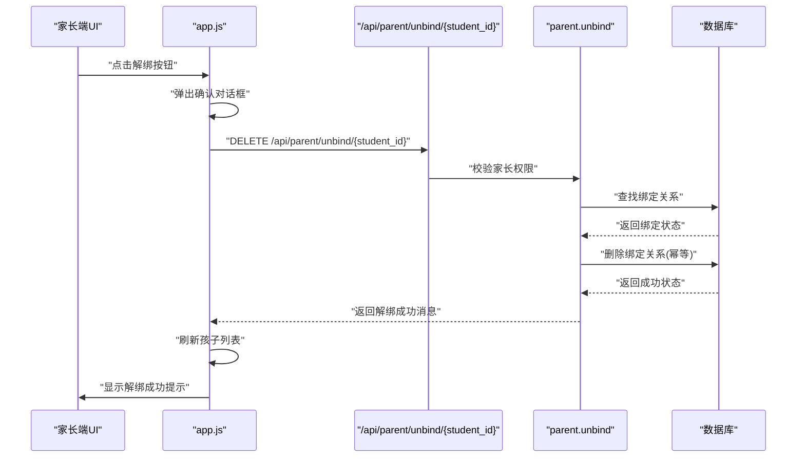
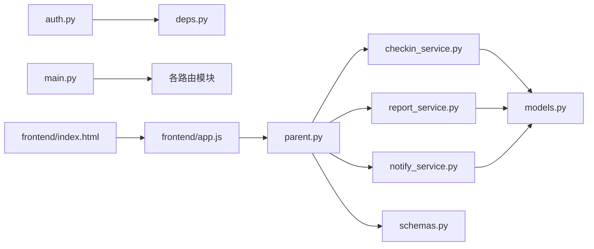

# 家长监督路由

<cite>
**本文引用的文件列表**
- [summer-homework-checkin/backend/app/main.py](file://summer-homework-checkin/backend/app/main.py)
- [summer-homework-checkin/backend/app/routers/parent.py](file://summer-homework-checkin/backend/app/routers/parent.py)
- [summer-homework-checkin/backend/app/models.py](file://summer-homework-checkin/backend/app/models.py)
- [summer-homework-checkin/backend/app/schemas.py](file://summer-homework-checkin/backend/app/schemas.py)
- [summer-homework-checkin/backend/app/services/checkin_service.py](file://summer-homework-checkin/backend/app/services/checkin_service.py)
- [summer-homework-checkin/backend/app/services/report_service.py](file://summer-homework-checkin/backend/app/services/report_service.py)
- [summer-homework-checkin/backend/app/services/notify_service.py](file://summer-homework-checkin/backend/app/services/notify_service.py)
- [summer-homework-checkin/backend/app/routers/auth.py](file://summer-homework-checkin/backend/app/routers/auth.py)
- [summer-homework-checkin/backend/app/deps.py](file://summer-homework-checkin/backend/app/deps.py)
- [summer-homework-checkin/backend/app/config.py](file://summer-homework-checkin/backend/app/config.py)
- [summer-homework-checkin/frontend/student/app.js](file://summer-homework-checkin/frontend/student/app.js)
- [summer-homework-checkin/frontend/student/index.html](file://summer-homework-checkin/frontend/student/index.html)
</cite>

## 更新摘要
**变更内容**
- 新增家长-孩子解绑功能，实现幂等的DELETE /api/parent/unbind/{student_id}端点
- 完善前端解绑UI交互，支持家长移除与孩子账号的关联关系
- 增强家庭账户管理功能，提供完整的绑定与解绑生命周期管理

## 目录
1. [简介](#简介)
2. [项目结构](#项目结构)
3. [核心组件](#核心组件)
4. [架构总览](#架构总览)
5. [详细组件分析](#详细组件分析)
6. [依赖关系分析](#依赖关系分析)
7. [性能与扩展性](#性能与扩展性)
8. [故障排查指南](#故障排查指南)
9. [结论](#结论)
10. [附录：API 规范与集成示例](#附录api-规范与集成示例)

## 简介
本技术文档围绕"家长监督路由"展开，聚焦以下目标：
- 家长账号与孩子账号绑定的接口设计与实现逻辑
- **新增** 家长-孩子解绑功能的幂等操作设计
- 学习进度查看、打卡记录查询等监督功能的接口实现
- 实时通知推送机制与消息订阅模式（基于站内通知）
- 家庭账户管理与成员权限控制方案
- 家长端应用的数据获取与展示接口规范
- 完整 API 调用示例与前端集成指南
- 与学生端数据的同步策略与隐私保护措施

## 项目结构
后端采用 FastAPI 分层架构：路由层负责 HTTP 接口定义与参数校验；服务层封装业务规则；模型层定义数据库实体；配置与依赖注入提供认证、鉴权与运行时参数。

图表来源
- [summer-homework-checkin/backend/app/main.py:1-49](file://summer-homework-checkin/backend/app/main.py#L1-L49)
- [summer-homework-checkin/backend/app/routers/parent.py:1-251](file://summer-homework-checkin/backend/app/routers/parent.py#L1-L251)
- [summer-homework-checkin/backend/app/routers/auth.py:1-52](file://summer-homework-checkin/backend/app/routers/auth.py#L1-L52)
- [summer-homework-checkin/backend/app/services/checkin_service.py:1-254](file://summer-homework-checkin/backend/app/services/checkin_service.py#L1-L254)
- [summer-homework-checkin/backend/app/services/report_service.py:1-109](file://summer-homework-checkin/backend/app/services/report_service.py#L1-L109)
- [summer-homework-checkin/backend/app/services/notify_service.py:1-20](file://summer-homework-checkin/backend/app/services/notify_service.py#L1-L20)
- [summer-homework-checkin/backend/app/models.py:1-213](file://summer-homework-checkin/backend/app/models.py#L1-L213)
- [summer-homework-checkin/backend/app/deps.py:1-34](file://summer-homework-checkin/backend/app/deps.py#L1-L34)
- [summer-homework-checkin/backend/app/config.py:1-54](file://summer-homework-checkin/backend/app/config.py#L1-L54)
- [summer-homework-checkin/frontend/student/app.js:1-437](file://summer-homework-checkin/frontend/student/app.js#L1-L437)
- [summer-homework-checkin/frontend/student/index.html:1-378](file://summer-homework-checkin/frontend/student/index.html#L1-L378)

章节来源
- [summer-homework-checkin/backend/app/main.py:1-49](file://summer-homework-checkin/backend/app/main.py#L1-L49)

## 核心组件
- 家长监督路由：提供绑定、**解绑**、孩子概览、代打卡、兑换、抽奖、通知、报告等能力
- 认证与鉴权：JWT 令牌签发与解析，角色校验
- 数据模型：用户、家长-孩子绑定、打卡、奖品、兑换、通知、抽奖记录等
- 服务层：打卡业务、报表生成、通知投递
- 配置：上传目录、统计周期、打卡规则、人脸识别策略等
- **前端界面**：家长端UI支持绑定与解绑操作的可视化交互

章节来源
- [summer-homework-checkin/backend/app/routers/parent.py:1-251](file://summer-homework-checkin/backend/app/routers/parent.py#L1-L251)
- [summer-homework-checkin/backend/app/routers/auth.py:1-52](file://summer-homework-checkin/backend/app/routers/auth.py#L1-L52)
- [summer-homework-checkin/backend/app/models.py:1-213](file://summer-homework-checkin/backend/app/models.py#L1-L213)
- [summer-homework-checkin/backend/app/services/checkin_service.py:1-254](file://summer-homework-checkin/backend/app/services/checkin_service.py#L1-L254)
- [summer-homework-checkin/backend/app/services/report_service.py:1-109](file://summer-homework-checkin/backend/app/services/report_service.py#L1-L109)
- [summer-homework-checkin/backend/app/services/notify_service.py:1-20](file://summer-homework-checkin/backend/app/services/notify_service.py#L1-L20)
- [summer-homework-checkin/backend/app/config.py:1-54](file://summer-homework-checkin/backend/app/config.py#L1-L54)
- [summer-homework-checkin/frontend/student/app.js:134-142](file://summer-homework-checkin/frontend/student/app.js#L134-L142)
- [summer-homework-checkin/frontend/student/index.html:232-250](file://summer-homework-checkin/frontend/student/index.html#L232-L250)

## 架构总览
家长端通过 REST API 访问系统，所有受保护接口需携带 JWT 令牌。家长可绑定孩子后，以家长身份代孩子执行打卡、查看学习报告、管理积分商城与抽奖、接收通知等。**新增的解绑功能允许家长在需要时移除与孩子账号的关联关系**。

图表来源
- [summer-homework-checkin/backend/app/routers/auth.py:1-52](file://summer-homework-checkin/backend/app/routers/auth.py#L1-L52)
- [summer-homework-checkin/backend/app/deps.py:1-34](file://summer-homework-checkin/backend/app/deps.py#L1-L34)
- [summer-homework-checkin/backend/app/routers/parent.py:20-46](file://summer-homework-checkin/backend/app/routers/parent.py#L20-L46)
- [summer-homework-checkin/backend/app/services/report_service.py:1-109](file://summer-homework-checkin/backend/app/services/report_service.py#L1-L109)
- [summer-homework-checkin/backend/app/models.py:1-213](file://summer-homework-checkin/backend/app/models.py#L1-L213)

## 详细组件分析

### 家长-孩子绑定与解绑管理
- **绑定流程**
  - 家长登录后调用绑定接口，传入孩子用户名与绑定码
  - 系统校验孩子存在且绑定码匹配，避免重复绑定
  - 写入家长-孩子绑定关系表，建立多对多关联
- **解绑流程**
  - **新增** 家长可通过DELETE /api/parent/unbind/{student_id}端点解绑孩子
  - 实现幂等操作：即使已解绑也返回成功状态，避免前端错误处理复杂化
  - 严格权限校验：仅家长角色可执行解绑操作
  - 自动清理：解绑后该家长无法再访问该孩子的任何数据
- 家庭账户与权限
  - 统一用户表区分 student/parent/admin 角色
  - 家长仅能操作已绑定的孩子，未绑定或角色不符将拒绝访问
  - 提供"列出已绑定孩子"的接口，便于家长选择目标孩子

图表来源
- [summer-homework-checkin/backend/app/models.py:11-68](file://summer-homework-checkin/backend/app/models.py#L11-L68)

**更新** 新增解绑功能，支持家长主动移除与孩子账号的关联关系

章节来源
- [summer-homework-checkin/backend/app/routers/parent.py:20-46](file://summer-homework-checkin/backend/app/routers/parent.py#L20-L46)
- [summer-homework-checkin/backend/app/models.py:11-68](file://summer-homework-checkin/backend/app/models.py#L11-L68)

### 学习进度查看与打卡记录查询
- 学习报告
  - 支持按时间区间（默认暑假周期）生成报告，包含有效打卡天数、完成率、连续打卡、每周分布、中奖记录、抽奖次数等
  - 提供 JSON 与 HTML 两种输出格式，HTML 可直接打印下载
- 今日状态
  - 返回今日是否已打卡、是否有待审核记录、本月剩余补卡次数等
- 打卡明细
  - 家长可查看孩子的打卡记录、审核状态、人脸与地理风险标记等

图表来源
- [summer-homework-checkin/backend/app/routers/parent.py:231-251](file://summer-homework-checkin/backend/app/routers/parent.py#L231-L251)
- [summer-homework-checkin/backend/app/services/report_service.py:6-50](file://summer-homework-checkin/backend/app/services/report_service.py#L6-L50)
- [summer-homework-checkin/backend/app/services/report_service.py:53-109](file://summer-homework-checkin/backend/app/services/report_service.py#L53-L109)

章节来源
- [summer-homework-checkin/backend/app/routers/parent.py:231-251](file://summer-homework-checkin/backend/app/routers/parent.py#L231-L251)
- [summer-homework-checkin/backend/app/services/report_service.py:1-109](file://summer-homework-checkin/backend/app/services/report_service.py#L1-L109)

### 家长代打卡与防作弊校验
- 代打卡入口
  - 家长可为已绑定孩子提交打卡，照片与可选凭证上传，支持正常打卡与补卡
- 业务规则
  - 补卡需指定过去日期且在暑假范围内，单月有上限，需上传凭证
  - 正常打卡允许多次提交，但需逐条审核
- 防作弊校验
  - 图片体积与尺寸校验
  - 地理位置风险标记（距常用位置阈值）
  - 人脸识别 1:1 比对（已采集底图时，不通过则拒绝打卡或高风险标记）
- 审核与奖励
  - 管理员审核后计入有效打卡，发放积分，重算连续天数与抽奖资格
  - 每连续 7 天解锁一次抽奖机会，并发站内通知

图表来源
- [summer-homework-checkin/backend/app/routers/parent.py:94-118](file://summer-homework-checkin/backend/app/routers/parent.py#L94-L118)
- [summer-homework-checkin/backend/app/services/checkin_service.py:64-163](file://summer-homework-checkin/backend/app/services/checkin_service.py#L64-L163)
- [summer-homework-checkin/backend/app/services/notify_service.py:16-20](file://summer-homework-checkin/backend/app/services/notify_service.py#L16-L20)

章节来源
- [summer-homework-checkin/backend/app/routers/parent.py:94-118](file://summer-homework-checkin/backend/app/routers/parent.py#L94-L118)
- [summer-homework-checkin/backend/app/services/checkin_service.py:1-254](file://summer-homework-checkin/backend/app/services/checkin_service.py#L1-L254)

### 积分商城与抽奖
- 积分商城
  - 家长可查看孩子积分余额、可用奖品、兑换记录
  - 支持直接兑换奖品或替换已有兑换记录
- 抽奖
  - 家长可代孩子使用抽奖券进行抽奖，查看抽奖记录
  - 连续打卡解锁抽奖券，兑换"抽奖机会"类奖品会增加抽奖券数量

章节来源
- [summer-homework-checkin/backend/app/routers/parent.py:121-201](file://summer-homework-checkin/backend/app/routers/parent.py#L121-L201)
- [summer-homework-checkin/backend/app/models.py:104-161](file://summer-homework-checkin/backend/app/models.py#L104-L161)

### 通知推送与消息订阅
- 通知存储
  - 站内通知表支持按用户与角色过滤，类型包括打卡、抽奖、系统、兑换等
- 推送时机
  - 打卡提交、审核通过/拒绝、连续打卡解锁抽奖券等场景自动发送
  - 家长端提供拉取与标记已读接口
- 订阅模式
  - 当前为"轮询拉取"模式，前端定期请求通知列表
  - 可扩展为 WebSocket/SSE 推送以提升实时性

图表来源
- [summer-homework-checkin/backend/app/services/checkin_service.py:148-163](file://summer-homework-checkin/backend/app/services/checkin_service.py#L148-L163)
- [summer-homework-checkin/backend/app/services/notify_service.py:1-20](file://summer-homework-checkin/backend/app/services/notify_service.py#L1-L20)
- [summer-homework-checkin/backend/app/routers/parent.py:204-219](file://summer-homework-checkin/backend/app/routers/parent.py#L204-L219)

章节来源
- [summer-homework-checkin/backend/app/routers/parent.py:204-219](file://summer-homework-checkin/backend/app/routers/parent.py#L204-L219)
- [summer-homework-checkin/backend/app/services/notify_service.py:1-20](file://summer-homework-checkin/backend/app/services/notify_service.py#L1-L20)

### 认证与鉴权
- 认证
  - 登录/注册返回 JWT access_token，后续请求在 Authorization 头携带
- 鉴权
  - get_current_user 解析令牌并加载用户对象
  - 家长路由内部显式校验角色与绑定关系，确保最小权限原则

章节来源
- [summer-homework-checkin/backend/app/routers/auth.py:1-52](file://summer-homework-checkin/backend/app/routers/auth.py#L1-L52)
- [summer-homework-checkin/backend/app/deps.py:1-34](file://summer-homework-checkin/backend/app/deps.py#L1-L34)
- [summer-homework-checkin/backend/app/routers/parent.py:20-78](file://summer-homework-checkin/backend/app/routers/parent.py#L20-L78)

### 前端解绑功能实现
- **新增** 前端解绑UI
  - 在家长端"已绑定的孩子"列表中显示每个孩子的"解绑"按钮
  - 点击解绑按钮前弹出确认对话框，防止误操作
  - 解绑成功后刷新孩子列表，如无孩子则返回首页
- **新增** 前端解绑逻辑
  - 调用DELETE /api/parent/unbind/{student_id}端点
  - 处理响应消息并显示给用户
  - 自动重新加载孩子列表以保持界面一致性

图表来源
- [summer-homework-checkin/frontend/student/index.html:232-250](file://summer-homework-checkin/frontend/student/index.html#L232-L250)
- [summer-homework-checkin/frontend/student/app.js:134-142](file://summer-homework-checkin/frontend/student/app.js#L134-L142)
- [summer-homework-checkin/backend/app/routers/parent.py:35-46](file://summer-homework-checkin/backend/app/routers/parent.py#L35-L46)

**新增** 前端解绑功能，提供直观的UI交互和完善的错误处理

章节来源
- [summer-homework-checkin/frontend/student/index.html:232-250](file://summer-homework-checkin/frontend/student/index.html#L232-L250)
- [summer-homework-checkin/frontend/student/app.js:134-142](file://summer-homework-checkin/frontend/student/app.js#L134-L142)
- [summer-homework-checkin/backend/app/routers/parent.py:35-46](file://summer-homework-checkin/backend/app/routers/parent.py#L35-L46)

## 依赖关系分析
- 路由与服务耦合
  - parent 路由依赖 checkin_service、report_service、notify_service 等
  - 服务层依赖 models 与 utils（存储、图像、地理计算）
- 外部依赖
  - 人脸识别与地理校验由 verification_service 提供（不在本节源码中）
  - 静态资源挂载用于上传文件与前端页面
- **前端依赖**
  - 家长端前端依赖解绑API进行家庭关系管理
  - HTML模板提供解绑按钮的UI元素
  - JavaScript逻辑处理解绑交互和状态更新

图表来源
- [summer-homework-checkin/backend/app/routers/parent.py:1-251](file://summer-homework-checkin/backend/app/routers/parent.py#L1-L251)
- [summer-homework-checkin/backend/app/services/checkin_service.py:1-254](file://summer-homework-checkin/backend/app/services/checkin_service.py#L1-L254)
- [summer-homework-checkin/backend/app/services/report_service.py:1-109](file://summer-homework-checkin/backend/app/services/report_service.py#L1-L109)
- [summer-homework-checkin/backend/app/services/notify_service.py:1-20](file://summer-homework-checkin/backend/app/services/notify_service.py#L1-L20)
- [summer-homework-checkin/backend/app/models.py:1-213](file://summer-homework-checkin/backend/app/models.py#L1-L213)
- [summer-homework-checkin/backend/app/schemas.py:1-322](file://summer-homework-checkin/backend/app/schemas.py#L1-L322)
- [summer-homework-checkin/backend/app/routers/auth.py:1-52](file://summer-homework-checkin/backend/app/routers/auth.py#L1-L52)
- [summer-homework-checkin/backend/app/deps.py:1-34](file://summer-homework-checkin/backend/app/deps.py#L1-L34)
- [summer-homework-checkin/backend/app/main.py:1-49](file://summer-homework-checkin/backend/app/main.py#L1-L49)
- [summer-homework-checkin/frontend/student/app.js:1-437](file://summer-homework-checkin/frontend/student/app.js#L1-L437)
- [summer-homework-checkin/frontend/student/index.html:1-378](file://summer-homework-checkin/frontend/student/index.html#L1-L378)

章节来源
- [summer-homework-checkin/backend/app/main.py:1-49](file://summer-homework-checkin/backend/app/main.py#L1-L49)

## 性能与扩展性
- 批量查询优化
  - 报告接口按周分桶聚合，减少前端渲染压力
- 索引建议
  - 对打卡记录的 user_id、check_date、review_status 建立复合索引提升查询效率
- 缓存策略
  - 家长端可缓存孩子概览与报告，降低频繁请求
- 扩展方向
  - 通知从轮询升级为 WebSocket/SSE
  - 引入异步任务队列处理人脸与地理校验耗时操作
- **解绑操作优化**
  - 幂等设计避免重复删除导致的性能问题
  - 解绑后立即失效相关权限，无需额外清理操作

[本节为通用指导，无需代码来源]

## 故障排查指南
- 常见错误
  - 未提供令牌或令牌无效：检查 Authorization 头是否正确携带 access_token
  - 无权限访问：确认当前用户角色为 parent 且已绑定目标孩子
  - **解绑失败**：检查家长是否确实绑定了目标孩子，确认student_id参数正确
  - 补卡失败：检查补卡日期是否在暑假范围、是否超过月度上限、是否缺少凭证
  - 人脸校验失败：确认已完成人脸采集且环境可用，必要时调整 FACE_MODE_ON_ENROLLED 策略
- 日志与定位
  - 关注打卡提交后的通知是否送达家长端
  - 核对打卡记录 review_status 与 is_effective 字段变化
  - **解绑操作日志**：检查解绑请求的权限校验和数据库操作记录

**更新** 新增解绑相关故障排查指引

章节来源
- [summer-homework-checkin/backend/app/routers/parent.py:20-46](file://summer-homework-checkin/backend/app/routers/parent.py#L20-L46)
- [summer-homework-checkin/backend/app/services/checkin_service.py:64-163](file://summer-homework-checkin/backend/app/services/checkin_service.py#L64-L163)
- [summer-homework-checkin/backend/app/config.py:45-54](file://summer-homework-checkin/backend/app/config.py#L45-L54)

## 结论
家长监督路由提供了完整的家庭监督能力：绑定管理、**解绑管理**、代打卡、学习报告、积分商城与抽奖、通知推送等。通过严格的角色与绑定校验、完善的防作弊校验与审核流程，保障数据安全与公平性。**新增的解绑功能完善了家庭关系管理的生命周期，支持家长主动移除与孩子账号的关联关系**。建议在通知实时性与大数据量查询方面进一步优化，以满足更高并发与更低延迟的需求。

[本节为总结，无需代码来源]

## 附录：API 规范与集成示例

### 认证与鉴权
- 登录
  - 方法：POST
  - 路径：/api/auth/login
  - 请求体：{username, password}
  - 响应：{access_token, token_type, user}
- 获取当前用户
  - 方法：GET
  - 路径：/api/auth/me
  - 鉴权：Bearer Token
  - 响应：UserOut

章节来源
- [summer-homework-checkin/backend/app/routers/auth.py:13-52](file://summer-homework-checkin/backend/app/routers/auth.py#L13-L52)
- [summer-homework-checkin/backend/app/deps.py:13-25](file://summer-homework-checkin/backend/app/deps.py#L13-L25)

### 家长监督接口
- 绑定孩子
  - 方法：POST
  - 路径：/api/parent/bind
  - 请求体：{child_username, bind_code}
  - 鉴权：Bearer Token（parent）
  - 响应：{ok, message}
- **解绑孩子**
  - **新增** 方法：DELETE
  - **新增** 路径：/api/parent/unbind/{student_id}
  - **新增** 路径参数：student_id (整数，要解绑的孩子ID)
  - **新增** 鉴权：Bearer Token（parent）
  - **新增** 响应：{ok, message}
  - **新增** 特性：幂等操作，即使已解绑也返回成功状态
- 列出已绑定孩子
  - 方法：GET
  - 路径：/api/parent/children
  - 鉴权：Bearer Token（parent）
  - 响应：list[ChildSummary]
- 孩子概览
  - 方法：GET
  - 路径：/api/parent/child-streak/{child_id}
  - 鉴权：Bearer Token（parent）
  - 响应：ChildSummary
- 家长代打卡
  - 方法：POST
  - 路径：/api/parent/checkin
  - 表单字段：child_id, photo(file), proof(file, 可选), location_lat, location_lng, check_type(normal/makeup), makeup_reason, makeup_for_date
  - 鉴权：Bearer Token（parent）
  - 响应：{ok, child_id, checkin_id, points, message}
- 孩子积分商城
  - 方法：GET
  - 路径：/api/parent/mall/{child_id}
  - 鉴权：Bearer Token（parent）
  - 响应：MallOut
- 兑换奖品
  - 方法：POST
  - 路径：/api/parent/redeem
  - 请求体：{prize_id}
  - 鉴权：Bearer Token（parent）
  - 响应：RedeemResult
- 替换兑换
  - 方法：POST
  - 路径：/api/parent/redeem/{rid}/replace
  - 请求体：{new_prize_id}
  - 鉴权：Bearer Token（parent）
  - 响应：RedemptionOut
- 抽奖记录
  - 方法：GET
  - 路径：/api/parent/lottery/{child_id}
  - 鉴权：Bearer Token（parent）
  - 响应：{tickets, records}
- 代抽一次奖
  - 方法：POST
  - 路径：/api/parent/lottery/{child_id}/draw
  - 鉴权：Bearer Token（parent）
  - 响应：抽奖结果
- 通知列表
  - 方法：GET
  - 路径：/api/parent/notifications
  - 鉴权：Bearer Token（parent）
  - 响应：list[NotificationOut]
- 标记通知已读
  - 方法：PATCH
  - 路径：/api/parent/notifications/{nid}/read
  - 鉴权：Bearer Token（parent）
  - 响应：{ok}
- 学习报告（JSON）
  - 方法：GET
  - 路径：/api/parent/child-report/{child_id}
  - 查询参数：start, end（ISO 日期，默认暑假周期）
  - 鉴权：Bearer Token（parent）
  - 响应：ReportOut
- 学习报告（HTML）
  - 方法：GET
  - 路径：/api/parent/child-report/{child_id}/html
  - 查询参数：start, end
  - 鉴权：Bearer Token（parent）
  - 响应：HTML 字符串

**更新** 新增解绑接口规范

章节来源
- [summer-homework-checkin/backend/app/routers/parent.py:20-251](file://summer-homework-checkin/backend/app/routers/parent.py#L20-L251)
- [summer-homework-checkin/backend/app/schemas.py:156-230](file://summer-homework-checkin/backend/app/schemas.py#L156-L230)

### 前端集成指南
- 认证
  - 登录后保存 access_token，并在后续请求头添加 Authorization: Bearer <token>
- 绑定流程
  - 先获取孩子绑定码（学生端注册后自动生成），家长端调用绑定接口完成绑定
- **解绑流程**
  - **新增** 在家长端"已绑定的孩子"列表中显示解绑按钮
  - **新增** 点击解绑按钮前弹出确认对话框
  - **新增** 调用DELETE /api/parent/unbind/{student_id}执行解绑
  - **新增** 解绑成功后刷新孩子列表并显示成功提示
- 数据获取与展示
  - 定时拉取 children 列表与 child-streak 概览
  - 按需拉取 mall 与 lottery 数据，渲染积分与抽奖界面
  - 学习报告优先拉取 JSON，需要打印时再请求 HTML
- 通知订阅
  - 前端周期性 GET /api/parent/notifications，收到新通知后提示用户
  - 用户点击后调用 PATCH 标记已读
- 代打卡
  - 选择孩子后，上传作业照片与可选凭证，附带地理位置坐标
  - 根据返回消息提示"等待审核"，并在通知中标识

**更新** 新增解绑流程的前端集成指南

章节来源
- [summer-homework-checkin/backend/app/routers/parent.py:35-46](file://summer-homework-checkin/backend/app/routers/parent.py#L35-L46)
- [summer-homework-checkin/frontend/student/app.js:134-142](file://summer-homework-checkin/frontend/student/app.js#L134-L142)
- [summer-homework-checkin/frontend/student/index.html:232-250](file://summer-homework-checkin/frontend/student/index.html#L232-L250)
- [summer-homework-checkin/backend/app/routers/parent.py:35-118](file://summer-homework-checkin/backend/app/routers/parent.py#L35-L118)
- [summer-homework-checkin/backend/app/routers/parent.py:204-219](file://summer-homework-checkin/backend/app/routers/parent.py#L204-L219)

### 数据同步策略与隐私保护
- 数据同步
  - 家长端数据来源于同一数据库，通过绑定关系授权访问
  - 报告与概览数据在服务端聚合，避免前端复杂计算
- 隐私保护
  - 严格角色与绑定校验，防止越权访问
  - 人脸与地理信息仅在服务端处理，返回结果不包含敏感原始数据
  - 通知内容仅面向相关用户与角色，避免泄露
  - **解绑安全**：解绑后立即失效相关权限，确保数据安全

**更新** 新增解绑操作的安全考虑

章节来源
- [summer-homework-checkin/backend/app/models.py:11-68](file://summer-homework-checkin/backend/app/models.py#L11-L68)
- [summer-homework-checkin/backend/app/routers/parent.py:35-78](file://summer-homework-checkin/backend/app/routers/parent.py#L35-L78)
- [summer-homework-checkin/backend/app/services/checkin_service.py:113-123](file://summer-homework-checkin/backend/app/services/checkin_service.py#L113-L123)