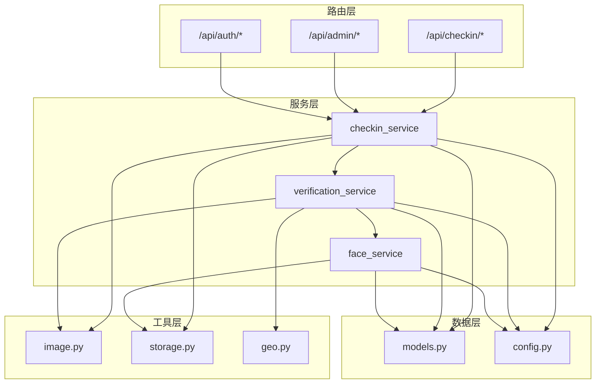
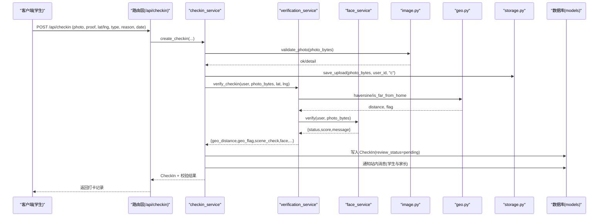
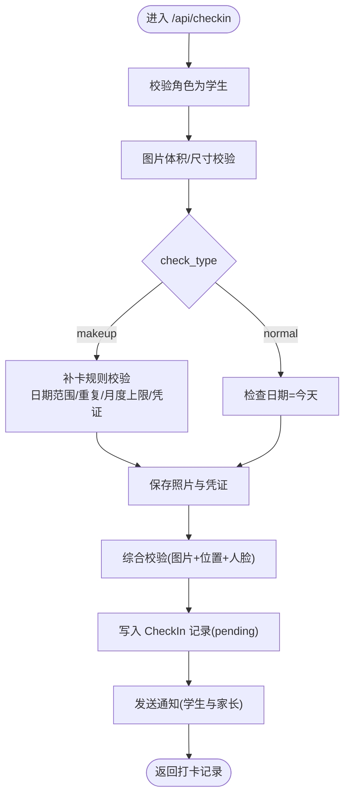
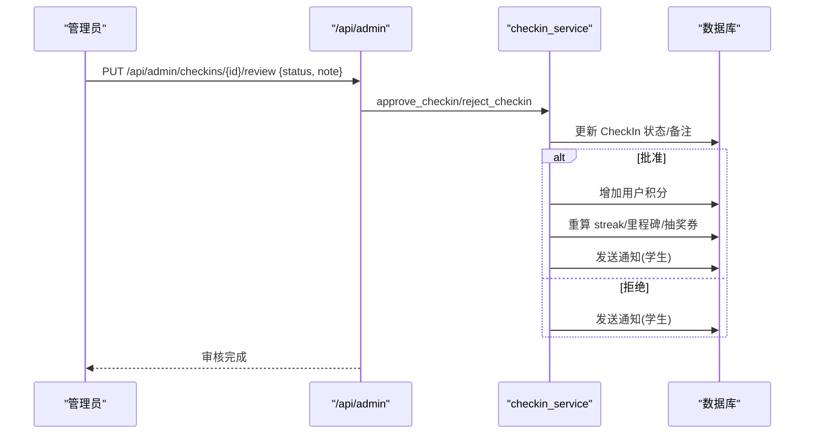
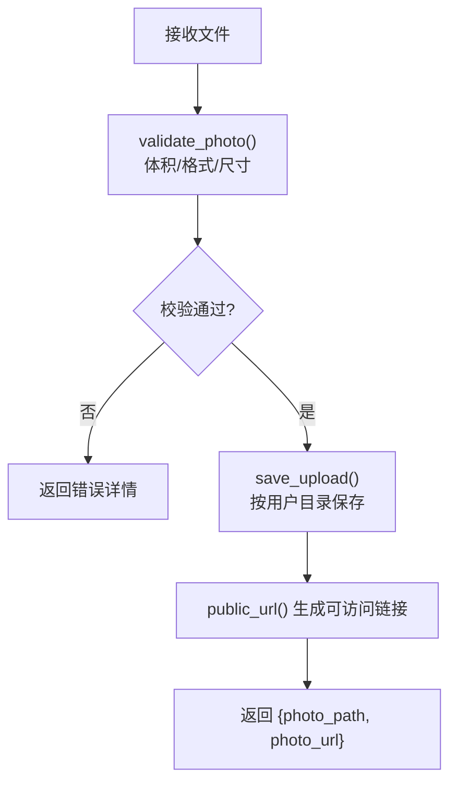
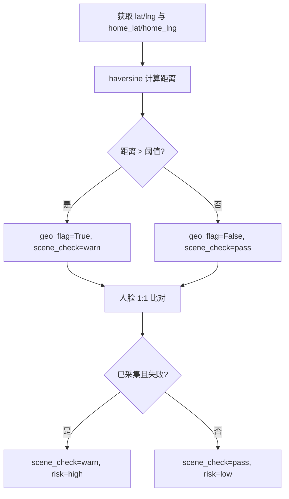
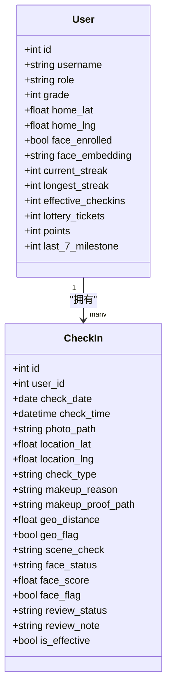
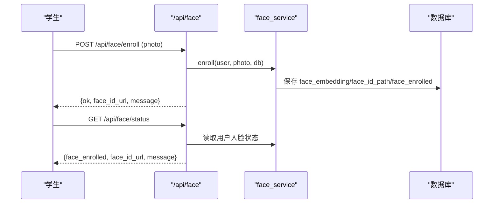
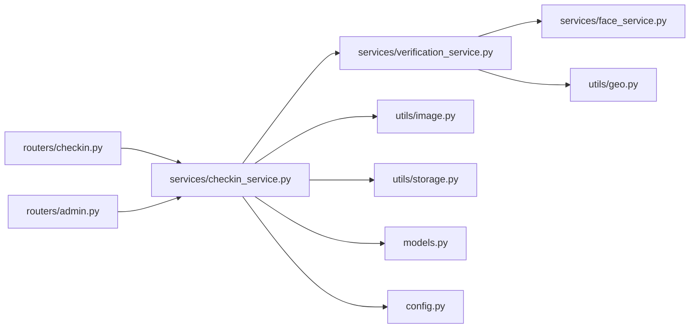

# 打卡管理路由

<cite>
**本文引用的文件**   
- [checkin.py](file://summer-homework-checkin/backend/app/routers/checkin.py)
- [admin.py](file://summer-homework-checkin/backend/app/routers/admin.py)
- [auth.py](file://summer-homework-checkin/backend/app/routers/auth.py)
- [checkin_service.py](file://summer-homework-checkin/backend/app/services/checkin_service.py)
- [verification_service.py](file://summer-homework-checkin/backend/app/services/verification_service.py)
- [face_service.py](file://summer-homework-checkin/backend/app/services/face_service.py)
- [image.py](file://summer-homework-checkin/backend/app/utils/image.py)
- [storage.py](file://summer-homework-checkin/backend/app/utils/storage.py)
- [geo.py](file://summer-homework-checkin/backend/app/utils/geo.py)
- [config.py](file://summer-homework-checkin/backend/app/config.py)
- [models.py](file://summer-homework-checkin/backend/app/models.py)
- [schemas.py](file://summer-homework-checkin/backend/app/schemas.py)
- [app.js](file://summer-homework-checkin/frontend/student/app.js)
</cite>

## 目录
1. [简介](#简介)
2. [项目结构](#项目结构)
3. [核心组件](#核心组件)
4. [架构总览](#架构总览)
5. [详细组件分析](#详细组件分析)
6. [依赖关系分析](#依赖关系分析)
7. [性能与可扩展性](#性能与可扩展性)
8. [故障排查指南](#故障排查指南)
9. [结论](#结论)
10. [附录：API 调用示例](#附录api-调用示例)

## 简介
本技术文档围绕“每日作业打卡”的后台路由与服务实现，系统性说明以下能力：
- 打卡提交、补卡申请、审核流程等接口的业务规则与数据流转
- 图片上传处理机制（格式校验、大小限制、存储策略）
- 地理位置验证与防作弊措施
- 打卡状态管理与进度跟踪的数据结构设计
- 完整 API 调用示例（正常与异常场景）
- 人脸识别服务集成方式与数据流

## 项目结构
后端采用 FastAPI + SQLAlchemy 的分层设计：路由层负责 HTTP 接口定义与参数解析；服务层封装业务规则；工具层提供图像、地理、存储等通用能力；模型与 Schema 分别描述数据库结构与请求/响应契约。

图表来源
- [checkin.py:1-80](file://summer-homework-checkin/backend/app/routers/checkin.py#L1-L80)
- [admin.py:1-214](file://summer-homework-checkin/backend/app/routers/admin.py#L1-L214)
- [auth.py:1-52](file://summer-homework-checkin/backend/app/routers/auth.py#L1-L52)
- [checkin_service.py:1-254](file://summer-homework-checkin/backend/app/services/checkin_service.py#L1-L254)
- [verification_service.py:1-71](file://summer-homework-checkin/backend/app/services/verification_service.py#L1-L71)
- [face_service.py:1-133](file://summer-homework-checkin/backend/app/services/face_service.py#L1-L133)
- [image.py:1-61](file://summer-homework-checkin/backend/app/utils/image.py#L1-L61)
- [storage.py:1-24](file://summer-homework-checkin/backend/app/utils/storage.py#L1-L24)
- [geo.py:1-24](file://summer-homework-checkin/backend/app/utils/geo.py#L1-L24)
- [config.py:1-50](file://summer-homework-checkin/backend/app/config.py#L1-L50)
- [models.py:1-212](file://summer-homework-checkin/backend/app/models.py#L1-L212)

章节来源
- [checkin.py:1-80](file://summer-homework-checkin/backend/app/routers/checkin.py#L1-L80)
- [admin.py:1-214](file://summer-homework-checkin/backend/app/routers/admin.py#L1-L214)
- [auth.py:1-52](file://summer-homework-checkin/backend/app/routers/auth.py#L1-L52)
- [checkin_service.py:1-254](file://summer-homework-checkin/backend/app/services/checkin_service.py#L1-L254)
- [verification_service.py:1-71](file://summer-homework-checkin/backend/app/services/verification_service.py#L1-L71)
- [face_service.py:1-133](file://summer-homework-checkin/backend/app/services/face_service.py#L1-L133)
- [image.py:1-61](file://summer-homework-checkin/backend/app/utils/image.py#L1-L61)
- [storage.py:1-24](file://summer-homework-checkin/backend/app/utils/storage.py#L1-L24)
- [geo.py:1-24](file://summer-homework-checkin/backend/app/utils/geo.py#L1-L24)
- [config.py:1-50](file://summer-homework-checkin/backend/app/config.py#L1-L50)
- [models.py:1-212](file://summer-homework-checkin/backend/app/models.py#L1-L212)

## 核心组件
- 路由层
  - /api/checkin：学生端打卡、今日状态、连续打卡统计、历史记录、通用图片上传
  - /api/admin：管理员统计、待审列表、审核操作、兑换记录管理
  - /api/auth：注册、登录、当前用户信息
- 服务层
  - checkin_service：打卡创建、审核通过/拒绝、连续天数重算、积分发放、通知
  - verification_service：综合校验（图片合规、地理位置、人脸比对）
  - face_service：人脸底图采集、撤销、1:1 比对
- 工具层
  - image.py：轻量图像解析（JPEG/PNG），尺寸与体积校验
  - storage.py：本地文件保存与公开 URL 生成
  - geo.py：经纬度距离计算与阈值判定
- 数据层
  - models.py：User、CheckIn、Prize、Redemption、Notification 等实体
  - schemas.py：Pydantic 请求/响应模型
  - config.py：全局配置（阈值、路径、密钥、暑假周期等）

章节来源
- [checkin.py:1-80](file://summer-homework-checkin/backend/app/routers/checkin.py#L1-L80)
- [admin.py:1-214](file://summer-homework-checkin/backend/app/routers/admin.py#L1-L214)
- [auth.py:1-52](file://summer-homework-checkin/backend/app/routers/auth.py#L1-L52)
- [checkin_service.py:1-254](file://summer-homework-checkin/backend/app/services/checkin_service.py#L1-L254)
- [verification_service.py:1-71](file://summer-homework-checkin/backend/app/services/verification_service.py#L1-L71)
- [face_service.py:1-133](file://summer-homework-checkin/backend/app/services/face_service.py#L1-L133)
- [image.py:1-61](file://summer-homework-checkin/backend/app/utils/image.py#L1-L61)
- [storage.py:1-24](file://summer-homework-checkin/backend/app/utils/storage.py#L1-L24)
- [geo.py:1-24](file://summer-homework-checkin/backend/app/utils/geo.py#L1-L24)
- [config.py:1-50](file://summer-homework-checkin/backend/app/config.py#L1-L50)
- [models.py:1-212](file://summer-homework-checkin/backend/app/models.py#L1-L212)
- [schemas.py:1-322](file://summer-homework-checkin/backend/app/schemas.py#L1-L322)

## 架构总览
下图展示一次“打卡提交”的端到端流程，包括图片上传、位置校验、人脸比对、持久化与通知。

图表来源
- [checkin.py:17-37](file://summer-homework-checkin/backend/app/routers/checkin.py#L17-L37)
- [checkin_service.py:64-163](file://summer-homework-checkin/backend/app/services/checkin_service.py#L64-L163)
- [verification_service.py:19-71](file://summer-homework-checkin/backend/app/services/verification_service.py#L19-L71)
- [face_service.py:99-125](file://summer-homework-checkin/backend/app/services/face_service.py#L99-L125)
- [image.py:51-61](file://summer-homework-checkin/backend/app/utils/image.py#L51-L61)
- [geo.py:6-24](file://summer-homework-checkin/backend/app/utils/geo.py#L6-L24)
- [storage.py:7-16](file://summer-homework-checkin/backend/app/utils/storage.py#L7-L16)
- [models.py:70-96](file://summer-homework-checkin/backend/app/models.py#L70-L96)

## 详细组件分析

### 打卡提交接口（POST /api/checkin）
- 输入
  - 表单字段：location_lat、location_lng、check_type（normal/makeup）、makeup_reason、makeup_for_date
  - 文件字段：photo（必填）、proof（补卡时必填）
- 业务规则
  - 角色校验：仅学生可打卡
  - 照片基础校验：体积与尺寸门槛（见图片上传机制）
  - 补卡规则：目标日期必须为过去且在暑假统计范围内；该日不可重复有效打卡；单月补卡次数上限
  - 保存照片与凭证到本地存储
  - 防代打卡校验：图片真实性 + 地理位置一致性 + 人脸 1:1 比对
  - 记录初始状态：review_status=pending，is_effective=False
  - 通知：学生与家长收到“已提交，等待审核”的通知
- 输出
  - CheckInOut 对象（含 photo_url、geo_distance、face_status 等）

图表来源
- [checkin.py:17-37](file://summer-homework-checkin/backend/app/routers/checkin.py#L17-L37)
- [checkin_service.py:64-163](file://summer-homework-checkin/backend/app/services/checkin_service.py#L64-L163)

章节来源
- [checkin.py:17-37](file://summer-homework-checkin/backend/app/routers/checkin.py#L17-L37)
- [checkin_service.py:64-163](file://summer-homework-checkin/backend/app/services/checkin_service.py#L64-L163)

### 补卡申请与审核流程
- 补卡申请
  - 同打卡提交，但 check_type=makeup，需指定 makeup_for_date 与 makeup_proof_path
  - 校验目标日期有效性、是否已有有效打卡、当月补卡次数上限
- 审核接口（管理员）
  - PUT /api/admin/checkins/{id}/review
  - approved：标记 is_effective=True，发放积分，重算连续天数与抽奖资格，通知学生
  - rejected：标记 review_status=rejected，is_effective=False，通知学生

图表来源
- [admin.py:84-103](file://summer-homework-checkin/backend/app/routers/admin.py#L84-L103)
- [checkin_service.py:166-209](file://summer-homework-checkin/backend/app/services/checkin_service.py#L166-L209)

章节来源
- [admin.py:84-103](file://summer-homework-checkin/backend/app/routers/admin.py#L84-L103)
- [checkin_service.py:166-209](file://summer-homework-checkin/backend/app/services/checkin_service.py#L166-L209)

### 图片上传处理机制
- 通用上传接口：POST /api/checkin/upload
  - 用于前端图片查看器上传，返回 photo_path 与 photo_url
- 校验逻辑
  - 体积限制：MIN_PHOTO_BYTES ~ PHOTO_MAX_BYTES
  - 格式支持：JPEG/PNG（基于魔数识别）
  - 尺寸下限：MIN_PHOTO_DIM（防止缩略图/占位图）
- 存储策略
  - 按用户 ID 分目录存放，文件名带前缀与随机串，避免冲突
  - public_url 将相对路径映射为可访问的 HTTP 路径

图表来源
- [checkin.py:40-52](file://summer-homework-checkin/backend/app/routers/checkin.py#L40-L52)
- [image.py:51-61](file://summer-homework-checkin/backend/app/utils/image.py#L51-L61)
- [storage.py:7-24](file://summer-homework-checkin/backend/app/utils/storage.py#L7-L24)

章节来源
- [checkin.py:40-52](file://summer-homework-checkin/backend/app/routers/checkin.py#L40-L52)
- [image.py:51-61](file://summer-homework-checkin/backend/app/utils/image.py#L51-L61)
- [storage.py:7-24](file://summer-homework-checkin/backend/app/utils/storage.py#L7-L24)

### 地理位置验证与防作弊措施
- 距离计算：haversine 公式计算两点间米级距离
- 风险判定：超过 GEO_THRESHOLD_METERS 则 geo_flag=True，scene_check=warn，risk=medium
- 人脸 1:1 比对
  - 若用户已采集人脸底图且比对失败（mismatch/no_face/multiple_faces），在 enforce 模式下直接拒绝打卡
  - 若模型不可用，根据 FACE_MODE_ON_ENROLLED 决定拒绝或降级为高风险待复核
- 综合风险等级
  - high：图片不合法或人脸不通过（已采集）
  - medium：地理位置超阈值或模型不可用（已采集）
  - low：全部通过

图表来源
- [verification_service.py:19-71](file://summer-homework-checkin/backend/app/services/verification_service.py#L19-L71)
- [geo.py:6-24](file://summer-homework-checkin/backend/app/utils/geo.py#L6-L24)
- [face_service.py:99-125](file://summer-homework-checkin/backend/app/services/face_service.py#L99-L125)
- [config.py:28-49](file://summer-homework-checkin/backend/app/config.py#L28-L49)

章节来源
- [verification_service.py:19-71](file://summer-homework-checkin/backend/app/services/verification_service.py#L19-L71)
- [geo.py:6-24](file://summer-homework-checkin/backend/app/utils/geo.py#L6-L24)
- [face_service.py:99-125](file://summer-homework-checkin/backend/app/services/face_service.py#L99-L125)
- [config.py:28-49](file://summer-homework-checkin/backend/app/config.py#L28-L49)

### 打卡状态管理与进度跟踪数据结构
- 关键实体
  - User：current_streak、longest_streak、effective_checkins、lottery_tickets、points、last_7_milestone
  - CheckIn：check_date、check_time、check_type、review_status、is_effective、geo_*、face_*
- 连续天数与里程碑
  - 基于有效打卡日期集合计算当前连续与历史最长连续
  - 每达到 7 天里程碑自动发放抽奖券并通知
- 今日状态查询
  - today_checked/today_pending/today_count/approved_count/pending_count/can_makeup_this_month

图表来源
- [models.py:11-96](file://summer-homework-checkin/backend/app/models.py#L11-L96)

章节来源
- [models.py:11-96](file://summer-homework-checkin/backend/app/models.py#L11-L96)
- [checkin_service.py:12-61](file://summer-homework-checkin/backend/app/services/checkin_service.py#L12-L61)
- [checkin_service.py:225-254](file://summer-homework-checkin/backend/app/services/checkin_service.py#L225-L254)

### 人脸识别服务集成与数据流
- 采集（enroll）
  - 要求检测到且仅一张人脸，提取 512 维 embedding 存入用户表，保存人脸底图路径
- 比对（verify）
  - 现场照提取 embedding，与底图余弦相似度比较，超过阈值即 match
- 策略
  - FACE_MODE_ON_ENROLLED=enforce：已采集且比对失败直接拒绝
  - FACE_MODE_ON_ENROLLED=soft：仅标记高风险但仍记录
- 健康检查
  - is_available 用于检测模型可用性

图表来源
- [face_service.py:71-96](file://summer-homework-checkin/backend/app/services/face_service.py#L71-L96)
- [face_service.py:99-125](file://summer-homework-checkin/backend/app/services/face_service.py#L99-L125)
- [models.py:27-31](file://summer-homework-checkin/backend/app/models.py#L27-L31)

章节来源
- [face_service.py:71-96](file://summer-homework-checkin/backend/app/services/face_service.py#L71-L96)
- [face_service.py:99-125](file://summer-homework-checkin/backend/app/services/face_service.py#L99-L125)
- [models.py:27-31](file://summer-homework-checkin/backend/app/models.py#L27-L31)

## 依赖关系分析
- 路由层依赖服务层进行业务编排
- 服务层依赖工具层完成具体能力（图像、地理、存储）
- 服务层与模型层交互完成数据持久化
- 配置集中管理阈值与行为开关

图表来源
- [checkin.py:1-80](file://summer-homework-checkin/backend/app/routers/checkin.py#L1-L80)
- [admin.py:1-214](file://summer-homework-checkin/backend/app/routers/admin.py#L1-L214)
- [checkin_service.py:1-254](file://summer-homework-checkin/backend/app/services/checkin_service.py#L1-L254)
- [verification_service.py:1-71](file://summer-homework-checkin/backend/app/services/verification_service.py#L1-L71)
- [face_service.py:1-133](file://summer-homework-checkin/backend/app/services/face_service.py#L1-L133)
- [image.py:1-61](file://summer-homework-checkin/backend/app/utils/image.py#L1-L61)
- [storage.py:1-24](file://summer-homework-checkin/backend/app/utils/storage.py#L1-L24)
- [geo.py:1-24](file://summer-homework-checkin/backend/app/utils/geo.py#L1-L24)
- [models.py:1-212](file://summer-homework-checkin/backend/app/models.py#L1-L212)
- [config.py:1-50](file://summer-homework-checkin/backend/app/config.py#L1-L50)

章节来源
- [checkin.py:1-80](file://summer-homework-checkin/backend/app/routers/checkin.py#L1-L80)
- [admin.py:1-214](file://summer-homework-checkin/backend/app/routers/admin.py#L1-L214)
- [checkin_service.py:1-254](file://summer-homework-checkin/backend/app/services/checkin_service.py#L1-L254)
- [verification_service.py:1-71](file://summer-homework-checkin/backend/app/services/verification_service.py#L1-L71)
- [face_service.py:1-133](file://summer-homework-checkin/backend/app/services/face_service.py#L1-L133)
- [image.py:1-61](file://summer-homework-checkin/backend/app/utils/image.py#L1-L61)
- [storage.py:1-24](file://summer-homework-checkin/backend/app/utils/storage.py#L1-L24)
- [geo.py:1-24](file://summer-homework-checkin/backend/app/utils/geo.py#L1-L24)
- [models.py:1-212](file://summer-homework-checkin/backend/app/models.py#L1-L212)
- [config.py:1-50](file://summer-homework-checkin/backend/app/config.py#L1-L50)

## 性能与可扩展性
- 图像解析无第三方依赖，使用轻量解析提升吞吐
- 人脸模型懒加载与线程锁保护，避免并发初始化竞争
- 本地文件存储简单可靠，可按需迁移至对象存储（仅需替换 storage.py）
- 地理位置计算为 O(1)，适合高频调用
- 建议
  - 引入异步任务队列处理通知与重算
  - 对人脸模型启用缓存与批处理
  - 对大文件上传启用分片与断点续传

[本节为通用指导，无需源码引用]

## 故障排查指南
- 常见错误
  - 非学生角色：403 仅学生可打卡
  - 图片不合法：400 体积/格式/尺寸不符合
  - 补卡日期无效：400 不在暑假范围/已是今天或未来/已有有效打卡/月度上限
  - 人脸不通过（已采集）：400 疑似非本人打卡
  - 人脸识别服务不可用：503 请稍后重试
- 定位步骤
  - 检查日志中的 scene_check 与 risk 字段
  - 核对 GEO_THRESHOLD_METERS 与 FACE_MATCH_THRESHOLD 配置
  - 确认用户上传的图片是否为真实相机拍摄（避免截图/缩略图）
  - 验证人脸底图是否成功采集（face_enrolled=true）

章节来源
- [checkin.py:29-37](file://summer-homework-checkin/backend/app/routers/checkin.py#L29-L37)
- [checkin_service.py:64-123](file://summer-homework-checkin/backend/app/services/checkin_service.py#L64-L123)
- [verification_service.py:40-71](file://summer-homework-checkin/backend/app/services/verification_service.py#L40-L71)
- [face_service.py:99-125](file://summer-homework-checkin/backend/app/services/face_service.py#L99-L125)

## 结论
打卡管理路由以清晰的分层架构实现了从提交、校验、存储到审核的全链路闭环。通过图片合规、地理位置与人脸 1:1 比对的三重校验，有效降低代打卡风险；结合连续天数与里程碑机制，激励学生持续打卡。系统具备良好的扩展性与容错能力，便于在生产环境落地与优化。

[本节为总结，无需源码引用]

## 附录：API 调用示例

- 认证
  - 注册：POST /api/auth/register
    - 请求体：{username, password, nickname, role="student", grade?, phone?, home_lat?, home_lng?}
    - 响应：{access_token, token_type, user}
  - 登录：POST /api/auth/login
    - 请求体：{username, password}
    - 响应：{access_token, token_type, user}
  - 当前用户：GET /api/auth/me
    - 响应：UserOut

- 打卡
  - 提交打卡：POST /api/checkin
    - 表单字段：photo(必填), proof(可选), location_lat, location_lng, check_type(normal/makeup), makeup_reason, makeup_for_date
    - 正常流程：返回 CheckInOut
    - 异常场景：
      - 非学生：403
      - 图片不合法：400
      - 补卡日期无效：400
      - 人脸不通过（已采集）：400
      - 人脸识别不可用：503
  - 通用图片上传：POST /api/checkin/upload
    - 请求：multipart/form-data {photo}
    - 响应：{photo_path, photo_url}
  - 今日状态：GET /api/checkin/today
    - 响应：{today_checked, today_pending, today_count, approved_count, pending_count, can_makeup_this_month}
  - 连续打卡统计：GET /api/checkin/streak
    - 响应：StreakOut
  - 历史记录：GET /api/checkin/history
    - 响应：list[CheckInOut]

- 管理员
  - 待审数量：GET /api/admin/checkins/pending-count
    - 响应：{count}
  - 审核打卡：PUT /api/admin/checkins/{id}/review
    - 请求体：{status:"approved"|"rejected", note?}
    - 响应：{message, review_status}
  - 打卡列表：GET /api/admin/checkins
    - 响应：数组（含用户昵称、审核状态、照片预览链接等）

- 人脸识别
  - 采集人脸：POST /api/face/enroll
    - 请求：multipart/form-data {photo}
    - 响应：{ok, has_face, face_count, face_id_url, message}
  - 撤销人脸：DELETE /api/face/enroll
    - 响应：{face_enrolled, message}
  - 人脸状态：GET /api/face/status
    - 响应：{face_enrolled, face_id_url, message}

- 前端交互参考
  - 学生端页面通过 Vue 发起上述 API 调用，包含登录态维护、图片选择与预览、人脸采集与状态显示、打卡提交与结果提示等。

章节来源
- [auth.py:13-52](file://summer-homework-checkin/backend/app/routers/auth.py#L13-L52)
- [checkin.py:17-80](file://summer-homework-checkin/backend/app/routers/checkin.py#L17-L80)
- [admin.py:53-103](file://summer-homework-checkin/backend/app/routers/admin.py#L53-L103)
- [app.js:58-200](file://summer-homework-checkin/frontend/student/app.js#L58-L200)