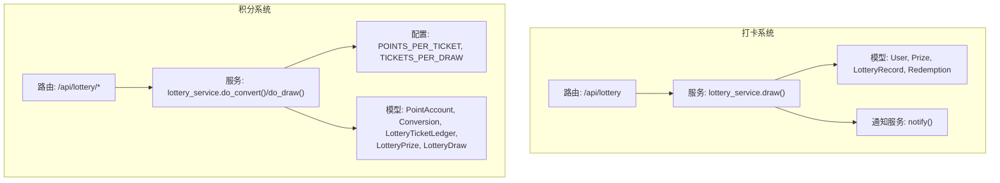
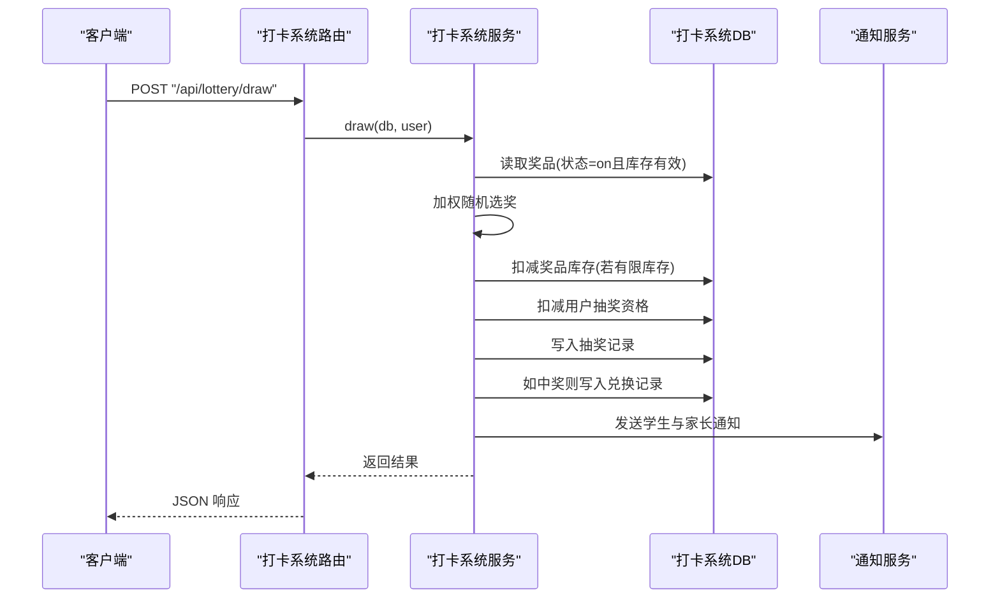
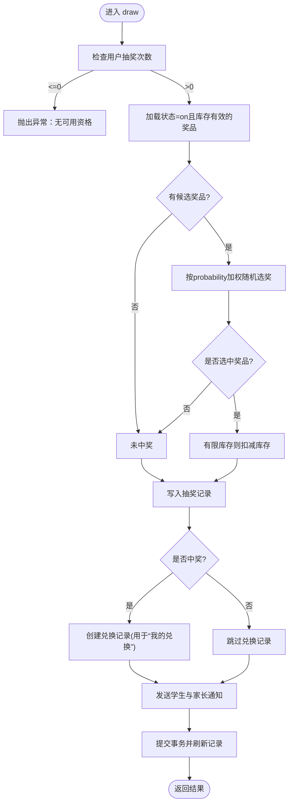
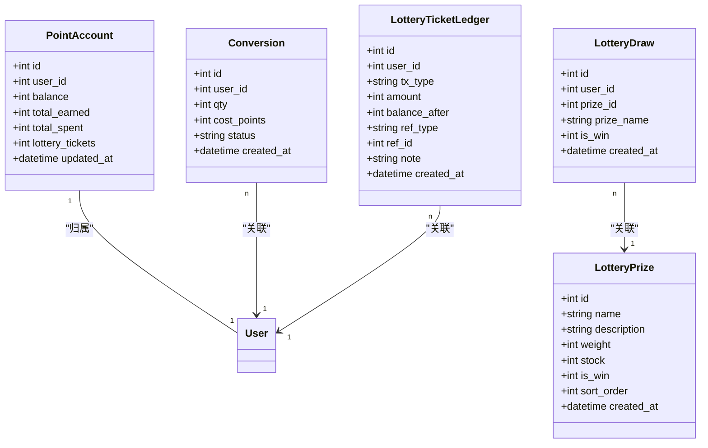
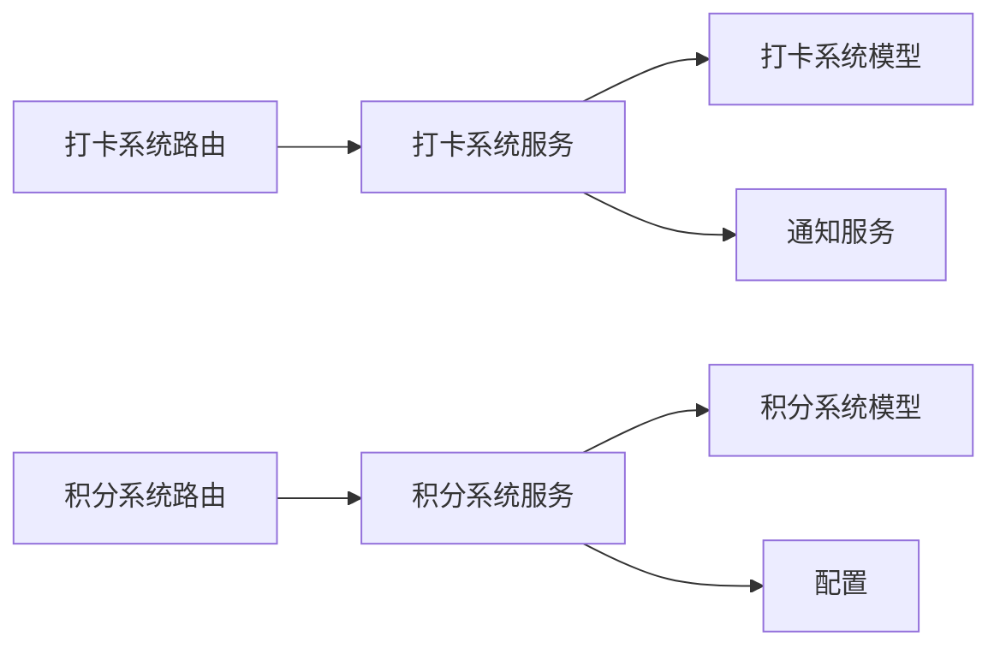

# 抽奖系统路由

<cite>
**本文引用的文件**   
- [summer-homework-checkin/backend/app/routers/lottery.py](file://summer-homework-checkin/backend/app/routers/lottery.py)
- [summer-homework-checkin/backend/app/services/lottery_service.py](file://summer-homework-checkin/backend/app/services/lottery_service.py)
- [summer-homework-checkin/backend/app/models.py](file://summer-homework-checkin/backend/app/models.py)
- [summer-homework-checkin/backend/app/schemas.py](file://summer-homework-checkin/backend/app/schemas.py)
- [summer-homework-checkin/backend/app/services/notify_service.py](file://summer-homework-checkin/backend/app/services/notify_service.py)
- [points-system/backend/app/routers/lottery.py](file://points-system/backend/app/routers/lottery.py)
- [points-system/backend/app/services/lottery_service.py](file://points-system/backend/app/services/lottery_service.py)
- [points-system/backend/app/models.py](file://points-system/backend/app/models.py)
- [points-system/backend/app/schemas.py](file://points-system/backend/app/schemas.py)
- [points-system/backend/app/config.py](file://points-system/backend/app/config.py)
</cite>

## 目录
1. [简介](#简介)
2. [项目结构](#项目结构)
3. [核心组件](#核心组件)
4. [架构总览](#架构总览)
5. [详细组件分析](#详细组件分析)
6. [依赖关系分析](#依赖关系分析)
7. [性能与并发控制](#性能与并发控制)
8. [故障排查指南](#故障排查指南)
9. [结论](#结论)
10. [附录：API 定义与调用示例](#附录api-定义与调用示例)

## 简介
本技术文档聚焦于“抽奖系统路由”的设计与实现，覆盖以下关键主题：
- 抽奖资格验证、抽奖券发放与使用管理接口设计
- 加权随机算法的实现原理与公平性保证
- 奖品库存管理与并发控制策略（防超卖）
- 抽奖记录查询与历史追溯
- 概率配置与动态调整方法
- 完整 API 调用示例与错误处理方案
- 与积分系统的集成及数据一致性保证

本项目包含两套相关实现：
- 打卡系统内的轻量抽奖能力（基于用户字段 lottery_tickets 与 Prize 表）
- 独立的积分系统内完整的抽奖券兑换与抽奖流程（含并发锁、流水对账、奖池权重等）

## 项目结构
围绕抽奖功能，主要涉及以下模块：
- 路由层：暴露 HTTP 接口，负责鉴权、参数校验、响应封装
- 服务层：封装业务逻辑（资格校验、加权随机、库存扣减、通知、事务提交）
- 模型层：定义数据库实体（用户、奖品、抽奖记录、兑换记录、奖池、抽奖券流水等）
- 配置层：定义抽奖券兑换比例、每次抽奖消耗券数等规则
- 通知服务：中奖后向学生与家长推送站内消息

图表来源
- [summer-homework-checkin/backend/app/routers/lottery.py:1-30](file://summer-homework-checkin/backend/app/routers/lottery.py#L1-L30)
- [summer-homework-checkin/backend/app/services/lottery_service.py:1-77](file://summer-homework-checkin/backend/app/services/lottery_service.py#L1-L77)
- [summer-homework-checkin/backend/app/models.py:103-161](file://summer-homework-checkin/backend/app/models.py#L103-L161)
- [summer-homework-checkin/backend/app/services/notify_service.py:1-20](file://summer-homework-checkin/backend/app/services/notify_service.py#L1-L20)
- [points-system/backend/app/routers/lottery.py:1-55](file://points-system/backend/app/routers/lottery.py#L1-L55)
- [points-system/backend/app/services/lottery_service.py:1-174](file://points-system/backend/app/services/lottery_service.py#L1-L174)
- [points-system/backend/app/models.py:20-151](file://points-system/backend/app/models.py#L20-L151)
- [points-system/backend/app/config.py:1-17](file://points-system/backend/app/config.py#L1-L17)

章节来源
- [summer-homework-checkin/backend/app/routers/lottery.py:1-30](file://summer-homework-checkin/backend/app/routers/lottery.py#L1-L30)
- [points-system/backend/app/routers/lottery.py:1-55](file://points-system/backend/app/routers/lottery.py#L1-L55)

## 核心组件
- 路由层
  - 打卡系统：提供查看抽奖次数与记录、发起抽奖的接口
  - 积分系统：提供奖池展示、抽奖、抽奖历史查询接口
- 服务层
  - 打卡系统：按概率与库存加权随机抽取，扣减用户抽奖资格并落库记录，同时创建兑换记录以在“我的兑换”中可见
  - 积分系统：实现积分兑换抽奖券、并发安全抽奖、奖池加权随机、库存扣减与流水记账
- 模型层
  - 打卡系统：User.lottery_tickets、Prize.probability/stock/status、LotteryRecord、Redemption
  - 积分系统：PointAccount.lottery_tickets、Conversion、LotteryTicketLedger、LotteryPrize.weight/stock/is_win、LotteryDraw
- 配置层
  - 积分系统：POINTS_PER_TICKET（积分换券比例）、TICKETS_PER_DRAW（每次抽奖消耗券数）

章节来源
- [summer-homework-checkin/backend/app/services/lottery_service.py:1-77](file://summer-homework-checkin/backend/app/services/lottery_service.py#L1-L77)
- [points-system/backend/app/services/lottery_service.py:1-174](file://points-system/backend/app/services/lottery_service.py#L1-L174)
- [summer-homework-checkin/backend/app/models.py:103-161](file://summer-homework-checkin/backend/app/models.py#L103-L161)
- [points-system/backend/app/models.py:20-151](file://points-system/backend/app/models.py#L20-L151)
- [points-system/backend/app/config.py:1-17](file://points-system/backend/app/config.py#L1-L17)

## 架构总览
下图展示了两个子系统的抽奖链路：打卡系统直接基于用户抽奖资格进行抽奖；积分系统通过积分兑换抽奖券后再抽奖。

图表来源
- [summer-homework-checkin/backend/app/routers/lottery.py:25-30](file://summer-homework-checkin/backend/app/routers/lottery.py#L25-L30)
- [summer-homework-checkin/backend/app/services/lottery_service.py:9-77](file://summer-homework-checkin/backend/app/services/lottery_service.py#L9-L77)
- [summer-homework-checkin/backend/app/services/notify_service.py:1-20](file://summer-homework-checkin/backend/app/services/notify_service.py#L1-L20)

## 详细组件分析

### 打卡系统抽奖路由与服务
- 路由职责
  - GET /api/lottery/tickets：返回当前用户的抽奖次数与历史记录
  - POST /api/lottery/draw：校验角色为学生，调用服务执行抽奖
- 服务逻辑
  - 资格校验：用户抽奖次数 > 0
  - 候选奖品：状态为 on 且库存有效（不限量或 stock > 0）
  - 加权随机：按 probability 累加区间选择奖品
  - 库存扣减：仅当有限库存时扣减
  - 记录与通知：写入抽奖记录，如中奖则创建兑换记录并推送通知

图表来源
- [summer-homework-checkin/backend/app/services/lottery_service.py:9-77](file://summer-homework-checkin/backend/app/services/lottery_service.py#L9-L77)
- [summer-homework-checkin/backend/app/models.py:103-161](file://summer-homework-checkin/backend/app/models.py#L103-L161)

章节来源
- [summer-homework-checkin/backend/app/routers/lottery.py:13-29](file://summer-homework-checkin/backend/app/routers/lottery.py#L13-L29)
- [summer-homework-checkin/backend/app/services/lottery_service.py:9-77](file://summer-homework-checkin/backend/app/services/lottery_service.py#L9-L77)
- [summer-homework-checkin/backend/app/services/notify_service.py:1-20](file://summer-homework-checkin/backend/app/services/notify_service.py#L1-L20)

### 积分系统抽奖路由与服务
- 路由职责
  - GET /api/lottery/pool：返回奖池配置（供前端展示概率与库存）
  - POST /api/lottery/draw：根据 user_id 发起抽奖
  - GET /api/lottery/draws：查询用户抽奖历史
- 服务逻辑
  - 积分兑换抽奖券：在同事务内扣积分、加券，并写积分支出流水与券发放流水
  - 抽奖：同事务内扣券、加权随机选奖、扣库存、写抽奖记录与券消耗流水
  - 并发控制：进程内线程锁串行化同一账户的读改写，避免 SQLite 下丢失更新
  - 权限派生：抽奖权限由 account.lottery_tickets ≥ TICKETS_PER_DRAW 派生，无需额外状态位

图表来源
- [points-system/backend/app/models.py:20-151](file://points-system/backend/app/models.py#L20-L151)

章节来源
- [points-system/backend/app/routers/lottery.py:11-55](file://points-system/backend/app/routers/lottery.py#L11-L55)
- [points-system/backend/app/services/lottery_service.py:30-174](file://points-system/backend/app/services/lottery_service.py#L30-L174)
- [points-system/backend/app/models.py:20-151](file://points-system/backend/app/models.py#L20-L151)

### 加权随机算法与公平性保证
- 算法要点
  - 候选集合过滤：仅考虑状态有效且库存充足的奖品
  - 权重计算：将每个候选奖品的权重相加得到总权重
  - 随机采样：在 [0, 总权重) 范围内生成随机值，按累计权重区间命中目标奖品
- 公平性与可观测性
  - 权重为相对值，可通过调整权重改变中奖概率
  - 建议引入日志记录每次抽选的候选集、权重分布与随机值，便于审计与回溯
  - 对于“谢谢参与”类不限量奖品，应设置合理权重以避免过度稀释真实奖品概率

章节来源
- [summer-homework-checkin/backend/app/services/lottery_service.py:19-31](file://summer-homework-checkin/backend/app/services/lottery_service.py#L19-L31)
- [points-system/backend/app/services/lottery_service.py:101-114](file://points-system/backend/app/services/lottery_service.py#L101-L114)

### 奖品库存管理与并发控制（防超卖）
- 库存有效性判断
  - 打卡系统：stock == -1 表示不限量；stock > 0 视为可发放
  - 积分系统：stock 为 None 表示不限量；stock > 0 视为可发放
- 并发控制策略
  - 积分系统采用进程内线程锁 _account_lock 串行化同一账户的读改写，防止 SQLite 下的丢失更新
  - 多进程/多实例部署建议使用数据库悲观锁（例如 with_for_update），确保跨进程安全
- 事务与原子性
  - 所有“读-改-写”操作在同一 SQLAlchemy Session 事务内完成，成功统一 commit，异常统一 rollback
  - 通过 IntegrityError 捕获冲突并返回友好提示，避免半更新

章节来源
- [summer-homework-checkin/backend/app/services/lottery_service.py:14-34](file://summer-homework-checkin/backend/app/services/lottery_service.py#L14-L34)
- [points-system/backend/app/services/lottery_service.py:23-27](file://points-system/backend/app/services/lottery_service.py#L23-L27)
- [points-system/backend/app/services/lottery_service.py:87-91](file://points-system/backend/app/services/lottery_service.py#L87-L91)
- [points-system/backend/app/services/lottery_service.py:161-165](file://points-system/backend/app/services/lottery_service.py#L161-L165)

### 抽奖记录查询与历史追溯
- 打卡系统
  - 获取用户抽奖次数与记录列表（按时间倒序）
  - 中奖时自动创建兑换记录，可在“我的兑换”与管理端“兑换记录”中查看
- 积分系统
  - 提供抽奖历史查询接口，返回用户的所有抽奖记录
  - 通过券流水与积分流水实现对账与追溯

章节来源
- [summer-homework-checkin/backend/app/routers/lottery.py:13-22](file://summer-homework-checkin/backend/app/routers/lottery.py#L13-L22)
- [summer-homework-checkin/backend/app/services/lottery_service.py:44-56](file://summer-homework-checkin/backend/app/services/lottery_service.py#L44-L56)
- [points-system/backend/app/routers/lottery.py:40-54](file://points-system/backend/app/routers/lottery.py#L40-L54)
- [points-system/backend/app/services/lottery_service.py:150-159](file://points-system/backend/app/services/lottery_service.py#L150-L159)

### 概率配置与动态调整
- 打卡系统
  - 通过 Prizes.probability 字段配置权重（0~1），支持运行时修改
- 积分系统
  - 通过 LotteryPrizes.weight 字段配置相对权重，支持运行时修改
- 建议
  - 提供后台管理界面动态调整权重与库存
  - 记录变更日志，便于审计与回滚

章节来源
- [summer-homework-checkin/backend/app/models.py:103-124](file://summer-homework-checkin/backend/app/models.py#L103-L124)
- [points-system/backend/app/models.py:125-137](file://points-system/backend/app/models.py#L125-L137)

### 与积分系统的集成与数据一致性
- 积分兑换抽奖券
  - 在同事务内完成：扣积分、加券、写积分支出流水与券发放流水
  - 最低门槛校验：余额不足时给出清晰提示
- 抽奖
  - 在同事务内完成：扣券、加权随机选奖、扣库存、写抽奖记录与券消耗流水
  - 抽奖权限派生：由 account.lottery_tickets ≥ TICKETS_PER_DRAW 决定，无需额外状态位
- 一致性保障
  - 事务边界明确，异常时统一 rollback
  - 通过流水表（积分流水、券流水）实现可追溯与对账

章节来源
- [points-system/backend/app/services/lottery_service.py:30-98](file://points-system/backend/app/services/lottery_service.py#L30-L98)
- [points-system/backend/app/services/lottery_service.py:117-174](file://points-system/backend/app/services/lottery_service.py#L117-L174)
- [points-system/backend/app/config.py:12-16](file://points-system/backend/app/config.py#L12-L16)

## 依赖关系分析
- 路由到服务
  - 打卡系统路由依赖 services.lottery_service 与 models
  - 积分系统路由依赖 services.lottery_service、models 与 config
- 服务到模型与配置
  - 打卡系统服务依赖 Prize、LotteryRecord、Redemption、Notification
  - 积分系统服务依赖 PointAccount、Conversion、LotteryTicketLedger、LotteryPrize、LotteryDraw、config
- 外部依赖
  - FastAPI、SQLAlchemy、Pydantic、random、threading

图表来源
- [summer-homework-checkin/backend/app/routers/lottery.py:1-30](file://summer-homework-checkin/backend/app/routers/lottery.py#L1-L30)
- [summer-homework-checkin/backend/app/services/lottery_service.py:1-77](file://summer-homework-checkin/backend/app/services/lottery_service.py#L1-L77)
- [summer-homework-checkin/backend/app/models.py:103-161](file://summer-homework-checkin/backend/app/models.py#L103-L161)
- [summer-homework-checkin/backend/app/services/notify_service.py:1-20](file://summer-homework-checkin/backend/app/services/notify_service.py#L1-L20)
- [points-system/backend/app/routers/lottery.py:1-55](file://points-system/backend/app/routers/lottery.py#L1-L55)
- [points-system/backend/app/services/lottery_service.py:1-174](file://points-system/backend/app/services/lottery_service.py#L1-L174)
- [points-system/backend/app/models.py:20-151](file://points-system/backend/app/models.py#L20-L151)
- [points-system/backend/app/config.py:1-17](file://points-system/backend/app/config.py#L1-L17)

章节来源
- [summer-homework-checkin/backend/app/routers/lottery.py:1-30](file://summer-homework-checkin/backend/app/routers/lottery.py#L1-L30)
- [points-system/backend/app/routers/lottery.py:1-55](file://points-system/backend/app/routers/lottery.py#L1-L55)

## 性能与并发控制
- 进程内并发控制
  - 使用 threading.Lock 串行化同一账户的读改写，避免 SQLite 下丢失更新
- 数据库级并发控制
  - 多进程/多实例部署建议采用数据库悲观锁（with_for_update）
- 事务优化
  - 将多次写操作合并至同一事务，减少 IO 与锁竞争
- 索引与查询优化
  - 对用户 ID、日期、状态等常用查询字段建立索引
  - 分页与排序优化，避免全表扫描

[本节为通用指导，不涉及具体文件分析]

## 故障排查指南
- 常见问题
  - 抽奖券不足：返回 409，提示需至少多少张券
  - 积分不足：返回 400，提示当前余额与所需金额
  - 奖池无可发放奖品：返回 500，兜底保护
  - 并发冲突：捕获 IntegrityError，返回 409 提示重试
- 定位手段
  - 查看券流水与积分流水，核对 balance_after 与 ref_id
  - 检查抽奖记录与兑换记录，确认是否一致
  - 检查通知记录，确认是否推送成功

章节来源
- [points-system/backend/app/services/lottery_service.py:123-127](file://points-system/backend/app/services/lottery_service.py#L123-L127)
- [points-system/backend/app/services/lottery_service.py:41-50](file://points-system/backend/app/services/lottery_service.py#L41-L50)
- [points-system/backend/app/services/lottery_service.py:133-135](file://points-system/backend/app/services/lottery_service.py#L133-L135)
- [points-system/backend/app/services/lottery_service.py:87-91](file://points-system/backend/app/services/lottery_service.py#L87-L91)
- [points-system/backend/app/services/lottery_service.py:161-165](file://points-system/backend/app/services/lottery_service.py#L161-L165)

## 结论
- 打卡系统提供了轻量抽奖能力，适合快速上线与简单场景
- 积分系统实现了完整的抽奖券兑换与抽奖流程，具备并发控制、流水对账与良好的一致性保障
- 加权随机算法简洁高效，配合后台动态调整可实现灵活的概率控制
- 建议在多实例部署下升级为数据库悲观锁，进一步提升并发安全性

[本节为总结，不涉及具体文件分析]

## 附录：API 定义与调用示例

### 打卡系统接口
- 查看抽奖次数与记录
  - 方法：GET
  - 路径：/api/lottery/tickets
  - 鉴权：需要登录（依赖 get_current_user）
  - 响应：包含 tickets 与 records 列表
- 发起抽奖
  - 方法：POST
  - 路径：/api/lottery/draw
  - 鉴权：需要登录且角色为学生
  - 响应：包含是否中奖、奖品名称、剩余次数与提示信息

章节来源
- [summer-homework-checkin/backend/app/routers/lottery.py:13-29](file://summer-homework-checkin/backend/app/routers/lottery.py#L13-L29)
- [summer-homework-checkin/backend/app/schemas.py:140-154](file://summer-homework-checkin/backend/app/schemas.py#L140-L154)

### 积分系统接口
- 获取奖池配置
  - 方法：GET
  - 路径：/api/lottery/pool
  - 响应：奖池条目列表（含权重、库存、是否中奖标记）
- 发起抽奖
  - 方法：POST
  - 路径：/api/lottery/draw
  - 请求体：user_id
  - 响应：包含抽奖记录、剩余券数、是否仍可抽奖
- 查询抽奖历史
  - 方法：GET
  - 路径：/api/lottery/draws?user_id={id}
  - 响应：抽奖记录列表

章节来源
- [points-system/backend/app/routers/lottery.py:11-54](file://points-system/backend/app/routers/lottery.py#L11-L54)
- [points-system/backend/app/schemas.py:122-147](file://points-system/backend/app/schemas.py#L122-L147)

### 错误码与处理建议
- 400：参数或条件不满足（如积分不足、数量非法）
- 403：权限不足（非学生角色）
- 404：资源不存在（如用户不存在）
- 409：并发冲突或条件不满足（如抽奖券不足、处理冲突）
- 500：内部错误（如奖池无可发放奖品）

章节来源
- [summer-homework-checkin/backend/app/routers/lottery.py:27-29](file://summer-homework-checkin/backend/app/routers/lottery.py#L27-L29)
- [points-system/backend/app/routers/lottery.py:25-28](file://points-system/backend/app/routers/lottery.py#L25-L28)
- [points-system/backend/app/services/lottery_service.py:41-50](file://points-system/backend/app/services/lottery_service.py#L41-L50)
- [points-system/backend/app/services/lottery_service.py:123-127](file://points-system/backend/app/services/lottery_service.py#L123-L127)
- [points-system/backend/app/services/lottery_service.py:133-135](file://points-system/backend/app/services/lottery_service.py#L133-L135)