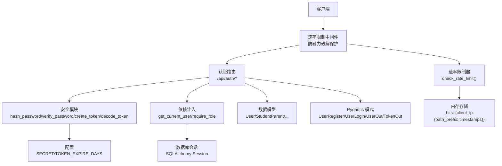
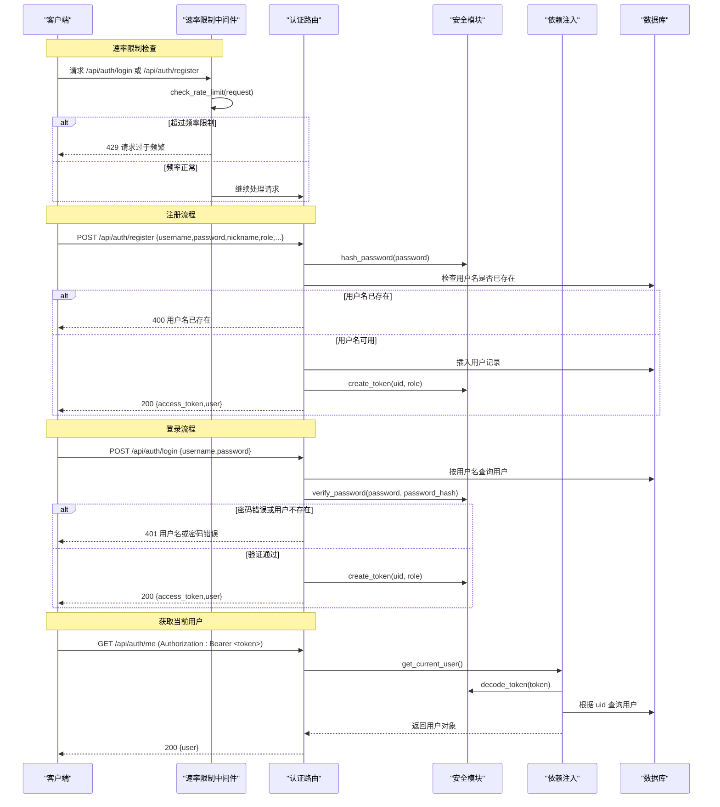
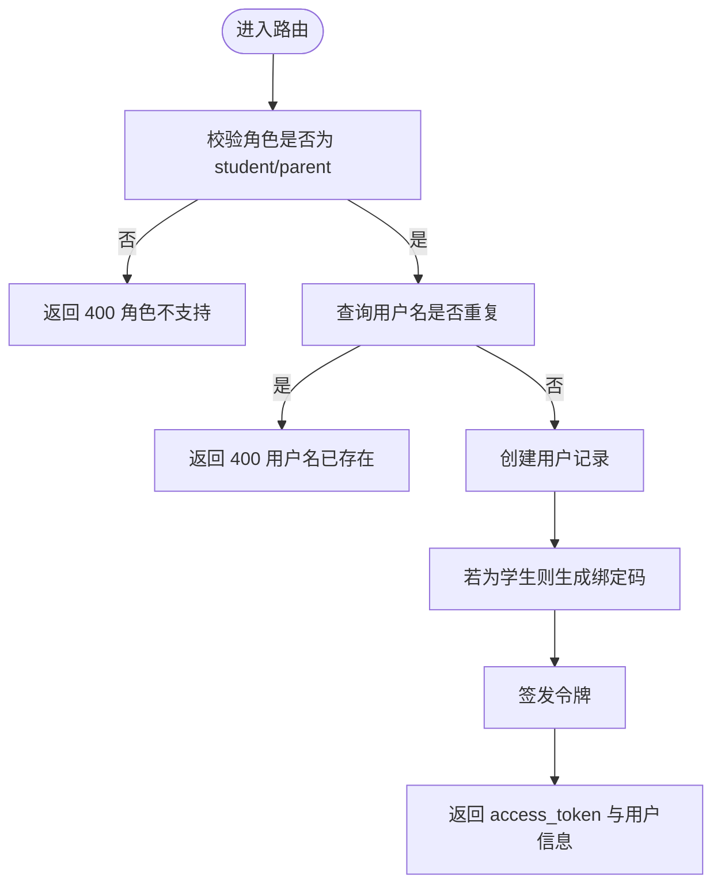
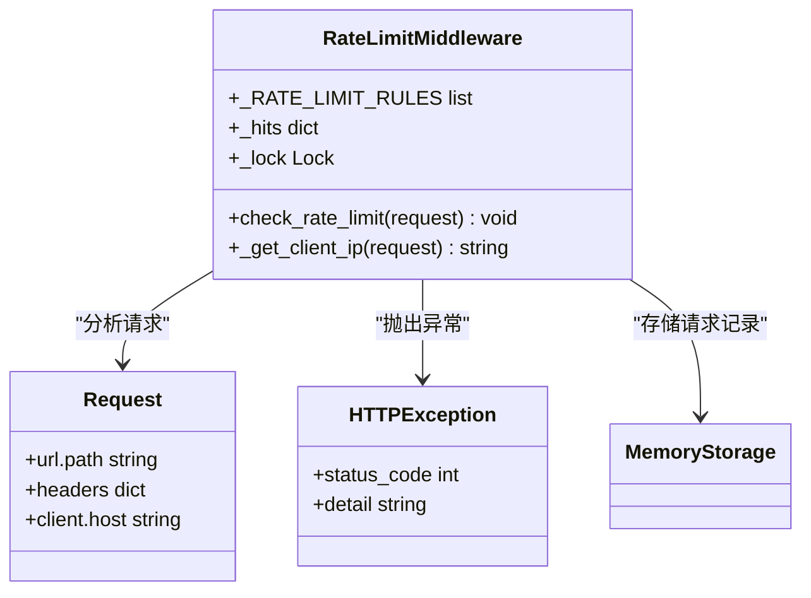
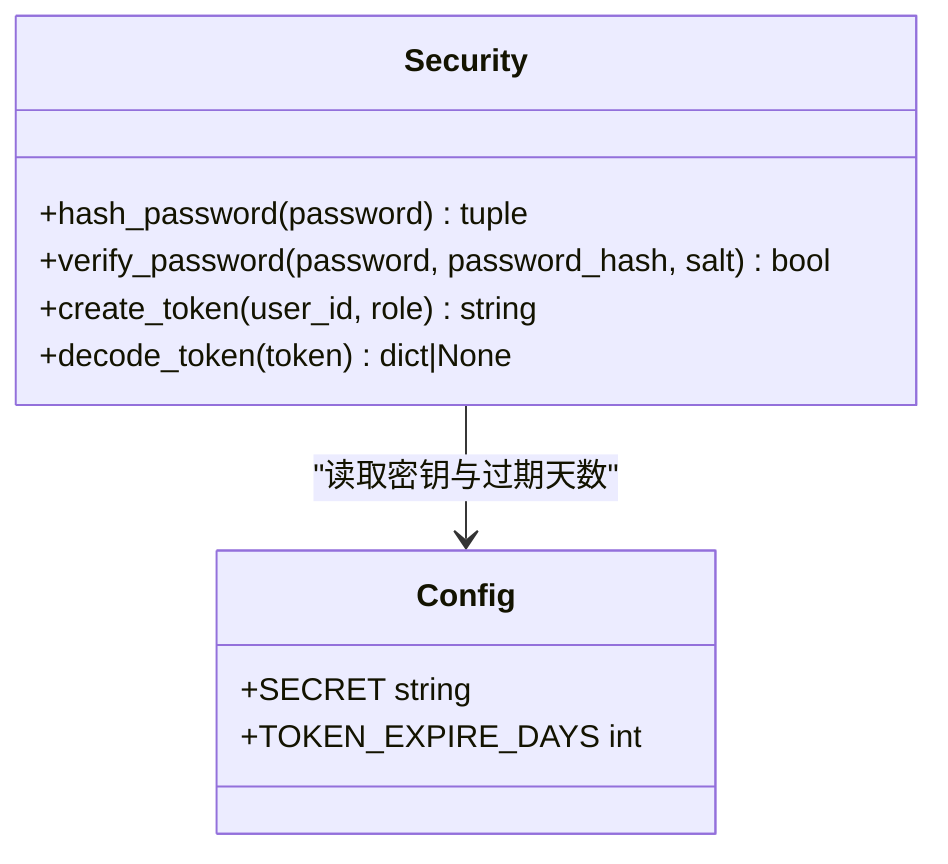
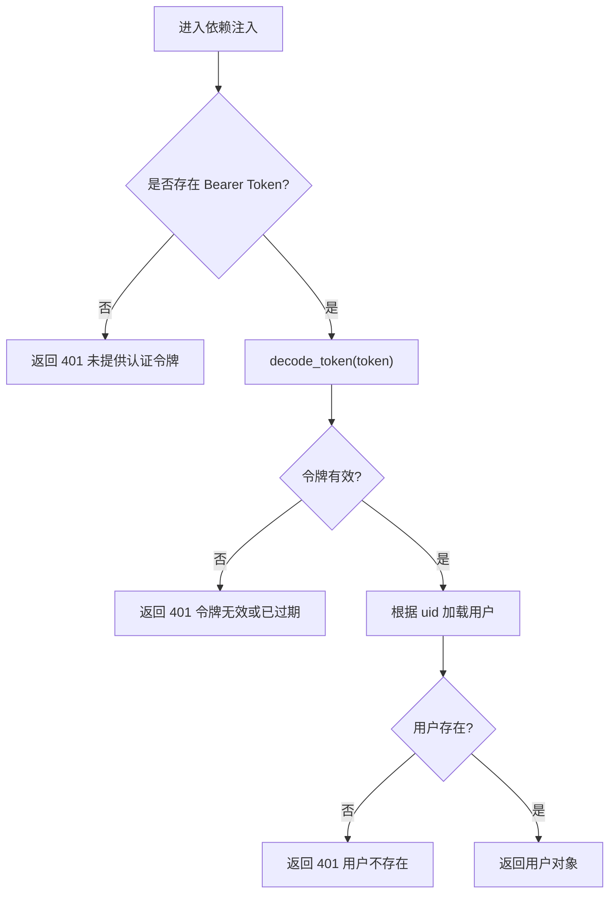
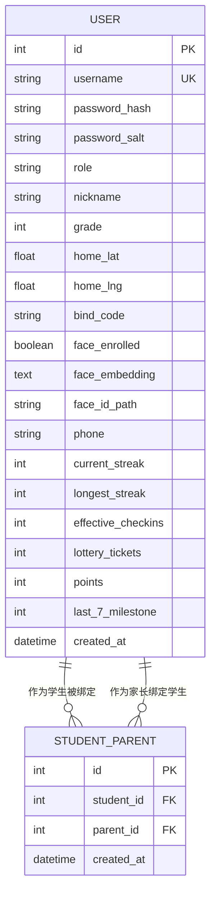
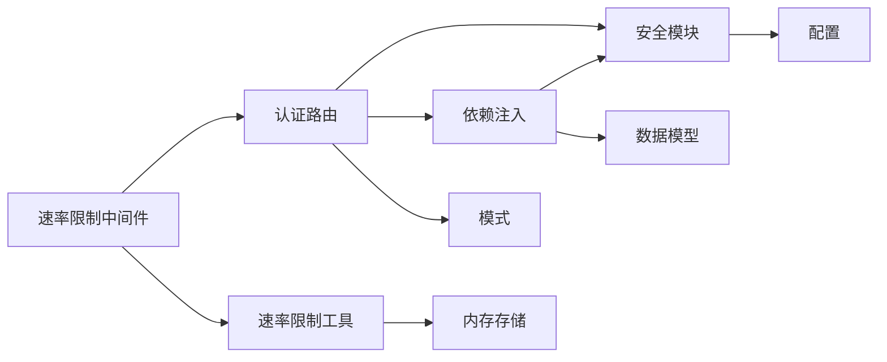

# 用户认证路由

<cite>
**本文引用的文件**   
- [summer-homework-checkin/backend/app/routers/auth.py](file://summer-homework-checkin/backend/app/routers/auth.py)
- [summer-homework-checkin/backend/app/security.py](file://summer-homework-checkin/backend/app/security.py)
- [summer-homework-checkin/backend/app/deps.py](file://summer-homework-checkin/backend/app/deps.py)
- [summer-homework-checkin/backend/app/models.py](file://summer-homework-checkin/backend/app/models.py)
- [summer-homework-checkin/backend/app/schemas.py](file://summer-homework-checkin/backend/app/schemas.py)
- [summer-homework-checkin/backend/app/config.py](file://summer-homework-checkin/backend/app/config.py)
- [summer-homework-checkin/backend/app/main.py](file://summer-homework-checkin/backend/app/main.py)
- [summer-homework-checkin/backend/app/utils/rate_limit.py](file://summer-homework-checkin/backend/app/utils/rate_limit.py)
</cite>

## 更新摘要
**变更内容**   
- 新增速率限制中间件保护认证接口，防止暴力破解攻击
- 集成内存级请求频率控制，针对登录和注册接口实施差异化限制
- 增强系统安全性，支持客户端IP识别和反向代理兼容
- 添加429状态码响应处理机制

## 目录
1. [简介](#简介)
2. [项目结构](#项目结构)
3. [核心组件](#核心组件)
4. [架构总览](#架构总览)
5. [详细组件分析](#详细组件分析)
6. [依赖关系分析](#依赖关系分析)
7. [性能与安全考量](#性能与安全考量)
8. [故障排查指南](#故障排查指南)
9. [结论](#结论)
10. [附录：接口规范与示例](#附录接口规范与示例)

## 简介
本文件为用户认证相关路由的技术文档，覆盖注册、登录、获取当前用户等核心认证流程；阐述令牌生成、校验机制（基于 HMAC 的无状态 token）；说明密码哈希策略与安全防护要点；提供多角色访问控制的路由装饰器用法（学生/家长/管理员）；并给出请求参数验证规则、错误响应格式规范以及调用示例路径。**现已集成速率限制中间件，有效防护暴力破解攻击，保障认证接口的安全性。**

## 项目结构
认证功能主要分布在以下模块：
- 路由层：定义 /api/auth 下的注册、登录、获取当前用户接口
- 安全层：密码哈希、令牌签发与解码
- 依赖注入：从请求头解析 Bearer Token，校验并返回当前用户对象
- **速率限制层：内存级请求频率控制，防止恶意攻击**
- 数据模型与 Schema：用户实体、输入输出模型
- 配置：密钥、过期时间、业务阈值等

**图表来源**
- [summer-homework-checkin/backend/app/routers/auth.py:1-54](file://summer-homework-checkin/backend/app/routers/auth.py#L1-L54)
- [summer-homework-checkin/backend/app/security.py:1-54](file://summer-homework-checkin/backend/app/security.py#L1-L54)
- [summer-homework-checkin/backend/app/deps.py:1-34](file://summer-homework-checkin/backend/app/deps.py#L1-L34)
- [summer-homework-checkin/backend/app/models.py:11-55](file://summer-homework-checkin/backend/app/models.py#L11-L55)
- [summer-homework-checkin/backend/app/schemas.py:5-44](file://summer-homework-checkin/backend/app/schemas.py#L5-L44)
- [summer-homework-checkin/backend/app/config.py:19-21](file://summer-homework-checkin/backend/app/config.py#L19-L21)
- [summer-homework-checkin/backend/app/main.py:34-42](file://summer-homework-checkin/backend/app/main.py#L34-L42)
- [summer-homework-checkin/backend/app/utils/rate_limit.py:1-48](file://summer-homework-checkin/backend/app/utils/rate_limit.py#L1-L48)

## 核心组件
- 认证路由
  - POST /api/auth/register：注册新用户，支持 student/parent 角色，返回 access_token 与用户信息
  - POST /api/auth/login：用户名+密码登录，返回 access_token 与用户信息
  - GET /api/auth/me：读取当前用户信息（需携带有效 Bearer Token）
- 安全模块
  - 密码哈希：PBKDF2-SHA256，每用户随机盐，迭代次数 100,000
  - 令牌签发：HMAC-SHA256 签名，payload 包含 uid、role、exp；body 使用 URL-safe Base64 编码
  - 令牌解码：校验签名与过期时间，返回 payload 或 None
- 依赖注入
  - get_current_user：从请求头提取 Bearer Token，解码后查询用户，不存在或无效则抛错
  - require_role(*roles)：角色守卫装饰器，限制仅允许指定角色访问
- **速率限制中间件**
  - check_rate_limit：内存级请求频率控制，按客户端IP和路径前缀统计请求
  - 差异化限制：登录接口每分钟10次，注册接口每分钟5次
  - 反向代理兼容：支持X-Forwarded-For头部提取真实客户端IP
- 数据模型与模式
  - User：统一用户表，role 区分 student/parent/admin，含打卡统计冗余字段
  - UserRegister/UserLogin/UserOut/TokenOut：注册/登录/输出/令牌响应模式

**章节来源**
- [summer-homework-checkin/backend/app/routers/auth.py:13-54](file://summer-homework-checkin/backend/app/routers/auth.py#L13-L54)
- [summer-homework-checkin/backend/app/security.py:11-54](file://summer-homework-checkin/backend/app/security.py#L11-L54)
- [summer-homework-checkin/backend/app/deps.py:13-34](file://summer-homework-checkin/backend/app/deps.py#L13-L34)
- [summer-homework-checkin/backend/app/utils/rate_limit.py:27-48](file://summer-homework-checkin/backend/app/utils/rate_limit.py#L27-L48)
- [summer-homework-checkin/backend/app/models.py:11-55](file://summer-homework-checkin/backend/app/models.py#L11-L55)
- [summer-homework-checkin/backend/app/schemas.py:5-44](file://summer-homework-checkin/backend/app/schemas.py#L5-L44)

## 架构总览
认证流程涉及"速率限制 → 路由 → 安全 → 依赖注入 → 数据库"的协作。下图展示注册与登录的关键时序，包括新的速率限制保护机制。

**图表来源**
- [summer-homework-checkin/backend/app/routers/auth.py:13-54](file://summer-homework-checkin/backend/app/routers/auth.py#L13-L54)
- [summer-homework-checkin/backend/app/security.py:27-54](file://summer-homework-checkin/backend/app/security.py#L27-L54)
- [summer-homework-checkin/backend/app/deps.py:13-25](file://summer-homework-checkin/backend/app/deps.py#L13-L25)
- [summer-homework-checkin/backend/app/main.py:34-42](file://summer-homework-checkin/backend/app/main.py#L34-L42)
- [summer-homework-checkin/backend/app/utils/rate_limit.py:27-48](file://summer-homework-checkin/backend/app/utils/rate_limit.py#L27-L48)

## 详细组件分析

### 认证路由（/api/auth）
- 注册
  - 入参：用户名、密码、昵称、角色（student/parent）、可选年级/手机号/家庭坐标
  - 逻辑：校验角色、查重用户名、写入用户、为 student 生成绑定码、签发令牌
  - 出参：access_token 与用户信息
- 登录
  - 入参：用户名、密码
  - 逻辑：查用户、校验密码、签发令牌
  - 出参：access_token 与用户信息
- 获取当前用户
  - 鉴权：必须携带有效的 Bearer Token
  - 出参：用户信息

**图表来源**
- [summer-homework-checkin/backend/app/routers/auth.py:13-39](file://summer-homework-checkin/backend/app/routers/auth.py#L13-L39)

**章节来源**
- [summer-homework-checkin/backend/app/routers/auth.py:13-54](file://summer-homework-checkin/backend/app/routers/auth.py#L13-L54)

### 速率限制中间件（新增）
**新增功能** 为防止暴力破解攻击，系统集成了内存级速率限制中间件：

- 配置规则
  - 登录接口：每分钟最多10次请求
  - 注册接口：每分钟最多5次请求
- 实现机制
  - 内存存储：使用字典结构存储每个客户端IP的请求时间戳
  - 线程安全：使用Lock确保并发访问安全
  - 自动清理：定期清除过期的请求记录
- IP识别
  - 支持反向代理：优先从X-Forwarded-For头部获取真实IP
  - 降级处理：无法获取时返回"unknown"标识
- 限流策略
  - 滑动窗口算法：基于时间窗口的请求计数
  - 差异化限制：不同接口采用不同的频率限制
  - 友好提示：超限返回429状态码和重试时间建议

**图表来源**
- [summer-homework-checkin/backend/app/utils/rate_limit.py:1-48](file://summer-homework-checkin/backend/app/utils/rate_limit.py#L1-L48)
- [summer-homework-checkin/backend/app/main.py:34-42](file://summer-homework-checkin/backend/app/main.py#L34-L42)

**章节来源**
- [summer-homework-checkin/backend/app/utils/rate_limit.py:1-48](file://summer-homework-checkin/backend/app/utils/rate_limit.py#L1-L48)
- [summer-homework-checkin/backend/app/main.py:34-42](file://summer-homework-checkin/backend/app/main.py#L34-L42)

### 安全模块（密码与令牌）
- 密码哈希
  - 算法：PBKDF2-SHA256，每用户随机盐，迭代 100,000
  - 比较：使用恒定时间比较函数防止时序攻击
- 令牌签发
  - 载荷：uid、role、exp（以天为单位的天数乘以秒数）
  - 编码：JSON → URL-safe Base64（去除填充）→ HMAC-SHA256 签名
  - 格式：base64_body.signature
- 令牌解码
  - 校验签名与 exp，失败返回 None；成功返回载荷

**图表来源**
- [summer-homework-checkin/backend/app/security.py:11-54](file://summer-homework-checkin/backend/app/security.py#L11-L54)
- [summer-homework-checkin/backend/app/config.py:19-21](file://summer-homework-checkin/backend/app/config.py#L19-L21)

**章节来源**
- [summer-homework-checkin/backend/app/security.py:11-54](file://summer-homework-checkin/backend/app/security.py#L11-L54)
- [summer-homework-checkin/backend/app/config.py:19-21](file://summer-homework-checkin/backend/app/config.py#L19-L21)

### 依赖注入（鉴权与角色守卫）
- get_current_user
  - 从请求头解析 Bearer Token
  - 调用 decode_token 校验签名与过期
  - 根据 uid 查询用户，不存在则报错
- require_role(*roles)
  - 装饰器：在 get_current_user 基础上校验 user.role 是否在允许集合中
  - 未授权时返回 403

**图表来源**
- [summer-homework-checkin/backend/app/deps.py:13-25](file://summer-homework-checkin/backend/app/deps.py#L13-L25)

**章节来源**
- [summer-homework-checkin/backend/app/deps.py:13-34](file://summer-homework-checkin/backend/app/deps.py#L13-L34)

### 数据模型与模式
- 用户模型
  - 字段：id、username、password_hash、password_salt、role、nickname、grade、phone、home_lat/lng、bind_code、face_enrolled、face_embedding、face_id_path、打卡统计冗余字段、created_at
  - 关系：checkins、lottery_records、bindings_as_student、bindings_as_parent
- 模式
  - UserRegister：注册入参（含 role 默认值）
  - UserLogin：登录入参
  - UserOut：用户输出（含统计字段）
  - TokenOut：令牌输出（access_token、token_type、user）

**图表来源**
- [summer-homework-checkin/backend/app/models.py:11-68](file://summer-homework-checkin/backend/app/models.py#L11-L68)

**章节来源**
- [summer-homework-checkin/backend/app/models.py:11-68](file://summer-homework-checkin/backend/app/models.py#L11-L68)
- [summer-homework-checkin/backend/app/schemas.py:5-44](file://summer-homework-checkin/backend/app/schemas.py#L5-L44)

## 依赖关系分析
- 路由层依赖安全模块进行密码处理与令牌签发/解码
- 依赖注入负责从请求中提取并校验令牌，再加载用户
- **速率限制中间件在请求入口处拦截，对敏感接口实施频率控制**
- 数据模型与模式用于持久化与请求/响应校验
- 配置提供密钥与过期时间等关键参数

**图表来源**
- [summer-homework-checkin/backend/app/routers/auth.py:1-54](file://summer-homework-checkin/backend/app/routers/auth.py#L1-L54)
- [summer-homework-checkin/backend/app/security.py:1-54](file://summer-homework-checkin/backend/app/security.py#L1-L54)
- [summer-homework-checkin/backend/app/deps.py:1-34](file://summer-homework-checkin/backend/app/deps.py#L1-L34)
- [summer-homework-checkin/backend/app/models.py:11-55](file://summer-homework-checkin/backend/app/models.py#L11-L55)
- [summer-homework-checkin/backend/app/schemas.py:5-44](file://summer-homework-checkin/backend/app/schemas.py#L5-L44)
- [summer-homework-checkin/backend/app/config.py:19-21](file://summer-homework-checkin/backend/app/config.py#L19-L21)
- [summer-homework-checkin/backend/app/main.py:34-42](file://summer-homework-checkin/backend/app/main.py#L34-L42)
- [summer-homework-checkin/backend/app/utils/rate_limit.py:1-48](file://summer-homework-checkin/backend/app/utils/rate_limit.py#L1-L48)

**章节来源**
- [summer-homework-checkin/backend/app/routers/auth.py:1-54](file://summer-homework-checkin/backend/app/routers/auth.py#L1-L54)
- [summer-homework-checkin/backend/app/security.py:1-54](file://summer-homework-checkin/backend/app/security.py#L1-L54)
- [summer-homework-checkin/backend/app/deps.py:1-34](file://summer-homework-checkin/backend/app/deps.py#L1-L34)
- [summer-homework-checkin/backend/app/models.py:11-55](file://summer-homework-checkin/backend/app/models.py#L11-L55)
- [summer-homework-checkin/backend/app/schemas.py:5-44](file://summer-homework-checkin/backend/app/schemas.py#L5-L44)
- [summer-homework-checkin/backend/app/config.py:19-21](file://summer-homework-checkin/backend/app/config.py#L19-L21)
- [summer-homework-checkin/backend/app/main.py:34-42](file://summer-homework-checkin/backend/app/main.py#L34-L42)
- [summer-homework-checkin/backend/app/utils/rate_limit.py:1-48](file://summer-homework-checkin/backend/app/utils/rate_limit.py#L1-L48)

## 性能与安全考量
- 密码哈希
  - PBKDF2 迭代次数较高，安全性强但 CPU 开销较大；建议在生产环境评估硬件成本与并发量
  - 每用户随机盐，提升安全性，避免彩虹表攻击
- 令牌机制
  - 无状态、可横向扩展；注意 SECRET 的安全管理（环境变量注入）
  - 当前实现未提供刷新令牌（refresh token）机制；如需长会话，可在后续引入 refresh token 与短期 access token 的组合方案
- 权限控制
  - 使用 require_role 装饰器可实现细粒度角色控制；建议在需要管理员能力的接口上显式声明 admin 角色
- **速率限制安全**
  - 内存存储：简单高效，适合单机部署；分布式环境建议使用Redis等共享存储
  - 线程安全：使用锁机制保证并发访问安全
  - 资源清理：自动清理过期记录，防止内存泄漏
  - 反向代理兼容：支持负载均衡场景下的真实IP识别
- 错误响应
  - 使用 HTTPException 抛出标准错误，FastAPI 会返回 JSON 格式的 detail 字段；前端可按 status code 分支处理
  - **新增429状态码：请求过于频繁时的友好提示**

## 故障排查指南
- 401 未提供认证令牌
  - 检查请求头 Authorization 是否包含 Bearer Token
- 401 令牌无效或已过期
  - 确认 TOKEN_EXPIRE_DAYS 配置与系统时间一致；检查 SECRET 是否与签发端一致
- 401 用户不存在
  - 检查 uid 对应的用户是否已被删除或迁移
- 400 用户名已存在
  - 注册前应先查询用户名可用性
- 400 角色仅支持 student/parent
  - 注册时 role 必须为 student 或 parent；管理员通常由后台初始化
- 403 无权限访问该资源
  - 目标接口可能使用了 require_role 限定角色，请确保当前用户角色符合要求
- **429 请求过于频繁**
  - 登录接口：等待60秒后重试（每分钟最多10次）
  - 注册接口：等待60秒后重试（每分钟最多5次）
  - 检查是否为同一客户端IP发起的批量请求
  - 反向代理环境下检查X-Forwarded-For头部是否正确传递

**章节来源**
- [summer-homework-checkin/backend/app/deps.py:13-34](file://summer-homework-checkin/backend/app/deps.py#L13-L34)
- [summer-homework-checkin/backend/app/routers/auth.py:13-54](file://summer-homework-checkin/backend/app/routers/auth.py#L13-L54)
- [summer-homework-checkin/backend/app/utils/rate_limit.py:27-48](file://summer-homework-checkin/backend/app/utils/rate_limit.py#L27-L48)

## 结论
本认证子系统采用轻量无状态令牌与 PBKDF2 密码哈希，结合 FastAPI 依赖注入实现了注册、登录与当前用户读取的核心能力。**新增的速率限制中间件有效防护了暴力破解攻击，通过内存级频率控制和差异化限制策略，显著提升了系统的安全性。** 通过 require_role 装饰器可扩展多角色访问控制。当前未实现登出与刷新令牌，建议后续补充刷新令牌机制与更严格的密码策略（最小长度、复杂度校验等）。

## 附录：接口规范与示例

### 接口清单
- POST /api/auth/register
  - 描述：注册用户（student/parent）
  - 入参：UserRegister
  - 出参：TokenOut
  - 错误：400（角色不支持/用户名已存在）、**429（请求过于频繁）**
- POST /api/auth/login
  - 描述：用户名+密码登录
  - 入参：UserLogin
  - 出参：TokenOut
  - 错误：401（用户名或密码错误）、**429（请求过于频繁）**
- GET /api/auth/me
  - 描述：获取当前用户信息
  - 鉴权：Bearer Token
  - 出参：UserOut
  - 错误：401（未提供/无效或过期/用户不存在）

**章节来源**
- [summer-homework-checkin/backend/app/routers/auth.py:13-54](file://summer-homework-checkin/backend/app/routers/auth.py#L13-L54)
- [summer-homework-checkin/backend/app/schemas.py:5-44](file://summer-homework-checkin/backend/app/schemas.py#L5-L44)

### 请求参数验证规则
- UserRegister
  - username：必填字符串
  - password：必填字符串
  - nickname：必填字符串
  - role：枚举 student/parent，默认 student
  - grade：整数，默认 3
  - phone：字符串或空
  - home_lat/home_lng：浮点数或空
- UserLogin
  - username：必填字符串
  - password：必填字符串
- TokenOut
  - access_token：字符串
  - token_type：字符串，默认 bearer
  - user：UserOut 对象
- UserOut
  - 包含用户基础信息与统计字段（如 streak、points、lottery_tickets 等）

**章节来源**
- [summer-homework-checkin/backend/app/schemas.py:5-44](file://summer-homework-checkin/backend/app/schemas.py#L5-L44)

### 错误响应格式规范
- 400 Bad Request
  - 场景：角色不支持、用户名已存在
  - 响应体：包含 detail 字段
- 401 Unauthorized
  - 场景：未提供令牌、令牌无效或已过期、用户不存在、用户名或密码错误
  - 响应体：包含 detail 字段
- 403 Forbidden
  - 场景：角色不符合 require_role 要求
  - 响应体：包含 detail 字段
- **429 Too Many Requests**
  - 场景：超过速率限制（登录每分钟10次，注册每分钟5次）
  - 响应体：包含 detail 字段，提示重试时间

**章节来源**
- [summer-homework-checkin/backend/app/routers/auth.py:13-54](file://summer-homework-checkin/backend/app/routers/auth.py#L13-L54)
- [summer-homework-checkin/backend/app/deps.py:13-34](file://summer-homework-checkin/backend/app/deps.py#L13-L34)
- [summer-homework-checkin/backend/app/utils/rate_limit.py:27-48](file://summer-homework-checkin/backend/app/utils/rate_limit.py#L27-L48)

### 实际调用示例（路径指引）
- 注册
  - 参考实现位置：[summer-homework-checkin/backend/app/routers/auth.py:13-39](file://summer-homework-checkin/backend/app/routers/auth.py#L13-L39)
  - 入参模型：[summer-homework-checkin/backend/app/schemas.py:5-14](file://summer-homework-checkin/backend/app/schemas.py#L5-L14)
  - 出参模型：[summer-homework-checkin/backend/app/schemas.py:40-44](file://summer-homework-checkin/backend/app/schemas.py#L40-L44)
- 登录
  - 参考实现位置：[summer-homework-checkin/backend/app/routers/auth.py:42-48](file://summer-homework-checkin/backend/app/routers/auth.py#L42-L48)
  - 入参模型：[summer-homework-checkin/backend/app/schemas.py:16-18](file://summer-homework-checkin/backend/app/schemas.py#L16-L18)
- 获取当前用户
  - 参考实现位置：[summer-homework-checkin/backend/app/routers/auth.py:51-54](file://summer-homework-checkin/backend/app/routers/auth.py#L51-L54)
  - 鉴权依赖：[summer-homework-checkin/backend/app/deps.py:13-25](file://summer-homework-checkin/backend/app/deps.py#L13-L25)

### 多角色权限控制（装饰器用法）
- 使用 require_role("admin") 保护管理员接口
- 使用 require_role("student", "parent") 保护学生与家长均可访问的接口
- 未满足角色要求将返回 403

**章节来源**
- [summer-homework-checkin/backend/app/deps.py:28-34](file://summer-homework-checkin/backend/app/deps.py#L28-L34)

### 登出与刷新令牌说明
- 当前实现未提供登出与刷新令牌接口
- 建议方案：引入 refresh token（长期）与 access token（短期）组合，服务端维护 refresh token 黑名单或短有效期，配合前端自动刷新逻辑

### 速率限制配置说明
- 配置文件位置：[summer-homework-checkin/backend/app/utils/rate_limit.py:9-12](file://summer-homework-checkin/backend/app/utils/rate_limit.py#L9-L12)
- 修改方法：调整 _RATE_LIMIT_RULES 列表中的限制参数
- 监控建议：在生产环境监控429状态码出现频率，评估是否需要调整限制策略

**章节来源**
- [summer-homework-checkin/backend/app/utils/rate_limit.py:9-12](file://summer-homework-checkin/backend/app/utils/rate_limit.py#L9-L12)