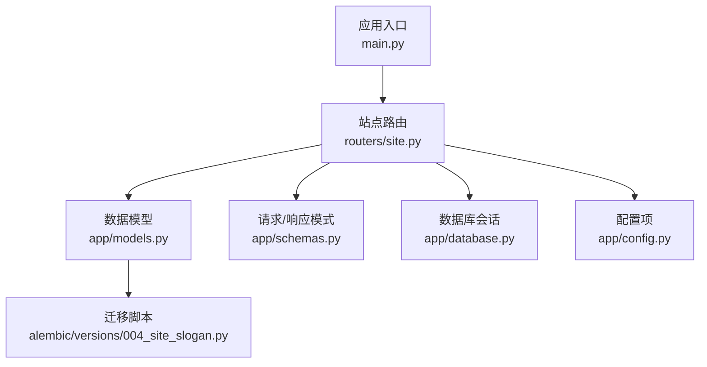
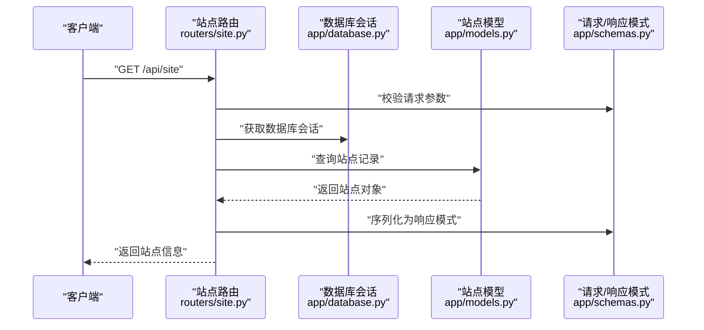
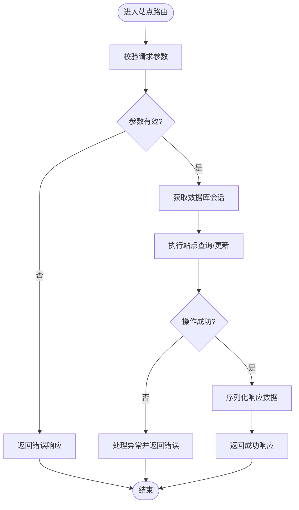
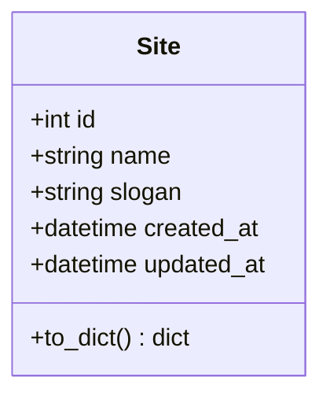
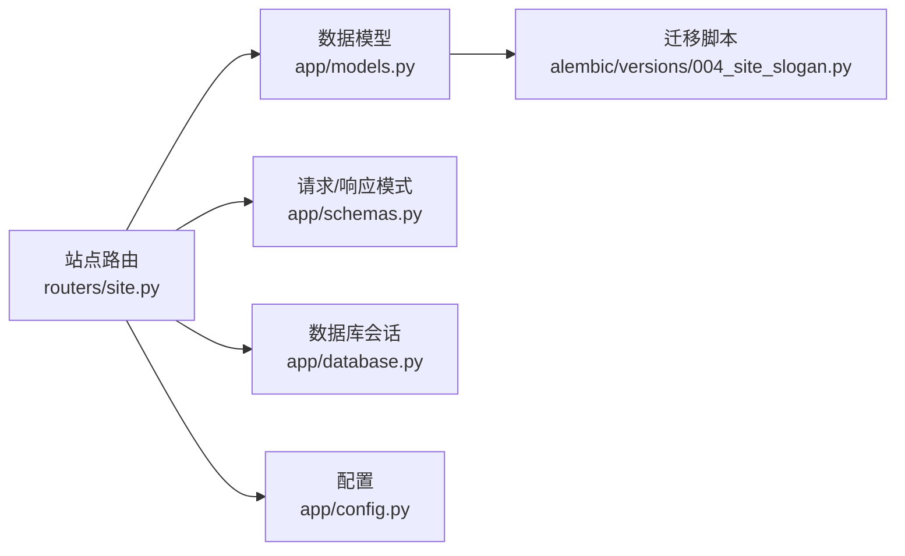

# 站点管理API

<cite>
**本文引用的文件**   
- [site.py](file://summer-homework-checkin/backend/app/routers/site.py)
- [main.py](file://summer-homework-checkin/backend/app/main.py)
- [models.py](file://summer-homework-checkin/backend/app/models.py)
- [schemas.py](file://summer-homework-checkin/backend/app/schemas.py)
- [database.py](file://summer-homework-checkin/backend/app/database.py)
- [config.py](file://summer-homework-checkin/backend/app/config.py)
- [004_site_slogan.py](file://summer-homework-checkin/backend/alembic/versions/004_site_slogan.py)
</cite>

## 目录
1. [简介](#简介)
2. [项目结构](#项目结构)
3. [核心组件](#核心组件)
4. [架构总览](#架构总览)
5. [详细组件分析](#详细组件分析)
6. [依赖关系分析](#依赖关系分析)
7. [性能考虑](#性能考虑)
8. [故障排查指南](#故障排查指南)
9. [结论](#结论)
10. [附录](#附录)

## 简介
本章节概述“站点管理API”的目标与范围。该API用于对系统站点信息进行增删改查，包括站点名称、标语等基础配置项的维护，为多站点或多环境部署提供统一的站点元数据管理能力。

## 项目结构
站点管理功能位于 summer-homework-checkin 后端模块中，路由定义在 routers/site.py，模型与数据库迁移在 models.py 与 alembic 版本脚本中，应用入口在 main.py，配置与数据库连接分别在 config.py 与 database.py。

图表来源
- [main.py](file://summer-homework-checkin/backend/app/main.py)
- [site.py](file://summer-homework-checkin/backend/app/routers/site.py)
- [models.py](file://summer-homework-checkin/backend/app/models.py)
- [schemas.py](file://summer-homework-checkin/backend/app/schemas.py)
- [database.py](file://summer-homework-checkin/backend/app/database.py)
- [config.py](file://summer-homework-checkin/backend/app/config.py)
- [004_site_slogan.py](file://summer-homework-checkin/backend/alembic/versions/004_site_slogan.py)

章节来源
- [main.py](file://summer-homework-checkin/backend/app/main.py)
- [site.py](file://summer-homework-checkin/backend/app/routers/site.py)
- [models.py](file://summer-homework-checkin/backend/app/models.py)
- [schemas.py](file://summer-homework-checkin/backend/app/schemas.py)
- [database.py](file://summer-homework-checkin/backend/app/database.py)
- [config.py](file://summer-homework-checkin/backend/app/config.py)
- [004_site_slogan.py](file://summer-homework-checkin/backend/alembic/versions/004_site_slogan.py)

## 核心组件
- 站点路由：暴露站点管理的REST接口，处理查询、更新等操作。
- 数据模型：定义站点实体及其字段（如站点名称、标语等）。
- 请求/响应模式：统一输入输出结构，保证接口契约稳定。
- 数据库会话：提供事务化访问能力，确保数据一致性。
- 配置：集中管理站点相关的环境变量或默认值。

章节来源
- [site.py](file://summer-homework-checkin/backend/app/routers/site.py)
- [models.py](file://summer-homework-checkin/backend/app/models.py)
- [schemas.py](file://summer-homework-checkin/backend/app/schemas.py)
- [database.py](file://summer-homework-checkin/backend/app/database.py)
- [config.py](file://summer-homework-checkin/backend/app/config.py)

## 架构总览
站点管理API采用典型的分层架构：路由层接收HTTP请求，调用服务逻辑（如有），通过数据模型与数据库交互，返回标准化的JSON响应。

图表来源
- [site.py](file://summer-homework-checkin/backend/app/routers/site.py)
- [database.py](file://summer-homework-checkin/backend/app/database.py)
- [models.py](file://summer-homework-checkin/backend/app/models.py)
- [schemas.py](file://summer-homework-checkin/backend/app/schemas.py)

## 详细组件分析

### 站点路由（routers/site.py）
- 职责：定义站点相关的HTTP端点，处理请求解析、参数校验、业务编排与响应封装。
- 典型流程：
  - 接收请求并校验输入（使用 schemas.py 定义的Pydantic模型）。
  - 通过 database.py 获取数据库会话。
  - 调用 models.py 中的站点模型进行CRUD操作。
  - 将结果转换为标准响应格式返回。

图表来源
- [site.py](file://summer-homework-checkin/backend/app/routers/site.py)
- [schemas.py](file://summer-homework-checkin/backend/app/schemas.py)
- [database.py](file://summer-homework-checkin/backend/app/database.py)
- [models.py](file://summer-homework-checkin/backend/app/models.py)

章节来源
- [site.py](file://summer-homework-checkin/backend/app/routers/site.py)
- [schemas.py](file://summer-homework-checkin/backend/app/schemas.py)

### 数据模型（app/models.py）
- 职责：定义站点实体的ORM映射，包含站点标识、名称、标语等字段及约束。
- 关键点：
  - 字段类型与长度限制。
  - 唯一性约束（如站点标识）。
  - 时间戳字段（创建/更新时间）。

图表来源
- [models.py](file://summer-homework-checkin/backend/app/models.py)

章节来源
- [models.py](file://summer-homework-checkin/backend/app/models.py)

### 请求/响应模式（app/schemas.py）
- 职责：定义站点相关接口的输入输出数据结构，确保前后端契约一致。
- 常见模式：
  - 站点查询请求参数（可选过滤条件）。
  - 站点更新请求体（部分字段可空）。
  - 站点响应体（包含id、name、slogan等）。

章节来源
- [schemas.py](file://summer-homework-checkin/backend/app/schemas.py)

### 数据库会话（app/database.py）
- 职责：管理数据库连接与会话生命周期，提供事务支持。
- 关键点：
  - 连接池配置。
  - 会话工厂函数。
  - 事务提交与回滚策略。

章节来源
- [database.py](file://summer-homework-checkin/backend/app/database.py)

### 配置（app/config.py）
- 职责：集中管理站点相关配置（如默认站点名、标语、数据库URL等）。
- 关键点：
  - 环境变量读取与默认值。
  - 配置验证与加载顺序。

章节来源
- [config.py](file://summer-homework-checkin/backend/app/config.py)

### 数据库迁移（alembic/versions/004_site_slogan.py）
- 职责：为站点表添加标语字段，确保数据库结构与模型同步。
- 关键点：
  - 升级脚本：添加 slogan 列。
  - 降级脚本：移除 slogan 列。

章节来源
- [004_site_slogan.py](file://summer-homework-checkin/backend/alembic/versions/004_site_slogan.py)

## 依赖关系分析
站点管理API的依赖关系清晰，路由层依赖模型、模式、数据库与配置模块，形成低耦合高内聚的结构。

图表来源
- [site.py](file://summer-homework-checkin/backend/app/routers/site.py)
- [models.py](file://summer-homework-checkin/backend/app/models.py)
- [schemas.py](file://summer-homework-checkin/backend/app/schemas.py)
- [database.py](file://summer-homework-checkin/backend/app/database.py)
- [config.py](file://summer-homework-checkin/backend/app/config.py)
- [004_site_slogan.py](file://summer-homework-checkin/backend/alembic/versions/004_site_slogan.py)

章节来源
- [site.py](file://summer-homework-checkin/backend/app/routers/site.py)
- [models.py](file://summer-homework-checkin/backend/app/models.py)
- [schemas.py](file://summer-homework-checkin/backend/app/schemas.py)
- [database.py](file://summer-homework-checkin/backend/app/database.py)
- [config.py](file://summer-homework-checkin/backend/app/config.py)
- [004_site_slogan.py](file://summer-homework-checkin/backend/alembic/versions/004_site_slogan.py)

## 性能考虑
- 数据库查询优化：避免N+1查询，合理使用索引（如站点标识字段）。
- 缓存策略：对只读站点信息（如标语）可引入缓存层减少数据库压力。
- 连接池：合理配置数据库连接池大小以应对并发请求。
- 响应体积：仅返回必要字段，避免冗余数据传输。

[本节为通用指导，不直接分析具体文件]

## 故障排查指南
- 常见问题：
  - 数据库连接失败：检查 database.py 配置与网络连通性。
  - 字段缺失：确认 alembic 迁移已正确执行。
  - 参数校验失败：核对 schemas.py 定义与前端传参。
- 调试建议：
  - 启用详细日志记录。
  - 使用单元测试覆盖关键路径。
  - 通过API文档工具验证接口契约。

章节来源
- [database.py](file://summer-homework-checkin/backend/app/database.py)
- [004_site_slogan.py](file://summer-homework-checkin/backend/alembic/versions/004_site_slogan.py)
- [schemas.py](file://summer-homework-checkin/backend/app/schemas.py)

## 结论
站点管理API提供了简洁稳定的站点元数据管理能力，通过清晰的模块划分与标准化接口设计，便于扩展与维护。建议在生产环境中结合缓存与监控进一步提升性能与可观测性。

[本节为总结性内容，不直接分析具体文件]

## 附录
- API端点示例（基于路由定义推断）：
  - GET /api/site：获取站点信息
  - PUT /api/site：更新站点信息
- 数据模型字段：
  - id：站点标识
  - name：站点名称
  - slogan：站点标语
  - created_at：创建时间
  - updated_at：更新时间

[本节为补充说明，不直接分析具体文件]