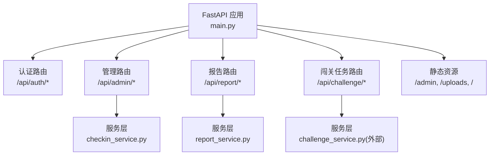
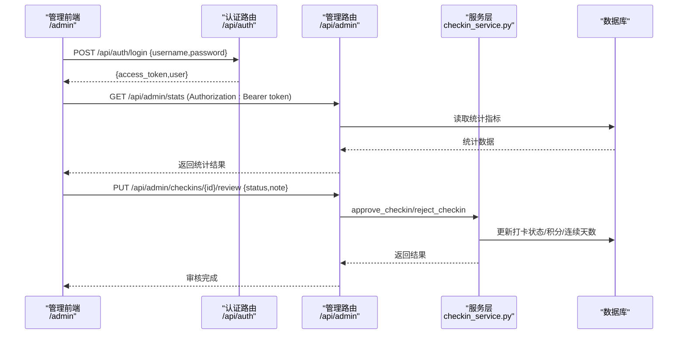
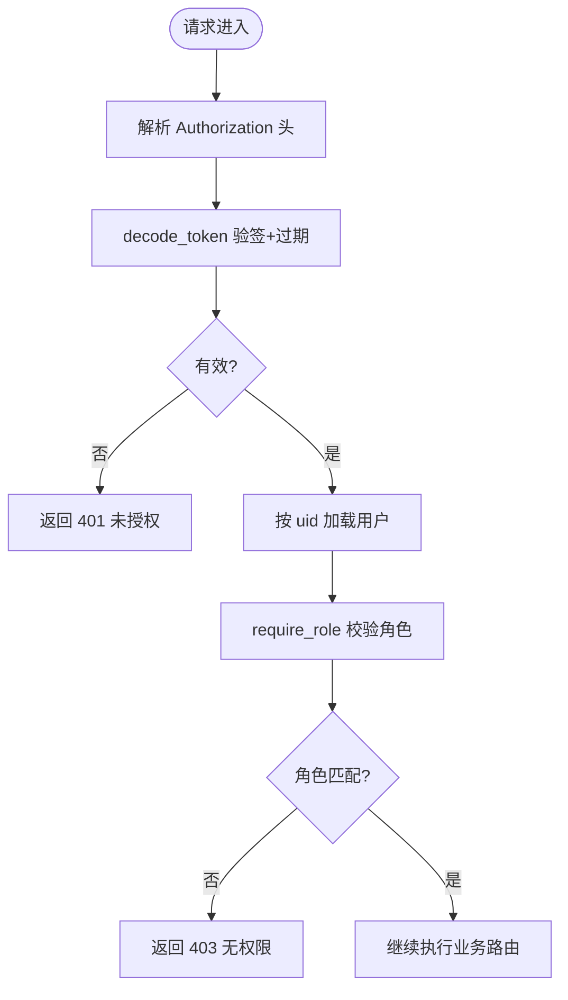
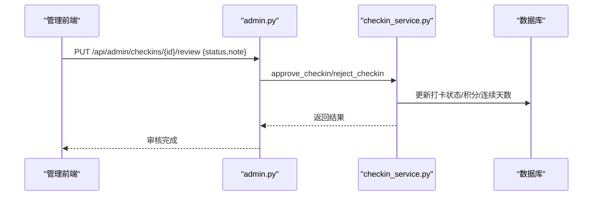
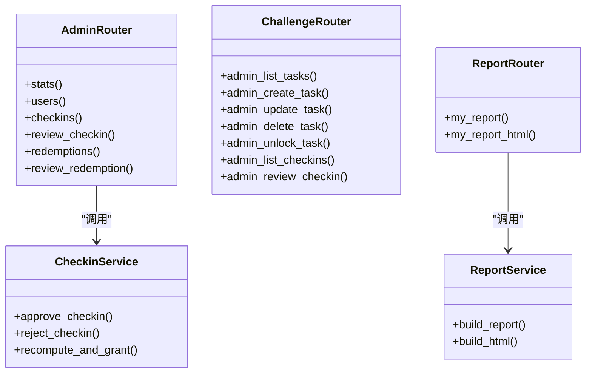

# 管理后台路由

<cite>
**本文引用的文件**   
- [main.py](file://summer-homework-checkin/backend/app/main.py)
- [admin.py](file://summer-homework-checkin/backend/app/routers/admin.py)
- [auth.py](file://summer-homework-checkin/backend/app/routers/auth.py)
- [security.py](file://summer-homework-checkin/backend/app/security.py)
- [deps.py](file://summer-homework-checkin/backend/app/deps.py)
- [models.py](file://summer-homework-checkin/backend/app/models.py)
- [schemas.py](file://summer-homework-checkin/backend/app/schemas.py)
- [config.py](file://summer-homework-checkin/backend/app/config.py)
- [report.py](file://summer-homework-checkin/backend/app/routers/report.py)
- [checkin_service.py](file://summer-homework-checkin/backend/app/services/checkin_service.py)
- [report_service.py](file://summer-homework-checkin/backend/app/services/report_service.py)
- [challenge.py](file://summer-homework-checkin/backend/app/routers/challenge.py)
- [index.html](file://summer-homework-checkin/frontend/admin/index.html)
- [app.js](file://summer-homework-checkin/frontend/admin/app.js)
</cite>

## 目录
1. [简介](#简介)
2. [项目结构](#项目结构)
3. [核心组件](#核心组件)
4. [架构总览](#架构总览)
5. [详细组件分析](#详细组件分析)
6. [依赖关系分析](#依赖关系分析)
7. [性能与扩展性](#性能与扩展性)
8. [故障排查指南](#故障排查指南)
9. [结论](#结论)
10. [附录：API 调用示例与管理界面集成](#附录api-调用示例与管理界面集成)

## 简介
本技术文档聚焦“暑假作业打卡系统”的管理后台路由，围绕管理员专属接口的权限控制、访问验证机制展开，深入说明用户管理、打卡审核、数据统计、兑换记录管理等核心功能。同时阐述批量操作与数据处理的高效实现方案、报表生成与数据导出能力、管理操作的日志与审计追踪机制，并提供完整的 API 调用示例与管理界面集成方式，以及与其它业务模块的协作关系和数据共享策略。

## 项目结构
后端采用 FastAPI 模块化路由组织，管理端路由集中在 /api/admin 前缀下；认证与鉴权通过自定义 Bearer Token 与角色校验中间件完成；静态资源（管理前端）通过挂载 /admin 提供独立后台页面。

图表来源
- [main.py:1-49](file://summer-homework-checkin/backend/app/main.py#L1-L49)
- [admin.py:1-214](file://summer-homework-checkin/backend/app/routers/admin.py#L1-L214)
- [report.py:1-36](file://summer-homework-checkin/backend/app/routers/report.py#L1-L36)
- [challenge.py:1-377](file://summer-homework-checkin/backend/app/routers/challenge.py#L1-L377)

章节来源
- [main.py:1-49](file://summer-homework-checkin/backend/app/main.py#L1-L49)

## 核心组件
- 认证与鉴权
  - 登录注册与令牌签发：/api/auth/login、/api/auth/register、/api/auth/me
  - 无状态 HMAC 签名 Token，含过期时间校验
  - 基于角色的访问控制：require_role("admin")
- 管理路由
  - 统计概览：/api/admin/stats
  - 用户列表：/api/admin/users
  - 打卡记录与审核：/api/admin/checkins、/api/admin/checkins/pending-count、/api/admin/checkins/{id}/review
  - 兑换记录与审核：/api/admin/redemptions、/api/admin/redemptions/{id}、/api/admin/redemptions/{id}/review
- 报告与导出
  - 学生个人报告 JSON：/api/report/me
  - 可打印 HTML 报告：/api/report/me/html
- 闯关任务管理（管理端）
  - 任务 CRUD、开放/删除、打卡记录查询与审核：/api/challenge/admin/*

章节来源
- [auth.py:1-52](file://summer-homework-checkin/backend/app/routers/auth.py#L1-L52)
- [security.py:1-47](file://summer-homework-checkin/backend/app/security.py#L1-L47)
- [deps.py:1-34](file://summer-homework-checkin/backend/app/deps.py#L1-L34)
- [admin.py:1-214](file://summer-homework-checkin/backend/app/routers/admin.py#L1-L214)
- [report.py:1-36](file://summer-homework-checkin/backend/app/routers/report.py#L1-L36)
- [challenge.py:188-377](file://summer-homework-checkin/backend/app/routers/challenge.py#L188-L377)

## 架构总览
管理后台整体流程：前端在 /admin 加载 Vue 应用，登录后获取 Bearer Token，后续请求携带 Authorization 头。后端通过 HTTPBearer 解析并校验 Token，再根据 require_role 进行角色校验，最终进入具体路由处理逻辑。

图表来源
- [auth.py:40-52](file://summer-homework-checkin/backend/app/routers/auth.py#L40-L52)
- [admin.py:84-103](file://summer-homework-checkin/backend/app/routers/admin.py#L84-L103)
- [checkin_service.py:166-209](file://summer-homework-checkin/backend/app/services/checkin_service.py#L166-L209)

## 详细组件分析

### 权限控制与访问验证
- 令牌签发与校验
  - 使用 HMAC 对 payload 签名，payload 包含 uid、role、exp，支持过期校验
  - decode_token 负责验签与过期检查，失败则拒绝访问
- 当前用户解析
  - get_current_user 从 Authorization 头提取 Bearer Token，解码后按 uid 查库得到 User 对象
- 角色校验
  - require_role(*roles) 作为依赖注入装饰器，若当前用户 role 不在允许集合中，返回 403

图表来源
- [security.py:20-47](file://summer-homework-checkin/backend/app/security.py#L20-L47)
- [deps.py:13-33](file://summer-homework-checkin/backend/app/deps.py#L13-L33)

章节来源
- [security.py:1-47](file://summer-homework-checkin/backend/app/security.py#L1-L47)
- [deps.py:1-34](file://summer-homework-checkin/backend/app/deps.py#L1-L34)

### 管理路由：统计概览
- 接口：GET /api/admin/stats
- 功能：返回学生数、家长数、有效打卡数、绑定关系数、位置异常打卡数、兑换待处理/已兑现/已拒绝数量、暑假统计窗口等
- 权限：require_role("admin")

章节来源
- [admin.py:16-35](file://summer-homework-checkin/backend/app/routers/admin.py#L16-L35)

### 管理路由：用户管理
- 接口：GET /api/admin/users
- 功能：返回用户基础信息与关键统计字段（连续天数、最长连续、有效打卡、积分、抽奖券、绑定码等）
- 权限：require_role("admin")

章节来源
- [admin.py:38-50](file://summer-homework-checkin/backend/app/routers/admin.py#L38-L50)

### 管理路由：打卡审核
- 接口
  - GET /api/admin/checkins：返回最近打卡记录（含用户昵称、审核状态、照片链接等），默认限制 500 条
  - GET /api/admin/checkins/pending-count：返回待审核数量
  - PUT /api/admin/checkins/{id}/review：审核打卡（approved/rejected），通过后自动发放积分并重算连续天数
- 权限：require_role("admin")
- 业务规则
  - 仅 pending 状态的记录可审核
  - approved：标记有效、增加积分、重算 streak 并发放抽奖资格（每 7 天里程碑）
  - rejected：标记无效，通知学生

图表来源
- [admin.py:84-103](file://summer-homework-checkin/backend/app/routers/admin.py#L84-L103)
- [checkin_service.py:166-209](file://summer-homework-checkin/backend/app/services/checkin_service.py#L166-L209)

章节来源
- [admin.py:53-103](file://summer-homework-checkin/backend/app/routers/admin.py#L53-L103)
- [checkin_service.py:166-209](file://summer-homework-checkin/backend/app/services/checkin_service.py#L166-L209)

### 管理路由：兑换记录管理
- 接口
  - GET /api/admin/redemptions?status=...：支持按状态筛选（pending/approved/rejected），返回学生昵称、奖品名、消耗积分、兑换时间、审核备注等
  - GET /api/admin/redemptions/{id}：详情
  - PUT /api/admin/redemptions/{id}/review：审核兑换（approved 标记 fulfilled；rejected 退还积分）
- 权限：require_role("admin")
- 业务规则
  - 仅 pending 状态可审核
  - approved：标记 fulfilled，记录审核人与时间
  - rejected：标记 rejected，退回对应积分

章节来源
- [admin.py:106-213](file://summer-homework-checkin/backend/app/routers/admin.py#L106-L213)

### 报表生成与数据导出
- 接口
  - GET /api/report/me：返回学生个人报告 JSON（完成率、每周分布、中奖记录、抽奖次数等）
  - GET /api/report/me/html：返回可打印的可视化 HTML 报告
- 权限：get_current_user，且仅 student 角色可访问
- 实现要点
  - report_service.build_report 聚合打卡、抽奖数据，计算完成率与周维度分布
  - build_html 生成卡通风格 HTML，内置 CSS，支持浏览器打印下载

章节来源
- [report.py:17-35](file://summer-homework-checkin/backend/app/routers/report.py#L17-L35)
- [report_service.py:6-109](file://summer-homework-checkin/backend/app/services/report_service.py#L6-L109)

### 闯关任务管理（管理端）
- 接口
  - GET /api/challenge/admin/tasks：任务列表（含统计：总打卡数、待审核数）
  - POST /api/challenge/admin/tasks：创建任务
  - PUT /api/challenge/admin/tasks/{id}：更新任务
  - DELETE /api/challenge/admin/tasks/{id}：删除任务
  - POST /api/challenge/admin/tasks/{id}/unlock：手动开放任务
  - GET /api/challenge/admin/checkins?task_id=&status=：打卡记录列表（支持按任务与状态筛选）
  - PUT /api/challenge/admin/checkins/{id}/review：审核打卡（approve/reject）
- 权限：require_role("admin")
- 前端交互
  - 管理前端 app.js 调用上述接口，展示任务列表、待审核数量、打卡附件查看与审核弹窗

章节来源
- [challenge.py:190-377](file://summer-homework-checkin/backend/app/routers/challenge.py#L190-L377)
- [app.js:451-595](file://summer-homework-checkin/frontend/admin/app.js#L451-L595)

## 依赖关系分析
- 路由层依赖
  - admin.py 依赖 models、database、schemas、config、deps、services.checkin_service
  - challenge.py 依赖 models、database、utils.storage、services.challenge_service（外部）
  - report.py 依赖 models、database、schemas、deps、services.report_service
- 鉴权链
  - deps.get_current_user -> security.decode_token -> database.get_db
- 数据模型
  - models.User、CheckIn、Redemption、Prize、ChallengeTask、ChallengeCheckIn 等构成核心实体

图表来源
- [admin.py:1-214](file://summer-homework-checkin/backend/app/routers/admin.py#L1-L214)
- [challenge.py:188-377](file://summer-homework-checkin/backend/app/routers/challenge.py#L188-L377)
- [report.py:1-36](file://summer-homework-checkin/backend/app/routers/report.py#L1-L36)
- [checkin_service.py:166-209](file://summer-homework-checkin/backend/app/services/checkin_service.py#L166-L209)
- [report_service.py:6-109](file://summer-homework-checkin/backend/app/services/report_service.py#L6-L109)

章节来源
- [models.py:1-212](file://summer-homework-checkin/backend/app/models.py#L1-L212)
- [deps.py:1-34](file://summer-homework-checkin/backend/app/deps.py#L1-L34)
- [security.py:1-47](file://summer-homework-checkin/backend/app/security.py#L1-L47)

## 性能与扩展性
- 批量操作与高效查询
  - 打卡列表限制 500 条，避免一次性拉取过多数据
  - 兑换记录支持按状态筛选，减少前端过滤开销
  - 统计接口直接聚合计数，降低前端计算压力
- 数据处理优化建议
  - 为高频查询字段建立索引（如 users.role、checkins.review_status、redemptions.status）
  - 分页与游标：当数据量增长时，引入分页参数（page、size）或基于时间的游标
  - 缓存热点统计：将 stats 结果短期缓存（如 Redis），降低数据库压力
- 并发与事务
  - 审核操作涉及多表更新（打卡状态、用户积分、连续天数），确保在同一事务内提交，避免不一致
  - 兑换审核退款需原子性执行，防止并发导致积分重复退还

[本节为通用指导，不直接分析具体文件]

## 故障排查指南
- 常见错误
  - 401 未授权：Token 缺失、签名错误或已过期
  - 403 无权限：当前用户角色不是 admin
  - 400 业务错误：打卡记录已审核、补卡日期格式错误、本月补卡次数已达上限
  - 404 资源不存在：打卡/兑换记录不存在
- 定位方法
  - 检查前端是否携带 Authorization 头
  - 确认后端 SECRET 配置一致（环境变量 SUMMER_SECRET）
  - 查看数据库记录状态是否与预期一致（review_status、status）
  - 核对图片上传路径与静态资源挂载是否正确（/uploads）

章节来源
- [deps.py:13-33](file://summer-homework-checkin/backend/app/deps.py#L13-L33)
- [admin.py:84-103](file://summer-homework-checkin/backend/app/routers/admin.py#L84-L103)
- [checkin_service.py:64-163](file://summer-homework-checkin/backend/app/services/checkin_service.py#L64-L163)

## 结论
管理后台路由以清晰的权限控制与角色校验为基础，围绕用户管理、打卡审核、兑换审核、统计概览与报表导出形成完整闭环。通过服务层封装复杂业务规则（连续天数重算、积分发放、抽奖资格解锁），保证数据一致性与可维护性。结合前端管理界面的交互设计，管理员可高效完成日常运营与审核工作。未来可在分页、缓存、审计日志等方面进一步增强系统性能与可观测性。

[本节为总结，不直接分析具体文件]

## 附录：API 调用示例与管理界面集成

### 认证与鉴权
- 登录
  - 请求：POST /api/auth/login
  - 响应：{ access_token, user }
  - 注意：仅 admin 角色可进入管理后台
- 获取当前用户
  - 请求：GET /api/auth/me（携带 Authorization: Bearer token）
  - 响应：用户信息

章节来源
- [auth.py:40-52](file://summer-homework-checkin/backend/app/routers/auth.py#L40-L52)

### 管理端常用接口
- 统计概览
  - 请求：GET /api/admin/stats
  - 响应：学生数、家长数、有效打卡、绑定关系、位置异常打卡、兑换统计、暑假窗口
- 用户列表
  - 请求：GET /api/admin/users
  - 响应：用户基础信息与统计字段
- 打卡审核
  - 请求：PUT /api/admin/checkins/{id}/review
  - 请求体：{ status:"approved"|"rejected", note?:string }
  - 响应：审核完成消息
- 兑换审核
  - 请求：PUT /api/admin/redemptions/{id}/review
  - 请求体：{ status:"approved"|"rejected", note?:string }
  - 响应：审核完成消息（含审核时间与审核人）

章节来源
- [admin.py:16-213](file://summer-homework-checkin/backend/app/routers/admin.py#L16-L213)

### 报表生成与导出
- JSON 报告
  - 请求：GET /api/report/me?start=YYYY-MM-DD&end=YYYY-MM-DD
  - 响应：ReportOut（完成率、每周分布、中奖记录、抽奖次数等）
- HTML 报告
  - 请求：GET /api/report/me/html?start=YYYY-MM-DD&end=YYYY-MM-DD
  - 响应：HTML 页面，可直接打印下载

章节来源
- [report.py:17-35](file://summer-homework-checkin/backend/app/routers/report.py#L17-L35)
- [report_service.py:6-109](file://summer-homework-checkin/backend/app/services/report_service.py#L6-L109)

### 管理界面集成
- 静态资源挂载
  - /admin 指向管理前端目录，index.html 与 app.js 由前端加载
- 前端调用
  - 登录成功后将 token 写入 localStorage，并在后续请求头添加 Authorization
  - 管理页面通过 api(path, opts) 统一发起请求，处理 401 自动登出与错误提示
  - 图片查看器支持多图浏览、缩放旋转、键盘与触摸操作，以及上传新图到 /api/checkin/upload

章节来源
- [main.py:44-48](file://summer-homework-checkin/backend/app/main.py#L44-L48)
- [index.html:1-533](file://summer-homework-checkin/frontend/admin/index.html#L1-L533)
- [app.js:56-88](file://summer-homework-checkin/frontend/admin/app.js#L56-L88)

### 与其他业务模块的协作关系与数据共享策略
- 打卡服务
  - 管理端审核触发 checkin_service.approve_checkin/reject_checkin，更新打卡状态、用户积分与连续天数，并发送站内通知
- 报告服务
  - 报告接口聚合打卡与抽奖记录，输出结构化数据与可视化 HTML
- 闯关任务
  - 管理端通过 /api/challenge/admin/* 管理任务与打卡审核，与学生端 /api/challenge/* 共享同一数据模型与存储

章节来源
- [checkin_service.py:166-209](file://summer-homework-checkin/backend/app/services/checkin_service.py#L166-L209)
- [report_service.py:6-109](file://summer-homework-checkin/backend/app/services/report_service.py#L6-L109)
- [challenge.py:188-377](file://summer-homework-checkin/backend/app/routers/challenge.py#L188-L377)