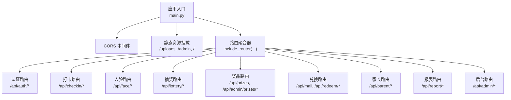
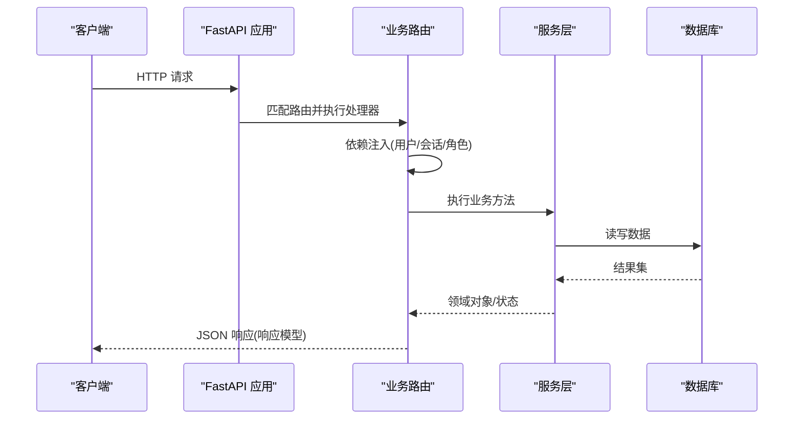
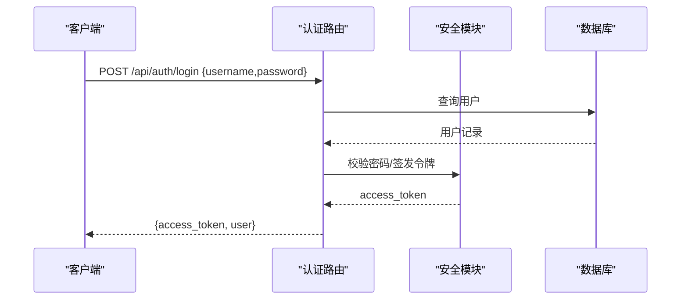
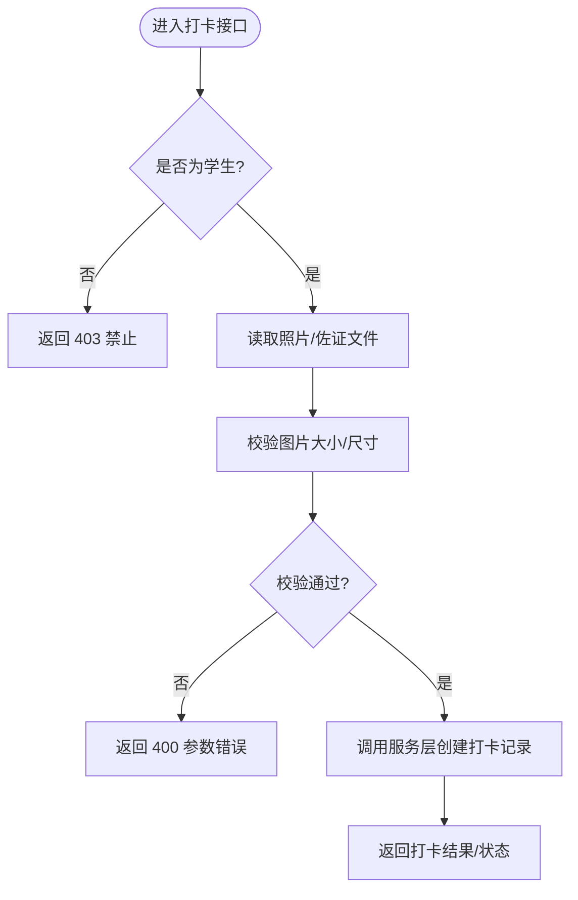
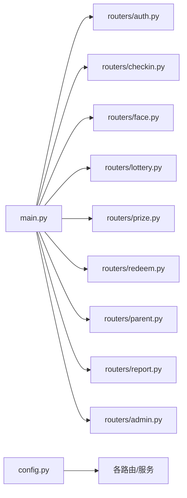

# 路由层设计

<cite>
**本文引用的文件**   
- [main.py](file://summer-homework-checkin/backend/app/main.py)
- [config.py](file://summer-homework-checkin/backend/app/config.py)
- [auth.py](file://summer-homework-checkin/backend/app/routers/auth.py)
- [checkin.py](file://summer-homework-checkin/backend/app/routers/checkin.py)
- [lottery.py](file://summer-homework-checkin/backend/app/routers/lottery.py)
- [prize.py](file://summer-homework-checkin/backend/app/routers/prize.py)
- [redeem.py](file://summer-homework-checkin/backend/app/routers/redeem.py)
- [parent.py](file://summer-homework-checkin/backend/app/routers/parent.py)
- [report.py](file://summer-homework-checkin/backend/app/routers/report.py)
- [face.py](file://summer-homework-checkin/backend/app/routers/face.py)
- [admin.py](file://summer-homework-checkin/backend/app/routers/admin.py)
</cite>

## 目录
1. [引言](#引言)
2. [项目结构](#项目结构)
3. [核心组件](#核心组件)
4. [架构总览](#架构总览)
5. [详细组件分析](#详细组件分析)
6. [依赖关系分析](#依赖关系分析)
7. [性能与可扩展性](#性能与可扩展性)
8. [故障排查指南](#故障排查指南)
9. [结论](#结论)
10. [附录：新增路由模块开发指南](#附录新增路由模块开发指南)

## 引言
本文件面向“暑假作业打卡系统”的后端路由层，系统性阐述 RESTful API 的设计原则、URL 命名规范、各业务模块的路由组织方式（用户认证、打卡管理、抽奖系统、奖品管理、兑换商城、家长端、报表、人脸采集、后台管理等），并总结请求参数验证、响应数据格式化、错误码统一管理与权限控制机制。文末提供新增路由模块的开发指南与最佳实践示例，帮助开发者快速扩展功能并保持风格一致。

## 项目结构
后端采用 FastAPI 框架，应用入口集中注册中间件、静态资源挂载与各业务路由模块；每个业务域以独立 router 文件组织，通过 prefix 划分命名空间，使用 Depends 注入当前用户与数据库会话，结合自定义依赖实现角色校验。



图示来源
- [main.py:11-30](file://summer-homework-checkin/backend/app/main.py#L11-L30)
- [main.py:33-48](file://summer-homework-checkin/backend/app/main.py#L33-L48)

章节来源
- [main.py:11-30](file://summer-homework-checkin/backend/app/main.py#L11-L30)
- [main.py:33-48](file://summer-homework-checkin/backend/app/main.py#L33-L48)

## 核心组件
- 应用装配与中间件
  - 启用 CORS 中间件，允许跨域访问。
  - 挂载静态资源：上传目录、学生端页面、管理后台页面。
  - 启动时创建数据库表结构。
- 路由聚合
  - 将各业务模块的 APIRouter 按前缀注册到主应用。
- 配置常量
  - 包含路径、密钥、打卡规则、人脸识别阈值等运行期配置项。

章节来源
- [main.py:11-48](file://summer-homework-checkin/backend/app/main.py#L11-L48)
- [config.py:1-50](file://summer-homework-checkin/backend/app/config.py#L1-L50)

## 架构总览
整体遵循“控制器（路由）—服务（业务逻辑）—模型（ORM）”分层模式。路由层负责：
- 解析请求参数与表单/文件上传
- 调用服务层完成业务处理
- 返回 Pydantic 模型或字典作为响应体
- 通过 Depends 注入当前用户与会话，并在需要时使用 require_role 进行角色校验



图示来源
- [main.py:11-30](file://summer-homework-checkin/backend/app/main.py#L11-L30)
- [auth.py:10-52](file://summer-homework-checkin/backend/app/routers/auth.py#L10-L52)
- [checkin.py:14-80](file://summer-homework-checkin/backend/app/routers/checkin.py#L14-L80)
- [prize.py:9-66](file://summer-homework-checkin/backend/app/routers/prize.py#L9-L66)
- [redeem.py:12-81](file://summer-homework-checkin/backend/app/routers/redeem.py#L12-L81)

## 详细组件分析

### 认证模块（/api/auth）
- 设计要点
  - 统一前缀 /api/auth，标签 auth。
  - 注册与登录接口返回令牌与用户信息；获取当前用户信息接口受保护。
  - 密码哈希与令牌生成在安全模块中实现，路由仅做流程编排。
- 关键接口
  - POST /api/auth/register
  - POST /api/auth/login
  - GET /api/auth/me
- 权限与安全
  - 登录成功后签发 token；后续受保护接口通过 get_current_user 依赖解析用户上下文。
- 错误处理
  - 用户名重复、角色非法、凭据错误等通过 HTTPException 返回标准错误体。



图示来源
- [auth.py:10-52](file://summer-homework-checkin/backend/app/routers/auth.py#L10-L52)

章节来源
- [auth.py:10-52](file://summer-homework-checkin/backend/app/routers/auth.py#L10-L52)

### 打卡模块（/api/checkin）
- 设计要点
  - 支持正常打卡与补卡，接受图片与佐证材料，可选位置坐标。
  - 提供今日状态、连续打卡统计、历史记录查询。
  - 通用图片上传接口供前端预览/查看器使用。
- 关键接口
  - POST /api/checkin
  - POST /api/checkin/upload
  - GET /api/checkin/today
  - GET /api/checkin/streak
  - GET /api/checkin/history
- 参数校验与业务规则
  - 仅学生可打卡；照片体积/尺寸校验；补卡次数限制等由服务层与配置项共同约束。
- 响应格式
  - 使用 CheckInOut、StreakOut 等响应模型保证字段稳定。



图示来源
- [checkin.py:14-80](file://summer-homework-checkin/backend/app/routers/checkin.py#L14-L80)

章节来源
- [checkin.py:14-80](file://summer-homework-checkin/backend/app/routers/checkin.py#L14-L80)

### 人脸采集模块（/api/face）
- 设计要点
  - 采集人脸底图用于 1:1 比对；支持查询与撤销采集。
  - 仅学生可操作；返回公开可访问的人脸标识 URL。
- 关键接口
  - POST /api/face/enroll
  - GET /api/face/status
  - DELETE /api/face/enroll

章节来源
- [face.py:11-45](file://summer-homework-checkin/backend/app/routers/face.py#L11-L45)

### 抽奖模块（/api/lottery）
- 设计要点
  - 查询抽奖券余额与历史；执行抽奖。
  - 仅学生可抽奖；结果封装为 LotteryResult。
- 关键接口
  - GET /api/lottery/tickets
  - POST /api/lottery/draw

章节来源
- [lottery.py:10-30](file://summer-homework-checkin/backend/app/routers/lottery.py#L10-L30)

### 奖品管理模块（/api/prizes, /api/admin/prizes）
- 设计要点
  - 学生端仅能查看上架奖品；管理员可全量 CRUD。
  - 概率范围、类别合法性在服务层/路由层双重校验。
- 关键接口
  - GET /api/prizes
  - GET /api/admin/prizes
  - POST /api/admin/prizes
  - PUT /api/admin/prizes/{pid}
  - DELETE /api/admin/prizes/{pid}
- 权限控制
  - 管理员接口通过 require_role("admin") 依赖强制校验。

```mermaid
classDiagram
class PrizeRouter {
+GET "/api/prizes"
+GET "/api/admin/prizes"
+POST "/api/admin/prizes"
+PUT "/api/admin/prizes/{pid}"
+DELETE "/api/admin/prizes/{pid}"
}
class RequireRole {
+require_role(role)
}
class Session {
+get_db()
}
PrizeRouter --> RequireRole : "依赖注入"
PrizeRouter --> Session : "数据库会话"
```

图示来源
- [prize.py:9-66](file://summer-homework-checkin/backend/app/routers/prize.py#L9-L66)

章节来源
- [prize.py:9-66](file://summer-homework-checkin/backend/app/routers/prize.py#L9-L66)

### 积分商城与兑换（/api/mall, /api/redeem）
- 设计要点
  - 聚合展示余额、可兑换奖品、我的兑换、抽奖记录。
  - 支持普通奖品兑换与抽奖机会兑换；支持已下单替换奖品。
  - 统一返回 RedeemResult，区分是否兑换为抽奖机会。
- 关键接口
  - GET /api/mall
  - POST /api/redeem
  - POST /api/redeem/{rid}/replace
- 权限控制
  - 仅学生与家长可兑换；家长端另有代操作接口。

章节来源
- [redeem.py:12-81](file://summer-homework-checkin/backend/app/routers/redeem.py#L12-L81)

### 家长端（/api/parent）
- 设计要点
  - 绑定孩子账号、查看孩子列表与概览、代打卡、代兑换、代抽奖、查看通知与报告。
  - 所有涉及子账户的操作均通过绑定关系校验，确保越权访问被拒绝。
- 关键接口（节选）
  - POST /api/parent/bind
  - GET /api/parent/children
  - POST /api/parent/checkin
  - GET /api/parent/mall/{child_id}
  - POST /api/parent/redeem
  - POST /api/parent/redeem/{rid}/replace
  - GET /api/parent/lottery/{child_id}
  - POST /api/parent/lottery/{child_id}/draw
  - GET /api/parent/notifications
  - PATCH /api/parent/notifications/{nid}/read
  - GET /api/parent/child-report/{child_id}
  - GET /api/parent/child-report/{child_id}/html

章节来源
- [parent.py:17-237](file://summer-homework-checkin/backend/app/routers/parent.py#L17-L237)

### 报表模块（/api/report）
- 设计要点
  - 学生可查看个人报告（JSON 与 HTML 两种形式）。
  - 默认统计窗口由配置项 SUMMER_START/SUMMER_END 决定。
- 关键接口
  - GET /api/report/me
  - GET /api/report/me/html

章节来源
- [report.py:14-36](file://summer-homework-checkin/backend/app/routers/report.py#L14-L36)

### 后台管理（/api/admin）
- 设计要点
  - 全局统计、用户列表、打卡审核、兑换审核、待审数量等。
  - 全部接口需管理员角色。
- 关键接口（节选）
  - GET /api/admin/stats
  - GET /api/admin/users
  - GET /api/admin/checkins
  - GET /api/admin/checkins/pending-count
  - PUT /api/admin/checkins/{id}/review
  - GET /api/admin/redemptions
  - GET /api/admin/redemptions/{id}
  - PUT /api/admin/redemptions/{id}/review

章节来源
- [admin.py:13-214](file://summer-homework-checkin/backend/app/routers/admin.py#L13-L214)

## 依赖关系分析
- 路由间耦合
  - 各路由模块相对独立，通过 main.py 聚合；共享依赖包括 get_current_user、require_role、get_db。
- 外部依赖
  - 配置文件 config.py 提供路径、阈值、时间窗口等常量。
  - 服务层与工具模块（存储、图像处理、人脸识别）在路由中被间接调用。
- 潜在风险
  - 若 require_role 未生效或依赖注入顺序不当，可能导致权限绕过。
  - 大文件上传与图片校验应放在路由层尽早失败，避免进入服务层造成资源浪费。



图示来源
- [main.py:11-30](file://summer-homework-checkin/backend/app/main.py#L11-L30)
- [config.py:1-50](file://summer-homework-checkin/backend/app/config.py#L1-L50)

章节来源
- [main.py:11-30](file://summer-homework-checkin/backend/app/main.py#L11-L30)
- [config.py:1-50](file://summer-homework-checkin/backend/app/config.py#L1-L50)

## 性能与可扩展性
- 路由层职责边界清晰，尽量保持轻量，复杂计算下沉至服务层。
- 图片上传与校验前置，减少无效 IO。
- 分页与限流建议：对历史列表、报表导出等接口引入分页与缓存策略。
- 并发写入：抽奖、兑换等热点写操作建议使用事务与乐观锁保障一致性。

[本节为通用指导，不直接分析具体文件]

## 故障排查指南
- 常见错误码
  - 400：参数不合法（如角色非法、概率不在 0~1、图片校验失败）。
  - 401：未认证或凭据错误。
  - 403：无权限（非目标角色或未绑定关系）。
  - 404：资源不存在（奖品、兑换记录、打卡记录等）。
- 定位步骤
  - 检查路由前缀与标签是否正确注册。
  - 确认依赖注入顺序：先解析用户，再校验角色，最后访问数据库。
  - 核对响应模型字段是否与前端期望一致。
  - 关注配置项（如 GEO_THRESHOLD_METERS、FACE_MATCH_THRESHOLD）是否与环境相符。

章节来源
- [auth.py:10-52](file://summer-homework-checkin/backend/app/routers/auth.py#L10-L52)
- [checkin.py:14-80](file://summer-homework-checkin/backend/app/routers/checkin.py#L14-L80)
- [prize.py:9-66](file://summer-homework-checkin/backend/app/routers/prize.py#L9-L66)
- [redeem.py:12-81](file://summer-homework-checkin/backend/app/routers/redeem.py#L12-L81)
- [admin.py:13-214](file://summer-homework-checkin/backend/app/routers/admin.py#L13-L214)

## 结论
本路由层以 FastAPI 为核心，采用模块化路由、统一的依赖注入与响应模型，实现了清晰的 RESTful 风格与稳定的契约。通过 require_role 与 get_current_user 的组合，形成一致的权限控制范式。配合完善的参数校验与错误码约定，便于前后端协作与问题定位。建议在后续迭代中持续完善分页、缓存与审计日志，进一步提升性能与可观测性。

[本节为总结性内容，不直接分析具体文件]

## 附录：新增路由模块开发指南
- 新建路由文件
  - 在 routers 目录下新增模块文件，定义 APIRouter(prefix="/api/<domain>", tags=["<domain>"])。
- 注册路由
  - 在主应用 main.py 中 import 新模块并通过 app.include_router(router) 注册。
- 依赖注入
  - 使用 get_current_user 获取当前用户；使用 require_role("admin"/"student"/"parent") 进行角色校验；使用 get_db 获取数据库会话。
- 参数校验与响应模型
  - 使用 Pydantic 模型描述请求体与响应体，确保字段稳定、类型明确。
- 错误处理
  - 使用 HTTPException 抛出标准错误码与消息；对业务异常在服务层捕获并转换为合适的 HTTP 状态码。
- 权限与边界
  - 对外暴露的接口必须显式校验角色与资源归属（如家长端需校验绑定关系）。
- 示例清单（参考现有模块）
  - 认证：[auth.py:10-52](file://summer-homework-checkin/backend/app/routers/auth.py#L10-L52)
  - 打卡：[checkin.py:14-80](file://summer-homework-checkin/backend/app/routers/checkin.py#L14-L80)
  - 奖品：[prize.py:9-66](file://summer-homework-checkin/backend/app/routers/prize.py#L9-L66)
  - 兑换：[redeem.py:12-81](file://summer-homework-checkin/backend/app/routers/redeem.py#L12-L81)
  - 家长：[parent.py:17-237](file://summer-homework-checkin/backend/app/routers/parent.py#L17-L237)
  - 报表：[report.py:14-36](file://summer-homework-checkin/backend/app/routers/report.py#L14-L36)
  - 后台：[admin.py:13-214](file://summer-homework-checkin/backend/app/routers/admin.py#L13-L214)
  - 人脸：[face.py:11-45](file://summer-homework-checkin/backend/app/routers/face.py#L11-L45)
  - 应用入口：[main.py:11-30](file://summer-homework-checkin/backend/app/main.py#L11-L30)