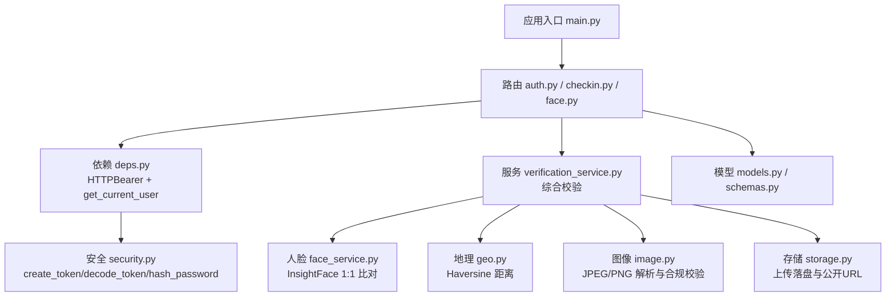
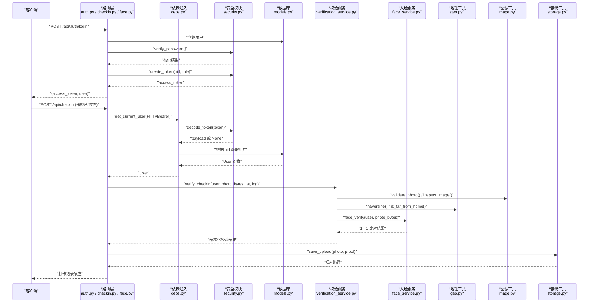
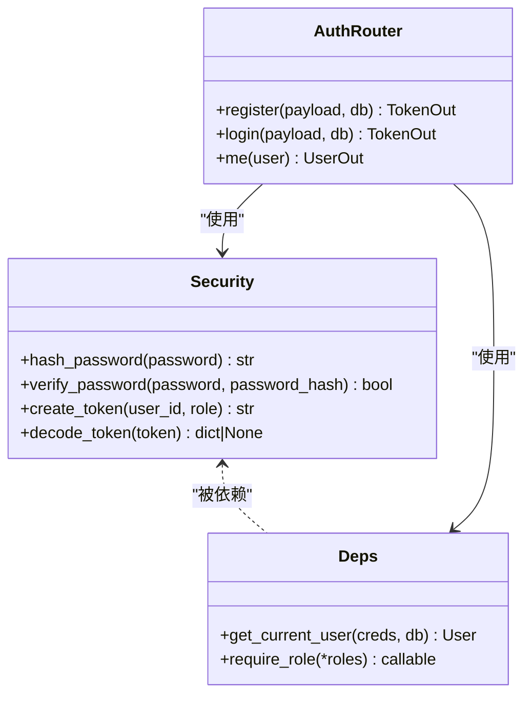
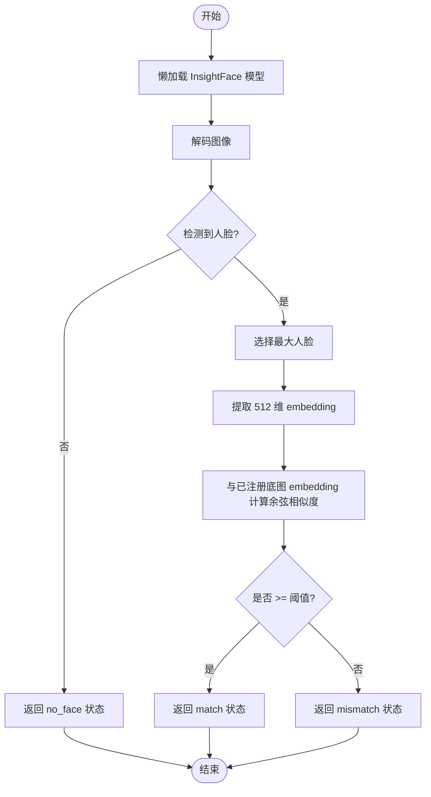
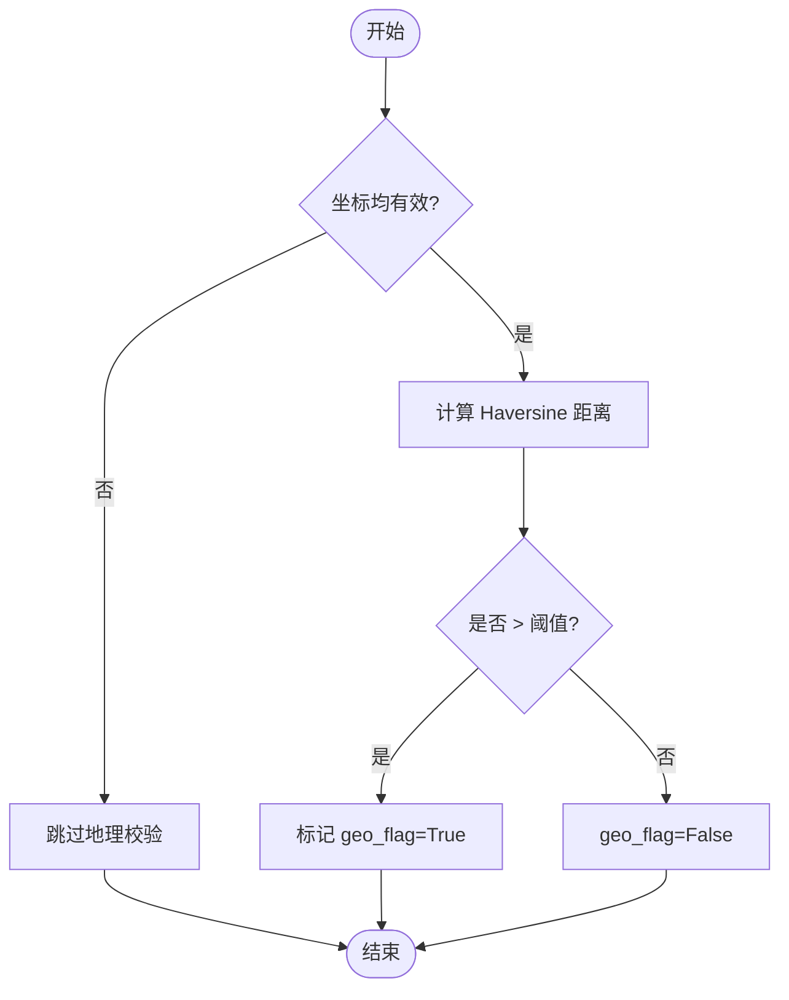
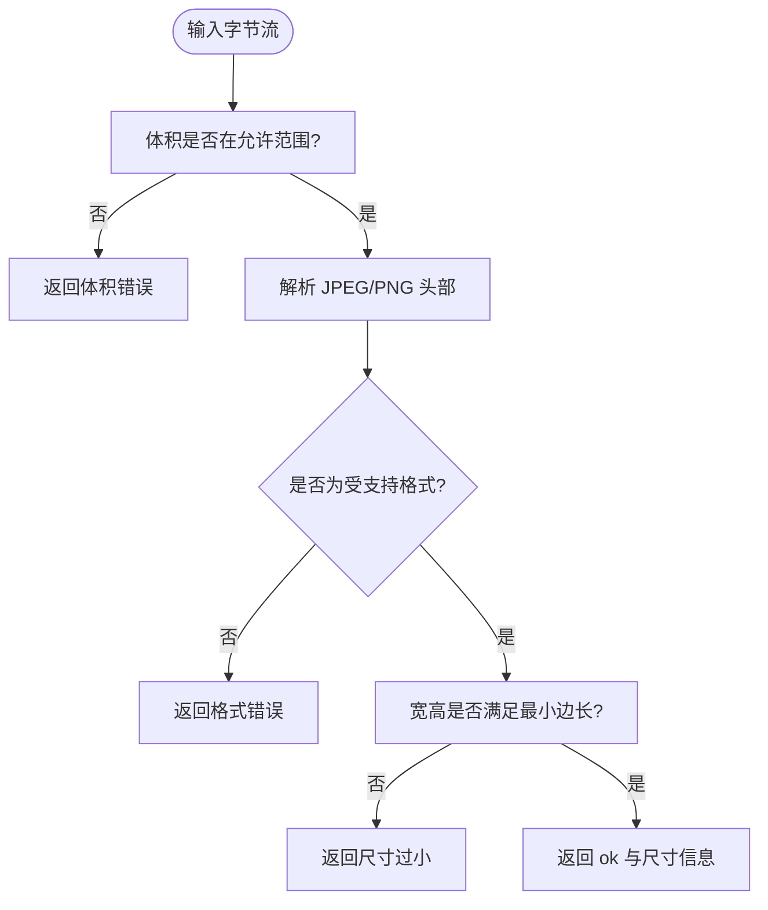
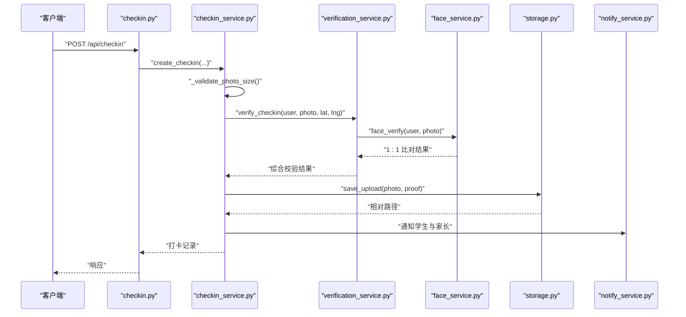
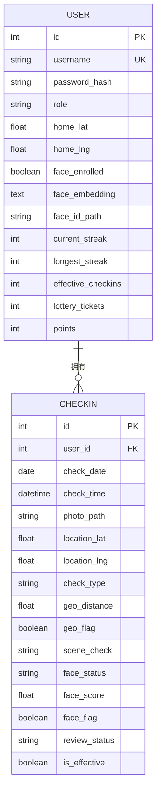
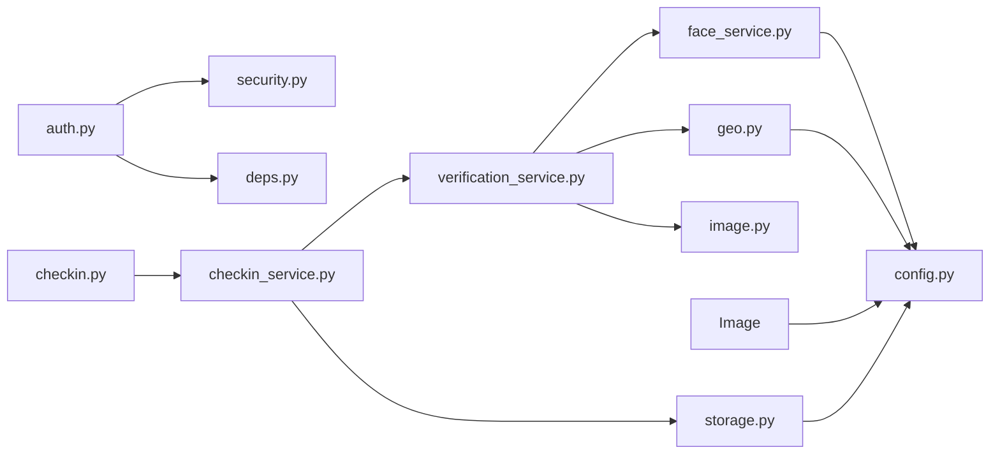

# 安全与认证机制

<cite>
**本文引用的文件**   
- [security.py](file://summer-homework-checkin/backend/app/security.py)
- [deps.py](file://summer-homework-checkin/backend/app/deps.py)
- [auth.py](file://summer-homework-checkin/backend/app/routers/auth.py)
- [config.py](file://summer-homework-checkin/backend/app/config.py)
- [face_service.py](file://summer-homework-checkin/backend/app/services/face_service.py)
- [geo.py](file://summer-homework-checkin/backend/app/utils/geo.py)
- [image.py](file://summer-homework-checkin/backend/app/utils/image.py)
- [verification_service.py](file://summer-homework-checkin/backend/app/services/verification_service.py)
- [checkin_service.py](file://summer-homework-checkin/backend/app/services/checkin_service.py)
- [checkin.py](file://summer-homework-checkin/backend/app/routers/checkin.py)
- [face.py](file://summer-homework-checkin/backend/app/routers/face.py)
- [models.py](file://summer-homework-checkin/backend/app/models.py)
- [schemas.py](file://summer-homework-checkin/backend/app/schemas.py)
- [storage.py](file://summer-homework-checkin/backend/app/utils/storage.py)
- [main.py](file://summer-homework-checkin/backend/app/main.py)
</cite>

## 目录
1. [引言](#引言)
2. [项目结构](#项目结构)
3. [核心组件](#核心组件)
4. [架构总览](#架构总览)
5. [详细组件分析](#详细组件分析)
6. [依赖关系分析](#依赖关系分析)
7. [性能考量](#性能考量)
8. [故障排查指南](#故障排查指南)
9. [结论](#结论)
10. [附录](#附录)

## 引言
本技术文档聚焦“暑假作业打卡系统”的安全与认证机制，覆盖以下关键主题：
- JWT 令牌的签发、验证与刷新策略（当前为无状态 HMAC 令牌）
- 用户会话管理与基于角色的访问控制（RBAC）
- InsightFace 人脸识别集成方案（1:1 本人比对）、特征提取与相似度算法
- 地理位置验证原理、GPS 精度控制与防作弊检测
- 图像真实性检测（体积/尺寸校验、JPEG/PNG 解析），EXIF 信息验证与 AI 辅助识别的扩展建议
- 安全配置最佳实践、常见攻击防护与审计日志记录机制

## 项目结构
后端采用 FastAPI 分层架构：路由层负责请求接入与参数校验；服务层封装业务规则；工具层提供通用能力（地理计算、图片解析、存储）。安全相关代码分布在 security、deps、routers、services、utils 等模块中。

图示来源
- [main.py:1-49](file://summer-homework-checkin/backend/app/main.py#L1-L49)
- [auth.py:1-52](file://summer-homework-checkin/backend/app/routers/auth.py#L1-L52)
- [checkin.py:1-80](file://summer-homework-checkin/backend/app/routers/checkin.py#L1-L80)
- [face.py:1-45](file://summer-homework-checkin/backend/app/routers/face.py#L1-L45)
- [deps.py:1-34](file://summer-homework-checkin/backend/app/deps.py#L1-L34)
- [security.py:1-47](file://summer-homework-checkin/backend/app/security.py#L1-L47)
- [verification_service.py:1-71](file://summer-homework-checkin/backend/app/services/verification_service.py#L1-L71)
- [face_service.py:1-133](file://summer-homework-checkin/backend/app/services/face_service.py#L1-L133)
- [geo.py:1-24](file://summer-homework-checkin/backend/app/utils/geo.py#L1-L24)
- [image.py:1-61](file://summer-homework-checkin/backend/app/utils/image.py#L1-L61)
- [storage.py:1-24](file://summer-homework-checkin/backend/app/utils/storage.py#L1-L24)
- [models.py:1-212](file://summer-homework-checkin/backend/app/models.py#L1-L212)
- [schemas.py:1-322](file://summer-homework-checkin/backend/app/schemas.py#L1-322)

章节来源
- [main.py:1-49](file://summer-homework-checkin/backend/app/main.py#L1-L49)
- [config.py:1-50](file://summer-homework-checkin/backend/app/config.py#L1-L50)

## 核心组件
- 认证与安全
  - 密码哈希与校验：使用 PBKDF2-SHA256 固定盐（演示用途）进行单向哈希与恒定时间比较。
  - 令牌签发与解码：自定义 HMAC-SHA256 签名令牌，载荷包含用户标识、角色与过期时间；解码时校验签名与过期。
  - 依赖注入：通过 HTTPBearer 自动从请求头提取令牌并解析，结合数据库查询用户实体，实现统一鉴权入口。
  - 角色权限：提供 require_role 装饰器，按角色限制资源访问。
- 人脸识别
  - 基于 InsightFace 预训练模型（buffalo_l）进行人脸检测与 512 维特征提取。
  - 1:1 比对：将现场照与已采集底图 embedding 做余弦相似度计算，超过阈值判定为本人。
  - 降级策略：模型不可用时返回明确提示，配合打卡流程的 enforce/soft 模式避免静默放行。
- 地理位置验证
  - 使用 Haversine 公式计算两点球面距离，与配置的阈值比较标记风险。
- 图像真实性检测
  - 轻量 JPEG/PNG 头部解析，校验体积与最小边长，过滤占位图与缩略图。
- 存储与静态资源
  - 上传文件按用户分目录保存，生成相对路径与可访问 URL。

章节来源
- [security.py:1-47](file://summer-homework-checkin/backend/app/security.py#L1-L47)
- [deps.py:1-34](file://summer-homework-checkin/backend/app/deps.py#L1-L34)
- [auth.py:1-52](file://summer-homework-checkin/backend/app/routers/auth.py#L1-L52)
- [face_service.py:1-133](file://summer-homework-checkin/backend/app/services/face_service.py#L1-L133)
- [geo.py:1-24](file://summer-homework-checkin/backend/app/utils/geo.py#L1-L24)
- [image.py:1-61](file://summer-homework-checkin/backend/app/utils/image.py#L1-L61)
- [storage.py:1-24](file://summer-homework-checkin/backend/app/utils/storage.py#L1-L24)

## 架构总览
下图展示认证、授权与打卡校验的整体调用链，涵盖令牌处理、人脸比对、地理校验与图片合规检查。

图示来源
- [auth.py:1-52](file://summer-homework-checkin/backend/app/routers/auth.py#L1-L52)
- [checkin.py:1-80](file://summer-homework-checkin/backend/app/routers/checkin.py#L1-L80)
- [deps.py:1-34](file://summer-homework-checkin/backend/app/deps.py#L1-L34)
- [security.py:1-47](file://summer-homework-checkin/backend/app/security.py#L1-L47)
- [verification_service.py:1-71](file://summer-homework-checkin/backend/app/services/verification_service.py#L1-L71)
- [face_service.py:1-133](file://summer-homework-checkin/backend/app/services/face_service.py#L1-L133)
- [geo.py:1-24](file://summer-homework-checkin/backend/app/utils/geo.py#L1-L24)
- [image.py:1-61](file://summer-homework-checkin/backend/app/utils/image.py#L1-L61)
- [storage.py:1-24](file://summer-homework-checkin/backend/app/utils/storage.py#L1-L24)
- [models.py:1-212](file://summer-homework-checkin/backend/app/models.py#L1-L212)

## 详细组件分析

### 认证与授权（JWT/HMAC 令牌、会话管理、RBAC）
- 令牌签发
  - 载荷包含用户标识、角色与过期时间；主体部分经 Base64 编码后以 HMAC-SHA256 签名，形成 body.sig 格式令牌。
  - 过期时间由配置项控制，默认 30 天。
- 令牌验证
  - 依赖注入层从请求头提取 Bearer Token，解码并校验签名与过期；随后根据 uid 查询用户实体，确保用户存在。
- 角色权限
  - 提供 require_role 装饰器，用于限制特定角色访问接口（如仅学生可打卡、仅管理员可审核）。
- 密码安全
  - 使用 PBKDF2-SHA256 固定盐（演示用）进行哈希，对比时使用恒定时间函数防止时序攻击。

图示来源
- [security.py:1-47](file://summer-homework-checkin/backend/app/security.py#L1-L47)
- [deps.py:1-34](file://summer-homework-checkin/backend/app/deps.py#L1-L34)
- [auth.py:1-52](file://summer-homework-checkin/backend/app/routers/auth.py#L1-L52)

章节来源
- [security.py:1-47](file://summer-homework-checkin/backend/app/security.py#L1-L47)
- [deps.py:1-34](file://summer-homework-checkin/backend/app/deps.py#L1-L34)
- [auth.py:1-52](file://summer-homework-checkin/backend/app/routers/auth.py#L1-L52)
- [config.py:1-50](file://summer-homework-checkin/backend/app/config.py#L1-L50)

### 人脸识别（InsightFace 1:1 比对）
- 模型加载
  - 懒加载 FaceAnalysis（buffalo_l），首次调用按需下载模型到本地缓存；强制 CPU 运行，便于部署。
- 特征提取
  - 对输入图像解码后进行人脸检测，选择最大人脸，输出 512 维 embedding。
- 1:1 比对
  - 将现场照 embedding 与用户已注册底图 embedding 计算余弦相似度，超过阈值即通过。
- 降级与策略
  - 模型不可用时返回明确状态；打卡流程在 enforce 模式下拒绝不通过的人脸，soft 模式下仅标记高风险但仍记录。

图示来源
- [face_service.py:1-133](file://summer-homework-checkin/backend/app/services/face_service.py#L1-L133)
- [config.py:1-50](file://summer-homework-checkin/backend/app/config.py#L1-L50)

章节来源
- [face_service.py:1-133](file://summer-homework-checkin/backend/app/services/face_service.py#L1-L133)
- [face.py:1-45](file://summer-homework-checkin/backend/app/routers/face.py#L1-L45)
- [config.py:1-50](file://summer-homework-checkin/backend/app/config.py#L1-L50)

### 地理位置验证与防作弊检测
- 距离计算
  - 使用 Haversine 公式计算用户常用位置与提交位置的球面距离（米）。
- 阈值判定
  - 若距离超过配置阈值则标记代打卡风险（geo_flag=True）。
- 综合风险
  - 校验服务将图片合规、地理风险与人脸状态聚合，给出 scene_check 与 risk 等级，供后续审核策略参考。

图示来源
- [geo.py:1-24](file://summer-homework-checkin/backend/app/utils/geo.py#L1-L24)
- [verification_service.py:1-71](file://summer-homework-checkin/backend/app/services/verification_service.py#L1-L71)
- [config.py:1-50](file://summer-homework-checkin/backend/app/config.py#L1-L50)

章节来源
- [geo.py:1-24](file://summer-homework-checkin/backend/app/utils/geo.py#L1-L24)
- [verification_service.py:1-71](file://summer-homework-checkin/backend/app/services/verification_service.py#L1-L71)
- [config.py:1-50](file://summer-homework-checkin/backend/app/config.py#L1-L50)

### 图像真实性检测与合规校验
- 体积与尺寸门槛
  - 校验照片大小范围与最小边长，过滤占位图与缩略图。
- 格式解析
  - 轻量解析 JPEG/PNG 头部，无需第三方库即可获取宽高与格式。
- 场景合规
  - 在校验服务中作为前置条件，失败则标记 warn 与 high 风险。

图示来源
- [image.py:1-61](file://summer-homework-checkin/backend/app/utils/image.py#L1-L61)
- [config.py:1-50](file://summer-homework-checkin/backend/app/config.py#L1-L50)

章节来源
- [image.py:1-61](file://summer-homework-checkin/backend/app/utils/image.py#L1-L61)
- [config.py:1-50](file://summer-homework-checkin/backend/app/config.py#L1-L50)

### 打卡流程中的安全策略集成
- 正常打卡与补卡规则
  - 正常打卡允许多次提交但需逐次审核；补卡需指定目标日期、凭证，且受月度上限约束。
- 人脸策略
  - 已采集底图且人脸不通过时，enforce 模式直接拒绝；soft 模式仅标记高风险。
- 通知与审计
  - 提交后通知学生与家长；审核通过后发放积分并重算连续天数与抽奖资格。

图示来源
- [checkin.py:1-80](file://summer-homework-checkin/backend/app/routers/checkin.py#L1-L80)
- [checkin_service.py:1-254](file://summer-homework-checkin/backend/app/services/checkin_service.py#L1-L254)
- [verification_service.py:1-71](file://summer-homework-checkin/backend/app/services/verification_service.py#L1-L71)
- [face_service.py:1-133](file://summer-homework-checkin/backend/app/services/face_service.py#L1-L133)
- [storage.py:1-24](file://summer-homework-checkin/backend/app/utils/storage.py#L1-L24)

章节来源
- [checkin_service.py:1-254](file://summer-homework-checkin/backend/app/services/checkin_service.py#L1-L254)
- [checkin.py:1-80](file://summer-homework-checkin/backend/app/routers/checkin.py#L1-L80)
- [verification_service.py:1-71](file://summer-homework-checkin/backend/app/services/verification_service.py#L1-L71)
- [face_service.py:1-133](file://summer-homework-checkin/backend/app/services/face_service.py#L1-L133)
- [storage.py:1-24](file://summer-homework-checkin/backend/app/utils/storage.py#L1-L24)

### 数据模型与字段说明（安全相关）
- 用户表
  - 包含角色、常用位置坐标、人脸采集状态与 embedding、连续打卡统计等字段。
- 打卡记录表
  - 包含地理位置、场景校验、人脸状态与分数、审核状态、有效性等字段，支撑风控与审计。

图示来源
- [models.py:1-212](file://summer-homework-checkin/backend/app/models.py#L1-L212)

章节来源
- [models.py:1-212](file://summer-homework-checkin/backend/app/models.py#L1-L212)

## 依赖关系分析
- 模块耦合
  - 路由层依赖依赖注入与安全模块；校验服务组合人脸、地理与图像工具；存储工具被多处复用。
- 外部依赖
  - InsightFace 模型按需下载；OpenCV 用于图像解码；SQLite 作为轻量数据库。
- 潜在循环依赖
  - 当前未发现明显循环导入；模型与路由通过依赖注入解耦。

图示来源
- [auth.py:1-52](file://summer-homework-checkin/backend/app/routers/auth.py#L1-L52)
- [checkin.py:1-80](file://summer-homework-checkin/backend/app/routers/checkin.py#L1-L80)
- [checkin_service.py:1-254](file://summer-homework-checkin/backend/app/services/checkin_service.py#L1-L254)
- [verification_service.py:1-71](file://summer-homework-checkin/backend/app/services/verification_service.py#L1-L71)
- [face_service.py:1-133](file://summer-homework-checkin/backend/app/services/face_service.py#L1-L133)
- [geo.py:1-24](file://summer-homework-checkin/backend/app/utils/geo.py#L1-L24)
- [image.py:1-61](file://summer-homework-checkin/backend/app/utils/image.py#L1-L61)
- [storage.py:1-24](file://summer-homework-checkin/backend/app/utils/storage.py#L1-L24)
- [config.py:1-50](file://summer-homework-checkin/backend/app/config.py#L1-L50)

章节来源
- [main.py:1-49](file://summer-homework-checkin/backend/app/main.py#L1-L49)
- [config.py:1-50](file://summer-homework-checkin/backend/app/config.py#L1-L50)

## 性能考量
- 人脸模型懒加载与线程锁保护，避免重复初始化与并发竞争。
- 人脸检测输入尺寸可调，平衡速度与漏检率。
- 图片解析轻量实现，减少第三方库开销。
- 建议在生产环境启用连接池、异步 I/O 与缓存（如 Redis）以提升吞吐。

[本节为通用指导，不直接分析具体文件]

## 故障排查指南
- 令牌无效或过期
  - 检查 decode_token 的签名与过期逻辑；确认 SECRET 配置一致。
- 人脸识别不可用
  - 查看 is_available 与健康检查；确认模型下载路径与依赖安装。
- 图片上传失败
  - 校验体积与格式；确认存储目录权限与 public_url 映射。
- 地理位置异常
  - 检查 home_lat/lng 与提交坐标的有效性；确认 GEO_THRESHOLD_METERS 配置。

章节来源
- [security.py:1-47](file://summer-homework-checkin/backend/app/security.py#L1-L47)
- [face_service.py:1-133](file://summer-homework-checkin/backend/app/services/face_service.py#L1-L133)
- [storage.py:1-24](file://summer-homework-checkin/backend/app/utils/storage.py#L1-L24)
- [geo.py:1-24](file://summer-homework-checkin/backend/app/utils/geo.py#L1-L24)
- [config.py:1-50](file://summer-homework-checkin/backend/app/config.py#L1-L50)

## 结论
本系统通过无状态 HMAC 令牌、基于角色的访问控制、InsightFace 1:1 人脸比对、地理位置一致性校验与图像合规检查，构建了较为完整的安全与防作弊体系。生产环境应强化密钥管理、引入更严格的图像真实性检测（含 EXIF 与 AI 辅助）、完善审计日志与监控告警，并持续优化人脸模型与阈值策略。

[本节为总结性内容，不直接分析具体文件]

## 附录

### 安全配置最佳实践
- 密钥与环境变量
  - 使用环境变量注入 SECRET，禁止硬编码；定期轮换。
- 令牌策略
  - 当前为无状态令牌，未实现服务端黑名单；如需短期会话，可引入短 TTL 与刷新令牌机制。
- 人脸策略
  - enforce 模式适合强管控场景；soft 模式适合容错优先。
- 地理阈值
  - 根据学校分布与通勤情况调整 GEO_THRESHOLD_METERS。
- 图片合规
  - 提高最小边长与体积门槛，降低伪造风险。

章节来源
- [config.py:1-50](file://summer-homework-checkin/backend/app/config.py#L1-L50)
- [security.py:1-47](file://summer-homework-checkin/backend/app/security.py#L1-L47)
- [deps.py:1-34](file://summer-homework-checkin/backend/app/deps.py#L1-L34)

### 常见攻击防护方案
- 重放攻击
  - 建议在令牌中加入随机 nonce 或请求指纹，服务端维护短期去重表。
- 越权访问
  - 严格使用 require_role 装饰器；对敏感操作增加二次确认与审计。
- 图片伪造
  - 引入 EXIF 元数据校验（拍摄时间、设备信息）、AI 辅助识别（合成/篡改检测）。
- 地理位置欺骗
  - 结合基站/Wi-Fi 定位、IP 地理信息与行为分析进行交叉验证。

[本节为通用指导，不直接分析具体文件]

### 审计日志记录机制（建议）
- 登录与令牌事件
  - 记录登录成功/失败、令牌签发与校验结果。
- 人脸比对事件
  - 记录比对状态、分数与模型可用性。
- 打卡与审核事件
  - 记录提交、审核通过/拒绝、积分变动与连续天数变化。
- 存储与访问事件
  - 记录上传、删除与公开链接访问。

[本节为通用指导，不直接分析具体文件]