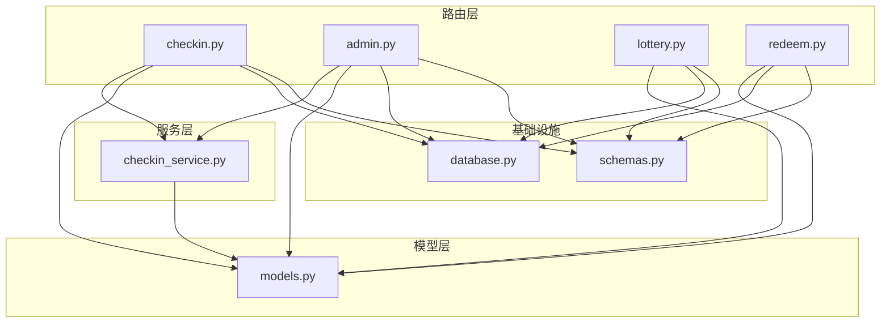
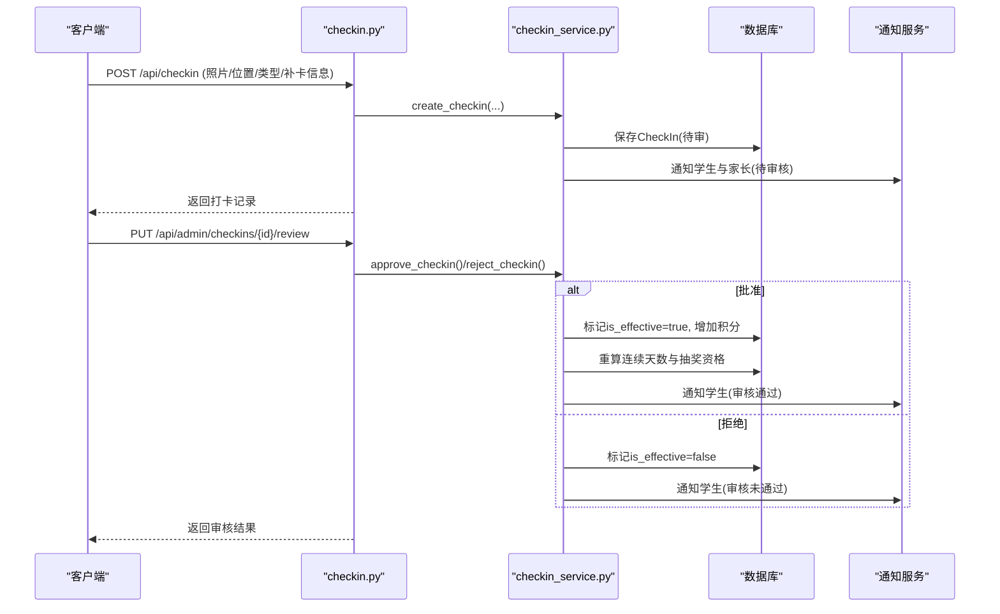
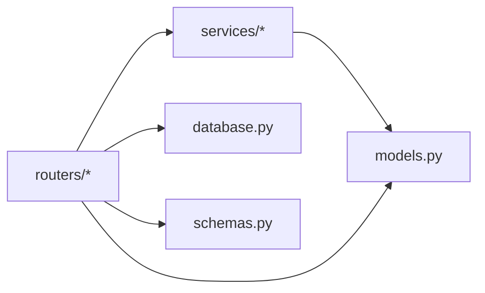
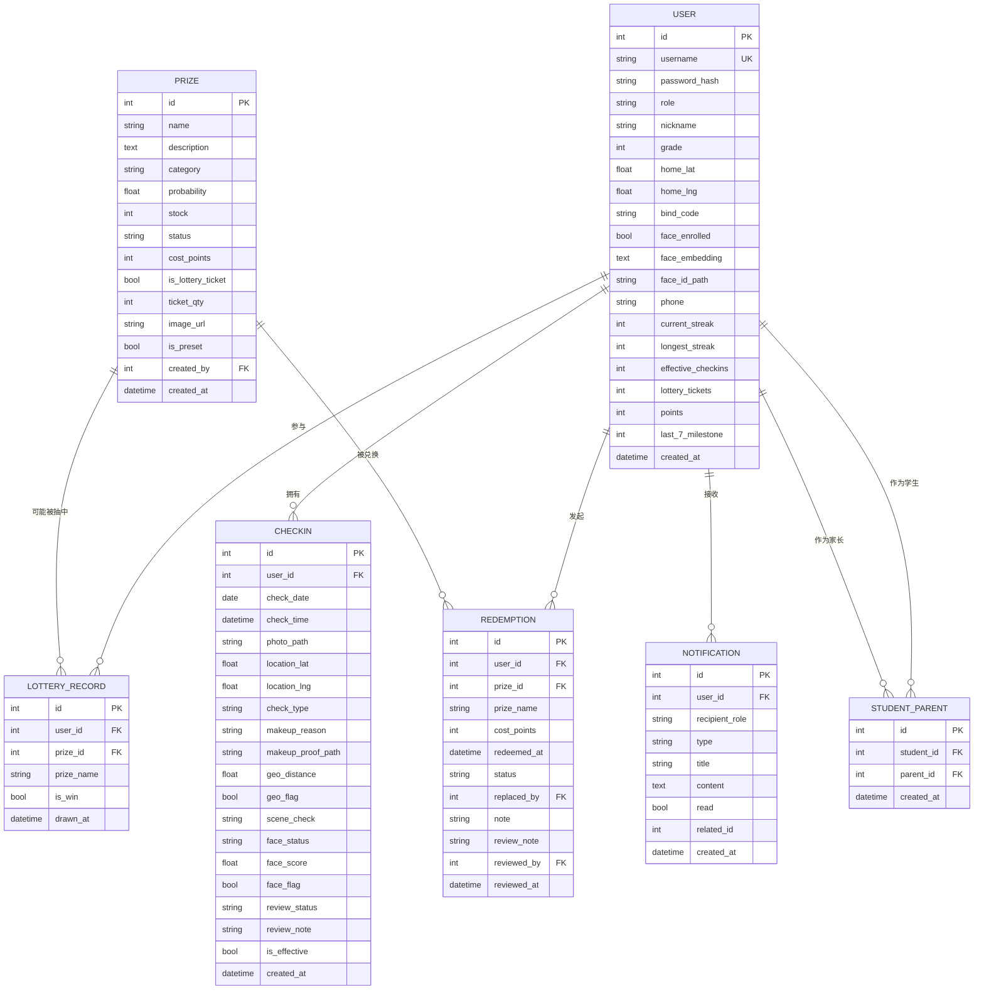

# 数据模型设计

<cite>
**本文引用的文件**   
- [models.py](file://summer-homework-checkin/backend/app/models.py)
- [database.py](file://summer-homework-checkin/backend/app/database.py)
- [schemas.py](file://summer-homework-checkin/backend/app/schemas.py)
- [checkin_service.py](file://summer-homework-checkin/backend/app/services/checkin_service.py)
- [admin.py](file://summer-homework-checkin/backend/app/routers/admin.py)
- [checkin.py](file://summer-homework-checkin/backend/app/routers/checkin.py)
- [lottery.py](file://summer-homework-checkin/backend/app/routers/lottery.py)
- [redeem.py](file://summer-homework-checkin/backend/app/routers/redeem.py)
</cite>

## 目录
1. [引言](#引言)
2. [项目结构](#项目结构)
3. [核心组件](#核心组件)
4. [架构总览](#架构总览)
5. [详细组件分析](#详细组件分析)
6. [依赖关系分析](#依赖关系分析)
7. [性能与索引优化](#性能与索引优化)
8. [并发控制与一致性](#并发控制与一致性)
9. [报表与聚合计算](#报表与聚合计算)
10. [备份与恢复策略](#备份与恢复策略)
11. [故障排查指南](#故障排查指南)
12. [结论](#结论)
13. [附录：ER 图与建表语句](#附录er-图与建表语句)

## 引言
本设计文档聚焦“暑假作业打卡系统”的数据模型，围绕 SQLAlchemy ORM 模型的层次结构、实体关系映射与约束定义展开。重点说明：
- 用户表的多角色支持（学生/家长/管理员）
- 打卡记录的完整生命周期管理（提交、审核、有效化、积分发放、连续天数重算）
- 积分账户的流水对账机制（参考同仓库积分子系统的设计思想）
- 奖品库存的并发控制策略
- 抽奖记录的追溯查询与报表数据的聚合计算
- 数据库索引优化方案、查询性能调优与备份恢复策略
- ER 关系图与 SQL 建表语句，帮助开发者理解数据结构设计与数据流转过程

## 项目结构
本项目采用 FastAPI + SQLAlchemy 的分层架构：
- 路由层（routers）：暴露 HTTP API，负责参数校验与调用服务层
- 服务层（services）：封装业务规则与事务边界
- 模型层（models）：SQLAlchemy ORM 实体定义与关系映射
- 配置与数据库（config、database）：引擎与会话管理
- 请求/响应模式（schemas）：Pydantic 数据校验与序列化



图表来源
- [checkin.py:1-79](file://summer-homework-checkin/backend/app/routers/checkin.py#L1-L79)
- [admin.py:1-214](file://summer-homework-checkin/backend/app/routers/admin.py#L1-L214)
- [lottery.py:1-30](file://summer-homework-checkin/backend/app/routers/lottery.py#L1-L30)
- [redeem.py:1-81](file://summer-homework-checkin/backend/app/routers/redeem.py#L1-L81)
- [checkin_service.py:1-254](file://summer-homework-checkin/backend/app/services/checkin_service.py#L1-L254)
- [models.py:1-212](file://summer-homework-checkin/backend/app/models.py#L1-L212)
- [database.py:1-22](file://summer-homework-checkin/backend/app/database.py#L1-L22)
- [schemas.py:1-322](file://summer-homework-checkin/backend/app/schemas.py#L1-L322)

章节来源
- [checkin.py:1-79](file://summer-homework-checkin/backend/app/routers/checkin.py#L1-L79)
- [admin.py:1-214](file://summer-homework-checkin/backend/app/routers/admin.py#L1-L214)
- [lottery.py:1-30](file://summer-homework-checkin/backend/app/routers/lottery.py#L1-L30)
- [redeem.py:1-81](file://summer-homework-checkin/backend/app/routers/redeem.py#L1-L81)
- [checkin_service.py:1-254](file://summer-homework-checkin/backend/app/services/checkin_service.py#L1-L254)
- [models.py:1-212](file://summer-homework-checkin/backend/app/models.py#L1-L212)
- [database.py:1-22](file://summer-homework-checkin/backend/app/database.py#L1-L22)
- [schemas.py:1-322](file://summer-homework-checkin/backend/app/schemas.py#L1-L322)

## 核心组件
- 用户与角色
  - 统一用户表通过 role 字段区分 student/parent/admin，并提供学生与家长专属字段及统计冗余字段（连续天数、有效打卡次数、抽奖券、积分等）。
- 家长-孩子绑定
  - 多对多关系通过中间表实现，便于家长查看与管理孩子的打卡状态。
- 打卡记录
  - 支持正常打卡与补卡，包含人脸与地理围栏校验结果、审核流程与有效性标记。
- 奖品与兑换
  - 奖品支持普通实物与“抽奖机会”两类；兑换记录支持替换与审核闭环。
- 抽奖记录
  - 记录每次抽奖行为，用于追溯与报表。
- 通知
  - 站内通知面向学生与家长，类型覆盖打卡、抽奖、系统、兑换等事件。
- 闯关任务（扩展）
  - 提供任务定义与打卡记录，便于后续学习激励扩展。

章节来源
- [models.py:11-212](file://summer-homework-checkin/backend/app/models.py#L11-L212)
- [schemas.py:21-38](file://summer-homework-checkin/backend/app/schemas.py#L21-L38)

## 架构总览
从数据视角看，系统围绕“用户—打卡—奖品—兑换—抽奖—通知”的主链路组织数据，并通过服务层保证业务一致性与可观测性。

```mermaid
classDiagram
class User {
+int id
+string username
+string role
+string nickname
+int grade
+float home_lat
+float home_lng
+string bind_code
+bool face_enrolled
+text face_embedding
+string face_id_path
+string phone
+int current_streak
+int longest_streak
+int effective_checkins
+int lottery_tickets
+int points
+int last_7_milestone
+datetime created_at
}
class StudentParent {
+int id
+int student_id
+int parent_id
+datetime created_at
}
class CheckIn {
+int id
+int user_id
+date check_date
+datetime check_time
+string photo_path
+float location_lat
+float location_lng
+string check_type
+string makeup_reason
+string makeup_proof_path
+float geo_distance
+bool geo_flag
+string scene_check
+string face_status
+float face_score
+bool face_flag
+string review_status
+string review_note
+bool is_effective
+datetime created_at
}
class Prize {
+int id
+string name
+text description
+string category
+float probability
+int stock
+string status
+int cost_points
+bool is_lottery_ticket
+int ticket_qty
+string image_url
+bool is_preset
+int created_by
+datetime created_at
}
class LotteryRecord {
+int id
+int user_id
+int prize_id
+string prize_name
+bool is_win
+datetime drawn_at
}
class Redemption {
+int id
+int user_id
+int prize_id
+string prize_name
+int cost_points
+datetime redeemed_at
+string status
+int replaced_by
+string note
+string review_note
+int reviewed_by
+datetime reviewed_at
}
class Notification {
+int id
+int user_id
+string recipient_role
+string type
+string title
+text content
+bool read
+int related_id
+datetime created_at
}
User ||--o{ CheckIn : "拥有多条打卡"
User ||--o{ LotteryRecord : "参与多次抽奖"
User ||--o{ Redemption : "发起多次兑换"
User ||--o{ Notification : "接收多条通知"
User ||--o{ StudentParent : "作为学生被绑定"
User ||--o{ StudentParent : "作为家长进行绑定"
Prize ||--o{ LotteryRecord : "可能被抽中"
Prize ||--o{ Redemption : "被兑换"
```

图表来源
- [models.py:11-212](file://summer-homework-checkin/backend/app/models.py#L11-L212)

## 详细组件分析

### 用户与角色（多角色支持）
- 设计要点
  - 单表多角色：role 字段限定为 student/parent/admin，配合路由层权限校验实现访问控制。
  - 学生与家长专属字段：如年级、家庭坐标、绑定码、手机号等。
  - 统计冗余字段：current_streak、longest_streak、effective_checkins、lottery_tickets、points、last_7_milestone，由打卡服务在审核通过后维护，避免频繁聚合计算。
- 关键关系
  - 与打卡、抽奖、兑换、通知均存在一对多关系。
  - 通过中间表实现家长-孩子多对多绑定。

章节来源
- [models.py:11-55](file://summer-homework-checkin/backend/app/models.py#L11-L55)
- [admin.py:38-50](file://summer-homework-checkin/backend/app/routers/admin.py#L38-L50)

### 打卡记录的生命周期
- 生命周期阶段
  - 提交：上传照片与可选凭证，执行人脸与地理围栏校验，写入待审记录。
  - 审核：管理员批准或拒绝；批准后标记有效并增加积分，触发连续天数重算与抽奖资格发放。
  - 补卡：限制目标日期范围与月度上限，需上传凭证，且不可重复补已有效的日期。
- 关键逻辑
  - 连续天数与里程碑：按有效打卡日期序列计算当前连续与历史最长连续，每满 7 天发放一次抽奖资格。
  - 通知：提交与审核结果均推送站内通知，必要时提醒家长关注地理位置风险。



图表来源
- [checkin.py:17-37](file://summer-homework-checkin/backend/app/routers/checkin.py#L17-L37)
- [checkin_service.py:64-163](file://summer-homework-checkin/backend/app/services/checkin_service.py#L64-L163)
- [checkin_service.py:166-209](file://summer-homework-checkin/backend/app/services/checkin_service.py#L166-L209)
- [admin.py:84-103](file://summer-homework-checkin/backend/app/routers/admin.py#L84-L103)

章节来源
- [checkin_service.py:12-61](file://summer-homework-checkin/backend/app/services/checkin_service.py#L12-L61)
- [checkin_service.py:64-163](file://summer-homework-checkin/backend/app/services/checkin_service.py#L64-L163)
- [checkin_service.py:166-209](file://summer-homework-checkin/backend/app/services/checkin_service.py#L166-L209)
- [checkin.py:56-79](file://summer-homework-checkin/backend/app/routers/checkin.py#L56-L79)
- [admin.py:84-103](file://summer-homework-checkin/backend/app/routers/admin.py#L84-L103)

### 积分账户与流水对账（参考积分子系统）
- 设计思想
  - 账户余额与流水分离：余额用于展示与快速判断，流水用于审计与对账。
  - 所有读改写操作在同一事务内完成，异常回滚，确保余额与库存一致性。
- 与本系统的结合点
  - 本系统使用用户表的 points 字段作为余额；若需要严格对账，可引入 PointLedger 表记录每一笔收入/支出，并在审核通过时追加一条 earn 流水。
  - 兑换扣减与退还同样应产生 spend 或 refund 流水，形成闭环。

章节来源
- [models.py:11-42](file://summer-homework-checkin/backend/app/models.py#L11-L42)
- [checkin_service.py:166-191](file://summer-homework-checkin/backend/app/services/checkin_service.py#L166-L191)

### 奖品库存与并发控制
- 库存语义
  - stock=-1 表示不限量；stock>=0 表示有限库存。
  - is_lottery_ticket=True 的奖品为“抽奖机会”，兑换后直接增加用户抽奖券数量，不创建兑换记录且不扣库存。
- 并发控制建议
  - 使用数据库行级锁或唯一约束防止超卖：在扣减库存前加 SELECT FOR UPDATE，或在应用层先查后写并结合唯一约束兜底。
  - 将库存扣减与兑换记录写入同一事务，失败则整体回滚。

章节来源
- [models.py:103-124](file://summer-homework-checkin/backend/app/models.py#L103-L124)
- [redeem.py:48-69](file://summer-homework-checkin/backend/app/routers/redeem.py#L48-L69)

### 抽奖记录与追溯查询
- 抽奖行为记录
  - 每条记录包含用户、奖品、是否中奖与时间戳，支持按用户倒序查询。
- 追溯与报表
  - 结合用户抽奖券余额与历史记录，可在前端展示“我的抽奖”明细。
  - 后台可按时间段统计中奖分布与奖品热度。

章节来源
- [models.py:126-139](file://summer-homework-checkin/backend/app/models.py#L126-L139)
- [lottery.py:13-29](file://summer-homework-checkin/backend/app/routers/lottery.py#L13-L29)

### 兑换记录与替换机制
- 状态机
  - pending → fulfilled（兑现）或 rejected（拒绝，退还积分），replaced（被替换）。
- 替换流程
  - 支持“直接选择替换”：原记录 replaced_by 指向新记录，便于追踪变更历史。
- 审核闭环
  - 管理员审核通过后标记 fulfilled；拒绝时退还积分并记录操作人、时间与备注。

章节来源
- [models.py:141-161](file://summer-homework-checkin/backend/app/models.py#L141-L161)
- [admin.py:165-213](file://summer-homework-checkin/backend/app/routers/admin.py#L165-L213)
- [redeem.py:72-81](file://summer-homework-checkin/backend/app/routers/redeem.py#L72-L81)

### 通知与家校联动
- 通知类型
  - 打卡、抽奖、系统、兑换等事件均可生成通知，支持已读标记与关联业务 ID。
- 家长联动
  - 家长通过绑定关系接收孩子相关通知，提升监督与参与度。

章节来源
- [models.py:163-176](file://summer-homework-checkin/backend/app/models.py#L163-L176)
- [checkin_service.py:148-161](file://summer-homework-checkin/backend/app/services/checkin_service.py#L148-L161)

## 依赖关系分析
- 模块耦合
  - 路由层依赖服务层与模型层；服务层集中处理业务规则与事务；模型层仅承载数据与关系。
- 外部依赖
  - 图片存储与人脸识别服务在打卡流程中被调用，但数据模型层面以路径与状态字段抽象。



图表来源
- [checkin.py:1-79](file://summer-homework-checkin/backend/app/routers/checkin.py#L1-L79)
- [admin.py:1-214](file://summer-homework-checkin/backend/app/routers/admin.py#L1-L214)
- [lottery.py:1-30](file://summer-homework-checkin/backend/app/routers/lottery.py#L1-L30)
- [redeem.py:1-81](file://summer-homework-checkin/backend/app/routers/redeem.py#L1-L81)
- [checkin_service.py:1-254](file://summer-homework-checkin/backend/app/services/checkin_service.py#L1-L254)
- [models.py:1-212](file://summer-homework-checkin/backend/app/models.py#L1-L212)
- [database.py:1-22](file://summer-homework-checkin/backend/app/database.py#L1-L22)
- [schemas.py:1-322](file://summer-homework-checkin/backend/app/schemas.py#L1-L322)

## 性能与索引优化
- 推荐索引
  - users.username：登录与去重查询
  - users.role：按角色筛选
  - checkins.user_id, checkins.check_date：按用户与日期查询打卡
  - checkins.review_status：待审列表过滤
  - checkins.is_effective：有效打卡计数
  - redemptions.user_id, redemptions.status：按用户与状态查询
  - lottery_records.user_id：按用户查询抽奖历史
  - notifications.user_id, notifications.type：按用户与类型查询
  - student_parent.student_id, student_parent.parent_id：绑定关系查询
- 查询优化
  - 使用 from_attributes 的 Pydantic 输出减少额外转换开销
  - 分页与限流：列表接口限制返回条数，避免全表扫描
  - 预加载关系：在需要时显式加载关联对象，避免 N+1 问题

章节来源
- [models.py:11-212](file://summer-homework-checkin/backend/app/models.py#L11-L212)
- [schemas.py:21-38](file://summer-homework-checkin/backend/app/schemas.py#L21-L38)
- [admin.py:53-74](file://summer-homework-checkin/backend/app/routers/admin.py#L53-L74)

## 并发控制与一致性
- 事务边界
  - 所有涉及余额、库存、状态的更新应在同一 Session 事务内完成，成功 commit，异常 rollback。
- 防重与幂等
  - 打卡防重复：先查后写，并辅以 (user_id, check_date) 唯一约束兜底。
  - 补卡防重复：目标日期已有效打卡则拒绝。
- 库存扣减
  - 先校验有效期/库存/余额，再在同一事务内扣减库存与积分，并写入兑换记录。

章节来源
- [checkin_service.py:64-163](file://summer-homework-checkin/backend/app/services/checkin_service.py#L64-L163)
- [redeem.py:48-69](file://summer-homework-checkin/backend/app/routers/redeem.py#L48-L69)

## 报表与聚合计算
- 个人报告
  - 统计区间内的总天数、打卡天数、有效打卡次数、补卡次数、连续天数、完成率、每周桶统计、中奖与抽奖次数。
- 后台统计
  - 学生/家长人数、有效打卡总数、绑定关系数、地理风险打卡数、兑换状态分布等。
- 实现建议
  - 使用窗口函数或应用层聚合，结合缓存降低高频统计压力。

章节来源
- [schemas.py:215-230](file://summer-homework-checkin/backend/app/schemas.py#L215-L230)
- [admin.py:16-35](file://summer-homework-checkin/backend/app/routers/admin.py#L16-L35)

## 备份与恢复策略
- 定期全量备份与增量备份
  - 每日全量备份，每小时增量备份，保留周期按合规要求设定。
- 恢复演练
  - 定期进行恢复演练，验证备份完整性与恢复时长。
- 数据脱敏
  - 导出测试数据时对敏感字段脱敏，避免泄露隐私。

[本节为通用指导，无需代码来源]

## 故障排查指南
- 常见问题定位
  - 打卡未生效：检查 review_status 与 is_effective 字段，确认审核流程是否完成。
  - 积分未到账：核对审核通过后的积分增加逻辑与事务提交。
  - 库存超卖：检查并发扣减逻辑与唯一约束是否生效。
  - 人脸校验失败：确认 face_status 与 face_flag 字段，以及人脸识别服务可用性。
- 日志与监控
  - 关键节点打点：提交、审核、发放积分、扣减库存、写入流水。
  - 告警阈值：审核积压、库存不足、服务不可用等。

章节来源
- [checkin_service.py:166-209](file://summer-homework-checkin/backend/app/services/checkin_service.py#L166-L209)
- [admin.py:84-103](file://summer-homework-checkin/backend/app/routers/admin.py#L84-L103)

## 结论
本数据模型以用户为中心，围绕打卡、奖品、兑换、抽奖与通知构建完整业务闭环。通过合理的冗余字段与服务层事务控制，兼顾了性能与一致性。建议在后续迭代中引入积分流水表以增强对账能力，并完善并发控制与索引策略，进一步提升系统稳定性与可观测性。

[本节为总结，无需代码来源]

## 附录：ER 图与建表语句

### ER 关系图


图表来源
- [models.py:11-212](file://summer-homework-checkin/backend/app/models.py#L11-L212)

### SQL 建表语句（示例）
以下为基于模型字段的典型建表语句示例（以 MySQL 为例，具体语法可根据实际数据库调整）：

```sql
CREATE TABLE users (
  id INT PRIMARY KEY AUTO_INCREMENT,
  username VARCHAR(64) UNIQUE NOT NULL,
  password_hash VARCHAR(128) NOT NULL,
  role VARCHAR(16) NOT NULL DEFAULT 'student',
  nickname VARCHAR(64) NOT NULL,
  grade INT DEFAULT 3,
  home_lat FLOAT,
  home_lng FLOAT,
  bind_code VARCHAR(16),
  face_enrolled BOOLEAN DEFAULT FALSE,
  face_embedding TEXT,
  face_id_path VARCHAR(256),
  phone VARCHAR(32),
  current_streak INT DEFAULT 0,
  longest_streak INT DEFAULT 0,
  effective_checkins INT DEFAULT 0,
  lottery_tickets INT DEFAULT 0,
  points INT DEFAULT 0,
  last_7_milestone INT DEFAULT 0,
  created_at DATETIME DEFAULT CURRENT_TIMESTAMP,
  INDEX idx_users_username (username),
  INDEX idx_users_role (role)
);

CREATE TABLE student_parent (
  id INT PRIMARY KEY AUTO_INCREMENT,
  student_id INT NOT NULL,
  parent_id INT NOT NULL,
  created_at DATETIME DEFAULT CURRENT_TIMESTAMP,
  FOREIGN KEY (student_id) REFERENCES users(id),
  FOREIGN KEY (parent_id) REFERENCES users(id),
  INDEX idx_student_parent_student (student_id),
  INDEX idx_student_parent_parent (parent_id)
);

CREATE TABLE checkins (
  id INT PRIMARY KEY AUTO_INCREMENT,
  user_id INT NOT NULL,
  check_date DATE NOT NULL,
  check_time DATETIME DEFAULT CURRENT_TIMESTAMP,
  photo_path VARCHAR(256) NOT NULL,
  location_lat FLOAT,
  location_lng FLOAT,
  check_type VARCHAR(16) DEFAULT 'normal',
  makeup_reason VARCHAR(256),
  makeup_proof_path VARCHAR(256),
  geo_distance FLOAT,
  geo_flag BOOLEAN DEFAULT FALSE,
  scene_check VARCHAR(16) DEFAULT 'pending',
  face_status VARCHAR(16),
  face_score FLOAT,
  face_flag BOOLEAN DEFAULT FALSE,
  review_status VARCHAR(16) DEFAULT 'pending',
  review_note VARCHAR(256),
  is_effective BOOLEAN DEFAULT TRUE,
  created_at DATETIME DEFAULT CURRENT_TIMESTAMP,
  FOREIGN KEY (user_id) REFERENCES users(id),
  INDEX idx_checkins_user_id (user_id),
  INDEX idx_checkins_check_date (check_date),
  INDEX idx_checkins_review_status (review_status),
  INDEX idx_checkins_is_effective (is_effective)
);

CREATE TABLE prizes (
  id INT PRIMARY KEY AUTO_INCREMENT,
  name VARCHAR(128) NOT NULL,
  description TEXT,
  category VARCHAR(16) DEFAULT 'stationery',
  probability FLOAT DEFAULT 0.1,
  stock INT DEFAULT -1,
  status VARCHAR(8) DEFAULT 'on',
  cost_points INT DEFAULT 0,
  is_lottery_ticket BOOLEAN DEFAULT FALSE,
  ticket_qty INT DEFAULT 1,
  image_url VARCHAR(256),
  is_preset BOOLEAN DEFAULT FALSE,
  created_by INT,
  created_at DATETIME DEFAULT CURRENT_TIMESTAMP,
  FOREIGN KEY (created_by) REFERENCES users(id)
);

CREATE TABLE lottery_records (
  id INT PRIMARY KEY AUTO_INCREMENT,
  user_id INT NOT NULL,
  prize_id INT,
  prize_name VARCHAR(128),
  is_win BOOLEAN DEFAULT FALSE,
  drawn_at DATETIME DEFAULT CURRENT_TIMESTAMP,
  FOREIGN KEY (user_id) REFERENCES users(id),
  FOREIGN KEY (prize_id) REFERENCES prizes(id),
  INDEX idx_lottery_records_user_id (user_id)
);

CREATE TABLE redemptions (
  id INT PRIMARY KEY AUTO_INCREMENT,
  user_id INT NOT NULL,
  prize_id INT NOT NULL,
  prize_name VARCHAR(128) NOT NULL,
  cost_points INT DEFAULT 0,
  redeemed_at DATETIME DEFAULT CURRENT_TIMESTAMP,
  status VARCHAR(16) DEFAULT 'pending',
  replaced_by INT,
  note VARCHAR(256),
  review_note VARCHAR(256),
  reviewed_by INT,
  reviewed_at DATETIME,
  FOREIGN KEY (user_id) REFERENCES users(id),
  FOREIGN KEY (prize_id) REFERENCES prizes(id),
  FOREIGN KEY (replaced_by) REFERENCES redemptions(id),
  FOREIGN KEY (reviewed_by) REFERENCES users(id),
  INDEX idx_redemptions_user_id (user_id),
  INDEX idx_redemptions_status (status)
);

CREATE TABLE notifications (
  id INT PRIMARY KEY AUTO_INCREMENT,
  user_id INT NOT NULL,
  recipient_role VARCHAR(16) NOT NULL,
  type VARCHAR(16) DEFAULT 'system',
  title VARCHAR(128) NOT NULL,
  content TEXT,
  read BOOLEAN DEFAULT FALSE,
  related_id INT,
  created_at DATETIME DEFAULT CURRENT_TIMESTAMP,
  FOREIGN KEY (user_id) REFERENCES users(id),
  INDEX idx_notifications_user_id (user_id),
  INDEX idx_notifications_type (type)
);
```

[本节为概念性示例，无需代码来源]