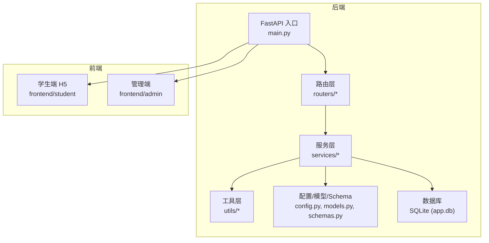
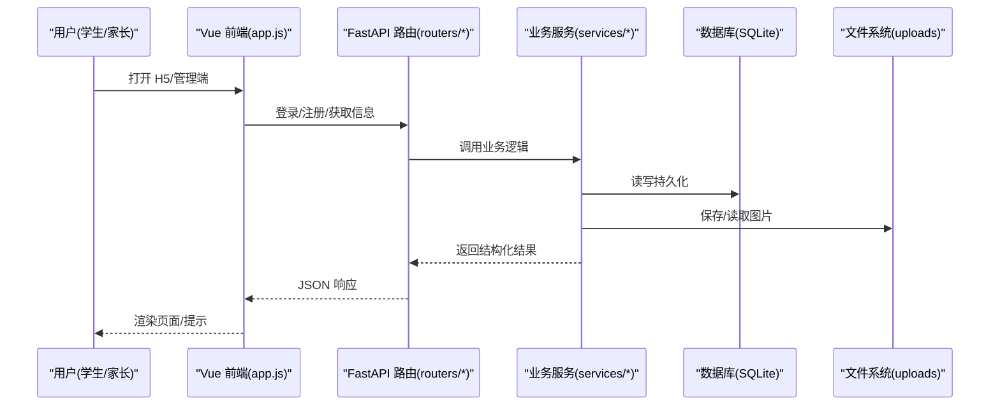
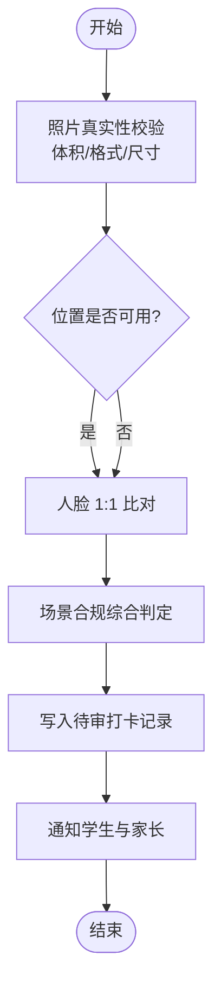
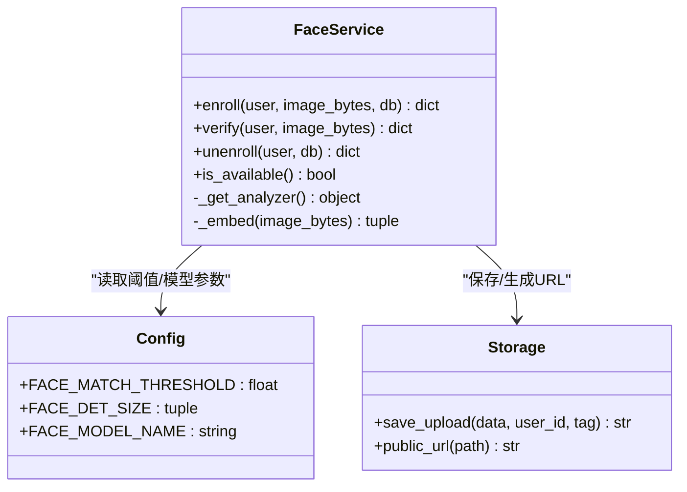
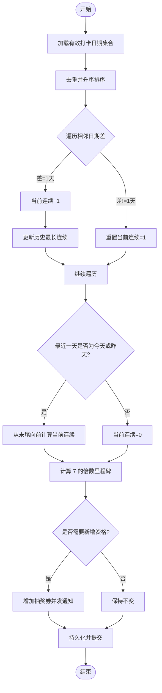
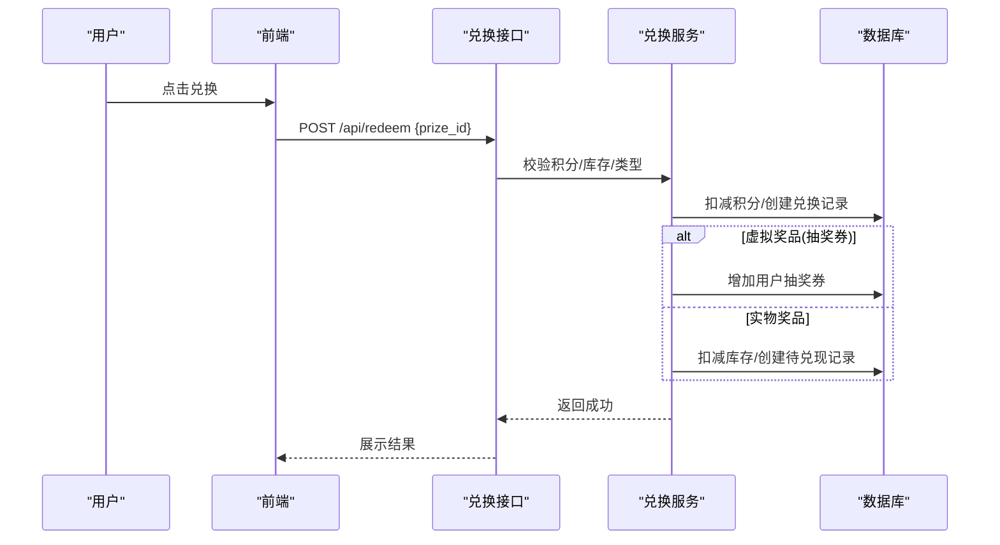
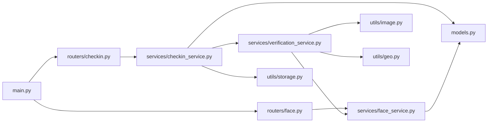

# 暑假作业打卡系统

<cite>
**本文引用的文件**   
- [README.md](file://summer-homework-checkin/README.md)
- [main.py](file://summer-homework-checkin/backend/app/main.py)
- [config.py](file://summer-homework-checkin/backend/app/config.py)
- [models.py](file://summer-homework-checkin/backend/app/models.py)
- [schemas.py](file://summer-homework-checkin/backend/app/schemas.py)
- [checkin_service.py](file://summer-homework-checkin/backend/app/services/checkin_service.py)
- [face_service.py](file://summer-homework-checkin/backend/app/services/face_service.py)
- [verification_service.py](file://summer-homework-checkin/backend/app/services/verification_service.py)
- [lottery_service.py](file://summer-homework-checkin/backend/app/services/lottery_service.py)
- [report_service.py](file://summer-homework-checkin/backend/app/services/report_service.py)
- [image.py](file://summer-homework-checkin/backend/app/utils/image.py)
- [checkin.py](file://summer-homework-checkin/backend/app/routers/checkin.py)
- [face.py](file://summer-homework-checkin/backend/app/routers/face.py)
- [app.js（学生端）](file://summer-homework-checkin/frontend/student/app.js)
- [app.js（管理端）](file://summer-homework-checkin/frontend/admin/app.js)
</cite>

## 目录
1. [简介](#简介)
2. [项目结构](#项目结构)
3. [核心组件](#核心组件)
4. [架构总览](#架构总览)
5. [详细组件分析](#详细组件分析)
6. [依赖关系分析](#依赖关系分析)
7. [性能与可扩展性](#性能与可扩展性)
8. [故障排查指南](#故障排查指南)
9. [结论](#结论)
10. [附录：API 概览与使用要点](#附录api-概览与使用要点)

## 简介
本系统面向三年级小学生，提供“暑假日常作业学习打卡”的全周期管理平台。采用前后端分离架构：后端基于 Python + FastAPI，前端为 Vue3 单页应用（免构建、CDN 引入），学生端以 H5 形式适配手机/平板，后台管理通过独立页面承载。系统内置防代打卡四重校验体系、连续打卡统计、积分奖励计算、抽奖资格获取与家长监督通知、数据报表生成等完整业务闭环。

## 项目结构
- 后端（FastAPI）
  - 路由层：按功能划分 auth、checkin、lottery、prize、parent、report、admin、face、redeem 等模块
  - 服务层：checkin_service、face_service、verification_service、lottery_service、report_service 等
  - 工具层：image（图像解析）、geo（距离计算）、storage（上传与公开 URL）
  - 配置与数据库：config、database、models、schemas、security、deps
- 前端
  - 学生端：student/index.html + app.js + student.css
  - 管理端：admin/index.html + app.js + admin.css
- 静态资源挂载：uploads、/admin、/ 根路径分别由后端统一托管

图表来源
- [main.py:1-48](file://summer-homework-checkin/backend/app/main.py#L1-L48)
- [config.py:1-50](file://summer-homework-checkin/backend/app/config.py#L1-L50)

章节来源
- [README.md:26-49](file://summer-homework-checkin/README.md#L26-L49)
- [main.py:1-48](file://summer-homework-checkin/backend/app/main.py#L1-L48)

## 核心组件
- 用户与权限
  - 统一用户表支持 student/parent/admin 角色；管理员登录鉴权用于后台操作
- 打卡与审核
  - 正常打卡与补卡双流程；提交后进入待审状态，管理员审核后生效并触发积分与连续天数重算
- 人脸识别（1:1 本人比对）
  - 学生采集人脸底图；每次打卡实时比对，不通过则拒绝或标记风险（可配置策略）
- 防代打卡综合判定
  - 照片真实性、地理位置一致性、人脸 1:1 比对、场景合规综合判定
- 连续打卡与抽奖
  - 每满 7 天自动发放 1 次抽奖资格；抽奖按概率与库存加权随机
- 积分商城与兑换
  - 打卡获得积分；支持奖品兑换与替换；支持“抽奖机会”类虚拟奖品
- 家长绑定与通知
  - 凭绑定码绑定孩子；关键事件推送站内通知
- 报表生成
  - 按暑假周期生成可视化报告，支持打印下载

章节来源
- [models.py:11-176](file://summer-homework-checkin/backend/app/models.py#L11-L176)
- [schemas.py:1-244](file://summer-homework-checkin/backend/app/schemas.py#L1-L244)
- [checkin_service.py:39-62](file://summer-homework-checkin/backend/app/services/checkin_service.py#L39-L62)
- [lottery_service.py:9-77](file://summer-homework-checkin/backend/app/services/lottery_service.py#L9-L77)
- [report_service.py:6-50](file://summer-homework-checkin/backend/app/services/report_service.py#L6-L50)

## 架构总览
系统采用典型的前后端分离架构：浏览器端通过 REST API 与后端交互；后端将静态资源（学生端与管理端）一并托管，简化部署。

图表来源
- [main.py:11-47](file://summer-homework-checkin/backend/app/main.py#L11-L47)
- [checkin.py:17-37](file://summer-homework-checkin/backend/app/routers/checkin.py#L17-L37)
- [checkin_service.py:64-163](file://summer-homework-checkin/backend/app/services/checkin_service.py#L64-L163)

## 详细组件分析

### 打卡与审核流程（含四重校验）
- 提交打卡
  - 接收照片、位置、补卡凭证等表单字段
  - 执行照片体积/尺寸校验、地理位置一致性检查、人脸 1:1 比对、场景合规综合判定
  - 写入待审记录，通知学生与家长
- 审核通过
  - 标记有效、发放积分、重算连续天数与抽奖资格
- 审核拒绝
  - 保持无效，通知学生

图表来源
- [checkin.py:17-37](file://summer-homework-checkin/backend/app/routers/checkin.py#L17-L37)
- [checkin_service.py:64-163](file://summer-homework-checkin/backend/app/services/checkin_service.py#L64-L163)
- [verification_service.py:19-71](file://summer-homework-checkin/backend/app/services/verification_service.py#L19-L71)
- [image.py:51-61](file://summer-homework-checkin/backend/app/utils/image.py#L51-L61)

章节来源
- [checkin.py:17-80](file://summer-homework-checkin/backend/app/routers/checkin.py#L17-L80)
- [checkin_service.py:64-210](file://summer-homework-checkin/backend/app/services/checkin_service.py#L64-L210)
- [verification_service.py:19-71](file://summer-homework-checkin/backend/app/services/verification_service.py#L19-L71)
- [image.py:51-61](file://summer-homework-checkin/backend/app/utils/image.py#L51-L61)

### 人脸识别（1:1 本人比对）
- 采集底图：要求仅检测到一张人脸，存储 512 维特征向量与底图路径
- 现场比对：提取现场照最大人脸特征，与底图做余弦相似度比较，低于阈值拒绝或标记风险
- 降级策略：无外网或模型不可用时，已采集底图的账号在比对失败时明确拦截，未采集账号仍可正常打卡

图表来源
- [face_service.py:1-133](file://summer-homework-checkin/backend/app/services/face_service.py#L1-L133)
- [config.py:41-49](file://summer-homework-checkin/backend/app/config.py#L41-L49)

章节来源
- [face_service.py:71-133](file://summer-homework-checkin/backend/app/services/face_service.py#L71-L133)
- [face.py:14-45](file://summer-homework-checkin/backend/app/routers/face.py#L14-L45)
- [config.py:41-49](file://summer-homework-checkin/backend/app/config.py#L41-L49)

### 连续打卡统计与抽奖资格
- 连续天数计算：对有效打卡日期排序，维护当前连续与历史最长连续
- 里程碑发放：当前连续天数每达到 7 的倍数，增加对应数量的抽奖资格，并发站内通知
- 中断处理：连续中断时放弃向下一里程碑的进度，但已发放资格保留

图表来源
- [checkin_service.py:12-62](file://summer-homework-checkin/backend/app/services/checkin_service.py#L12-L62)

章节来源
- [checkin_service.py:12-62](file://summer-homework-checkin/backend/app/services/checkin_service.py#L12-L62)

### 积分奖励与兑换
- 积分获取：正常打卡与补卡分别获得不同积分（可通过环境变量调整）
- 兑换流程：选择奖品扣减积分；若为“抽奖机会”类虚拟奖品，直接增加抽奖券数量
- 替换机制：支持对未完成的兑换进行替换，旧记录指向新记录

图表来源
- [schemas.py:184-213](file://summer-homework-checkin/backend/app/schemas.py#L184-L213)
- [models.py:141-161](file://summer-homework-checkin/backend/app/models.py#L141-L161)

章节来源
- [schemas.py:184-213](file://summer-homework-checkin/backend/app/schemas.py#L184-L213)
- [models.py:141-161](file://summer-homework-checkin/backend/app/models.py#L141-L161)

### 家长监督与通知
- 绑定关系：家长凭孩子绑定码完成绑定，形成多对多关系
- 通知渠道：打卡提交、审核结果、中奖等事件均会向学生与家长发送站内通知
- 家长视角：可切换查看多个孩子的打卡与积分情况

章节来源
- [models.py:57-68](file://summer-homework-checkin/backend/app/models.py#L57-L68)
- [models.py:163-176](file://summer-homework-checkin/backend/app/models.py#L163-L176)
- [app.js（学生端）:106-146](file://summer-homework-checkin/frontend/student/app.js#L106-L146)

### 数据报表生成
- 统计维度：有效打卡天数、完成率、每周分布、最长/当前连续、中奖记录、抽奖次数
- 输出形式：卡通风格 HTML，支持打印下载

章节来源
- [report_service.py:6-109](file://summer-homework-checkin/backend/app/services/report_service.py#L6-L109)
- [app.js（学生端）:317-323](file://summer-homework-checkin/frontend/student/app.js#L317-L323)

### 前端组件化开发（Vue3）
- 学生端
  - 登录/注册、首页看板、打卡三步流程、人脸采集、积分商城、抽奖、历史记录、报告导出
  - 通过统一的 api 方法封装 fetch，自动注入 Token 并处理错误
- 管理端
  - 仪表盘、奖品全生命周期管理、用户列表、打卡审核、兑换审核、内置图片查看器（支持缩放/旋转/滑动/批量上传）

章节来源
- [app.js（学生端）:1-329](file://summer-homework-checkin/frontend/student/app.js#L1-329)
- [app.js（管理端）:1-479](file://summer-homework-checkin/frontend/admin/app.js#L1-479)

## 依赖关系分析
- 路由到服务：各 router 仅负责参数校验与协议转换，核心逻辑下沉至 services
- 服务到工具：verification_service 组合 image、geo、face_service；checkin_service 组合 storage、notify_service
- 服务到模型：所有持久化操作通过 SQLAlchemy ORM 访问 models
- 前端到后端：通过 REST API 与后端交互，静态资源由 main.py 统一挂载

图表来源
- [main.py:21-29](file://summer-homework-checkin/backend/app/main.py#L21-L29)
- [checkin.py:1-80](file://summer-homework-checkin/backend/app/routers/checkin.py#L1-L80)
- [face.py:1-45](file://summer-homework-checkin/backend/app/routers/face.py#L1-L45)
- [checkin_service.py:1-10](file://summer-homework-checkin/backend/app/services/checkin_service.py#L1-L10)
- [verification_service.py:1-17](file://summer-homework-checkin/backend/app/services/verification_service.py#L1-L17)
- [face_service.py:1-22](file://summer-homework-checkin/backend/app/services/face_service.py#L1-L22)
- [image.py:1-10](file://summer-homework-checkin/backend/app/utils/image.py#L1-L10)
- [models.py:1-10](file://summer-homework-checkin/backend/app/models.py#L1-L10)

章节来源
- [main.py:21-29](file://summer-homework-checkin/backend/app/main.py#L21-L29)
- [checkin.py:1-80](file://summer-homework-checkin/backend/app/routers/checkin.py#L1-L80)
- [face.py:1-45](file://summer-homework-checkin/backend/app/routers/face.py#L1-L45)
- [checkin_service.py:1-10](file://summer-homework-checkin/backend/app/services/checkin_service.py#L1-L10)
- [verification_service.py:1-17](file://summer-homework-checkin/backend/app/services/verification_service.py#L1-L17)
- [face_service.py:1-22](file://summer-homework-checkin/backend/app/services/face_service.py#L1-L22)
- [image.py:1-10](file://summer-homework-checkin/backend/app/utils/image.py#L1-L10)
- [models.py:1-10](file://summer-homework-checkin/backend/app/models.py#L1-L10)

## 性能与可扩展性
- 轻量存储：默认 SQLite，适合演示与中小规模；生产建议迁移至 PostgreSQL/MySQL 并配置连接池
- 并发能力：uvicorn 多 worker 模式提升吞吐；静态资源可上 CDN
- 人脸识别：insightface 本地推理，首次运行按需下载模型；无外网环境自动降级，不影响整体链路
- 扩展点：
  - 通知渠道：在 notify_service 中接入短信/微信模板消息
  - 人脸方案：可重写 face_service 后端，支持更高精度或多用户 1:N 检索

[本节为通用指导，无需源码引用]

## 故障排查指南
- 人脸模型不可用
  - 现象：打卡提示“人脸识别服务暂不可用”，已采集底图账号可能被拒绝
  - 排查：确认网络可访问官方源；或预置模型至 ~/.insightface；调整 FACE_MODE_ON_ENROLLED 策略
- 照片被拒
  - 现象：体积过小/过大、非 JPEG/PNG、尺寸过低
  - 排查：检查 MIN_PHOTO_BYTES/MIN_PHOTO_DIM/PHOTO_MAX_BYTES 配置；确保上传真实现场照片
- 位置异常
  - 现象：geo_flag 标记风险
  - 排查：确认设备定位权限与 home_lat/home_lng 设置；适当调整 GEO_THRESHOLD_METERS
- 补卡失败
  - 现象：目标日期无效/超出暑假范围/已达月度上限/重复补卡
  - 排查：核对 makeup_for_date 与 MAX_MAKEUP_PER_MONTH；避免重复补卡

章节来源
- [config.py:27-49](file://summer-homework-checkin/backend/app/config.py#L27-L49)
- [image.py:51-61](file://summer-homework-checkin/backend/app/utils/image.py#L51-L61)
- [checkin_service.py:72-123](file://summer-homework-checkin/backend/app/services/checkin_service.py#L72-L123)
- [verification_service.py:34-71](file://summer-homework-checkin/backend/app/services/verification_service.py#L34-L71)

## 结论
本系统以清晰的模块化设计与稳健的校验链路，实现了面向三年级学生的暑期打卡全周期管理。四重防代打卡机制结合人脸 1:1 比对，从源头降低代打卡风险；连续打卡与积分/抽奖激励形成正向反馈；家长监督与可视化报表增强家校协同。系统在演示与中小规模场景下具备良好稳定性与易用性，同时预留了生产级扩展空间。

[本节为总结性内容，无需源码引用]

## 附录：API 概览与使用要点
- 认证
  - POST /api/auth/register、POST /api/auth/login
- 打卡
  - POST /api/checkin（照片+位置+补卡凭证）
  - GET /api/checkin/streak（连续天数/抽奖券/今日状态）
  - GET /api/checkin/today（今日状态）
  - GET /api/checkin/history（历史记录）
- 人脸
  - POST /api/face/enroll（采集底图）
  - GET /api/face/status（查询状态）
  - DELETE /api/face/enroll（撤销底图）
- 抽奖与兑换
  - POST /api/lottery/draw（消耗 1 次资格）
  - POST /api/redeem（积分兑换）
  - POST /api/redeem/{id}/replace（替换兑换）
- 家长
  - POST /api/parent/bind（绑定孩子）
  - GET /api/parent/notifications（通知）
  - GET /api/parent/child-streak/{id}（孩子统计）
  - GET /api/parent/mall/{id}（孩子商城）
  - POST /api/parent/redeem?child_id={id}（孩子兑换）
  - POST /api/parent/redeem/{id}/replace（孩子替换）
  - GET /api/parent/child-report/{id}/html（孩子报告）
- 报表
  - GET /api/report/me/html（我的报告）
- 管理
  - GET/POST/PUT/DELETE /api/admin/prizes[/id]
  - GET /api/admin/stats
  - GET /api/admin/users
  - GET /api/admin/checkins
  - PUT /api/admin/checkins/{id}/review
  - GET /api/admin/redemptions
  - PUT /api/admin/redemptions/{id}/review

章节来源
- [README.md:81-94](file://summer-homework-checkin/README.md#L81-L94)
- [checkin.py:17-80](file://summer-homework-checkin/backend/app/routers/checkin.py#L17-L80)
- [face.py:14-45](file://summer-homework-checkin/backend/app/routers/face.py#L14-L45)
- [lottery_service.py:9-77](file://summer-homework-checkin/backend/app/services/lottery_service.py#L9-L77)
- [report_service.py:6-50](file://summer-homework-checkin/backend/app/services/report_service.py#L6-L50)