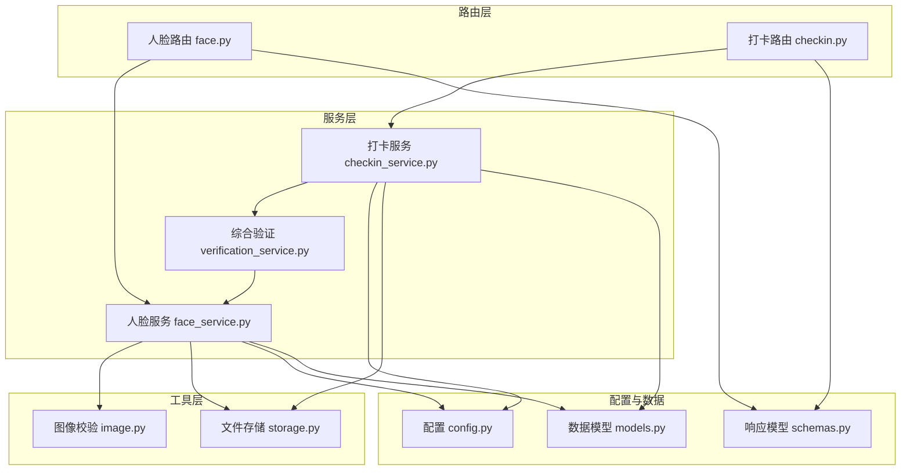
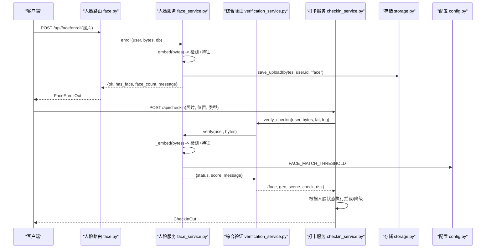
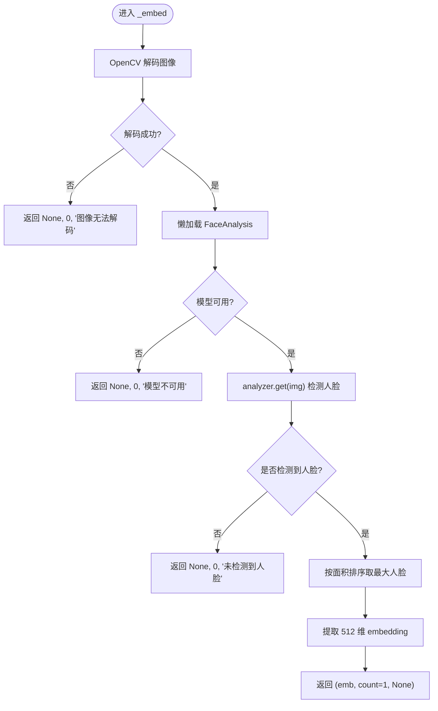
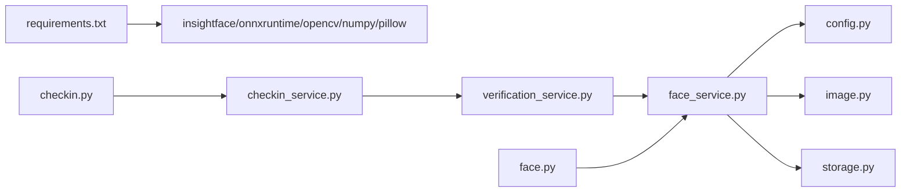

# 人脸识别系统

<cite>
**本文引用的文件**   
- [face.py](file://summer-homework-checkin/backend/app/routers/face.py)
- [face_service.py](file://summer-homework-checkin/backend/app/services/face_service.py)
- [image.py](file://summer-homework-checkin/backend/app/utils/image.py)
- [storage.py](file://summer-homework-checkin/backend/app/utils/storage.py)
- [config.py](file://summer-homework-checkin/backend/app/config.py)
- [models.py](file://summer-homework-checkin/backend/app/models.py)
- [schemas.py](file://summer-homework-checkin/backend/app/schemas.py)
- [checkin_service.py](file://summer-homework-checkin/backend/app/services/checkin_service.py)
- [checkin.py](file://summer-homework-checkin/backend/app/routers/checkin.py)
- [verification_service.py](file://summer-homework-checkin/backend/app/services/verification_service.py)
- [requirements.txt](file://summer-homework-checkin/backend/requirements.txt)
</cite>

## 目录
1. [简介](#简介)
2. [项目结构](#项目结构)
3. [核心组件](#核心组件)
4. [架构总览](#架构总览)
5. [详细组件分析](#详细组件分析)
6. [依赖关系分析](#依赖关系分析)
7. [性能与优化建议](#性能与优化建议)
8. [故障排查指南](#故障排查指南)
9. [结论](#结论)
10. [附录：错误码与状态定义](#附录错误码与状态定义)

## 简介
本技术文档围绕“暑假作业打卡”系统中的“人脸识别（1:1 本人比对）”能力，系统化阐述以下要点：
- InsightFace 框架集成方案与模型加载策略
- 人脸底图采集流程（注册、特征提取、存储机制）
- 1:1 身份比对的算法实现、相似度阈值与置信度判断
- 异常情况处理：多个人脸检测、无人脸检测、人脸不匹配、服务不可用等
- 人脸服务可用性检查与降级策略，确保 AI 不可用时系统稳定
- 图像预处理规范、质量评估标准与性能优化建议
- 完整的错误码与调试指南，帮助快速定位问题

## 项目结构
本项目采用 FastAPI + SQLAlchemy 的轻量后端架构。人脸识别相关代码主要分布在路由层、服务层、工具层与配置层：
- 路由层：提供人脸采集、状态查询、撤销等接口；在打卡流程中调用验证服务
- 服务层：封装 InsightFace 模型加载、特征提取、1:1 比对、健康检查
- 工具层：图片基础校验、文件存储与 URL 生成
- 配置层：阈值、尺寸、模型名、模式开关等
- 数据模型：用户表包含人脸字段，打卡记录表包含人脸结果字段

图表来源
- [face.py:1-45](file://summer-homework-checkin/backend/app/routers/face.py#L1-L45)
- [face_service.py:1-133](file://summer-homework-checkin/backend/app/services/face_service.py#L1-L133)
- [verification_service.py:1-71](file://summer-homework-checkin/backend/app/services/verification_service.py#L1-L71)
- [checkin_service.py:1-254](file://summer-homework-checkin/backend/app/services/checkin_service.py#L1-L254)
- [image.py:1-61](file://summer-homework-checkin/backend/app/utils/image.py#L1-L61)
- [storage.py:1-24](file://summer-homework-checkin/backend/app/utils/storage.py#L1-L24)
- [config.py:1-50](file://summer-homework-checkin/backend/app/config.py#L1-L50)
- [models.py:1-212](file://summer-homework-checkin/backend/app/models.py#L1-L212)
- [schemas.py:1-322](file://summer-homework-checkin/backend/app/schemas.py#L1-L322)

章节来源
- [face.py:1-45](file://summer-homework-checkin/backend/app/routers/face.py#L1-L45)
- [face_service.py:1-133](file://summer-homework-checkin/backend/app/services/face_service.py#L1-L133)
- [verification_service.py:1-71](file://summer-homework-checkin/backend/app/services/verification_service.py#L1-L71)
- [checkin_service.py:1-254](file://summer-homework-checkin/backend/app/services/checkin_service.py#L1-L254)
- [image.py:1-61](file://summer-homework-checkin/backend/app/utils/image.py#L1-L61)
- [storage.py:1-24](file://summer-homework-checkin/backend/app/utils/storage.py#L1-L24)
- [config.py:1-50](file://summer-homework-checkin/backend/app/config.py#L1-L50)
- [models.py:1-212](file://summer-homework-checkin/backend/app/models.py#L1-L212)
- [schemas.py:1-322](file://summer-homework-checkin/backend/app/schemas.py#L1-L322)

## 核心组件
- 人脸服务（face_service.py）
  - 懒加载 InsightFace FaceAnalysis 模型（buffalo_l），线程安全初始化
  - 特征提取：基于 OpenCV 解码图像，检测最大人脸并输出 512 维 embedding
  - 1:1 比对：余弦相似度计算，阈值比较判定 match/mismatch
  - 健康检查：is_available() 暴露服务可用性
- 路由层（face.py）
  - POST /api/face/enroll：采集人脸底图（要求仅一张人脸）
  - GET /api/face/status：查询当前用户是否已采集
  - DELETE /api/face/enroll：撤销人脸底图（解绑，保留历史文件）
- 综合验证服务（verification_service.py）
  - 将人脸 1:1 比对纳入打卡整体校验流程，返回结构化结果
- 打卡服务（checkin_service.py）
  - 在创建打卡时调用综合验证，依据人脸状态执行拦截或降级策略
- 工具层（image.py, storage.py）
  - 轻量图像解析（JPEG/PNG 尺寸与格式校验）
  - 上传文件持久化与公开 URL 生成
- 配置（config.py）
  - 相似度阈值、检测输入尺寸、模型名称、人脸模式（enforce/soft）
- 数据模型（models.py）
  - User 表含 face_enrolled、face_embedding、face_id_path
  - CheckIn 表含 face_status、face_score、face_flag 等字段

章节来源
- [face_service.py:1-133](file://summer-homework-checkin/backend/app/services/face_service.py#L1-L133)
- [face.py:1-45](file://summer-homework-checkin/backend/app/routers/face.py#L1-L45)
- [verification_service.py:1-71](file://summer-homework-checkin/backend/app/services/verification_service.py#L1-L71)
- [checkin_service.py:1-254](file://summer-homework-checkin/backend/app/services/checkin_service.py#L1-L254)
- [image.py:1-61](file://summer-homework-checkin/backend/app/utils/image.py#L1-L61)
- [storage.py:1-24](file://summer-homework-checkin/backend/app/utils/storage.py#L1-L24)
- [config.py:1-50](file://summer-homework-checkin/backend/app/config.py#L1-L50)
- [models.py:1-212](file://summer-homework-checkin/backend/app/models.py#L1-L212)

## 架构总览
下图展示从客户端到后端的人脸识别关键路径：采集、比对、打卡集成与健康检查。

图表来源
- [face.py:14-26](file://summer-homework-checkin/backend/app/routers/face.py#L14-L26)
- [face_service.py:71-87](file://summer-homework-checkin/backend/app/services/face_service.py#L71-L87)
- [face_service.py:99-125](file://summer-homework-checkin/backend/app/services/face_service.py#L99-L125)
- [verification_service.py:19-71](file://summer-homework-checkin/backend/app/services/verification_service.py#L19-L71)
- [checkin_service.py:64-163](file://summer-homework-checkin/backend/app/services/checkin_service.py#L64-L163)
- [storage.py:7-16](file://summer-homework-checkin/backend/app/utils/storage.py#L7-L16)
- [config.py:41-49](file://summer-homework-checkin/backend/app/config.py#L41-L49)

## 详细组件分析

### 人脸服务（face_service.py）
- 模型懒加载与线程安全
  - 使用全局锁保证首次加载只执行一次
  - 通过环境变量控制模型名称、检测尺寸、相似度阈值
- 特征提取（_embed）
  - 使用 OpenCV 解码字节流为图像矩阵
  - 调用 FaceAnalysis.get 获取人脸列表，按面积排序取最大人脸
  - 返回 embedding、人脸数量、提示信息
- 注册（enroll）
  - 要求检测到且仅检测到一张人脸
  - 保存原始照片与 JSON 化的 embedding 到数据库
- 1:1 比对（verify）
  - 读取用户已存 embedding，计算余弦相似度
  - 与阈值比较得到 match/mismatch
  - 返回结构化结果（status、score、message 等）
- 健康检查（is_available）
  - 用于外部监控或前端提示

图表来源
- [face_service.py:49-68](file://summer-homework-checkin/backend/app/services/face_service.py#L49-L68)

章节来源
- [face_service.py:28-46](file://summer-homework-checkin/backend/app/services/face_service.py#L28-L46)
- [face_service.py:49-68](file://summer-homework-checkin/backend/app/services/face_service.py#L49-L68)
- [face_service.py:71-87](file://summer-homework-checkin/backend/app/services/face_service.py#L71-L87)
- [face_service.py:99-125](file://summer-homework-checkin/backend/app/services/face_service.py#L99-L125)
- [face_service.py:128-133](file://summer-homework-checkin/backend/app/services/face_service.py#L128-L133)

### 路由层（face.py）
- 采集接口
  - 仅学生角色可采集
  - 接收上传文件，调用 face_service.enroll
- 状态查询
  - 返回是否已采集及底图访问 URL
- 撤销接口
  - 仅解绑，不删除历史文件，便于审计

章节来源
- [face.py:14-26](file://summer-homework-checkin/backend/app/routers/face.py#L14-L26)
- [face.py:29-37](file://summer-homework-checkin/backend/app/routers/face.py#L29-L37)
- [face.py:40-44](file://summer-homework-checkin/backend/app/routers/face.py#L40-L44)

### 综合验证服务（verification_service.py）
- 将人脸 1:1 比对纳入打卡整体校验
- 返回结构化结果，包含人脸状态、地理位置一致性、场景检查与风险等级
- 异常捕获：当人脸服务抛出异常时，标记 model_unavailable 并降级

章节来源
- [verification_service.py:19-71](file://summer-homework-checkin/backend/app/services/verification_service.py#L19-L71)

### 打卡服务（checkin_service.py）
- 在创建打卡时调用综合验证
- 若用户已采集且人脸状态为 mismatch/multiple_faces/no_face，直接拒绝打卡
- 若模型不可用且模式为 enforce，返回 503 服务不可用
- 否则继续记录打卡，等待管理员审核

章节来源
- [checkin_service.py:64-163](file://summer-homework-checkin/backend/app/services/checkin_service.py#L64-L163)

### 图像工具（image.py）
- 轻量 JPEG/PNG 解析，无需 Pillow
- 校验体积与最小边长，过滤占位图/缩略图

章节来源
- [image.py:34-61](file://summer-homework-checkin/backend/app/utils/image.py#L34-L61)

### 存储工具（storage.py）
- 按用户 ID 分目录保存上传文件
- 生成相对路径与公开 URL

章节来源
- [storage.py:7-24](file://summer-homework-checkin/backend/app/utils/storage.py#L7-L24)

### 配置（config.py）
- 相似度阈值 FACE_MATCH_THRESHOLD
- 检测输入尺寸 FACE_DET_SIZE
- 模型名称 FACE_MODEL_NAME
- 人脸模式 FACE_MODE_ON_ENROLLED（enforce/soft）

章节来源
- [config.py:41-49](file://summer-homework-checkin/backend/app/config.py#L41-L49)

### 数据模型（models.py）
- User 表：face_enrolled、face_embedding、face_id_path
- CheckIn 表：face_status、face_score、face_flag

章节来源
- [models.py:27-30](file://summer-homework-checkin/backend/app/models.py#L27-L30)
- [models.py:87-89](file://summer-homework-checkin/backend/app/models.py#L87-L89)

## 依赖关系分析
- 运行时依赖
  - insightface、onnxruntime、opencv-python-headless、numpy、pillow
- 模块耦合
  - 路由层依赖服务层
  - 服务层依赖工具层与配置层
  - 数据模型贯穿服务层与路由层

图表来源
- [requirements.txt:1-11](file://summer-homework-checkin/backend/requirements.txt#L1-L11)
- [face_service.py:1-133](file://summer-homework-checkin/backend/app/services/face_service.py#L1-L133)
- [verification_service.py:1-71](file://summer-homework-checkin/backend/app/services/verification_service.py#L1-L71)
- [checkin_service.py:1-254](file://summer-homework-checkin/backend/app/services/checkin_service.py#L1-L254)
- [face.py:1-45](file://summer-homework-checkin/backend/app/routers/face.py#L1-L45)
- [checkin.py:1-80](file://summer-homework-checkin/backend/app/routers/checkin.py#L1-L80)

章节来源
- [requirements.txt:1-11](file://summer-homework-checkin/backend/requirements.txt#L1-L11)
- [face_service.py:1-133](file://summer-homework-checkin/backend/app/services/face_service.py#L1-L133)
- [verification_service.py:1-71](file://summer-homework-checkin/backend/app/services/verification_service.py#L1-L71)
- [checkin_service.py:1-254](file://summer-homework-checkin/backend/app/services/checkin_service.py#L1-L254)
- [face.py:1-45](file://summer-homework-checkin/backend/app/routers/face.py#L1-L45)
- [checkin.py:1-80](file://summer-homework-checkin/backend/app/routers/checkin.py#L1-L80)

## 性能与优化建议
- 模型加载
  - 懒加载与单例缓存避免重复初始化开销
  - 强制 CPU 运行（ctx_id=-1）提升部署稳定性
- 检测尺寸
  - FACE_DET_SIZE 越小越快但易漏检，建议根据设备性能调优
- 并发安全
  - 使用全局锁保护模型实例与检测过程，避免竞态条件
- 向量存储
  - 512 维向量以 JSON 文本存储，注意序列化/反序列化开销
- 图像预处理
  - 轻量解析减少第三方库依赖，降低内存占用
- 降级策略
  - 模型不可用时返回明确状态，结合 enforce/soft 模式保障业务连续性

[本节为通用指导，不直接分析具体文件]

## 故障排查指南
- 常见问题
  - 未检测到人脸：检查拍摄角度、光线、遮挡情况
  - 多张人脸：引导用户单独拍摄本人正脸
  - 人脸不匹配：确认是否为同一人，调整阈值或重新采集
  - 模型不可用：检查 insightface 安装与网络下载，必要时切换 soft 模式
- 日志与诊断
  - 查看人脸状态字段 face_status、face_score、face_flag
  - 关注综合验证返回的 scene_check 与 risk 等级
- 回退与降级
  - enforce 模式下模型不可用会返回 503，提示稍后重试
  - soft 模式下允许记录待审核，人工复核后再决定是否有效

章节来源
- [face_service.py:49-68](file://summer-homework-checkin/backend/app/services/face_service.py#L49-L68)
- [face_service.py:99-125](file://summer-homework-checkin/backend/app/services/face_service.py#L99-L125)
- [verification_service.py:41-71](file://summer-homework-checkin/backend/app/services/verification_service.py#L41-L71)
- [checkin_service.py:116-123](file://summer-homework-checkin/backend/app/services/checkin_service.py#L116-L123)

## 结论
本系统通过 InsightFace 预训练模型实现了稳定的 1:1 人脸比对能力，并与打卡流程深度集成。通过严格的图像质量校验、多维度风险判定与明确的降级策略，系统在 AI 服务不可用时仍能保持可控与可审计。未来可扩展至 1:N 检索，只需扩展比对逻辑而不改动主流程。

[本节为总结性内容，不直接分析具体文件]

## 附录：错误码与状态定义
- 人脸状态（face_status）
  - match：比对通过
  - mismatch：比对不通过
  - no_face：未检测到人脸
  - multiple_faces：检测到多张人脸
  - not_enrolled：尚未采集人脸底图
  - model_unavailable：人脸识别服务暂不可用
- 人脸标志（face_flag）
  - True：代打卡高风险（mismatch/multiple_faces/no_face）
  - False：低风险或未触发
- 场景检查（scene_check）
  - pass：正常
  - warn：存在风险需关注
- 风险等级（risk）
  - low：低风险
  - medium：中等风险
  - high：高风险
- HTTP 状态码
  - 400：请求参数或图像质量不符合要求
  - 403：权限不足（非学生操作）
  - 503：人脸识别服务不可用（enforce 模式）

章节来源
- [models.py:87-89](file://summer-homework-checkin/backend/app/models.py#L87-L89)
- [verification_service.py:41-71](file://summer-homework-checkin/backend/app/services/verification_service.py#L41-L71)
- [checkin_service.py:116-123](file://summer-homework-checkin/backend/app/services/checkin_service.py#L116-L123)