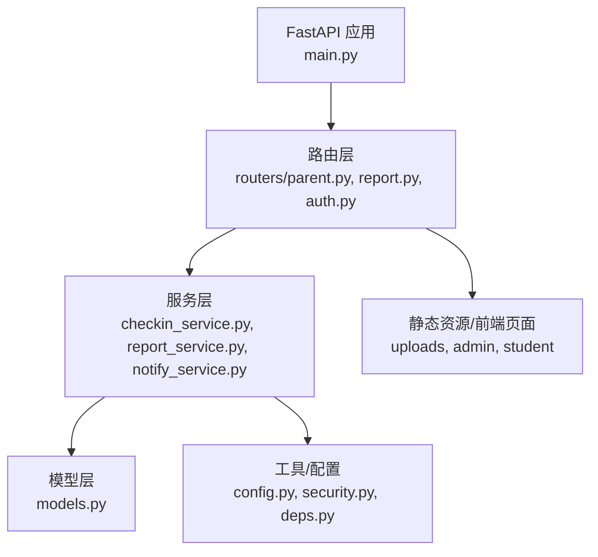
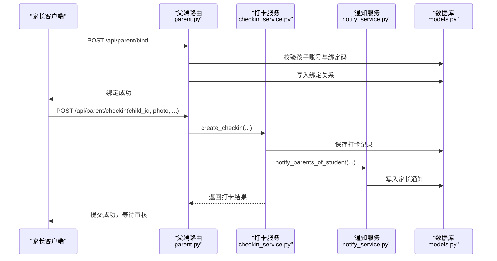
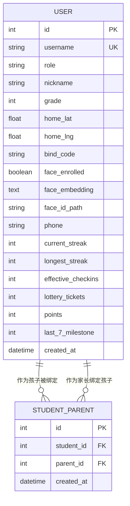
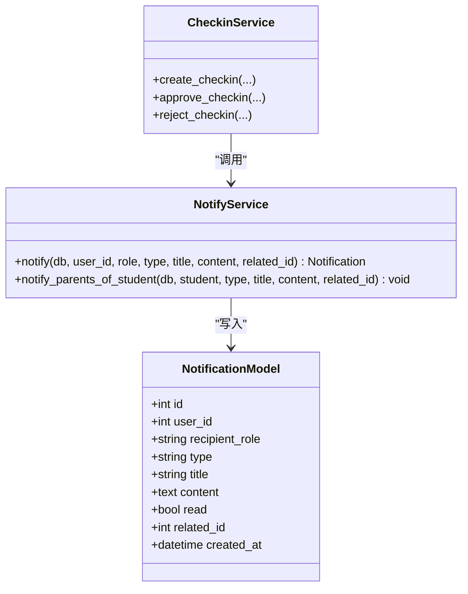
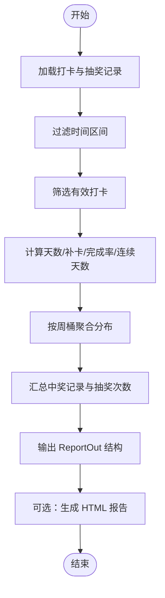
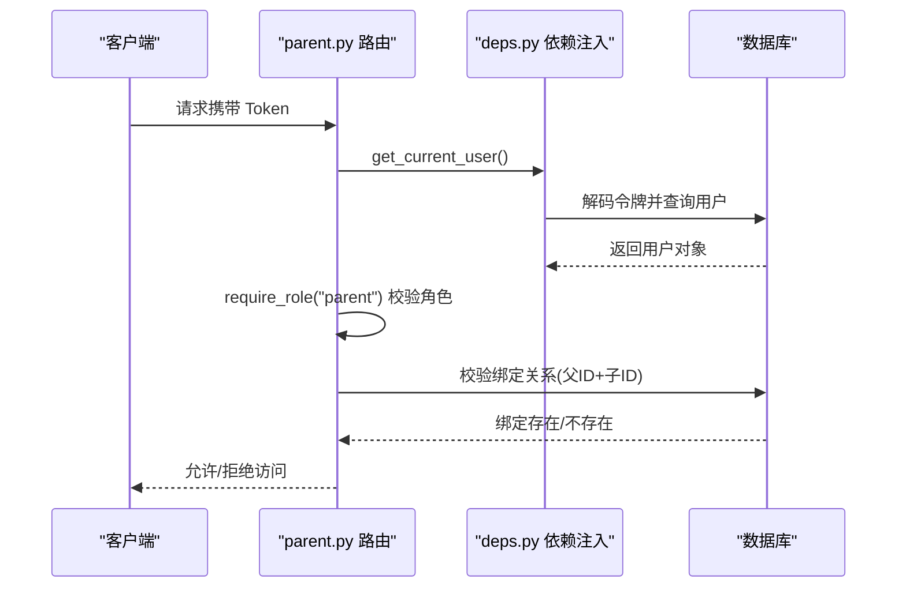
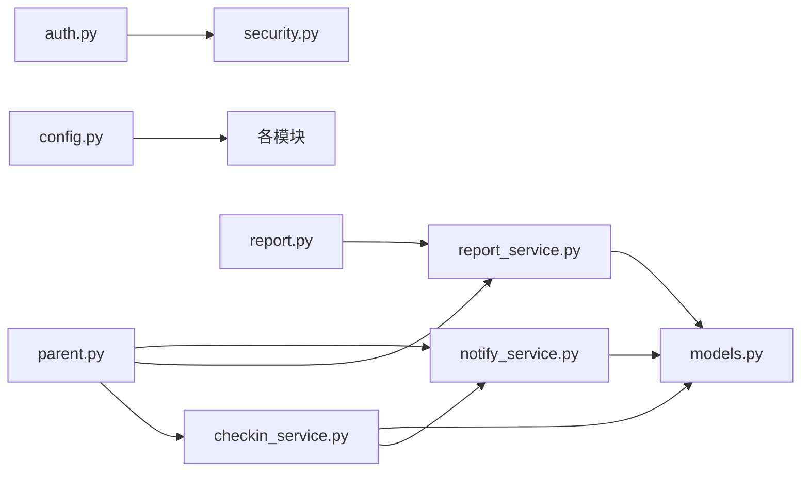

# 家长监督功能

<cite>
**本文引用的文件列表**
- [summer-homework-checkin/backend/app/main.py](file://summer-homework-checkin/backend/app/main.py)
- [summer-homework-checkin/backend/app/models.py](file://summer-homework-checkin/backend/app/models.py)
- [summer-homework-checkin/backend/app/schemas.py](file://summer-homework-checkin/backend/app/schemas.py)
- [summer-homework-checkin/backend/app/routers/parent.py](file://summer-homework-checkin/backend/app/routers/parent.py)
- [summer-homework-checkin/backend/app/routers/auth.py](file://summer-homework-checkin/backend/app/routers/auth.py)
- [summer-homework-checkin/backend/app/routers/report.py](file://summer-homework-checkin/backend/app/routers/report.py)
- [summer-homework-checkin/backend/app/services/checkin_service.py](file://summer-homework-checkin/backend/app/services/checkin_service.py)
- [summer-homework-checkin/backend/app/services/report_service.py](file://summer-homework-checkin/backend/app/services/report_service.py)
- [summer-homework-checkin/backend/app/services/notify_service.py](file://summer-homework-checkin/backend/app/services/notify_service.py)
- [summer-homework-checkin/backend/app/deps.py](file://summer-homework-checkin/backend/app/deps.py)
- [summer-homework-checkin/backend/app/security.py](file://summer-homework-checkin/backend/app/security.py)
- [summer-homework-checkin/backend/app/config.py](file://summer-homework-checkin/backend/app/config.py)
</cite>

## 目录
1. [简介](#简介)
2. [项目结构](#项目结构)
3. [核心组件](#核心组件)
4. [架构总览](#架构总览)
5. [详细组件分析](#详细组件分析)
6. [依赖关系分析](#依赖关系分析)
7. [性能与扩展性](#性能与扩展性)
8. [故障排查指南](#故障排查指南)
9. [结论](#结论)
10. [附录：API 接口说明](#附录api-接口说明)

## 简介
本技术文档围绕“家长监督”能力展开，聚焦以下目标：
- 家长与孩子账号绑定关系的建立与维护机制、数据模型设计与关联查询优化
- 实时通知系统的架构设计（当前为站内通知持久化，预留消息队列与多渠道扩展）
- 学习进度报表的生成算法（打卡统计聚合与可视化数据准备）
- 家长权限控制模式（确保仅能访问自己孩子的数据）
- 通知模板管理机制（支持个性化内容动态生成）
- 数据同步策略（保障家长与孩子端数据一致性）
- 完整 API 接口说明与错误处理方案

## 项目结构
后端采用 FastAPI 分层架构：路由层负责 HTTP 接口与鉴权；服务层封装业务逻辑；模型层定义数据库实体；配置与安全模块提供通用能力。家长监督相关代码主要分布在 routers/parent.py、services/*、models.py、schemas.py 等文件中。

图表来源
- [summer-homework-checkin/backend/app/main.py:1-49](file://summer-homework-checkin/backend/app/main.py#L1-L49)
- [summer-homework-checkin/backend/app/routers/parent.py:1-237](file://summer-homework-checkin/backend/app/routers/parent.py#L1-L237)
- [summer-homework-checkin/backend/app/services/checkin_service.py:1-254](file://summer-homework-checkin/backend/app/services/checkin_service.py#L1-L254)
- [summer-homework-checkin/backend/app/services/report_service.py:1-109](file://summer-homework-checkin/backend/app/services/report_service.py#L1-L109)
- [summer-homework-checkin/backend/app/services/notify_service.py:1-20](file://summer-homework-checkin/backend/app/services/notify_service.py#L1-L20)
- [summer-homework-checkin/backend/app/models.py:1-212](file://summer-homework-checkin/backend/app/models.py#L1-L212)
- [summer-homework-checkin/backend/app/config.py:1-50](file://summer-homework-checkin/backend/app/config.py#L1-L50)

章节来源
- [summer-homework-checkin/backend/app/main.py:1-49](file://summer-homework-checkin/backend/app/main.py#L1-L49)

## 核心组件
- 用户与角色：统一用户表包含学生与家长角色字段，并维护打卡统计冗余字段（连续天数、有效打卡数、抽奖券、积分等），便于快速展示与报表计算。
- 绑定关系：通过中间表实现家长与孩子的多对多绑定，所有家长侧操作均基于该绑定进行权限校验。
- 打卡服务：负责打卡创建、审核、补卡规则、防代打卡校验、连续天数重算与奖励发放、通知推送。
- 报表服务：按时间窗口聚合打卡数据，输出结构化报表与可打印 HTML 报告。
- 通知服务：写入站内通知记录，并提供面向家长的批量通知方法。
- 鉴权与依赖注入：基于无状态令牌的身份解析与角色校验，配合依赖注入在路由层强制权限检查。

章节来源
- [summer-homework-checkin/backend/app/models.py:11-68](file://summer-homework-checkin/backend/app/models.py#L11-L68)
- [summer-homework-checkin/backend/app/services/checkin_service.py:39-62](file://summer-homework-checkin/backend/app/services/checkin_service.py#L39-L62)
- [summer-homework-checkin/backend/app/services/report_service.py:6-50](file://summer-homework-checkin/backend/app/services/report_service.py#L6-L50)
- [summer-homework-checkin/backend/app/services/notify_service.py:5-20](file://summer-homework-checkin/backend/app/services/notify_service.py#L5-L20)
- [summer-homework-checkin/backend/app/deps.py:13-33](file://summer-homework-checkin/backend/app/deps.py#L13-L33)

## 架构总览
家长监督的核心流程包括：绑定建立、家长代打卡、通知下发、报表生成与兑换管理。下图展示了关键交互路径。

图表来源
- [summer-homework-checkin/backend/app/routers/parent.py:20-32](file://summer-homework-checkin/backend/app/routers/parent.py#L20-L32)
- [summer-homework-checkin/backend/app/routers/parent.py:80-104](file://summer-homework-checkin/backend/app/routers/parent.py#L80-L104)
- [summer-homework-checkin/backend/app/services/checkin_service.py:64-163](file://summer-homework-checkin/backend/app/services/checkin_service.py#L64-L163)
- [summer-homework-checkin/backend/app/services/notify_service.py:16-20](file://summer-homework-checkin/backend/app/services/notify_service.py#L16-L20)
- [summer-homework-checkin/backend/app/models.py:57-68](file://summer-homework-checkin/backend/app/models.py#L57-L68)

## 详细组件分析

### 家长-孩子绑定关系的数据模型与关联查询优化
- 数据模型
  - 用户表包含角色、绑定码、统计冗余字段等，用于快速展示与报表计算。
  - 绑定关系表以 parent_id 与 student_id 作为外键，形成多对多关系，并通过索引加速查询。
- 关联查询优化
  - 使用外键与索引提升绑定关系查找效率。
  - 在家长侧接口中，先根据 parent_id 筛选绑定，再按需加载子用户信息，避免全表扫描。
  - 对于高频展示的统计字段（如连续天数、有效打卡次数、积分、抽奖券）直接存储在用户表，减少复杂聚合查询。

图表来源
- [summer-homework-checkin/backend/app/models.py:11-68](file://summer-homework-checkin/backend/app/models.py#L11-L68)

章节来源
- [summer-homework-checkin/backend/app/models.py:11-68](file://summer-homework-checkin/backend/app/models.py#L11-L68)
- [summer-homework-checkin/backend/app/routers/parent.py:35-51](file://summer-homework-checkin/backend/app/routers/parent.py#L35-L51)

### 实时通知系统架构与扩展性设计
- 现状实现
  - 通知以站内消息形式持久化到数据库，支持按用户与角色过滤。
  - 打卡提交与审核通过时，分别向学生与家长发送通知。
- 扩展方向
  - 将 notify_service.notify 抽象为渠道适配器，新增短信、邮件、App Push 等渠道时仅需扩展适配器。
  - 引入消息队列（如 RabbitMQ/Kafka）异步派发通知，提高吞吐与解耦。
  - 增加通知模板引擎，支持变量替换与多语言。

图表来源
- [summer-homework-checkin/backend/app/services/notify_service.py:5-20](file://summer-homework-checkin/backend/app/services/notify_service.py#L5-L20)
- [summer-homework-checkin/backend/app/services/checkin_service.py:148-163](file://summer-homework-checkin/backend/app/services/checkin_service.py#L148-L163)
- [summer-homework-checkin/backend/app/models.py:163-176](file://summer-homework-checkin/backend/app/models.py#L163-L176)

章节来源
- [summer-homework-checkin/backend/app/services/notify_service.py:5-20](file://summer-homework-checkin/backend/app/services/notify_service.py#L5-L20)
- [summer-homework-checkin/backend/app/services/checkin_service.py:148-163](file://summer-homework-checkin/backend/app/services/checkin_service.py#L148-L163)
- [summer-homework-checkin/backend/app/models.py:163-176](file://summer-homework-checkin/backend/app/models.py#L163-L176)

### 学习进度报表生成算法与可视化数据准备
- 聚合计算
  - 按时间窗口筛选打卡记录，去重统计有效打卡天数与补卡次数。
  - 计算完成率、最长连续打卡、当前连续打卡。
  - 按周桶（7天）聚合打卡分布，便于柱状图展示。
  - 汇总中奖记录与抽奖次数。
- 可视化数据准备
  - 输出 JSON 结构供前端渲染。
  - 同时提供 HTML 版本，内置样式与打印按钮，适合下载分享。

图表来源
- [summer-homework-checkin/backend/app/services/report_service.py:6-50](file://summer-homework-checkin/backend/app/services/report_service.py#L6-L50)
- [summer-homework-checkin/backend/app/services/report_service.py:53-109](file://summer-homework-checkin/backend/app/services/report_service.py#L53-L109)

章节来源
- [summer-homework-checkin/backend/app/services/report_service.py:6-50](file://summer-homework-checkin/backend/app/services/report_service.py#L6-L50)
- [summer-homework-checkin/backend/app/services/report_service.py:53-109](file://summer-homework-checkin/backend/app/services/report_service.py#L53-L109)

### 家长权限控制设计模式
- 身份认证
  - 基于无状态令牌解析用户身份，缺失或过期则拒绝访问。
- 角色校验
  - 路由层通过依赖注入获取当前用户，并在家长专属接口中进行角色与绑定关系双重校验。
- 数据隔离
  - 所有涉及孩子数据的接口均需先校验家长是否绑定该孩子，未绑定则拒绝访问。

图表来源
- [summer-homework-checkin/backend/app/deps.py:13-33](file://summer-homework-checkin/backend/app/deps.py#L13-L33)
- [summer-homework-checkin/backend/app/routers/parent.py:54-64](file://summer-homework-checkin/backend/app/routers/parent.py#L54-L64)
- [summer-homework-checkin/backend/app/routers/parent.py:208-214](file://summer-homework-checkin/backend/app/routers/parent.py#L208-L214)

章节来源
- [summer-homework-checkin/backend/app/deps.py:13-33](file://summer-homework-checkin/backend/app/deps.py#L13-L33)
- [summer-homework-checkin/backend/app/routers/parent.py:54-64](file://summer-homework-checkin/backend/app/routers/parent.py#L54-L64)
- [summer-homework-checkin/backend/app/routers/parent.py:208-214](file://summer-homework-checkin/backend/app/routers/parent.py#L208-L214)

### 通知模板管理与个性化内容生成
- 现状
  - 通知标题与内容由业务逻辑拼接，未引入模板引擎。
- 建议方案
  - 在 notify_service 中引入模板管理器，支持占位符替换（如昵称、日期、地点提示）。
  - 将不同场景的通知模板集中管理，便于运营调整文案与多语言。
  - 结合渠道适配器，针对不同渠道裁剪模板内容（例如短信长度限制）。

[本节为概念性设计，不直接分析具体文件]

### 数据同步策略（家长与孩子端一致性）
- 事件驱动
  - 打卡提交、审核通过/拒绝、积分变动、抽奖资格解锁等事件触发通知与服务内部更新。
- 幂等与重试
  - 对重复提交与网络重试进行幂等保护（如重复补卡校验）。
- 最终一致性
  - 通过冗余字段（用户表统计字段）降低跨表聚合压力，保证家长端读取一致性与性能。
- 缓存与刷新
  - 可在热点数据（如今日状态、排行榜）引入缓存，并在写路径后失效或延迟刷新。

[本节为概念性设计，不直接分析具体文件]

## 依赖关系分析
- 路由层依赖服务层与依赖注入模块，服务层依赖模型与配置。
- 安全模块提供密码哈希、令牌签发与校验。
- 配置模块集中管理阈值、默认时间窗口与存储路径。

图表来源
- [summer-homework-checkin/backend/app/routers/parent.py:1-237](file://summer-homework-checkin/backend/app/routers/parent.py#L1-L237)
- [summer-homework-checkin/backend/app/routers/auth.py:1-52](file://summer-homework-checkin/backend/app/routers/auth.py#L1-L52)
- [summer-homework-checkin/backend/app/routers/report.py:1-36](file://summer-homework-checkin/backend/app/routers/report.py#L1-L36)
- [summer-homework-checkin/backend/app/services/checkin_service.py:1-254](file://summer-homework-checkin/backend/app/services/checkin_service.py#L1-L254)
- [summer-homework-checkin/backend/app/services/report_service.py:1-109](file://summer-homework-checkin/backend/app/services/report_service.py#L1-L109)
- [summer-homework-checkin/backend/app/services/notify_service.py:1-20](file://summer-homework-checkin/backend/app/services/notify_service.py#L1-L20)
- [summer-homework-checkin/backend/app/security.py:1-47](file://summer-homework-checkin/backend/app/security.py#L1-L47)
- [summer-homework-checkin/backend/app/config.py:1-50](file://summer-homework-checkin/backend/app/config.py#L1-L50)

章节来源
- [summer-homework-checkin/backend/app/routers/parent.py:1-237](file://summer-homework-checkin/backend/app/routers/parent.py#L1-L237)
- [summer-homework-checkin/backend/app/services/checkin_service.py:1-254](file://summer-homework-checkin/backend/app/services/checkin_service.py#L1-L254)
- [summer-homework-checkin/backend/app/services/report_service.py:1-109](file://summer-homework-checkin/backend/app/services/report_service.py#L1-L109)
- [summer-homework-checkin/backend/app/services/notify_service.py:1-20](file://summer-homework-checkin/backend/app/services/notify_service.py#L1-L20)
- [summer-homework-checkin/backend/app/security.py:1-47](file://summer-homework-checkin/backend/app/security.py#L1-L47)
- [summer-homework-checkin/backend/app/config.py:1-50](file://summer-homework-checkin/backend/app/config.py#L1-L50)

## 性能与扩展性
- 数据库层面
  - 绑定关系表对外键列建立索引，提升家长-孩子查询效率。
  - 用户表冗余统计字段，避免频繁聚合计算。
- 服务层面
  - 报表服务按周桶聚合，减少前端渲染复杂度。
  - 通知写入为同步持久化，后续可扩展为异步消息队列以提升吞吐。
- 扩展性
  - 通知服务抽象为渠道适配器，便于接入短信、邮件、Push。
  - 模板管理独立化，支持多语言与动态变量。

[本节为一般性指导，不直接分析具体文件]

## 故障排查指南
- 常见错误
  - 未提供或无效令牌：检查客户端是否正确传递 Authorization 头。
  - 角色权限不足：确认当前用户角色是否为 parent，且已绑定目标孩子。
  - 绑定码错误：核对孩子账号与绑定码是否匹配。
  - 补卡规则失败：检查补卡日期格式、是否在暑假范围内、是否超过月度上限。
  - 人脸识别不可用：当人脸服务不可用时可能返回特定状态码，需重试或降级。
- 定位方法
  - 查看对应路由与服务层的异常抛出位置与错误信息。
  - 检查数据库记录（绑定关系、打卡记录、通知记录）是否按预期写入。
  - 观察日志中的错误堆栈与参数值，复现问题。

章节来源
- [summer-homework-checkin/backend/app/routers/parent.py:20-32](file://summer-homework-checkin/backend/app/routers/parent.py#L20-L32)
- [summer-homework-checkin/backend/app/routers/parent.py:54-64](file://summer-homework-checkin/backend/app/routers/parent.py#L54-L64)
- [summer-homework-checkin/backend/app/services/checkin_service.py:64-123](file://summer-homework-checkin/backend/app/services/checkin_service.py#L64-L123)
- [summer-homework-checkin/backend/app/services/checkin_service.py:166-209](file://summer-homework-checkin/backend/app/services/checkin_service.py#L166-L209)
- [summer-homework-checkin/backend/app/deps.py:13-33](file://summer-homework-checkin/backend/app/deps.py#L13-L33)

## 结论
家长监督功能通过清晰的数据模型与严格的权限校验，实现了家长对孩子打卡、兑换、通知与报表的集中管理。当前通知为站内持久化，具备向消息队列与多渠道扩展的基础。报表服务提供了高效的聚合与可视化数据准备。建议在通知模板与异步化方面进一步完善，以提升用户体验与系统弹性。

[本节为总结性内容，不直接分析具体文件]

## 附录：API 接口说明

### 认证与用户
- 注册
  - 方法：POST
  - 路径：/api/auth/register
  - 描述：注册用户（学生/家长），学生自动生成绑定码
  - 响应：Token 与用户基本信息
- 登录
  - 方法：POST
  - 路径：/api/auth/login
  - 描述：用户名密码登录
  - 响应：Token 与用户基本信息
- 当前用户
  - 方法：GET
  - 路径：/api/auth/me
  - 描述：获取当前登录用户信息

章节来源
- [summer-homework-checkin/backend/app/routers/auth.py:13-52](file://summer-homework-checkin/backend/app/routers/auth.py#L13-L52)

### 家长监督
- 绑定孩子
  - 方法：POST
  - 路径：/api/parent/bind
  - 描述：家长输入孩子用户名与绑定码完成绑定
  - 错误：角色非家长、绑定码错误、已绑定
- 获取孩子列表
  - 方法：GET
  - 路径：/api/parent/children
  - 描述：返回家长绑定的孩子摘要（含今日打卡状态）
- 家长代打卡
  - 方法：POST
  - 路径：/api/parent/checkin
  - 描述：上传照片与位置信息，选择正常或补卡
  - 错误：图片不合规、补卡规则失败、人脸校验失败
- 孩子商城
  - 方法：GET
  - 路径：/api/parent/mall/{child_id}
  - 描述：返回积分、抽奖券、奖品列表、兑换与抽奖记录
- 兑换奖品
  - 方法：POST
  - 路径：/api/parent/redeem
  - 描述：使用积分兑换奖品或抽奖机会
- 替换兑换
  - 方法：POST
  - 路径：/api/parent/redeem/{rid}/replace
  - 描述：将已有兑换记录替换为新奖品
- 抽奖记录
  - 方法：GET
  - 路径：/api/parent/lottery/{child_id}
  - 描述：返回抽奖券数量与历史记录
- 抽奖
  - 方法：POST
  - 路径：/api/parent/lottery/{child_id}/draw
  - 描述：消耗一张抽奖券进行一次抽奖
- 通知
  - 方法：GET
  - 路径：/api/parent/notifications
  - 描述：获取家长站内通知列表
  - 方法：PATCH
  - 路径：/api/parent/notifications/{nid}/read
  - 描述：标记通知为已读
- 学习报告
  - 方法：GET
  - 路径：/api/parent/child-report/{child_id}
  - 描述：返回结构化报表数据
  - 方法：GET
  - 路径：/api/parent/child-report/{child_id}/html
  - 描述：返回可打印的 HTML 报告

章节来源
- [summer-homework-checkin/backend/app/routers/parent.py:20-237](file://summer-homework-checkin/backend/app/routers/parent.py#L20-L237)

### 学生报告
- 我的报告
  - 方法：GET
  - 路径：/api/report/me
  - 描述：学生查看自己的学习报告
- 我的报告（HTML）
  - 方法：GET
  - 路径：/api/report/me/html
  - 描述：返回可打印的 HTML 报告

章节来源
- [summer-homework-checkin/backend/app/routers/report.py:17-36](file://summer-homework-checkin/backend/app/routers/report.py#L17-L36)

### 数据结构参考
- 用户与绑定关系
  - 用户表包含角色、绑定码、统计冗余字段
  - 绑定关系表维护家长与孩子的多对多关系
- 打卡记录
  - 包含打卡类型、地理位置、人脸与场景检查结果、审核状态、有效性标志
- 通知
  - 站内通知，区分接收者角色与类型，支持关联业务 ID
- 报表输出
  - 包含统计指标、每周分布、中奖记录与抽奖次数

章节来源
- [summer-homework-checkin/backend/app/models.py:11-212](file://summer-homework-checkin/backend/app/models.py#L11-L212)
- [summer-homework-checkin/backend/app/schemas.py:172-230](file://summer-homework-checkin/backend/app/schemas.py#L172-L230)