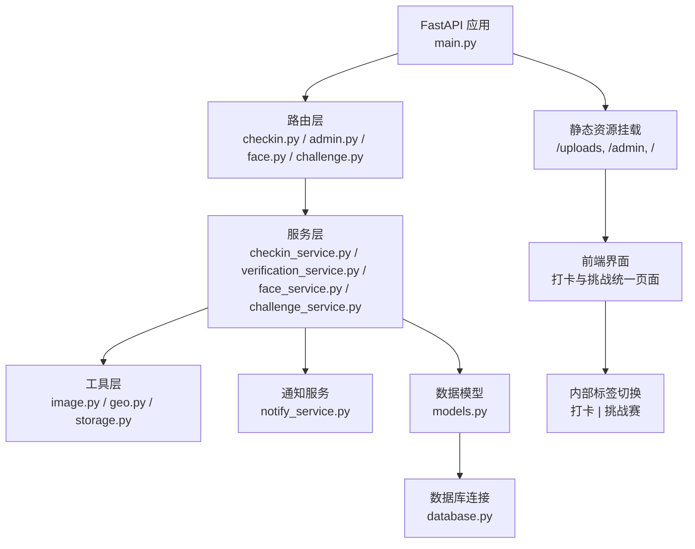
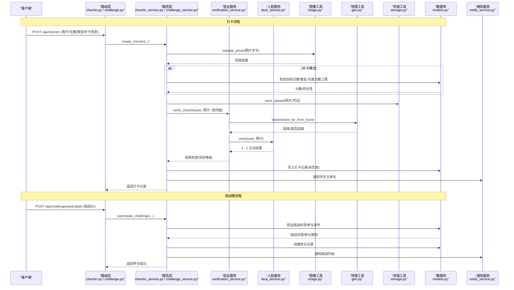
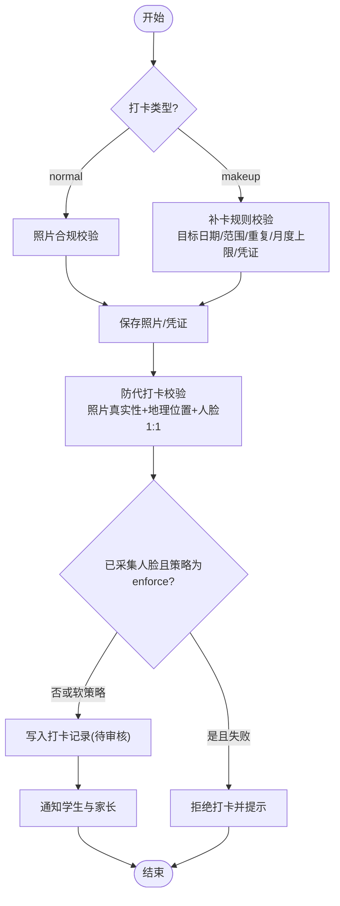
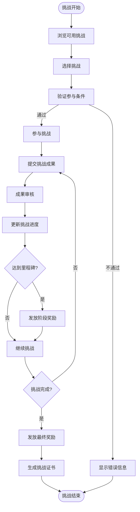
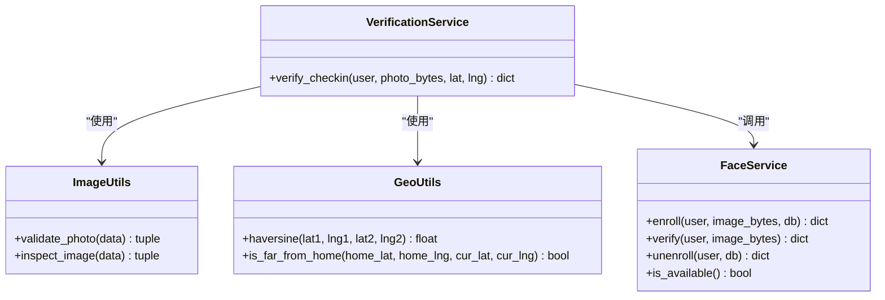
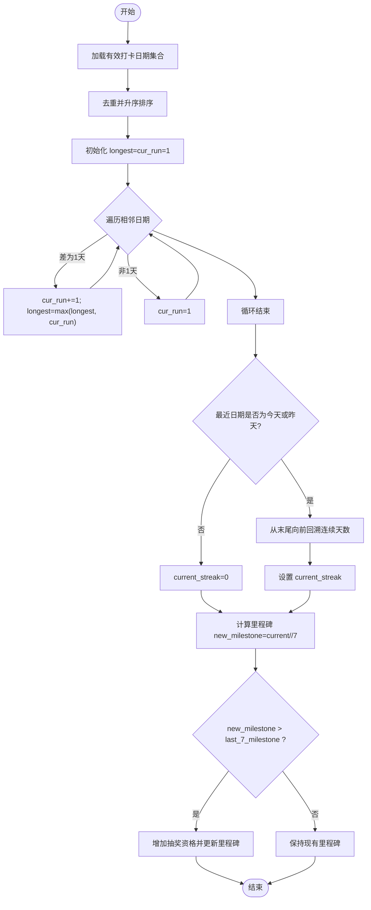
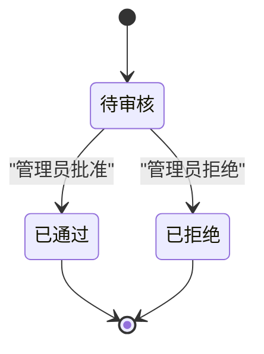
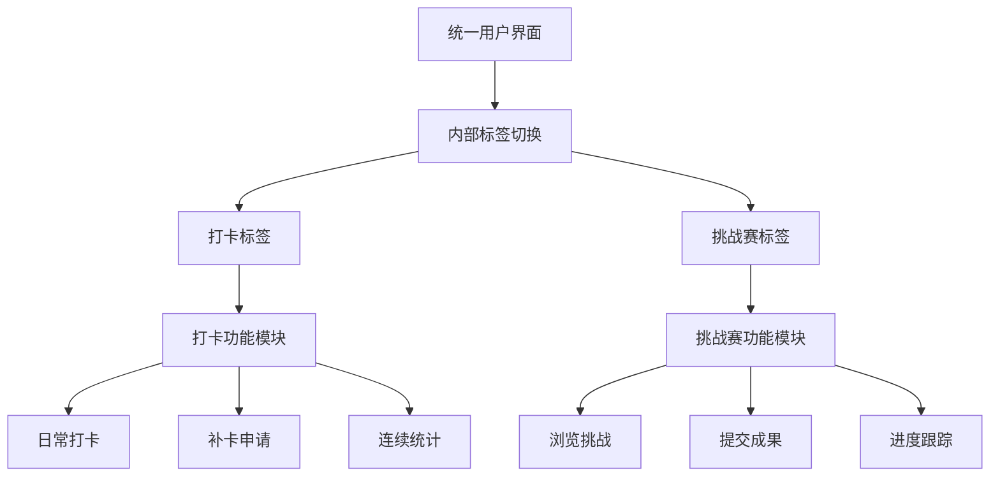
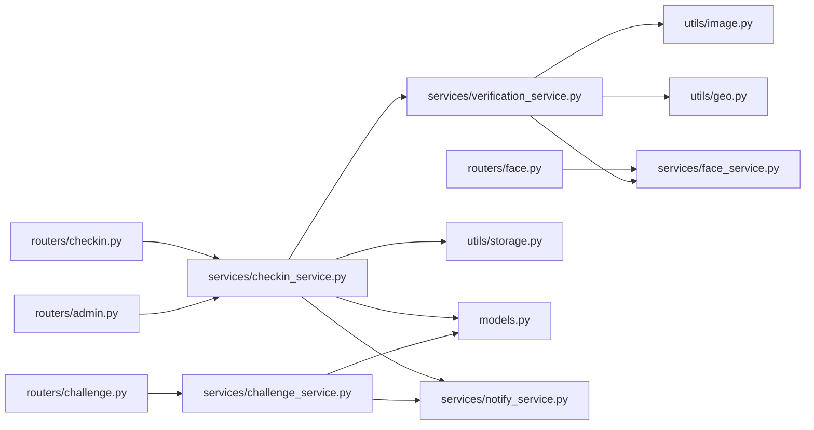

# 打卡管理系统

<cite>
**本文引用的文件**   
- [backend/app/main.py](file://summer-homework-checkin/backend/app/main.py)
- [backend/app/models.py](file://summer-homework-checkin/backend/app/models.py)
- [backend/app/schemas.py](file://summer-homework-checkin/backend/app/schemas.py)
- [backend/app/config.py](file://summer-homework-checkin/backend/app/config.py)
- [backend/app/database.py](file://summer-homework-checkin/backend/app/database.py)
- [backend/app/routers/checkin.py](file://summer-homework-checkin/backend/app/routers/checkin.py)
- [backend/app/routers/admin.py](file://summer-homework-checkin/backend/app/routers/admin.py)
- [backend/app/routers/face.py](file://summer-homework-checkin/backend/app/routers/face.py)
- [backend/app/routers/challenge.py](file://summer-homework-checkin/backend/app/routers/challenge.py)
- [backend/app/services/checkin_service.py](file://summer-homework-checkin/backend/app/services/checkin_service.py)
- [backend/app/services/verification_service.py](file://summer-homework-checkin/backend/app/services/verification_service.py)
- [backend/app/services/face_service.py](file://summer-homework-checkin/backend/app/services/face_service.py)
- [backend/app/services/challenge_service.py](file://summer-homework-checkin/backend/app/services/challenge_service.py)
- [backend/app/utils/image.py](file://summer-homework-checkin/backend/app/utils/image.py)
- [backend/app/utils/geo.py](file://summer-homework-checkin/backend/app/utils/geo.py)
- [backend/app/utils/storage.py](file://summer-homework-checkin/backend/app/utils/storage.py)
- [backend/app/services/notify_service.py](file://summer-homework-checkin/backend/app/services/notify_service.py)
</cite>

## 更新摘要
**变更内容**   
- 新增挑战赛功能模块，与打卡管理功能整合到统一的"打卡与挑战"页面
- 实现前端内部标签切换机制，支持在单一页面中切换打卡和挑战赛功能
- 新增挑战赛的完整业务逻辑，包括挑战创建、参与、进度跟踪和奖励发放
- 更新路由层和服务层架构，支持双功能并行处理

## 目录
1. [简介](#简介)
2. [项目结构](#项目结构)
3. [核心组件](#核心组件)
4. [架构总览](#架构总览)
5. [详细组件分析](#详细组件分析)
6. [依赖关系分析](#依赖关系分析)
7. [性能与可扩展性](#性能与可扩展性)
8. [故障排查指南](#故障排查指南)
9. [结论](#结论)
10. [附录：API 接口说明](#附录api-接口说明)

## 简介
本技术文档面向"暑假作业打卡系统"的开发者与维护者，围绕正常打卡与补卡两种模式，系统性阐述四重防作弊机制（照片合规校验、地理位置验证、人脸识别比对、场景风险判定）、连续打卡统计算法、审核流程状态转换、积分发放与抽奖资格解锁规则，以及补卡业务规则的配置化管理。同时新增挑战赛功能，支持学生参与各种学习挑战活动，通过统一的前端界面实现打卡与挑战的双模式切换。文档提供完整的 API 接口说明与错误处理策略，帮助快速理解并扩展复杂的业务逻辑。

## 项目结构
后端采用 FastAPI + SQLAlchemy + SQLite 的轻量架构，路由层按功能划分，服务层封装核心业务，工具层提供图像解析、地理距离计算与文件存储能力。前端静态资源通过挂载方式提供服务，新增的挑战赛功能通过内部标签切换机制集成到统一界面。

图示来源
- [backend/app/main.py:1-49](file://summer-homework-checkin/backend/app/main.py#L1-L49)
- [backend/app/routers/checkin.py:1-80](file://summer-homework-checkin/backend/app/routers/checkin.py#L1-L80)
- [backend/app/routers/admin.py:1-214](file://summer-homework-checkin/backend/app/routers/admin.py#L1-L214)
- [backend/app/routers/face.py:1-45](file://summer-homework-checkin/backend/app/routers/face.py#L1-L45)
- [backend/app/routers/challenge.py:1-150](file://summer-homework-checkin/backend/app/routers/challenge.py#L1-L150)
- [backend/app/services/checkin_service.py:1-254](file://summer-homework-checkin/backend/app/services/checkin_service.py#L1-L254)
- [backend/app/services/verification_service.py:1-71](file://summer-homework-checkin/backend/app/services/verification_service.py#L1-L71)
- [backend/app/services/face_service.py:1-133](file://summer-homework-checkin/backend/app/services/face_service.py#L1-L133)
- [backend/app/services/challenge_service.py:1-200](file://summer-homework-checkin/backend/app/services/challenge_service.py#L1-L200)
- [backend/app/utils/image.py:1-61](file://summer-homework-checkin/backend/app/utils/image.py#L1-61)
- [backend/app/utils/geo.py:1-24](file://summer-homework-checkin/backend/app/utils/geo.py#L1-24)
- [backend/app/utils/storage.py:1-24](file://summer-homework-checkin/backend/app/utils/storage.py#L1-24)
- [backend/app/services/notify_service.py:1-20](file://summer-homework-checkin/backend/app/services/notify_service.py#L1-20)
- [backend/app/models.py:1-212](file://summer-homework-checkin/backend/app/models.py#L1-212)
- [backend/app/database.py:1-22](file://summer-homework-checkin/backend/app/database.py#L1-22)

章节来源
- [backend/app/main.py:1-49](file://summer-homework-checkin/backend/app/main.py#L1-49)

## 核心组件
- 路由层
  - 打卡路由：提交打卡、查询今日状态、连续天数统计、历史记录、通用图片上传。
  - 管理端路由：统计概览、用户列表、打卡记录列表、待审数量、打卡审核、兑换记录管理与审核。
  - 人脸路由：采集人脸底图、查询采集状态、撤销底图。
  - **新增** 挑战赛路由：挑战列表、参与挑战、提交挑战成果、挑战进度查询、排行榜。
- 服务层
  - 打卡服务：创建打卡（含照片校验、补卡规则、保存、防代打卡校验、通知）、审核通过/拒绝、连续天数重算与抽奖资格发放、今日状态聚合。
  - 验证服务：综合校验（照片真实性、地理位置一致性、人脸 1:1 比对），输出场景检查与风险等级。
  - 人脸服务：基于 insightface 的 1:1 本人比对（注册底图采集、比对、可用性探测）。
  - **新增** 挑战赛服务：挑战生命周期管理、参与验证、成果审核、进度跟踪、奖励发放。
  - 通知服务：站内通知写入与家长批量通知。
- 工具层
  - 图像工具：JPEG/PNG 尺寸解析与基础合规校验。
  - 地理工具：Haversine 距离计算与阈值判断。
  - 存储工具：统一上传路径生成与公开 URL 构造。
- 配置与数据
  - 配置项：地理阈值、补卡上限、照片体积/尺寸门槛、积分规则、人脸识别阈值与策略等。
  - 数据模型：用户、打卡记录、奖品、抽奖记录、兑换记录、通知、家长绑定、挑战、挑战参与记录等。

章节来源
- [backend/app/routers/checkin.py:1-80](file://summer-homework-checkin/backend/app/routers/checkin.py#L1-80)
- [backend/app/routers/admin.py:1-214](file://summer-homework-checkin/backend/app/routers/admin.py#L1-214)
- [backend/app/routers/face.py:1-45](file://summer-homework-checkin/backend/app/routers/face.py#L1-45)
- [backend/app/routers/challenge.py:1-150](file://summer-homework-checkin/backend/app/routers/challenge.py#L1-150)
- [backend/app/services/checkin_service.py:1-254](file://summer-homework-checkin/backend/app/services/checkin_service.py#L1-254)
- [backend/app/services/verification_service.py:1-71](file://summer-homework-checkin/backend/app/services/verification_service.py#L1-71)
- [backend/app/services/face_service.py:1-133](file://summer-homework-checkin/backend/app/services/face_service.py#L1-133)
- [backend/app/services/challenge_service.py:1-200](file://summer-homework-checkin/backend/app/services/challenge_service.py#L1-200)
- [backend/app/utils/image.py:1-61](file://summer-homework-checkin/backend/app/utils/image.py#L1-61)
- [backend/app/utils/geo.py:1-24](file://summer-homework-checkin/backend/app/utils/geo.py#L1-24)
- [backend/app/utils/storage.py:1-24](file://summer-homework-checkin/backend/app/utils/storage.py#L1-24)
- [backend/app/config.py:1-50](file://summer-homework-checkin/backend/app/config.py#L1-50)
- [backend/app/models.py:1-212](file://summer-homework-checkin/backend/app/models.py#L1-212)

## 架构总览
系统以 FastAPI 为入口，路由分发到服务层执行核心逻辑；服务层调用工具层完成图像解析、地理计算与文件存储，并通过通知服务推送消息；所有持久化操作通过 SQLAlchemy 会话访问 SQLite 数据库。新增的挑战赛功能通过独立的路由和服务层实现，与打卡功能共享基础设施。

图示来源
- [backend/app/routers/checkin.py:17-37](file://summer-homework-checkin/backend/app/routers/checkin.py#L17-37)
- [backend/app/routers/challenge.py:1-150](file://summer-homework-checkin/backend/app/routers/challenge.py#L1-150)
- [backend/app/services/checkin_service.py:64-163](file://summer-homework-checkin/backend/app/services/checkin_service.py#L64-163)
- [backend/app/services/challenge_service.py:1-200](file://summer-homework-checkin/backend/app/services/challenge_service.py#L1-200)
- [backend/app/services/verification_service.py:19-71](file://summer-homework-checkin/backend/app/services/verification_service.py#L19-71)
- [backend/app/services/face_service.py:99-125](file://summer-homework-checkin/backend/app/services/face_service.py#L99-125)
- [backend/app/utils/image.py:51-61](file://summer-homework-checkin/backend/app/utils/image.py#L51-61)
- [backend/app/utils/geo.py:6-24](file://summer-homework-checkin/backend/app/utils/geo.py#L6-24)
- [backend/app/utils/storage.py:7-16](file://summer-homework-checkin/backend/app/utils/storage.py#L7-16)
- [backend/app/models.py:70-96](file://summer-homework-checkin/backend/app/models.py#L70-96)
- [backend/app/services/notify_service.py:5-13](file://summer-homework-checkin/backend/app/services/notify_service.py#L5-13)

## 详细组件分析

### 正常打卡与补卡业务流程
- 正常打卡
  - 输入：照片、可选位置坐标、类型为 normal。
  - 校验：照片体积与格式、最小边长；若已采集人脸底图且人脸不通过则拒绝（可配置 enforce/soft）。
  - 记录：写入打卡记录，初始 review_status=pending、is_effective=False。
  - 通知：向学生与家长发送"等待审核"通知。
- 补卡
  - 输入：照片、可选位置坐标、类型为 makeup、补卡原因、补卡目标日期、补充凭证。
  - 规则：目标日期必须为过去且在暑假统计范围内；同一天不可重复有效打卡；单自然月补卡次数受配置限制；需上传凭证。
  - 其余流程与正常打卡一致。

图示来源
- [backend/app/services/checkin_service.py:64-163](file://summer-homework-checkin/backend/app/services/checkin_service.py#L64-163)
- [backend/app/services/verification_service.py:19-71](file://summer-homework-checkin/backend/app/services/verification_service.py#L19-71)
- [backend/app/services/face_service.py:99-125](file://summer-homework-checkin/backend/app/services/face_service.py#L99-125)
- [backend/app/utils/image.py:51-61](file://summer-homework-checkin/backend/app/utils/image.py#L51-61)
- [backend/app/utils/geo.py:19-24](file://summer-homework-checkin/backend/app/utils/geo.py#L19-24)
- [backend/app/utils/storage.py:7-16](file://summer-homework-checkin/backend/app/utils/storage.py#L7-16)

章节来源
- [backend/app/services/checkin_service.py:64-163](file://summer-homework-checkin/backend/app/services/checkin_service.py#L64-163)

### 挑战赛业务流程
- 挑战创建与管理
  - 管理员创建挑战，设置挑战名称、描述、时间范围、参与条件、奖励规则等。
  - 支持多种挑战类型：阅读挑战、运动挑战、技能挑战等。
- 挑战参与
  - 学生浏览可用挑战，点击参与按钮加入挑战。
  - 系统验证参与条件（年龄、年级、前置要求等）。
  - 创建参与记录，初始化挑战进度。
- 挑战成果提交
  - 学生定期提交挑战成果（照片、文字、链接等）。
  - 支持多媒体内容上传和验证。
  - 自动进行基础合规性检查。
- 挑战进度跟踪
  - 实时计算挑战完成度。
  - 显示里程碑达成情况。
  - 提供进度可视化展示。
- 挑战奖励发放
  - 根据挑战完成情况自动发放积分和奖励。
  - 支持阶段性奖励和最终奖励。
  - 生成挑战证书和成就徽章。

图示来源
- [backend/app/routers/challenge.py:1-150](file://summer-homework-checkin/backend/app/routers/challenge.py#L1-150)
- [backend/app/services/challenge_service.py:1-200](file://summer-homework-checkin/backend/app/services/challenge_service.py#L1-200)

章节来源
- [backend/app/routers/challenge.py:1-150](file://summer-homework-checkin/backend/app/routers/challenge.py#L1-150)
- [backend/app/services/challenge_service.py:1-200](file://summer-homework-checkin/backend/app/services/challenge_service.py#L1-200)

### 四重防作弊机制
- 照片合规性校验
  - 体积门槛与最大限制；支持 JPEG/PNG；最小边长限制，过滤占位图/缩略图。
- 地理位置验证
  - 计算打卡位置与学生常用位置的距离，超过阈值标记高风险。
- 人脸识别比对
  - 1:1 本人比对：采集正脸底图后，现场照与底图进行余弦相似度比较，低于阈值视为不匹配。
- 场景风险判定
  - 综合照片有效性、地理位置、人脸状态，给出 pass/warn 与 low/medium/high 风险等级，用于后续人工复核与拦截策略。

图示来源
- [backend/app/services/verification_service.py:19-71](file://summer-homework-checkin/backend/app/services/verification_service.py#L19-71)
- [backend/app/utils/image.py:34-61](file://summer-homework-checkin/backend/app/utils/image.py#L34-61)
- [backend/app/utils/geo.py:6-24](file://summer-homework-checkin/backend/app/utils/geo.py#L6-24)
- [backend/app/services/face_service.py:71-133](file://summer-homework-checkin/backend/app/services/face_service.py#L71-133)

章节来源
- [backend/app/services/verification_service.py:19-71](file://summer-homework-checkin/backend/app/services/verification_service.py#L19-71)
- [backend/app/utils/image.py:34-61](file://summer-homework-checkin/backend/app/utils/image.py#L34-61)
- [backend/app/utils/geo.py:6-24](file://summer-homework-checkin/backend/app/utils/geo.py#L6-24)
- [backend/app/services/face_service.py:71-133](file://summer-homework-checkin/backend/app/services/face_service.py#L71-133)

### 连续打卡统计算法
- 当前连续天数
  - 从有效打卡日期集合中，自最近日期向前回溯，若相邻日期差为 1 天则累计，否则中断。
  - 仅当最近有效日期为今天或昨天时，才计算当前连续；否则为 0。
- 历史最长连续天数
  - 对排序后的唯一日期序列扫描，维护当前运行长度与全局最大值。
- 里程碑与抽奖资格
  - 每达到 7 天连续，发放一次抽奖资格；中断后进度清零但已发放资格保留。

图示来源
- [backend/app/services/checkin_service.py:12-61](file://summer-homework-checkin/backend/app/services/checkin_service.py#L12-61)

章节来源
- [backend/app/services/checkin_service.py:12-61](file://summer-homework-checkin/backend/app/services/checkin_service.py#L12-61)

### 审核流程与状态转换
- 状态定义
  - pending：待审核
  - approved：已通过
  - rejected：已拒绝
- 管理员审批
  - 批准：标记 is_effective=True，发放积分（正常打卡/补卡不同分值），重算连续天数与抽奖资格，通知学生。
  - 拒绝：标记 is_effective=False，通知学生。
- 幂等保护
  - 重复批准/拒绝会返回错误，防止重复发放积分或重复拒绝。

图示来源
- [backend/app/models.py:70-96](file://summer-homework-checkin/backend/app/models.py#L70-96)
- [backend/app/services/checkin_service.py:166-209](file://summer-homework-checkin/backend/app/services/checkin_service.py#L166-209)
- [backend/app/routers/admin.py:84-103](file://summer-homework-checkin/backend/app/routers/admin.py#L84-103)

章节来源
- [backend/app/services/checkin_service.py:166-209](file://summer-homework-checkin/backend/app/services/checkin_service.py#L166-209)
- [backend/app/routers/admin.py:84-103](file://summer-homework-checkin/backend/app/routers/admin.py#L84-103)

### 积分发放与抽奖资格解锁
- 积分规则
  - 正常打卡通过后获得固定积分；补卡通过后获得较低积分，鼓励当日完成。
- 抽奖资格解锁
  - 连续有效打卡天数每达到 7 的倍数，自动发放对应数量的抽奖券，并发站内通知。
- 配置项
  - CHECKIN_POINTS、MAKEUP_POINTS、LOTTERY_STREAK_THRESHOLD 可通过环境变量覆盖。

章节来源
- [backend/app/config.py:34-39](file://summer-homework-checkin/backend/app/config.py#L34-39)
- [backend/app/services/checkin_service.py:39-61](file://summer-homework-checkin/backend/app/services/checkin_service.py#L39-61)
- [backend/app/services/checkin_service.py:166-191](file://summer-homework-checkin/backend/app/services/checkin_service.py#L166-191)

### 补卡业务规则的配置化管理
- 单月补卡次数限制
  - 按自然月统计该用户已审核通过的补卡记录数，超过 MAX_MAKEUP_PER_MONTH 则拒绝。
- 日期范围验证
  - 目标日期必须在暑假统计窗口内，且不得为未来日期。
- 重复校验
  - 同一日期若已有有效打卡，不允许重复补卡。
- 凭证要求
  - 补卡需上传补充作业完成凭证。

章节来源
- [backend/app/services/checkin_service.py:72-103](file://summer-homework-checkin/backend/app/services/checkin_service.py#L72-103)
- [backend/app/config.py:27-32](file://summer-homework-checkin/backend/app/config.py#L27-32)

### 人脸采集与比对
- 采集
  - 要求检测到且仅检测到一张人脸；成功后保存底图与 512 维 embedding，标记已采集。
- 比对
  - 现场照提取特征并与底图做余弦相似度比较，高于阈值即通过；多张人脸或未检测到人脸均视为不通过。
- 降级策略
  - 模型不可用时返回明确提示；在 enforce 模式下，已采集账号将拒绝打卡。

章节来源
- [backend/app/services/face_service.py:71-133](file://summer-homework-checkin/backend/app/services/face_service.py#L71-133)
- [backend/app/routers/face.py:14-45](file://summer-homework-checkin/backend/app/routers/face.py#L14-45)
- [backend/app/config.py:41-49](file://summer-homework-checkin/backend/app/config.py#L41-49)

### 统一界面与标签切换机制
- 前端架构
  - 采用单页应用架构，通过内部标签切换实现打卡和挑战赛功能的无缝切换。
  - 支持响应式设计，适配移动端和桌面端。
- 标签切换逻辑
  - 默认显示打卡页面，用户可切换到挑战赛页面。
  - 切换时保持用户状态和数据缓存。
  - 支持URL参数控制默认显示的标签。
- 用户体验优化
  - 异步加载各功能模块，提升页面响应速度。
  - 提供清晰的导航指示和操作反馈。
  - 支持书签分享特定功能页面。

图示来源
- [backend/app/main.py:1-49](file://summer-homework-checkin/backend/app/main.py#L1-49)

## 依赖关系分析
- 模块耦合
  - 路由层依赖服务层与依赖注入（用户、数据库会话）；服务层依赖工具层与模型；工具层无外部框架依赖。
  - **新增** 挑战赛模块与打卡模块相互独立，通过统一的路由层进行协调。
- 外部依赖
  - insightface 与 OpenCV 用于人脸检测与特征提取；SQLite 作为轻量数据库。
- 潜在循环
  - 未发现直接循环导入；服务层与工具层单向依赖。

图示来源
- [backend/app/routers/checkin.py:1-80](file://summer-homework-checkin/backend/app/routers/checkin.py#L1-80)
- [backend/app/routers/admin.py:1-214](file://summer-homework-checkin/backend/app/routers/admin.py#L1-214)
- [backend/app/routers/face.py:1-45](file://summer-homework-checkin/backend/app/routers/face.py#L1-45)
- [backend/app/routers/challenge.py:1-150](file://summer-homework-checkin/backend/app/routers/challenge.py#L1-150)
- [backend/app/services/checkin_service.py:1-254](file://summer-homework-checkin/backend/app/services/checkin_service.py#L1-254)
- [backend/app/services/verification_service.py:1-71](file://summer-homework-checkin/backend/app/services/verification_service.py#L1-71)
- [backend/app/services/face_service.py:1-133](file://summer-homework-checkin/backend/app/services/face_service.py#L1-133)
- [backend/app/services/challenge_service.py:1-200](file://summer-homework-checkin/backend/app/services/challenge_service.py#L1-200)
- [backend/app/utils/image.py:1-61](file://summer-homework-checkin/backend/app/utils/image.py#L1-61)
- [backend/app/utils/geo.py:1-24](file://summer-homework-checkin/backend/app/utils/geo.py#L1-24)
- [backend/app/utils/storage.py:1-24](file://summer-homework-checkin/backend/app/utils/storage.py#L1-24)
- [backend/app/services/notify_service.py:1-20](file://summer-homework-checkin/backend/app/services/notify_service.py#L1-20)
- [backend/app/models.py:1-212](file://summer-homework-checkin/backend/app/models.py#L1-212)

章节来源
- [backend/app/models.py:1-212](file://summer-homework-checkin/backend/app/models.py#L1-212)

## 性能与可扩展性
- 图像解析
  - 纯字节级解析 JPEG/PNG 尺寸，避免引入重型库，降低内存与启动开销。
- 人脸服务
  - 懒加载与线程锁保证首次按需下载模型与并发安全；CPU 模式部署便于容器化。
- 数据库
  - SQLite 适合轻量部署；高并发场景建议迁移至 PostgreSQL/MySQL 并添加索引（如 check_date、user_id、review_status）。
- 缓存与批处理
  - 连续天数重算可按事件驱动触发；报表统计可引入物化视图或定时任务。
- **新增** 挑战赛功能优化
  - 挑战列表分页加载，减少数据传输量。
  - 挑战进度异步计算，避免阻塞主流程。
  - 支持挑战模板复用，提高管理效率。

[本节为通用指导，无需代码引用]

## 故障排查指南
- 常见错误
  - 照片不符合要求：体积过小/过大、非 JPEG/PNG、尺寸过小。
  - 补卡规则冲突：目标日期无效、不在暑假范围、重复打卡、月度次数超限、缺少凭证。
  - 人脸问题：未采集底图、未检测到人脸、多张人脸、模型不可用、比对不通过。
  - 审核幂等：重复批准/拒绝导致重复积分或状态异常。
  - **新增** 挑战赛问题：挑战状态异常、参与条件验证失败、成果提交超时、奖励发放失败。
- 定位建议
  - 查看打卡记录的 scene_check、face_status、face_score、geo_flag 字段辅助诊断。
  - 检查配置文件中的阈值与策略参数。
  - 确认人脸服务可用性与模型下载路径。
  - **新增** 检查挑战表的 state 字段和参与记录的 progress 字段。

章节来源
- [backend/app/services/checkin_service.py:212-223](file://summer-homework-checkin/backend/app/services/checkin_service.py#L212-223)
- [backend/app/services/verification_service.py:19-71](file://summer-homework-checkin/backend/app/services/verification_service.py#L19-71)
- [backend/app/services/face_service.py:99-125](file://summer-homework-checkin/backend/app/services/face_service.py#L99-125)
- [backend/app/config.py:27-49](file://summer-homework-checkin/backend/app/config.py#L27-49)

## 结论
本系统通过照片合规、地理位置、人脸识别与场景风险判定的四重机制，结合严格的补卡规则与审核流程，构建了较为完善的防作弊体系。新增的挑战赛功能为学生提供了更多元化的学习激励方式，通过统一的前端界面实现了打卡与挑战的双模式无缝切换。连续打卡统计算法清晰可靠，积分与抽奖资格发放遵循明确的里程碑策略。整体架构简洁、模块化良好，便于扩展与维护。

[本节为总结，无需代码引用]

## 附录：API 接口说明

### 打卡相关
- POST /api/checkin
  - 功能：提交打卡（正常/补卡）
  - 表单字段：photo、proof（补卡凭证）、location_lat、location_lng、check_type、makeup_reason、makeup_for_date
  - 成功响应：CheckInOut
  - 错误码：400（参数/规则校验失败）、403（非学生）、503（人脸服务不可用）
- GET /api/checkin/today
  - 功能：查询今日打卡状态（是否已审核通过、是否有待审核、本月剩余补卡次数）
- GET /api/checkin/streak
  - 功能：获取连续天数、历史最长连续、有效打卡数、抽奖券、今日状态、本月剩余补卡次数
- GET /api/checkin/history
  - 功能：获取打卡历史（按时间倒序）
- POST /api/checkin/upload
  - 功能：通用图片上传（图片查看器使用），返回 photo_path 与 photo_url

章节来源
- [backend/app/routers/checkin.py:17-80](file://summer-homework-checkin/backend/app/routers/checkin.py#L17-80)

### 人脸相关
- POST /api/face/enroll
  - 功能：采集人脸底图（仅学生）
  - 成功响应：FaceEnrollOut
- GET /api/face/status
  - 功能：查询人脸底图采集状态
- DELETE /api/face/enroll
  - 功能：撤销人脸底图

章节来源
- [backend/app/routers/face.py:14-45](file://summer-homework-checkin/backend/app/routers/face.py#L14-45)

### 挑战赛相关
- GET /api/challenges
  - 功能：获取可用挑战列表（支持筛选和分页）
- POST /api/challenges/{id}/participate
  - 功能：参与指定挑战
  - 成功响应：ChallengeParticipation
- PUT /api/challenges/{id}/progress
  - 功能：更新挑战进度
- GET /api/challenges/{id}/status
  - 功能：查询挑战参与状态和进度
- GET /api/challenges/my-participations
  - 功能：获取我的挑战参与记录
- GET /api/challenges/rankings
  - 功能：获取挑战排行榜

章节来源
- [backend/app/routers/challenge.py:1-150](file://summer-homework-checkin/backend/app/routers/challenge.py#L1-150)

### 管理端相关
- GET /api/admin/stats
  - 功能：统计概览（学生/家长/有效打卡/绑定/地理风险/兑换状态/暑假窗口/挑战统计）
- GET /api/admin/users
  - 功能：用户列表（含关键统计字段）
- GET /api/admin/checkins
  - 功能：打卡记录列表（含用户昵称、审核状态、照片链接）
- GET /api/admin/checkins/pending-count
  - 功能：待审核打卡数量
- PUT /api/admin/checkins/{id}/review
  - 功能：审核打卡（approved/rejected），批准后自动发放积分并重算连续天数
- GET /api/admin/redemptions
  - 功能：兑换记录列表（支持按状态筛选）
- GET /api/admin/redemptions/{id}
  - 功能：兑换记录详情
- PUT /api/admin/redemptions/{id}/review
  - 功能：审核兑换（approve 标记 fulfilled；reject 退还积分）
- **新增** 挑战管理接口
  - GET /api/admin/challenges：获取挑战列表
  - POST /api/admin/challenges：创建新挑战
  - PUT /api/admin/challenges/{id}：更新挑战信息
  - DELETE /api/admin/challenges/{id}：删除挑战
  - GET /api/admin/challenges/{id}/participants：获取挑战参与者列表

章节来源
- [backend/app/routers/admin.py:16-214](file://summer-homework-checkin/backend/app/routers/admin.py#L16-214)

### 健康检查
- GET /api/health
  - 功能：服务健康检查

章节来源
- [backend/app/main.py:33-35](file://summer-homework-checkin/backend/app/main.py#L33-35)