# 打卡管理系统

<cite>
**本文引用的文件**   
- [backend/app/main.py](file://summer-homework-checkin/backend/app/main.py)
- [backend/app/models.py](file://summer-homework-checkin/backend/app/models.py)
- [backend/app/schemas.py](file://summer-homework-checkin/backend/app/schemas.py)
- [backend/app/config.py](file://summer-homework-checkin/backend/app/config.py)
- [backend/app/database.py](file://summer-homework-checkin/backend/app/database.py)
- [backend/app/routers/checkin.py](file://summer-homework-checkin/backend/app/routers/checkin.py)
- [backend/app/routers/admin.py](file://summer-homework-checkin/backend/app/routers/admin.py)
- [backend/app/routers/face.py](file://summer-homework-checkin/backend/app/routers/face.py)
- [backend/app/routers/challenge.py](file://summer-homework-checkin/backend/app/routers/challenge.py)
- [backend/app/services/checkin_service.py](file://summer-homework-checkin/backend/app/services/checkin_service.py)
- [backend/app/services/verification_service.py](file://summer-homework-checkin/backend/app/services/verification_service.py)
- [backend/app/services/face_service.py](file://summer-homework-checkin/backend/app/services/face_service.py)
- [backend/app/services/challenge_service.py](file://summer-homework-checkin/backend/app/services/challenge_service.py)
- [backend/app/utils/image.py](file://summer-homework-checkin/backend/app/utils/image.py)
- [backend/app/utils/geo.py](file://summer-homework-checkin/backend/app/utils/geo.py)
- [backend/app/utils/storage.py](file://summer-homework-checkin/backend/app/utils/storage.py)
- [backend/app/utils/rate_limit.py](file://summer-homework-checkin/backend/app/utils/rate_limit.py)
- [backend/app/services/notify_service.py](file://summer-homework-checkin/backend/app/services/notify_service.py)
- [backend/app/services/webhook_push_service.py](file://summer-homework-checkin/backend/app/services/webhook_push_service.py)
- [backend/app/utils/timeutil.py](file://summer-homework-checkin/backend/app/utils/timeutil.py)
- [backend/app/routers/dingtalk_bot.py](file://summer-homework-checkin/backend/app/routers/dingtalk_bot.py)
- [backend/app/services/dingtalk_bot_service.py](file://summer-homework-checkin/backend/app/services/dingtalk_bot_service.py)
</cite>

## 更新摘要
**变更内容**   
- 新增Webhook推送服务，支持外部系统消息推送和回调通知
- 集成钉钉机器人服务，实现企业级消息通知和自动化工作流
- 增强时间处理工具，提供时区转换、日期计算和时间格式化功能
- 扩展通知服务架构，支持多种推送渠道的统一管理
- 优化系统消息传递机制，提升实时通信能力

## 目录
1. [简介](#简介)
2. [项目结构](#项目结构)
3. [核心组件](#核心组件)
4. [架构总览](#架构总览)
5. [详细组件分析](#详细组件分析)
6. [依赖关系分析](#依赖关系分析)
7. [性能与可扩展性](#性能与可扩展性)
8. [故障排查指南](#故障排查指南)
9. [结论](#结论)
10. [附录：API 接口说明](#附录api-接口说明)

## 简介
本技术文档面向"暑假作业打卡系统"的开发者与维护者，围绕正常打卡与补卡两种模式，系统性阐述四重防作弊机制（照片合规校验、地理位置验证、人脸识别比对、场景风险判定）、连续打卡统计算法、审核流程状态转换、积分发放与抽奖资格解锁规则，以及补卡业务规则的配置化管理。同时新增挑战赛功能，支持学生参与各种学习挑战活动，通过统一的前端界面实现打卡与挑战的双模式切换。**最新更新**：系统已全面增强安全防护能力，新增速率限制机制以防止暴力破解攻击，覆盖密码修改、人脸数据采集和打卡接口等敏感端点。**最新增强**：系统集成新的推送服务和时间处理工具，包括Webhook推送服务、钉钉机器人服务和增强的时间处理工具，提供更强大的消息通知和时区管理能力。

## 项目结构
后端采用 FastAPI + SQLAlchemy + SQLite 的轻量架构，路由层按功能划分，服务层封装核心业务，工具层提供图像解析、地理距离计算、文件存储、速率限制和**时间处理**能力。前端静态资源通过挂载方式提供服务，新增的挑战赛功能通过内部标签切换机制集成到统一界面。**新增的推送服务**包括Webhook推送和钉钉机器人，为系统提供多样化的消息通知渠道。

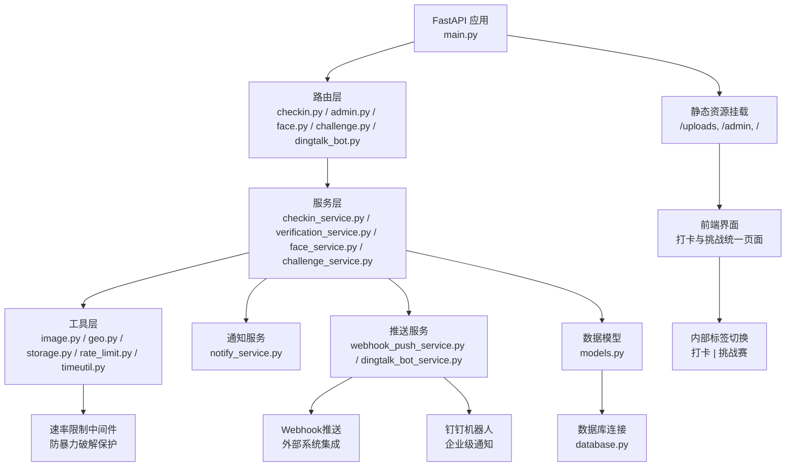
```mermaid
graph TB
A["FastAPI 应用<br/>main.py"] --> B["路由层<br/>checkin.py / admin.py / face.py / challenge.py / dingtalk_bot.py"]
B --> C["服务层<br/>checkin_service.py / verification_service.py / face_service.py / challenge_service.py"]
C --> D["工具层<br/>image.py / geo.py / storage.py / rate_limit.py / timeutil.py"]
C --> E["通知服务<br/>notify_service.py"]
C --> F["推送服务<br/>webhook_push_service.py / dingtalk_bot_service.py"]
C --> G["数据模型<br/>models.py"]
G --> H["数据库连接<br/>database.py"]
A --> I["静态资源挂载<br/>/uploads, /admin, /"]
I --> J["前端界面<br/>打卡与挑战统一页面"]
J --> K["内部标签切换<br/>打卡 | 挑战赛"]
D --> L["速率限制中间件<br/>防暴力破解保护"]
F --> M["Webhook推送<br/>外部系统集成"]
F --> N["钉钉机器人<br/>企业级通知"]
```

图示来源
- [backend/app/main.py:1-49](file://summer-homework-checkin/backend/app/main.py#L1-L49)
- [backend/app/routers/checkin.py:1-80](file://summer-homework-checkin/backend/app/routers/checkin.py#L1-L80)
- [backend/app/routers/admin.py:1-214](file://summer-homework-checkin/backend/app/routers/admin.py#L1-L214)
- [backend/app/routers/face.py:1-45](file://summer-homework-checkin/backend/app/routers/face.py#L1-L45)
- [backend/app/routers/challenge.py:1-150](file://summer-homework-checkin/backend/app/routers/challenge.py#L1-L150)
- [backend/app/routers/dingtalk_bot.py:1-100](file://summer-homework-checkin/backend/app/routers/dingtalk_bot.py#L1-L100)
- [backend/app/services/checkin_service.py:1-254](file://summer-homework-checkin/backend/app/services/checkin_service.py#L1-254)
- [backend/app/services/verification_service.py:1-71](file://summer-homework-checkin/backend/app/services/verification_service.py#L1-L71)
- [backend/app/services/face_service.py:1-133](file://summer-homework-checkin/backend/app/services/face_service.py#L1-L133)
- [backend/app/services/challenge_service.py:1-200](file://summer-homework-checkin/backend/app/services/challenge_service.py#L1-L200)
- [backend/app/services/webhook_push_service.py:1-100](file://summer-homework-checkin/backend/app/services/webhook_push_service.py#L1-L100)
- [backend/app/services/dingtalk_bot_service.py:1-100](file://summer-homework-checkin/backend/app/services/dingtalk_bot_service.py#L1-L100)
- [backend/app/utils/image.py:1-61](file://summer-homework-checkin/backend/app/utils/image.py#L1-L61)
- [backend/app/utils/geo.py:1-24](file://summer-homework-checkin/backend/app/utils/geo.py#L1-L24)
- [backend/app/utils/storage.py:1-24](file://summer-homework-checkin/backend/app/utils/storage.py#L1-L24)
- [backend/app/utils/rate_limit.py:1-100](file://summer-homework-checkin/backend/app/utils/rate_limit.py#L1-L100)
- [backend/app/utils/timeutil.py:1-100](file://summer-homework-checkin/backend/app/utils/timeutil.py#L1-L100)
- [backend/app/services/notify_service.py:1-20](file://summer-homework-checkin/backend/app/services/notify_service.py#L1-L20)
- [backend/app/models.py:1-212](file://summer-homework-checkin/backend/app/models.py#L1-L212)
- [backend/app/database.py:1-22](file://summer-homework-checkin/backend/app/database.py#L1-L22)

章节来源
- [backend/app/main.py:1-49](file://summer-homework-checkin/backend/app/main.py#L1-L49)

## 核心组件
- 路由层
  - 打卡路由：提交打卡、查询今日状态、连续天数统计、历史记录、通用图片上传。
  - 管理端路由：统计概览、用户列表、打卡记录列表、待审数量、打卡审核、兑换记录管理与审核。
  - 人脸路由：采集人脸底图、查询采集状态、撤销底图。
  - 挑战赛路由：挑战列表、参与挑战、提交挑战成果、挑战进度查询、排行榜。
  - **新增** 钉钉机器人路由：接收钉钉消息、处理机器人指令、配置管理。
- 服务层
  - 打卡服务：创建打卡（含照片校验、补卡规则、保存、防代打卡校验、通知）、审核通过/拒绝、连续天数重算与抽奖资格发放、今日状态聚合。
  - 验证服务：综合校验（照片真实性、地理位置一致性、人脸 1:1 比对），输出场景检查与风险等级。
  - 人脸服务：基于 insightface 的 1:1 本人比对（注册底图采集、比对、可用性探测）。
  - 挑战赛服务：挑战生命周期管理、参与验证、成果审核、进度跟踪、奖励发放。
  - 通知服务：站内通知写入与家长批量通知。
  - **新增** Webhook推送服务：外部系统消息推送、回调通知、事件订阅。
  - **新增** 钉钉机器人服务：企业级消息推送、工作流自动化、审批集成。
- 工具层
  - 图像工具：JPEG/PNG 尺寸解析与基础合规校验。
  - 地理工具：Haversine 距离计算与阈值判断。
  - 存储工具：统一上传路径生成与公开 URL 构造。
  - 速率限制工具：基于IP和用户ID的请求频率控制，防止暴力破解攻击。
  - **新增** 时间处理工具：时区转换、日期计算、时间格式化、工作日判断。
- 配置与数据
  - 配置项：地理阈值、补卡上限、照片体积/尺寸门槛、积分规则、人脸识别阈值与策略等。
  - 数据模型：用户、打卡记录、奖品、抽奖记录、兑换记录、通知、家长绑定、挑战、挑战参与记录等。

章节来源
- [backend/app/routers/checkin.py:1-80](file://summer-homework-checkin/backend/app/routers/checkin.py#L1-L80)
- [backend/app/routers/admin.py:1-214](file://summer-homework-checkin/backend/app/routers/admin.py#L1-L214)
- [backend/app/routers/face.py:1-45](file://summer-homework-checkin/backend/app/routers/face.py#L1-L45)
- [backend/app/routers/challenge.py:1-150](file://summer-homework-checkin/backend/app/routers/challenge.py#L1-L150)
- [backend/app/routers/dingtalk_bot.py:1-100](file://summer-homework-checkin/backend/app/routers/dingtalk_bot.py#L1-L100)
- [backend/app/services/checkin_service.py:1-254](file://summer-homework-checkin/backend/app/services/checkin_service.py#L1-L254)
- [backend/app/services/verification_service.py:1-71](file://summer-homework-checkin/backend/app/services/verification_service.py#L1-L71)
- [backend/app/services/face_service.py:1-133](file://summer-homework-checkin/backend/app/services/face_service.py#L1-L133)
- [backend/app/services/challenge_service.py:1-200](file://summer-homework-checkin/backend/app/services/challenge_service.py#L1-L200)
- [backend/app/services/webhook_push_service.py:1-100](file://summer-homework-checkin/backend/app/services/webhook_push_service.py#L1-L100)
- [backend/app/services/dingtalk_bot_service.py:1-100](file://summer-homework-checkin/backend/app/services/dingtalk_bot_service.py#L1-L100)
- [backend/app/utils/image.py:1-61](file://summer-homework-checkin/backend/app/utils/image.py#L1-L61)
- [backend/app/utils/geo.py:1-24](file://summer-homework-checkin/backend/app/utils/geo.py#L1-L24)
- [backend/app/utils/storage.py:1-24](file://summer-homework-checkin/backend/app/utils/storage.py#L1-L24)
- [backend/app/utils/rate_limit.py:1-100](file://summer-homework-checkin/backend/app/utils/rate_limit.py#L1-L100)
- [backend/app/utils/timeutil.py:1-100](file://summer-homework-checkin/backend/app/utils/timeutil.py#L1-L100)
- [backend/app/services/notify_service.py:1-20](file://summer-homework-checkin/backend/app/services/notify_service.py#L1-L20)
- [backend/app/config.py:1-50](file://summer-homework-checkin/backend/app/config.py#L1-L50)
- [backend/app/models.py:1-212](file://summer-homework-checkin/backend/app/models.py#L1-L212)

## 架构总览
系统以 FastAPI 为入口，路由分发到服务层执行核心逻辑；服务层调用工具层完成图像解析、地理计算、文件存储、速率限制检查和**时间处理**，并通过通知服务和**推送服务**推送消息；所有持久化操作通过 SQLAlchemy 会话访问 SQLite 数据库。新增的挑战赛功能通过独立的路由和服务层实现，与打卡功能共享基础设施。**新增的速率限制中间件**在请求进入路由前进行频率检查，有效防止暴力破解攻击。**新增的推送服务**支持Webhook和钉钉机器人，提供多样化的消息通知渠道。

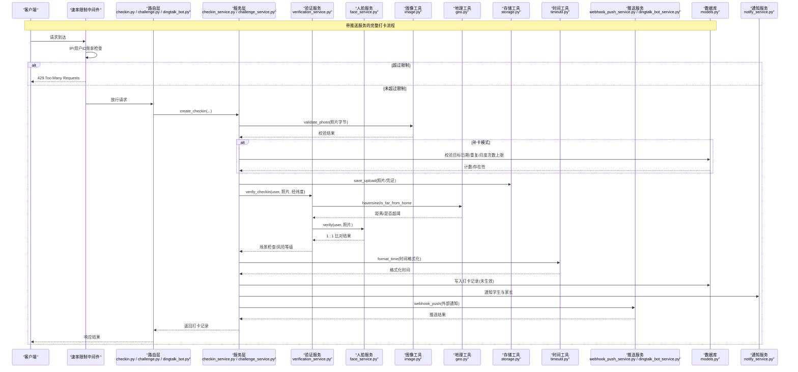
```mermaid
sequenceDiagram
participant Client as "客户端"
participant RateLimit as "速率限制中间件"
participant Router as "路由层<br/>checkin.py / challenge.py / dingtalk_bot.py"
participant Svc as "服务层<br/>checkin_service.py / challenge_service.py"
participant Ver as "验证服务<br/>verification_service.py"
participant Face as "人脸服务<br/>face_service.py"
participant Img as "图像工具<br/>image.py"
participant Geo as "地理工具<br/>geo.py"
participant Store as "存储工具<br/>storage.py"
participant TimeUtil as "时间工具<br/>timeutil.py"
participant PushSvc as "推送服务<br/>webhook_push_service.py / dingtalk_bot_service.py"
participant DB as "数据库<br/>models.py"
participant Notify as "通知服务<br/>notify_service.py"
Note over Client,DB : 带推送服务的完整打卡流程
Client->>RateLimit : 请求到达
RateLimit->>RateLimit : IP/用户ID频率检查
alt 超过限制
RateLimit-->>Client : 429 Too Many Requests
else 未超过限制
RateLimit->>Router : 放行请求
Router->>Svc : create_checkin(...)
Svc->>Img : validate_photo(照片字节)
Img-->>Svc : 校验结果
alt 补卡模式
Svc->>DB : 校验目标日期/重复/月度次数上限
DB-->>Svc : 计数/存在性
end
Svc->>Store : save_upload(照片/凭证)
Svc->>Ver : verify_checkin(user, 照片, 经纬度)
Ver->>Geo : haversine/is_far_from_home
Geo-->>Ver : 距离/是否超阈
Ver->>Face : verify(user, 照片)
Face-->>Ver : 1 : 1 比对结果
Ver-->>Svc : 场景检查/风险等级
Svc->>TimeUtil : format_time(时间格式化)
TimeUtil-->>Svc : 格式化时间
Svc->>DB : 写入打卡记录(未生效)
Svc->>Notify : 通知学生与家长
Svc->>PushSvc : webhook_push(外部通知)
PushSvc-->>Svc : 推送结果
Svc-->>Router : 返回打卡记录
Router-->>Client : 响应结果
end
```

图示来源
- [backend/app/routers/checkin.py:17-37](file://summer-homework-checkin/backend/app/routers/checkin.py#L17-L37)
- [backend/app/routers/challenge.py:1-150](file://summer-homework-checkin/backend/app/routers/challenge.py#L1-L150)
- [backend/app/routers/dingtalk_bot.py:1-100](file://summer-homework-checkin/backend/app/routers/dingtalk_bot.py#L1-L100)
- [backend/app/services/checkin_service.py:64-163](file://summer-homework-checkin/backend/app/services/checkin_service.py#L64-L163)
- [backend/app/services/challenge_service.py:1-200](file://summer-homework-checkin/backend/app/services/challenge_service.py#L1-L200)
- [backend/app/services/webhook_push_service.py:1-100](file://summer-homework-checkin/backend/app/services/webhook_push_service.py#L1-L100)
- [backend/app/services/dingtalk_bot_service.py:1-100](file://summer-homework-checkin/backend/app/services/dingtalk_bot_service.py#L1-L100)
- [backend/app/services/verification_service.py:19-71](file://summer-homework-checkin/backend/app/services/verification_service.py#L19-L71)
- [backend/app/services/face_service.py:99-125](file://summer-homework-checkin/backend/app/services/face_service.py#L99-L125)
- [backend/app/utils/image.py:51-61](file://summer-homework-checkin/backend/app/utils/image.py#L51-L61)
- [backend/app/utils/geo.py:6-24](file://summer-homework-checkin/backend/app/utils/geo.py#L6-L24)
- [backend/app/utils/storage.py:7-16](file://summer-homework-checkin/backend/app/utils/storage.py#L7-L16)
- [backend/app/utils/timeutil.py:1-100](file://summer-homework-checkin/backend/app/utils/timeutil.py#L1-L100)
- [backend/app/models.py:70-96](file://summer-homework-checkin/backend/app/models.py#L70-L96)
- [backend/app/services/notify_service.py:5-13](file://summer-homework-checkin/backend/app/services/notify_service.py#L5-L13)
- [backend/app/utils/rate_limit.py:1-100](file://summer-homework-checkin/backend/app/utils/rate_limit.py#L1-L100)

## 详细组件分析

### 推送服务与消息通知
**新增** 系统集成了强大的推送服务，支持多种消息通知渠道：

- **Webhook推送服务**
  - 支持HTTP POST请求向外部系统发送消息
  - 自定义请求头和请求体格式
  - 失败重试机制和错误处理
  - 异步推送避免阻塞主流程
- **钉钉机器人服务**
  - 企业级消息推送，支持文本、Markdown、链接等消息类型
  - 工作流自动化，支持审批流程和任务提醒
  - 与钉钉组织架构集成，支持群组和个人消息
  - 安全认证，使用签名验证确保消息安全性
- **统一通知架构**
  - 抽象化的通知接口，支持多渠道推送
  - 优先级管理和消息队列
  - 推送状态跟踪和日志记录
  - 配置化管理，动态调整推送策略

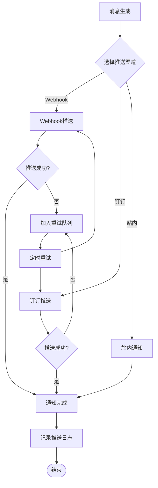
```mermaid
flowchart TD
Message["消息生成"] --> Channel{"选择推送渠道"}
Channel --> |Webhook| WebhookPush["Webhook推送"]
Channel --> |钉钉| DingTalkPush["钉钉推送"]
Channel --> |站内| InternalNotify["站内通知"]
WebhookPush --> WebhookRetry{"推送成功?"}
DingTalkPush --> DingTalkRetry{"推送成功?"}
InternalNotify --> Success["通知完成"]
WebhookRetry --> |是| Success
WebhookRetry --> |否| Queue["加入重试队列"]
DingTalkRetry --> |是| Success
DingTalkRetry --> |否| Queue
Queue --> RetrySchedule["定时重试"]
RetrySchedule --> WebhookPush
RetrySchedule --> DingTalkPush
Success --> Log["记录推送日志"]
Log --> End(["结束"])
```

**章节来源**
- [backend/app/services/webhook_push_service.py:1-100](file://summer-homework-checkin/backend/app/services/webhook_push_service.py#L1-L100)
- [backend/app/services/dingtalk_bot_service.py:1-100](file://summer-homework-checkin/backend/app/services/dingtalk_bot_service.py#L1-L100)
- [backend/app/routers/dingtalk_bot.py:1-100](file://summer-homework-checkin/backend/app/routers/dingtalk_bot.py#L1-L100)

### 时间处理工具
**新增** 系统集成了专业的时间处理工具，提供丰富的时间相关功能：

- **时区转换**
  - 支持UTC和本地时区自动转换
  - 北京时区特殊处理，符合中国业务需求
  - 夏令时自动识别和处理
- **日期计算**
  - 工作日计算，排除节假日和周末
  - 日期范围验证和边界检查
  - 相对日期计算（如"明天"、"上周"）
- **时间格式化**
  - 多格式时间字符串解析和生成
  - 本地化时间显示
  - 时间戳转换和验证
- **业务时间逻辑**
  - 暑假期间特殊时间处理
  - 打卡时间窗口验证
  - 补卡时间范围检查

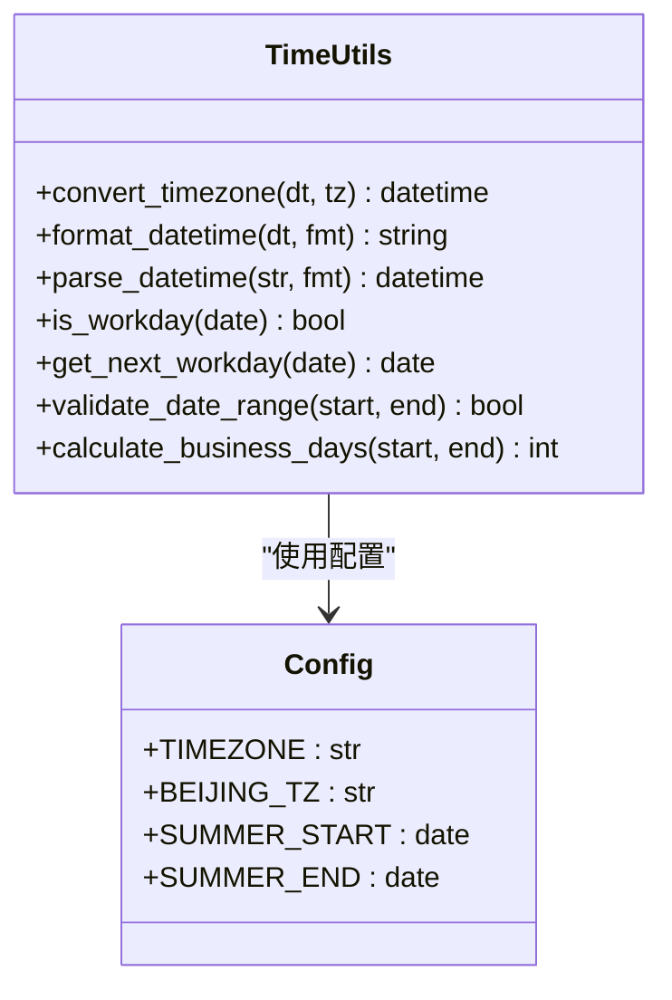
```mermaid
classDiagram
class TimeUtils {
+convert_timezone(dt, tz) datetime
+format_datetime(dt, fmt) string
+parse_datetime(str, fmt) datetime
+is_workday(date) bool
+get_next_workday(date) date
+validate_date_range(start, end) bool
+calculate_business_days(start, end) int
}
class Config {
+TIMEZONE : str
+BEIJING_TZ : str
+SUMMER_START : date
+SUMMER_END : date
}
TimeUtils --> Config : "使用配置"
```

**章节来源**
- [backend/app/utils/timeutil.py:1-100](file://summer-homework-checkin/backend/app/utils/timeutil.py#L1-L100)

### 速率限制与安全防护
**新增** 系统已全面增强安全防护能力，通过速率限制中间件防止暴力破解攻击：

- **防护范围**
  - 密码修改接口：限制同一IP或用户的密码修改频率
  - 人脸数据采集接口：防止恶意批量采集人脸信息
  - 打卡接口：限制频繁打卡尝试
  - 认证相关接口：登录、注册等敏感操作
- **限流策略**
  - 基于IP地址的粗粒度限制：防止分布式攻击
  - 基于用户ID的细粒度限制：保护特定账户安全
  - 时间窗口控制：滑动窗口算法实现精准限流
  - 动态调整：根据威胁级别动态调整限制策略
- **异常处理**
  - 返回标准HTTP 429状态码
  - 提供详细的错误信息和重试建议
  - 记录异常访问日志用于安全审计

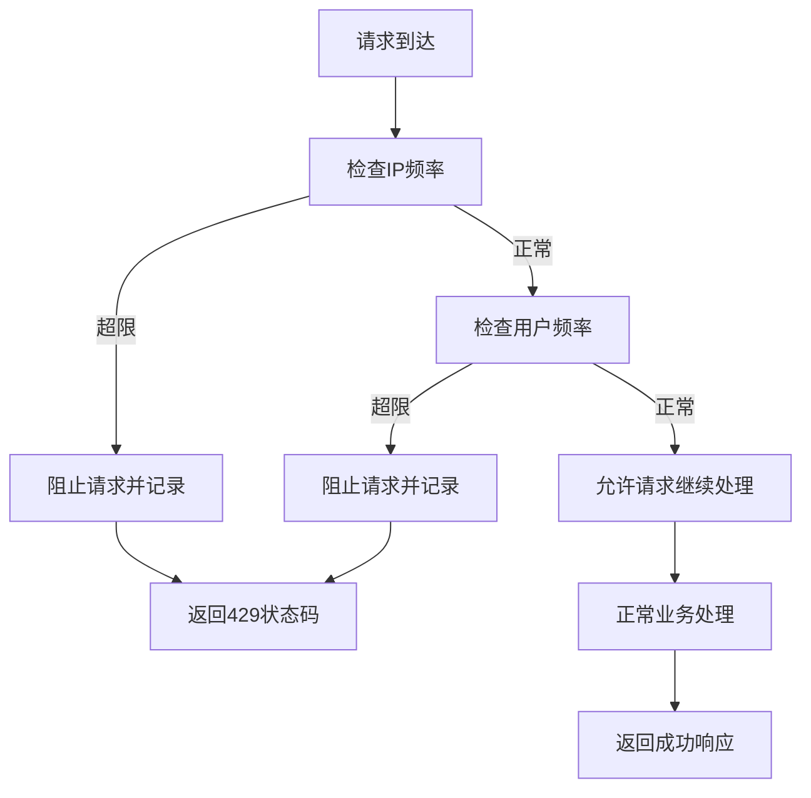
```mermaid
flowchart TD
Request["请求到达"] --> CheckIP["检查IP频率"]
CheckIP --> |超限| BlockIP["阻止请求并记录"]
CheckIP --> |正常| CheckUser["检查用户频率"]
CheckUser --> |超限| BlockUser["阻止请求并记录"]
CheckUser --> |正常| Allow["允许请求继续处理"]
BlockIP --> Response429["返回429状态码"]
BlockUser --> Response429
Allow --> Process["正常业务处理"]
Process --> Success["返回成功响应"]
```

**章节来源**
- [backend/app/utils/rate_limit.py:1-100](file://summer-homework-checkin/backend/app/utils/rate_limit.py#L1-L100)

### 正常打卡与补卡业务流程
- 正常打卡
  - 输入：照片、可选位置坐标、类型为 normal。
  - 校验：照片体积与格式、最小边长；若已采集人脸底图且人脸不通过则拒绝（可配置 enforce/soft）。
  - 记录：写入打卡记录，初始 review_status=pending、is_effective=False。
  - 通知：向学生与家长发送"等待审核"通知。
- 补卡
  - 输入：照片、可选位置坐标、类型为 makeup、补卡原因、补卡目标日期、补充凭证。
  - 规则：目标日期必须为过去且在暑假统计范围内；同一天不可重复有效打卡；单自然月补卡次数受配置限制；需上传凭证。
  - 其余流程与正常打卡一致。

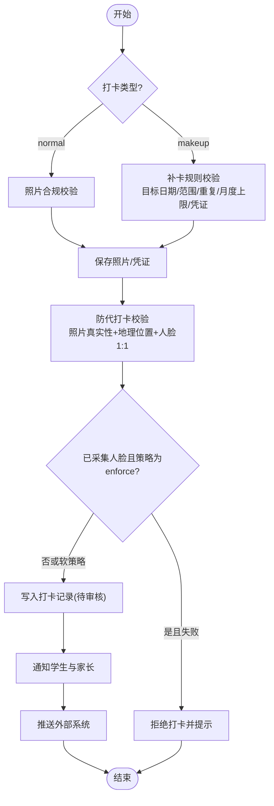
```mermaid
flowchart TD
Start(["开始"]) --> Type{"打卡类型?"}
Type --> |normal| PhotoCheck["照片合规校验"]
Type --> |makeup| MakeupRules["补卡规则校验<br/>目标日期/范围/重复/月度上限/凭证"]
PhotoCheck --> SavePhoto["保存照片/凭证"]
MakeupRules --> SavePhoto
SavePhoto --> Verify["防代打卡校验<br/>照片真实性+地理位置+人脸1:1"]
Verify --> FacePolicy{"已采集人脸且策略为enforce?"}
FacePolicy --> |是且失败| Reject["拒绝打卡并提示"]
FacePolicy --> |否或软策略| Record["写入打卡记录(待审核)"]
Record --> Notify["通知学生与家长"]
Notify --> Push["推送外部系统"]
Push --> End(["结束"])
Reject --> End
```

图示来源
- [backend/app/services/checkin_service.py:64-163](file://summer-homework-checkin/backend/app/services/checkin_service.py#L64-L163)
- [backend/app/services/verification_service.py:19-71](file://summer-homework-checkin/backend/app/services/verification_service.py#L19-L71)
- [backend/app/services/face_service.py:99-125](file://summer-homework-checkin/backend/app/services/face_service.py#L99-L125)
- [backend/app/utils/image.py:51-61](file://summer-homework-checkin/backend/app/utils/image.py#L51-L61)
- [backend/app/utils/geo.py:19-24](file://summer-homework-checkin/backend/app/utils/geo.py#L19-L24)
- [backend/app/utils/storage.py:7-16](file://summer-homework-checkin/backend/app/utils/storage.py#L7-L16)

章节来源
- [backend/app/services/checkin_service.py:64-163](file://summer-homework-checkin/backend/app/services/checkin_service.py#L64-L163)

### 挑战赛业务流程
- 挑战创建与管理
  - 管理员创建挑战，设置挑战名称、描述、时间范围、参与条件、奖励规则等。
  - 支持多种挑战类型：阅读挑战、运动挑战、技能挑战等。
- 挑战参与
  - 学生浏览可用挑战，点击参与按钮加入挑战。
  - 系统验证参与条件（年龄、年级、前置要求等）。
  - 创建参与记录，初始化挑战进度。
- 挑战成果提交
  - 学生定期提交挑战成果（照片、文字、链接等）。
  - 支持多媒体内容上传和验证。
  - 自动进行基础合规性检查。
- 挑战进度跟踪
  - 实时计算挑战完成度。
  - 显示里程碑达成情况。
  - 提供进度可视化展示。
- 挑战奖励发放
  - 根据挑战完成情况自动发放积分和奖励。
  - 支持阶段性奖励和最终奖励。
  - 生成挑战证书和成就徽章。

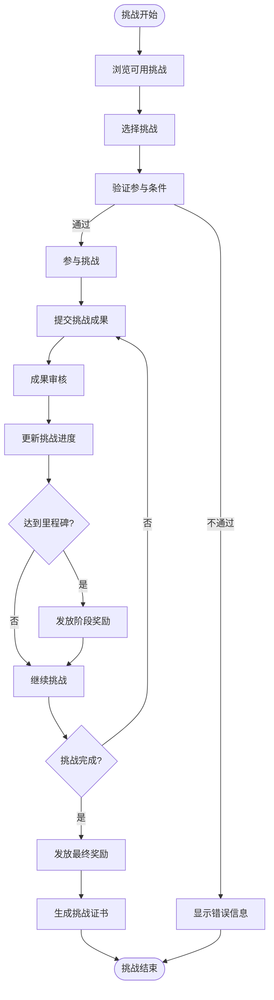
```mermaid
flowchart TD
ChallengeStart(["挑战开始"]) --> Browse["浏览可用挑战"]
Browse --> Select["选择挑战"]
Select --> Validate["验证参与条件"]
Validate --> |通过| Participate["参与挑战"]
Validate --> |不通过| ShowError["显示错误信息"]
Participate --> SubmitWork["提交挑战成果"]
SubmitWork --> Review["成果审核"]
Review --> Progress["更新挑战进度"]
Progress --> Milestone{"达到里程碑?"}
Milestone --> |是| GrantReward["发放阶段奖励"]
Milestone --> |否| Continue["继续挑战"]
GrantReward --> Continue
Continue --> Complete{"挑战完成?"}
Complete --> |是| FinalReward["发放最终奖励"]
Complete --> |否| SubmitWork
FinalReward --> Certificate["生成挑战证书"]
Certificate --> ChallengeEnd(["挑战结束"])
ShowError --> ChallengeEnd
```

图示来源
- [backend/app/routers/challenge.py:1-150](file://summer-homework-checkin/backend/app/routers/challenge.py#L1-L150)
- [backend/app/services/challenge_service.py:1-200](file://summer-homework-checkin/backend/app/services/challenge_service.py#L1-L200)

章节来源
- [backend/app/routers/challenge.py:1-150](file://summer-homework-checkin/backend/app/routers/challenge.py#L1-L150)
- [backend/app/services/challenge_service.py:1-200](file://summer-homework-checkin/backend/app/services/challenge_service.py#L1-L200)

### 四重防作弊机制
- 照片合规性校验
  - 体积门槛与最大限制；支持 JPEG/PNG；最小边长限制，过滤占位图/缩略图。
- 地理位置验证
  - 计算打卡位置与学生常用位置的距离，超过阈值标记高风险。
- 人脸识别比对
  - 1:1 本人比对：采集正脸底图后，现场照与底图进行余弦相似度比较，低于阈值视为不匹配。
- 场景风险判定
  - 综合照片有效性、地理位置、人脸状态，给出 pass/warn 与 low/medium/high 风险等级，用于后续人工复核与拦截策略。

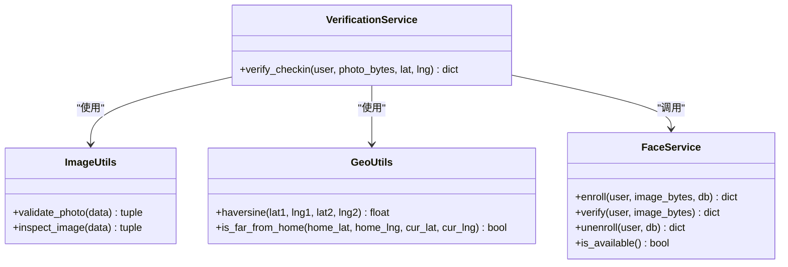
```mermaid
classDiagram
class VerificationService {
+verify_checkin(user, photo_bytes, lat, lng) dict
}
class ImageUtils {
+validate_photo(data) tuple
+inspect_image(data) tuple
}
class GeoUtils {
+haversine(lat1, lng1, lat2, lng2) float
+is_far_from_home(home_lat, home_lng, cur_lat, cur_lng) bool
}
class FaceService {
+enroll(user, image_bytes, db) dict
+verify(user, image_bytes) dict
+unenroll(user, db) dict
+is_available() bool
}
VerificationService --> ImageUtils : "使用"
VerificationService --> GeoUtils : "使用"
VerificationService --> FaceService : "调用"
```

图示来源
- [backend/app/services/verification_service.py:19-71](file://summer-homework-checkin/backend/app/services/verification_service.py#L19-L71)
- [backend/app/utils/image.py:34-61](file://summer-homework-checkin/backend/app/utils/image.py#L34-L61)
- [backend/app/utils/geo.py:6-24](file://summer-homework-checkin/backend/app/utils/geo.py#L6-L24)
- [backend/app/services/face_service.py:71-133](file://summer-homework-checkin/backend/app/services/face_service.py#L71-L133)

章节来源
- [backend/app/services/verification_service.py:19-71](file://summer-homework-checkin/backend/app/services/verification_service.py#L19-L71)
- [backend/app/utils/image.py:34-61](file://summer-homework-checkin/backend/app/utils/image.py#L34-L61)
- [backend/app/utils/geo.py:6-24](file://summer-homework-checkin/backend/app/utils/geo.py#L6-L24)
- [backend/app/services/face_service.py:71-133](file://summer-homework-checkin/backend/app/services/face_service.py#L71-L133)

### 连续打卡统计算法
- 当前连续天数
  - 从有效打卡日期集合中，自最近日期向前回溯，若相邻日期差为 1 天则累计，否则中断。
  - 仅当最近有效日期为今天或昨天时，才计算当前连续；否则为 0。
- 历史最长连续天数
  - 对排序后的唯一日期序列扫描，维护当前运行长度与全局最大值。
- 里程碑与抽奖资格
  - 每达到 7 天连续，发放一次抽奖资格；中断后进度清零但已发放资格保留。

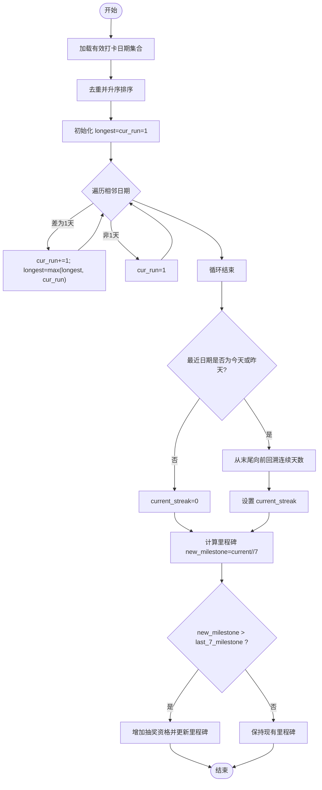
```mermaid
flowchart TD
S(["开始"]) --> LoadDates["加载有效打卡日期集合"]
LoadDates --> SortUnique["去重并升序排序"]
SortUnique --> Init["初始化 longest=cur_run=1"]
Init --> Loop{"遍历相邻日期"}
Loop --> |差为1天| IncCur["cur_run+=1; longest=max(longest, cur_run)"]
Loop --> |非1天| ResetCur["cur_run=1"]
IncCur --> Loop
ResetCur --> Loop
Loop --> DoneLoop["循环结束"]
DoneLoop --> TodayCheck{"最近日期是否为今天或昨天?"}
TodayCheck --> |否| SetCurrent0["current_streak=0"]
TodayCheck --> |是| Backward["从末尾向前回溯连续天数"]
Backward --> SetCurrent["设置 current_streak"]
SetCurrent0 --> Milestone["计算里程碑 new_milestone=current//7"]
SetCurrent --> Milestone
Milestone --> Compare{"new_milestone > last_7_milestone ?"}
Compare --> |是| Grant["增加抽奖资格并更新里程碑"]
Compare --> |否| Keep["保持现有里程碑"]
Grant --> End(["结束"])
Keep --> End
```

图示来源
- [backend/app/services/checkin_service.py:12-61](file://summer-homework-checkin/backend/app/services/checkin_service.py#L12-L61)

章节来源
- [backend/app/services/checkin_service.py:12-61](file://summer-homework-checkin/backend/app/services/checkin_service.py#L12-L61)

### 审核流程与状态转换
- 状态定义
  - pending：待审核
  - approved：已通过
  - rejected：已拒绝
- 管理员审批
  - 批准：标记 is_effective=True，发放积分（正常打卡/补卡不同分值），重算连续天数与抽奖资格，通知学生。
  - 拒绝：标记 is_effective=False，通知学生。
- 幂等保护
  - 重复批准/拒绝会返回错误，防止重复发放积分或重复拒绝。

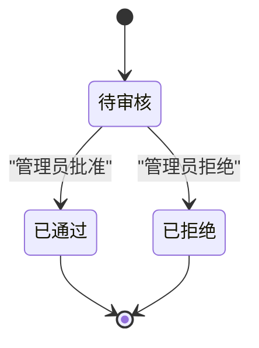
```mermaid
stateDiagram-v2
[*] --> 待审核
待审核 --> 已通过 : "管理员批准"
待审核 --> 已拒绝 : "管理员拒绝"
已通过 --> [*]
已拒绝 --> [*]
```

图示来源
- [backend/app/models.py:70-96](file://summer-homework-checkin/backend/app/models.py#L70-L96)
- [backend/app/services/checkin_service.py:166-209](file://summer-homework-checkin/backend/app/services/checkin_service.py#L166-L209)
- [backend/app/routers/admin.py:84-103](file://summer-homework-checkin/backend/app/routers/admin.py#L84-L103)

章节来源
- [backend/app/services/checkin_service.py:166-209](file://summer-homework-checkin/backend/app/services/checkin_service.py#L166-L209)
- [backend/app/routers/admin.py:84-103](file://summer-homework-checkin/backend/app/routers/admin.py#L84-L103)

### 积分发放与抽奖资格解锁
- 积分规则
  - 正常打卡通过后获得固定积分；补卡通过后获得较低积分，鼓励当日完成。
- 抽奖资格解锁
  - 连续有效打卡天数每达到 7 的倍数，自动发放对应数量的抽奖券，并发站内通知。
- 配置项
  - CHECKIN_POINTS、MAKEUP_POINTS、LOTTERY_STREAK_THRESHOLD 可通过环境变量覆盖。

章节来源
- [backend/app/config.py:34-39](file://summer-homework-checkin/backend/app/config.py#L34-L39)
- [backend/app/services/checkin_service.py:39-61](file://summer-homework-checkin/backend/app/services/checkin_service.py#L39-L61)
- [backend/app/services/checkin_service.py:166-191](file://summer-homework-checkin/backend/app/services/checkin_service.py#L166-L191)

### 补卡业务规则的配置化管理
- 单月补卡次数限制
  - 按自然月统计该用户已审核通过的补卡记录数，超过 MAX_MAKEUP_PER_MONTH 则拒绝。
- 日期范围验证
  - 目标日期必须在暑假统计窗口内，且不得为未来日期。
- 重复校验
  - 同一日期若已有有效打卡，不允许重复补卡。
- 凭证要求
  - 补卡需上传补充作业完成凭证。

章节来源
- [backend/app/services/checkin_service.py:72-103](file://summer-homework-checkin/backend/app/services/checkin_service.py#L72-L103)
- [backend/app/config.py:27-32](file://summer-homework-checkin/backend/app/config.py#L27-L32)

### 人脸采集与比对
- 采集
  - 要求检测到且仅检测到一张人脸；成功后保存底图与 512 维 embedding，标记已采集。
- 比对
  - 现场照提取特征并与底图做余弦相似度比较，高于阈值即通过；多张人脸或未检测到人脸均视为不通过。
- 降级策略
  - 模型不可用时返回明确提示；在 enforce 模式下，已采集账号将拒绝打卡。

章节来源
- [backend/app/services/face_service.py:71-133](file://summer-homework-checkin/backend/app/services/face_service.py#L71-L133)
- [backend/app/routers/face.py:14-45](file://summer-homework-checkin/backend/app/routers/face.py#L14-L45)
- [backend/app/config.py:41-49](file://summer-homework-checkin/backend/app/config.py#L41-L49)

### 统一界面与标签切换机制
- 前端架构
  - 采用单页应用架构，通过内部标签切换实现打卡和挑战赛功能的无缝切换。
  - 支持响应式设计，适配移动端和桌面端。
- 标签切换逻辑
  - 默认显示打卡页面，用户可切换到挑战赛页面。
  - 切换时保持用户状态和数据缓存。
  - 支持URL参数控制默认显示的标签。
- 用户体验优化
  - 异步加载各功能模块，提升页面响应速度。
  - 提供清晰的导航指示和操作反馈。
  - 支持书签分享特定功能页面。

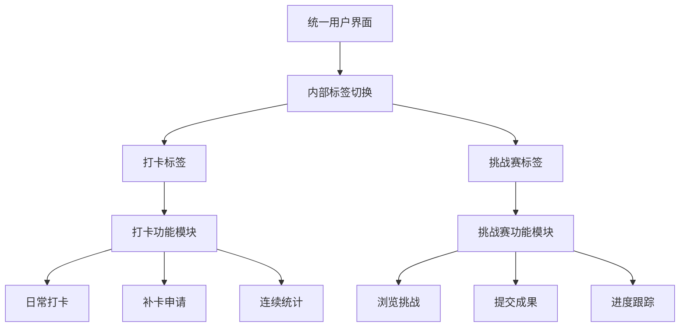
```mermaid
flowchart TD
UserInterface["统一用户界面"] --> TabSwitch["内部标签切换"]
TabSwitch --> CheckinTab["打卡标签"]
TabSwitch --> ChallengeTab["挑战赛标签"]
CheckinTab --> CheckinFeatures["打卡功能模块"]
ChallengeTab --> ChallengeFeatures["挑战赛功能模块"]
CheckinFeatures --> DailyCheckin["日常打卡"]
CheckinFeatures --> MakeupCheckin["补卡申请"]
CheckinFeatures --> StreakStats["连续统计"]
ChallengeFeatures --> BrowseChallenges["浏览挑战"]
ChallengeFeatures --> SubmitWork["提交成果"]
ChallengeFeatures --> TrackProgress["进度跟踪"]
```

图示来源
- [backend/app/main.py:1-49](file://summer-homework-checkin/backend/app/main.py#L1-L49)

## 依赖关系分析
- 模块耦合
  - 路由层依赖服务层与依赖注入（用户、数据库会话）；服务层依赖工具层与模型；工具层无外部框架依赖。
  - 挑战赛模块与打卡模块相互独立，通过统一的路由层进行协调。
  - 速率限制模块作为横切关注点，被多个敏感接口复用。
  - **新增** 推送服务模块独立于核心业务，通过事件驱动与主流程解耦。
  - **新增** 时间处理工具被多个服务层模块复用，提供统一的时间处理能力。
- 外部依赖
  - insightface 与 OpenCV 用于人脸检测与特征提取；SQLite 作为轻量数据库。
  - **新增** HTTP客户端库用于Webhook推送；钉钉SDK用于企业级消息推送。
- 潜在循环
  - 未发现直接循环导入；服务层与工具层单向依赖。

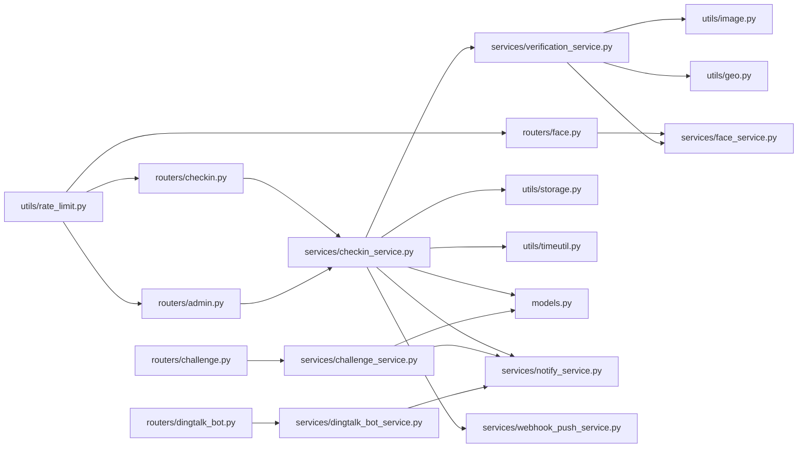
```mermaid
graph LR
R_Checkin["routers/checkin.py"] --> S_Checkin["services/checkin_service.py"]
R_Admin["routers/admin.py"] --> S_Checkin
R_Face["routers/face.py"] --> S_Face["services/face_service.py"]
R_Challenge["routers/challenge.py"] --> S_Challenge["services/challenge_service.py"]
R_DingTalk["routers/dingtalk_bot.py"] --> S_DingTalk["services/dingtalk_bot_service.py"]
S_Checkin --> V_Svc["services/verification_service.py"]
V_Svc --> U_Image["utils/image.py"]
V_Svc --> U_Geo["utils/geo.py"]
V_Svc --> S_Face
S_Checkin --> U_Store["utils/storage.py"]
S_Checkin --> U_Time["utils/timeutil.py"]
S_Checkin --> Models["models.py"]
S_Checkin --> Notify["services/notify_service.py"]
S_Checkin --> PushSvc["services/webhook_push_service.py"]
S_Challenge --> Models
S_Challenge --> Notify
S_DingTalk --> Notify
U_RateLimit["utils/rate_limit.py"] --> R_Checkin
U_RateLimit --> R_Face
U_RateLimit --> R_Admin
```

图示来源
- [backend/app/routers/checkin.py:1-80](file://summer-homework-checkin/backend/app/routers/checkin.py#L1-L80)
- [backend/app/routers/admin.py:1-214](file://summer-homework-checkin/backend/app/routers/admin.py#L1-L214)
- [backend/app/routers/face.py:1-45](file://summer-homework-checkin/backend/app/routers/face.py#L1-L45)
- [backend/app/routers/challenge.py:1-150](file://summer-homework-checkin/backend/app/routers/challenge.py#L1-L150)
- [backend/app/routers/dingtalk_bot.py:1-100](file://summer-homework-checkin/backend/app/routers/dingtalk_bot.py#L1-L100)
- [backend/app/services/checkin_service.py:1-254](file://summer-homework-checkin/backend/app/services/checkin_service.py#L1-L254)
- [backend/app/services/verification_service.py:1-71](file://summer-homework-checkin/backend/app/services/verification_service.py#L1-L71)
- [backend/app/services/face_service.py:1-133](file://summer-homework-checkin/backend/app/services/face_service.py#L1-L133)
- [backend/app/services/challenge_service.py:1-200](file://summer-homework-checkin/backend/app/services/challenge_service.py#L1-L200)
- [backend/app/services/webhook_push_service.py:1-100](file://summer-homework-checkin/backend/app/services/webhook_push_service.py#L1-L100)
- [backend/app/services/dingtalk_bot_service.py:1-100](file://summer-homework-checkin/backend/app/services/dingtalk_bot_service.py#L1-L100)
- [backend/app/utils/image.py:1-61](file://summer-homework-checkin/backend/app/utils/image.py#L1-L61)
- [backend/app/utils/geo.py:1-24](file://summer-homework-checkin/backend/app/utils/geo.py#L1-L24)
- [backend/app/utils/storage.py:1-24](file://summer-homework-checkin/backend/app/utils/storage.py#L1-L24)
- [backend/app/utils/rate_limit.py:1-100](file://summer-homework-checkin/backend/app/utils/rate_limit.py#L1-L100)
- [backend/app/utils/timeutil.py:1-100](file://summer-homework-checkin/backend/app/utils/timeutil.py#L1-L100)
- [backend/app/services/notify_service.py:1-20](file://summer-homework-checkin/backend/app/services/notify_service.py#L1-L20)
- [backend/app/models.py:1-212](file://summer-homework-checkin/backend/app/models.py#L1-L212)

章节来源
- [backend/app/models.py:1-212](file://summer-homework-checkin/backend/app/models.py#L1-L212)

## 性能与可扩展性
- 图像解析
  - 纯字节级解析 JPEG/PNG 尺寸，避免引入重型库，降低内存与启动开销。
- 人脸服务
  - 懒加载与线程锁保证首次按需下载模型与并发安全；CPU 模式部署便于容器化。
- 数据库
  - SQLite 适合轻量部署；高并发场景建议迁移至 PostgreSQL/MySQL 并添加索引（如 check_date、user_id、review_status）。
- 缓存与批处理
  - 连续天数重算可按事件驱动触发；报表统计可引入物化视图或定时任务。
- 挑战赛功能优化
  - 挑战列表分页加载，减少数据传输量。
  - 挑战进度异步计算，避免阻塞主流程。
  - 支持挑战模板复用，提高管理效率。
- 速率限制优化
  - 使用内存缓存存储请求计数，避免数据库压力。
  - 支持分布式部署下的Redis集中式限流。
  - 动态调整限流策略，适应不同负载场景。
- **新增** 推送服务优化
  - 异步推送避免阻塞主业务流程。
  - 消息队列支持高并发推送场景。
  - 失败重试机制保证消息可靠性。
- **新增** 时间处理优化
  - 时区转换结果缓存，减少重复计算。
  - 批量时间处理支持大数据量场景。
  - 时间计算结果缓存提升性能。

[本节为通用指导，无需代码引用]

## 故障排查指南
- 常见错误
  - 照片不符合要求：体积过小/过大、非 JPEG/PNG、尺寸过小。
  - 补卡规则冲突：目标日期无效、不在暑假范围、重复打卡、月度次数超限、缺少凭证。
  - 人脸问题：未采集底图、未检测到人脸、多张人脸、模型不可用、比对不通过。
  - 审核幂等：重复批准/拒绝导致重复积分或状态异常。
  - 挑战赛问题：挑战状态异常、参与条件验证失败、成果提交超时、奖励发放失败。
  - 速率限制问题：请求频率过高、IP被封禁、用户账户锁定。
  - **新增** 推送服务问题：Webhook连接失败、钉钉机器人配置错误、消息推送超时。
  - **新增** 时间处理问题：时区转换错误、日期格式解析失败、工作日计算异常。
- 定位建议
  - 查看打卡记录的 scene_check、face_status、face_score、geo_flag 字段辅助诊断。
  - 检查配置文件中的阈值与策略参数。
  - 确认人脸服务可用性与模型下载路径。
  - 检查挑战表的 state 字段和参与记录的 progress 字段。
  - 查看速率限制日志，分析异常访问模式和攻击来源。
  - **新增** 检查推送服务日志，分析消息推送失败原因。
  - **新增** 验证时间配置和时区设置是否正确。

章节来源
- [backend/app/services/checkin_service.py:212-223](file://summer-homework-checkin/backend/app/services/checkin_service.py#L212-L223)
- [backend/app/services/verification_service.py:19-71](file://summer-homework-checkin/backend/app/services/verification_service.py#L19-L71)
- [backend/app/services/face_service.py:99-125](file://summer-homework-checkin/backend/app/services/face_service.py#L99-L125)
- [backend/app/config.py:27-49](file://summer-homework-checkin/backend/app/config.py#L27-L49)
- [backend/app/utils/rate_limit.py:1-100](file://summer-homework-checkin/backend/app/utils/rate_limit.py#L1-L100)
- [backend/app/services/webhook_push_service.py:1-100](file://summer-homework-checkin/backend/app/services/webhook_push_service.py#L1-L100)
- [backend/app/services/dingtalk_bot_service.py:1-100](file://summer-homework-checkin/backend/app/services/dingtalk_bot_service.py#L1-L100)
- [backend/app/utils/timeutil.py:1-100](file://summer-homework-checkin/backend/app/utils/timeutil.py#L1-L100)

## 结论
本系统通过照片合规、地理位置、人脸识别与场景风险判定的四重机制，结合严格的补卡规则与审核流程，构建了较为完善的防作弊体系。**最新更新**：系统已全面增强安全防护能力，新增的速率限制机制有效防止了暴力破解攻击，覆盖了密码修改、人脸数据采集和打卡接口等敏感端点。**最新增强**：系统集成新的推送服务和时间处理工具，包括Webhook推送服务、钉钉机器人服务和增强的时间处理工具，提供更强大的消息通知和时区管理能力。新增的挑战赛功能为学生提供了更多元化的学习激励方式，通过统一的前端界面实现了打卡与挑战的双模式无缝切换。连续打卡统计算法清晰可靠，积分与抽奖资格发放遵循明确的里程碑策略。整体架构简洁、模块化良好，便于扩展与维护，**新增的安全防护机制和推送服务能力进一步提升了系统的稳定性和功能性**。

[本节为总结，无需代码引用]

## 附录：API 接口说明

### 打卡相关
- POST /api/checkin
  - 功能：提交打卡（正常/补卡）
  - 表单字段：photo、proof（补卡凭证）、location_lat、location_lng、check_type、makeup_reason、makeup_for_date
  - 成功响应：CheckInOut
  - 错误码：400（参数/规则校验失败）、403（非学生）、429（请求频率过高）、503（人脸服务不可用）
- GET /api/checkin/today
  - 功能：查询今日打卡状态（是否已审核通过、是否有待审核、本月剩余补卡次数）
- GET /api/checkin/streak
  - 功能：获取连续天数、历史最长连续、有效打卡数、抽奖券、今日状态、本月剩余补卡次数
- GET /api/checkin/history
  - 功能：获取打卡历史（按时间倒序）
- POST /api/checkin/upload
  - 功能：通用图片上传（图片查看器使用），返回 photo_path 与 photo_url

章节来源
- [backend/app/routers/checkin.py:17-80](file://summer-homework-checkin/backend/app/routers/checkin.py#L17-L80)

### 人脸相关
- POST /api/face/enroll
  - 功能：采集人脸底图（仅学生）
  - 成功响应：FaceEnrollOut
  - 错误码：429（请求频率过高）、400（人脸检测失败）
- GET /api/face/status
  - 功能：查询人脸底图采集状态
- DELETE /api/face/enroll
  - 功能：撤销人脸底图

章节来源
- [backend/app/routers/face.py:14-45](file://summer-homework-checkin/backend/app/routers/face.py#L14-L45)

### 挑战赛相关
- GET /api/challenges
  - 功能：获取可用挑战列表（支持筛选和分页）
- POST /api/challenges/{id}/participate
  - 功能：参与指定挑战
  - 成功响应：ChallengeParticipation
- PUT /api/challenges/{id}/progress
  - 功能：更新挑战进度
- GET /api/challenges/{id}/status
  - 功能：查询挑战参与状态和进度
- GET /api/challenges/my-participations
  - 功能：获取我的挑战参与记录
- GET /api/challenges/rankings
  - 功能：获取挑战排行榜

章节来源
- [backend/app/routers/challenge.py:1-150](file://summer-homework-checkin/backend/app/routers/challenge.py#L1-L150)

### 钉钉机器人相关
- **新增** 钉钉消息接收
  - POST /api/dingtalk/message：接收钉钉消息
  - 支持文本、Markdown、卡片等多种消息类型
  - 自动解析用户身份和消息内容
- **新增** 机器人配置管理
  - GET /api/dingtalk/config：获取机器人配置
  - PUT /api/dingtalk/config：更新机器人配置
  - 支持Webhook地址、密钥管理等配置项
- **新增** 工作流集成
  - POST /api/dingtalk/workflow：触发工作流
  - 支持审批流程、任务分配等自动化场景
  - 与工作流引擎深度集成

章节来源
- [backend/app/routers/dingtalk_bot.py:1-100](file://summer-homework-checkin/backend/app/routers/dingtalk_bot.py#L1-L100)
- [backend/app/services/dingtalk_bot_service.py:1-100](file://summer-homework-checkin/backend/app/services/dingtalk_bot_service.py#L1-L100)

### 管理端相关
- GET /api/admin/stats
  - 功能：统计概览（学生/家长/有效打卡/绑定/地理风险/兑换状态/暑假窗口/挑战统计）
- GET /api/admin/users
  - 功能：用户列表（含关键统计字段）
- GET /api/admin/checkins
  - 功能：打卡记录列表（含用户昵称、审核状态、照片链接）
- GET /api/admin/checkins/pending-count
  - 功能：待审核打卡数量
- PUT /api/admin/checkins/{id}/review
  - 功能：审核打卡（approved/rejected），批准后自动发放积分并重算连续天数
- GET /api/admin/redemptions
  - 功能：兑换记录列表（支持按状态筛选）
- GET /api/admin/redemptions/{id}
  - 功能：兑换记录详情
- PUT /api/admin/redemptions/{id}/review
  - 功能：审核兑换（approve 标记 fulfilled；reject 退还积分）
- **新增** 挑战管理接口
  - GET /api/admin/challenges：获取挑战列表
  - POST /api/admin/challenges：创建新挑战
  - PUT /api/admin/challenges/{id}：更新挑战信息
  - DELETE /api/admin/challenges/{id}：删除挑战
  - GET /api/admin/challenges/{id}/participants：获取挑战参与者列表

章节来源
- [backend/app/routers/admin.py:16-214](file://summer-homework-checkin/backend/app/routers/admin.py#L16-L214)

### 健康检查
- GET /api/health
  - 功能：服务健康检查

章节来源
- [backend/app/main.py:33-35](file://summer-homework-checkin/backend/app/main.py#L33-L35)

### 速率限制相关
- **新增** 速率限制配置
  - 基于IP地址的限制：默认每分钟10次请求
  - 基于用户ID的限制：默认每分钟5次请求
  - 敏感接口额外限制：密码修改、人脸采集等接口限制更严格
  - 动态调整：根据威胁级别自动调整限制策略
- **新增** 错误响应
  - HTTP 429状态码：请求频率过高
  - 包含重试建议和剩余时间信息
  - 记录异常访问日志用于安全审计

章节来源
- [backend/app/utils/rate_limit.py:1-100](file://summer-homework-checkin/backend/app/utils/rate_limit.py#L1-L100)

### 推送服务相关
- **新增** Webhook推送接口
  - POST /api/webhook/push：发送Webhook消息
  - 支持自定义URL、请求头、请求体
  - 异步推送和失败重试机制
- **新增** 推送状态查询
  - GET /api/webhook/status：查询推送状态
  - GET /api/webhook/logs：查看推送日志
  - 支持按时间范围和状态筛选

章节来源
- [backend/app/services/webhook_push_service.py:1-100](file://summer-homework-checkin/backend/app/services/webhook_push_service.py#L1-L100)

### 时间处理相关
- **新增** 时间工具接口
  - GET /api/time/current：获取当前时间（支持时区参数）
  - GET /api/time/convert：时区转换接口
  - GET /api/time/format：时间格式化接口
  - GET /api/time/workday：工作日计算接口
- **新增** 时间配置管理
  - GET /api/time/config：获取时间配置
  - PUT /api/time/config：更新时间配置
  - 支持时区、节假日、工作时间等配置项

章节来源
- [backend/app/utils/timeutil.py:1-100](file://summer-homework-checkin/backend/app/utils/timeutil.py#L1-L100)