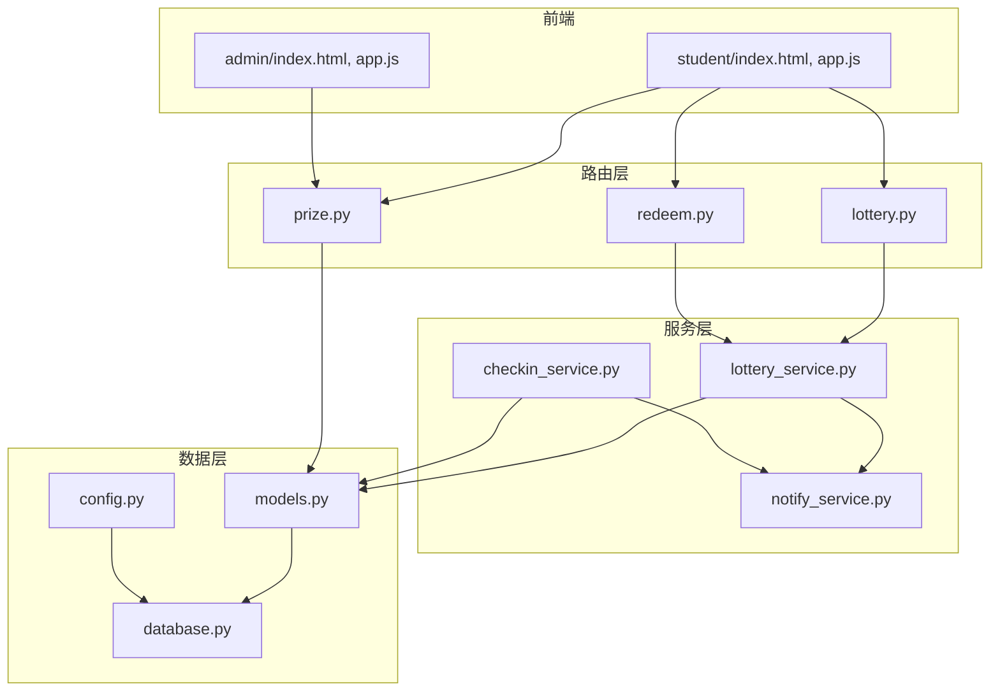
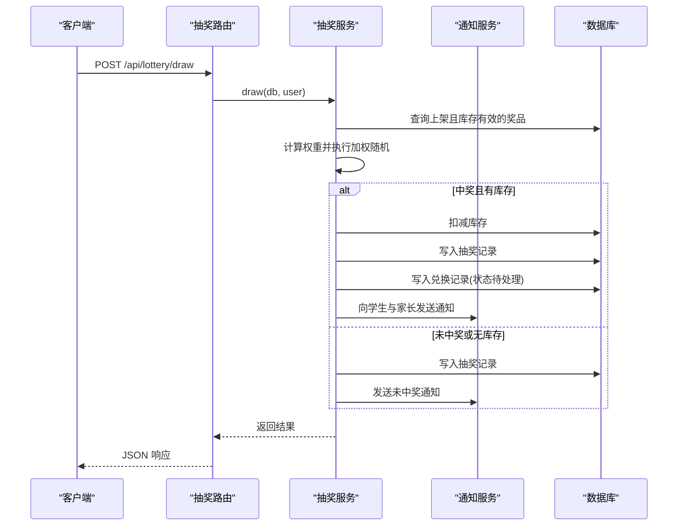
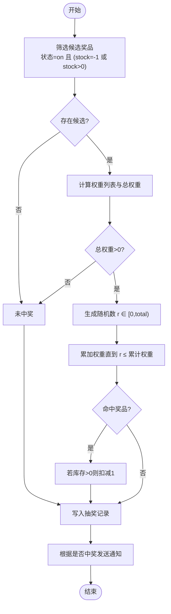
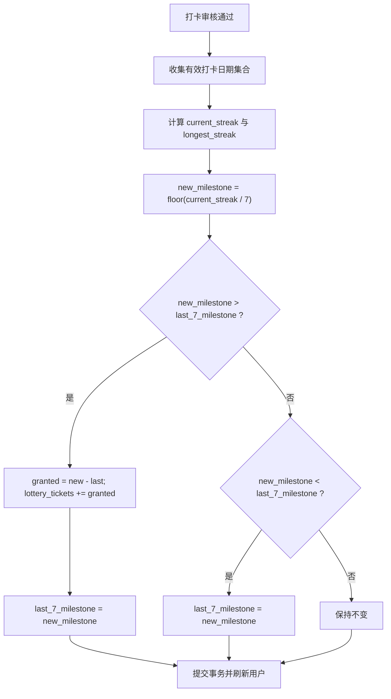
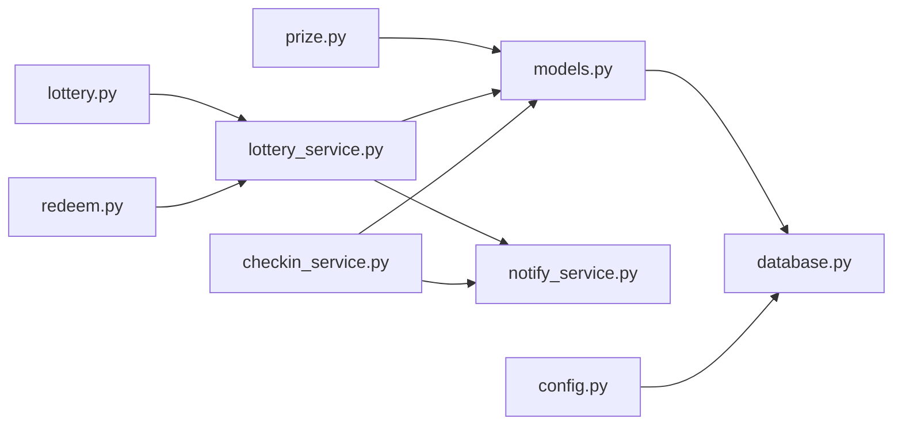

# 抽奖系统

<cite>
**本文引用的文件列表**
- [lottery.py](file://summer-homework-checkin/backend/app/routers/lottery.py)
- [lottery_service.py](file://summer-homework-checkin/backend/app/services/lottery_service.py)
- [checkin_service.py](file://summer-homework-checkin/backend/app/services/checkin_service.py)
- [prize.py](file://summer-homework-checkin/backend/app/routers/prize.py)
- [redeem.py](file://summer-homework-checkin/backend/app/routers/redeem.py)
- [notify_service.py](file://summer-homework-checkin/backend/app/services/notify_service.py)
- [models.py](file://summer-homework-checkin/backend/app/models.py)
- [schemas.py](file://summer-homework-checkin/backend/app/schemas.py)
- [config.py](file://summer-homework-checkin/backend/app/config.py)
- [database.py](file://summer-homework-checkin/backend/app/database.py)
- [requirements.txt](file://summer-homework-checkin/backend/requirements.txt)
</cite>

## 目录
1. [简介](#简介)
2. [项目结构](#项目结构)
3. [核心组件](#核心组件)
4. [架构总览](#架构总览)
5. [详细组件分析](#详细组件分析)
6. [依赖关系分析](#依赖关系分析)
7. [性能与并发考量](#性能与并发考量)
8. [故障排查指南](#故障排查指南)
9. [结论](#结论)
10. [附录：API 规范](#附录api-规范)

## 简介
本技术文档围绕“暑期作业打卡”系统中的“抽奖子系统”，系统性阐述以下要点：
- 加权随机算法的实现原理，包括奖品概率配置与随机数生成策略
- 抽奖资格获取条件与基于连续打卡里程碑的自动发放机制
- 奖品库存管理与并发控制，防止超卖与数据一致性保障
- 抽奖记录的审计追踪，支持结果可追溯与公平性验证
- 奖品类型扩展设计（虚拟奖品与实物奖品的统一处理模型）
- 活动配置化管理（动态调整概率与库存）
- 完整 API 接口规范与错误处理策略，确保稳定性与用户体验

## 项目结构
后端采用 FastAPI + SQLAlchemy 的分层架构：路由层负责 HTTP 请求解析与响应封装；服务层承载业务逻辑；模型层定义数据库实体；Schema 层定义输入输出校验。

图表来源
- [lottery.py:1-30](file://summer-homework-checkin/backend/app/routers/lottery.py#L1-L30)
- [prize.py:1-66](file://summer-homework-checkin/backend/app/routers/prize.py#L1-L66)
- [redeem.py:1-81](file://summer-homework-checkin/backend/app/routers/redeem.py#L1-L81)
- [lottery_service.py:1-77](file://summer-homework-checkin/backend/app/services/lottery_service.py#L1-L77)
- [checkin_service.py:1-254](file://summer-homework-checkin/backend/app/services/checkin_service.py#L1-L254)
- [notify_service.py:1-20](file://summer-homework-checkin/backend/app/services/notify_service.py#L1-L20)
- [models.py:1-212](file://summer-homework-checkin/backend/app/models.py#L1-L212)
- [database.py:1-22](file://summer-homework-checkin/backend/app/database.py#L1-L22)
- [config.py:1-50](file://summer-homework-checkin/backend/app/config.py#L1-L50)

章节来源
- [lottery.py:1-30](file://summer-homework-checkin/backend/app/routers/lottery.py#L1-L30)
- [prize.py:1-66](file://summer-homework-checkin/backend/app/routers/prize.py#L1-L66)
- [redeem.py:1-81](file://summer-homework-checkin/backend/app/routers/redeem.py#L1-L81)
- [lottery_service.py:1-77](file://summer-homework-checkin/backend/app/services/lottery_service.py#L1-L77)
- [checkin_service.py:1-254](file://summer-homework-checkin/backend/app/services/checkin_service.py#L1-L254)
- [notify_service.py:1-20](file://summer-homework-checkin/backend/app/services/notify_service.py#L1-L20)
- [models.py:1-212](file://summer-homework-checkin/backend/app/models.py#L1-L212)
- [database.py:1-22](file://summer-homework-checkin/backend/app/database.py#L1-L22)
- [config.py:1-50](file://summer-homework-checkin/backend/app/config.py#L1-L50)

## 核心组件
- 抽奖路由与权限控制：仅学生角色可发起抽奖，返回用户剩余券数与最近记录
- 抽奖服务：实现加权随机、库存扣减、记录落库、通知推送
- 打卡服务：维护连续打卡天数与里程碑，按每 7 天自动发放抽奖资格
- 奖品管理：管理员创建/更新/删除奖品，支持概率与库存的动态配置
- 积分商城：聚合展示余额、可兑换奖品、我的兑换与抽奖记录
- 通知服务：站内消息与面向家长的联动通知

章节来源
- [lottery.py:13-29](file://summer-homework-checkin/backend/app/routers/lottery.py#L13-L29)
- [lottery_service.py:9-76](file://summer-homework-checkin/backend/app/services/lottery_service.py#L9-L76)
- [checkin_service.py:39-61](file://summer-homework-checkin/backend/app/services/checkin_service.py#L39-L61)
- [prize.py:25-55](file://summer-homework-checkin/backend/app/routers/prize.py#L25-L55)
- [redeem.py:24-45](file://summer-homework-checkin/backend/app/routers/redeem.py#L24-L45)
- [notify_service.py:5-20](file://summer-homework-checkin/backend/app/services/notify_service.py#L5-L20)

## 架构总览
下图展示了从客户端到数据库的关键调用链，以及抽奖过程中各模块的交互。

图表来源
- [lottery.py:25-29](file://summer-homework-checkin/backend/app/routers/lottery.py#L25-L29)
- [lottery_service.py:9-76](file://summer-homework-checkin/backend/app/services/lottery_service.py#L9-L76)
- [notify_service.py:5-20](file://summer-homework-checkin/backend/app/services/notify_service.py#L5-L20)
- [models.py:126-161](file://summer-homework-checkin/backend/app/models.py#L126-L161)

## 详细组件分析

### 加权随机算法与概率配置
- 候选集筛选：仅考虑状态为“上架”且满足库存条件的奖品（不限量或库存大于 0）
- 权重计算：取每个奖品的 probability 作为权重，过滤负值后求和得到总权重
- 随机选择：在 [0, total) 区间内生成随机数，按累计权重命中目标奖品
- 库存扣减：若中奖且库存为正，则扣减 1；不限量(-1)不扣减
- 记录与通知：无论是否中奖均写入抽奖记录；中奖时同时写入兑换记录并推送通知

图表来源
- [lottery_service.py:14-34](file://summer-homework-checkin/backend/app/services/lottery_service.py#L14-L34)
- [lottery_service.py:36-76](file://summer-homework-checkin/backend/app/services/lottery_service.py#L36-L76)

章节来源
- [lottery_service.py:9-76](file://summer-homework-checkin/backend/app/services/lottery_service.py#L9-L76)

### 抽奖资格获取与连续打卡里程碑
- 连续天数计算：对有效打卡日期排序，计算当前连续天数与历史最长连续天数
- 里程碑解锁：以 7 天为一个里程碑，当 new_milestone > last_7_milestone 时，差额即为本次新增抽奖券数量
- 中断处理：若连续中断导致里程碑回退，已发放的券保留，仅重置进度
- 触发时机：审核通过打卡后重新计算并发放

图表来源
- [checkin_service.py:12-36](file://summer-homework-checkin/backend/app/services/checkin_service.py#L12-L36)
- [checkin_service.py:39-61](file://summer-homework-checkin/backend/app/services/checkin_service.py#L39-L61)
- [checkin_service.py:166-191](file://summer-homework-checkin/backend/app/services/checkin_service.py#L166-L191)

章节来源
- [checkin_service.py:39-61](file://summer-homework-checkin/backend/app/services/checkin_service.py#L39-L61)
- [checkin_service.py:166-191](file://summer-homework-checkin/backend/app/services/checkin_service.py#L166-L191)

### 奖品库存管理与并发控制
- 现状说明：当前实现使用内存随机与单条事务内的库存扣减，未引入显式锁或乐观版本号
- 风险点：在高并发下可能出现同一时刻多个请求读取相同库存并成功扣减，导致超卖
- 建议方案：
  - 数据库级原子操作：使用 UPDATE ... WHERE id=? AND stock>0 保证原子扣减
  - 乐观锁：在 Prize 表增加 version 字段，更新时校验版本
  - 分布式锁：在外部缓存（如 Redis）中针对 prize_id 加锁，串行化扣减流程
  - 幂等与重试：结合唯一索引或去重键避免重复扣减
- 当前行为：在同一事务内先查候选奖品，再扣减库存，最后提交；适合低并发场景

章节来源
- [lottery_service.py:14-34](file://summer-homework-checkin/backend/app/services/lottery_service.py#L14-L34)
- [lottery_service.py:32-34](file://summer-homework-checkin/backend/app/services/lottery_service.py#L32-L34)

### 抽奖记录审计与公平性验证
- 记录内容：用户 ID、奖品 ID/名称、是否中奖、时间戳
- 关联视图：学生端“我的抽奖”与管理端报表均可查看
- 公平性依据：
  - 权重来源为奖品配置的 probability，可通过管理端日志与变更记录回溯
  - 随机种子：当前使用标准库 random.random()，如需审计可改为带种子的伪随机并在记录中保存 seed
- 通知留痕：每次抽奖均产生站内通知，便于事件溯源

章节来源
- [models.py:126-139](file://summer-homework-checkin/backend/app/models.py#L126-L139)
- [lottery_service.py:36-76](file://summer-homework-checkin/backend/app/services/lottery_service.py#L36-L76)
- [notify_service.py:5-20](file://summer-homework-checkin/backend/app/services/notify_service.py#L5-L20)

### 奖品类型支持与统一处理模型
- 统一模型：Prize 表同时承载实物奖品与虚拟奖品
- 特殊类型：is_lottery_ticket=True 表示“抽奖机会”类虚拟奖品，兑换后直接增加用户抽奖券，不扣库存、不创建 Redemption 记录
- 分类扩展：category 支持 stationery/outdoor/interest，可按需扩展更多类别
- 价格与库存：cost_points 用于积分商城；stock=-1 表示不限量

章节来源
- [models.py:103-124](file://summer-homework-checkin/backend/app/models.py#L103-L124)
- [schemas.py:98-138](file://summer-homework-checkin/backend/app/schemas.py#L98-L138)
- [redeem.py:48-69](file://summer-homework-checkin/backend/app/routers/redeem.py#L48-L69)

### 活动配置化管理
- 动态概率与库存：管理员通过 /api/admin/prizes 增删改，实时影响抽奖候选集与权重
- 状态开关：status=on/off 控制是否参与抽奖与商城展示
- 校验规则：probability 必须在 0~1 之间；category 限定合法枚举

章节来源
- [prize.py:25-55](file://summer-homework-checkin/backend/app/routers/prize.py#L25-L55)
- [prize.py:31-34](file://summer-homework-checkin/backend/app/routers/prize.py#L31-L34)

### API 接口规范与错误处理
- 抽奖相关
  - GET /api/lottery/tickets：返回用户剩余抽奖券与最近抽奖记录
  - POST /api/lottery/draw：消耗 1 张券进行抽奖，返回是否中奖、奖品信息与剩余券数
- 奖品管理
  - GET /api/prizes：学生端可见的上架奖品列表
  - GET /api/admin/prizes：管理员可见全部奖品
  - POST /api/admin/prizes：创建奖品
  - PUT /api/admin/prizes/{pid}：更新奖品
  - DELETE /api/admin/prizes/{pid}：删除奖品
- 积分商城
  - GET /api/mall：聚合余额、可兑换奖品、我的兑换与抽奖记录
  - POST /api/redeem：积分兑换（含抽奖机会虚拟奖品）
  - POST /api/redeem/{rid}/replace：替换兑换记录

错误处理要点
- 权限不足：非学生尝试抽奖返回 403
- 无可用券：抽奖前检查 user.lottery_tickets，不足返回 400
- 参数校验：概率范围、补卡日期格式、照片尺寸等由路由与服务层校验并返回 400
- 资源不存在：奖品更新/删除时若不存在返回 404

章节来源
- [lottery.py:13-29](file://summer-homework-checkin/backend/app/routers/lottery.py#L13-L29)
- [prize.py:12-66](file://summer-homework-checkin/backend/app/routers/prize.py#L12-L66)
- [redeem.py:24-81](file://summer-homework-checkin/backend/app/routers/redeem.py#L24-L81)
- [schemas.py:140-154](file://summer-homework-checkin/backend/app/schemas.py#L140-L154)

## 依赖关系分析
- 路由层依赖服务层与模型层，服务层依赖模型层与通知服务
- 数据库连接由 database.py 提供，配置项来自 config.py
- 人脸识别与图片处理依赖 requirements.txt 所列第三方库

图表来源
- [lottery.py:1-30](file://summer-homework-checkin/backend/app/routers/lottery.py#L1-L30)
- [prize.py:1-66](file://summer-homework-checkin/backend/app/routers/prize.py#L1-L66)
- [redeem.py:1-81](file://summer-homework-checkin/backend/app/routers/redeem.py#L1-L81)
- [lottery_service.py:1-77](file://summer-homework-checkin/backend/app/services/lottery_service.py#L1-L77)
- [checkin_service.py:1-254](file://summer-homework-checkin/backend/app/services/checkin_service.py#L1-L254)
- [notify_service.py:1-20](file://summer-homework-checkin/backend/app/services/notify_service.py#L1-L20)
- [models.py:1-212](file://summer-homework-checkin/backend/app/models.py#L1-L212)
- [database.py:1-22](file://summer-homework-checkin/backend/app/database.py#L1-L22)
- [config.py:1-50](file://summer-homework-checkin/backend/app/config.py#L1-L50)

章节来源
- [requirements.txt:1-11](file://summer-homework-checkin/backend/requirements.txt#L1-L11)

## 性能与并发考量
- 随机算法复杂度：O(n)，n 为候选奖品数量；通常较小，开销可忽略
- 数据库事务：抽奖过程在一个事务内完成，减少中间态不一致
- 并发瓶颈：高并发下库存扣减可能成为热点，建议引入原子更新或分布式锁
- 通知写入：通知写入为轻量 IO，可与主流程异步化以降低延迟
- 统计与报表：抽奖记录与兑换记录可作为审计与分析数据源

[本节为通用指导，无需列出具体文件来源]

## 故障排查指南
- 无法抽奖
  - 检查用户角色是否为 student
  - 检查 user.lottery_tickets 是否大于 0
  - 确认是否存在状态为 on 且库存有效的奖品
- 库存异常
  - 核对奖品 stock 字段与更新路径
  - 在高并发场景下优先采用原子更新或分布式锁
- 未收到通知
  - 检查 notify 写入是否成功
  - 家长绑定关系是否正确
- 打卡未解锁抽奖券
  - 确认打卡审核已通过
  - 检查连续天数与里程碑计算逻辑

章节来源
- [lottery.py:25-29](file://summer-homework-checkin/backend/app/routers/lottery.py#L25-L29)
- [lottery_service.py:11-15](file://summer-homework-checkin/backend/app/services/lottery_service.py#L11-L15)
- [checkin_service.py:166-191](file://summer-homework-checkin/backend/app/services/checkin_service.py#L166-L191)
- [notify_service.py:5-20](file://summer-homework-checkin/backend/app/services/notify_service.py#L5-L20)

## 结论
本抽奖系统以简洁清晰的加权随机为核心，配合连续打卡里程碑自动发放抽奖券，形成“行为激励—奖励反馈”的闭环。当前实现适用于中小规模场景；在生产环境建议引入库存原子扣减与分布式锁，提升并发一致性与抗超卖能力。通过完善的记录与通知机制，系统具备良好的可审计性与可追溯性。

[本节为总结性内容，无需列出具体文件来源]

## 附录：API 规范
- 抽奖
  - GET /api/lottery/tickets
    - 鉴权：需要登录
    - 返回：剩余抽奖券与最近抽奖记录
  - POST /api/lottery/draw
    - 鉴权：需要登录且角色为 student
    - 返回：是否中奖、奖品信息、剩余券数与提示语
- 奖品
  - GET /api/prizes：仅展示上架奖品
  - GET /api/admin/prizes：管理员查看所有奖品
  - POST /api/admin/prizes：创建奖品（校验 category 与 probability）
  - PUT /api/admin/prizes/{pid}：更新奖品
  - DELETE /api/admin/prizes/{pid}：删除奖品
- 积分商城
  - GET /api/mall：聚合余额、可兑换奖品、我的兑换与抽奖记录
  - POST /api/redeem：积分兑换（支持虚拟抽奖机会）
  - POST /api/redeem/{rid}/replace：替换兑换记录

章节来源
- [lottery.py:13-29](file://summer-homework-checkin/backend/app/routers/lottery.py#L13-L29)
- [prize.py:12-66](file://summer-homework-checkin/backend/app/routers/prize.py#L12-L66)
- [redeem.py:24-81](file://summer-homework-checkin/backend/app/routers/redeem.py#L24-L81)
- [schemas.py:140-154](file://summer-homework-checkin/backend/app/schemas.py#L140-L154)