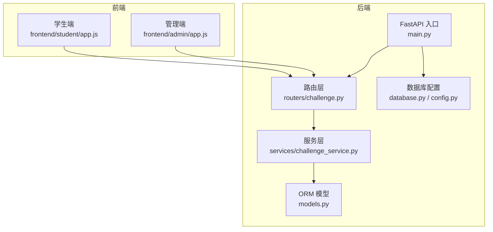
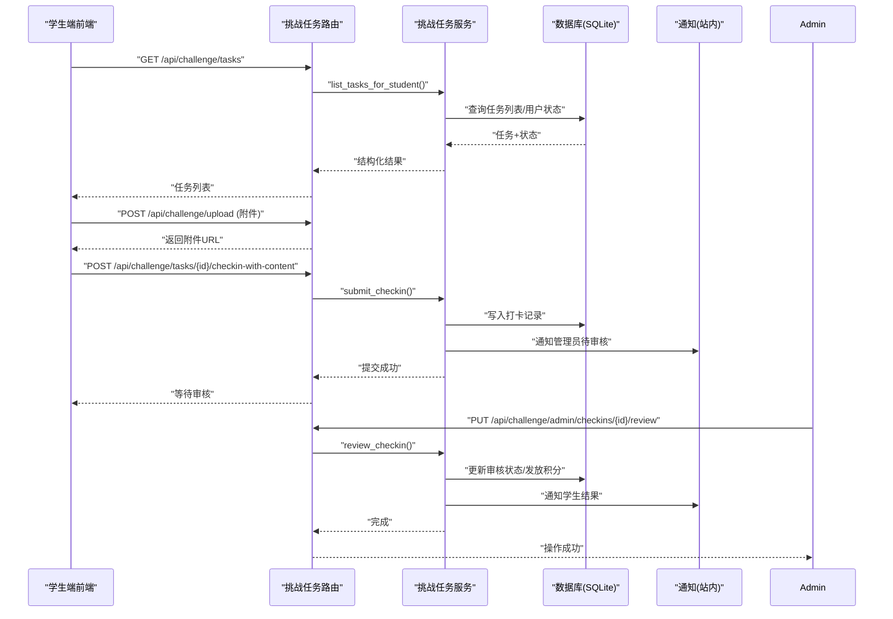
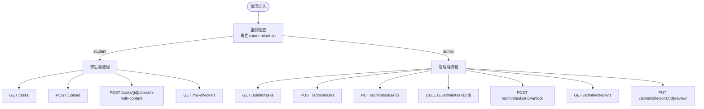
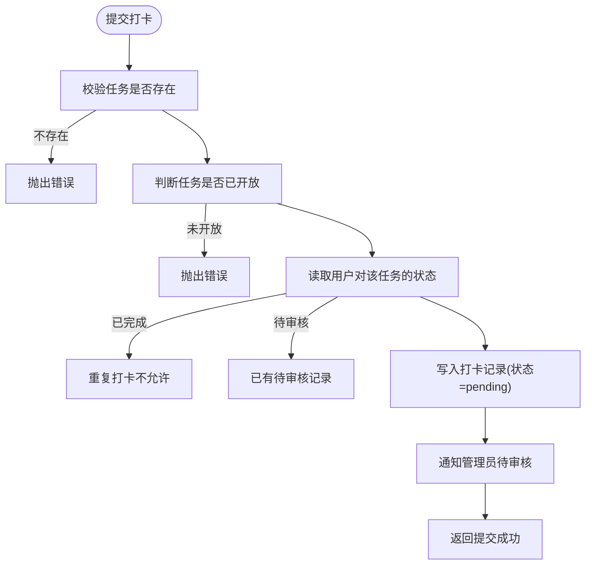
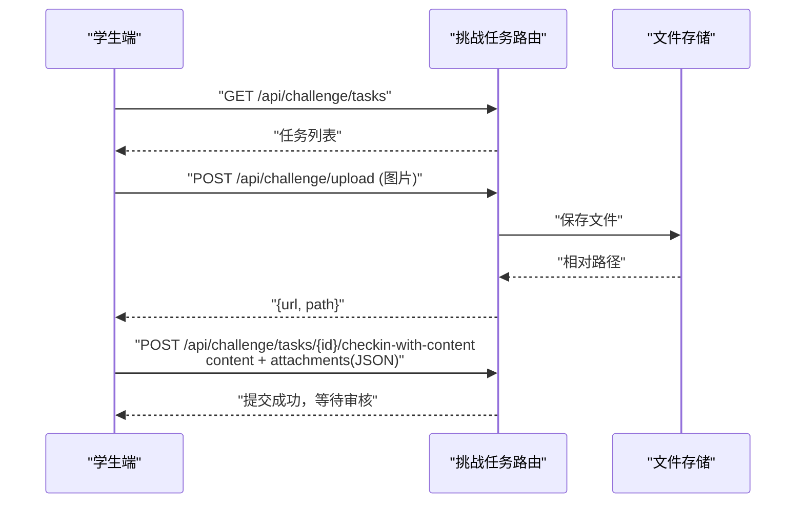
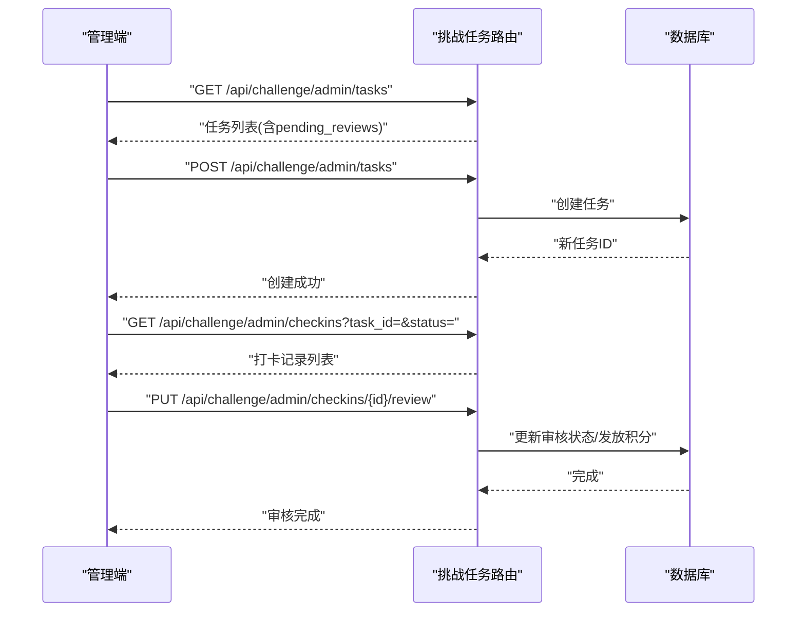
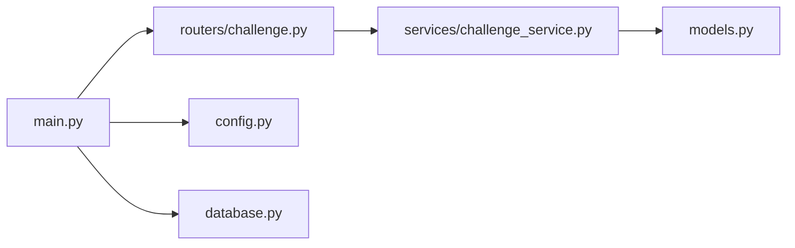

# 挑战任务系统

<cite>
**本文引用的文件**   
- [summer-homework-checkin/backend/app/main.py](file://summer-homework-checkin/backend/app/main.py)
- [summer-homework-checkin/backend/app/models.py](file://summer-homework-checkin/backend/app/models.py)
- [summer-homework-checkin/backend/app/schemas.py](file://summer-homework-checkin/backend/app/schemas.py)
- [summer-homework-checkin/backend/app/config.py](file://summer-homework-checkin/backend/app/config.py)
- [summer-homework-checkin/backend/app/database.py](file://summer-homework-checkin/backend/app/database.py)
- [summer-homework-checkin/backend/app/routers/challenge.py](file://summer-homework-checkin/backend/app/routers/challenge.py)
- [summer-homework-checkin/backend/app/services/challenge_service.py](file://summer-homework-checkin/backend/app/services/challenge_service.py)
- [summer-homework-checkin/frontend/student/app.js](file://summer-homework-checkin/frontend/student/app.js)
- [summer-homework-checkin/frontend/admin/app.js](file://summer-homework-checkin/frontend/admin/app.js)
</cite>

## 目录
1. [简介](#简介)
2. [项目结构](#项目结构)
3. [核心组件](#核心组件)
4. [架构总览](#架构总览)
5. [详细组件分析](#详细组件分析)
6. [依赖关系分析](#依赖关系分析)
7. [性能与扩展性](#性能与扩展性)
8. [故障排查指南](#故障排查指南)
9. [结论](#结论)

## 简介
本章节面向“挑战任务系统”（闯关任务）模块，该模块为暑假作业打卡系统的扩展能力，提供“任务定义—学生提交—管理员审核—积分奖励—通知”的完整闭环。系统采用前后端分离架构：后端基于 FastAPI + SQLAlchemy + SQLite，前端使用 Vue3 单页应用（免构建），分别提供学生端 H5 与管理端页面。

## 项目结构
挑战任务系统在后端以路由层与服务层解耦的方式组织，数据模型集中在 ORM 层；前端在学生端与管理端分别实现任务浏览、提交与审核流程。



图表来源
- [summer-homework-checkin/backend/app/main.py:1-61](file://summer-homework-checkin/backend/app/main.py#L1-L61)
- [summer-homework-checkin/backend/app/routers/challenge.py:1-377](file://summer-homework-checkin/backend/app/routers/challenge.py#L1-L377)
- [summer-homework-checkin/backend/app/services/challenge_service.py:1-281](file://summer-homework-checkin/backend/app/services/challenge_service.py#L1-L281)
- [summer-homework-checkin/backend/app/models.py:1-213](file://summer-homework-checkin/backend/app/models.py#L1-L213)
- [summer-homework-checkin/backend/app/database.py:1-31](file://summer-homework-checkin/backend/app/database.py#L1-L31)
- [summer-homework-checkin/backend/app/config.py:1-68](file://summer-homework-checkin/backend/app/config.py#L1-L68)
- [summer-homework-checkin/frontend/student/app.js:1-403](file://summer-homework-checkin/frontend/student/app.js#L1-L403)
- [summer-homework-checkin/frontend/admin/app.js:1-654](file://summer-homework-checkin/frontend/admin/app.js#L1-L654)

章节来源
- [summer-homework-checkin/backend/app/main.py:1-61](file://summer-homework-checkin/backend/app/main.py#L1-L61)
- [summer-homework-checkin/backend/app/models.py:1-213](file://summer-homework-checkin/backend/app/models.py#L1-L213)
- [summer-homework-checkin/backend/app/schemas.py:1-322](file://summer-homework-checkin/backend/app/schemas.py#L1-L322)
- [summer-homework-checkin/backend/app/config.py:1-68](file://summer-homework-checkin/backend/app/config.py#L1-L68)
- [summer-homework-checkin/backend/app/database.py:1-31](file://summer-homework-checkin/backend/app/database.py#L1-L31)
- [summer-homework-checkin/backend/app/routers/challenge.py:1-377](file://summer-homework-checkin/backend/app/routers/challenge.py#L1-L377)
- [summer-homework-checkin/backend/app/services/challenge_service.py:1-281](file://summer-homework-checkin/backend/app/services/challenge_service.py#L1-L281)
- [summer-homework-checkin/frontend/student/app.js:1-403](file://summer-homework-checkin/frontend/student/app.js#L1-L403)
- [summer-homework-checkin/frontend/admin/app.js:1-654](file://summer-homework-checkin/frontend/admin/app.js#L1-L654)

## 核心组件
- 路由层：暴露学生端与管理端 API，负责鉴权、参数校验、调用服务层。
- 服务层：封装业务规则（任务开放判定、状态机、审核与积分发放、统计）。
- 数据模型：定义任务、打卡记录、用户、通知等实体及关系。
- 前端：学生端用于浏览任务、上传附件并提交打卡；管理端用于创建/编辑/删除任务、查看待审数量、批量审核。

章节来源
- [summer-homework-checkin/backend/app/routers/challenge.py:1-377](file://summer-homework-checkin/backend/app/routers/challenge.py#L1-L377)
- [summer-homework-checkin/backend/app/services/challenge_service.py:1-281](file://summer-homework-checkin/backend/app/services/challenge_service.py#L1-L281)
- [summer-homework-checkin/backend/app/models.py:179-213](file://summer-homework-checkin/backend/app/models.py#L179-L213)
- [summer-homework-checkin/frontend/student/app.js:337-403](file://summer-homework-checkin/frontend/student/app.js#L337-L403)
- [summer-homework-checkin/frontend/admin/app.js:464-622](file://summer-homework-checkin/frontend/admin/app.js#L464-L622)

## 架构总览
挑战任务系统遵循“路由→服务→模型”的分层设计，结合统一鉴权中间件与静态资源托管，形成清晰的前后端交互链路。



图表来源
- [summer-homework-checkin/backend/app/routers/challenge.py:20-186](file://summer-homework-checkin/backend/app/routers/challenge.py#L20-L186)
- [summer-homework-checkin/backend/app/services/challenge_service.py:112-234](file://summer-homework-checkin/backend/app/services/challenge_service.py#L112-L234)
- [summer-homework-checkin/backend/app/models.py:164-213](file://summer-homework-checkin/backend/app/models.py#L164-L213)

## 详细组件分析

### 数据模型与关系
挑战任务相关的数据模型包括任务定义、打卡记录、用户与通知。

```mermaid
classDiagram
class User {
+int id
+string username
+string role
+string nickname
+int points
}
class ChallengeTask {
+int id
+string name
+text description
+int sort_order
+int reward_points
+string status
+datetime unlock_at
+string unlock_condition
}
class ChallengeCheckIn {
+int id
+int user_id
+int task_id
+text content
+text attachments
+string review_status
+string review_note
+int reviewed_by
+datetime reviewed_at
+datetime created_at
}
class Notification {
+int id
+int user_id
+string recipient_role
+string type
+string title
+text content
+boolean read
+int related_id
+datetime created_at
}
User ||--o{ ChallengeCheckIn : "user_id"
ChallengeTask ||--o{ ChallengeCheckIn : "task_id"
User ||--o{ Notification : "user_id"
```

图表来源
- [summer-homework-checkin/backend/app/models.py:179-213](file://summer-homework-checkin/backend/app/models.py#L179-L213)
- [summer-homework-checkin/backend/app/models.py:164-177](file://summer-homework-checkin/backend/app/models.py#L164-L177)

章节来源
- [summer-homework-checkin/backend/app/models.py:179-213](file://summer-homework-checkin/backend/app/models.py#L179-L213)
- [summer-homework-checkin/backend/app/models.py:164-177](file://summer-homework-checkin/backend/app/models.py#L164-L177)

### 路由层（学生端与管理端）
- 学生端接口
  - 获取任务列表与详情
  - 上传附件
  - 提交打卡（支持文本内容与附件）
  - 查看我的打卡记录
- 管理端接口
  - 任务 CRUD（创建/更新/删除）
  - 手动开放任务
  - 查看打卡列表与待审数量
  - 审核打卡（通过/拒绝）



图表来源
- [summer-homework-checkin/backend/app/routers/challenge.py:18-186](file://summer-homework-checkin/backend/app/routers/challenge.py#L18-L186)
- [summer-homework-checkin/backend/app/routers/challenge.py:188-377](file://summer-homework-checkin/backend/app/routers/challenge.py#L188-L377)

章节来源
- [summer-homework-checkin/backend/app/routers/challenge.py:1-377](file://summer-homework-checkin/backend/app/routers/challenge.py#L1-L377)

### 服务层（业务逻辑）
- 任务开放判定：支持“管理员手动开放”和“定时自动开放”。
- 学生任务状态：locked/pending/reviewing/completed/rejected。
- 提交打卡：校验任务存在与可提交状态，写入记录并通知管理员。
- 审核流程：通过则发放积分并通知学生；拒绝则记录备注并通知学生。
- 统计与列表：按任务或状态筛选打卡记录，计算待审数量。



图表来源
- [summer-homework-checkin/backend/app/services/challenge_service.py:149-176](file://summer-homework-checkin/backend/app/services/challenge_service.py#L149-L176)
- [summer-homework-checkin/backend/app/services/challenge_service.py:179-193](file://summer-homework-checkin/backend/app/services/challenge_service.py#L179-L193)

章节来源
- [summer-homework-checkin/backend/app/services/challenge_service.py:1-281](file://summer-homework-checkin/backend/app/services/challenge_service.py#L1-L281)

### 前端交互（学生端）
- 加载任务列表与我的打卡记录
- 打开任务详情，选择照片作为附件
- 先调用上传接口获取附件 URL，再提交打卡表单
- 成功后刷新任务列表



图表来源
- [summer-homework-checkin/frontend/student/app.js:337-403](file://summer-homework-checkin/frontend/student/app.js#L337-L403)
- [summer-homework-checkin/backend/app/routers/challenge.py:136-149](file://summer-homework-checkin/backend/app/routers/challenge.py#L136-L149)

章节来源
- [summer-homework-checkin/frontend/student/app.js:337-403](file://summer-homework-checkin/frontend/student/app.js#L337-L403)

### 前端交互（管理端）
- 加载任务列表与待审数量
- 创建/编辑/删除任务，支持手动开放
- 查看某任务的打卡记录，支持按状态过滤
- 审核打卡（通过/拒绝），完成后刷新列表



图表来源
- [summer-homework-checkin/frontend/admin/app.js:464-622](file://summer-homework-checkin/frontend/admin/app.js#L464-L622)
- [summer-homework-checkin/backend/app/routers/challenge.py:190-377](file://summer-homework-checkin/backend/app/routers/challenge.py#L190-L377)

章节来源
- [summer-homework-checkin/frontend/admin/app.js:464-622](file://summer-homework-checkin/frontend/admin/app.js#L464-L622)

## 依赖关系分析
- 路由层依赖服务层进行业务处理，服务层直接访问 ORM 模型。
- 主应用启动时挂载路由与静态资源，并在启动事件创建数据库表。
- 数据库引擎启用 WAL 模式提升并发读写安全性。



图表来源
- [summer-homework-checkin/backend/app/main.py:1-61](file://summer-homework-checkin/backend/app/main.py#L1-L61)
- [summer-homework-checkin/backend/app/database.py:1-31](file://summer-homework-checkin/backend/app/database.py#L1-L31)
- [summer-homework-checkin/backend/app/config.py:1-68](file://summer-homework-checkin/backend/app/config.py#L1-L68)

章节来源
- [summer-homework-checkin/backend/app/main.py:1-61](file://summer-homework-checkin/backend/app/main.py#L1-L61)
- [summer-homework-checkin/backend/app/database.py:1-31](file://summer-homework-checkin/backend/app/database.py#L1-L31)
- [summer-homework-checkin/backend/app/config.py:1-68](file://summer-homework-checkin/backend/app/config.py#L1-L68)

## 性能与扩展性
- 数据库：SQLite 默认开启 WAL 模式，适合演示与中小规模场景；生产环境建议迁移至 PostgreSQL/MySQL 并配置连接池。
- 并发：当前路由层无显式限流（除全局速率限制中间件对敏感接口生效），可在高并发下考虑增加缓存或异步队列处理通知。
- 附件存储：当前使用本地文件系统，生产环境建议迁移到对象存储（如 OSS/S3）以提升可扩展性与容灾能力。
- 扩展点：
  - 任务解锁条件：当前支持时间触发与手动开放，可扩展为基于打卡次数/连续天数等业务指标。
  - 审核策略：可增加多级审核、自动审核规则（如内容关键词检测）。
  - 通知渠道：当前为站内通知，可扩展短信/微信模板消息。

[本节为通用指导，不直接分析具体文件]

## 故障排查指南
- 登录失效：前端在 401 时清除 token 并跳转登录页，检查后端鉴权与 Token 有效期。
- 任务未开放：服务层会拒绝提交，确认任务状态是否为 active 或 scheduled 且 unlock_at 已过。
- 重复打卡：若任务状态为 completed 或 reviewing，将阻止再次提交。
- 附件为空：上传接口会拒绝空文件，确保前端正确选择文件并发送 FormData。
- 审核失败：检查请求体 action 字段是否为 approve 或 reject，以及笔记内容是否符合要求。

章节来源
- [summer-homework-checkin/frontend/student/app.js:58-66](file://summer-homework-checkin/frontend/student/app.js#L58-L66)
- [summer-homework-checkin/frontend/admin/app.js:67-75](file://summer-homework-checkin/frontend/admin/app.js#L67-L75)
- [summer-homework-checkin/backend/app/services/challenge_service.py:149-176](file://summer-homework-checkin/backend/app/services/challenge_service.py#L149-L176)
- [summer-homework-checkin/backend/app/routers/challenge.py:136-149](file://summer-homework-checkin/backend/app/routers/challenge.py#L136-L149)
- [summer-homework-checkin/backend/app/routers/challenge.py:356-377](file://summer-homework-checkin/backend/app/routers/challenge.py#L356-L377)

## 结论
挑战任务系统以清晰的层次结构与完善的业务流程，实现了从任务发布、学生提交、管理员审核到积分奖励的全链路闭环。其设计具备良好的扩展性，便于后续接入更复杂的解锁条件、审核策略与通知渠道。在生产环境中，建议关注数据库迁移、附件存储与并发优化，以确保系统的稳定性与可维护性。