# 核心业务功能

<cite>
**本文引用的文件**   
- [README.md](file://summer-homework-checkin/README.md)
- [main.py](file://summer-homework-checkin/backend/app/main.py)
- [config.py](file://summer-homework-checkin/backend/app/config.py)
- [models.py](file://summer-homework-checkin/backend/app/models.py)
- [schemas.py](file://summer-homework-checkin/backend/app/schemas.py)
- [checkin_service.py](file://summer-homework-checkin/backend/app/services/checkin_service.py)
- [verification_service.py](file://summer-homework-checkin/backend/app/services/verification_service.py)
- [face_service.py](file://summer-homework-checkin/backend/app/services/face_service.py)
- [lottery_service.py](file://summer-homework-checkin/backend/app/services/lottery_service.py)
- [report_service.py](file://summer-homework-checkin/backend/app/services/report_service.py)
- [checkin.py](file://summer-homework-checkin/backend/app/routers/checkin.py)
- [face.py](file://summer-homework-checkin/backend/app/routers/face.py)
- [lottery.py](file://summer-homework-checkin/backend/app/routers/lottery.py)
- [report.py](file://summer-homework-checkin/backend/app/routers/report.py)
- [admin.py](file://summer-homework-checkin/backend/app/routers/admin.py)
</cite>

## 目录
1. [引言](#引言)
2. [项目结构](#项目结构)
3. [核心组件](#核心组件)
4. [架构总览](#架构总览)
5. [详细组件分析](#详细组件分析)
6. [依赖关系分析](#依赖关系分析)
7. [性能与可扩展性](#性能与可扩展性)
8. [故障排查指南](#故障排查指南)
9. [结论](#结论)
10. [附录：配置项与API清单](#附录配置项与api清单)

## 引言
本技术文档聚焦「暑假作业打卡系统」的核心业务，围绕防代打卡四重校验、连续打卡统计、积分奖励与抽奖资格获取、家长监督通知同步、学习报表生成与后台审核流程展开。文档以代码级事实为依据，提供架构图、时序图、流程图与状态转换图，帮助开发者快速理解复杂业务逻辑并指导二次开发。

## 项目结构
后端采用 FastAPI + SQLAlchemy（SQLite）前后端分离架构；学生端 H5 与独立管理页通过静态挂载提供服务。核心模块划分清晰：路由层负责鉴权与参数绑定，服务层承载业务规则，模型与模式定义数据契约，工具层提供图像、地理与存储能力。

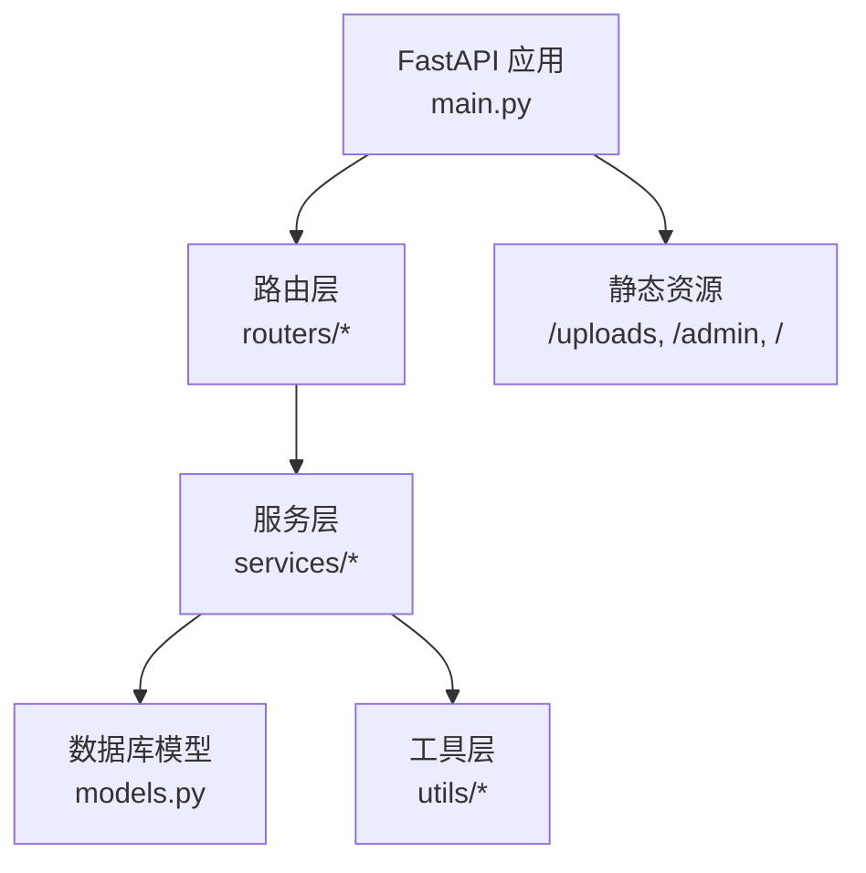

图示来源
- [main.py:1-49](file://summer-homework-checkin/backend/app/main.py#L1-L49)

章节来源
- [README.md:26-49](file://summer-homework-checkin/README.md#L26-L49)
- [main.py:1-49](file://summer-homework-checkin/backend/app/main.py#L1-L49)

## 核心组件
- 打卡与审核：提交打卡、补卡、管理员审核通过后发放积分并重算连续天数与抽奖资格。
- 防代打卡四重校验：照片真实性、地理位置一致性、人脸 1:1 比对、场景合规综合判定。
- 连续打卡与抽奖资格：按 7 天里程碑自动发放抽奖券，累积不可折现。
- 抽奖机制：加权随机抽取，库存扣减与中奖记录生成。
- 家长监督：绑定孩子后实时接收打卡与抽奖通知。
- 报表与可视化：按暑假周期生成周维度分布与关键指标 HTML 报告。
- 后台审核：打卡与兑换记录审核、统计概览与用户管理。

章节来源
- [README.md:8-23](file://summer-homework-checkin/README.md#L8-L23)
- [config.py:27-49](file://summer-homework-checkin/backend/app/config.py#L27-L49)
- [checkin_service.py:39-62](file://summer-homework-checkin/backend/app/services/checkin_service.py#L39-L62)
- [lottery_service.py:9-77](file://summer-homework-checkin/backend/app/services/lottery_service.py#L9-L77)
- [report_service.py:6-50](file://summer-homework-checkin/backend/app/services/report_service.py#L6-L50)

## 架构总览
系统分层清晰：客户端调用 API，路由层进行鉴权与入参校验，服务层执行业务规则与外部能力（人脸、地理），持久化到 SQLite，并通过静态资源提供前端页面。

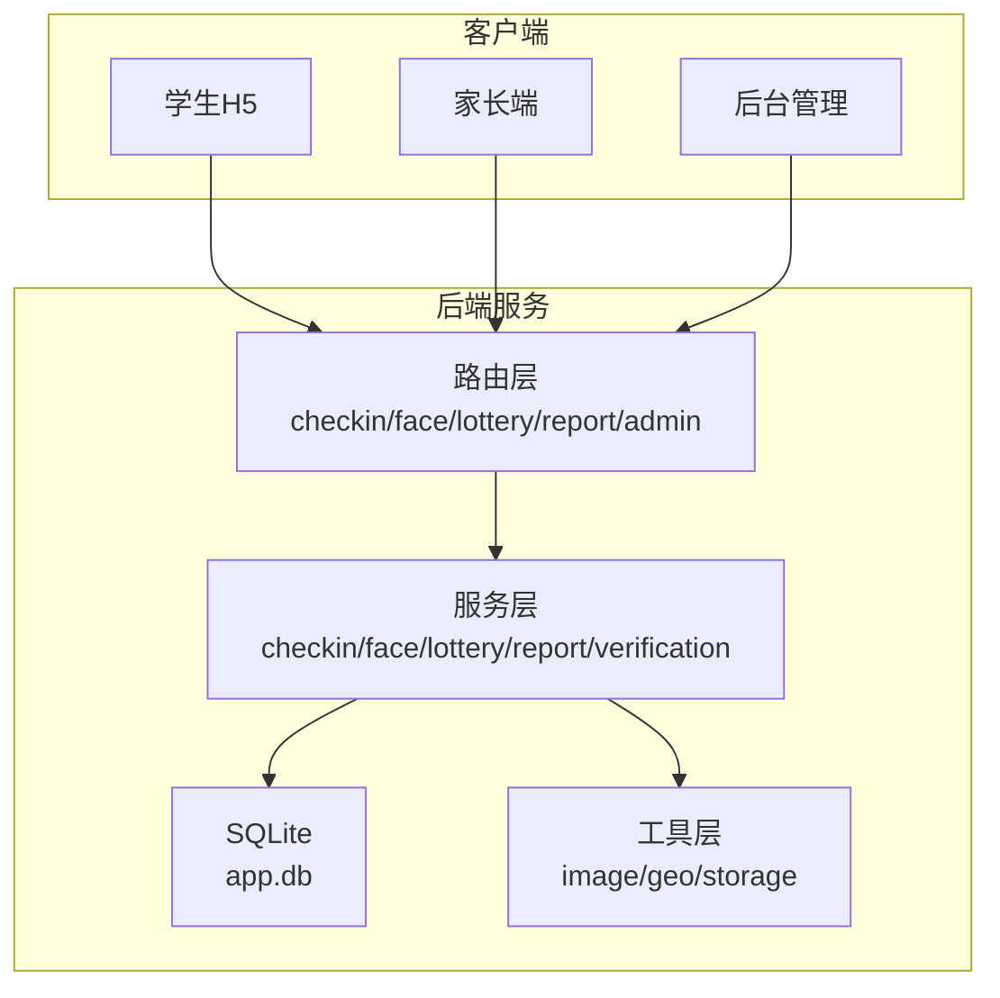

图示来源
- [main.py:21-30](file://summer-homework-checkin/backend/app/main.py#L21-L30)
- [checkin.py:17-37](file://summer-homework-checkin/backend/app/routers/checkin.py#L17-L37)
- [face.py:14-26](file://summer-homework-checkin/backend/app/routers/face.py#L14-L26)
- [lottery.py:25-29](file://summer-homework-checkin/backend/app/routers/lottery.py#L25-L29)
- [report.py:17-35](file://summer-homework-checkin/backend/app/routers/report.py#L17-L35)
- [admin.py:84-103](file://summer-homework-checkin/backend/app/routers/admin.py#L84-L103)

## 详细组件分析

### 防代打卡四重校验体系
- 照片真实性检测：校验 JPEG/PNG、体积与最小边长，过滤占位图/缩略图。
- 地理位置一致性验证：计算设备经纬度与常用位置距离，超阈值标记风险。
- 人脸识别 1:1 比对：采集正脸底图，现场照与底图提取 512 维特征做余弦相似度比对，低于阈值拒绝或标记风险。
- 场景合规综合判定：综合上述结果输出 scene_check 与 risk 等级，供后台追溯。

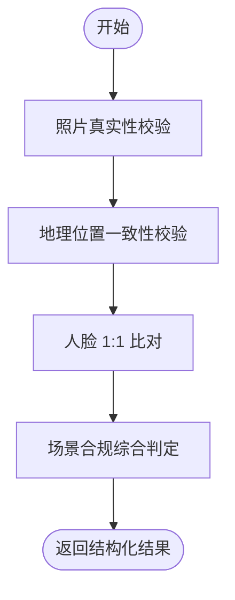

图示来源
- [verification_service.py:19-71](file://summer-homework-checkin/backend/app/services/verification_service.py#L19-L71)
- [face_service.py:99-125](file://summer-homework-checkin/backend/app/services/face_service.py#L99-L125)
- [config.py:27-49](file://summer-homework-checkin/backend/app/config.py#L27-L49)

章节来源
- [README.md:97-109](file://summer-homework-checkin/README.md#L97-L109)
- [verification_service.py:19-71](file://summer-homework-checkin/backend/app/services/verification_service.py#L19-L71)
- [face_service.py:99-125](file://summer-homework-checkin/backend/app/services/face_service.py#L99-L125)

### 连续打卡统计算法
- 输入有效打卡日期集合，排序去重后线性扫描计算最长连续与当前连续。
- 若最近有效日与今天相邻则延续当前连续，否则重置为 0。
- 基于当前连续天数按 7 天里程碑发放抽奖资格，保留已发放次数。

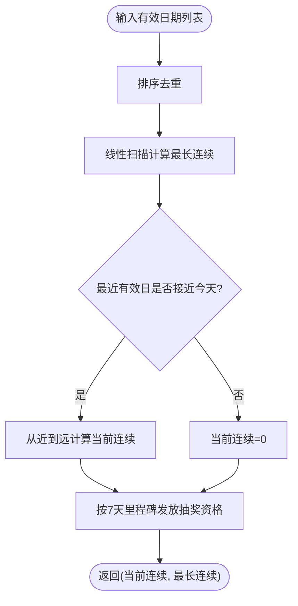

图示来源
- [checkin_service.py:12-62](file://summer-homework-checkin/backend/app/services/checkin_service.py#L12-L62)

章节来源
- [checkin_service.py:12-62](file://summer-homework-checkin/backend/app/services/checkin_service.py#L12-L62)

### 积分奖励计算规则
- 正常打卡审核通过获得固定积分，补卡审核通过获得较低积分，鼓励当日完成。
- 审核通过时更新用户积分余额，并触发连续天数重算与抽奖资格发放。

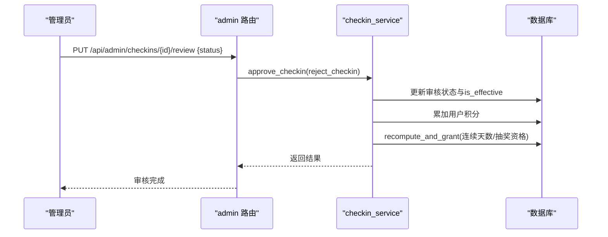

图示来源
- [admin.py:84-103](file://summer-homework-checkin/backend/app/routers/admin.py#L84-L103)
- [checkin_service.py:166-191](file://summer-homework-checkin/backend/app/services/checkin_service.py#L166-L191)
- [checkin_service.py:39-62](file://summer-homework-checkin/backend/app/services/checkin_service.py#L39-L62)

章节来源
- [checkin_service.py:166-191](file://summer-homework-checkin/backend/app/services/checkin_service.py#L166-L191)
- [config.py:37-40](file://summer-homework-checkin/backend/app/config.py#L37-L40)

### 抽奖资格获取与抽奖逻辑
- 每满 7 天连续有效打卡解锁 1 次抽奖资格，永久累积、不可折现/转让。
- 抽奖消耗 1 次资格，按奖品概率权重与库存限制加权随机抽取；中奖自动生成兑换记录。

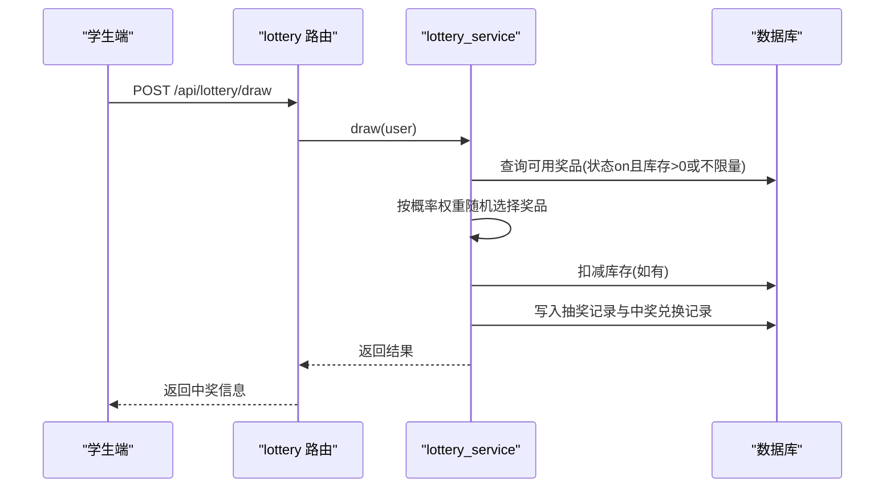

图示来源
- [lottery.py:25-29](file://summer-homework-checkin/backend/app/routers/lottery.py#L25-L29)
- [lottery_service.py:9-77](file://summer-homework-checkin/backend/app/services/lottery_service.py#L9-L77)
- [checkin_service.py:39-62](file://summer-homework-checkin/backend/app/services/checkin_service.py#L39-L62)

章节来源
- [lottery_service.py:9-77](file://summer-homework-checkin/backend/app/services/lottery_service.py#L9-L77)
- [checkin_service.py:39-62](file://summer-homework-checkin/backend/app/services/checkin_service.py#L39-L62)

### 家长监督与通知同步
- 家长凭绑定码与孩子绑定，打卡与抽奖事件实时推送站内通知。
- 打卡提交即通知学生与家长；审核通过再次通知学生；中奖同时通知双方。

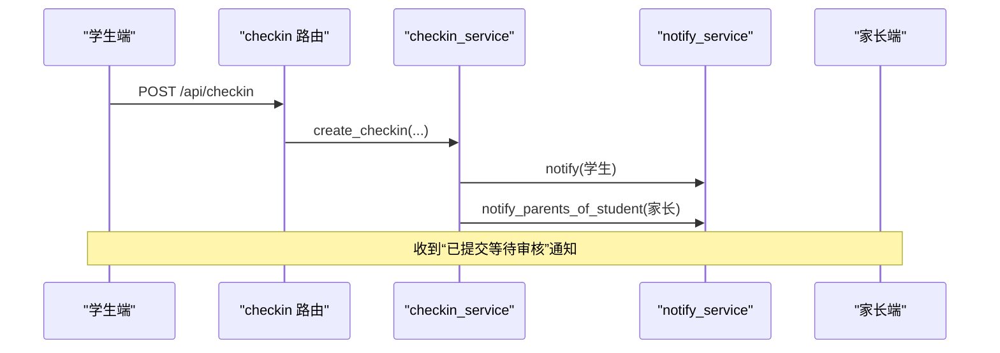

图示来源
- [checkin.py:17-37](file://summer-homework-checkin/backend/app/routers/checkin.py#L17-L37)
- [checkin_service.py:148-163](file://summer-homework-checkin/backend/app/services/checkin_service.py#L148-L163)

章节来源
- [checkin_service.py:148-163](file://summer-homework-checkin/backend/app/services/checkin_service.py#L148-L163)

### 学习进度报表生成算法
- 统计区间内有效打卡天数、完成率、补卡次数、最长/当前连续、每周分布、中奖记录与抽奖次数。
- 将结构化数据渲染为卡通风格 HTML，支持打印下载。

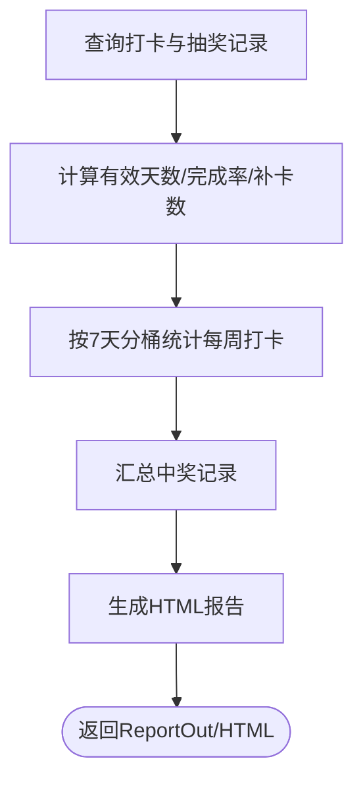

图示来源
- [report_service.py:6-50](file://summer-homework-checkin/backend/app/services/report_service.py#L6-L50)
- [report_service.py:53-109](file://summer-homework-checkin/backend/app/services/report_service.py#L53-L109)
- [report.py:17-35](file://summer-homework-checkin/backend/app/routers/report.py#L17-L35)

章节来源
- [report_service.py:6-50](file://summer-homework-checkin/backend/app/services/report_service.py#L6-L50)
- [report_service.py:53-109](file://summer-homework-checkin/backend/app/services/report_service.py#L53-L109)

### 后台审核流程
- 管理员查看待审打卡数量与列表，批准或拒绝打卡记录；批准后自动发放积分并重算连续天数。
- 管理兑换记录，兑现或拒绝（拒绝退还积分）。

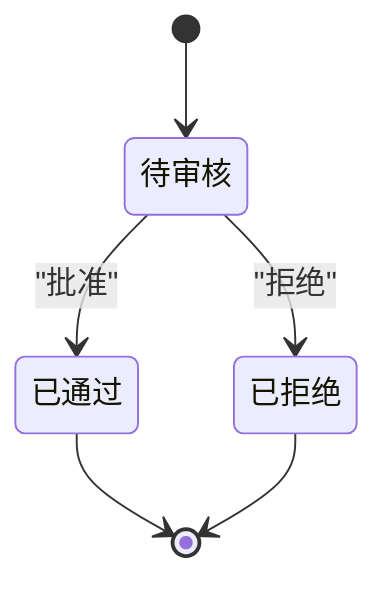

图示来源
- [admin.py:84-103](file://summer-homework-checkin/backend/app/routers/admin.py#L84-L103)
- [checkin_service.py:166-209](file://summer-homework-checkin/backend/app/services/checkin_service.py#L166-L209)

章节来源
- [admin.py:84-103](file://summer-homework-checkin/backend/app/routers/admin.py#L84-L103)
- [checkin_service.py:166-209](file://summer-homework-checkin/backend/app/services/checkin_service.py#L166-L209)

### 人脸 1:1 比对类图
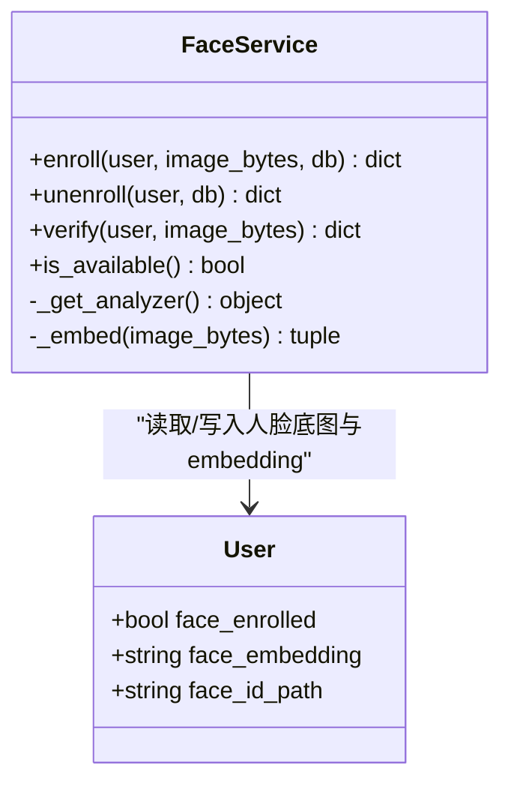

图示来源
- [face_service.py:71-133](file://summer-homework-checkin/backend/app/services/face_service.py#L71-L133)
- [models.py:27-31](file://summer-homework-checkin/backend/app/models.py#L27-L31)

章节来源
- [face_service.py:71-133](file://summer-homework-checkin/backend/app/services/face_service.py#L71-L133)
- [models.py:27-31](file://summer-homework-checkin/backend/app/models.py#L27-L31)

## 依赖关系分析
- 路由层依赖服务层与鉴权依赖；服务层依赖模型、配置与工具层；工具层提供图像解析、地理距离计算与文件存储。
- 人脸识别服务在首次调用时懒加载 insightface 分析器，无外网环境自动降级为安全模式。

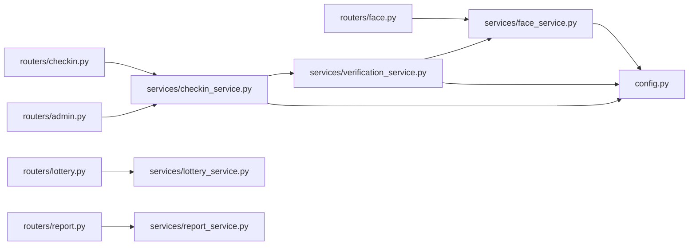

图示来源
- [checkin.py:17-37](file://summer-homework-checkin/backend/app/routers/checkin.py#L17-L37)
- [face.py:14-26](file://summer-homework-checkin/backend/app/routers/face.py#L14-L26)
- [lottery.py:25-29](file://summer-homework-checkin/backend/app/routers/lottery.py#L25-L29)
- [report.py:17-35](file://summer-homework-checkin/backend/app/routers/report.py#L17-L35)
- [admin.py:84-103](file://summer-homework-checkin/backend/app/routers/admin.py#L84-L103)
- [checkin_service.py:64-163](file://summer-homework-checkin/backend/app/services/checkin_service.py#L64-L163)
- [verification_service.py:19-71](file://summer-homework-checkin/backend/app/services/verification_service.py#L19-L71)
- [face_service.py:99-125](file://summer-homework-checkin/backend/app/services/face_service.py#L99-L125)
- [config.py:27-49](file://summer-homework-checkin/backend/app/config.py#L27-L49)

章节来源
- [main.py:21-30](file://summer-homework-checkin/backend/app/main.py#L21-L30)
- [config.py:27-49](file://summer-homework-checkin/backend/app/config.py#L27-L49)

## 性能与可扩展性
- 并发与吞吐：压测显示约 570 req·s⁻¹，稳定运行。生产建议 uvicorn 多 worker 或前置 Nginx 负载均衡。
- 数据库：SQLite 适合演示；正式环境建议替换为 PostgreSQL/MySQL 并配置连接池。
- 人脸推理：默认 insightface 本地 CPU 推理，首次按需下载模型；无外网自动降级为安全模式，不静默放行。
- 图片与存储：上传目录运行时生成，可迁移至对象存储/CDN 提升访问性能。
- 扩展点：预留 face_embedding 字段，未来可平滑扩展为 1:N 身份检索，业务主流程无需改动。

章节来源
- [README.md:112-126](file://summer-homework-checkin/README.md#L112-L126)
- [face_service.py:28-46](file://summer-homework-checkin/backend/app/services/face_service.py#L28-L46)
- [main.py:43-48](file://summer-homework-checkin/backend/app/main.py#L43-L48)

## 故障排查指南
- 人脸模型不可用：当 insightface 未安装或无法下载模型时，服务返回 model_unavailable；已采集底图的账号在 enforce 模式下会拒绝打卡，soft 模式仅标记风险。检查环境变量 FACE_MATCH_THRESHOLD 与 FACE_MODE_ON_ENROLLED。
- 照片不合规：体积过小/过大或非 JPEG/PNG 会被拒绝；确保上传真实现场照片。
- 地理位置异常：超出 GEO_THRESHOLD_METERS 将被标记 geo_flag，后台高亮风险。
- 补卡失败：目标日期无效、不在暑假范围、重复打卡或当月补卡次数已达上限。
- 审核状态冲突：重复审核同一记录会报错；请确认记录当前状态。

章节来源
- [face_service.py:99-125](file://summer-homework-checkin/backend/app/services/face_service.py#L99-L125)
- [checkin_service.py:64-103](file://summer-homework-checkin/backend/app/services/checkin_service.py#L64-L103)
- [checkin_service.py:166-209](file://summer-homework-checkin/backend/app/services/checkin_service.py#L166-L209)
- [config.py:27-49](file://summer-homework-checkin/backend/app/config.py#L27-L49)

## 结论
本系统以严谨的四重校验保障打卡真实性，结合连续打卡统计与积分/抽奖激励，形成闭环的暑期学习打卡生态。家长监督与后台审核增强过程可控性与透明度，报表可视化助力家校协同。面向生产部署，建议在数据库、服务与存储层面进行优化，并充分利用人脸服务的可插拔特性实现更高精度识别。

## 附录：配置项与API清单

### 关键配置项
- 地理阈值：GEO_THRESHOLD_METERS（米）
- 补卡限额：MAX_MAKEUP_PER_MONTH（次/月）
- 照片门槛：MIN_PHOTO_BYTES、MIN_PHOTO_DIM、PHOTO_MAX_BYTES
- 抽奖门槛：LOTTERY_STREAK_THRESHOLD（天）
- 积分规则：CHECKIN_POINTS、MAKEUP_POINTS
- 人脸识别：FACE_MATCH_THRESHOLD、FACE_DET_SIZE、FACE_MODEL_NAME、FACE_MODE_ON_ENROLLED

章节来源
- [config.py:27-49](file://summer-homework-checkin/backend/app/config.py#L27-L49)

### 核心 API 一览
- 认证：POST /api/auth/register、/api/auth/login
- 打卡：POST /api/checkin、GET /api/checkin/streak、GET /api/checkin/today、GET /api/checkin/history
- 人脸：POST /api/face/enroll、GET /api/face/status、DELETE /api/face/enroll
- 抽奖：POST /api/lottery/draw、GET /api/lottery/tickets
- 报表：GET /api/report/me、GET /api/report/me/html
- 家长：POST /api/parent/bind、GET /api/parent/notifications
- 管理：GET /api/admin/stats、/users、/checkins、/redemptions；PUT /api/admin/checkins/{id}/review、/api/admin/redemptions/{id}/review

章节来源
- [README.md:81-94](file://summer-homework-checkin/README.md#L81-L94)
- [checkin.py:17-80](file://summer-homework-checkin/backend/app/routers/checkin.py#L17-L80)
- [face.py:14-45](file://summer-homework-checkin/backend/app/routers/face.py#L14-L45)
- [lottery.py:13-29](file://summer-homework-checkin/backend/app/routers/lottery.py#L13-L29)
- [report.py:17-35](file://summer-homework-checkin/backend/app/routers/report.py#L17-L35)
- [admin.py:16-214](file://summer-homework-checkin/backend/app/routers/admin.py#L16-L214)