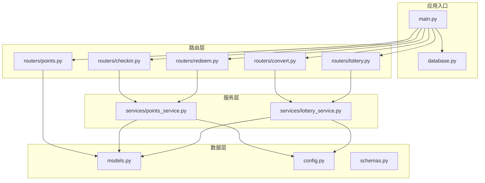
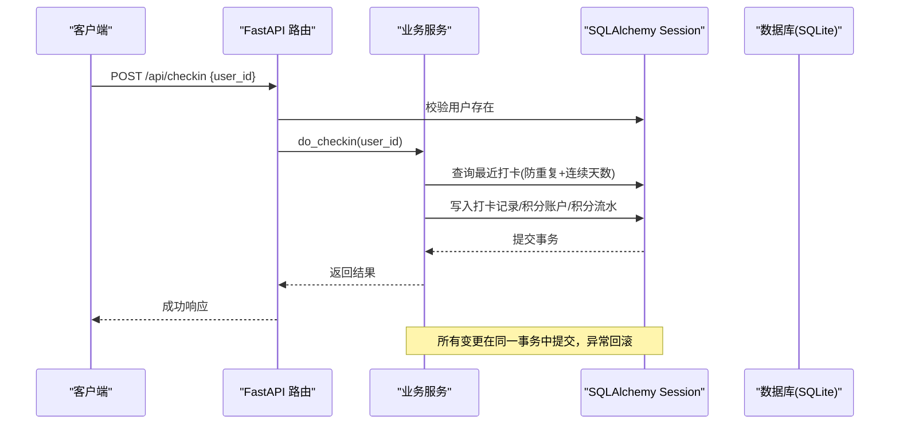
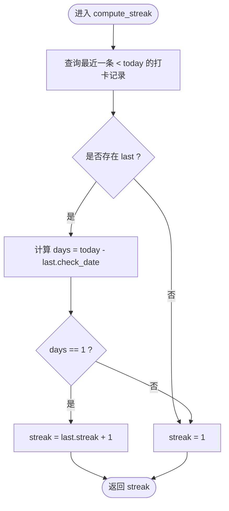
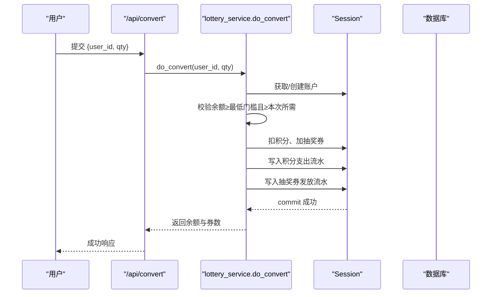
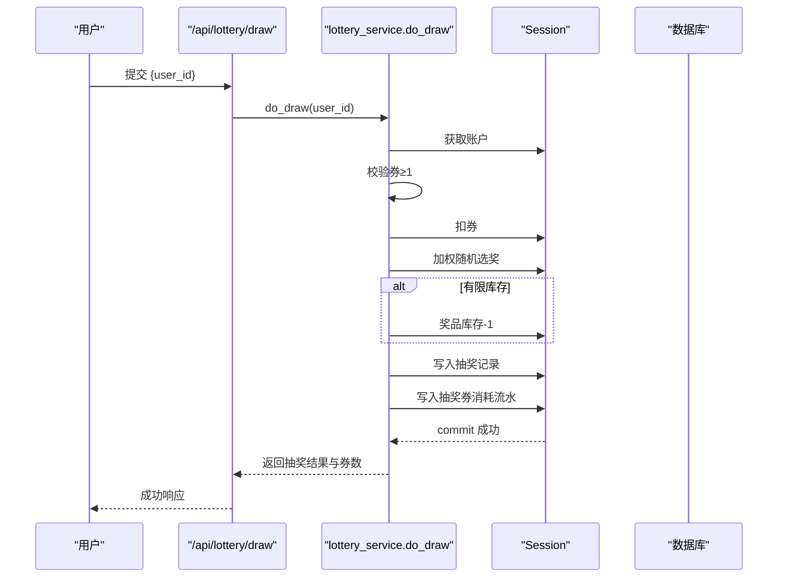
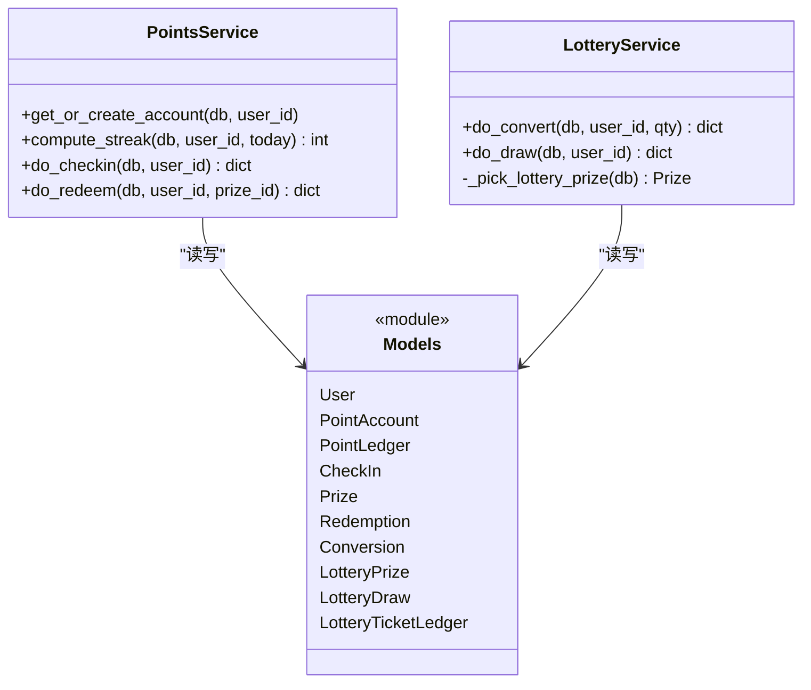
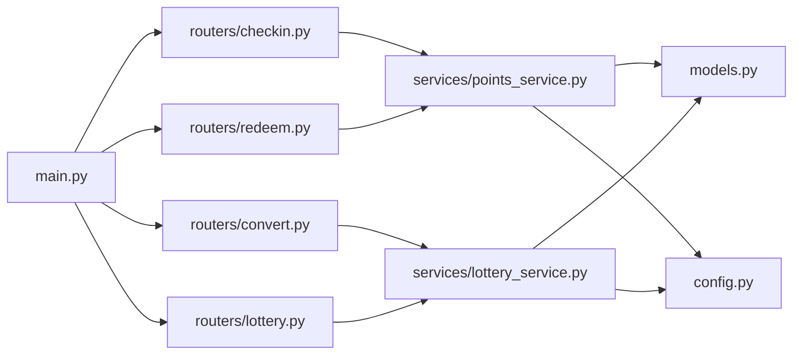

# 积分奖励系统

<cite>
**本文引用的文件**   
- [main.py](file://points-system/backend/app/main.py)
- [database.py](file://points-system/backend/app/database.py)
- [models.py](file://points-system/backend/app/models.py)
- [config.py](file://points-system/backend/app/config.py)
- [schemas.py](file://points-system/backend/app/schemas.py)
- [checkin.py](file://points-system/backend/app/routers/checkin.py)
- [points.py](file://points-system/backend/app/routers/points.py)
- [redeem.py](file://points-system/backend/app/routers/redeem.py)
- [convert.py](file://points-system/backend/app/routers/convert.py)
- [lottery.py](file://points-system/backend/app/routers/lottery.py)
- [points_service.py](file://points-system/backend/app/services/points_service.py)
- [lottery_service.py](file://points-system/backend/app/services/lottery_service.py)
</cite>

## 目录
1. [简介](#简介)
2. [项目结构](#项目结构)
3. [核心组件](#核心组件)
4. [架构总览](#架构总览)
5. [详细组件分析](#详细组件分析)
6. [依赖关系分析](#依赖关系分析)
7. [性能与一致性](#性能与一致性)
8. [故障排查指南](#故障排查指南)
9. [结论](#结论)
10. [附录：API 定义与查询优化](#附录api-定义与查询优化)

## 简介
本技术文档围绕“积分奖励系统”的完整实现，系统性阐述以下关键主题：
- 积分计算规则体系：正常打卡积分、补卡积分、连续打卡里程碑奖励的计算逻辑
- 连续打卡统计的核心算法：_streak 函数（对应 compute_streak）的实现原理与中断处理策略
- 7天里程碑抽奖资格解锁机制：进度跟踪与资格发放的原子性保证
- 积分账户数据一致性保障：事务处理与并发控制策略
- 积分流水记录的设计模式与查询优化方案
- 配置化的积分规则管理：支持不同用户类型的差异化奖励策略（可扩展设计）

## 项目结构
后端采用 FastAPI + SQLAlchemy 分层架构：路由层负责请求校验与响应组装；服务层封装业务逻辑；模型层定义数据库实体；配置集中管理积分与抽奖规则。

图表来源
- [main.py:1-33](file://points-system/backend/app/main.py#L1-L33)
- [database.py:1-39](file://points-system/backend/app/database.py#L1-L39)
- [checkin.py:1-16](file://points-system/backend/app/routers/checkin.py#L1-L16)
- [points.py:1-28](file://points-system/backend/app/routers/points.py#L1-L28)
- [redeem.py:1-52](file://points-system/backend/app/routers/redeem.py#L1-L52)
- [convert.py:1-64](file://points-system/backend/app/routers/convert.py#L1-L64)
- [lottery.py:1-55](file://points-system/backend/app/routers/lottery.py#L1-L55)
- [points_service.py:1-146](file://points-system/backend/app/services/points_service.py#L1-L146)
- [lottery_service.py:1-174](file://points-system/backend/app/services/lottery_service.py#L1-L174)
- [models.py:1-151](file://points-system/backend/app/models.py#L1-L151)
- [config.py:1-17](file://points-system/backend/app/config.py#L1-L17)
- [schemas.py:1-147](file://points-system/backend/app/schemas.py#L1-L147)

章节来源
- [main.py:1-33](file://points-system/backend/app/main.py#L1-L33)
- [database.py:1-39](file://points-system/backend/app/database.py#L1-L39)

## 核心组件
- 数据模型
  - 用户与账户：User、PointAccount（余额、累计收支、抽奖券数量）
  - 流水：PointLedger（积分流水）、LotteryTicketLedger（抽奖券流水）
  - 打卡：CheckIn（每日打卡、连续天数、本次奖励）
  - 奖品与兑换：Prize、Redemption
  - 抽奖：LotteryPrize、LotteryDraw、Conversion（积分换券）
- 服务层
  - points_service：打卡、兑换、连续天数计算
  - lottery_service：积分换券、加权随机抽奖、券消耗与权限派生
- 配置层
  - config：基础积分、连续奖励阈值、换券比例、单次抽券消耗等

章节来源
- [models.py:10-151](file://points-system/backend/app/models.py#L10-L151)
- [points_service.py:1-146](file://points-system/backend/app/services/points_service.py#L1-L146)
- [lottery_service.py:1-174](file://points-system/backend/app/services/lottery_service.py#L1-L174)
- [config.py:1-17](file://points-system/backend/app/config.py#L1-L17)

## 架构总览
系统以 REST API 暴露能力，服务层统一在单事务内完成读改写，确保账户与库存一致性。SQLite 下通过 WAL 日志与进程内锁降低竞态风险；生产建议迁移至支持行级锁的数据库并启用悲观锁。

图表来源
- [checkin.py:11-16](file://points-system/backend/app/routers/checkin.py#L11-L16)
- [points_service.py:41-91](file://points-system/backend/app/services/points_service.py#L41-L91)
- [database.py:16-23](file://points-system/backend/app/database.py#L16-L23)

## 详细组件分析

### 积分计算规则体系
- 正常打卡积分
  - 基础积分：POINTS_PER_CHECKIN
  - 连续奖励：当 streak % STREAK_BONUS_EVERY == 0 时，额外获得 POINTS_STREAK_BONUS
  - 本次获得 = 基础积分 + 连续奖励
- 补卡积分
  - 当前实现未提供补卡接口；若需支持，可在服务层新增补卡方法，按目标日期重新计算 streak 与奖励，并生成相应流水。为保证一致性，需在事务内更新 CheckIn、PointAccount 与 PointLedger。
- 连续打卡里程碑奖励
  - 每连续 STREAK_BONUS_EVERY 天触发一次 POINTS_STREAK_BONUS 奖励，由 streak 整除判定驱动。

章节来源
- [config.py:3-10](file://points-system/backend/app/config.py#L3-L10)
- [points_service.py:49-51](file://points-system/backend/app/services/points_service.py#L49-L51)

### 连续打卡统计核心算法（compute_streak）
- 算法流程
  - 查询该用户小于 today 的最新一条打卡记录 last
  - 若 last 存在且 (today - last.check_date).days == 1，则 streak = last.streak + 1
  - 否则 streak = 1（断签重置）
- 中断处理策略
  - 只要中间缺失任意一天，streak 即重置为 1，体现“自然日连续”的要求
- 复杂度
  - 时间 O(1)（按 user_id 与 check_date 索引排序取第一条）
  - 空间 O(1)

图表来源
- [points_service.py:27-38](file://points-system/backend/app/services/points_service.py#L27-L38)

章节来源
- [points_service.py:27-38](file://points-system/backend/app/services/points_service.py#L27-L38)

### 7天里程碑抽奖资格解锁机制
- 资格来源
  - 抽奖资格并非直接由连续天数决定，而是通过“积分兑换抽奖券”获得。account.lottery_tickets ≥ 1 即视为已解锁抽奖权限。
- 兑换流程
  - 校验积分余额是否满足最低门槛与本次所需积分
  - 同一事务内扣减积分、增加抽奖券，并分别写入积分支出流水与抽奖券发放流水
- 原子性保证
  - 使用 SQLAlchemy 事务与 IntegrityError 兜底，确保「积分扣减」与「券发放」同时成功或失败
  - 单进程并发保护：使用 threading.Lock 将账户相关操作串行化，避免 SQLite 下的丢失更新

图表来源
- [convert.py:11-28](file://points-system/backend/app/routers/convert.py#L11-L28)
- [lottery_service.py:30-98](file://points-system/backend/app/services/lottery_service.py#L30-L98)
- [database.py:16-23](file://points-system/backend/app/database.py#L16-L23)

章节来源
- [lottery_service.py:30-98](file://points-system/backend/app/services/lottery_service.py#L30-L98)
- [convert.py:11-28](file://points-system/backend/app/routers/convert.py#L11-L28)

### 抽奖流程与权重随机
- 抽奖条件
  - account.lottery_tickets ≥ TICKETS_PER_DRAW（默认 1），不满足则拒绝
- 随机选奖
  - 从 LotteryPrize 中筛选可发放奖品（stock 为 None 或 > 0）
  - 按 weight 加权随机选择
- 执行与落库
  - 同事务内扣减 1 张券、可选扣减有限库存奖品、写入抽奖记录与抽奖券消耗流水
  - 返回剩余券数与是否仍可抽奖（can_lottery）

图表来源
- [lottery.py:24-37](file://points-system/backend/app/routers/lottery.py#L24-L37)
- [lottery_service.py:117-173](file://points-system/backend/app/services/lottery_service.py#L117-L173)

章节来源
- [lottery_service.py:101-173](file://points-system/backend/app/services/lottery_service.py#L101-L173)
- [lottery.py:24-37](file://points-system/backend/app/routers/lottery.py#L24-L37)

### 积分账户数据一致性与并发控制
- 事务边界
  - 所有读改写均在同一 Session 事务内完成，成功统一 commit，异常统一 rollback
- 并发控制
  - 单进程：threading.Lock 串行化账户相关操作，防止 SQLite 下丢失更新
  - 多实例：建议使用 PostgreSQL 的 with_for_update() 进行悲观锁
- 唯一约束兜底
  - 打卡表对 (user_id, check_date) 设置唯一约束，IntegrityError 作为最终防线

图表来源
- [points_service.py:18-146](file://points-system/backend/app/services/points_service.py#L18-L146)
- [lottery_service.py:30-173](file://points-system/backend/app/services/lottery_service.py#L30-L173)
- [models.py:10-151](file://points-system/backend/app/models.py#L10-L151)

章节来源
- [points_service.py:77-83](file://points-system/backend/app/services/points_service.py#L77-L83)
- [lottery_service.py:23-27](file://points-system/backend/app/services/lottery_service.py#L23-L27)
- [models.py:62-65](file://points-system/backend/app/models.py#L62-L65)

### 积分流水记录设计与查询优化
- 设计模式
  - 双流水：PointLedger（积分）与 LotteryTicketLedger（抽奖券）
  - 每条变动均记录 balance_after，便于对账与审计
  - ref_type/ref_id 关联业务主键，形成可追溯链路
- 查询优化
  - 按 created_at 倒序分页查询，limit 限制返回量
  - 建议在 user_id、created_at 上建立复合索引以提升查询性能
  - 报表场景可使用物化视图或定时汇总表

章节来源
- [models.py:35-48](file://points-system/backend/app/models.py#L35-L48)
- [models.py:110-123](file://points-system/backend/app/models.py#L110-L123)
- [points.py:18-27](file://points-system/backend/app/routers/points.py#L18-L27)

### 配置化的积分规则管理与差异化策略
- 现有配置项
  - 基础积分、连续奖励金额、连续奖励周期、积分换券比例、单次抽券消耗
- 差异化策略扩展建议
  - 在 models 中引入用户类型字段（如 membership_level）
  - 在 config 中维护不同用户类型的奖励映射表
  - 在 compute_streak 与 do_checkin 中根据用户类型动态计算基础积分与连续奖励
  - 注意：上述为扩展设计说明，当前代码未实现差异化分支

章节来源
- [config.py:1-17](file://points-system/backend/app/config.py#L1-L17)
- [points_service.py:49-51](file://points-system/backend/app/services/points_service.py#L49-L51)

## 依赖关系分析
- 模块耦合
  - 路由层仅依赖服务层与模型层，职责清晰
  - 服务层集中持有业务规则与事务边界
  - 配置集中管理，便于环境覆盖
- 外部依赖
  - SQLite（WAL 模式、busy_timeout）
  - FastAPI 路由与 Pydantic 模型校验

图表来源
- [main.py:22-29](file://points-system/backend/app/main.py#L22-L29)
- [checkin.py:1-16](file://points-system/backend/app/routers/checkin.py#L1-L16)
- [redeem.py:1-52](file://points-system/backend/app/routers/redeem.py#L1-L52)
- [convert.py:1-64](file://points-system/backend/app/routers/convert.py#L1-L64)
- [lottery.py:1-55](file://points-system/backend/app/routers/lottery.py#L1-L55)
- [points_service.py:1-146](file://points-system/backend/app/services/points_service.py#L1-L146)
- [lottery_service.py:1-174](file://points-system/backend/app/services/lottery_service.py#L1-L174)
- [models.py:1-151](file://points-system/backend/app/models.py#L1-L151)
- [config.py:1-17](file://points-system/backend/app/config.py#L1-L17)

章节来源
- [main.py:22-29](file://points-system/backend/app/main.py#L22-L29)

## 性能与一致性
- 数据库层面
  - SQLite WAL 提升并发读性能，busy_timeout 减少写冲突等待
  - 建议为高频查询列添加索引：users.id、point_accounts.user_id、checkins.user_id+check_date、point_ledgers.user_id+created_at、lottery_ticket_ledgers.user_id+created_at
- 应用层面
  - 单进程线程锁串行化账户操作，避免丢失更新
  - 多实例部署建议切换至支持行级锁的数据库并使用 with_for_update()
- 事务与幂等
  - 所有写操作在单事务内提交，异常回滚
  - 打卡防重：先查后写 + 唯一约束兜底

章节来源
- [database.py:16-23](file://points-system/backend/app/database.py#L16-L23)
- [lottery_service.py:23-27](file://points-system/backend/app/services/lottery_service.py#L23-L27)
- [points_service.py:77-83](file://points-system/backend/app/services/points_service.py#L77-L83)

## 故障排查指南
- 常见错误码与原因
  - 409 今日已打卡：重复打卡或并发冲突（唯一约束拦截）
  - 400 积分不足/奖品未开始/已过期/库存不足：前置校验失败
  - 404 用户不存在：用户 ID 无效
  - 500 奖池暂无可发放奖品：理论上不应发生（兜底保护）
- 定位步骤
  - 检查对应用户的积分流水与抽奖券流水，确认 balance_after 变化是否符合预期
  - 核对打卡记录中的 streak 与 bonus 是否与规则一致
  - 查看数据库日志与异常堆栈，确认事务是否回滚

章节来源
- [points_service.py:45-83](file://points-system/backend/app/services/points_service.py#L45-L83)
- [lottery_service.py:30-98](file://points-system/backend/app/services/lottery_service.py#L30-L98)
- [lottery_service.py:117-173](file://points-system/backend/app/services/lottery_service.py#L117-L173)

## 结论
本系统在规则配置、事务一致性、并发控制与可追溯性方面具备良好实践。针对“补卡”和“用户类型差异化奖励”，可通过在服务层与配置层扩展实现，保持现有事务与并发策略不变。生产环境建议迁移到支持行级锁的数据库，并完善索引与监控告警。

## 附录：API 定义与查询优化

### API 概览
- 打卡
  - POST /api/checkin：提交 user_id，返回打卡结果、本次积分、连续天数与余额
- 积分查询
  - GET /api/points?user_id=...：返回账户信息
  - GET /api/ledger?user_id=...&limit=...：返回积分流水
- 兑换
  - POST /api/redeem：提交 user_id 与 prize_id，返回兑换记录与余额
  - GET /api/redemptions?user_id=...：返回兑换历史
- 积分换券
  - POST /api/convert：提交 user_id 与 qty，返回兑换记录、余额与券数
  - GET /api/conversions?user_id=...：返回兑换历史
  - GET /api/ticket-ledger?user_id=...：返回抽奖券流水
- 抽奖
  - GET /api/lottery/pool：返回奖池配置
  - POST /api/lottery/draw：提交 user_id，返回抽奖结果、剩余券数与是否仍可抽奖
  - GET /api/lottery/draws?user_id=...：返回抽奖历史

章节来源
- [checkin.py:11-16](file://points-system/backend/app/routers/checkin.py#L11-L16)
- [points.py:10-27](file://points-system/backend/app/routers/points.py#L10-L27)
- [redeem.py:11-51](file://points-system/backend/app/routers/redeem.py#L11-L51)
- [convert.py:11-63](file://points-system/backend/app/routers/convert.py#L11-L63)
- [lottery.py:11-54](file://points-system/backend/app/routers/lottery.py#L11-L54)

### 查询优化建议
- 索引建议
  - point_ledgers(user_id, created_at)
  - lottery_ticket_ledgers(user_id, created_at)
  - checkins(user_id, check_date)
  - redemptions(user_id, created_at)
  - conversions(user_id, created_at)
  - lottery_draws(user_id, created_at)
- 分页与限流
  - 列表接口统一使用 limit 参数，前端按需分页
  - 热点接口可增加缓存层（如 Redis）缓存静态配置（奖池、规则）

章节来源
- [points.py:18-27](file://points-system/backend/app/routers/points.py#L18-L27)
- [convert.py:31-63](file://points-system/backend/app/routers/convert.py#L31-L63)
- [lottery.py:40-54](file://points-system/backend/app/routers/lottery.py#L40-L54)