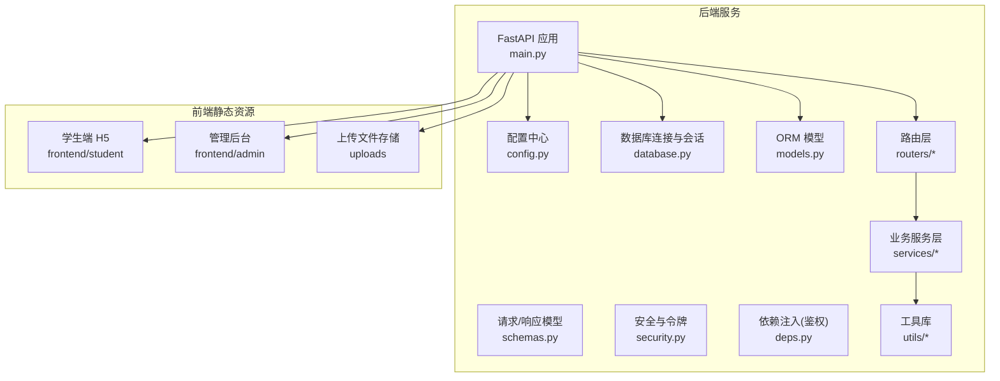
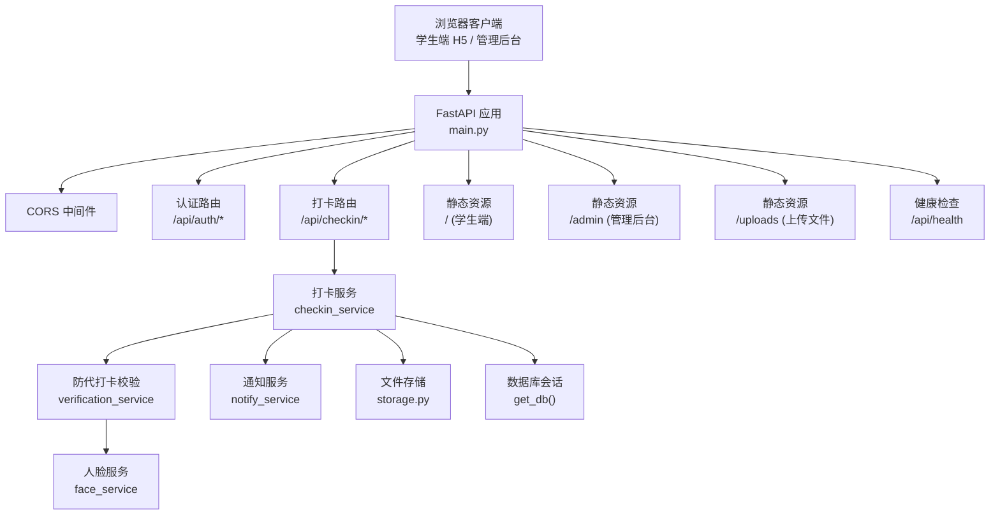
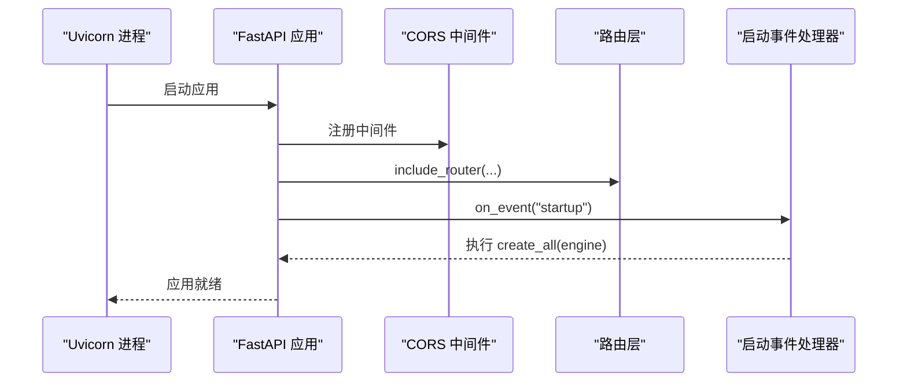
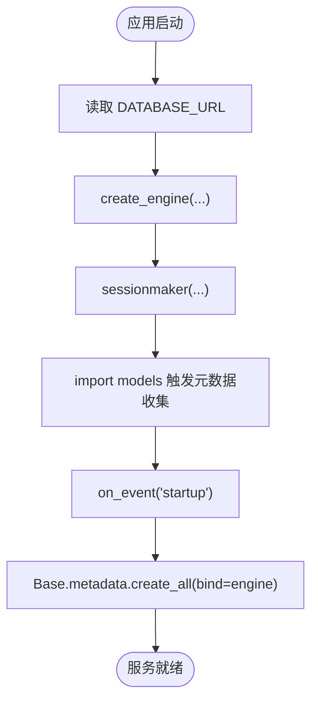
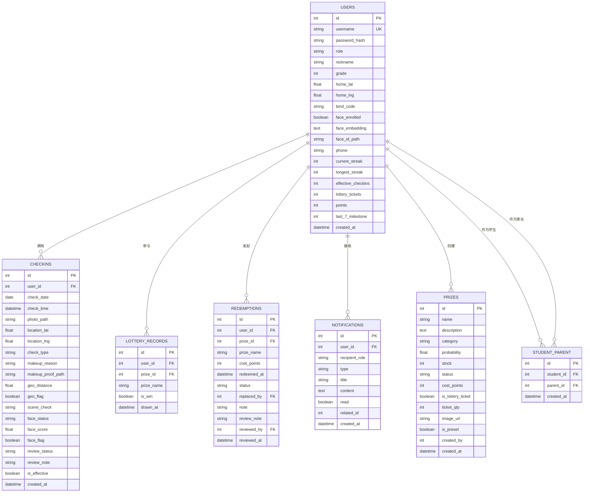
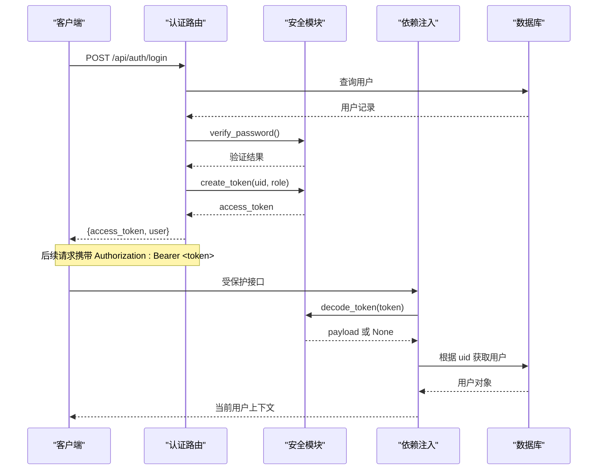
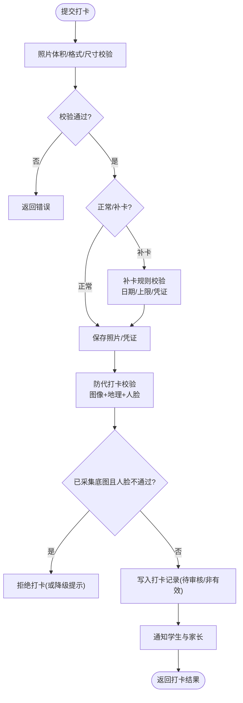
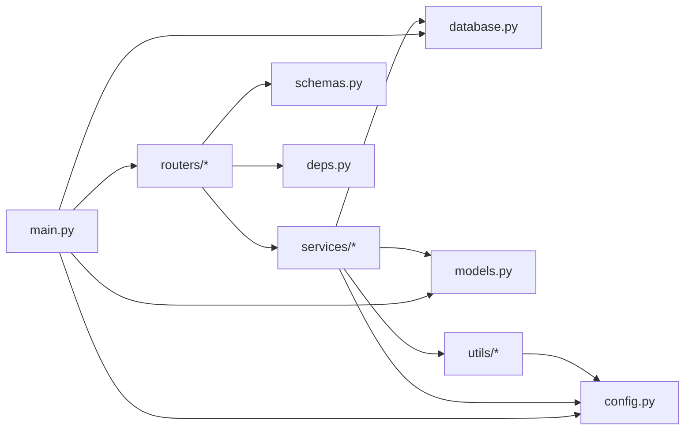

# 系统架构设计

<cite>
**本文引用的文件**   
- [backend/app/main.py](file://summer-homework-checkin/backend/app/main.py)
- [backend/app/config.py](file://summer-homework-checkin/backend/app/config.py)
- [backend/app/database.py](file://summer-homework-checkin/backend/app/database.py)
- [backend/app/models.py](file://summer-homework-checkin/backend/app/models.py)
- [backend/app/schemas.py](file://summer-homework-checkin/backend/app/schemas.py)
- [backend/app/security.py](file://summer-homework-checkin/backend/app/security.py)
- [backend/app/deps.py](file://summer-homework-checkin/backend/app/deps.py)
- [backend/app/routers/auth.py](file://summer-homework-checkin/backend/app/routers/auth.py)
- [backend/app/routers/checkin.py](file://summer-homework-checkin/backend/app/routers/checkin.py)
- [backend/app/services/checkin_service.py](file://summer-homework-checkin/backend/app/services/checkin_service.py)
- [backend/app/services/verification_service.py](file://summer-homework-checkin/backend/app/services/verification_service.py)
- [backend/app/utils/storage.py](file://summer-homework-checkin/backend/app/utils/storage.py)
- [backend/app/utils/image.py](file://summer-homework-checkin/backend/app/utils/image.py)
- [backend/requirements.txt](file://summer-homework-checkin/backend/requirements.txt)
- [README.md](file://summer-homework-checkin/README.md)
</cite>

## 目录
1. [简介](#简介)
2. [项目结构](#项目结构)
3. [核心组件](#核心组件)
4. [架构总览](#架构总览)
5. [详细组件分析](#详细组件分析)
6. [依赖关系分析](#依赖关系分析)
7. [性能与扩展性](#性能与扩展性)
8. [故障排查指南](#故障排查指南)
9. [结论](#结论)
10. [附录](#附录)

## 简介
本文件面向“暑假作业打卡系统”的后端服务，围绕前后端分离的架构模式，系统化阐述 FastAPI 后端的设计理念、模块划分原则、应用启动流程、中间件配置、路由注册机制、静态资源管理、数据库连接与模型加载、表结构初始化、CORS 跨域策略、健康检查接口以及多环境部署策略。文档同时提供架构图与数据流向图，帮助开发者快速理解整体设计与技术选型原因。

## 项目结构
后端采用清晰的分层组织：入口与装配（main）、配置（config）、数据访问（database + models）、请求协议定义（schemas）、安全与鉴权（security + deps）、路由层（routers）、业务服务层（services）与工具库（utils）。前端 H5 学生端与管理后台以静态资源形式由后端托管，实现统一端口对外暴露。

图表来源
- [backend/app/main.py:1-48](file://summer-homework-checkin/backend/app/main.py#L1-L48)
- [backend/app/config.py:1-50](file://summer-homework-checkin/backend/app/config.py#L1-L50)
- [backend/app/database.py:1-22](file://summer-homework-checkin/backend/app/database.py#L1-L22)
- [backend/app/models.py:1-176](file://summer-homework-checkin/backend/app/models.py#L1-L176)
- [backend/app/schemas.py:1-244](file://summer-homework-checkin/backend/app/schemas.py#L1-L244)
- [backend/app/security.py:1-47](file://summer-homework-checkin/backend/app/security.py#L1-L47)
- [backend/app/deps.py:1-34](file://summer-homework-checkin/backend/app/deps.py#L1-L34)
- [backend/app/routers/auth.py:1-52](file://summer-homework-checkin/backend/app/routers/auth.py#L1-L52)
- [backend/app/routers/checkin.py:1-80](file://summer-homework-checkin/backend/app/routers/checkin.py#L1-L80)
- [backend/app/services/checkin_service.py:1-254](file://summer-homework-checkin/backend/app/services/checkin_service.py#L1-L254)
- [backend/app/services/verification_service.py:1-71](file://summer-homework-checkin/backend/app/services/verification_service.py#L1-L71)
- [backend/app/utils/storage.py:1-24](file://summer-homework-checkin/backend/app/utils/storage.py#L1-L24)
- [backend/app/utils/image.py:1-61](file://summer-homework-checkin/backend/app/utils/image.py#L1-L61)

章节来源
- [README.md:26-49](file://summer-homework-checkin/README.md#L26-L49)
- [backend/app/main.py:1-48](file://summer-homework-checkin/backend/app/main.py#L1-L48)

## 核心组件
- 应用入口与装配：创建 FastAPI 实例、挂载 CORS 中间件、注册路由、挂载静态资源、定义健康检查接口、在启动时完成表结构初始化。
- 配置中心：集中管理路径、阈值、限额、人脸识别参数等，支持环境变量覆盖，便于多环境部署。
- 数据库连接：基于 SQLAlchemy 创建引擎与会话工厂，提供 get_db 依赖注入函数。
- ORM 模型：用户、家长绑定、打卡记录、奖品、抽奖记录、兑换记录、通知等实体及关系映射。
- 协议模型：Pydantic 定义的请求/响应结构，保证输入校验与输出序列化一致性。
- 安全与鉴权：密码哈希、HMAC 签名 Token 生成与校验；HTTPBearer 依赖解析当前用户与角色校验。
- 路由层：按功能域拆分 auth、checkin、lottery、prize、parent、report、admin、face、redeem 等路由。
- 服务层：封装复杂业务逻辑，如打卡创建、审核、连续天数重算、防代打卡综合校验、通知等。
- 工具库：图片解析与校验、地理位置计算、文件存储与公开 URL 生成。

章节来源
- [backend/app/main.py:1-48](file://summer-homework-checkin/backend/app/main.py#L1-L48)
- [backend/app/config.py:1-50](file://summer-homework-checkin/backend/app/config.py#L1-L50)
- [backend/app/database.py:1-22](file://summer-homework-checkin/backend/app/database.py#L1-L22)
- [backend/app/models.py:1-176](file://summer-homework-checkin/backend/app/models.py#L1-L176)
- [backend/app/schemas.py:1-244](file://summer-homework-checkin/backend/app/schemas.py#L1-L244)
- [backend/app/security.py:1-47](file://summer-homework-checkin/backend/app/security.py#L1-L47)
- [backend/app/deps.py:1-34](file://summer-homework-checkin/backend/app/deps.py#L1-L34)
- [backend/app/routers/auth.py:1-52](file://summer-homework-checkin/backend/app/routers/auth.py#L1-L52)
- [backend/app/routers/checkin.py:1-80](file://summer-homework-checkin/backend/app/routers/checkin.py#L1-L80)
- [backend/app/services/checkin_service.py:1-254](file://summer-homework-checkin/backend/app/services/checkin_service.py#L1-L254)
- [backend/app/services/verification_service.py:1-71](file://summer-homework-checkin/backend/app/services/verification_service.py#L1-L71)
- [backend/app/utils/storage.py:1-24](file://summer-homework-checkin/backend/app/utils/storage.py#L1-L24)
- [backend/app/utils/image.py:1-61](file://summer-homework-checkin/backend/app/utils/image.py#L1-L61)

## 架构总览
系统采用前后端分离模式：后端仅暴露 REST API 并托管少量静态页面；前端通过浏览器直接访问后端提供的静态资源与 API。FastAPI 作为高性能异步 Web 框架，结合 Pydantic 进行数据校验，SQLAlchemy 进行 ORM 建模，insightface 提供人脸 1:1 比对能力，SQLite 用于轻量持久化。

图表来源
- [backend/app/main.py:1-48](file://summer-homework-checkin/backend/app/main.py#L1-L48)
- [backend/app/routers/auth.py:1-52](file://summer-homework-checkin/backend/app/routers/auth.py#L1-L52)
- [backend/app/routers/checkin.py:1-80](file://summer-homework-checkin/backend/app/routers/checkin.py#L1-L80)
- [backend/app/services/checkin_service.py:1-254](file://summer-homework-checkin/backend/app/services/checkin_service.py#L1-L254)
- [backend/app/services/verification_service.py:1-71](file://summer-homework-checkin/backend/app/services/verification_service.py#L1-L71)
- [backend/app/utils/storage.py:1-24](file://summer-homework-checkin/backend/app/utils/storage.py#L1-L24)

## 详细组件分析

### 应用启动流程与中间件配置
- 应用创建：初始化 FastAPI 实例，设置标题与版本。
- 中间件：启用 CORSMiddleware，允许所有来源、方法、头部，并允许携带凭据。
- 路由注册：集中 include_router 注册各功能域路由。
- 健康检查：提供 /api/health 返回状态 ok。
- 启动事件：on_event("startup") 中调用 Base.metadata.create_all(bind=engine) 完成表结构初始化。
- 静态资源：分别挂载 /uploads、/admin、/ 指向对应目录，其中 admin 与学生端使用 html=True 支持 SPA 回退。

图表来源
- [backend/app/main.py:11-47](file://summer-homework-checkin/backend/app/main.py#L11-L47)

章节来源
- [backend/app/main.py:11-47](file://summer-homework-checkin/backend/app/main.py#L11-L47)

### 路由注册机制与静态资源管理
- 路由分组：auth、checkin、lottery、prize、parent、report、admin、face、redeem 各自独立，前缀清晰，标签明确。
- 静态资源：
  - /uploads：用户上传的照片与凭证，供浏览器直接访问。
  - /admin：管理后台单页应用。
  - /：学生端 H5 单页应用。
- 健康检查：/api/health 用于容器编排与健康探针。

章节来源
- [backend/app/main.py:21-47](file://summer-homework-checkin/backend/app/main.py#L21-L47)

### 数据库连接管理与模型加载
- 连接与引擎：基于 config.DATABASE_URL 创建 engine，针对 SQLite 开启 check_same_thread=False，future=True。
- 会话工厂：sessionmaker 配置 autoflush=False、autocommit=False、future=True。
- 依赖注入：get_db 提供请求级会话，确保 finally 中关闭。
- 模型加载：导入 app.models 触发声明式基类收集所有模型元数据，配合启动事件完成建表。

图表来源
- [backend/app/database.py:6-13](file://summer-homework-checkin/backend/app/database.py#L6-L13)
- [backend/app/main.py:7-9](file://summer-homework-checkin/backend/app/main.py#L7-L9)
- [backend/app/main.py:37-39](file://summer-homework-checkin/backend/app/main.py#L37-L39)

章节来源
- [backend/app/database.py:1-22](file://summer-homework-checkin/backend/app/database.py#L1-L22)
- [backend/app/main.py:7-9](file://summer-homework-checkin/backend/app/main.py#L7-L9)
- [backend/app/main.py:37-39](file://summer-homework-checkin/backend/app/main.py#L37-L39)

### 模型与表结构
- 用户与角色：users 表包含基础信息、学生与家长专属字段、统计冗余字段、人脸识别相关字段。
- 家长绑定：student_parent 多对多关联。
- 打卡记录：checkins 记录照片、位置、补卡信息、地理风险标记、场景合规、人脸结果、审核状态、有效性等。
- 奖品与抽奖：prizes、lottery_records。
- 积分兑换：redemptions，支持替换与审核流。
- 通知：notifications 站内消息。

图表来源
- [backend/app/models.py:11-176](file://summer-homework-checkin/backend/app/models.py#L11-L176)

章节来源
- [backend/app/models.py:11-176](file://summer-homework-checkin/backend/app/models.py#L11-L176)

### 认证与安全
- 密码哈希：PBKDF2-SHA256，固定盐（演示用途）。
- Token：自定义 HMAC 签名无状态 token，含 uid、role、exp，过期时间可配。
- 依赖注入：HTTPBearer 自动提取 Authorization，decode_token 校验签名与过期，查询用户并返回当前用户对象。
- 角色校验：require_role 装饰器用于限制访问角色。

图表来源
- [backend/app/routers/auth.py:40-52](file://summer-homework-checkin/backend/app/routers/auth.py#L40-L52)
- [backend/app/security.py:10-47](file://summer-homework-checkin/backend/app/security.py#L10-L47)
- [backend/app/deps.py:13-34](file://summer-homework-checkin/backend/app/deps.py#L13-L34)

章节来源
- [backend/app/security.py:10-47](file://summer-homework-checkin/backend/app/security.py#L10-L47)
- [backend/app/deps.py:13-34](file://summer-homework-checkin/backend/app/deps.py#L13-L34)
- [backend/app/routers/auth.py:13-52](file://summer-homework-checkin/backend/app/routers/auth.py#L13-L52)

### 打卡业务流程与防代打卡
- 路由层：POST /api/checkin 接收照片、位置、补卡信息等；GET /api/checkin/today、/streak、/history 提供状态与历史。
- 服务层：
  - 照片体积与尺寸校验，过滤占位图/缩略图。
  - 补卡规则：目标日期合法性、不在暑假范围、重复打卡、月度上限、凭证要求。
  - 保存照片与凭证到 uploads/{user_id}/...。
  - 防代打卡综合校验：图像真实性、地理位置一致性、人脸 1:1 比对、场景合规判定。
  - 写入打卡记录，初始为待审核、非有效；通知学生与家长。
  - 管理员审核通过后：标记有效、发放积分、重算连续天数与抽奖资格。
- 工具库：
  - storage.save_upload 与 public_url 负责文件落盘与公开链接生成。
  - image.validate_photo 与 inspect_image 做 JPEG/PNG 头解析与尺寸提取。
  - verification_service.verify_checkin 整合人脸、地理与图像校验，输出结构化结果。

图表来源
- [backend/app/routers/checkin.py:17-37](file://summer-homework-checkin/backend/app/routers/checkin.py#L17-L37)
- [backend/app/services/checkin_service.py:64-163](file://summer-homework-checkin/backend/app/services/checkin_service.py#L64-L163)
- [backend/app/services/verification_service.py:19-71](file://summer-homework-checkin/backend/app/services/verification_service.py#L19-L71)
- [backend/app/utils/storage.py:7-24](file://summer-homework-checkin/backend/app/utils/storage.py#L7-L24)
- [backend/app/utils/image.py:51-61](file://summer-homework-checkin/backend/app/utils/image.py#L51-L61)

章节来源
- [backend/app/routers/checkin.py:17-80](file://summer-homework-checkin/backend/app/routers/checkin.py#L17-L80)
- [backend/app/services/checkin_service.py:64-254](file://summer-homework-checkin/backend/app/services/checkin_service.py#L64-L254)
- [backend/app/services/verification_service.py:19-71](file://summer-homework-checkin/backend/app/services/verification_service.py#L19-L71)
- [backend/app/utils/storage.py:7-24](file://summer-homework-checkin/backend/app/utils/storage.py#L7-L24)
- [backend/app/utils/image.py:51-61](file://summer-homework-checkin/backend/app/utils/image.py#L51-L61)

### CORS 跨域配置与健康检查
- CORS：allow_origins=["*"]、allow_credentials=True、allow_methods=["*"]、allow_headers=["*"]，适合开发阶段前后端分离调试。生产建议收紧来源白名单。
- 健康检查：/api/health 返回 {"status": "ok"}，可用于容器编排探针与负载均衡健康检测。

章节来源
- [backend/app/main.py:13-19](file://summer-homework-checkin/backend/app/main.py#L13-L19)
- [backend/app/main.py:32-34](file://summer-homework-checkin/backend/app/main.py#L32-L34)

### 多环境部署策略
- 配置与环境变量：
  - SUMMER_SECRET：Token 签名密钥，生产务必通过环境变量注入。
  - GEO_THRESHOLD_METERS：地理阈值（米），默认 1500。
  - MAX_MAKEUP_PER_MONTH：每月补卡次数上限，默认 3。
  - FACE_MATCH_THRESHOLD：人脸相似度阈值，默认 0.4。
  - FACE_MODE_ON_ENROLLED：已采集底图后的人脸策略，enforce 或 soft。
  - CHECKIN_POINTS、MAKEUP_POINTS：打卡与补卡积分奖励。
- 运行方式：
  - 开发：uvicorn app.main:app --host 0.0.0.0 --port 8000。
  - 生产：多 worker（--workers N）或前置 Nginx；静态资源可迁移至对象存储/CDN。
- 数据库：
  - 演示：SQLite（零配置、可持久化）。
  - 正式：建议替换为 PostgreSQL/MySQL，并配置连接池。
- 人脸识别：
  - insightface 本地推理，首次运行自动下载模型（需外网）；无外网自动降级为安全模式，链路仍可运行与演示。

章节来源
- [backend/app/config.py:19-50](file://summer-homework-checkin/backend/app/config.py#L19-L50)
- [README.md:53-77](file://summer-homework-checkin/README.md#L53-L77)
- [README.md:120-126](file://summer-homework-checkin/README.md#L120-L126)

## 依赖关系分析
- 外部依赖：
  - fastapi、uvicorn[standard]：Web 框架与 ASGI 服务器。
  - python-multipart：表单与文件上传解析。
  - SQLAlchemy>=2.0：ORM 与数据库抽象。
  - insightface、onnxruntime、opencv-python-headless、numpy、pillow：人脸识别与图像处理。
- 内部依赖：
  - main 依赖 config、database、models、routers。
  - routers 依赖 services、schemas、deps、security。
  - services 依赖 utils、config、models、database。
  - utils 依赖 config。

图表来源
- [backend/app/main.py:6-9](file://summer-homework-checkin/backend/app/main.py#L6-L9)
- [backend/app/routers/auth.py:1-10](file://summer-homework-checkin/backend/app/routers/auth.py#L1-L10)
- [backend/app/services/checkin_service.py:1-10](file://summer-homework-checkin/backend/app/services/checkin_service.py#L1-L10)
- [backend/app/utils/storage.py:1-5](file://summer-homework-checkin/backend/app/utils/storage.py#L1-L5)

章节来源
- [backend/requirements.txt:1-11](file://summer-homework-checkin/backend/requirements.txt#L1-L11)
- [backend/app/main.py:6-9](file://summer-homework-checkin/backend/app/main.py#L6-L9)

## 性能与扩展性
- 并发与吞吐：
  - uvicorn 多 worker 提升并发处理能力。
  - SQLite 适合演示；生产建议切换至 PostgreSQL/MySQL 并启用连接池。
- 静态资源：
  - 将 /uploads、/admin、/ 迁移至对象存储/CDN，降低后端压力与延迟。
- 人脸识别：
  - insightface 本地推理，首调耗时较大（模型下载与加载），后续命中缓存；无外网环境自动降级，保障可用性。
- 数据库：
  - 减少不必要的查询与批量更新；利用索引（如 users.username、checkins.check_date、checkins.user_id）优化热点查询。
- 扩展点：
  - 通知服务可扩展短信/微信模板消息。
  - 人脸服务可重写为远程 API，支持 1:N 检索。

[本节为通用指导，无需具体文件引用]

## 故障排查指南
- 健康检查失败：
  - 确认 /api/health 是否返回 ok，若失败检查应用是否成功启动与依赖是否正常。
- 登录失败：
  - 检查用户名是否存在、密码是否正确；确认 SECRET 环境变量一致。
- 打卡被拒：
  - 查看照片体积/尺寸是否符合要求；检查地理位置是否超出阈值；确认人脸比对策略与模型可用性。
- 静态资源无法访问：
  - 确认 /uploads、/admin、/ 挂载目录存在且权限正确；检查相对路径与 public_url 生成逻辑。
- 数据库异常：
  - 确认 DATABASE_URL 与连接参数；生产环境切换数据库时需同步调整连接池与驱动。

章节来源
- [backend/app/main.py:32-34](file://summer-homework-checkin/backend/app/main.py#L32-L34)
- [backend/app/routers/auth.py:40-52](file://summer-homework-checkin/backend/app/routers/auth.py#L40-L52)
- [backend/app/services/checkin_service.py:64-163](file://summer-homework-checkin/backend/app/services/checkin_service.py#L64-L163)
- [backend/app/utils/storage.py:19-24](file://summer-homework-checkin/backend/app/utils/storage.py#L19-L24)

## 结论
本系统以 FastAPI 为核心，采用前后端分离与模块化分层设计，实现了打卡、防代打卡、积分与抽奖、家长绑定与通知、报表等完整业务闭环。通过环境变量驱动的灵活配置、CORS 与静态资源托管、健康检查与多环境部署策略，系统在演示与生产环境中均具备良好的可用性与扩展性。未来可在通知渠道、人脸服务与数据库层面进一步演进，以满足更高精度与更大规模的需求。

[本节为总结性内容，无需具体文件引用]

## 附录
- 快速开始与核心 API 概览请参考 README。
- 依赖清单见 requirements.txt。

章节来源
- [README.md:81-94](file://summer-homework-checkin/README.md#L81-L94)
- [backend/requirements.txt:1-11](file://summer-homework-checkin/backend/requirements.txt#L1-L11)