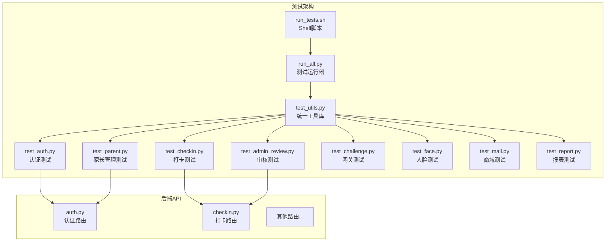
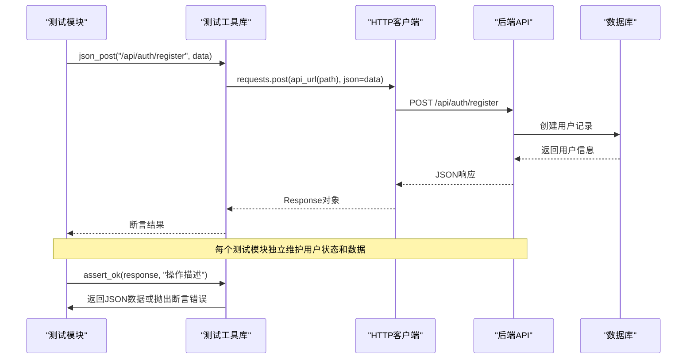
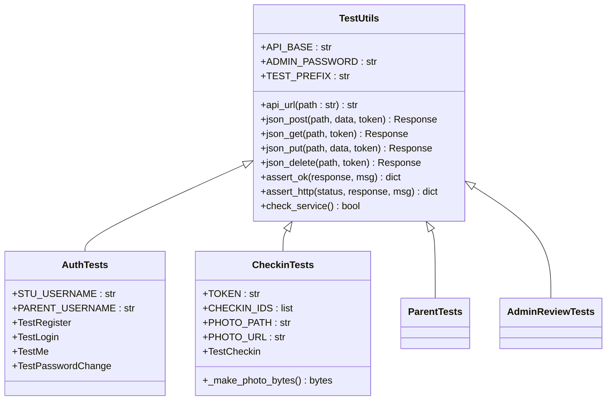
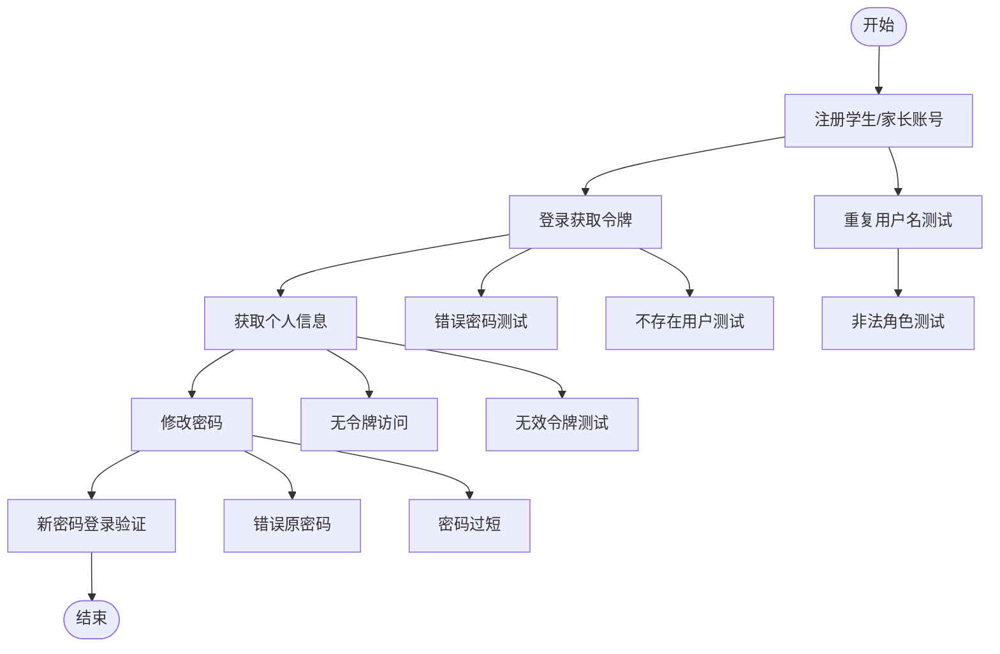
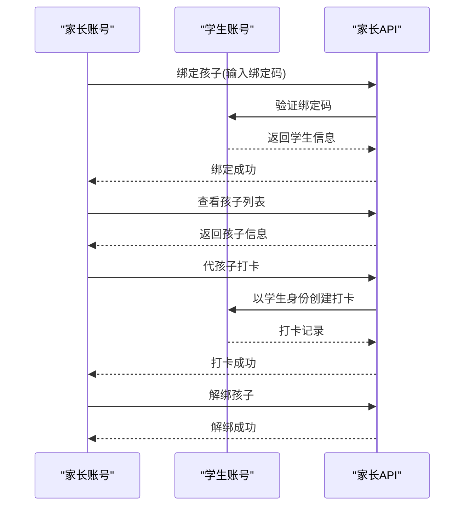
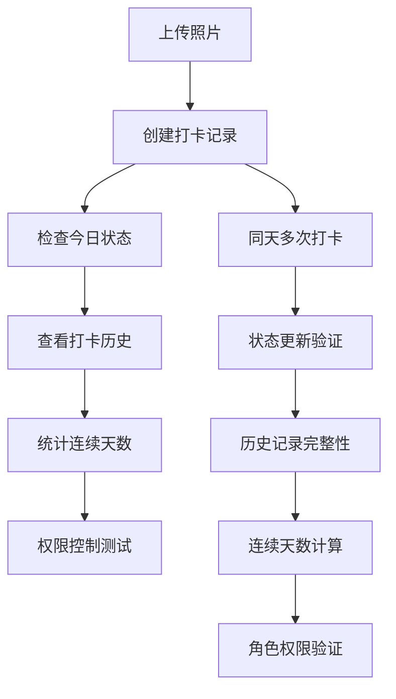
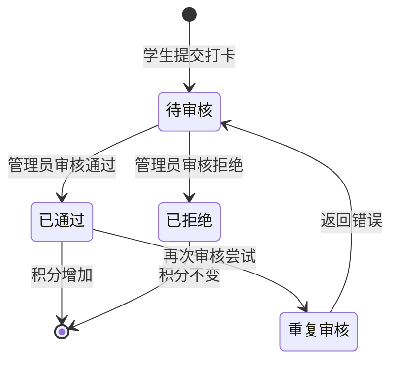
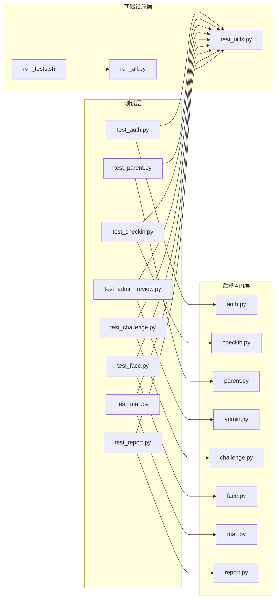

# 测试策略

<cite>
**本文引用的文件**   
- [summer-homework-checkin/tests/test_auth.py](file://summer-homework-checkin/tests/test_auth.py)
- [summer-homework-checkin/tests/test_parent.py](file://summer-homework-checkin/tests/test_parent.py)
- [summer-homework-checkin/tests/test_checkin.py](file://summer-homework-checkin/tests/test_checkin.py)
- [summer-homework-checkin/tests/test_admin_review.py](file://summer-homework-checkin/tests/test_admin_review.py)
- [summer-homework-checkin/tests/test_challenge.py](file://summer-homework-checkin/tests/test_challenge.py)
- [summer-homework-checkin/tests/test_face.py](file://summer-homework-checkin/tests/test_face.py)
- [summer-homework-checkin/tests/test_mall.py](file://summer-homework-checkin/tests/test_mall.py)
- [summer-homework-checkin/tests/test_report.py](file://summer-homework-checkin/tests/test_report.py)
- [summer-homework-checkin/tests/test_utils.py](file://summer-homework-checkin/tests/test_utils.py)
- [summer-homework-checkin/tests/run_all.py](file://summer-homework-checkin/tests/run_all.py)
- [summer-homework-checkin/tests/run_tests.sh](file://summer-homework-checkin/tests/run_tests.sh)
- [summer-homework-checkin/backend/app/routers/auth.py](file://summer-homework-checkin/backend/app/routers/auth.py)
- [summer-homework-checkin/backend/app/routers/checkin.py](file://summer-homework-checkin/backend/app/routers/checkin.py)
</cite>

## 更新摘要
**变更内容**   
- 从单一test_review.py重构为模块化测试架构，包含8个独立测试模块
- 新增统一的测试工具库test_utils.py提供共享配置和辅助函数
- 完善测试运行器run_all.py和shell脚本run_tests.sh
- 覆盖认证、家长管理、打卡、审核、闯关、人脸、商城、报表等核心功能
- 建立完整的API自动化测试框架，支持HTTP客户端调用和断言验证

## 目录
1. [引言](#引言)
2. [项目结构](#项目结构)
3. [核心组件](#核心组件)
4. [架构总览](#架构总览)
5. [详细组件分析](#详细组件分析)
6. [依赖分析](#依赖分析)
7. [性能考虑](#性能考虑)
8. [故障排查指南](#故障排查指南)
9. [结论](#结论)
10. [附录](#附录)

## 引言
本测试策略面向暑假作业打卡系统的后端服务，采用模块化的回归测试架构。重点包括：
- 基于HTTP API的自动化测试框架（requests客户端、pytest组织）
- 8个独立测试模块覆盖核心业务功能
- 统一的测试工具库和环境配置管理
- 完善的测试数据管理和用户状态维护
- 支持Docker和本地环境的测试运行

## 项目结构
系统采用模块化的测试架构，每个业务模块对应独立的测试文件：



**图表来源**
- [summer-homework-checkin/tests/test_utils.py:1-96](file://summer-homework-checkin/tests/test_utils.py#L1-L96)
- [summer-homework-checkin/tests/test_auth.py:1-208](file://summer-homework-checkin/tests/test_auth.py#L1-L208)
- [summer-homework-checkin/tests/test_parent.py:1-191](file://summer-homework-checkin/tests/test_parent.py#L1-L191)
- [summer-homework-checkin/tests/test_checkin.py:1-182](file://summer-homework-checkin/tests/test_checkin.py#L1-L182)
- [summer-homework-checkin/tests/test_admin_review.py:1-147](file://summer-homework-checkin/tests/test_admin_review.py#L1-L147)
- [summer-homework-checkin/tests/test_challenge.py:1-137](file://summer-homework-checkin/tests/test_challenge.py#L1-L137)
- [summer-homework-checkin/tests/test_face.py:1-109](file://summer-homework-checkin/tests/test_face.py#L1-L109)
- [summer-homework-checkin/tests/test_mall.py:1-98](file://summer-homework-checkin/tests/test_mall.py#L1-L98)
- [summer-homework-checkin/tests/test_report.py:1-109](file://summer-homework-checkin/tests/test_report.py#L1-L109)
- [summer-homework-checkin/tests/run_all.py:1-80](file://summer-homework-checkin/tests/run_all.py#L1-L80)
- [summer-homework-checkin/tests/run_tests.sh:1-79](file://summer-homework-checkin/tests/run_tests.sh#L1-L79)
- [summer-homework-checkin/backend/app/routers/auth.py:1-67](file://summer-homework-checkin/backend/app/routers/auth.py#L1-L67)
- [summer-homework-checkin/backend/app/routers/checkin.py:1-80](file://summer-homework-checkin/backend/app/routers/checkin.py#L1-L80)

**章节来源**
- [summer-homework-checkin/tests/test_utils.py:1-96](file://summer-homework-checkin/tests/test_utils.py#L1-L96)
- [summer-homework-checkin/tests/run_all.py:1-80](file://summer-homework-checkin/tests/run_all.py#L1-L80)

## 核心组件
- **统一测试工具库**
  - HTTP请求封装（json_post、json_get、json_put、json_delete）
  - 断言工具（assert_ok、assert_http）
  - 环境配置管理（API_BASE_URL、ADMIN_PASSWORD、TEST_PREFIX）
  - 服务健康检查（check_service）
- **模块化测试架构**
  - 认证测试：注册、登录、个人信息、密码修改
  - 家长管理：绑定、解绑、孩子列表、代打卡
  - 打卡功能：创建打卡、今日状态、连续天数、历史记录
  - 管理审核：统计数据、打卡审核、积分发放
  - 闯关任务：任务列表、详情、提交打卡、审核
  - 人脸采集：底图状态查询、采集、撤销
  - 商城兑奖：奖品列表、积分兑换、抽奖机会
  - 报表统计：学生报表、HTML报表、家长查看
- **测试运行器**
  - Python运行器：参数解析、服务检查、测试执行
  - Shell脚本：依赖检查、服务启动、彩色输出

**章节来源**
- [summer-homework-checkin/tests/test_utils.py:28-96](file://summer-homework-checkin/tests/test_utils.py#L28-L96)
- [summer-homework-checkin/tests/run_all.py:19-75](file://summer-homework-checkin/tests/run_all.py#L19-L75)
- [summer-homework-checkin/tests/run_tests.sh:33-78](file://summer-homework-checkin/tests/run_tests.sh#L33-L78)

## 架构总览
下图展示模块化测试架构的请求链路和执行流程：



**图表来源**
- [summer-homework-checkin/tests/test_auth.py:23-33](file://summer-homework-checkin/tests/test_auth.py#L23-L33)
- [summer-homework-checkin/tests/test_utils.py:45-86](file://summer-homework-checkin/tests/test_utils.py#L45-L86)
- [summer-homework-checkin/backend/app/routers/auth.py:13-39](file://summer-homework-checkin/backend/app/routers/auth.py#L13-L39)

## 详细组件分析

### 统一测试工具库设计
测试工具库提供所有测试模块共享的基础设施：



**图表来源**
- [summer-homework-checkin/tests/test_utils.py:28-96](file://summer-homework-checkin/tests/test_utils.py#L28-L96)
- [summer-homework-checkin/tests/test_auth.py:10-208](file://summer-homework-checkin/tests/test_auth.py#L10-L208)
- [summer-homework-checkin/tests/test_checkin.py:10-182](file://summer-homework-checkin/tests/test_checkin.py#L10-L182)

**章节来源**
- [summer-homework-checkin/tests/test_utils.py:1-96](file://summer-homework-checkin/tests/test_utils.py#L1-L96)

### 认证模块测试策略
认证测试覆盖完整的用户生命周期管理：



**图表来源**
- [summer-homework-checkin/tests/test_auth.py:20-208](file://summer-homework-checkin/tests/test_auth.py#L20-L208)

**章节来源**
- [summer-homework-checkin/tests/test_auth.py:1-208](file://summer-homework-checkin/tests/test_auth.py#L1-L208)
- [summer-homework-checkin/backend/app/routers/auth.py:1-67](file://summer-homework-checkin/backend/app/routers/auth.py#L1-L67)

### 家长管理模块测试策略
家长管理测试涵盖家庭关系绑定和孩子管理：



**图表来源**
- [summer-homework-checkin/tests/test_parent.py:63-191](file://summer-homework-checkin/tests/test_parent.py#L63-L191)

**章节来源**
- [summer-homework-checkin/tests/test_parent.py:1-191](file://summer-homework-checkin/tests/test_parent.py#L1-L191)

### 打卡功能测试策略
打卡测试覆盖完整的打卡业务流程：



**图表来源**
- [summer-homework-checkin/tests/test_checkin.py:52-182](file://summer-homework-checkin/tests/test_checkin.py#L52-L182)

**章节来源**
- [summer-homework-checkin/tests/test_checkin.py:1-182](file://summer-homework-checkin/tests/test_checkin.py#L1-L182)
- [summer-homework-checkin/backend/app/routers/checkin.py:1-80](file://summer-homework-checkin/backend/app/routers/checkin.py#L1-L80)

### 管理审核模块测试策略
管理审核测试确保管理员功能的完整性和正确性：



**图表来源**
- [summer-homework-checkin/tests/test_admin_review.py:41-147](file://summer-homework-checkin/tests/test_admin_review.py#L41-L147)

**章节来源**
- [summer-homework-checkin/tests/test_admin_review.py:1-147](file://summer-homework-checkin/tests/test_admin_review.py#L1-L147)

### 其他功能模块测试
- **闯关任务测试**：任务列表、详情查看、打卡提交、附件上传
- **人脸采集测试**：底图状态查询、采集流程、权限控制
- **商城兑奖测试**：奖品浏览、积分兑换、抽奖券管理
- **报表统计测试**：个人报表、HTML报表、家长查看权限

**章节来源**
- [summer-homework-checkin/tests/test_challenge.py:1-137](file://summer-homework-checkin/tests/test_challenge.py#L1-L137)
- [summer-homework-checkin/tests/test_face.py:1-109](file://summer-homework-checkin/tests/test_face.py#L1-L109)
- [summer-homework-checkin/tests/test_mall.py:1-98](file://summer-homework-checkin/tests/test_mall.py#L1-L98)
- [summer-homework-checkin/tests/test_report.py:1-109](file://summer-homework-checkin/tests/test_report.py#L1-L109)

## 依赖分析
测试架构的依赖关系清晰明确：



**图表来源**
- [summer-homework-checkin/tests/test_utils.py:1-96](file://summer-homework-checkin/tests/test_utils.py#L1-L96)
- [summer-homework-checkin/tests/run_all.py:1-80](file://summer-homework-checkin/tests/run_all.py#L1-L80)
- [summer-homework-checkin/tests/run_tests.sh:1-79](file://summer-homework-checkin/tests/run_tests.sh#L1-L79)

**章节来源**
- [summer-homework-checkin/tests/test_utils.py:1-96](file://summer-homework-checkin/tests/test_utils.py#L1-L96)
- [summer-homework-checkin/tests/run_all.py:1-80](file://summer-homework-checkin/tests/run_all.py#L1-L80)

## 性能考虑
- **测试执行效率**
  - 使用类级别fixture减少重复用户创建
  - 共享测试数据和token避免重复登录
  - 异步图片生成优化测试速度
- **资源管理**
  - 临时用户前缀避免数据冲突
  - 幂等操作确保测试可重复执行
  - 环境变量控制速率限制和调试模式
- **网络优化**
  - 连接复用减少HTTP开销
  - 批量操作减少API调用次数
  - 超时设置防止测试挂起

[本节为通用指导，不直接分析具体文件]

## 故障排查指南
- **测试环境问题**
  - 后端服务未启动：检查API_BASE_URL配置和服务状态
  - 端口冲突：确认8000端口未被占用
  - Docker容器问题：检查容器状态和网络配置
- **测试数据问题**
  - 用户冲突：检查TEST_PREFIX是否唯一
  - 权限错误：确认管理员密码配置正确
  - 数据污染：清理测试数据库或使用隔离环境
- **网络通信问题**
  - CORS错误：检查后端CORS配置
  - 超时问题：调整请求超时设置
  - 证书问题：HTTPS环境下的证书配置

**章节来源**
- [summer-homework-checkin/tests/test_utils.py:28-35](file://summer-homework-checkin/tests/test_utils.py#L28-L35)
- [summer-homework-checkin/tests/run_all.py:34-45](file://summer-homework-checkin/tests/run_all.py#L34-L45)
- [summer-homework-checkin/tests/run_tests.sh:40-57](file://summer-homework-checkin/tests/run_tests.sh#L40-L57)

## 结论
本次测试架构重构实现了从单一测试文件到模块化测试体系的转变，具有以下优势：
- **可维护性**：每个业务模块独立测试，便于定位和修复问题
- **可扩展性**：新增功能只需添加新的测试模块
- **可重用性**：统一的工具库避免代码重复
- **可执行性**：完善的运行器和脚本支持多种执行方式
- **可靠性**：幂等设计和数据隔离确保测试稳定性

建议后续完善：
- 添加测试覆盖率统计
- 集成持续集成流水线
- 增加性能基准测试
- 完善错误场景测试用例

## 附录

### 测试环境与数据管理
- **环境配置**
  - API_BASE_URL：后端服务地址
  - ADMIN_INIT_PASSWORD：管理员初始密码
  - RATE_LIMIT_ENABLED：速率限制开关
  - TEST_PREFIX：测试用户前缀
- **数据管理策略**
  - 每个测试类独立维护用户状态
  - 使用全局变量缓存token和ID
  - 幂等操作确保测试可重复执行
  - 临时文件处理图片上传

**章节来源**
- [summer-homework-checkin/tests/test_utils.py:28-35](file://summer-homework-checkin/tests/test_utils.py#L28-L35)
- [summer-homework-checkin/tests/test_checkin.py:14-29](file://summer-homework-checkin/tests/test_checkin.py#L14-L29)

### 持续集成流水线建议
- **触发条件**：每次PR提交和每日定时构建
- **执行阶段**：
  - 环境准备：安装Python依赖、启动后端服务
  - 单元测试：运行各模块独立测试
  - 集成测试：执行完整业务流程测试
  - 报告生成：测试报告和覆盖率统计
- **并行执行**：按模块并行执行测试提高速度
- **失败处理**：自动重试机制和失败通知

**章节来源**
- [summer-homework-checkin/tests/run_all.py:19-75](file://summer-homework-checkin/tests/run_all.py#L19-L75)
- [summer-homework-checkin/tests/run_tests.sh:33-78](file://summer-homework-checkin/tests/run_tests.sh#L33-L78)

### 覆盖率与性能标准
- **覆盖率要求**
  - 核心业务模块≥80%
  - 工具库模块≥90%
  - 边界情况测试覆盖
- **性能标准**
  - 单个测试模块执行时间<30秒
  - 完整测试套件<5分钟
  - 内存使用稳定无泄漏
- **兼容性测试**
  - Python 3.8+环境支持
  - 主流浏览器前端兼容
  - Docker环境一致性

**章节来源**
- [summer-homework-checkin/tests/test_utils.py:1-18](file://summer-homework-checkin/tests/test_utils.py#L1-L18)
- [summer-homework-checkin/tests/run_tests.sh:34-38](file://summer-homework-checkin/tests/run_tests.sh#L34-L38)

### 测试运行命令参考
```bash
# 运行全部测试
python tests/run_all.py

# 指定API地址运行
python tests/run_all.py --api-base http://localhost:8001

# 运行特定模块
python -m pytest tests/test_auth.py -v

# 筛选特定测试
python -m pytest tests/ -k "login"

# 使用shell脚本运行
bash tests/run_tests.sh

# 保留测试数据库调试
python tests/run_all.py --keep-db
```

**章节来源**
- [summer-homework-checkin/tests/run_all.py:6-11](file://summer-homework-checkin/tests/run_all.py#L6-L11)
- [summer-homework-checkin/tests/run_tests.sh:5-9](file://summer-homework-checkin/tests/run_tests.sh#L5-L9)