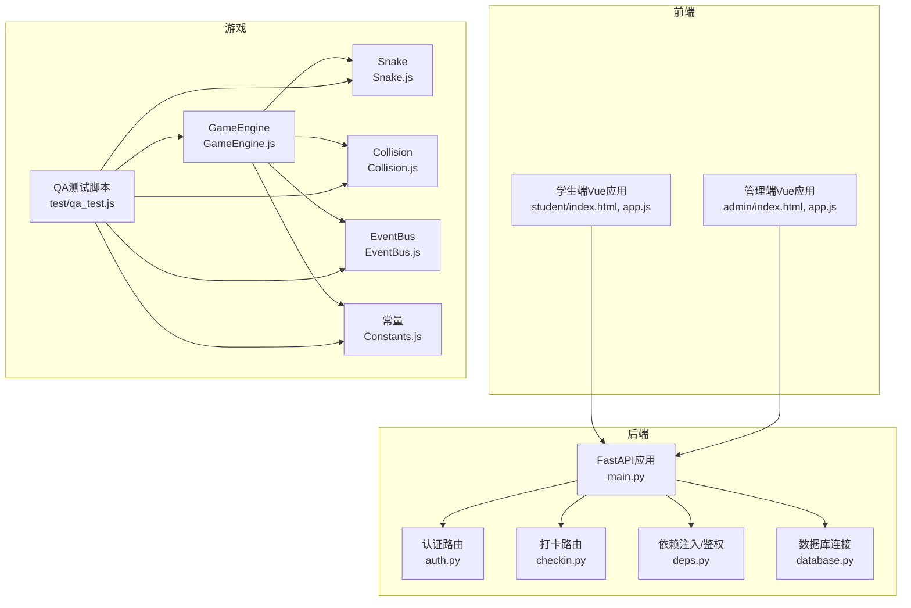
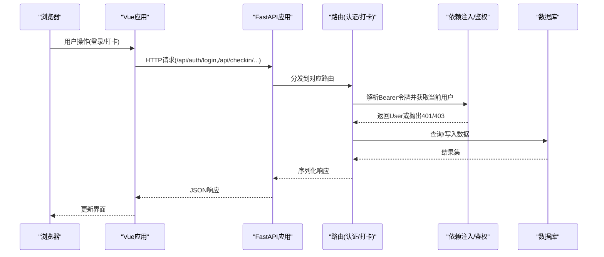
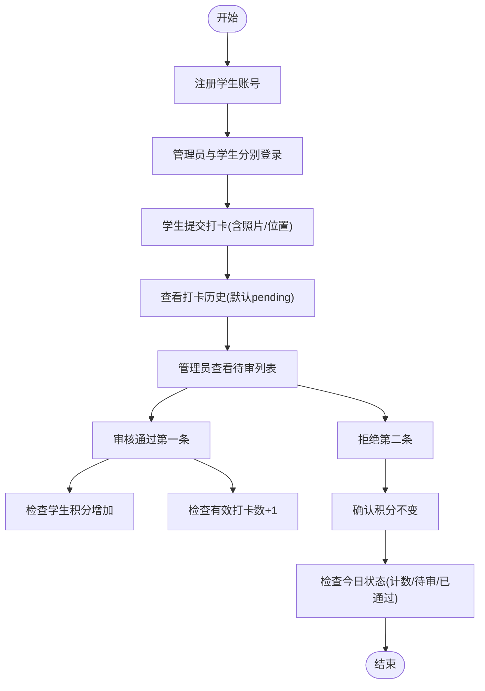
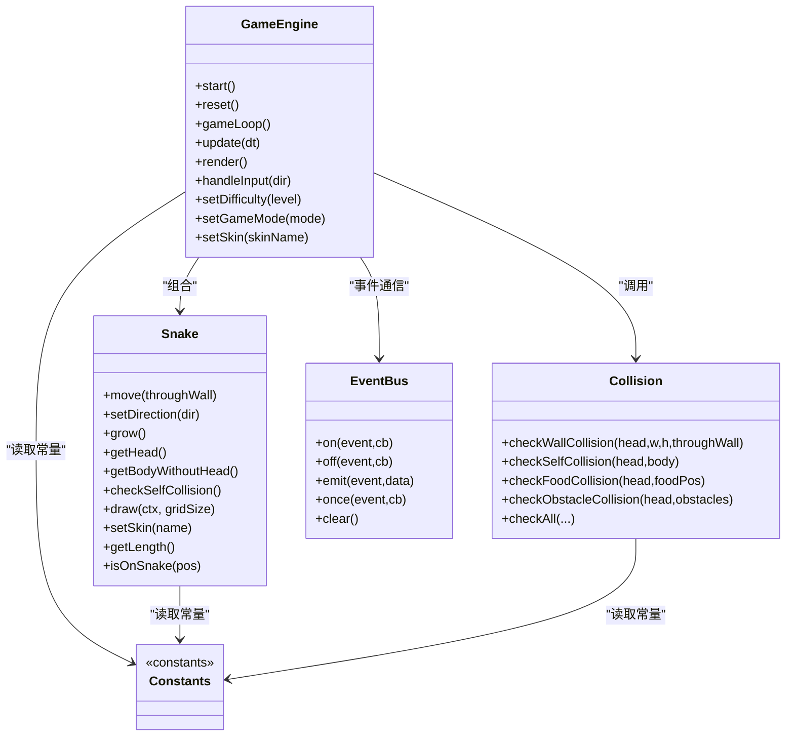
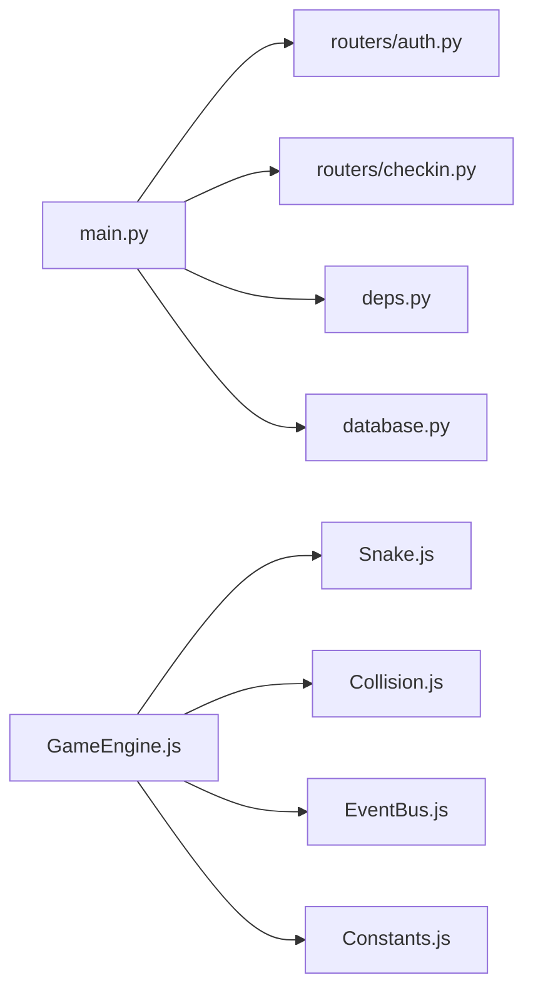

# 测试策略

<cite>
**本文引用的文件**   
- [summer-homework-checkin/backend/app/main.py](file://summer-homework-checkin/backend/app/main.py)
- [summer-homework-checkin/backend/app/routers/checkin.py](file://summer-homework-checkin/backend/app/routers/checkin.py)
- [summer-homework-checkin/backend/app/routers/auth.py](file://summer-homework-checkin/backend/app/routers/auth.py)
- [summer-homework-checkin/backend/app/deps.py](file://summer-homework-checkin/backend/app/deps.py)
- [summer-homework-checkin/backend/app/database.py](file://summer-homework-checkin/backend/app/database.py)
- [summer-homework-checkin/test_review.py](file://summer-homework-checkin/test_review.py)
- [snake-game/js/core/GameEngine.js](file://snake-game/js/core/GameEngine.js)
- [snake-game/js/core/Snake.js](file://snake-game/js/core/Snake.js)
- [snake-game/js/core/Collision.js](file://snake-game/js/core/Collision.js)
- [snake-game/js/utils/EventBus.js](file://snake-game/js/utils/EventBus.js)
- [snake-game/js/utils/Constants.js](file://snake-game/js/utils/Constants.js)
- [snake-game/test/qa_test.js](file://snake-game/test/qa_test.js)
</cite>

## 目录
1. [引言](#引言)
2. [项目结构](#项目结构)
3. [核心组件](#核心组件)
4. [架构总览](#架构总览)
5. [详细组件分析](#详细组件分析)
6. [依赖分析](#依赖分析)
7. [性能考虑](#性能考虑)
8. [故障排查指南](#故障排查指南)
9. [结论](#结论)
10. [附录](#附录)

## 引言
本测试策略面向仓库中的后端服务与前端游戏模块，覆盖单元测试、集成测试与端到端测试的实施方案。重点包括：
- 后端API自动化测试框架（FastAPI测试客户端、Mock对象、异步处理）
- 前端组件测试策略（Vue.js组件测试、用户交互模拟、响应式验证）
- 游戏逻辑测试方案（Canvas渲染测试、游戏状态验证、性能基准）
- 测试数据管理、测试环境配置、持续集成流水线搭建
- 覆盖率要求、性能测试标准与兼容性测试矩阵

## 项目结构
仓库包含两个主要子系统：
- 暑假作业打卡系统（FastAPI后端 + Vue前端）
- 贪吃蛇游戏（纯前端JS + Canvas渲染）

**图表来源**
- [summer-homework-checkin/backend/app/main.py:1-48](file://summer-homework-checkin/backend/app/main.py#L1-L48)
- [summer-homework-checkin/backend/app/routers/auth.py:40-51](file://summer-homework-checkin/backend/app/routers/auth.py#L40-L51)
- [summer-homework-checkin/backend/app/routers/checkin.py:1-80](file://summer-homework-checkin/backend/app/routers/checkin.py#L1-L80)
- [summer-homework-checkin/backend/app/deps.py:1-33](file://summer-homework-checkin/backend/app/deps.py#L1-L33)
- [summer-homework-checkin/backend/app/database.py:1-21](file://summer-homework-checkin/backend/app/database.py#L1-L21)
- [snake-game/js/core/GameEngine.js:1-800](file://snake-game/js/core/GameEngine.js#L1-L800)
- [snake-game/js/core/Snake.js:1-214](file://snake-game/js/core/Snake.js#L1-L214)
- [snake-game/js/core/Collision.js:1-73](file://snake-game/js/core/Collision.js#L1-L73)
- [snake-game/js/utils/EventBus.js:1-80](file://snake-game/js/utils/EventBus.js#L1-L80)
- [snake-game/js/utils/Constants.js:1-81](file://snake-game/js/utils/Constants.js#L1-L81)
- [snake-game/test/qa_test.js:1-800](file://snake-game/test/qa_test.js#L1-L800)

**章节来源**
- [summer-homework-checkin/backend/app/main.py:1-48](file://summer-homework-checkin/backend/app/main.py#L1-L48)
- [snake-game/js/core/GameEngine.js:1-800](file://snake-game/js/core/GameEngine.js#L1-L800)

## 核心组件
- 后端API层
  - 应用入口与中间件、静态资源挂载、健康检查与健康探针
  - 认证与权限校验（Bearer令牌、角色校验）
  - 打卡业务接口（上传、历史、统计）
- 前端UI层
  - 学生端与管理端均为Vue 3单页应用，通过HTTP调用后端API
- 游戏引擎
  - GameEngine负责主循环、状态机、事件总线、渲染与效果系统
  - Snake、Food、Collision等核心类提供移动、碰撞检测与绘制
  - EventBus实现发布订阅解耦
  - Constants集中定义网格、难度、模式、皮肤等常量

**章节来源**
- [summer-homework-checkin/backend/app/routers/auth.py:40-51](file://summer-homework-checkin/backend/app/routers/auth.py#L40-L51)
- [summer-homework-checkin/backend/app/routers/checkin.py:1-80](file://summer-homework-checkin/backend/app/routers/checkin.py#L1-L80)
- [summer-homework-checkin/backend/app/deps.py:1-33](file://summer-homework-checkin/backend/app/deps.py#L1-L33)
- [snake-game/js/core/GameEngine.js:1-800](file://snake-game/js/core/GameEngine.js#L1-L800)
- [snake-game/js/core/Snake.js:1-214](file://snake-game/js/core/Snake.js#L1-L214)
- [snake-game/js/core/Collision.js:1-73](file://snake-game/js/core/Collision.js#L1-L73)
- [snake-game/js/utils/EventBus.js:1-80](file://snake-game/js/utils/EventBus.js#L1-L80)
- [snake-game/js/utils/Constants.js:1-81](file://snake-game/js/utils/Constants.js#L1-L81)

## 架构总览
下图展示从浏览器到后端的请求链路以及游戏引擎内部的关键流程。

**图表来源**
- [summer-homework-checkin/backend/app/main.py:1-48](file://summer-homework-checkin/backend/app/main.py#L1-L48)
- [summer-homework-checkin/backend/app/routers/auth.py:40-51](file://summer-homework-checkin/backend/app/routers/auth.py#L40-L51)
- [summer-homework-checkin/backend/app/routers/checkin.py:1-80](file://summer-homework-checkin/backend/app/routers/checkin.py#L1-L80)
- [summer-homework-checkin/backend/app/deps.py:1-33](file://summer-homework-checkin/backend/app/deps.py#L1-L33)
- [summer-homework-checkin/backend/app/database.py:1-21](file://summer-homework-checkin/backend/app/database.py#L1-L21)

## 详细组件分析

### 后端API自动化测试策略（FastAPI）
- 测试目标
  - 认证流程：注册、登录、令牌签发与校验、角色权限控制
  - 打卡流程：图片上传、位置信息、补卡、历史记录、今日状态、连续打卡统计
  - 错误路径：未授权、无权限、参数校验失败、文件类型/大小限制
- 测试工具与环境
  - FastAPI TestClient用于同步测试；对于异步路由可使用AsyncClient或封装异步适配器
  - 使用内存SQLite或临时文件数据库隔离测试数据
  - 使用pytest组织用例，结合fixture管理数据库会话与测试用户
- Mock策略
  - 依赖注入替换：在测试中用自定义get_db返回内存SessionLocal
  - 外部服务Mock：如人脸识别、存储服务等，使用unittest.mock或pytest-mock
  - 文件系统Mock：对uploads目录进行隔离，避免污染真实存储
- 关键用例设计
  - 认证：成功登录、密码错误、令牌过期、缺失令牌
  - 打卡：正常提交、重复同天打卡、无效图片、越权访问
  - 审核：管理员查看待审列表、通过/拒绝、积分与有效打卡数联动
- 参考实现
  - 现有脚本演示了完整的“注册-登录-多次打卡-审核-统计”流程，可作为集成测试模板

**图表来源**
- [summer-homework-checkin/test_review.py:1-204](file://summer-homework-checkin/test_review.py#L1-L204)
- [summer-homework-checkin/backend/app/routers/checkin.py:1-80](file://summer-homework-checkin/backend/app/routers/checkin.py#L1-L80)
- [summer-homework-checkin/backend/app/routers/auth.py:40-51](file://summer-homework-checkin/backend/app/routers/auth.py#L40-L51)

**章节来源**
- [summer-homework-checkin/backend/app/routers/checkin.py:1-80](file://summer-homework-checkin/backend/app/routers/checkin.py#L1-L80)
- [summer-homework-checkin/backend/app/routers/auth.py:40-51](file://summer-homework-checkin/backend/app/routers/auth.py#L40-L51)
- [summer-homework-checkin/backend/app/deps.py:1-33](file://summer-homework-checkin/backend/app/deps.py#L1-L33)
- [summer-homework-checkin/backend/app/database.py:1-21](file://summer-homework-checkin/backend/app/database.py#L1-L21)
- [summer-homework-checkin/test_review.py:1-204](file://summer-homework-checkin/test_review.py#L1-L204)

### 前端组件测试策略（Vue.js）
- 测试目标
  - 页面初始化与路由切换
  - 表单输入与响应式数据绑定
  - 用户交互（点击、选择、弹窗）与副作用（网络请求、本地存储）
- 测试工具与环境
  - 推荐使用Vitest + @vue/test-utils进行组件级测试
  - 使用jsdom模拟DOM与localStorage
  - 使用http-server或Vite开发服务器启动前端以便E2E
- 关键用例设计
  - 登录/注册：表单校验、错误提示、跳转
  - 家长-孩子双角色：切换子账号、数据隔离
  - 管理端：筛选、分页、审核操作后的列表刷新
- 建议实践
  - 将API调用抽象为可注入的服务，便于在测试中Mock
  - 对复杂视图拆分为小组件，提升可测性

[本节为概念性说明，不直接分析具体文件]

### 游戏逻辑测试方案（Canvas/状态/性能）
- 测试目标
  - 常量一致性、事件总线行为、碰撞检测正确性
  - 蛇的移动、方向反转保护、穿墙逻辑
  - 食物生成有效性、得分与记录保存
  - 游戏状态机（空闲/准备/进行中/暂停/结束）
  - Canvas渲染稳定性与帧率
- 测试工具与环境
  - 使用JSDOM模拟DOM与Canvas上下文
  - 使用Node执行测试脚本，加载各模块并按顺序eval
  - 使用performance.now()和requestAnimationFrame模拟时间推进
- 关键用例设计
  - 常量：网格尺寸、难度、模式、皮肤颜色、默认设置
  - 事件总线：订阅/取消订阅/一次性订阅/清空监听器
  - 碰撞：撞墙、自身、障碍物、综合检测结果
  - 蛇：初始位置、移动、反向禁止、穿墙、长度变化
  - 食物：生成位置合法性、过期判断、分值
  - 存储：最高分、成就、统计数据读写
  - 跨文件一致性：事件命名约定、HTML data属性匹配
- 参考实现
  - 现有qa_test.js已覆盖大量核心逻辑与已知缺陷回归

**图表来源**
- [snake-game/js/core/GameEngine.js:1-800](file://snake-game/js/core/GameEngine.js#L1-L800)
- [snake-game/js/core/Snake.js:1-214](file://snake-game/js/core/Snake.js#L1-L214)
- [snake-game/js/core/Collision.js:1-73](file://snake-game/js/core/Collision.js#L1-L73)
- [snake-game/js/utils/EventBus.js:1-80](file://snake-game/js/utils/EventBus.js#L1-L80)
- [snake-game/js/utils/Constants.js:1-81](file://snake-game/js/utils/Constants.js#L1-L81)

**章节来源**
- [snake-game/test/qa_test.js:1-800](file://snake-game/test/qa_test.js#L1-L800)
- [snake-game/js/core/GameEngine.js:1-800](file://snake-game/js/core/GameEngine.js#L1-L800)
- [snake-game/js/core/Snake.js:1-214](file://snake-game/js/core/Snake.js#L1-L214)
- [snake-game/js/core/Collision.js:1-73](file://snake-game/js/core/Collision.js#L1-L73)
- [snake-game/js/utils/EventBus.js:1-80](file://snake-game/js/utils/EventBus.js#L1-L80)
- [snake-game/js/utils/Constants.js:1-81](file://snake-game/js/utils/Constants.js#L1-L81)

## 依赖分析
- 后端依赖
  - FastAPI应用包含CORS中间件、静态资源挂载、路由聚合
  - 依赖注入提供数据库会话与当前用户解析
  - 路由层依赖服务层与模型，遵循分层职责
- 前端依赖
  - Vue 3通过CDN引入，应用逻辑集中在app.js
  - 通过HTTP调用后端API，使用localStorage持久化令牌与用户态
- 游戏依赖
  - GameEngine组合Snake、Food、Collision，并通过EventBus与UI/音频等模块通信
  - 常量集中管理，降低耦合度

**图表来源**
- [summer-homework-checkin/backend/app/main.py:1-48](file://summer-homework-checkin/backend/app/main.py#L1-L48)
- [summer-homework-checkin/backend/app/routers/auth.py:40-51](file://summer-homework-checkin/backend/app/routers/auth.py#L40-L51)
- [summer-homework-checkin/backend/app/routers/checkin.py:1-80](file://summer-homework-checkin/backend/app/routers/checkin.py#L1-L80)
- [summer-homework-checkin/backend/app/deps.py:1-33](file://summer-homework-checkin/backend/app/deps.py#L1-L33)
- [summer-homework-checkin/backend/app/database.py:1-21](file://summer-homework-checkin/backend/app/database.py#L1-L21)
- [snake-game/js/core/GameEngine.js:1-800](file://snake-game/js/core/GameEngine.js#L1-L800)
- [snake-game/js/core/Snake.js:1-214](file://snake-game/js/core/Snake.js#L1-L214)
- [snake-game/js/core/Collision.js:1-73](file://snake-game/js/core/Collision.js#L1-L73)
- [snake-game/js/utils/EventBus.js:1-80](file://snake-game/js/utils/EventBus.js#L1-L80)
- [snake-game/js/utils/Constants.js:1-81](file://snake-game/js/utils/Constants.js#L1-L81)

**章节来源**
- [summer-homework-checkin/backend/app/main.py:1-48](file://summer-homework-checkin/backend/app/main.py#L1-L48)
- [snake-game/js/core/GameEngine.js:1-800](file://snake-game/js/core/GameEngine.js#L1-L800)

## 性能考虑
- 后端
  - 使用WAL与busy_timeout优化SQLite并发（见数据库配置）
  - 图片上传需做大小与格式校验，避免大文件阻塞
  - 接口响应时间目标：<200ms（常规查询），<1s（含图片处理）
- 前端
  - Vue组件按需渲染，避免重绘频繁区域
  - 使用虚拟滚动或分页减少大数据量渲染压力
- 游戏
  - 主循环基于requestAnimationFrame，目标60FPS
  - 粒子与飘字效果需控制数量与生命周期，避免GC抖动
  - 使用节流/防抖处理resize与高频输入

[本节为通用指导，不直接分析具体文件]

## 故障排查指南
- 后端常见问题
  - 401/403：检查Bearer令牌是否携带、是否过期、角色是否匹配
  - 图片上传失败：确认MIME类型、大小限制、存储路径权限
  - 数据库连接异常：检查连接字符串、线程安全参数
- 前端常见问题
  - CORS错误：确认允许源与方法头
  - 本地存储为空：检查localStorage键名与版本迁移
- 游戏常见问题
  - 状态机不一致：确保重置时状态回到IDLE
  - 事件未监听：核对事件命名与订阅点
  - 渲染闪烁：检查动画帧与生命期更新路径

**章节来源**
- [summer-homework-checkin/backend/app/deps.py:1-33](file://summer-homework-checkin/backend/app/deps.py#L1-L33)
- [snake-game/js/core/GameEngine.js:1-800](file://snake-game/js/core/GameEngine.js#L1-L800)
- [snake-game/js/utils/EventBus.js:1-80](file://snake-game/js/utils/EventBus.js#L1-L80)

## 结论
本测试策略以“分层、可隔离、可重复”为原则，覆盖后端API、前端组件与游戏逻辑三大层面。通过FastAPI测试客户端、Vue组件测试与JSDOM驱动的节点测试，配合完善的Mock与数据管理，可在CI中稳定运行。建议逐步完善覆盖率阈值与性能基线，并将兼容性矩阵纳入自动化流程。

[本节为总结性内容，不直接分析具体文件]

## 附录

### 测试环境与数据管理
- 后端
  - 使用独立数据库URL（内存或临时文件）
  - 使用fixture创建测试用户与必要基础数据
  - 上传目录使用临时路径并在用例结束后清理
- 前端
  - jsdom模拟DOM与localStorage
  - 使用Mock Service Worker或拦截器Mock API
- 游戏
  - JSDOM提供最小DOM与Canvas上下文
  - 使用定时器与requestAnimationFrame模拟时间推进

[本节为通用指导，不直接分析具体文件]

### 持续集成流水线建议
- 触发条件：每次PR与每日定时任务
- 阶段
  - 安装依赖（Python/Node）
  - 后端单元测试与集成测试（FastAPI TestClient）
  - 前端组件测试（Vitest）
  - 游戏逻辑测试（Node + JSDOM）
  - 构建产物与静态资源校验
  - 报告与覆盖率汇总
- 缓存与并行：依赖缓存、测试并行化、分片执行

[本节为通用指导，不直接分析具体文件]

### 覆盖率与性能标准
- 覆盖率
  - 后端核心模块≥80%
  - 前端组件≥70%
  - 游戏逻辑≥85%
- 性能
  - 后端P95响应时间<200ms（常规）、<1s（含图片）
  - 前端首屏渲染<2s（弱网下<4s）
  - 游戏帧率≥60FPS，内存占用稳定，无泄漏

[本节为通用指导，不直接分析具体文件]

### 兼容性测试矩阵
- 浏览器：Chrome、Firefox、Safari、Edge（最新两个主版本）
- 设备：桌面与移动端（iOS Safari、Android Chrome）
- 网络：4G/弱网/离线（前端缓存策略）

[本节为通用指导，不直接分析具体文件]