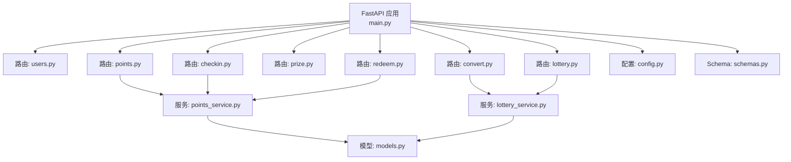
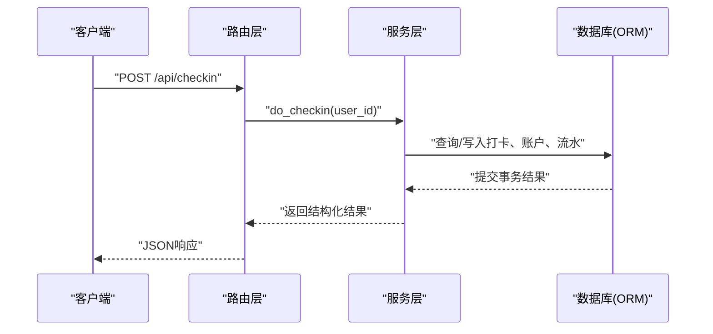
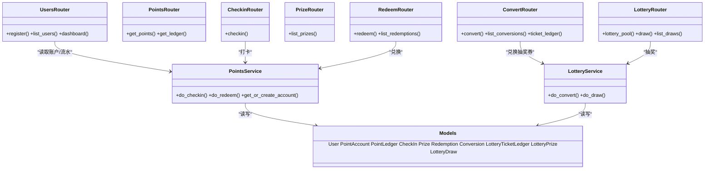

# API接口参考

<cite>
**本文引用的文件**   
- [main.py](file://points-system/backend/app/main.py)
- [users.py](file://points-system/backend/app/routers/users.py)
- [points.py](file://points-system/backend/app/routers/points.py)
- [checkin.py](file://points-system/backend/app/routers/checkin.py)
- [prize.py](file://points-system/backend/app/routers/prize.py)
- [redeem.py](file://points-system/backend/app/routers/redeem.py)
- [convert.py](file://points-system/backend/app/routers/convert.py)
- [lottery.py](file://points-system/backend/app/routers/lottery.py)
- [schemas.py](file://points-system/backend/app/schemas.py)
- [models.py](file://points-system/backend/app/models.py)
- [config.py](file://points-system/backend/app/config.py)
- [points_service.py](file://points-system/backend/app/services/points_service.py)
- [lottery_service.py](file://points-system/backend/app/services/lottery_service.py)
</cite>

## 目录
1. [简介](#简介)
2. [项目结构](#项目结构)
3. [核心组件](#核心组件)
4. [架构总览](#架构总览)
5. [详细接口说明](#详细接口说明)
6. [依赖关系分析](#依赖关系分析)
7. [性能与一致性](#性能与一致性)
8. [错误处理规范](#错误处理规范)
9. [版本管理与兼容性](#版本管理与兼容性)
10. [客户端集成最佳实践](#客户端集成最佳实践)
11. [故障排查指南](#故障排查指南)
12. [结论](#结论)

## 简介
本文件为“积分兑换系统”的RESTful API参考文档，覆盖用户管理、积分查询、打卡、奖品列表、积分兑换、抽奖券兑换、抽奖等全部功能模块。文档包含每个端点的HTTP方法、URL路径、请求参数、响应格式、状态码定义、业务规则与验证要求，并给出认证授权策略、版本管理建议与客户端集成最佳实践。

## 项目结构
后端基于FastAPI构建，路由按功能拆分至独立模块，服务层封装核心业务逻辑（积分与抽奖），数据模型与Schema分别位于models与schemas中。应用启动时初始化数据库表，注册所有路由并提供静态前端资源。

图表来源
- [main.py:1-33](file://points-system/backend/app/main.py#L1-L33)
- [users.py:1-192](file://points-system/backend/app/routers/users.py#L1-L192)
- [points.py:1-28](file://points-system/backend/app/routers/points.py#L1-L28)
- [checkin.py:1-16](file://points-system/backend/app/routers/checkin.py#L1-L16)
- [prize.py:1-42](file://points-system/backend/app/routers/prize.py#L1-L42)
- [redeem.py:1-52](file://points-system/backend/app/routers/redeem.py#L1-L52)
- [convert.py:1-64](file://points-system/backend/app/routers/convert.py#L1-L64)
- [lottery.py:1-55](file://points-system/backend/app/routers/lottery.py#L1-L55)
- [points_service.py:1-146](file://points-system/backend/app/services/points_service.py#L1-L146)
- [lottery_service.py:1-174](file://points-system/backend/app/services/lottery_service.py#L1-L174)
- [models.py:1-151](file://points-system/backend/app/models.py#L1-L151)
- [config.py:1-17](file://points-system/backend/app/config.py#L1-L17)
- [schemas.py:1-147](file://points-system/backend/app/schemas.py#L1-L147)

章节来源
- [main.py:1-33](file://points-system/backend/app/main.py#L1-L33)

## 核心组件
- 路由层：按功能划分，统一前缀/api，提供RESTful端点。
- 服务层：封装积分与抽奖的核心事务逻辑，保证并发安全与数据一致性。
- 数据模型：使用SQLAlchemy ORM定义实体与约束。
- Schema：Pydantic模型用于请求/响应校验与序列化。
- 配置：集中管理积分与抽奖规则常量。

章节来源
- [schemas.py:1-147](file://points-system/backend/app/schemas.py#L1-L147)
- [models.py:1-151](file://points-system/backend/app/models.py#L1-L151)
- [config.py:1-17](file://points-system/backend/app/config.py#L1-L17)

## 架构总览
整体采用“路由→服务→ORM”的分层架构。路由负责参数校验与响应包装；服务层实现事务性业务逻辑；ORM负责持久化。

图表来源
- [checkin.py:1-16](file://points-system/backend/app/routers/checkin.py#L1-L16)
- [points_service.py:41-91](file://points-system/backend/app/services/points_service.py#L41-L91)
- [models.py:50-66](file://points-system/backend/app/models.py#L50-L66)

## 详细接口说明

### 通用约定
- 基础路径：/api
- 内容类型：application/json
- 时间字段：UTC时间字符串或日期字符串（依具体字段）
- 分页：除特别说明外，列表接口默认返回全量或受limit限制
- 鉴权：当前实现未内置认证中间件，通过user_id标识主体；生产环境建议引入JWT/OAuth2

### 用户管理
- 注册
  - 方法：POST
  - 路径：/api/register
  - 请求体：UserCreate
    - username: string，必填，唯一
    - display_name: string，可选，默认空
  - 成功响应：UserOut
    - id, username, display_name, created_at
  - 状态码：
    - 200：注册成功
    - 409：用户名已存在
  - 业务规则：注册同时创建积分账户（余额0）

- 用户列表
  - 方法：GET
  - 路径：/api/users
  - 响应：list<UserOut>

- 看板聚合
  - 方法：GET
  - 路径：/api/dashboard
  - 查询参数：
    - user_id: integer，必填
  - 响应：对象，包含用户信息、积分余额、累计收支、抽奖券数量、是否今日已打卡、连续天数、可兑换奖品列表、奖池、兑换记录、兑换抽奖券记录、抽奖记录、积分流水等
  - 状态码：
    - 200：成功
    - 404：用户不存在

章节来源
- [users.py:11-22](file://points-system/backend/app/routers/users.py#L11-L22)
- [users.py:25-27](file://points-system/backend/app/routers/users.py#L25-L27)
- [users.py:30-191](file://points-system/backend/app/routers/users.py#L30-L191)
- [schemas.py:6-16](file://points-system/backend/app/schemas.py#L6-L16)

### 积分查询
- 获取积分账户
  - 方法：GET
  - 路径：/api/points
  - 查询参数：
    - user_id: integer，必填
  - 响应：AccountOut
    - user_id, balance, total_earned, total_spent, updated_at
  - 状态码：
    - 200：成功
    - 404：积分账户不存在

- 积分流水
  - 方法：GET
  - 路径：/api/ledger
  - 查询参数：
    - user_id: integer，必填
    - limit: integer，可选，默认50
  - 响应：list<LedgerOut>
    - id, user_id, tx_type, amount, balance_after, ref_type, ref_id, note, created_at
  - 排序：按created_at倒序

章节来源
- [points.py:10-15](file://points-system/backend/app/routers/points.py#L10-L15)
- [points.py:18-27](file://points-system/backend/app/routers/points.py#L18-L27)
- [schemas.py:18-36](file://points-system/backend/app/schemas.py#L18-L36)

### 打卡
- 每日打卡
  - 方法：POST
  - 路径：/api/checkin
  - 请求体：CheckInRequest
    - user_id: integer，必填
  - 响应：CheckInResult
    - checkin: CheckInOut
      - id, user_id, check_date, points_earned, streak, bonus
    - points_earned: integer
    - bonus: integer
    - streak: integer
    - balance: integer
  - 状态码：
    - 200：成功
    - 409：今日已打卡（重复打卡）
  - 业务规则：
    - 基础积分：POINTS_PER_CHECKIN
    - 连续奖励：每STREAK_BONUS_EVERY天额外POINTS_STREAK_BONUS
    - 防重：同一用户同一天仅允许一次

章节来源
- [checkin.py:11-15](file://points-system/backend/app/routers/checkin.py#L11-L15)
- [points_service.py:41-91](file://points-system/backend/app/services/points_service.py#L41-L91)
- [config.py:3-10](file://points-system/backend/app/config.py#L3-L10)
- [schemas.py:38-83](file://points-system/backend/app/schemas.py#L38-L83)

### 奖品管理
- 奖品列表
  - 方法：GET
  - 路径：/api/prizes
  - 查询参数：
    - user_id: integer，可选
  - 响应：list<PrizeOut>
    - id, name, description, cost_points, stock, valid_from, valid_to, can_redeem
  - 业务规则：
    - 当传入user_id时，can_redeem综合库存、有效期与用户余额判断
    - 未传user_id时，can_redeem为空

章节来源
- [prize.py:11-41](file://points-system/backend/app/routers/prize.py#L11-L41)
- [schemas.py:47-56](file://points-system/backend/app/schemas.py#L47-L56)

### 积分兑换
- 兑换奖品
  - 方法：POST
  - 路径：/api/redeem
  - 请求体：RedeemRequest
    - user_id: integer，必填
    - prize_id: integer，必填
  - 响应：RedeemResult
    - redemption: RedemptionOut
      - id, user_id, prize_id, prize_name, cost_points, status, created_at
    - balance: integer（兑换后余额）
  - 状态码：
    - 200：成功
    - 400：奖品尚未开始/已过期/积分不足/账户不存在
    - 404：用户不存在
    - 409：库存不足
  - 业务规则：
    - 同一事务内扣减库存与积分，写支出流水，保证原子性

章节来源
- [redeem.py:11-28](file://points-system/backend/app/routers/redeem.py#L11-L28)
- [points_service.py:94-145](file://points-system/backend/app/services/points_service.py#L94-L145)
- [schemas.py:72-88](file://points-system/backend/app/schemas.py#L72-L88)

- 兑换记录
  - 方法：GET
  - 路径：/api/redemptions
  - 查询参数：
    - user_id: integer，必填
  - 响应：list<RedemptionOut>
  - 排序：按created_at倒序

章节来源
- [redeem.py:31-51](file://points-system/backend/app/routers/redeem.py#L31-L51)
- [schemas.py:58-66](file://points-system/backend/app/schemas.py#L58-L66)

### 抽奖券兑换
- 积分兑换抽奖券
  - 方法：POST
  - 路径：/api/convert
  - 请求体：ConvertRequest
    - user_id: integer，必填
    - qty: integer，必填，≥1
  - 响应：ConvertResult
    - conversion: ConversionOut
      - id, user_id, qty, cost_points, status, created_at
    - balance: integer（兑换后余额）
    - lottery_tickets: integer（兑换后抽奖券数量）
  - 状态码：
    - 200：成功
    - 400：qty<1/积分不足（含最低门槛）
    - 404：用户不存在
    - 409：并发冲突
  - 业务规则：
    - 消耗积分=qty×POINTS_PER_TICKET
    - 同一事务内扣积分、加抽奖券，并写积分支出与抽奖券发放流水

- 兑换记录
  - 方法：GET
  - 路径：/api/conversions
  - 查询参数：
    - user_id: integer，必填
  - 响应：list<ConversionOut>
  - 排序：按created_at倒序

- 抽奖券流水
  - 方法：GET
  - 路径：/api/ticket-ledger
  - 查询参数：
    - user_id: integer，必填
  - 响应：list<LotteryTicketLedgerOut>
    - id, user_id, tx_type(issue/consume), amount, balance_after, ref_type, ref_id, note, created_at
  - 排序：按created_at倒序

章节来源
- [convert.py:11-28](file://points-system/backend/app/routers/convert.py#L11-L28)
- [convert.py:31-45](file://points-system/backend/app/routers/convert.py#L31-L45)
- [convert.py:48-63](file://points-system/backend/app/routers/convert.py#L48-L63)
- [lottery_service.py:30-98](file://points-system/backend/app/services/lottery_service.py#L30-L98)
- [schemas.py:90-120](file://points-system/backend/app/schemas.py#L90-L120)
- [config.py:12-13](file://points-system/backend/app/config.py#L12-L13)

### 抽奖
- 奖池配置
  - 方法：GET
  - 路径：/api/lottery/pool
  - 响应：list<LotteryPrizeOut>
    - id, name, description, weight, stock, is_win
  - 用途：供前端展示中奖概率与库存

- 发起抽奖
  - 方法：POST
  - 路径：/api/lottery/draw
  - 请求体：DrawRequest
    - user_id: integer，必填
  - 响应：DrawResult
    - draw: LotteryDrawOut
      - id, user_id, prize_name, is_win, created_at
    - lottery_tickets: integer（抽奖后剩余抽奖券数量）
    - can_lottery: boolean（是否仍满足抽奖条件）
  - 状态码：
    - 200：成功
    - 404：用户不存在
    - 409：抽奖券不足/并发冲突
    - 500：奖池暂无可发放奖品
  - 业务规则：
    - 消耗TICKETS_PER_DRAW张抽奖券
    - 按weight加权随机选择奖池条目（stock为None或>0视为可发放）
    - 有限库存奖品扣库存
    - 同一事务内扣券、落库抽奖记录与券流水

- 抽奖记录
  - 方法：GET
  - 路径：/api/lottery/draws
  - 查询参数：
    - user_id: integer，必填
  - 响应：list<LotteryDrawOut>
  - 排序：按created_at倒序

章节来源
- [lottery.py:11-21](file://points-system/backend/app/routers/lottery.py#L11-L21)
- [lottery.py:24-37](file://points-system/backend/app/routers/lottery.py#L24-L37)
- [lottery.py:40-54](file://points-system/backend/app/routers/lottery.py#L40-L54)
- [lottery_service.py:101-173](file://points-system/backend/app/services/lottery_service.py#L101-L173)
- [schemas.py:122-147](file://points-system/backend/app/schemas.py#L122-L147)
- [config.py:15-16](file://points-system/backend/app/config.py#L15-L16)

## 依赖关系分析
- 路由与服务耦合清晰：各路由仅调用对应服务函数，服务内部再访问ORM模型。
- 关键依赖链：
  - checkin → points_service.do_checkin → models.CheckIn/PointLedger/PointAccount
  - redeem → points_service.do_redeem → models.Prize/Redemption/PointLedger/PointAccount
  - convert → lottery_service.do_convert → models.Conversion/PointLedger/LotteryTicketLedger/PointAccount
  - lottery.draw → lottery_service.do_draw → models.LotteryDraw/LotteryTicketLedger/LotteryPrize/PointAccount

图表来源
- [users.py:1-192](file://points-system/backend/app/routers/users.py#L1-192)
- [points.py:1-28](file://points-system/backend/app/routers/points.py#L1-L28)
- [checkin.py:1-16](file://points-system/backend/app/routers/checkin.py#L1-L16)
- [prize.py:1-42](file://points-system/backend/app/routers/prize.py#L1-L42)
- [redeem.py:1-52](file://points-system/backend/app/routers/redeem.py#L1-L52)
- [convert.py:1-64](file://points-system/backend/app/routers/convert.py#L1-L64)
- [lottery.py:1-55](file://points-system/backend/app/routers/lottery.py#L1-L55)
- [points_service.py:1-146](file://points-system/backend/app/services/points_service.py#L1-L146)
- [lottery_service.py:1-174](file://points-system/backend/app/services/lottery_service.py#L1-L174)
- [models.py:1-151](file://points-system/backend/app/models.py#L1-L151)

## 性能与一致性
- 事务一致性：所有读-改-写操作在单事务内完成，异常回滚，避免半更新。
- 并发控制：
  - 抽奖券兑换与抽奖使用进程内锁串行化账户级操作，防止SQLite下丢失更新。
  - 多进程/多实例部署建议使用数据库悲观锁（如PostgreSQL with_for_update）。
- 索引优化：
  - 常用查询字段（user_id、created_at、check_date）已在模型中建立索引，利于列表与统计查询。
- 限流与分页：
  - ledger接口支持limit参数；其他列表接口默认返回全量，建议在网关层增加分页与限流。

章节来源
- [lottery_service.py:23-27](file://points-system/backend/app/services/lottery_service.py#L23-L27)
- [models.py:40-48](file://points-system/backend/app/models.py#L40-L48)
- [models.py:55-66](file://points-system/backend/app/models.py#L55-L66)

## 错误处理规范
- 常见状态码
  - 200：成功
  - 400：请求参数错误或业务校验失败（如积分不足、奖品未开始/已过期、qty<1）
  - 404：资源不存在（用户、积分账户、奖品）
  - 409：冲突（重复打卡、库存不足、并发冲突）
  - 500：服务端异常（如奖池无可发放奖品）
- 响应体：HTTPException.detail携带人类可读的错误描述，便于客户端提示与日志定位。
- 幂等性：
  - 打卡接口具备幂等保护（唯一约束+业务层检查）
  - 兑换与抽奖在同一事务内执行，避免重复提交导致不一致

章节来源
- [points_service.py:41-91](file://points-system/backend/app/services/points_service.py#L41-L91)
- [points_service.py:94-145](file://points-system/backend/app/services/points_service.py#L94-L145)
- [lottery_service.py:30-98](file://points-system/backend/app/services/lottery_service.py#L30-L98)
- [lottery_service.py:117-173](file://points-system/backend/app/services/lottery_service.py#L117-L173)

## 版本管理与兼容性
- 当前版本：应用标题中包含版本“1.0.0”，可通过URL前缀进行版本化（例如/api/v1/...），以支持向后兼容演进。
- 兼容性建议：
  - 新增字段时保持向后兼容（不删除旧字段）
  - 变更校验规则时提供过渡期与降级策略
  - 对破坏性变更发布新版本路由，保留旧版一段时间

章节来源
- [main.py:20](file://points-system/backend/app/main.py#L20)

## 客户端集成最佳实践
- 鉴权方案：
  - 当前实现通过user_id标识主体，无内置认证；生产环境建议引入JWT或OAuth2，并在路由层注入认证依赖。
- 重试与退避：
  - 对409并发冲突建议指数退避重试，避免雪崩。
- 缓存策略：
  - 奖池与奖品列表可短期缓存，注意失效策略（库存/有效期变化需刷新）。
- 表单校验：
  - 客户端应在发送前校验必填字段与范围（如qty≥1），减少无效请求。
- 错误提示：
  - 根据detail字段向用户友好提示，并上报错误日志以便追踪。

[本节为通用指导，无需代码来源]

## 故障排查指南
- 重复打卡
  - 现象：409 今日已打卡
  - 排查：确认用户当日是否已有打卡记录；检查唯一约束是否生效
- 积分不足
  - 现象：400 积分不足
  - 排查：核对账户余额与所需积分；检查最近流水
- 抽奖券不足
  - 现象：409 抽奖券不足
  - 排查：查看抽奖券流水与账户lottery_tickets
- 并发冲突
  - 现象：409 处理冲突
  - 排查：观察高并发场景下的锁与事务提交情况；必要时迁移到支持行锁的数据库

章节来源
- [points_service.py:77-82](file://points-system/backend/app/services/points_service.py#L77-L82)
- [lottery_service.py:87-98](file://points-system/backend/app/services/lottery_service.py#L87-L98)
- [lottery_service.py:161-166](file://points-system/backend/app/services/lottery_service.py#L161-L166)

## 结论
本API文档完整覆盖了积分兑换系统的核心能力与接口契约。通过分层架构与事务保障，系统在一致性与并发安全方面具备良好基础。生产部署建议完善鉴权、限流与监控，并结合数据库特性进一步优化并发性能。