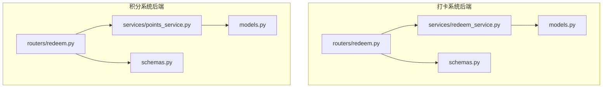
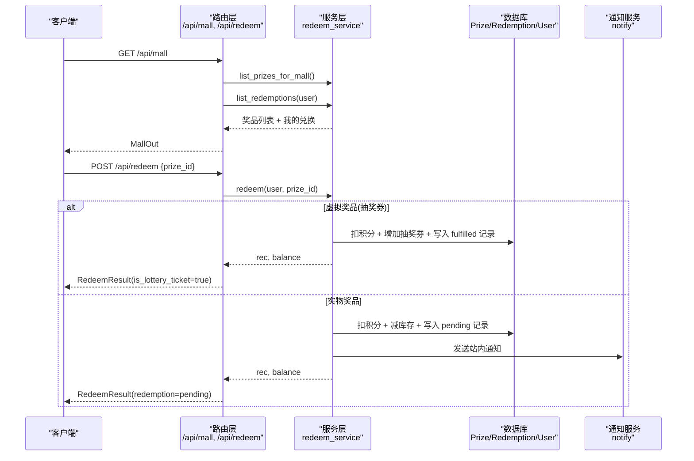
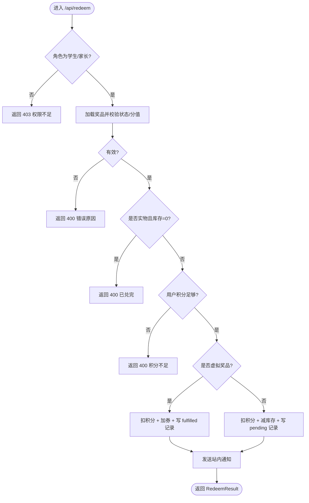
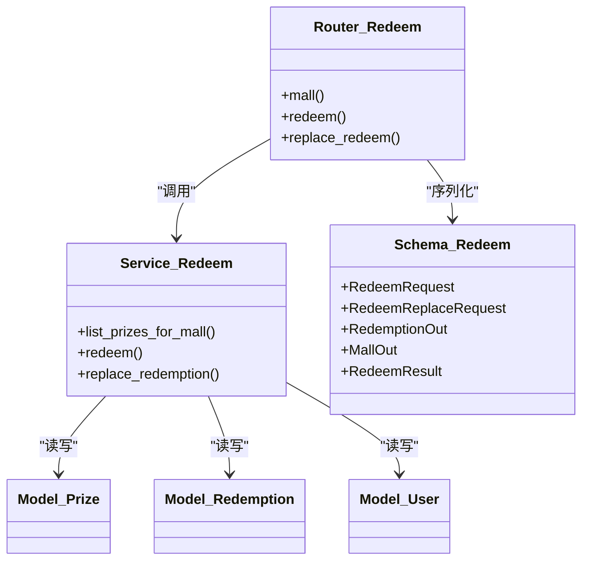

# 兑换管理接口

<cite>
**本文引用的文件**   
- [summer-homework-checkin/backend/app/routers/redeem.py](file://summer-homework-checkin/backend/app/routers/redeem.py)
- [summer-homework-checkin/backend/app/services/redeem_service.py](file://summer-homework-checkin/backend/app/services/redeem_service.py)
- [summer-homework-checkin/backend/app/models.py](file://summer-homework-checkin/backend/app/models.py)
- [summer-homework-checkin/backend/app/schemas.py](file://summer-homework-checkin/backend/app/schemas.py)
- [points-system/backend/app/routers/redeem.py](file://points-system/backend/app/routers/redeem.py)
- [points-system/backend/app/services/points_service.py](file://points-system/backend/app/services/points_service.py)
- [points-system/backend/app/models.py](file://points-system/backend/app/models.py)
- [points-system/backend/app/schemas.py](file://points-system/backend/app/schemas.py)
- [optimized-prompt.md](file://optimized-prompt.md)
- [兑换记录后台管理需求提示词.md](file://兑换记录后台管理需求提示词.md)
</cite>

## 目录
1. [简介](#简介)
2. [项目结构](#项目结构)
3. [核心组件](#核心组件)
4. [架构总览](#架构总览)
5. [详细组件分析](#详细组件分析)
6. [依赖关系分析](#依赖关系分析)
7. [性能与一致性](#性能与一致性)
8. [故障排查指南](#故障排查指南)
9. [结论](#结论)
10. [附录：接口清单与示例](#附录接口清单与示例)

## 简介
本文件为“积分兑换系统”的兑换管理模块提供完整的 API 文档，覆盖以下能力：
- 可兑换商品查询（积分商城聚合数据）
- 兑换申请提交（区分实物奖品与抽奖机会两类）
- 兑换记录查询（用户维度）
- 兑换状态跟踪（含审核流程）
- 兑换替换（直接选择替换）
- 管理员审核（待核实、已兑现、已拒绝）
- 统计汇总（待处理数量等）

同时说明业务规则：积分扣除逻辑、库存检查、兑换限制、失败回滚与异常补偿策略。

## 项目结构
本项目包含两套后端实现：
- summer-homework-checkin：面向打卡场景的完整兑换体系，支持“实物奖品需管理员审核”和“抽奖券自动发放”，并提供“直接替换”能力。
- points-system：轻量版积分与兑换，侧重账户流水与原子事务。

图示来源
- [summer-homework-checkin/backend/app/routers/redeem.py:1-81](file://summer-homework-checkin/backend/app/routers/redeem.py#L1-L81)
- [summer-homework-checkin/backend/app/services/redeem_service.py:1-168](file://summer-homework-checkin/backend/app/services/redeem_service.py#L1-L168)
- [summer-homework-checkin/backend/app/models.py:103-161](file://summer-homework-checkin/backend/app/models.py#L103-L161)
- [summer-homework-checkin/backend/app/schemas.py:184-213](file://summer-homework-checkin/backend/app/schemas.py#L184-L213)
- [points-system/backend/app/routers/redeem.py:1-52](file://points-system/backend/app/routers/redeem.py#L1-L52)
- [points-system/backend/app/services/points_service.py:94-146](file://points-system/backend/app/services/points_service.py#L94-L146)
- [points-system/backend/app/models.py:68-94](file://points-system/backend/app/models.py#L68-L94)
- [points-system/backend/app/schemas.py:72-88](file://points-system/backend/app/schemas.py#L72-L88)

章节来源
- [summer-homework-checkin/backend/app/routers/redeem.py:1-81](file://summer-homework-checkin/backend/app/routers/redeem.py#L1-L81)
- [points-system/backend/app/routers/redeem.py:1-52](file://points-system/backend/app/routers/redeem.py#L1-L52)

## 核心组件
- 路由层（API）
  - 打卡系统：GET /api/mall、POST /api/redeem、POST /api/redeem/{rid}/replace
  - 积分系统：POST /api/redeem、GET /api/redemptions
- 服务层（业务）
  - 打卡系统：list_prizes_for_mall、redeem、replace_redemption
  - 积分系统：do_redeem
- 模型层（数据）
  - 打卡系统：Prize、Redemption、User 等
  - 积分系统：Prize、Redemption、PointAccount、PointLedger 等
- 模式层（请求/响应）
  - RedeemRequest、RedeemReplaceRequest、RedemptionOut、MallOut、RedeemResult 等

章节来源
- [summer-homework-checkin/backend/app/routers/redeem.py:1-81](file://summer-homework-checkin/backend/app/routers/redeem.py#L1-L81)
- [summer-homework-checkin/backend/app/services/redeem_service.py:1-168](file://summer-homework-checkin/backend/app/services/redeem_service.py#L1-L168)
- [summer-homework-checkin/backend/app/models.py:103-161](file://summer-homework-checkin/backend/app/models.py#L103-L161)
- [summer-homework-checkin/backend/app/schemas.py:184-213](file://summer-homework-checkin/backend/app/schemas.py#L184-L213)
- [points-system/backend/app/routers/redeem.py:1-52](file://points-system/backend/app/routers/redeem.py#L1-L52)
- [points-system/backend/app/services/points_service.py:94-146](file://points-system/backend/app/services/points_service.py#L94-L146)
- [points-system/backend/app/models.py:68-94](file://points-system/backend/app/models.py#L68-L94)
- [points-system/backend/app/schemas.py:72-88](file://points-system/backend/app/schemas.py#L72-L88)

## 架构总览
下图展示“打卡系统”的兑换主流程：用户通过 mall 获取可兑商品与我的兑换，提交兑换后根据奖品类型走不同分支（虚拟奖品自动成功；实物奖品创建待审核记录）。

图示来源
- [summer-homework-checkin/backend/app/routers/redeem.py:24-69](file://summer-homework-checkin/backend/app/routers/redeem.py#L24-L69)
- [summer-homework-checkin/backend/app/services/redeem_service.py:22-94](file://summer-homework-checkin/backend/app/services/redeem_service.py#L22-L94)
- [summer-homework-checkin/backend/app/models.py:103-161](file://summer-homework-checkin/backend/app/models.py#L103-L161)

## 详细组件分析

### 1) 积分商城聚合查询
- 接口
  - GET /api/mall
- 鉴权
  - 需要登录用户（学生或家长）
- 功能
  - 返回当前用户积分、抽奖券数、可兑换奖品列表、我的兑换记录、抽奖记录
- 关键校验
  - 仅返回上架且 cost_points > 0 的奖品
- 响应
  - MallOut（包含 prizes、redemptions、lottery_records 等）

章节来源
- [summer-homework-checkin/backend/app/routers/redeem.py:24-45](file://summer-homework-checkin/backend/app/routers/redeem.py#L24-L45)
- [summer-homework-checkin/backend/app/services/redeem_service.py:7-19](file://summer-homework-checkin/backend/app/services/redeem_service.py#L7-L19)
- [summer-homework-checkin/backend/app/schemas.py:207-213](file://summer-homework-checkin/backend/app/schemas.py#L207-L213)

### 2) 提交兑换申请
- 接口
  - POST /api/redeem
- 鉴权
  - 需要登录用户（学生或家长），非学生/家长返回 403
- 输入
  - RedeemRequest{prize_id}
- 业务规则
  - 奖品必须存在、上架、cost_points > 0
  - 实物奖品库存 > 0；虚拟奖品不扣库存
  - 用户积分不足则拒绝
  - 虚拟奖品：自动成功，增加抽奖券，写入 fulfilled 记录
  - 实物奖品：扣积分、减库存，写入 pending 记录，等待管理员审核
- 输出
  - RedeemResult：包含 redemption（可能为空）、balance、lottery_tickets、is_lottery_ticket、message

图示来源
- [summer-homework-checkin/backend/app/routers/redeem.py:48-69](file://summer-homework-checkin/backend/app/routers/redeem.py#L48-L69)
- [summer-homework-checkin/backend/app/services/redeem_service.py:22-94](file://summer-homework-checkin/backend/app/services/redeem_service.py#L22-L94)

章节来源
- [summer-homework-checkin/backend/app/routers/redeem.py:48-69](file://summer-homework-checkin/backend/app/routers/redeem.py#L48-L69)
- [summer-homework-checkin/backend/app/services/redeem_service.py:22-94](file://summer-homework-checkin/backend/app/services/redeem_service.py#L22-L94)
- [summer-homework-checkin/backend/app/schemas.py:184-205](file://summer-homework-checkin/backend/app/schemas.py#L184-L205)

### 3) 直接选择替换（已有兑换换另一个奖品）
- 接口
  - POST /api/redeem/{rid}/replace
- 鉴权
  - 需要登录用户（学生或家长）
- 输入
  - RedeemReplaceRequest{new_prize_id}
- 业务规则
  - 原记录不能是 replaced/cancelled
  - 目标奖品必须有效、有库存
  - 退还原消耗积分，按新奖品结算（多退少补）
  - 若积分不足以支付差价，回滚库存与积分并返回 400
  - 原记录标记 replaced，并指向新记录
- 输出
  - RedemptionOut（新记录）

章节来源
- [summer-homework-checkin/backend/app/routers/redeem.py:72-81](file://summer-homework-checkin/backend/app/routers/redeem.py#L72-L81)
- [summer-homework-checkin/backend/app/services/redeem_service.py:97-168](file://summer-homework-checkin/backend/app/services/redeem_service.py#L97-L168)
- [summer-homework-checkin/backend/app/schemas.py:188-205](file://summer-homework-checkin/backend/app/schemas.py#L188-L205)

### 4) 用户兑换记录查询
- 接口
  - GET /api/redemptions?user_id={id}
- 鉴权
  - 无需登录（基于 user_id 参数）
- 输出
  - 列表：RedemptionOut[]，按时间倒序

章节来源
- [points-system/backend/app/routers/redeem.py:31-52](file://points-system/backend/app/routers/redeem.py#L31-L52)
- [points-system/backend/app/schemas.py:58-66](file://points-system/backend/app/schemas.py#L58-L66)

### 5) 管理员审核（设计定义）
说明：以下为需求与设计文档中定义的接口契约，用于指导后续实现与联调。实际路由实现以代码为准。

- 接口
  - GET /api/admin/redemptions?page=1&page_size=20&status=pending|approved|rejected
  - GET /api/admin/redemptions/{id}
  - PUT /api/admin/redemptions/{id}/review
    - Body: {action:"approve"|"reject", note?: string}
  - GET /api/admin/stats（扩展字段：pending_count/approved_count/rejected_count）
- 鉴权
  - JWT + 角色 admin
- 行为
  - approve：status→approved，记录 reviewed_by/reviewed_at/review_note
  - reject：status→rejected，同上
  - 已审核不可重复操作（400）
  - 不存在（404），无权限（403）

章节来源
- [optimized-prompt.md:28-53](file://optimized-prompt.md#L28-L53)
- [兑换记录后台管理需求提示词.md:42-146](file://兑换记录后台管理需求提示词.md#L42-L146)

## 依赖关系分析
- 路由到服务
  - routers/redeem.py → services/redeem_service.py
- 服务到模型
  - services/redeem_service.py → models.py（Prize、Redemption、User）
- 路由到模式
  - routers/redeem.py → schemas.py（RedeemRequest、RedeemReplaceRequest、RedemptionOut、MallOut、RedeemResult）

图示来源
- [summer-homework-checkin/backend/app/routers/redeem.py:1-81](file://summer-homework-checkin/backend/app/routers/redeem.py#L1-L81)
- [summer-homework-checkin/backend/app/services/redeem_service.py:1-168](file://summer-homework-checkin/backend/app/services/redeem_service.py#L1-L168)
- [summer-homework-checkin/backend/app/models.py:103-161](file://summer-homework-checkin/backend/app/models.py#L103-L161)
- [summer-homework-checkin/backend/app/schemas.py:184-213](file://summer-homework-checkin/backend/app/schemas.py#L184-L213)

## 性能与一致性
- 事务与一致性
  - 打卡系统：在单 Session 内完成积分扣减、库存变更与记录写入，commit 前异常将导致回滚，保证“积分-库存-记录”三者一致。
  - 积分系统：注释明确使用单事务保证原子性；并发下建议数据库层面唯一约束兜底。
- 幂等与防重
  - 打卡系统未对兑换做幂等键；可通过前端重试控制与服务端业务校验（如库存/积分）共同保障。
- 索引建议
  - user_id、prize_id、status 等高频过滤字段建议建立索引以提升列表与筛选性能。
- 通知异步化
  - 当前 notify 同步写入，高并发时可考虑消息队列异步化以降低接口延迟。

章节来源
- [summer-homework-checkin/backend/app/services/redeem_service.py:22-94](file://summer-homework-checkin/backend/app/services/redeem_service.py#L22-L94)
- [points-system/backend/app/services/points_service.py:94-146](file://points-system/backend/app/services/points_service.py#L94-L146)

## 故障排查指南
- 常见错误码与含义
  - 403：非学生/家长尝试兑换
  - 400：奖品下架/不支持积分兑换/库存不足/积分不足/已替换或取消/重复审核
  - 404：奖品或兑换记录不存在
- 定位步骤
  - 确认用户角色与登录态
  - 核对奖品状态、成本积分与库存
  - 检查用户积分余额与变更记录
  - 查看兑换记录状态与审核日志（review_note/reviewer/reviewed_at）
- 回滚与补偿
  - 替换流程在积分不足时会对库存与积分进行回滚，避免脏数据
  - 建议在外部补偿任务中扫描长时间处于 pending 的记录，结合人工复核与告警

章节来源
- [summer-homework-checkin/backend/app/services/redeem_service.py:97-168](file://summer-homework-checkin/backend/app/services/redeem_service.py#L97-L168)
- [summer-homework-checkin/backend/app/routers/redeem.py:48-81](file://summer-homework-checkin/backend/app/routers/redeem.py#L48-L81)

## 结论
- 打卡系统提供了完整的“可兑商品查询—兑换—替换—审核—统计”闭环，适合复杂业务场景。
- 积分系统提供轻量版兑换能力，强调账户流水与事务一致性。
- 建议在生产环境完善管理员审核路由与统计接口，并引入索引与异步通知优化性能。

## 附录：接口清单与示例

### A. 打卡系统（推荐）
- GET /api/mall
  - 鉴权：登录用户（student/parent）
  - 响应：MallOut（points、lottery_tickets、prizes、redemptions、lottery_records）
- POST /api/redeem
  - 鉴权：登录用户（student/parent）
  - 请求体：{prize_id}
  - 响应：RedeemResult（redemption/balance/lottery_tickets/is_lottery_ticket/message）
- POST /api/redeem/{rid}/replace
  - 鉴权：登录用户（student/parent）
  - 请求体：{new_prize_id}
  - 响应：RedemptionOut
- GET /api/redemptions?user_id={id}
  - 鉴权：无需登录
  - 响应：RedemptionOut[]

章节来源
- [summer-homework-checkin/backend/app/routers/redeem.py:24-81](file://summer-homework-checkin/backend/app/routers/redeem.py#L24-L81)
- [summer-homework-checkin/backend/app/schemas.py:184-213](file://summer-homework-checkin/backend/app/schemas.py#L184-L213)
- [points-system/backend/app/routers/redeem.py:31-52](file://points-system/backend/app/routers/redeem.py#L31-L52)

### B. 管理员审核（设计契约）
- GET /api/admin/redemmissions?page=&page_size=&status=
- GET /api/admin/redemmissions/{id}
- PUT /api/admin/redemmissions/{id}/review
- GET /api/admin/stats（新增 pending/approved/rejected 计数）

章节来源
- [optimized-prompt.md:28-53](file://optimized-prompt.md#L28-L53)
- [兑换记录后台管理需求提示词.md:42-146](file://兑换记录后台管理需求提示词.md#L42-L146)