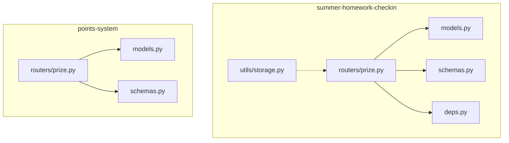
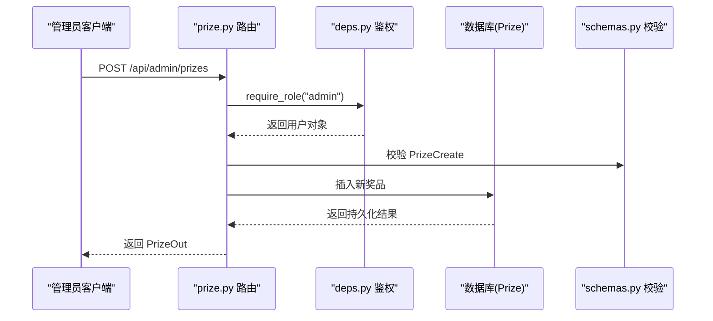
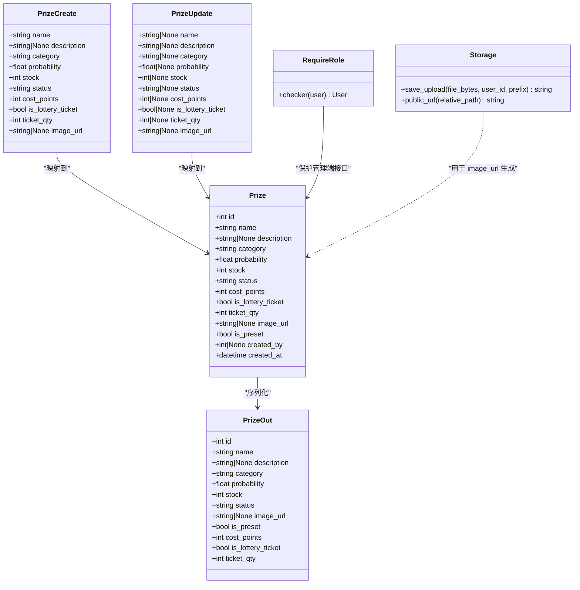

# 奖品管理接口

<cite>
**本文引用的文件**   
- [summer-homework-checkin/backend/app/routers/prize.py](file://summer-homework-checkin/backend/app/routers/prize.py)
- [summer-homework-checkin/backend/app/models.py](file://summer-homework-checkin/backend/app/models.py)
- [summer-homework-checkin/backend/app/schemas.py](file://summer-homework-checkin/backend/app/schemas.py)
- [summer-homework-checkin/backend/app/deps.py](file://summer-homework-checkin/backend/app/deps.py)
- [summer-homework-checkin/backend/app/utils/storage.py](file://summer-homework-checkin/backend/app/utils/storage.py)
- [points-system/backend/app/routers/prize.py](file://points-system/backend/app/routers/prize.py)
- [points-system/backend/app/models.py](file://points-system/backend/app/models.py)
- [points-system/backend/app/schemas.py](file://points-system/backend/app/schemas.py)
</cite>

## 目录
1. [简介](#简介)
2. [项目结构](#项目结构)
3. [核心组件](#核心组件)
4. [架构总览](#架构总览)
5. [详细组件分析](#详细组件分析)
6. [依赖关系分析](#依赖关系分析)
7. [性能与并发控制](#性能与并发控制)
8. [故障排查指南](#故障排查指南)
9. [结论](#结论)
10. [附录：接口清单与示例](#附录接口清单与示例)

## 简介
本文件为“积分兑换系统”的“奖品管理模块”提供完整的 API 接口文档，覆盖以下范围：
- 奖品信息 CRUD（创建、查询、更新、删除）
- 库存管理与状态控制（上架/下架、库存增减）
- 奖品分类与概率配置
- 图片上传与描述管理
- 管理员权限控制与审计字段
- 批量操作建议与最佳实践

说明：仓库包含两套后端实现。本文以 summer-homework-checkin 项目的奖品管理为主，同时补充 points-system 中与奖品相关的差异点，便于读者理解不同场景下的设计取舍。

## 项目结构
与奖品管理相关的关键文件如下：
- 路由层：summer-homework-checkin/backend/app/routers/prize.py
- 数据模型：summer-homework-checkin/backend/app/models.py
- 请求/响应模式：summer-homework-checkin/backend/app/schemas.py
- 鉴权与角色依赖：summer-homework-checkin/backend/app/deps.py
- 文件存储工具：summer-homework-checkin/backend/app/utils/storage.py
- 参考实现（points-system）：points-system/backend/app/routers/prize.py、models.py、schemas.py

图表来源
- [summer-homework-checkin/backend/app/routers/prize.py:1-66](file://summer-homework-checkin/backend/app/routers/prize.py#L1-L66)
- [summer-homework-checkin/backend/app/models.py:103-124](file://summer-homework-checkin/backend/app/models.py#L103-L124)
- [summer-homework-checkin/backend/app/schemas.py:98-138](file://summer-homework-checkin/backend/app/schemas.py#L98-L138)
- [summer-homework-checkin/backend/app/deps.py:1-34](file://summer-homework-checkin/backend/app/deps.py#L1-L34)
- [summer-homework-checkin/backend/app/utils/storage.py:1-23](file://summer-homework-checkin/backend/app/utils/storage.py#L1-L23)
- [points-system/backend/app/routers/prize.py:1-42](file://points-system/backend/app/routers/prize.py#L1-L42)
- [points-system/backend/app/models.py:68-79](file://points-system/backend/app/models.py#L68-L79)
- [points-system/backend/app/schemas.py:47-56](file://points-system/backend/app/schemas.py#L47-L56)

章节来源
- [summer-homework-checkin/backend/app/routers/prize.py:1-66](file://summer-homework-checkin/backend/app/routers/prize.py#L1-L66)
- [summer-homework-checkin/backend/app/models.py:103-124](file://summer-homework-checkin/backend/app/models.py#L103-L124)
- [summer-homework-checkin/backend/app/schemas.py:98-138](file://summer-homework-checkin/backend/app/schemas.py#L98-L138)
- [summer-homework-checkin/backend/app/deps.py:1-34](file://summer-homework-checkin/backend/app/deps.py#L1-L34)
- [summer-homework-checkin/backend/app/utils/storage.py:1-23](file://summer-homework-checkin/backend/app/utils/storage.py#L1-L23)
- [points-system/backend/app/routers/prize.py:1-42](file://points-system/backend/app/routers/prize.py#L1-L42)
- [points-system/backend/app/models.py:68-79](file://points-system/backend/app/models.py#L68-L79)
- [points-system/backend/app/schemas.py:47-56](file://points-system/backend/app/schemas.py#L47-L56)

## 核心组件
- 路由层
  - 公开列表：GET /api/prizes（仅展示上架奖品）
  - 管理列表：GET /api/admin/prizes（需管理员）
  - 创建奖品：POST /api/admin/prizes（需管理员）
  - 更新奖品：PUT /api/admin/prizes/{pid}（需管理员）
  - 删除奖品：DELETE /api/admin/prizes/{pid}（需管理员）
- 数据模型
  - Prize：奖品主实体，含名称、描述、分类、概率、库存、状态、积分成本、是否抽奖券、图片链接等
- 模式定义
  - PrizeCreate/PrizeUpdate/PrizeOut：用于校验输入与输出
- 鉴权与角色
  - require_role("admin")：限制管理端接口访问
- 文件存储
  - utils/storage.py：保存上传文件并生成可访问 URL（当前主要用于打卡图片，可作为奖品图片上传的基础能力）

章节来源
- [summer-homework-checkin/backend/app/routers/prize.py:12-65](file://summer-homework-checkin/backend/app/routers/prize.py#L12-L65)
- [summer-homework-checkin/backend/app/models.py:103-124](file://summer-homework-checkin/backend/app/models.py#L103-L124)
- [summer-homework-checkin/backend/app/schemas.py:98-138](file://summer-homework-checkin/backend/app/schemas.py#L98-L138)
- [summer-homework-checkin/backend/app/deps.py:28-33](file://summer-homework-checkin/backend/app/deps.py#L28-L33)
- [summer-homework-checkin/backend/app/utils/storage.py:7-23](file://summer-homework-checkin/backend/app/utils/storage.py#L7-L23)

## 架构总览
下图展示了奖品管理在 summer-homework-checkin 中的调用链路与关键依赖。

图表来源
- [summer-homework-checkin/backend/app/routers/prize.py:25-39](file://summer-homework-checkin/backend/app/routers/prize.py#L25-L39)
- [summer-homework-checkin/backend/app/deps.py:28-33](file://summer-homework-checkin/backend/app/deps.py#L28-L33)
- [summer-homework-checkin/backend/app/schemas.py:98-109](file://summer-homework-checkin/backend/app/schemas.py#L98-L109)
- [summer-homework-checkin/backend/app/models.py:103-124](file://summer-homework-checkin/backend/app/models.py#L103-L124)

## 详细组件分析

### 数据结构与业务规则
- 奖品实体（Prize）关键字段
  - id：主键
  - name：名称（必填）
  - description：描述（可选）
  - category：分类（stationery/outdoor/interest）
  - probability：中奖概率权重（0~1）
  - stock：库存（-1 表示不限量；≥0 表示具体数量）
  - status：状态（on/off）
  - cost_points：积分兑换所需积分（0 表示不参与积分兑换）
  - is_lottery_ticket：是否为“抽奖机会”奖品
  - ticket_qty：每次兑换获得的抽奖券数量（仅当 is_lottery_ticket=True 时有效）
  - image_url：图片链接（可选）
  - is_preset：是否预置
  - created_by：创建者管理员 ID
  - created_at：创建时间
- 业务规则要点
  - 类别枚举校验：仅允许 stationery/outdoor/interest
  - 概率范围校验：0 ≤ probability ≤ 1
  - 库存语义：stock=-1 表示不限量；stock=0 表示已兑完
  - 状态控制：status=off 的奖品不上架，不可被学生端看到
  - 积分兑换：cost_points=0 表示不支持积分兑换
  - 抽奖券奖品：is_lottery_ticket=True 时，兑换后直接增加用户抽奖券数量，不扣库存

章节来源
- [summer-homework-checkin/backend/app/models.py:103-124](file://summer-homework-checkin/backend/app/models.py#L103-L124)
- [summer-homework-checkin/backend/app/schemas.py:98-138](file://summer-homework-checkin/backend/app/schemas.py#L98-L138)

### 公开接口（面向学生端）
- GET /api/prizes
  - 功能：列出所有上架的奖品（status=on），按分类和 ID 排序
  - 返回：PrizeOut 列表
  - 注意：不包含 can_redeem 字段（该字段属于 points-system 的设计）

章节来源
- [summer-homework-checkin/backend/app/routers/prize.py:12-16](file://summer-homework-checkin/backend/app/routers/prize.py#L12-L16)
- [summer-homework-checkin/backend/app/schemas.py:124-138](file://summer-homework-checkin/backend/app/schemas.py#L124-L138)

### 管理接口（面向管理员）
- GET /api/admin/prizes
  - 权限：require_role("admin")
  - 功能：列出全部奖品（不分 on/off），按分类和 ID 排序
  - 返回：PrizeOut 列表

- POST /api/admin/prizes
  - 权限：require_role("admin")
  - 功能：创建奖品
  - 入参：PrizeCreate
  - 校验：category 必须在枚举内；probability 必须在 0~1
  - 行为：写入 is_preset=False、created_by=当前管理员ID
  - 返回：PrizeOut

- PUT /api/admin/prizes/{pid}
  - 权限：require_role("admin")
  - 功能：更新奖品（支持部分字段更新）
  - 入参：PrizeUpdate（仅更新传入字段）
  - 返回：PrizeOut

- DELETE /api/admin/prizes/{pid}
  - 权限：require_role("admin")
  - 功能：删除奖品
  - 返回：{"ok": true}

章节来源
- [summer-homework-checkin/backend/app/routers/prize.py:19-65](file://summer-homework-checkin/backend/app/routers/prize.py#L19-L65)
- [summer-homework-checkin/backend/app/deps.py:28-33](file://summer-homework-checkin/backend/app/deps.py#L28-L33)
- [summer-homework-checkin/backend/app/schemas.py:98-138](file://summer-homework-checkin/backend/app/schemas.py#L98-L138)

### 库存管理与状态控制
- 库存增减
  - 当前路由未暴露独立的库存增减接口。建议在管理端通过 PUT /api/admin/prizes/{pid} 更新 stock 字段实现增量调整。
  - 若需要更严格的并发安全，可在服务层使用事务与行级锁（见“性能与并发控制”）。
- 上架/下架
  - 通过更新 status 字段实现：on 表示上架，off 表示下架。
  - 公开列表仅返回 status=on 的奖品。

章节来源
- [summer-homework-checkin/backend/app/routers/prize.py:12-22](file://summer-homework-checkin/backend/app/routers/prize.py#L12-L22)
- [summer-homework-checkin/backend/app/models.py:103-124](file://summer-homework-checkin/backend/app/models.py#L103-L124)

### 图片上传与描述管理
- 图片上传
  - 现有上传工具 utils/storage.py 提供 save_upload 与 public_url，可用于将二进制文件保存到服务器并按用户维度组织目录，返回相对路径与公开 URL。
  - 当前路由未提供专用的“奖品图片上传”接口。建议新增一个受管理员保护的上传接口，接收 multipart/form-data，调用 save_upload 保存并返回 image_url，再配合 PUT /api/admin/prizes/{pid} 更新 image_url。
- 描述管理
  - 通过 PrizeCreate/PrizeUpdate 的 description 字段进行设置或修改。

章节来源
- [summer-homework-checkin/backend/app/utils/storage.py:7-23](file://summer-homework-checkin/backend/app/utils/storage.py#L7-L23)
- [summer-homework-checkin/backend/app/schemas.py:98-138](file://summer-homework-checkin/backend/app/schemas.py#L98-L138)

### 权限控制与审计日志
- 权限控制
  - 管理端接口统一通过 require_role("admin") 保护，非管理员访问将返回 403。
- 审计字段
  - created_by：记录创建管理员 ID，便于追溯。
  - 建议扩展：为管理端变更增加审计表（如 admin_audit_logs），记录操作人、动作、目标资源、时间戳等，以满足合规要求。

章节来源
- [summer-homework-checkin/backend/app/deps.py:28-33](file://summer-homework-checkin/backend/app/deps.py#L28-L33)
- [summer-homework-checkin/backend/app/models.py:103-124](file://summer-homework-checkin/backend/app/models.py#L103-L124)

### 与 points-system 的差异对比
- 公开列表
  - points-system 的 GET /api/prizes 会附带 can_redeem 标记（综合余额、库存、有效期判断），而 summer-homework-checkin 的公开列表仅过滤 status=on。
- 奖品模型
  - points-system 的 Prize 包含 valid_from/valid_to 有效期字段；summer-homework-checkin 的 Prize 使用 status 控制上下架，并提供 is_lottery_ticket/ticket_qty/cost_points 等扩展字段。
- 管理端接口
  - points-system 的 prize 路由目前仅提供公开列表，未见管理端 CRUD；summer-homework-checkin 提供了完整的管理端 CRUD。

章节来源
- [points-system/backend/app/routers/prize.py:11-41](file://points-system/backend/app/routers/prize.py#L11-L41)
- [points-system/backend/app/models.py:68-79](file://points-system/backend/app/models.py#L68-L79)
- [points-system/backend/app/schemas.py:47-56](file://points-system/backend/app/schemas.py#L47-L56)

## 依赖关系分析
- 路由依赖
  - prize.py 依赖 deps.py 的 require_role 进行角色校验
  - prize.py 依赖 schemas.py 的 Pydantic 模型进行请求/响应校验
  - prize.py 依赖 models.py 的 ORM 模型进行数据存取
- 外部依赖
  - storage.py 提供文件落盘与 URL 生成能力，供未来奖品图片上传使用

图表来源
- [summer-homework-checkin/backend/app/models.py:103-124](file://summer-homework-checkin/backend/app/models.py#L103-L124)
- [summer-homework-checkin/backend/app/schemas.py:98-138](file://summer-homework-checkin/backend/app/schemas.py#L98-L138)
- [summer-homework-checkin/backend/app/deps.py:28-33](file://summer-homework-checkin/backend/app/deps.py#L28-L33)
- [summer-homework-checkin/backend/app/utils/storage.py:7-23](file://summer-homework-checkin/backend/app/utils/storage.py#L7-L23)

## 性能与并发控制
- 并发风险
  - 在高并发下对库存进行扣减可能产生超卖风险。当前路由未实现行级锁或原子扣减。
- 建议策略
  - 悲观锁：在数据库层对 Prize 行加锁（例如 with_for_update()），确保同一时刻只有一个事务能修改库存。
  - 乐观锁：引入版本号字段，更新时检查版本一致，失败则重试。
  - 队列化：将库存扣减放入消息队列顺序处理，避免热点竞争。
  - 幂等性：为库存调整接口提供幂等键，防止重复提交导致重复扣减。
- 事务边界
  - 将库存扣减与积分扣减（如涉及）置于同一事务中，保证一致性。

[本节为通用指导，不直接分析具体文件]

## 故障排查指南
- 常见错误码
  - 400：参数校验失败（如 category 不在枚举、probability 越界）
  - 401：未提供或令牌无效
  - 403：无管理员权限
  - 404：奖品不存在
- 排查步骤
  - 确认请求头携带有效的 Bearer Token
  - 检查入参是否符合 PrizeCreate/PrizeUpdate 约束
  - 查看返回 detail 信息定位具体原因
  - 若涉及库存变动，检查是否存在并发冲突或事务回滚

章节来源
- [summer-homework-checkin/backend/app/routers/prize.py:31-39](file://summer-homework-checkin/backend/app/routers/prize.py#L31-L39)
- [summer-homework-checkin/backend/app/deps.py:17-33](file://summer-homework-checkin/backend/app/deps.py#L17-L33)

## 结论
summer-homework-checkin 的奖品管理模块提供了完善的管理端 CRUD 与公开列表能力，具备清晰的权限控制与基础的数据校验。针对库存并发与审计日志，建议在生产环境引入更严格的并发控制与审计机制，以提升系统的健壮性与可追溯性。

[本节为总结，不直接分析具体文件]

## 附录：接口清单与示例

### 接口清单
- 公开接口
  - GET /api/prizes
- 管理接口
  - GET /api/admin/prizes
  - POST /api/admin/prizes
  - PUT /api/admin/prizes/{pid}
  - DELETE /api/admin/prizes/{pid}

### 请求/响应示例（摘要）
- 创建奖品
  - 方法：POST /api/admin/prizes
  - 头部：Authorization: Bearer <token>
  - 请求体：PrizeCreate
  - 响应：PrizeOut
- 更新奖品
  - 方法：PUT /api/admin/prizes/{pid}
  - 头部：Authorization: Bearer <token>
  - 请求体：PrizeUpdate（仅更新传入字段）
  - 响应：PrizeOut
- 删除奖品
  - 方法：DELETE /api/admin/prizes/{pid}
  - 头部：Authorization: Bearer <token>
  - 响应：{"ok": true}
- 公开列表
  - 方法：GET /api/prizes
  - 响应：PrizeOut[]

章节来源
- [summer-homework-checkin/backend/app/routers/prize.py:12-65](file://summer-homework-checkin/backend/app/routers/prize.py#L12-L65)
- [summer-homework-checkin/backend/app/schemas.py:98-138](file://summer-homework-checkin/backend/app/schemas.py#L98-L138)