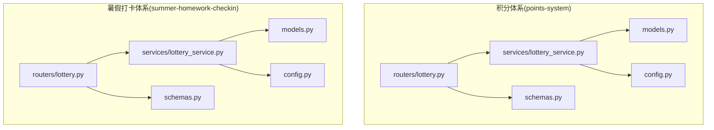
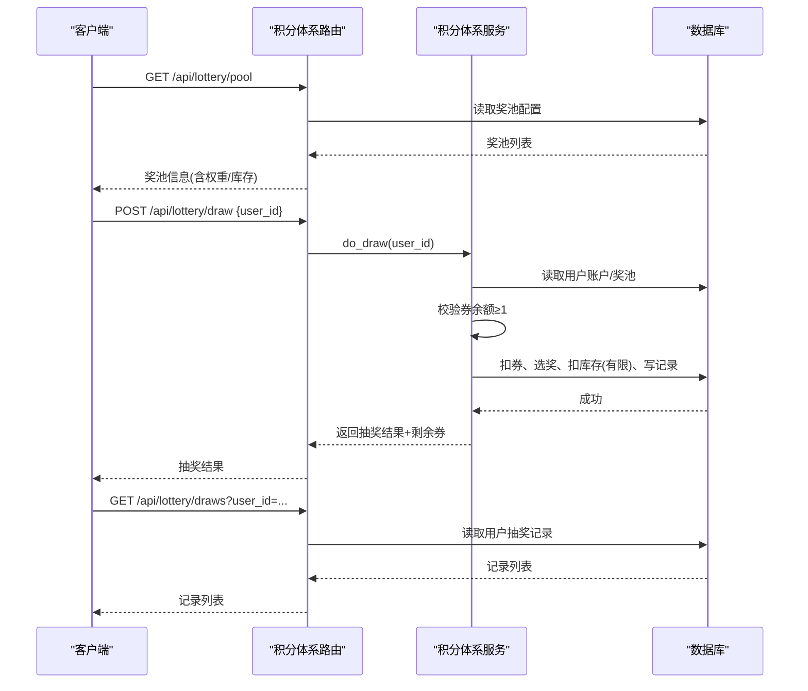
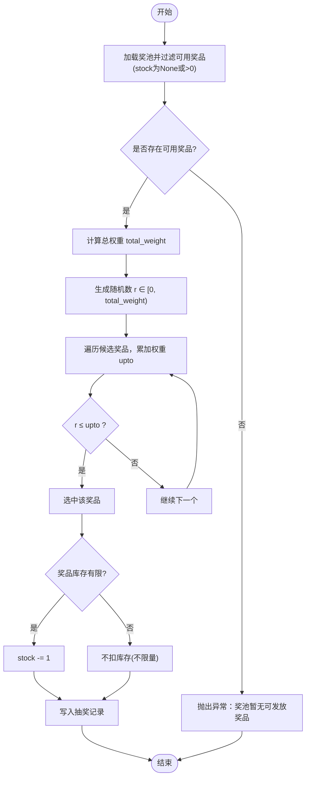
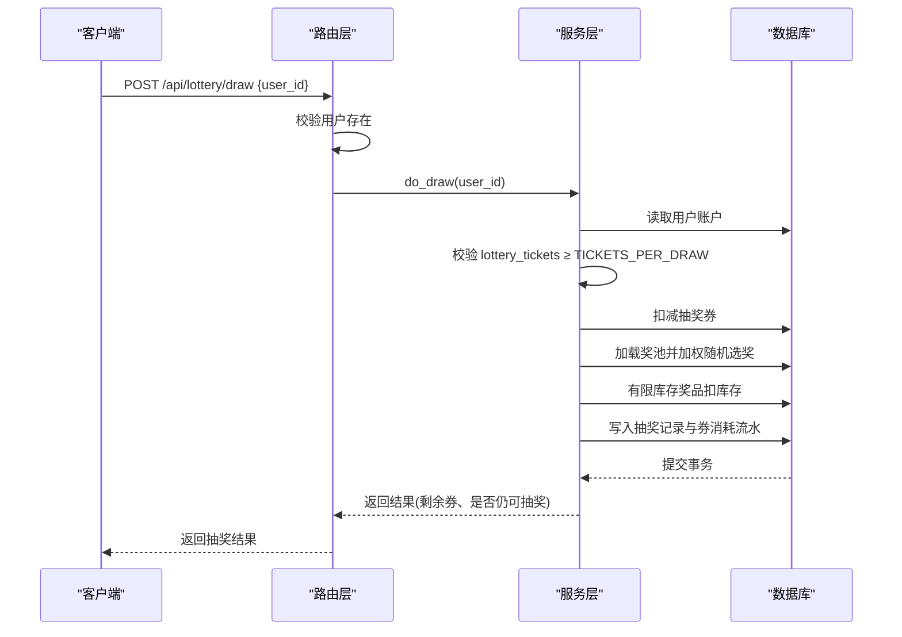
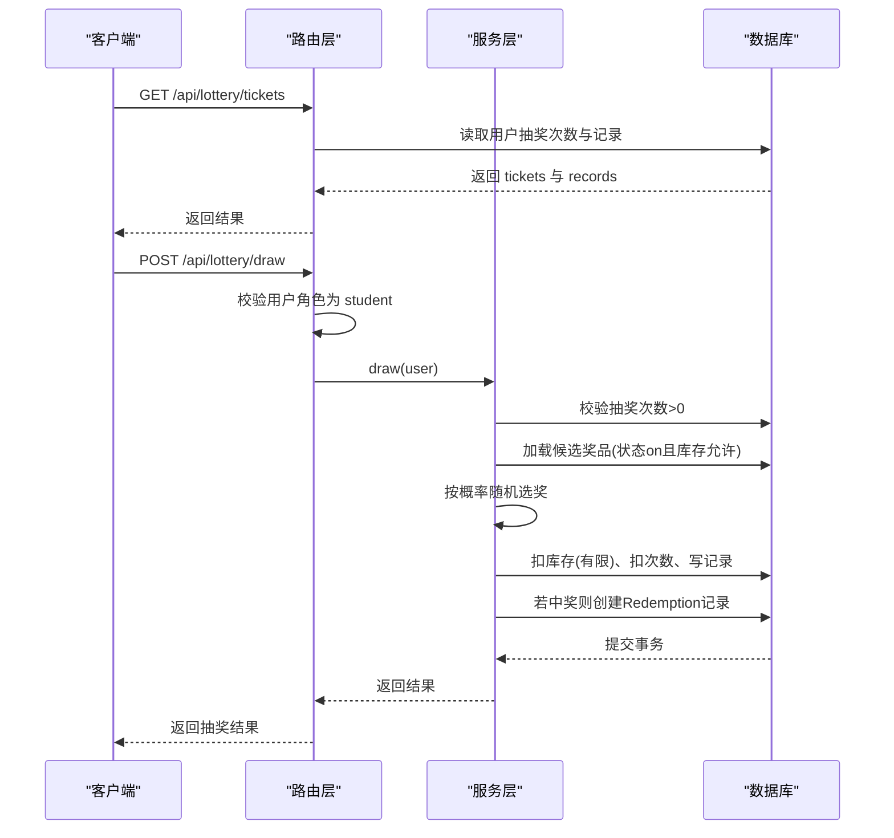
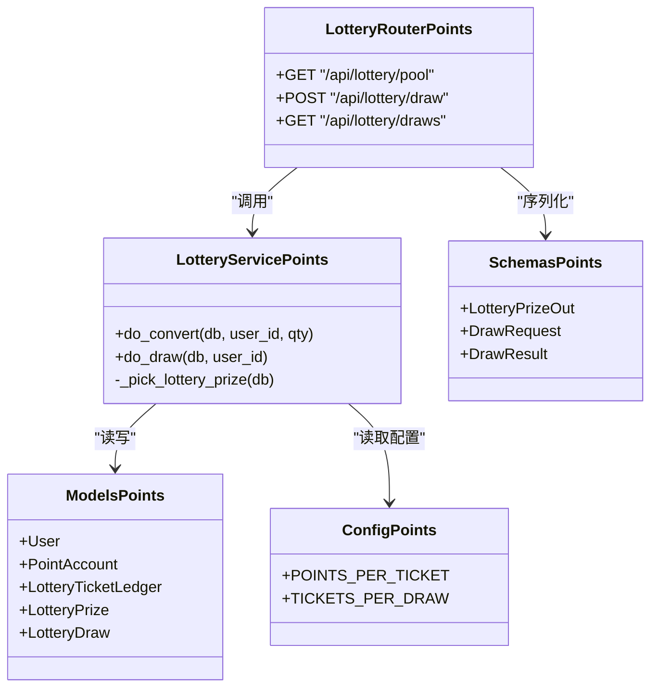

# 抽奖接口

<cite>
**本文引用的文件**   
- [points-system/backend/app/routers/lottery.py](file://points-system/backend/app/routers/lottery.py)
- [points-system/backend/app/services/lottery_service.py](file://points-system/backend/app/services/lottery_service.py)
- [points-system/backend/app/models.py](file://points-system/backend/app/models.py)
- [points-system/backend/app/schemas.py](file://points-system/backend/app/schemas.py)
- [points-system/backend/app/config.py](file://points-system/backend/app/config.py)
- [summer-homework-checkin/backend/app/routers/lottery.py](file://summer-homework-checkin/backend/app/routers/lottery.py)
- [summer-homework-checkin/backend/app/services/lottery_service.py](file://summer-homework-checkin/backend/app/services/lottery_service.py)
- [summer-homework-checkin/backend/app/models.py](file://summer-homework-checkin/backend/app/models.py)
- [summer-homework-checkin/backend/app/schemas.py](file://summer-homework-checkin/backend/app/schemas.py)
- [summer-homework-checkin/backend/app/config.py](file://summer-homework-checkin/backend/app/config.py)
</cite>

## 目录
1. [简介](#简介)
2. [项目结构](#项目结构)
3. [核心组件](#核心组件)
4. [架构总览](#架构总览)
5. [详细组件分析](#详细组件分析)
6. [依赖关系分析](#依赖关系分析)
7. [性能与并发特性](#性能与并发特性)
8. [防作弊、频率限制与异常处理](#防作弊频率限制与异常处理)
9. [请求/响应示例与错误码](#请求响应示例与错误码)
10. [结论](#结论)

## 简介
本文件为积分兑换系统中的“抽奖功能”提供完整的API接口文档，覆盖以下能力：
- 奖池配置查询（展示概率与库存）
- 抽奖券获取（积分兑换抽奖券）
- 参与抽奖（消耗抽奖券执行加权随机）
- 中奖结果查询（用户抽奖历史）
- 抽奖算法与概率计算说明
- 奖品分配机制与库存扣减策略
- 完整调用序列（前置校验、执行、返回）
- 抽奖券生成规则、使用限制与有效期管理
- 防作弊机制、频率限制与异常处理策略
- 请求/响应示例与错误码说明

系统包含两套实现：
- 积分体系（points-system）：以“积分兑换抽奖券 + 按权重随机抽奖”为核心。
- 暑假打卡体系（summer-homework-checkin）：以“连续打卡获得抽奖资格 + 按概率随机抽奖”为核心。

## 项目结构
两个后端模块均基于 FastAPI + SQLAlchemy，路由层负责HTTP端点，服务层封装业务逻辑，模型层定义数据表结构，Schema层定义请求/响应结构，配置层定义关键参数。

图表来源
- [points-system/backend/app/routers/lottery.py:1-55](file://points-system/backend/app/routers/lottery.py#L1-L55)
- [points-system/backend/app/services/lottery_service.py:1-174](file://points-system/backend/app/services/lottery_service.py#L1-L174)
- [points-system/backend/app/models.py:1-151](file://points-system/backend/app/models.py#L1-L151)
- [points-system/backend/app/schemas.py:1-147](file://points-system/backend/app/schemas.py#L1-L147)
- [points-system/backend/app/config.py:1-17](file://points-system/backend/app/config.py#L1-L17)
- [summer-homework-checkin/backend/app/routers/lottery.py:1-30](file://summer-homework-checkin/backend/app/routers/lottery.py#L1-L30)
- [summer-homework-checkin/backend/app/services/lottery_service.py:1-77](file://summer-homework-checkin/backend/app/services/lottery_service.py#L1-L77)
- [summer-homework-checkin/backend/app/models.py:1-212](file://summer-homework-checkin/backend/app/models.py#L1-L212)
- [summer-homework-checkin/backend/app/schemas.py:1-322](file://summer-homework-checkin/backend/app/schemas.py#L1-322)
- [summer-homework-checkin/backend/app/config.py:1-50](file://summer-homework-checkin/backend/app/config.py#L1-L50)

章节来源
- [points-system/backend/app/routers/lottery.py:1-55](file://points-system/backend/app/routers/lottery.py#L1-L55)
- [summer-homework-checkin/backend/app/routers/lottery.py:1-30](file://summer-homework-checkin/backend/app/routers/lottery.py#L1-L30)

## 核心组件
- 路由层
  - 积分体系：提供奖池查询、抽奖、抽奖记录列表等端点。
  - 暑假打卡体系：提供抽奖次数查询、抽奖端点。
- 服务层
  - 积分体系：实现积分兑换抽奖券、加权随机抽奖、库存扣减、流水落库。
  - 暑假打卡体系：实现抽奖资格校验、概率随机、库存扣减、通知与兑换记录创建。
- 模型层
  - 积分体系：用户、积分账户、抽奖券流水、抽奖奖池、抽奖记录等。
  - 暑假打卡体系：用户、奖品、抽奖记录、兑换记录、通知等。
- Schema层
  - 定义请求体与响应体的字段约束与类型。
- 配置层
  - 定义抽奖券兑换比例、每次抽奖消耗券数、打卡解锁阈值等。

章节来源
- [points-system/backend/app/services/lottery_service.py:1-174](file://points-system/backend/app/services/lottery_service.py#L1-L174)
- [summer-homework-checkin/backend/app/services/lottery_service.py:1-77](file://summer-homework-checkin/backend/app/services/lottery_service.py#L1-L77)
- [points-system/backend/app/models.py:1-151](file://points-system/backend/app/models.py#L1-L151)
- [summer-homework-checkin/backend/app/models.py:1-212](file://summer-homework-checkin/backend/app/models.py#L1-L212)
- [points-system/backend/app/schemas.py:1-147](file://points-system/backend/app/schemas.py#L1-L147)
- [summer-homework-checkin/backend/app/schemas.py:1-322](file://summer-homework-checkin/backend/app/schemas.py#L1-322)
- [points-system/backend/app/config.py:1-17](file://points-system/backend/app/config.py#L1-L17)
- [summer-homework-checkin/backend/app/config.py:1-50](file://summer-homework-checkin/backend/app/config.py#L1-L50)

## 架构总览
下图展示了两个体系的抽奖流程差异：积分体系通过“积分兑换抽奖券”，再“按权重随机抽奖”；暑假打卡体系通过“连续打卡解锁抽奖资格”，再“按概率随机抽奖”。

图表来源
- [points-system/backend/app/routers/lottery.py:11-54](file://points-system/backend/app/routers/lottery.py#L11-L54)
- [points-system/backend/app/services/lottery_service.py:117-174](file://points-system/backend/app/services/lottery_service.py#L117-L174)
- [points-system/backend/app/models.py:125-151](file://points-system/backend/app/models.py#L125-L151)

## 详细组件分析

### 积分体系（points-system）

#### API端点
- 获取奖池配置
  - 方法：GET
  - 路径：/api/lottery/pool
  - 描述：返回当前可发放的奖品清单，含名称、描述、权重、库存、是否中奖标记等，供前端展示概率与库存。
  - 响应：数组，元素包含 id、name、description、weight、stock、is_win。
- 发起抽奖
  - 方法：POST
  - 路径：/api/lottery/draw
  - 请求体：{ user_id: int }
  - 描述：校验用户存在后，执行一次抽奖（消耗1张抽奖券），返回本次抽奖结果、剩余券数量、是否仍可继续抽奖。
  - 响应：包含 draw（id、user_id、prize_name、is_win、created_at）、lottery_tickets、can_lottery。
- 查询抽奖记录
  - 方法：GET
  - 路径：/api/lottery/draws
  - 查询参数：user_id
  - 描述：按时间倒序返回用户的抽奖记录。
  - 响应：数组，元素包含 id、user_id、prize_name、is_win、created_at。

章节来源
- [points-system/backend/app/routers/lottery.py:11-54](file://points-system/backend/app/routers/lottery.py#L11-L54)
- [points-system/backend/app/schemas.py:122-147](file://points-system/backend/app/schemas.py#L122-L147)

#### 抽奖券获取（积分兑换抽奖券）
- 入口：服务层 do_convert(db, user_id, qty)
- 规则：
  - 最低门槛：账户余额需至少满足兑换1张券所需积分。
  - 批量兑换：成本 = qty × POINTS_PER_TICKET。
  - 事务内原子操作：扣积分、加抽奖券、写入积分支出流水与抽奖券发放流水。
  - 并发控制：进程内锁保证同一账户的读改写串行化，避免丢失更新。
- 返回值：包含兑换记录、兑换后积分余额、兑换后抽奖券数量。

章节来源
- [points-system/backend/app/services/lottery_service.py:30-98](file://points-system/backend/app/services/lottery_service.py#L30-L98)
- [points-system/backend/app/config.py:12-16](file://points-system/backend/app/config.py#L12-L16)
- [points-system/backend/app/models.py:20-33](file://points-system/backend/app/models.py#L20-L33)
- [points-system/backend/app/models.py:96-123](file://points-system/backend/app/models.py#L96-L123)

#### 抽奖算法与概率计算
- 候选集：仅包含库存为 None 或 >0 的奖品。
- 权重选择：对候选奖品 weight 求和 total_weight，在 [0, total_weight) 均匀采样 r，累加权重直到 r ≤ 累计值，命中即选中。
- 库存扣减：若奖品 stock 不为 None，则扣减1。
- 记录写入：写入抽奖记录与抽奖券消耗流水。
- 权限派生：抽奖权限由 account.lottery_tickets ≥ TICKETS_PER_DRAW 决定，无需额外状态位。

图表来源
- [points-system/backend/app/services/lottery_service.py:101-114](file://points-system/backend/app/services/lottery_service.py#L101-L114)
- [points-system/backend/app/services/lottery_service.py:132-148](file://points-system/backend/app/services/lottery_service.py#L132-L148)

#### 奖品分配机制
- 有限库存奖品：命中后扣减库存。
- 不限量奖品：stock 为 None，命中不扣库存。
- is_win 标记：用于区分“中奖”与“谢谢参与”等未中奖项。

章节来源
- [points-system/backend/app/models.py:125-137](file://points-system/backend/app/models.py#L125-L137)
- [points-system/backend/app/services/lottery_service.py:132-148](file://points-system/backend/app/services/lottery_service.py#L132-L148)

#### 抽奖流程完整调用序列

图表来源
- [points-system/backend/app/routers/lottery.py:24-37](file://points-system/backend/app/routers/lottery.py#L24-L37)
- [points-system/backend/app/services/lottery_service.py:117-174](file://points-system/backend/app/services/lottery_service.py#L117-L174)

#### 抽奖券生成规则、使用限制与有效期管理
- 生成规则：通过积分兑换，qty 张券消耗 qty × POINTS_PER_TICKET 积分。
- 使用限制：每次抽奖消耗 TICKETS_PER_DRAW 张券；当余额 < TICKETS_PER_DRAW 时视为未解锁。
- 有效期管理：当前实现未引入券的有效期字段，券长期有效直至被消耗。

章节来源
- [points-system/backend/app/services/lottery_service.py:30-98](file://points-system/backend/app/services/lottery_service.py#L30-L98)
- [points-system/backend/app/config.py:12-16](file://points-system/backend/app/config.py#L12-L16)
- [points-system/backend/app/models.py:20-33](file://points-system/backend/app/models.py#L20-L33)

#### 并发与一致性
- 单进程并发：使用线程锁将同一账户的读改写串行化，防止 SQLite 下丢失更新。
- 多实例部署建议：采用数据库悲观锁（如 with_for_update()）。

章节来源
- [points-system/backend/app/services/lottery_service.py:23-27](file://points-system/backend/app/services/lottery_service.py#L23-L27)

### 暑假打卡体系（summer-homework-checkin）

#### API端点
- 查询抽奖次数与记录
  - 方法：GET
  - 路径：/api/lottery/tickets
  - 认证：需要登录态（依赖 get_current_user）。
  - 描述：返回当前用户的抽奖次数与抽奖记录列表。
  - 响应：{ tickets: int, records: [...] }。
- 发起抽奖
  - 方法：POST
  - 路径：/api/lottery/draw
  - 认证：需要登录态且角色为 student。
  - 描述：消耗1次抽奖资格，按概率随机抽取奖品，返回结果与剩余次数。
  - 响应：{ is_win, prize_name, prize_id, tickets_left, message }。

章节来源
- [summer-homework-checkin/backend/app/routers/lottery.py:13-29](file://summer-homework-checkin/backend/app/routers/lottery.py#L13-L29)
- [summer-homework-checkin/backend/app/schemas.py:140-154](file://summer-homework-checkin/backend/app/schemas.py#L140-L154)

#### 抽奖算法与概率计算
- 候选集：状态为 on 且库存为 -1 或 >0 的奖品。
- 概率选择：对 candidates 的概率 probability 求和 total，在 [0, total) 均匀采样 r，累加概率直到 r ≤ 累计值，命中即选中。
- 库存扣减：若奖品 stock > 0，则扣减1。
- 记录写入：写入抽奖记录；若中奖，同时创建 Redemption 记录以便学生端与管理端可见。

章节来源
- [summer-homework-checkin/backend/app/services/lottery_service.py:9-77](file://summer-homework-checkin/backend/app/services/lottery_service.py#L9-L77)
- [summer-homework-checkin/backend/app/models.py:103-139](file://summer-homework-checkin/backend/app/models.py#L103-L139)

#### 抽奖资格获取与有效期
- 资格来源：通过连续打卡达到阈值 LOTTERY_STREAK_THRESHOLD 解锁抽奖资格。
- 资格使用：每次抽奖消耗1次资格。
- 有效期：当前实现未引入资格有效期字段，资格长期有效直至被消耗。

章节来源
- [summer-homework-checkin/backend/app/config.py:34-35](file://summer-homework-checkin/backend/app/config.py#L34-L35)
- [summer-homework-checkin/backend/app/models.py:39](file://summer-homework-checkin/backend/app/models.py#L39)

#### 抽奖流程完整调用序列

图表来源
- [summer-homework-checkin/backend/app/routers/lottery.py:13-29](file://summer-homework-checkin/backend/app/routers/lottery.py#L13-L29)
- [summer-homework-checkin/backend/app/services/lottery_service.py:9-77](file://summer-homework-checkin/backend/app/services/lottery_service.py#L9-L77)

## 依赖关系分析
- 路由层依赖服务层进行业务处理，服务层依赖模型层访问数据库，Schema层用于请求/响应校验。
- 配置层提供关键参数（如兑换比例、抽奖消耗、打卡解锁阈值）。

图表来源
- [points-system/backend/app/routers/lottery.py:1-55](file://points-system/backend/app/routers/lottery.py#L1-L55)
- [points-system/backend/app/services/lottery_service.py:1-174](file://points-system/backend/app/services/lottery_service.py#L1-L174)
- [points-system/backend/app/models.py:1-151](file://points-system/backend/app/models.py#L1-L151)
- [points-system/backend/app/schemas.py:1-147](file://points-system/backend/app/schemas.py#L1-L147)
- [points-system/backend/app/config.py:1-17](file://points-system/backend/app/config.py#L1-L17)

章节来源
- [points-system/backend/app/routers/lottery.py:1-55](file://points-system/backend/app/routers/lottery.py#L1-L55)
- [points-system/backend/app/services/lottery_service.py:1-174](file://points-system/backend/app/services/lottery_service.py#L1-L174)
- [points-system/backend/app/models.py:1-151](file://points-system/backend/app/models.py#L1-L151)
- [points-system/backend/app/schemas.py:1-147](file://points-system/backend/app/schemas.py#L1-L147)
- [points-system/backend/app/config.py:1-17](file://points-system/backend/app/config.py#L1-L17)

## 性能与并发特性
- 积分体系：
  - 使用进程内锁 _account_lock 将同一账户的读改写串行化，避免 SQLite 并发下的丢失更新问题。
  - 所有“读-改-写”在同一事务中完成，失败统一回滚，确保一致性。
- 暑假打卡体系：
  - 抽奖逻辑简单，直接按概率随机，无额外锁；在高并发场景建议增加数据库级锁或队列化。

章节来源
- [points-system/backend/app/services/lottery_service.py:23-27](file://points-system/backend/app/services/lottery_service.py#L23-L27)
- [points-system/backend/app/services/lottery_service.py:87-91](file://points-system/backend/app/services/lottery_service.py#L87-L91)
- [points-system/backend/app/services/lottery_service.py:161-165](file://points-system/backend/app/services/lottery_service.py#L161-L165)

## 防作弊、频率限制与异常处理
- 防作弊机制
  - 积分体系：通过“余额派生权限”避免状态不一致；进程内锁防止并发篡改；唯一索引与流水记录保障可追溯。
  - 暑假打卡体系：结合打卡审核、人脸识别、地理围栏等（非抽奖模块本身），从源头减少代打卡风险。
- 频率限制
  - 当前实现未内置全局频率限制；可在网关层或中间件层添加限流策略（如每用户每秒N次）。
- 异常处理策略
  - 用户不存在：返回404。
  - 积分不足/券不足：返回400或409，提示具体原因。
  - 冲突重试：IntegrityError捕获后返回409，提示重试。
  - 奖池不可用：返回500，提示暂无可发放奖品。

章节来源
- [points-system/backend/app/routers/lottery.py:24-37](file://points-system/backend/app/routers/lottery.py#L24-L37)
- [points-system/backend/app/services/lottery_service.py:117-174](file://points-system/backend/app/services/lottery_service.py#L117-L174)
- [summer-homework-checkin/backend/app/routers/lottery.py:25-29](file://summer-homework-checkin/backend/app/routers/lottery.py#L25-L29)
- [summer-homework-checkin/backend/app/services/lottery_service.py:9-77](file://summer-homework-checkin/backend/app/services/lottery_service.py#L9-L77)

## 请求/响应示例与错误码

### 积分体系（points-system）

- 获取奖池配置
  - 请求：GET /api/lottery/pool
  - 响应示例：
    - 200 OK
      - 数组元素示例字段：id、name、description、weight、stock、is_win
- 发起抽奖
  - 请求：POST /api/lottery/draw
  - 请求体示例：
    - { "user_id": 123 }
  - 响应示例：
    - 200 OK
      - {
          "draw": { "id": 1, "user_id": 123, "prize_name": "优惠券", "is_win": 1, "created_at": "2026-07-10T12:00:00Z" },
          "lottery_tickets": 2,
          "can_lottery": true
        }
- 查询抽奖记录
  - 请求：GET /api/lottery/draws?user_id=123
  - 响应示例：
    - 200 OK
      - 数组元素示例字段：id、user_id、prize_name、is_win、created_at

错误码说明（积分体系）
- 404：用户不存在
- 400：参数错误或积分不足（兑换阶段）
- 409：抽奖券不足或并发冲突
- 500：奖池暂无可发放奖品

章节来源
- [points-system/backend/app/routers/lottery.py:11-54](file://points-system/backend/app/routers/lottery.py#L11-L54)
- [points-system/backend/app/schemas.py:122-147](file://points-system/backend/app/schemas.py#L122-L147)

### 暑假打卡体系（summer-homework-checkin）

- 查询抽奖次数与记录
  - 请求：GET /api/lottery/tickets
  - 认证：需要登录态
  - 响应示例：
    - 200 OK
      - {
          "tickets": 3,
          "records": [
            { "id": 1, "prize_name": "文具套装", "is_win": true, "drawn_at": "2026-07-10T12:00:00Z" }
          ]
        }
- 发起抽奖
  - 请求：POST /api/lottery/draw
  - 认证：需要登录态且角色为 student
  - 响应示例：
    - 200 OK
      - {
          "is_win": true,
          "prize_name": "文具套装",
          "prize_id": 5,
          "tickets_left": 2,
          "message": "恭喜抽中【文具套装】"
        }

错误码说明（暑假打卡体系）
- 400：暂无可用抽奖资格
- 403：非学生角色无法抽奖

章节来源
- [summer-homework-checkin/backend/app/routers/lottery.py:13-29](file://summer-homework-checkin/backend/app/routers/lottery.py#L13-L29)
- [summer-homework-checkin/backend/app/schemas.py:140-154](file://summer-homework-checkin/backend/app/schemas.py#L140-L154)

## 结论
- 积分体系通过“积分兑换抽奖券 + 权重随机”实现灵活可控的抽奖体验，具备完善的并发保护与事务一致性。
- 暑假打卡体系通过“连续打卡解锁资格 + 概率随机”激励用户持续打卡，并在中奖时联动兑换记录与通知。
- 建议在网关层补充频率限制与风控策略，进一步提升安全性与稳定性。
- 如需引入抽奖券有效期或更细粒度的活动周期控制，可在模型与配置层扩展相应字段与规则。