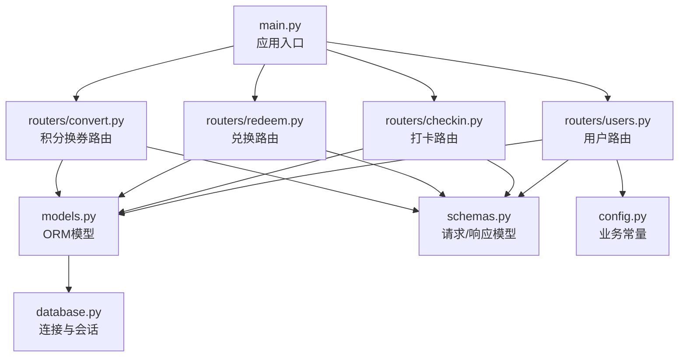
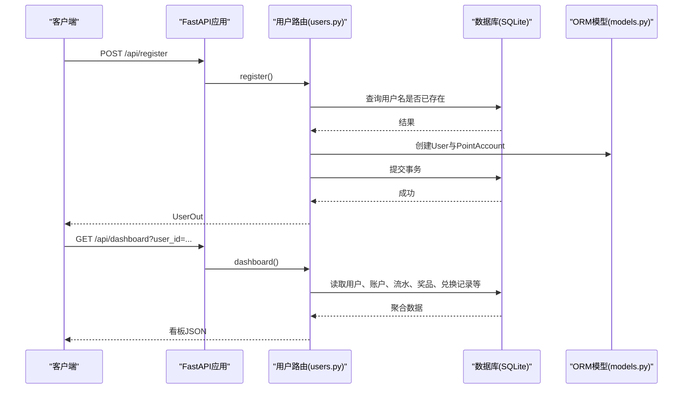
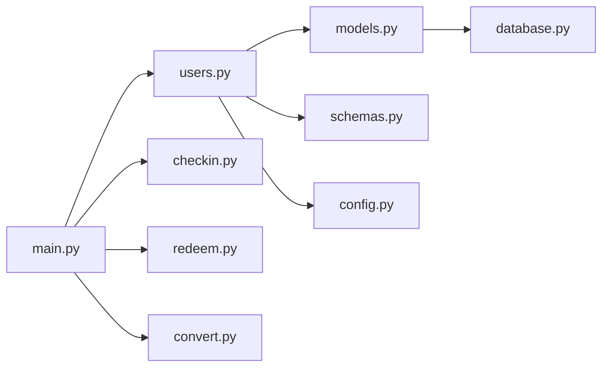

# 用户管理接口

<cite>
**本文引用的文件**   
- [points-system/backend/app/routers/users.py](file://points-system/backend/app/routers/users.py)
- [points-system/backend/app/models.py](file://points-system/backend/app/models.py)
- [points-system/backend/app/schemas.py](file://points-system/backend/app/schemas.py)
- [points-system/backend/app/main.py](file://points-system/backend/app/main.py)
- [points-system/backend/app/database.py](file://points-system/backend/app/database.py)
- [points-system/backend/app/config.py](file://points-system/backend/app/config.py)
- [points-system/backend/app/routers/checkin.py](file://points-system/backend/app/routers/checkin.py)
- [points-system/backend/app/routers/convert.py](file://points-system/backend/app/routers/convert.py)
- [points-system/backend/app/routers/redeem.py](file://points-system/backend/app/routers/redeem.py)
</cite>

## 目录
1. [简介](#简介)
2. [项目结构](#项目结构)
3. [核心组件](#核心组件)
4. [架构总览](#架构总览)
5. [详细接口说明](#详细接口说明)
6. [依赖分析](#依赖分析)
7. [性能与并发](#性能与并发)
8. [安全与认证](#安全与认证)
9. [数据模型与校验规则](#数据模型与校验规则)
10. [故障排查指南](#故障排查指南)
11. [结论](#结论)

## 简介
本文件为积分兑换系统的“用户管理模块”API文档，聚焦于用户注册、用户列表、用户看板等与用户相关的RESTful端点。系统基于FastAPI构建，使用SQLAlchemy+SQLite进行数据持久化，采用Pydantic进行请求/响应数据校验。当前实现未包含密码登录与JWT鉴权逻辑，所有接口通过user_id参数标识用户身份；生产环境建议引入令牌机制与权限控制。

## 项目结构
后端采用按功能划分的路由组织方式：
- routers：HTTP路由定义（users、checkin、redeem、convert等）
- models：数据库模型（User、PointAccount、CheckIn、Prize、Redemption、Conversion等）
- schemas：Pydantic请求/响应模型
- database：数据库连接与会话管理
- config：业务常量配置（如积分与抽奖券比例）
- main：应用入口与路由挂载

图示来源
- [points-system/backend/app/main.py:1-33](file://points-system/backend/app/main.py#L1-L33)
- [points-system/backend/app/routers/users.py:1-192](file://points-system/backend/app/routers/users.py#L1-L192)
- [points-system/backend/app/models.py:1-151](file://points-system/backend/app/models.py#L1-L151)
- [points-system/backend/app/schemas.py:1-147](file://points-system/backend/app/schemas.py#L1-L147)
- [points-system/backend/app/database.py:1-39](file://points-system/backend/app/database.py#L1-L39)
- [points-system/backend/app/config.py:1-17](file://points-system/backend/app/config.py#L1-L17)

章节来源
- [points-system/backend/app/main.py:1-33](file://points-system/backend/app/main.py#L1-L33)

## 核心组件
- 用户模型与账户模型：User与PointAccount一一对应，注册时自动创建积分账户。
- 用户路由：提供注册、用户列表、用户看板等能力。
- 数据校验：通过Pydantic的UserCreate/UserOut等模型约束输入输出。
- 数据库访问：通过get_db依赖注入SessionLocal会话，统一事务生命周期。

章节来源
- [points-system/backend/app/models.py:10-33](file://points-system/backend/app/models.py#L10-L33)
- [points-system/backend/app/routers/users.py:11-22](file://points-system/backend/app/routers/users.py#L11-L22)
- [points-system/backend/app/schemas.py:6-16](file://points-system/backend/app/schemas.py#L6-L16)
- [points-system/backend/app/database.py:28-33](file://points-system/backend/app/database.py#L28-L33)

## 架构总览
下图展示了用户相关接口的调用路径与数据流向：客户端请求进入FastAPI应用，路由层解析并调用服务逻辑，最终读写数据库模型。

图示来源
- [points-system/backend/app/routers/users.py:11-22](file://points-system/backend/app/routers/users.py#L11-L22)
- [points-system/backend/app/routers/users.py:30-192](file://points-system/backend/app/routers/users.py#L30-L192)
- [points-system/backend/app/models.py:10-33](file://points-system/backend/app/models.py#L10-L33)
- [points-system/backend/app/database.py:28-33](file://points-system/backend/app/database.py#L28-L33)

## 详细接口说明

### 用户注册
- 方法：POST
- 路径：/api/register
- 描述：注册用户，同时为其创建积分账户（余额、累计收支、抽奖券初始化为0）。
- 请求体（JSON）：
  - username: 字符串，必填，唯一
  - display_name: 字符串，可选，默认空串
- 响应体（JSON）：
  - id: 整数
  - username: 字符串
  - display_name: 字符串
  - created_at: 时间戳
- 状态码：
  - 200：注册成功
  - 409：用户名已存在
- 错误处理：
  - 重复用户名返回409，detail提示“用户名已存在”。
- 示例（成功）：
  - 请求：{"username": "alice", "display_name": "Alice"}
  - 响应：{"id": 1, "username": "alice", "display_name": "Alice", "created_at": "..."}
- 示例（失败）：
  - 请求：{"username": "alice", "display_name": "Alice"}
  - 响应：{"detail": "用户名已存在"}

章节来源
- [points-system/backend/app/routers/users.py:11-22](file://points-system/backend/app/routers/users.py#L11-L22)
- [points-system/backend/app/schemas.py:6-16](file://points-system/backend/app/schemas.py#L6-L16)
- [points-system/backend/app/models.py:10-33](file://points-system/backend/app/models.py#L10-L33)

### 用户列表
- 方法：GET
- 路径：/api/users
- 描述：返回所有用户列表（按id升序）。
- 请求参数：无
- 响应体（JSON数组）：元素为UserOut对象（id、username、display_name、created_at）。
- 状态码：
  - 200：成功
- 示例（成功）：
  - 响应：[{"id": 1, "username": "alice", "display_name": "Alice", "created_at": "..."}, ...]

章节来源
- [points-system/backend/app/routers/users.py:25-27](file://points-system/backend/app/routers/users.py#L25-L27)
- [points-system/backend/app/schemas.py:11-16](file://points-system/backend/app/schemas.py#L11-L16)

### 用户看板
- 方法：GET
- 路径：/api/dashboard
- 描述：一次性返回前端看板所需的全部数据，包括用户信息、积分账户、连续打卡、可兑换奖品、兑换记录、积分流水、抽奖券流水、兑换抽奖券记录、抽奖记录、奖池等。
- 请求参数：
  - user_id: 整数，必填
- 响应体（JSON）：
  - user: {id, username, display_name}
  - balance: 当前可用积分
  - total_earned: 累计获得积分
  - total_spent: 累计支出积分
  - lottery_tickets: 当前抽奖券数量
  - can_lottery: 布尔，是否满足抽奖条件（抽奖券≥TICKETS_PER_DRAW）
  - points_per_ticket: 每抽奖券所需积分
  - today_checked_in: 布尔，今天是否已打卡
  - current_streak: 当前连续打卡天数
  - prizes: 奖品列表（含can_redeem字段）
  - lottery_pool: 奖池列表（用于转盘初始化）
  - redemptions: 兑换记录列表
  - conversions: 积分兑换抽奖券记录列表
  - ticket_ledger: 抽奖券流水列表
  - lottery_draws: 抽奖记录列表
  - ledger: 积分流水列表
- 状态码：
  - 200：成功
  - 404：用户不存在
- 示例（成功）：
  - 请求：/api/dashboard?user_id=1
  - 响应：包含上述字段的完整JSON对象
- 示例（失败）：
  - 请求：/api/dashboard?user_id=999
  - 响应：{"detail": "用户不存在"}

章节来源
- [points-system/backend/app/routers/users.py:30-192](file://points-system/backend/app/routers/users.py#L30-L192)
- [points-system/backend/app/models.py:35-151](file://points-system/backend/app/models.py#L35-L151)
- [points-system/backend/app/config.py:12-16](file://points-system/backend/app/config.py#L12-L16)

### 关联接口（与用户强相关）
以下接口虽不在users路由中，但与用户管理密切相关，常用于完善用户视图或业务流程。

#### 打卡
- 方法：POST
- 路径：/api/checkin
- 描述：为用户执行一次打卡，更新连续天数与积分。
- 请求体（JSON）：
  - user_id: 整数
- 响应体（JSON）：
  - checkin: 打卡记录对象
  - points_earned: 本次获得基础积分
  - bonus: 连续奖励积分
  - streak: 截至当天的连续打卡天数
  - balance: 打卡后积分余额
- 状态码：
  - 200：成功
  - 404：用户不存在
- 示例（成功）：
  - 请求：{"user_id": 1}
  - 响应：{"checkin": {...}, "points_earned": 10, "bonus": 0, "streak": 1, "balance": 10}

章节来源
- [points-system/backend/app/routers/checkin.py:11-15](file://points-system/backend/app/routers/checkin.py#L11-L15)
- [points-system/backend/app/schemas.py:68-83](file://points-system/backend/app/schemas.py#L68-L83)

#### 积分兑换抽奖券
- 方法：POST
- 路径：/api/convert
- 描述：将积分兑换为抽奖券，生成兑换记录与抽奖券流水。
- 请求体（JSON）：
  - user_id: 整数
  - qty: 整数，≥1，表示兑换的抽奖券数量
- 响应体（JSON）：
  - conversion: 兑换记录对象
  - balance: 兑换后积分余额
  - lottery_tickets: 兑换后抽奖券数量
- 状态码：
  - 200：成功
  - 404：用户不存在
- 示例（成功）：
  - 请求：{"user_id": 1, "qty": 1}
  - 响应：{"conversion": {...}, "balance": 0, "lottery_tickets": 1}

章节来源
- [points-system/backend/app/routers/convert.py:11-28](file://points-system/backend/app/routers/convert.py#L11-L28)
- [points-system/backend/app/schemas.py:90-108](file://points-system/backend/app/schemas.py#L90-L108)

#### 积分兑换奖品
- 方法：POST
- 路径：/api/redeem
- 描述：使用积分兑换指定奖品，生成兑换记录与积分流水。
- 请求体（JSON）：
  - user_id: 整数
  - prize_id: 整数
- 响应体（JSON）：
  - redemption: 兑换记录对象
  - balance: 兑换后积分余额
- 状态码：
  - 200：成功
  - 404：用户不存在
- 示例（成功）：
  - 请求：{"user_id": 1, "prize_id": 1}
  - 响应：{"redemption": {...}, "balance": 0}

章节来源
- [points-system/backend/app/routers/redeem.py:11-28](file://points-system/backend/app/routers/redeem.py#L11-L28)
- [points-system/backend/app/schemas.py:72-88](file://points-system/backend/app/schemas.py#L72-L88)

## 依赖分析
- 路由依赖：
  - users.py依赖models.py中的User、PointAccount、CheckIn、PointLedger、Prize、Redemption、Conversion、LotteryTicketLedger、LotteryDraw、LotteryPrize等模型。
  - users.py依赖schemas.py中的UserOut、PrizeOut等响应模型。
  - users.py依赖config.py中的POINTS_PER_TICKET、TICKETS_PER_DRAW等常量。
- 应用挂载：
  - main.py在启动时初始化数据库表，并挂载各路由。
- 数据库：
  - database.py提供get_db依赖注入与init_db建表逻辑，SQLite开启WAL模式与busy_timeout以提升并发安全性。

图示来源
- [points-system/backend/app/routers/users.py:1-192](file://points-system/backend/app/routers/users.py#L1-L192)
- [points-system/backend/app/models.py:1-151](file://points-system/backend/app/models.py#L1-L151)
- [points-system/backend/app/schemas.py:1-147](file://points-system/backend/app/schemas.py#L1-L147)
- [points-system/backend/app/config.py:1-17](file://points-system/backend/app/config.py#L1-L17)
- [points-system/backend/app/database.py:1-39](file://points-system/backend/app/database.py#L1-L39)
- [points-system/backend/app/main.py:1-33](file://points-system/backend/app/main.py#L1-L33)

章节来源
- [points-system/backend/app/main.py:22-29](file://points-system/backend/app/main.py#L22-L29)
- [points-system/backend/app/database.py:16-23](file://points-system/backend/app/database.py#L16-L23)

## 性能与并发
- SQLite WAL模式与busy_timeout降低读多写少场景下的锁竞争。
- 看板接口聚合多表查询，注意分页与索引优化（如created_at索引已在部分模型声明）。
- 注册接口在事务内插入用户与账户，避免中间态不一致。

章节来源
- [points-system/backend/app/database.py:16-23](file://points-system/backend/app/database.py#L16-L23)
- [points-system/backend/app/models.py:47-47](file://points-system/backend/app/models.py#L47-L47)

## 安全与认证
- 当前实现未包含密码存储、登录认证与令牌签发逻辑。
- 所有接口通过user_id参数识别用户，缺乏身份验证与权限控制，不适合直接暴露到公网。
- 建议：
  - 引入密码哈希与登录接口，返回access_token（Bearer Token）。
  - 在路由层增加依赖，从请求头解析token并校验用户身份。
  - 对敏感操作（修改个人信息、密码）增加二次确认与最小权限原则。
  - 对user_id参数进行服务端校验，确保仅能访问自身资源。

章节来源
- [points-system/backend/app/routers/users.py:11-22](file://points-system/backend/app/routers/users.py#L11-L22)
- [points-system/backend/app/routers/users.py:30-192](file://points-system/backend/app/routers/users.py#L30-L192)

## 数据模型与校验规则
- 用户模型（User）
  - 字段：id、username（唯一）、display_name、created_at
  - 约束：username唯一且非空
- 积分账户（PointAccount）
  - 字段：user_id（一对一）、balance、total_earned、total_spent、lottery_tickets、updated_at
  - 约束：每个用户一个账户
- 打卡（CheckIn）
  - 字段：user_id、check_date、points_earned、streak、bonus、created_at
  - 约束：同一用户同一天唯一
- 积分流水（PointLedger）
  - 字段：user_id、tx_type、amount、balance_after、ref_type、ref_id、note、created_at
- 奖品（Prize）
  - 字段：name、description、cost_points、stock、valid_from、valid_to、created_at
- 兑换记录（Redemption）
  - 字段：user_id、prize_id、cost_points、status、created_at
- 积分兑换抽奖券（Conversion）
  - 字段：user_id、qty、cost_points、status、created_at
- 抽奖券流水（LotteryTicketLedger）
  - 字段：user_id、tx_type、amount、balance_after、ref_type、ref_id、note、created_at
- 抽奖奖池（LotteryPrize）
  - 字段：name、description、weight、stock、is_win、sort_order、created_at
- 抽奖记录（LotteryDraw）
  - 字段：user_id、prize_id、prize_name、is_win、created_at

校验规则（Pydantic）
- UserCreate：username必填，display_name可选
- UserOut：id、username、display_name、created_at
- CheckInRequest：user_id必填
- ConvertRequest：user_id必填，qty≥1
- RedeemRequest：user_id必填，prize_id必填

章节来源
- [points-system/backend/app/models.py:10-151](file://points-system/backend/app/models.py#L10-L151)
- [points-system/backend/app/schemas.py:6-16](file://points-system/backend/app/schemas.py#L6-L16)
- [points-system/backend/app/schemas.py:68-108](file://points-system/backend/app/schemas.py#L68-L108)

## 故障排查指南
- 用户名冲突（409）
  - 现象：注册时返回“用户名已存在”
  - 排查：检查数据库中是否存在相同username
- 用户不存在（404）
  - 现象：dashboard/checkin/convert/redeem等接口返回“用户不存在”
  - 排查：确认传入的user_id有效且存在
- 数据库连接问题
  - 现象：启动时报错或无法写入
  - 排查：检查app.db路径与权限，确认SQLite引擎配置正确
- 看板数据异常
  - 现象：看板缺少某些字段或数据为空
  - 排查：核对对应表的记录是否存在，关注索引与排序字段

章节来源
- [points-system/backend/app/routers/users.py:13-14](file://points-system/backend/app/routers/users.py#L13-L14)
- [points-system/backend/app/routers/users.py:34-35](file://points-system/backend/app/routers/users.py#L34-L35)
- [points-system/backend/app/routers/checkin.py:13-14](file://points-system/backend/app/routers/checkin.py#L13-L14)
- [points-system/backend/app/routers/convert.py:13-14](file://points-system/backend/app/routers/convert.py#L13-L14)
- [points-system/backend/app/routers/redeem.py:13-14](file://points-system/backend/app/routers/redeem.py#L13-L14)
- [points-system/backend/app/database.py:6-8](file://points-system/backend/app/database.py#L6-L8)

## 结论
当前用户管理模块提供了基础的注册、用户列表与看板能力，数据结构清晰、校验完备。由于尚未实现密码登录与令牌鉴权，建议在后续迭代中补充认证与安全控制，并对看板等聚合接口进行分页与缓存优化，以支撑更高并发与更丰富的业务场景。