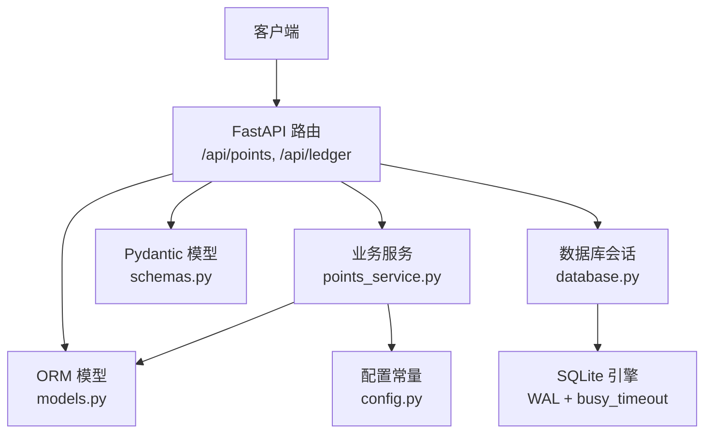
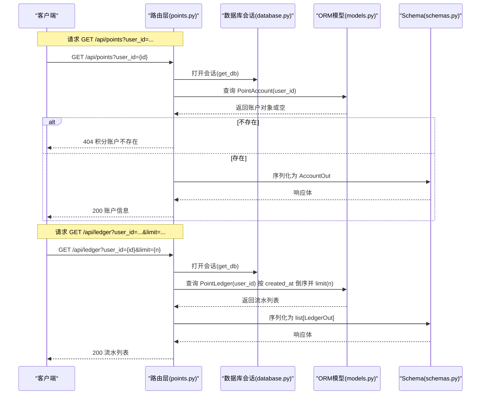
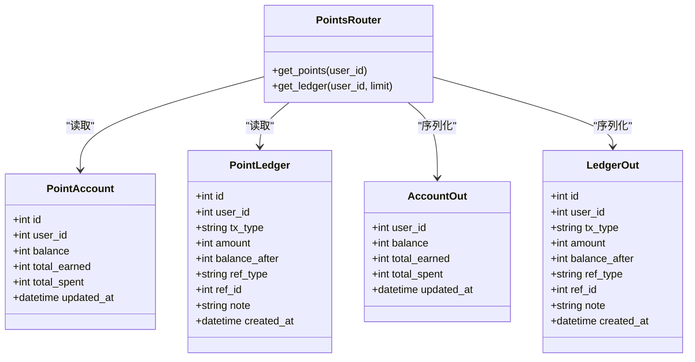

# 积分操作接口

<cite>
**本文引用的文件**
- [points.py](file://points-system/backend/app/routers/points.py)
- [points_service.py](file://points-system/backend/app/services/points_service.py)
- [models.py](file://points-system/backend/app/models.py)
- [schemas.py](file://points-system/backend/app/schemas.py)
- [database.py](file://points-system/backend/app/database.py)
- [config.py](file://points-system/backend/app/config.py)
</cite>

## 目录
1. [简介](#简介)
2. [项目结构](#项目结构)
3. [核心组件](#核心组件)
4. [架构总览](#架构总览)
5. [详细接口说明](#详细接口说明)
6. [依赖关系分析](#依赖关系分析)
7. [性能与一致性](#性能与一致性)
8. [故障排查指南](#故障排查指南)
9. [结论](#结论)

## 简介
本文件为“积分兑换系统”的“积分操作模块”API文档，聚焦以下能力：
- 获取用户积分账户信息（余额、累计收支、更新时间等）
- 查询积分变动流水（支持分页参数 limit）

同时补充积分计算逻辑、并发处理机制与数据一致性保证，并提供调用示例与错误处理方案。

## 项目结构
后端采用 FastAPI + SQLAlchemy + SQLite 的技术栈。与积分操作相关的核心文件如下：
- 路由层：定义 /api/points 与 /api/ledger 两个 GET 接口
- 服务层：封装积分业务规则（打卡、兑换等），提供事务内原子更新
- 模型层：定义积分账户、流水、打卡、奖品、兑换等表结构
- Schema 层：定义请求/响应数据结构
- 数据库层：SQLite 引擎、会话管理、WAL 模式与忙等待配置
- 配置层：打卡基础积分、连续奖励、兑换比例等常量

图表来源
- [points.py:1-28](file://points-system/backend/app/routers/points.py#L1-L28)
- [points_service.py:1-146](file://points-system/backend/app/services/points_service.py#L1-L146)
- [models.py:1-151](file://points-system/backend/app/models.py#L1-L151)
- [schemas.py:1-147](file://points-system/backend/app/schemas.py#L1-L147)
- [database.py:1-39](file://points-system/backend/app/database.py#L1-L39)
- [config.py:1-17](file://points-system/backend/app/config.py#L1-L17)

章节来源
- [points.py:1-28](file://points-system/backend/app/routers/points.py#L1-L28)
- [points_service.py:1-146](file://points-system/backend/app/services/points_service.py#L1-L146)
- [models.py:1-151](file://points-system/backend/app/models.py#L1-L151)
- [schemas.py:1-147](file://points-system/backend/app/schemas.py#L1-L147)
- [database.py:1-39](file://points-system/backend/app/database.py#L1-L39)
- [config.py:1-17](file://points-system/backend/app/config.py#L1-L17)

## 核心组件
- 路由层
  - GET /api/points：根据 user_id 返回积分账户信息
  - GET /api/ledger：根据 user_id 和 limit 返回最近 N 条积分流水（按时间倒序）
- 服务层
  - 提供积分相关的事务性业务方法（如打卡、兑换），确保余额与库存的一致性
- 模型层
  - PointAccount：积分账户（余额、累计获得、累计支出、抽奖券数量、更新时间）
  - PointLedger：积分流水（类型、金额、变更后余额、关联业务、备注、时间）
  - CheckIn、Prize、Redemption 等：支撑积分变动的业务实体
- Schema 层
  - AccountOut、LedgerOut：用于序列化响应体
- 数据库层
  - SQLite 引擎，开启 WAL 日志与 busy_timeout，降低并发写冲突
- 配置层
  - 打卡基础积分、连续奖励、每多少天发放一次奖励、积分换券比例等

章节来源
- [points.py:10-27](file://points-system/backend/app/routers/points.py#L10-L27)
- [points_service.py:18-91](file://points-system/backend/app/services/points_service.py#L18-L91)
- [models.py:20-48](file://points-system/backend/app/models.py#L20-L48)
- [schemas.py:18-35](file://points-system/backend/app/schemas.py#L18-L35)
- [database.py:11-23](file://points-system/backend/app/database.py#L11-L23)
- [config.py:1-17](file://points-system/backend/app/config.py#L1-L17)

## 架构总览
下图展示 GET /api/points 与 GET /api/ledger 的请求路径与数据流向。

图表来源
- [points.py:10-27](file://points-system/backend/app/routers/points.py#L10-L27)
- [database.py:28-33](file://points-system/backend/app/database.py#L28-L33)
- [models.py:20-48](file://points-system/backend/app/models.py#L20-L48)
- [schemas.py:18-35](file://points-system/backend/app/schemas.py#L18-L35)

## 详细接口说明

### 通用约定
- 协议与路径
  - 基础路径：/api
  - 方法：GET
- 认证与鉴权
  - 当前实现未包含鉴权中间件；实际生产建议增加身份校验与权限控制
- 参数传递
  - 通过查询参数传递 user_id 与 limit
- 字符集与时区
  - 时间字段使用 UTC 时间存储与返回

#### 接口一：获取积分账户信息
- 端点
  - GET /api/points
- 请求参数
  - user_id: 整数，必填
- 成功响应
  - 状态码：200
  - 响应体：AccountOut
    - user_id: 整数
    - balance: 整数，当前可用积分
    - total_earned: 整数，累计获得积分
    - total_spent: 整数，累计支出积分
    - updated_at: 时间戳，账户最后更新时间
- 失败响应
  - 404：积分账户不存在
- 业务规则
  - 若用户无积分账户，直接返回 404
  - 账户余额由所有收入与支出流水汇总得到（见数据一致性说明）

章节来源
- [points.py:10-15](file://points-system/backend/app/routers/points.py#L10-L15)
- [schemas.py:18-24](file://points-system/backend/app/schemas.py#L18-L24)
- [models.py:20-33](file://points-system/backend/app/models.py#L20-L33)

#### 接口二：查询积分变动流水
- 端点
  - GET /api/ledger
- 请求参数
  - user_id: 整数，必填
  - limit: 整数，可选，默认 50，表示返回最近 N 条流水
- 成功响应
  - 状态码：200
  - 响应体：list[LedgerOut]
    - id: 整数，流水主键
    - user_id: 整数
    - tx_type: 字符串，枚举值 earn（收入）、spend（支出）
    - amount: 整数，本次变动数量（正数）
    - balance_after: 整数，变动后的余额
    - ref_type: 字符串，可选，关联业务类型（如 checkin、redemption）
    - ref_id: 整数，可选，关联业务主键
    - note: 字符串，可选，备注
    - created_at: 时间戳，记录创建时间
- 排序规则
  - 按 created_at 降序排列
- 分页策略
  - 仅支持 limit 限制返回数量；如需完整分页（offset/page），可在路由层扩展
- 失败响应
  - 正常情况不会因用户无流水而报错，将返回空数组

章节来源
- [points.py:18-27](file://points-system/backend/app/routers/points.py#L18-L27)
- [schemas.py:26-35](file://points-system/backend/app/schemas.py#L26-L35)
- [models.py:35-48](file://points-system/backend/app/models.py#L35-L48)

### 积分计算逻辑
- 打卡获得积分
  - 基础积分：POINTS_PER_CHECKIN
  - 连续奖励：当 streak % STREAK_BONUS_EVERY == 0 时，额外获得 POINTS_STREAK_BONUS
  - 本次获得 = 基础积分 + 连续奖励
  - 连续天数 streak 的计算：若昨天已打卡且日期差为 1 天，则 streak = 昨日 streak + 1；否则重置为 1
- 兑换消耗积分
  - 在事务内扣减账户余额与奖品库存，并写入一条 spend 流水
- 参考实现位置
  - 打卡逻辑与连续奖励计算：[points_service.py:27-91](file://points-system/backend/app/services/points_service.py#L27-L91)
  - 兑换逻辑与余额扣减：[points_service.py:94-146](file://points-system/backend/app/services/points_service.py#L94-L146)
  - 配置常量：[config.py:1-17](file://points-system/backend/app/config.py#L1-L17)

章节来源
- [points_service.py:27-91](file://points-system/backend/app/services/points_service.py#L27-L91)
- [points_service.py:94-146](file://points-system/backend/app/services/points_service.py#L94-L146)
- [config.py:1-17](file://points-system/backend/app/config.py#L1-L17)

### 并发处理机制与数据一致性
- 事务边界
  - 所有读-改-写操作在同一 SQLAlchemy Session 事务内完成，统一 commit；异常统一 rollback，避免半更新
- 防重复打卡
  - 业务层先查后写，数据库层通过 (user_id, check_date) 唯一约束兜底；并发场景下以 IntegrityError 捕获并返回 409
- 兑换一致性
  - 同一事务内同步扣减库存与积分，并写入兑换记录与支出流水，保证「库存-1」与「积分-N」原子性
- 数据库级优化
  - SQLite 开启 WAL 日志与 busy_timeout，缩小竞态窗口，提升并发读性能
- 参考实现位置
  - 事务与异常处理：[points_service.py:77-83](file://points-system/backend/app/services/points_service.py#L77-L83)
  - 唯一约束与并发兜底：[models.py:62-65](file://points-system/backend/app/models.py#L62-L65)
  - SQLite 并发安全配置：[database.py:16-23](file://points-system/backend/app/database.py#L16-L23)

章节来源
- [points_service.py:77-83](file://points-system/backend/app/services/points_service.py#L77-L83)
- [models.py:62-65](file://points-system/backend/app/models.py#L62-L65)
- [database.py:16-23](file://points-system/backend/app/database.py#L16-L23)

### 调用示例
以下为常见调用示例（以 curl 为例）：
- 获取积分账户信息
  - 请求：curl "http://localhost:8000/api/points?user_id=1"
  - 成功响应示例（字段说明见上文）：
    - { "user_id": 1, "balance": 120, "total_earned": 200, "total_spent": 80, "updated_at": "2025-01-01T12:34:56Z" }
  - 失败响应示例（账户不存在）：
    - HTTP 404，detail: "积分账户不存在"
- 查询积分流水
  - 请求：curl "http://localhost:8000/api/ledger?user_id=1&limit=10"
  - 成功响应示例（数组元素字段说明见上文）：
    - [ { "id": 10, "tx_type": "earn", "amount": 10, "balance_after": 120, "ref_type": "checkin", "ref_id": 5, "note": "...", "created_at": "..." }, ... ]

注意：以上示例仅为格式示意，具体字段取值取决于实际数据。

### 错误处理方案
- 404 积分账户不存在
  - 触发条件：GET /api/points 查询不到对应 user_id 的账户
  - 处理建议：前端提示用户注册或初始化账户
- 409 今日已打卡
  - 触发条件：重复打卡（业务层先查后写 + 唯一约束兜底）
  - 处理建议：前端提示用户次日再试
- 400 积分不足/奖品无效
  - 触发条件：兑换前校验失败（有效期、库存、余额）
  - 处理建议：前端提示用户调整兑换数量或更换奖品
- 5xx 数据库异常
  - 触发条件：SQLite 并发冲突或连接问题
  - 处理建议：重试机制与降级策略（限流、退避）

章节来源
- [points.py:12-15](file://points-system/backend/app/routers/points.py#L12-L15)
- [points_service.py:77-83](file://points-system/backend/app/services/points_service.py#L77-L83)
- [points_service.py:94-146](file://points-system/backend/app/services/points_service.py#L94-L146)

## 依赖关系分析
- 路由层依赖
  - 依赖数据库会话 get_db
  - 依赖 ORM 模型 PointAccount、PointLedger
  - 依赖 Pydantic 模型 AccountOut、LedgerOut
- 服务层依赖
  - 依赖 ORM 模型与配置常量
  - 负责事务边界与业务规则
- 数据库层依赖
  - SQLite 引擎，WAL 模式与 busy_timeout 配置
- 类关系图（代码级别）

图表来源
- [points.py:10-27](file://points-system/backend/app/routers/points.py#L10-L27)
- [models.py:20-48](file://points-system/backend/app/models.py#L20-L48)
- [schemas.py:18-35](file://points-system/backend/app/schemas.py#L18-L35)

章节来源
- [points.py:10-27](file://points-system/backend/app/routers/points.py#L10-L27)
- [models.py:20-48](file://points-system/backend/app/models.py#L20-L48)
- [schemas.py:18-35](file://points-system/backend/app/schemas.py#L18-L35)

## 性能与一致性
- 读性能
  - ledger 接口按 created_at 倒序并 limit，建议在 created_at 上建立索引（模型中已声明索引）
- 写一致性
  - 事务内原子更新，结合唯一约束与 IntegrityError 捕获，防止重复打卡与超卖
- 并发优化
  - SQLite WAL 模式减少读阻塞，busy_timeout 降低写冲突失败率
- 可扩展性
  - 如需更高并发与强一致，可迁移至 PostgreSQL，并在关键行加悲观锁（with_for_update）

章节来源
- [models.py:47](file://points-system/backend/app/models.py#L47)
- [database.py:16-23](file://points-system/backend/app/database.py#L16-L23)
- [points_service.py:77-83](file://points-system/backend/app/services/points_service.py#L77-L83)

## 故障排查指南
- 常见问题
  - 404 账户不存在：确认 user_id 是否正确，是否已完成账户初始化
  - 409 重复打卡：检查是否已在同一天多次提交打卡
  - 400 积分不足/奖品无效：核对奖品有效期、库存与用户余额
- 定位步骤
  - 查看路由层抛出的异常与状态码
  - 检查服务层事务提交与回滚路径
  - 核查数据库层 WAL 与 busy_timeout 配置是否生效
- 参考实现位置
  - 路由异常抛出：[points.py:12-15](file://points-system/backend/app/routers/points.py#L12-L15)
  - 事务与异常处理：[points_service.py:77-83](file://points-system/backend/app/services/points_service.py#L77-L83)
  - 数据库配置：[database.py:16-23](file://points-system/backend/app/database.py#L16-L23)

章节来源
- [points.py:12-15](file://points-system/backend/app/routers/points.py#L12-L15)
- [points_service.py:77-83](file://points-system/backend/app/services/points_service.py#L77-L83)
- [database.py:16-23](file://points-system/backend/app/database.py#L16-L23)

## 结论
- GET /api/points 与 GET /api/ledger 提供了基础的积分账户信息与流水查询能力
- 积分计算遵循明确的规则（基础积分 + 连续奖励），并通过事务与唯一约束保障一致性
- 在生产环境建议增加鉴权、完善分页（offset/page）、引入缓存与监控告警，以提升安全性与可观测性