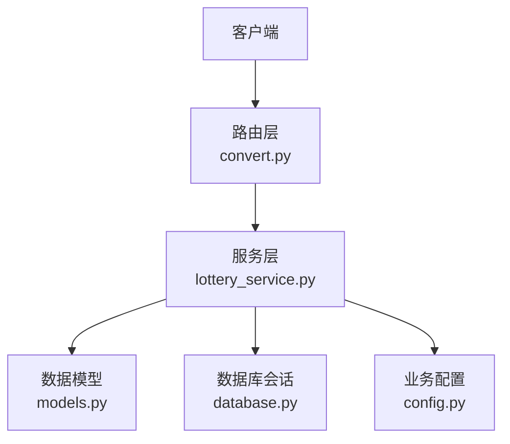
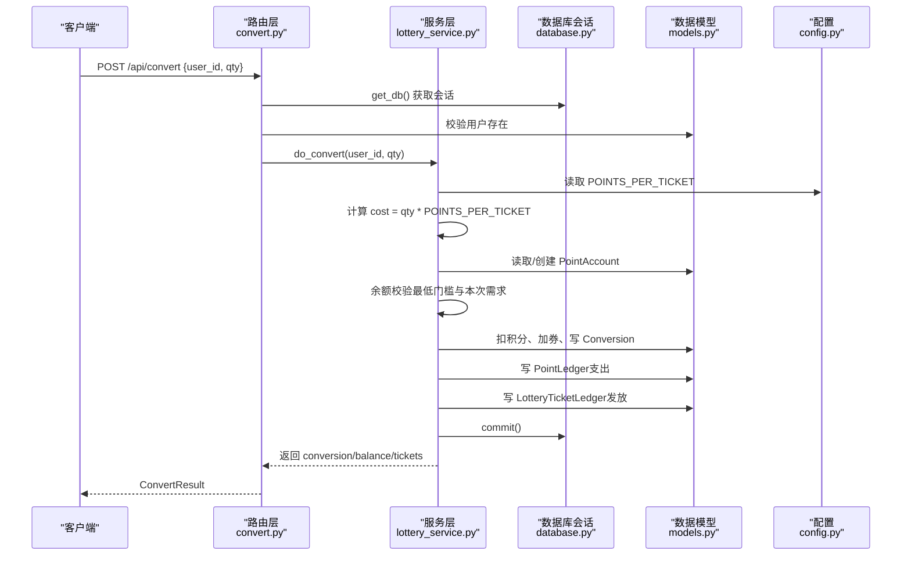
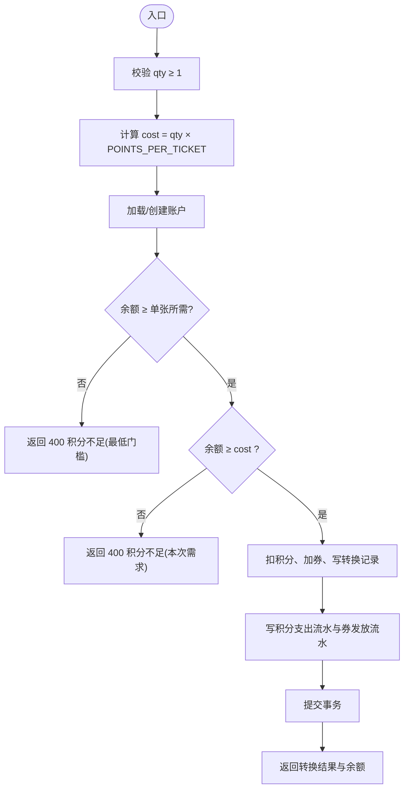
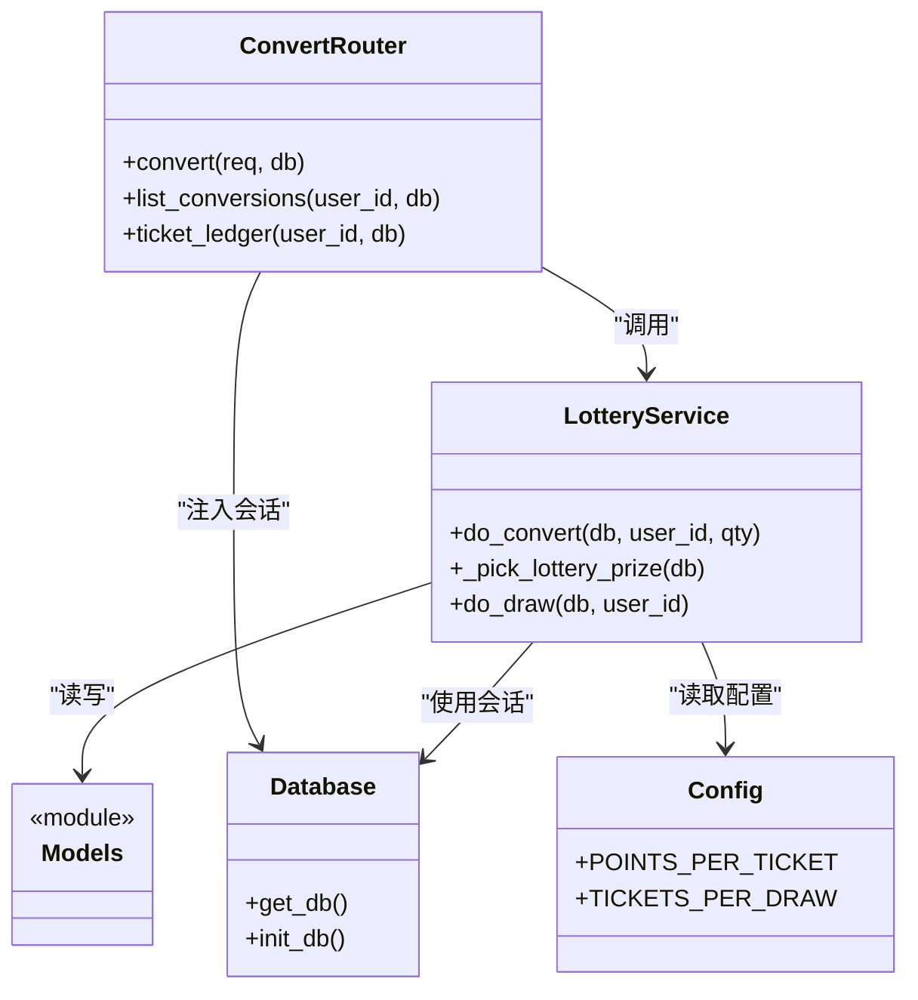

# 积分转换接口

<cite>
**本文引用的文件**   
- [convert.py](file://points-system/backend/app/routers/convert.py)
- [lottery_service.py](file://points-system/backend/app/services/lottery_service.py)
- [models.py](file://points-system/backend/app/models.py)
- [schemas.py](file://points-system/backend/app/schemas.py)
- [database.py](file://points-system/backend/app/database.py)
- [config.py](file://points-system/backend/app/config.py)
</cite>

## 目录
1. [简介](#简介)
2. [项目结构](#项目结构)
3. [核心组件](#核心组件)
4. [架构总览](#架构总览)
5. [详细组件分析](#详细组件分析)
6. [依赖关系分析](#依赖关系分析)
7. [性能与一致性](#性能与一致性)
8. [故障排查指南](#故障排查指南)
9. [结论](#结论)
10. [附录：API 定义](#附录api-定义)

## 简介
本文件为“积分兑换系统”的“积分转换（积分换抽奖券）”功能提供完整的 API 文档。内容覆盖：
- 接口清单与请求/响应模型
- 业务规则：汇率、最小单位、手续费、余额校验
- 事务与原子性保证
- 转换历史查询与统计能力
- 失败补偿与异常处理策略
- 端到端调用示例与性能优化建议

## 项目结构
与积分转换相关的后端代码位于 points-system/backend/app 下，关键文件如下：
- 路由层：routers/convert.py
- 服务层：services/lottery_service.py
- 数据模型：models.py
- 请求/响应模型：schemas.py
- 数据库连接与初始化：database.py
- 业务配置：config.py

图表来源
- [convert.py:1-64](file://points-system/backend/app/routers/convert.py#L1-L64)
- [lottery_service.py:1-174](file://points-system/backend/app/services/lottery_service.py#L1-L174)
- [models.py:1-151](file://points-system/backend/app/models.py#L1-L151)
- [database.py:1-39](file://points-system/backend/app/database.py#L1-L39)
- [config.py:1-17](file://points-system/backend/app/config.py#L1-L17)

章节来源
- [convert.py:1-64](file://points-system/backend/app/routers/convert.py#L1-L64)
- [lottery_service.py:1-174](file://points-system/backend/app/services/lottery_service.py#L1-L174)
- [models.py:1-151](file://points-system/backend/app/models.py#L1-L151)
- [schemas.py:1-147](file://points-system/backend/app/schemas.py#L1-L147)
- [database.py:1-39](file://points-system/backend/app/database.py#L1-L39)
- [config.py:1-17](file://points-system/backend/app/config.py#L1-L17)

## 核心组件
- 路由层 convert.py
  - 暴露 /api/convert 与 /api/conversions、/api/ticket-ledger 等接口
  - 负责参数校验、用户存在性检查、调用服务层并组装响应
- 服务层 lottery_service.py
  - 实现 do_convert 核心逻辑：计算成本、余额校验、账户更新、落库与流水记录
  - 使用进程内锁 _account_lock 串行化同一进程的并发访问，避免 SQLite 丢失更新
- 数据模型 models.py
  - Conversion：转换主记录
  - PointLedger：积分流水
  - LotteryTicketLedger：抽奖券流水
  - PointAccount：积分账户（含 balance、total_spent、lottery_tickets）
- 请求/响应模型 schemas.py
  - ConvertRequest、ConvertResult、ConversionOut、LotteryTicketLedgerOut 等
- 数据库 database.py
  - SQLite + WAL + busy_timeout，SessionLocal 提供事务会话
- 配置 config.py
  - POINTS_PER_TICKET：每张抽奖券所需积分
  - TICKETS_PER_DRAW：每次抽奖消耗券数（与转换相关的是前者）

章节来源
- [convert.py:1-64](file://points-system/backend/app/routers/convert.py#L1-L64)
- [lottery_service.py:1-174](file://points-system/backend/app/services/lottery_service.py#L1-L174)
- [models.py:1-151](file://points-system/backend/app/models.py#L1-L151)
- [schemas.py:1-147](file://points-system/backend/app/schemas.py#L1-L147)
- [database.py:1-39](file://points-system/backend/app/database.py#L1-L39)
- [config.py:1-17](file://points-system/backend/app/config.py#L1-L17)

## 架构总览
积分转换从 HTTP 请求进入路由层，路由层进行基础校验后委托服务层完成业务处理；服务层在同一 SQLAlchemy Session 事务中完成账户扣减、券发放与流水写入，并通过进程内锁与数据库 WAL 模式保障一致性与并发安全。

图表来源
- [convert.py:11-28](file://points-system/backend/app/routers/convert.py#L11-L28)
- [lottery_service.py:30-98](file://points-system/backend/app/services/lottery_service.py#L30-L98)
- [models.py:20-123](file://points-system/backend/app/models.py#L20-L123)
- [database.py:28-33](file://points-system/backend/app/database.py#L28-L33)
- [config.py:12-13](file://points-system/backend/app/config.py#L12-L13)

## 详细组件分析

### 接口：POST /api/convert（积分兑换抽奖券）
- 功能说明
  - 将指定数量的积分按固定汇率兑换为抽奖券，同时记录积分支出流水与抽奖券发放流水，并返回兑换结果与最新余额。
- 请求体
  - user_id: 整数，必填
  - qty: 整数，≥1，必填
- 响应体
  - conversion: 转换记录（id、user_id、qty、cost_points、status、created_at）
  - balance: 兑换后的积分余额
  - lottery_tickets: 兑换后的抽奖券数量
- 业务规则
  - 汇率：POINTS_PER_TICKET（每 1 张券所需积分），由配置控制
  - 最小转换单位：1 张券
  - 手续费：当前未实现额外手续费，成本=qty×POINTS_PER_TICKET
  - 余额校验：需满足“至少能换 1 张”和“本次兑换足够”的双重校验
- 错误码
  - 404：用户不存在
  - 400：qty 非法或积分不足
  - 409：并发冲突（IntegrityError）
  - 其他：HTTPException 透传
- 事务与原子性
  - 所有读改写在同一 Session 事务内，成功提交，异常回滚
  - 进程内锁 _account_lock 串行化同进程并发访问，避免 SQLite 丢失更新
- 幂等性
  - 当前未实现幂等键；重复提交可能产生多条转换记录
- 审计与可追溯
  - 生成两条流水：PointLedger（spend）、LotteryTicketLedger（issue），均关联 ref_type="convert" 与 ref_id=conversion.id

图表来源
- [lottery_service.py:30-98](file://points-system/backend/app/services/lottery_service.py#L30-L98)
- [config.py:12-13](file://points-system/backend/app/config.py#L12-L13)

章节来源
- [convert.py:11-28](file://points-system/backend/app/routers/convert.py#L11-L28)
- [lottery_service.py:30-98](file://points-system/backend/app/services/lottery_service.py#L30-L98)
- [schemas.py:90-108](file://points-system/backend/app/schemas.py#L90-L108)
- [models.py:20-123](file://points-system/backend/app/models.py#L20-L123)
- [config.py:12-13](file://points-system/backend/app/config.py#L12-L13)

### 接口：GET /api/conversions（转换历史记录）
- 功能说明
  - 按用户维度查询该用户的积分转换历史，按创建时间倒序返回。
- 查询参数
  - user_id: 整数，必填
- 响应体
  - 列表项：ConversionOut（id、user_id、qty、cost_points、status、created_at）
- 过滤与排序
  - 仅支持按 user_id 筛选
  - 默认按 created_at 降序
- 扩展建议
  - 可按时间范围、状态、最小/最大 cost_points 等条件扩展

章节来源
- [convert.py:31-45](file://points-system/backend/app/routers/convert.py#L31-L45)
- [schemas.py:95-102](file://points-system/backend/app/schemas.py#L95-L102)
- [models.py:96-108](file://points-system/backend/app/models.py#L96-L108)

### 接口：GET /api/ticket-ledger（抽奖券流水）
- 功能说明
  - 按用户维度查询抽奖券流水，用于对账与审计。
- 查询参数
  - user_id: 整数，必填
- 响应体
  - 列表项：LotteryTicketLedgerOut（id、user_id、tx_type、amount、balance_after、ref_type、ref_id、note、created_at）
- 用途
  - 追踪券的发放(issue)与消耗(consume)，结合 ref_type/ref_id 定位业务事件

章节来源
- [convert.py:48-63](file://points-system/backend/app/routers/convert.py#L48-L63)
- [schemas.py:110-120](file://points-system/backend/app/schemas.py#L110-L120)
- [models.py:110-123](file://points-system/backend/app/models.py#L110-L123)

## 依赖关系分析
- 路由层依赖服务层与数据库会话
- 服务层依赖数据模型与配置
- 数据库层提供 SQLite 引擎与会话管理
- 配置集中管理汇率与阈值

图表来源
- [convert.py:1-64](file://points-system/backend/app/routers/convert.py#L1-L64)
- [lottery_service.py:1-174](file://points-system/backend/app/services/lottery_service.py#L1-L174)
- [models.py:1-151](file://points-system/backend/app/models.py#L1-L151)
- [database.py:1-39](file://points-system/backend/app/database.py#L1-L39)
- [config.py:1-17](file://points-system/backend/app/config.py#L1-L17)

章节来源
- [convert.py:1-64](file://points-system/backend/app/routers/convert.py#L1-L64)
- [lottery_service.py:1-174](file://points-system/backend/app/services/lottery_service.py#L1-L174)
- [models.py:1-151](file://points-system/backend/app/models.py#L1-L151)
- [database.py:1-39](file://points-system/backend/app/database.py#L1-L39)
- [config.py:1-17](file://points-system/backend/app/config.py#L1-L17)

## 性能与一致性
- 事务与原子性
  - 所有变更在单一 Session 事务内完成，commit 前全部生效，异常时 rollback，确保「积分扣减」与「券发放」要么同时成功、要么同时失败
- 并发控制
  - 进程内锁 _account_lock 串行化同进程并发访问，避免 SQLite 下的丢失更新
  - 多进程/多实例部署建议使用数据库悲观锁（如 with_for_update）替代进程内锁
- 数据库特性
  - SQLite WAL 模式提升并发读性能
  - busy_timeout 降低写忙等待导致的失败概率
- 索引与查询
  - 转换与流水表已建立常用字段索引（如 user_id、created_at），利于按用户与时间范围查询
- 可扩展点
  - 批量转换：可在服务层增加批量接口，减少往返开销
  - 分页：历史与流水接口可增加分页参数
  - 缓存：热点用户账户余额可引入本地缓存，但需注意失效策略与一致性

章节来源
- [lottery_service.py:23-27](file://points-system/backend/app/services/lottery_service.py#L23-L27)
- [database.py:16-23](file://points-system/backend/app/database.py#L16-L23)
- [models.py:40-48](file://points-system/backend/app/models.py#L40-L48)
- [models.py:110-123](file://points-system/backend/app/models.py#L110-L123)

## 故障排查指南
- 常见错误
  - 404 用户不存在：确认 user_id 有效且已注册
  - 400 积分不足：检查 POINTS_PER_TICKET 与用户余额；注意最低门槛校验
  - 409 并发冲突：重试机制；若多实例部署，考虑数据库级悲观锁
- 日志与审计
  - 通过 PointLedger 与 LotteryTicketLedger 的 ref_type="convert" 与 ref_id 定位具体转换记录
  - 核对 balance_after 与累计收支字段以进行对账
- 补偿策略
  - 当前未实现自动补偿；建议在应用层增加幂等键（如 user_id+timestamp+nonce）与重试队列，失败时人工介入核对流水并补发
- 数据一致性验证
  - 校验 account.balance 与 PointLedger 汇总是否一致
  - 校验 account.lottery_tickets 与 LotteryTicketLedger 汇总是否一致

章节来源
- [convert.py:11-28](file://points-system/backend/app/routers/convert.py#L11-L28)
- [lottery_service.py:30-98](file://points-system/backend/app/services/lottery_service.py#L30-L98)
- [models.py:35-48](file://points-system/backend/app/models.py#L35-L48)
- [models.py:110-123](file://points-system/backend/app/models.py#L110-L123)

## 结论
本接口实现了“积分换抽奖券”的核心流程，具备明确的业务规则、清晰的审计流水与较强的并发一致性保障。后续可在以下方面增强：
- 增加手续费与动态汇率配置
- 完善幂等与补偿机制
- 扩展历史与流水的分页与多维筛选
- 在多实例部署场景迁移至数据库悲观锁

[本节不直接分析具体文件]

## 附录：API 定义

### 通用约定
- 路径前缀：/api
- 认证：当前未实现鉴权，生产环境应增加鉴权中间件
- 错误格式：HTTPException(detail=...)

### POST /api/convert
- 描述：积分兑换抽奖券
- 请求体
  - user_id: int
  - qty: int (≥1)
- 响应体
  - conversion: ConversionOut
  - balance: int
  - lottery_tickets: int
- 业务规则
  - 汇率：POINTS_PER_TICKET
  - 最小单位：1 张券
  - 手续费：无
  - 余额校验：最低门槛与本次需求双重校验
- 错误码
  - 404：用户不存在
  - 400：参数或余额校验失败
  - 409：并发冲突

章节来源
- [convert.py:11-28](file://points-system/backend/app/routers/convert.py#L11-L28)
- [schemas.py:90-108](file://points-system/backend/app/schemas.py#L90-L108)
- [lottery_service.py:30-98](file://points-system/backend/app/services/lottery_service.py#L30-L98)
- [config.py:12-13](file://points-system/backend/app/config.py#L12-L13)

### GET /api/conversions
- 描述：查询用户积分转换历史
- 查询参数
  - user_id: int
- 响应体
  - list[ConversionOut]
- 排序
  - created_at 降序

章节来源
- [convert.py:31-45](file://points-system/backend/app/routers/convert.py#L31-L45)
- [schemas.py:95-102](file://points-system/backend/app/schemas.py#L95-L102)

### GET /api/ticket-ledger
- 描述：查询用户抽奖券流水
- 查询参数
  - user_id: int
- 响应体
  - list[LotteryTicketLedgerOut]
- 用途
  - 对账与审计

章节来源
- [convert.py:48-63](file://points-system/backend/app/routers/convert.py#L48-L63)
- [schemas.py:110-120](file://points-system/backend/app/schemas.py#L110-L120)