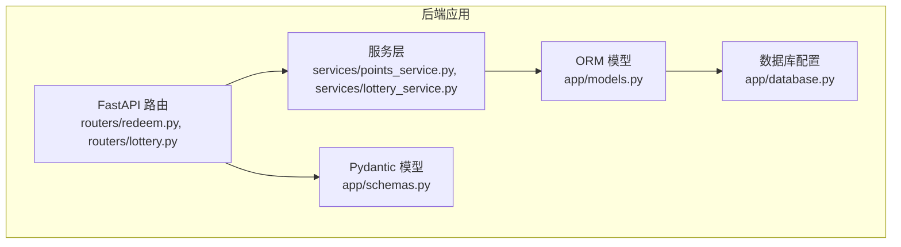
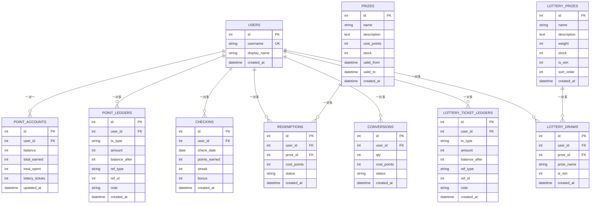
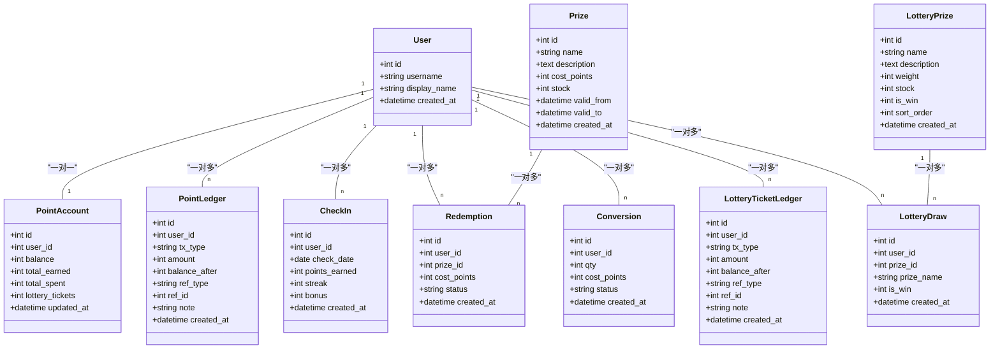
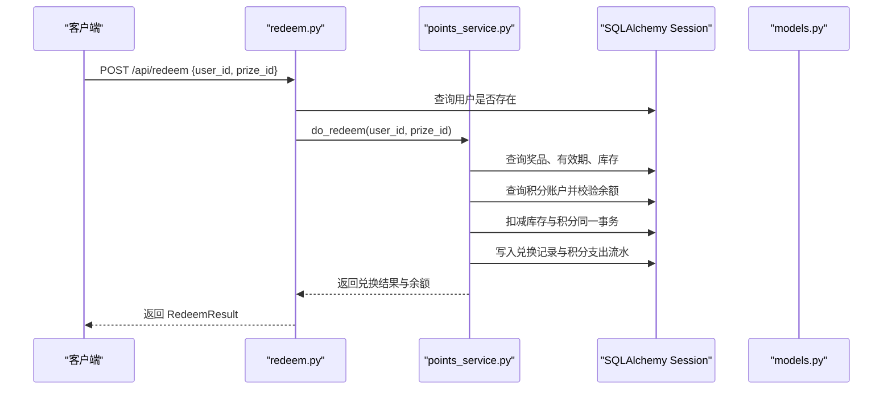
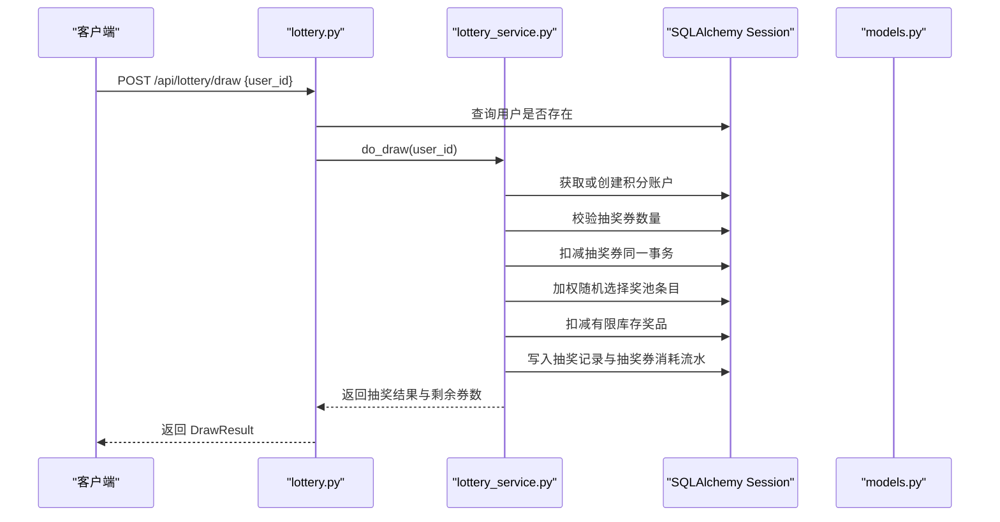
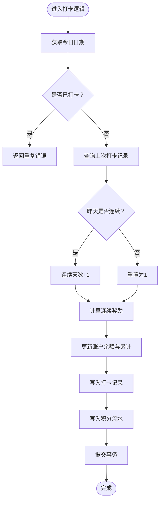
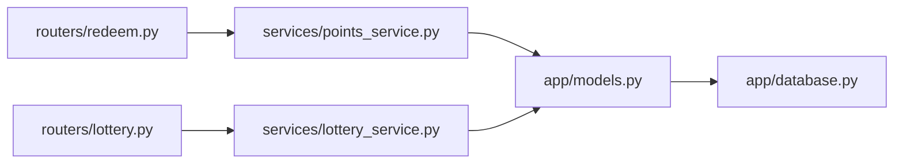
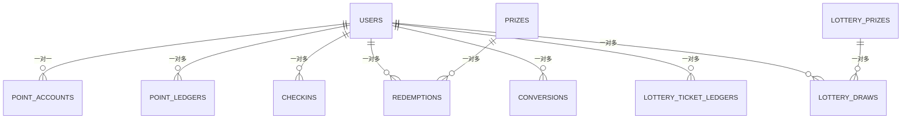

# 数据模型设计

<cite>
**本文引用的文件**   
- [models.py](file://points-system/backend/app/models.py)
- [schemas.py](file://points-system/backend/app/schemas.py)
- [database.py](file://points-system/backend/app/database.py)
- [points_service.py](file://points-system/backend/app/services/points_service.py)
- [lottery_service.py](file://points-system/backend/app/services/lottery_service.py)
- [redeem.py](file://points-system/backend/app/routers/redeem.py)
- [lottery.py](file://points-system/backend/app/routers/lottery.py)
</cite>

## 目录
1. [引言](#引言)
2. [项目结构](#项目结构)
3. [核心组件](#核心组件)
4. [架构总览](#架构总览)
5. [详细组件分析](#详细组件分析)
6. [依赖关系分析](#依赖关系分析)
7. [性能与一致性考虑](#性能与一致性考虑)
8. [故障排查指南](#故障排查指南)
9. [结论](#结论)
10. [附录](#附录)

## 引言
本文件面向积分兑换系统的数据模型设计与实现，聚焦以下目标：
- 数据库表结构设计：用户、积分账户、积分流水、打卡记录、奖品、兑换记录、积分兑换抽奖券记录、抽奖券流水、抽奖奖池、抽奖记录等实体的字段定义、数据类型、约束条件。
- 实体关系映射：外键约束、唯一性约束、索引策略。
- Pydantic 数据验证模型：请求/响应数据结构规范。
- 数据迁移与版本管理：当前方案与演进建议。
- 数据完整性保证机制：事务、并发控制、对账字段设计。
- ER 关系图与 SQL 建表语句：帮助开发者理解数据存储结构与访问模式。

## 项目结构
本仓库的积分兑换系统后端位于 points-system/backend，核心数据模型与校验模型分别位于 models.py 与 schemas.py；数据库连接与初始化在 database.py；业务逻辑在 services 下；API 路由在 routers 下。

图表来源
- [redeem.py:1-52](file://points-system/backend/app/routers/redeem.py#L1-L52)
- [lottery.py:1-55](file://points-system/backend/app/routers/lottery.py#L1-L55)
- [points_service.py:1-146](file://points-system/backend/app/services/points_service.py#L1-L146)
- [lottery_service.py:1-174](file://points-system/backend/app/services/lottery_service.py#L1-L174)
- [models.py:1-151](file://points-system/backend/app/models.py#L1-L151)
- [database.py:1-39](file://points-system/backend/app/database.py#L1-L39)
- [schemas.py:1-147](file://points-system/backend/app/schemas.py#L1-L147)

章节来源
- [models.py:1-151](file://points-system/backend/app/models.py#L1-L151)
- [schemas.py:1-147](file://points-system/backend/app/schemas.py#L1-L147)
- [database.py:1-39](file://points-system/backend/app/database.py#L1-L39)

## 核心组件
本节从数据模型角度梳理核心实体及其职责：
- 用户（users）：系统主体，唯一用户名。
- 积分账户（point_accounts）：每个用户一行，维护余额、累计收支、抽奖券数量。
- 积分流水（point_ledgers）：每笔收入/支出落一条，含变动后余额用于对账。
- 打卡记录（checkins）：每日一次打卡，防重约束保障幂等。
- 奖品（prizes）：可兑换标的，含库存与有效期。
- 兑换记录（redemptions）：每次成功兑换生成一条，快照消耗积分。
- 积分兑换抽奖券记录（conversions）：积分换券的记录，快照消耗积分。
- 抽奖券流水（lottery_ticket_ledgers）：发放/消耗流水，含变动后余额。
- 抽奖奖池（lottery_prizes）：按权重随机，支持不限量。
- 抽奖记录（lottery_draws）：每次抽奖结果记录。

章节来源
- [models.py:10-151](file://points-system/backend/app/models.py#L10-L151)

## 架构总览
下图展示数据模型之间的关联关系与关键约束。

图表来源
- [models.py:10-151](file://points-system/backend/app/models.py#L10-L151)

## 详细组件分析

### 用户与积分账户
- 用户表 users
  - 主键：id（自增整数）
  - 唯一索引：username
  - 普通索引：id
  - 其他字段：display_name、created_at
- 积分账户表 point_accounts
  - 主键：id
  - 唯一外键：user_id → users.id
  - 字段：balance、total_earned、total_spent、lottery_tickets、updated_at
  - 说明：lottery_tickets ≥ 1 即解锁抽奖权限，状态由余额派生，避免冗余状态位不一致。

章节来源
- [models.py:10-32](file://points-system/backend/app/models.py#L10-L32)

### 积分流水与打卡记录
- 积分流水表 point_ledgers
  - 主键：id
  - 外键：user_id → users.id
  - 关键字段：tx_type（earn/spend）、amount、balance_after（对账用）、ref_type、ref_id、note、created_at
  - 索引：user_id、created_at
- 打卡记录表 checkins
  - 主键：id
  - 外键：user_id → users.id
  - 唯一约束：(user_id, check_date) 防止重复打卡
  - 字段：check_date、points_earned、streak、bonus、created_at
  - 索引：user_id、check_date

章节来源
- [models.py:35-66](file://points-system/backend/app/models.py#L35-L66)

### 奖品与兑换记录
- 奖品表 prizes
  - 主键：id
  - 字段：name、description、cost_points、stock、valid_from、valid_to、created_at
- 兑换记录表 redemptions
  - 主键：id
  - 外键：user_id → users.id、prize_id → prizes.id
  - 字段：cost_points（快照）、status、created_at
  - 索引：user_id、prize_id

章节来源
- [models.py:68-94](file://points-system/backend/app/models.py#L68-L94)

### 积分兑换抽奖券与抽奖券流水
- 积分兑换抽奖券记录表 conversions
  - 主键：id
  - 外键：user_id → users.id
  - 字段：qty、cost_points（快照）、status、created_at
  - 索引：user_id
- 抽奖券流水表 lottery_ticket_ledgers
  - 主键：id
  - 外键：user_id → users.id
  - 关键字段：tx_type（issue/consume）、amount、balance_after、ref_type、ref_id、note、created_at
  - 索引：user_id、created_at

章节来源
- [models.py:96-123](file://points-system/backend/app/models.py#L96-L123)

### 抽奖奖池与抽奖记录
- 抽奖奖池表 lottery_prizes
  - 主键：id
  - 字段：name、description、weight、stock（NULL=不限量）、is_win、sort_order、created_at
- 抽奖记录表 lottery_draws
  - 主键：id
  - 外键：user_id → users.id、prize_id → lottery_prizes.id
  - 字段：prize_name、is_win、created_at
  - 索引：user_id、prize_id

章节来源
- [models.py:125-151](file://points-system/backend/app/models.py#L125-L151)

### 类关系图（代码级）

图表来源
- [models.py:10-151](file://points-system/backend/app/models.py#L10-L151)

### API 调用序列（兑换与抽奖）
#### 兑换流程

图表来源
- [redeem.py:11-28](file://points-system/backend/app/routers/redeem.py#L11-L28)
- [points_service.py:94-146](file://points-system/backend/app/services/points_service.py#L94-L146)
- [models.py:68-94](file://points-system/backend/app/models.py#L68-L94)

#### 抽奖流程

图表来源
- [lottery.py:24-37](file://points-system/backend/app/routers/lottery.py#L24-L37)
- [lottery_service.py:117-174](file://points-system/backend/app/services/lottery_service.py#L117-L174)
- [models.py:125-151](file://points-system/backend/app/models.py#L125-L151)

### 复杂逻辑流程图（打卡连续天数计算）

图表来源
- [points_service.py:27-91](file://points-system/backend/app/services/points_service.py#L27-L91)
- [models.py:50-66](file://points-system/backend/app/models.py#L50-L66)

## 依赖关系分析
- 路由层依赖服务层进行业务处理，服务层通过 SQLAlchemy ORM 操作模型，最终持久化到 SQLite。
- 模型间通过外键建立强关联，确保引用完整性。
- 索引策略：
  - 高频查询字段加索引：users.username、point_accounts.user_id、point_ledgers.user_id、point_ledgers.created_at、checkins.user_id、checkins.check_date、redemptions.user_id、redemptions.prize_id、conversions.user_id、lottery_ticket_ledgers.user_id、lottery_ticket_ledgers.created_at、lottery_draws.user_id、lottery_draws.prize_id。
  - 唯一性约束：users.username、point_accounts.user_id、checkins(user_id, check_date)。

图表来源
- [redeem.py:1-52](file://points-system/backend/app/routers/redeem.py#L1-L52)
- [lottery.py:1-55](file://points-system/backend/app/routers/lottery.py#L1-L55)
- [points_service.py:1-146](file://points-system/backend/app/services/points_service.py#L1-L146)
- [lottery_service.py:1-174](file://points-system/backend/app/services/lottery_service.py#L1-L174)
- [models.py:1-151](file://points-system/backend/app/models.py#L1-L151)
- [database.py:1-39](file://points-system/backend/app/database.py#L1-L39)

章节来源
- [models.py:10-151](file://points-system/backend/app/models.py#L10-L151)
- [database.py:1-39](file://points-system/backend/app/database.py#L1-L39)

## 性能与一致性考虑
- 事务与原子性：所有读-改-写在同一 SQLAlchemy Session 事务内完成，统一 commit/rollback，避免半更新。
- 并发控制：
  - 单进程内使用线程锁串行化账户读写，避免 SQLite 下的丢失更新。
  - 数据库层面开启 WAL 日志与 busy_timeout，提升并发读取能力与写忙等待容忍度。
- 对账字段：流水表包含 balance_after，便于离线对账与审计。
- 索引优化：针对高频过滤与排序字段建立索引，减少全表扫描。
- 幂等与防重：打卡通过唯一约束兜底，业务层先查后写，异常捕获 IntegrityError 返回冲突提示。

章节来源
- [database.py:16-23](file://points-system/backend/app/database.py#L16-L23)
- [points_service.py:1-146](file://points-system/backend/app/services/points_service.py#L1-L146)
- [lottery_service.py:1-174](file://points-system/backend/app/services/lottery_service.py#L1-L174)

## 故障排查指南
- 重复打卡
  - 现象：返回冲突错误（HTTP 409）。
  - 原因：业务层检测到当日已有打卡记录，或数据库唯一约束拦截。
  - 定位：检查 checkins 表中 (user_id, check_date) 唯一约束与业务层重复检测逻辑。
- 积分不足
  - 现象：兑换或兑换抽奖券时返回余额不足错误。
  - 原因：账户余额 < 所需积分。
  - 定位：核对 point_accounts.balance 与业务校验逻辑。
- 库存不足或过期
  - 现象：兑换失败，提示库存不足或已过期。
  - 原因：prizes.stock ≤ 0 或不在有效期范围内。
  - 定位：检查 prizes 表的 stock、valid_from、valid_to 字段。
- 抽奖券不足
  - 现象：抽奖失败，提示券不足。
  - 原因：account.lottery_tickets < 所需张数。
  - 定位：核对 account.lottery_tickets 与抽奖服务校验逻辑。
- 并发冲突
  - 现象：返回处理冲突错误（HTTP 409）。
  - 原因：IntegrityError 被捕获，可能由于并发导致的状态不一致。
  - 定位：查看服务层 try/except 分支与数据库约束。

章节来源
- [points_service.py:77-91](file://points-system/backend/app/services/points_service.py#L77-L91)
- [points_service.py:94-146](file://points-system/backend/app/services/points_service.py#L94-L146)
- [lottery_service.py:87-98](file://points-system/backend/app/services/lottery_service.py#L87-L98)
- [lottery_service.py:161-174](file://points-system/backend/app/services/lottery_service.py#L161-L174)

## 结论
本数据模型以“账户+流水”为核心，结合唯一约束与事务原子性，确保积分与抽奖券的一致性与可追溯性。通过合理的索引设计与并发控制策略，系统在 SQLite 环境下具备较好的可用性与稳定性。后续若迁移至 PostgreSQL，可引入悲观锁进一步提升高并发场景的一致性保障。

## 附录

### 数据迁移与版本管理
- 现状：当前未集成 Alembic 等迁移工具，数据库通过 Base.metadata.create_all 自动建表。
- 建议：
  - 引入 Alembic 进行版本化管理，将 create_all 替换为迁移脚本执行。
  - 为每张表与索引编写 up/down 迁移脚本，确保环境一致性与回滚能力。
  - 在 CI/CD 中集成迁移步骤，保证部署前后数据库结构同步。

章节来源
- [database.py:36-39](file://points-system/backend/app/database.py#L36-L39)

### Pydantic 数据验证模型规范
- 请求模型：
  - CheckInRequest：包含 user_id。
  - RedeemRequest：包含 user_id、prize_id。
  - ConvertRequest：包含 user_id、qty（≥1）。
  - DrawRequest：包含 user_id。
- 响应模型：
  - AccountOut：返回账户余额与更新时间。
  - LedgerOut：返回流水明细。
  - CheckInOut：返回打卡结果与连续天数。
  - PrizeOut：返回奖品信息与是否可兑换。
  - RedemptionOut：返回兑换记录与状态。
  - ConversionOut：返回兑换券记录与状态。
  - LotteryTicketLedgerOut：返回抽奖券流水。
  - LotteryPrizeOut：返回奖池配置。
  - LotteryDrawOut：返回抽奖结果。
  - CheckInResult/RedeemResult/ConvertResult/DrowResult：组合型响应，包含业务结果与派生状态。

章节来源
- [schemas.py:6-147](file://points-system/backend/app/schemas.py#L6-L147)

### ER 关系图（再次汇总）

图表来源
- [models.py:10-151](file://points-system/backend/app/models.py#L10-L151)

### SQL 建表语句（参考）
以下为基于模型定义的建表语句参考，具体字段类型与约束应与 models.py 保持一致。

- 用户表
  - CREATE TABLE users (
      id INTEGER PRIMARY KEY AUTOINCREMENT,
      username VARCHAR(64) UNIQUE NOT NULL,
      display_name VARCHAR(128) DEFAULT '',
      created_at DATETIME DEFAULT CURRENT_TIMESTAMP
    );
  - 索引：CREATE INDEX idx_users_id ON users(id);
  - 索引：CREATE INDEX idx_users_username ON users(username);

- 积分账户表
  - CREATE TABLE point_accounts (
      id INTEGER PRIMARY KEY AUTOINCREMENT,
      user_id INTEGER UNIQUE NOT NULL,
      balance INTEGER DEFAULT 0 NOT NULL,
      total_earned INTEGER DEFAULT 0 NOT NULL,
      total_spent INTEGER DEFAULT 0 NOT NULL,
      lottery_tickets INTEGER DEFAULT 0 NOT NULL,
      updated_at DATETIME DEFAULT CURRENT_TIMESTAMP,
      FOREIGN KEY (user_id) REFERENCES users(id)
    );
  - 索引：CREATE INDEX idx_point_accounts_user_id ON point_accounts(user_id);

- 积分流水表
  - CREATE TABLE point_ledgers (
      id INTEGER PRIMARY KEY AUTOINCREMENT,
      user_id INTEGER NOT NULL,
      tx_type VARCHAR(16) NOT NULL,
      amount INTEGER NOT NULL,
      balance_after INTEGER NOT NULL,
      ref_type VARCHAR(32),
      ref_id INTEGER,
      note VARCHAR(255),
      created_at DATETIME DEFAULT CURRENT_TIMESTAMP,
      FOREIGN KEY (user_id) REFERENCES users(id)
    );
  - 索引：CREATE INDEX idx_point_ledgers_user_id ON point_ledgers(user_id);
  - 索引：CREATE INDEX idx_point_ledgers_created_at ON point_ledgers(created_at);

- 打卡记录表
  - CREATE TABLE checkins (
      id INTEGER PRIMARY KEY AUTOINCREMENT,
      user_id INTEGER NOT NULL,
      check_date DATE NOT NULL,
      points_earned INTEGER DEFAULT 0,
      streak INTEGER DEFAULT 1,
      bonus INTEGER DEFAULT 0,
      created_at DATETIME DEFAULT CURRENT_TIMESTAMP,
      FOREIGN KEY (user_id) REFERENCES users(id),
      CONSTRAINT uq_user_check_date UNIQUE (user_id, check_date)
    );
  - 索引：CREATE INDEX idx_checkins_user_id ON checkins(user_id);
  - 索引：CREATE INDEX idx_checkins_check_date ON checkins(check_date);

- 奖品表
  - CREATE TABLE prizes (
      id INTEGER PRIMARY KEY AUTOINCREMENT,
      name VARCHAR(128) NOT NULL,
      description TEXT,
      cost_points INTEGER NOT NULL,
      stock INTEGER DEFAULT 0 NOT NULL,
      valid_from DATETIME,
      valid_to DATETIME,
      created_at DATETIME DEFAULT CURRENT_TIMESTAMP
    );

- 兑换记录表
  - CREATE TABLE redemptions (
      id INTEGER PRIMARY KEY AUTOINCREMENT,
      user_id INTEGER NOT NULL,
      prize_id INTEGER NOT NULL,
      cost_points INTEGER NOT NULL,
      status VARCHAR(16) DEFAULT 'issued',
      created_at DATETIME DEFAULT CURRENT_TIMESTAMP,
      FOREIGN KEY (user_id) REFERENCES users(id),
      FOREIGN KEY (prize_id) REFERENCES prizes(id)
    );
  - 索引：CREATE INDEX idx_redemptions_user_id ON redemptions(user_id);
  - 索引：CREATE INDEX idx_redemptions_prize_id ON redemptions(prize_id);

- 积分兑换抽奖券记录表
  - CREATE TABLE conversions (
      id INTEGER PRIMARY KEY AUTOINCREMENT,
      user_id INTEGER NOT NULL,
      qty INTEGER NOT NULL,
      cost_points INTEGER NOT NULL,
      status VARCHAR(16) DEFAULT 'issued',
      created_at DATETIME DEFAULT CURRENT_TIMESTAMP,
      FOREIGN KEY (user_id) REFERENCES users(id)
    );
  - 索引：CREATE INDEX idx_conversions_user_id ON conversions(user_id);

- 抽奖券流水表
  - CREATE TABLE lottery_ticket_ledgers (
      id INTEGER PRIMARY KEY AUTOINCREMENT,
      user_id INTEGER NOT NULL,
      tx_type VARCHAR(16) NOT NULL,
      amount INTEGER NOT NULL,
      balance_after INTEGER NOT NULL,
      ref_type VARCHAR(32),
      ref_id INTEGER,
      note VARCHAR(255),
      created_at DATETIME DEFAULT CURRENT_TIMESTAMP,
      FOREIGN KEY (user_id) REFERENCES users(id)
    );
  - 索引：CREATE INDEX idx_lottery_ticket_ledgers_user_id ON lottery_ticket_ledgers(user_id);
  - 索引：CREATE INDEX idx_lottery_ticket_ledgers_created_at ON lottery_ticket_ledgers(created_at);

- 抽奖奖池表
  - CREATE TABLE lottery_prizes (
      id INTEGER PRIMARY KEY AUTOINCREMENT,
      name VARCHAR(128) NOT NULL,
      description TEXT,
      weight INTEGER DEFAULT 1 NOT NULL,
      stock INTEGER,
      is_win INTEGER DEFAULT 1,
      sort_order INTEGER DEFAULT 0,
      created_at DATETIME DEFAULT CURRENT_TIMESTAMP
    );

- 抽奖记录表
  - CREATE TABLE lottery_draws (
      id INTEGER PRIMARY KEY AUTOINCREMENT,
      user_id INTEGER NOT NULL,
      prize_id INTEGER NOT NULL,
      prize_name VARCHAR(128) NOT NULL,
      is_win INTEGER DEFAULT 1,
      created_at DATETIME DEFAULT CURRENT_TIMESTAMP,
      FOREIGN KEY (user_id) REFERENCES users(id),
      FOREIGN KEY (prize_id) REFERENCES lottery_prizes(id)
    );
  - 索引：CREATE INDEX idx_lottery_draws_user_id ON lottery_draws(user_id);
  - 索引：CREATE INDEX idx_lottery_draws_prize_id ON lottery_draws(prize_id);