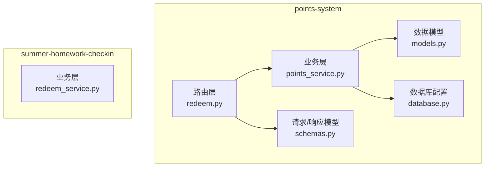
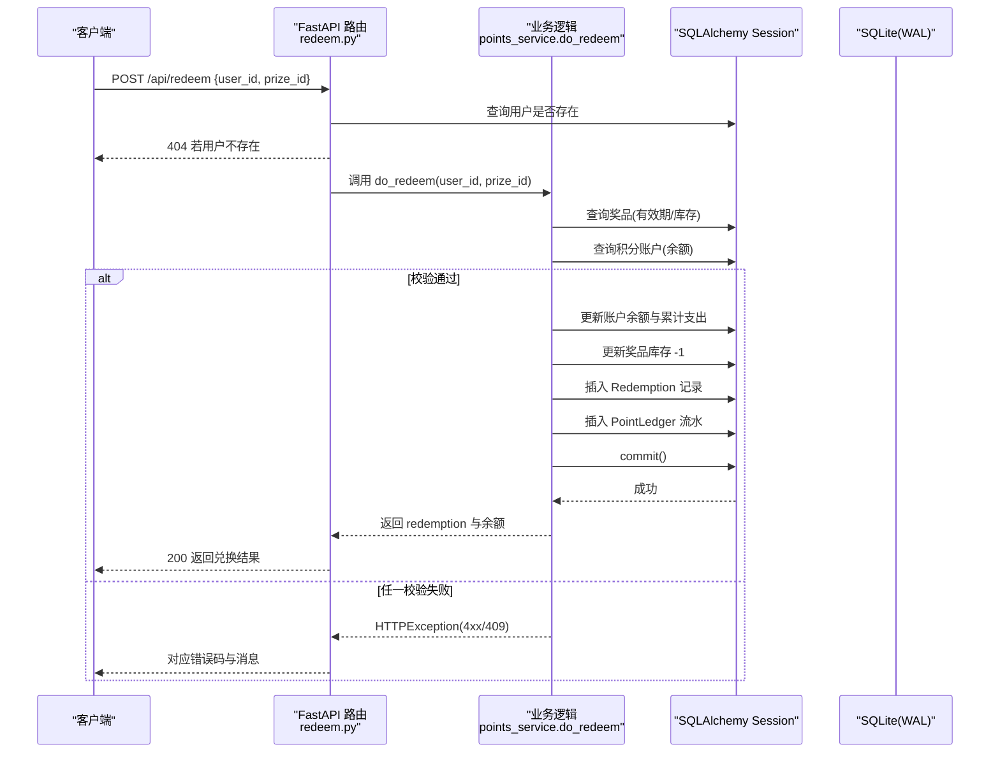
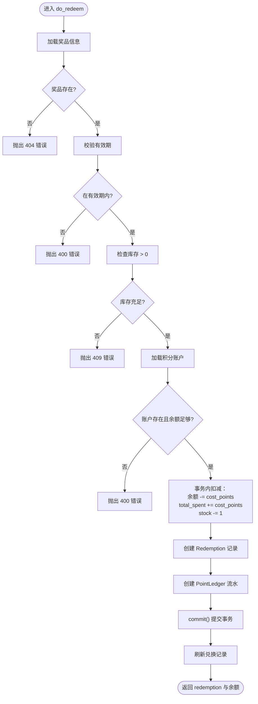
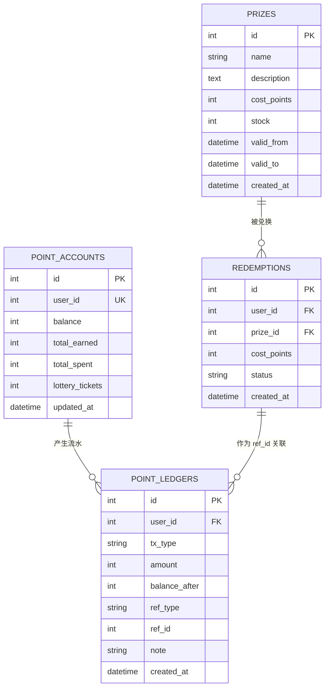
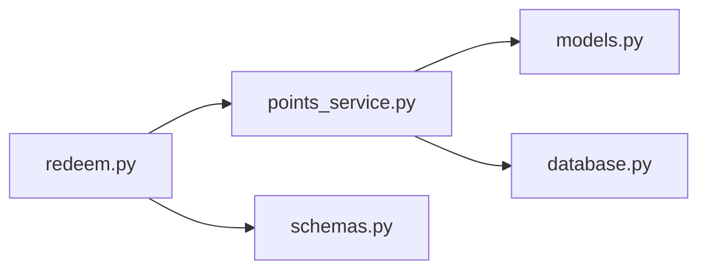

# 兑换扣减系统

<cite>
**本文引用的文件**
- [points_service.py](file://points-system/backend/app/services/points_service.py)
- [models.py](file://points-system/backend/app/models.py)
- [redeem.py](file://points-system/backend/app/routers/redeem.py)
- [database.py](file://points-system/backend/app/database.py)
- [schemas.py](file://points-system/backend/app/schemas.py)
- [redeem_service.py](file://summer-homework-checkin/backend/app/services/redeem_service.py)
</cite>

## 目录
1. [简介](#简介)
2. [项目结构](#项目结构)
3. [核心组件](#核心组件)
4. [架构总览](#架构总览)
5. [详细组件分析](#详细组件分析)
6. [依赖关系分析](#依赖关系分析)
7. [性能与并发特性](#性能与并发特性)
8. [故障排查指南](#故障排查指南)
9. [结论](#结论)
10. [附录：错误码与异常处理](#附录错误码与异常处理)

## 简介
本文件围绕“积分兑换扣减”的核心流程，系统化梳理 do_redeem 函数的实现细节、事务一致性保障、数据模型设计、流水记录策略以及 SQLite 环境下的并发控制方案。文档同时给出完整调用示例与异常分支说明，帮助读者快速理解并正确集成该能力。

## 项目结构
本仓库包含两套相关实现：
- points-system：以 SQLAlchemy + SQLite 为核心，提供统一的积分账户与兑换服务（含 do_redeem）。
- summer-homework-checkin：面向打卡场景的兑换服务，侧重虚拟奖品自动兑现与实物奖品审核流程。

图表来源
- [redeem.py:1-52](file://points-system/backend/app/routers/redeem.py#L1-L52)
- [points_service.py:94-146](file://points-system/backend/app/services/points_service.py#L94-L146)
- [models.py:68-94](file://points-system/backend/app/models.py#L68-L94)
- [database.py:1-39](file://points-system/backend/app/database.py#L1-L39)
- [schemas.py:72-88](file://points-system/backend/app/schemas.py#L72-L88)
- [redeem_service.py:22-94](file://summer-homework-checkin/backend/app/services/redeem_service.py#L22-L94)

章节来源
- [redeem.py:1-52](file://points-system/backend/app/routers/redeem.py#L1-L52)
- [points_service.py:1-146](file://points-system/backend/app/services/points_service.py#L1-L146)
- [models.py:1-151](file://points-system/backend/app/models.py#L1-L151)
- [database.py:1-39](file://points-system/backend/app/database.py#L1-L39)
- [schemas.py:1-147](file://points-system/backend/app/schemas.py#L1-L147)
- [redeem_service.py:1-168](file://summer-homework-checkin/backend/app/services/redeem_service.py#L1-L168)

## 核心组件
- 路由层：接收兑换请求，校验用户存在性，委托业务层执行兑换，返回标准化结果。
- 业务层：封装 do_redeem，完成奖品有效性验证、库存检查、积分余额校验，并在同一事务内完成库存扣减、积分扣除、兑换记录与流水写入。
- 数据模型：定义 Prize、PointAccount、Redemption、PointLedger 等实体及字段约束。
- 数据库配置：SQLite WAL 模式与 busy_timeout 设置，提升并发读性能与写等待容忍度。
- 请求/响应模型：定义 RedeemRequest、RedeemResult、RedemptionOut 等 Pydantic 模型。

章节来源
- [redeem.py:11-28](file://points-system/backend/app/routers/redeem.py#L11-L28)
- [points_service.py:94-146](file://points-system/backend/app/services/points_service.py#L94-L146)
- [models.py:68-94](file://points-system/backend/app/models.py#L68-L94)
- [database.py:16-23](file://points-system/backend/app/database.py#L16-L23)
- [schemas.py:72-88](file://points-system/backend/app/schemas.py#L72-L88)

## 架构总览
下图展示一次兑换请求从客户端到数据库的端到端流程，重点体现前置校验、事务原子性与流水落盘。

图表来源
- [redeem.py:11-28](file://points-system/backend/app/routers/redeem.py#L11-L28)
- [points_service.py:94-146](file://points-system/backend/app/services/points_service.py#L94-L146)
- [database.py:16-23](file://points-system/backend/app/database.py#L16-L23)

## 详细组件分析

### do_redeem 函数详解
do_redeem 是兑换扣减的核心入口，负责以下关键步骤：
- 奖品有效性验证：检查奖品是否存在、是否在有效期内。
- 库存检查：确保剩余库存大于 0。
- 积分账户与余额校验：确保账户存在且余额足够。
- 事务内原子操作：在同一会话中完成账户余额扣减、累计支出累加、库存扣减、兑换记录创建与流水写入，最后统一提交。

图表来源
- [points_service.py:94-146](file://points-system/backend/app/services/points_service.py#L94-L146)

章节来源
- [points_service.py:94-146](file://points-system/backend/app/services/points_service.py#L94-L146)

### 数据模型设计
- Prize（奖品）：包含名称、描述、所需积分、库存、有效期等字段，用于兑换标的管理。
- PointAccount（积分账户）：每个用户一行，维护当前可用余额、累计获得与累计支出，以及抽奖券数量。
- Redemption（兑换记录）：每次成功兑换生成一条，关联用户与奖品，记录消耗积分快照与状态。
- PointLedger（积分流水）：每一笔收支均落一条，记录变动金额、变动后余额、业务参考类型与 ID，便于对账与审计。

图表来源
- [models.py:68-94](file://points-system/backend/app/models.py#L68-L94)
- [models.py:20-48](file://points-system/backend/app/models.py#L20-L48)

章节来源
- [models.py:68-94](file://points-system/backend/app/models.py#L68-L94)
- [models.py:20-48](file://points-system/backend/app/models.py#L20-L48)

### 事务一致性与并发控制
- 事务一致性：所有读写操作均在同一个 SQLAlchemy Session 内完成，最终通过 commit 一次性提交；任何异常将导致回滚，保证“库存 -1”与“积分 -N”要么同时成功、要么同时失败。
- SQLite 并发控制：
  - 开启 WAL 日志模式，提高并发读取性能。
  - 设置 busy_timeout，避免写锁冲突时立即失败，降低竞态概率。
  - 注释明确：SQLite 行级锁支持有限，当前依靠单事务原子性保证一致性；若迁移至 PostgreSQL，可引入 with_for_update() 实现悲观锁。

章节来源
- [points_service.py:94-106](file://points-system/backend/app/services/points_service.py#L94-L106)
- [database.py:16-23](file://points-system/backend/app/database.py#L16-L23)

### 兑换记录与流水维护策略
- 兑换记录：每次成功兑换写入 Redemption，记录用户、奖品、消耗积分快照与状态，便于后续查询与统计。
- 流水记录：同步写入 PointLedger，tx_type 为 spend，amount 为消耗积分，balance_after 为扣减后的余额，ref_type 为 redemption，ref_id 指向兑换记录主键，note 包含奖品名称以便审计。

章节来源
- [points_service.py:123-141](file://points-system/backend/app/services/points_service.py#L123-L141)
- [models.py:35-48](file://points-system/backend/app/models.py#L35-L48)

### 路由层与请求/响应模型
- 路由层：POST /api/redeem 接收 RedeemRequest，先校验用户存在，再调用 do_redeem，返回 RedeemResult，其中包含 RedemptionOut 与余额。
- 请求/响应模型：RedeemRequest 包含 user_id 与 prize_id；RedeemResult 包含 redemption 与 balance；RedemptionOut 暴露必要字段给前端。

章节来源
- [redeem.py:11-28](file://points-system/backend/app/routers/redeem.py#L11-L28)
- [schemas.py:72-88](file://points-system/backend/app/schemas.py#L72-L88)

### 对比：summer-homework-checkin 的兑换服务
summer-homework-checkin 的 redeem_service.redeem 实现了另一套兑换策略：
- 区分两类奖品：
  - 虚拟奖品（is_lottery_ticket=True）：自动成功，直接增加用户抽奖券数量，并创建 fulfilled 状态的兑换记录。
  - 实物奖品（is_lottery_ticket=False）：创建 pending 状态的兑换记录，需管理员手动核实兑现。
- 该实现未显式使用积分账户表，而是直接操作用户积分字段，并通过通知服务发送消息。

章节来源
- [redeem_service.py:22-94](file://summer-homework-checkin/backend/app/services/redeem_service.py#L22-L94)

## 依赖关系分析
- 路由层依赖业务层与数据库会话提供者。
- 业务层依赖数据模型与数据库配置。
- 数据模型由数据库配置初始化并映射到 SQLite。
- 请求/响应模型用于 FastAPI 参数校验与序列化。

图表来源
- [redeem.py:1-52](file://points-system/backend/app/routers/redeem.py#L1-L52)
- [points_service.py:1-146](file://points-system/backend/app/services/points_service.py#L1-L146)
- [models.py:1-151](file://points-system/backend/app/models.py#L1-L151)
- [database.py:1-39](file://points-system/backend/app/database.py#L1-L39)
- [schemas.py:1-147](file://points-system/backend/app/schemas.py#L1-L147)

章节来源
- [redeem.py:1-52](file://points-system/backend/app/routers/redeem.py#L1-L52)
- [points_service.py:1-146](file://points-system/backend/app/services/points_service.py#L1-L146)
- [models.py:1-151](file://points-system/backend/app/models.py#L1-L151)
- [database.py:1-39](file://points-system/backend/app/database.py#L1-L39)
- [schemas.py:1-147](file://points-system/backend/app/schemas.py#L1-L147)

## 性能与并发特性
- SQLite WAL 模式：允许高并发读取，减少读阻塞。
- busy_timeout：写锁冲突时等待一段时间，降低瞬时失败率。
- 单事务原子性：将多步更新合并为一个事务，缩短竞态窗口。
- 扩展建议：若未来迁移至 PostgreSQL，可在 do_redeem 中对账户与奖品行加悲观锁（with_for_update），进一步提升强一致性。

章节来源
- [database.py:16-23](file://points-system/backend/app/database.py#L16-L23)
- [points_service.py:94-106](file://points-system/backend/app/services/points_service.py#L94-L106)

## 故障排查指南
- 常见错误定位：
  - 404 用户不存在：检查路由层用户存在性校验与入参 user_id。
  - 400 奖品无效或积分不足：检查有效期、成本积分与账户余额。
  - 409 库存不足：检查奖品库存字段与并发竞争情况。
- 事务问题：
  - 确认所有更新与插入在同一 Session 内，且 commit 前无其他提交。
  - 若出现部分更新，检查异常捕获与回滚逻辑。
- SQLite 并发问题：
  - 确认已启用 WAL 与 busy_timeout。
  - 在高并发下适当增大 busy_timeout 或引入队列限流。

章节来源
- [redeem.py:11-28](file://points-system/backend/app/routers/redeem.py#L11-L28)
- [points_service.py:94-146](file://points-system/backend/app/services/points_service.py#L94-L146)
- [database.py:16-23](file://points-system/backend/app/database.py#L16-L23)

## 结论
do_redeem 通过严格的前置校验与单事务原子操作，确保了库存与积分的一致性；配合 SQLite WAL 与 busy_timeout，在单机环境下具备较好的并发稳定性。数据模型与流水记录的设计满足可追溯与对账需求。若未来需要更强的并发一致性，可考虑迁移至支持行级锁的数据库并引入悲观锁。

## 附录：错误码与异常处理
- 404 用户不存在：路由层校验用户存在性失败。
- 404 奖品不存在：业务层加载奖品为空。
- 400 奖品尚未开始兑换：当前时间早于 valid_from。
- 400 奖品已过期：当前时间晚于 valid_to。
- 400 积分账户不存在：账户记录缺失。
- 400 积分不足：账户余额小于 cost_points。
- 409 奖品库存不足：stock <= 0。

章节来源
- [redeem.py:11-28](file://points-system/backend/app/routers/redeem.py#L11-L28)
- [points_service.py:94-146](file://points-system/backend/app/services/points_service.py#L94-L146)