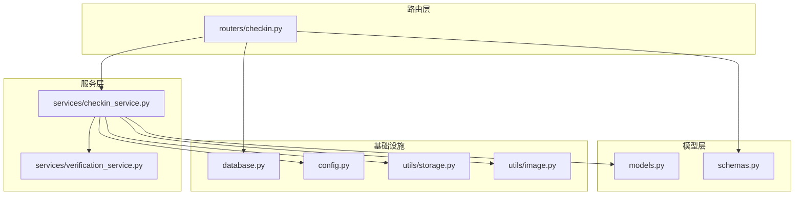
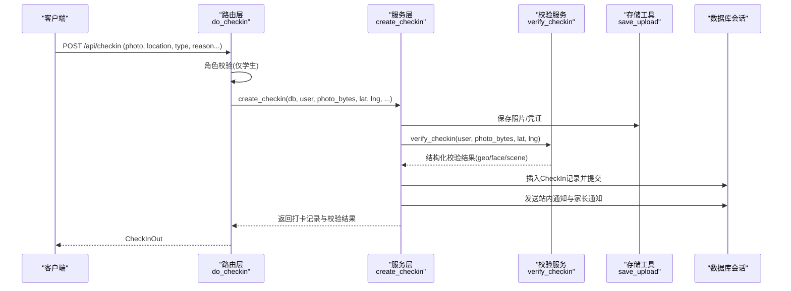
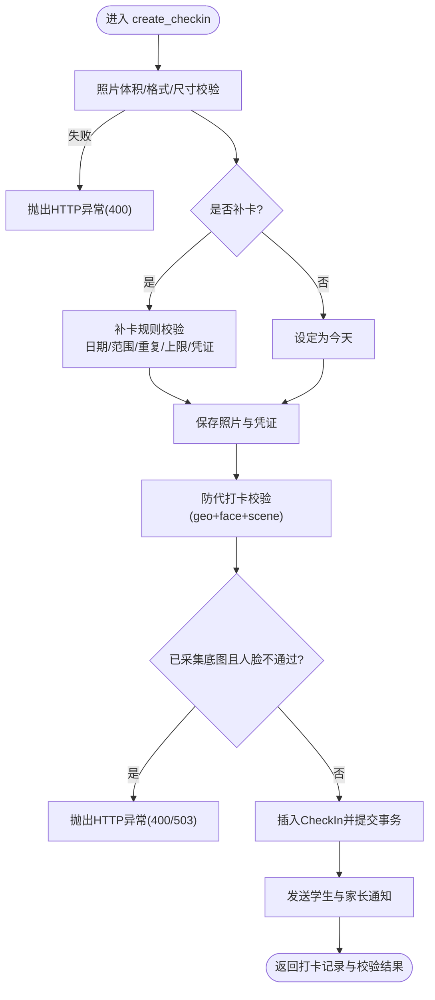
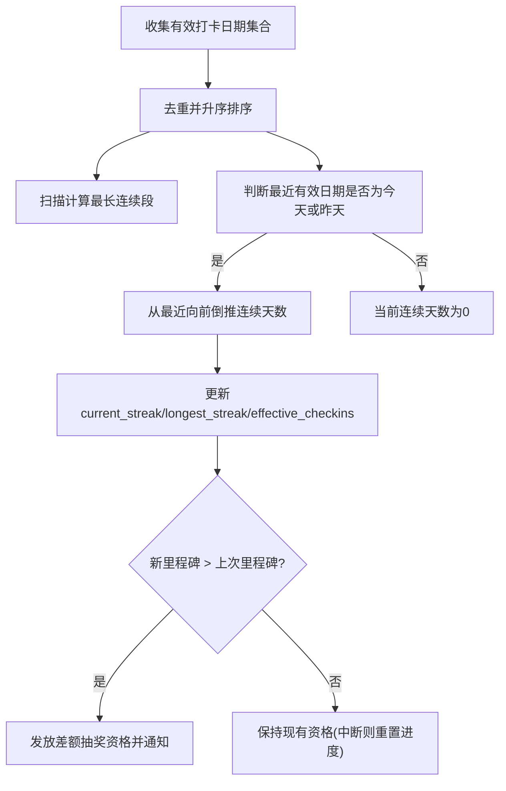
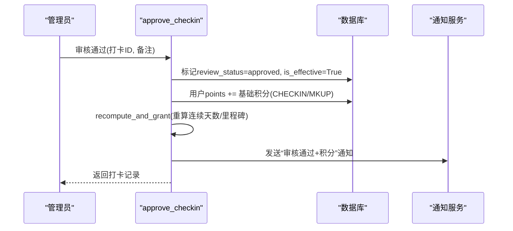
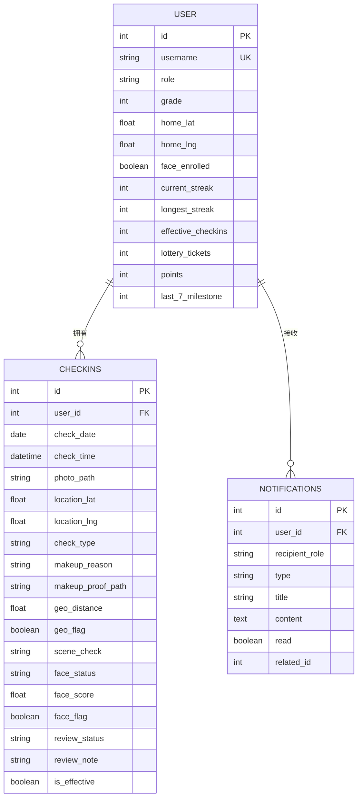
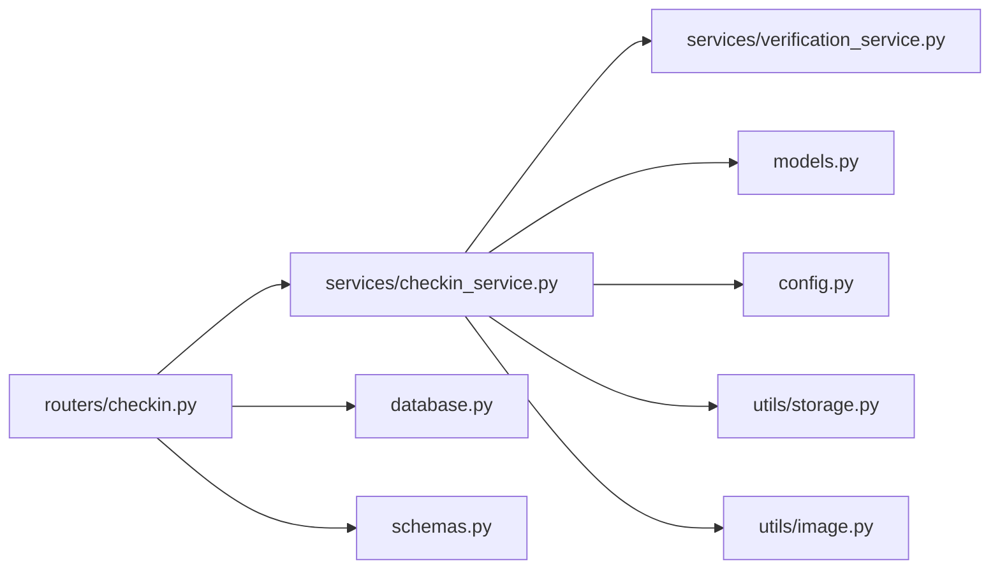

# 打卡积分获取

<cite>
**本文引用的文件列表**
- [checkin.py](file://summer-homework-checkin/backend/app/routers/checkin.py)
- [checkin_service.py](file://summer-homework-checkin/backend/app/services/checkin_service.py)
- [models.py](file://summer-homework-checkin/backend/app/models.py)
- [schemas.py](file://summer-homework-checkin/backend/app/schemas.py)
- [config.py](file://summer-homework-checkin/backend/app/config.py)
- [database.py](file://summer-homework-checkin/backend/app/database.py)
- [verification_service.py](file://summer-homework-checkin/backend/app/services/verification_service.py)
- [storage.py](file://summer-homework-checkin/backend/app/utils/storage.py)
- [image.py](file://summer-homework-checkin/backend/app/utils/image.py)
</cite>

## 目录
1. [简介](#简介)
2. [项目结构](#项目结构)
3. [核心组件](#核心组件)
4. [架构总览](#架构总览)
5. [详细组件分析](#详细组件分析)
6. [依赖关系分析](#依赖关系分析)
7. [性能与一致性考量](#性能与一致性考量)
8. [故障排查指南](#故障排查指南)
9. [结论](#结论)
10. [附录：API 定义与配置项](#附录api-定义与配置项)

## 简介
本文件面向“打卡积分获取系统”，聚焦 do_checkin 函数的完整实现流程，包括防重复打卡验证、连续天数计算、积分奖励计算等核心逻辑；详细说明积分计算公式（基础积分 + 连续奖励积分）的配置规则；文档化打卡记录的数据模型设计与流水记录机制；解释事务处理机制如何保证数据一致性，并给出完整的打卡流程示例与错误处理最佳实践。

## 项目结构
后端采用 FastAPI + SQLAlchemy 的轻量架构，按路由层、服务层、模型层与工具层分层组织。打卡相关代码主要分布在 routers、services、models、utils 与 config 中。

图表来源
- [checkin.py:1-80](file://summer-homework-checkin/backend/app/routers/checkin.py#L1-L80)
- [checkin_service.py:1-254](file://summer-homework-checkin/backend/app/services/checkin_service.py#L1-L254)
- [models.py:1-212](file://summer-homework-checkin/backend/app/models.py#L1-L212)
- [schemas.py:1-322](file://summer-homework-checkin/backend/app/schemas.py#L1-L322)
- [database.py:1-22](file://summer-homework-checkin/backend/app/database.py#L1-L22)
- [config.py:1-50](file://summer-homework-checkin/backend/app/config.py#L1-L50)
- [storage.py:1-24](file://summer-homework-checkin/backend/app/utils/storage.py#L1-L24)
- [image.py:1-61](file://summer-homework-checkin/backend/app/utils/image.py#L1-L61)

章节来源
- [checkin.py:1-80](file://summer-homework-checkin/backend/app/routers/checkin.py#L1-L80)
- [checkin_service.py:1-254](file://summer-homework-checkin/backend/app/services/checkin_service.py#L1-L254)
- [models.py:1-212](file://summer-homework-checkin/backend/app/models.py#L1-L212)
- [schemas.py:1-322](file://summer-homework-checkin/backend/app/schemas.py#L1-L322)
- [database.py:1-22](file://summer-homework-checkin/backend/app/database.py#L1-L22)
- [config.py:1-50](file://summer-homework-checkin/backend/app/config.py#L1-L50)
- [storage.py:1-24](file://summer-homework-checkin/backend/app/utils/storage.py#L1-L24)
- [image.py:1-61](file://summer-homework-checkin/backend/app/utils/image.py#L1-L61)

## 核心组件
- 路由层：提供 /api/checkin 系列接口，封装请求参数校验、权限控制与响应序列化。
- 服务层：实现打卡业务主流程 create_checkin、审核 approve/reject、连续天数重算 recompute_and_grant、今日状态查询 get_today_status。
- 模型层：定义用户、打卡记录、通知、奖品、兑换等实体及关系。
- 工具层：图片校验、存储路径生成、地理位置计算、人脸识别调用封装。
- 配置层：打卡规则、补卡上限、照片规格、人脸策略、积分常量等。

章节来源
- [checkin.py:1-80](file://summer-homework-checkin/backend/app/routers/checkin.py#L1-L80)
- [checkin_service.py:1-254](file://summer-homework-checkin/backend/app/services/checkin_service.py#L1-L254)
- [models.py:1-212](file://summer-homework-checkin/backend/app/models.py#L1-L212)
- [config.py:1-50](file://summer-homework-checkin/backend/app/config.py#L1-L50)

## 架构总览
do_checkin 的整体调用链如下：客户端上传照片与位置信息 -> 路由层鉴权与参数解析 -> 服务层执行校验与持久化 -> 写入通知与返回结果。

图表来源
- [checkin.py:17-37](file://summer-homework-checkin/backend/app/routers/checkin.py#L17-L37)
- [checkin_service.py:64-163](file://summer-homework-checkin/backend/app/services/checkin_service.py#L64-L163)
- [verification_service.py:19-71](file://summer-homework-checkin/backend/app/services/verification_service.py#L19-L71)
- [storage.py:7-16](file://summer-homework-checkin/backend/app/utils/storage.py#L7-L16)

## 详细组件分析

### do_checkin 函数完整流程
- 权限校验：仅 student 角色可打卡。
- 参数读取：支持正常打卡与补卡两种类型，包含照片、可选证明、经纬度、补卡原因与目标日期。
- 业务委托：调用 checkin_service.create_checkin 完成全部业务规则。
- 响应构造：将数据库实体序列化为 CheckInOut 返回。

关键要点
- 正常打卡允许多次提交，但需逐条审核后才计入有效打卡。
- 补卡需指定过去日期且受月度次数限制，同时需要上传作业完成凭证。
- 防代打卡通过图像合规、地理距离与人脸 1:1 比对综合判定。

章节来源
- [checkin.py:17-37](file://summer-homework-checkin/backend/app/routers/checkin.py#L17-L37)

### 创建打卡 create_checkin 流程
步骤概览
1) 照片体积与格式校验（最小/最大字节、JPEG/PNG、尺寸下限）。
2) 补卡规则校验（目标日期合法性、暑假范围、是否已存在有效打卡、月度上限、凭证必填）。
3) 正常打卡默认当天日期。
4) 保存照片与凭证到本地存储，得到相对路径。
5) 防代打卡校验：地理位置一致性 + 人脸 1:1 比对 + 场景风险标记。
6) 写入 CheckIn 记录，设置 review_status=pending、is_effective=False。
7) 提交事务并刷新对象。
8) 发送站内通知与学生家长通知。
9) 返回打卡记录与校验结果。

图表来源
- [checkin_service.py:64-163](file://summer-homework-checkin/backend/app/services/checkin_service.py#L64-L163)
- [image.py:51-61](file://summer-homework-checkin/backend/app/utils/image.py#L51-L61)
- [verification_service.py:19-71](file://summer-homework-checkin/backend/app/services/verification_service.py#L19-L71)
- [storage.py:7-16](file://summer-homework-checkin/backend/app/utils/storage.py#L7-L16)

章节来源
- [checkin_service.py:64-163](file://summer-homework-checkin/backend/app/services/checkin_service.py#L64-L163)

### 防重复打卡与补卡规则
- 正常打卡：允许同一天多次提交，但最终仅审核通过的记录计入有效打卡。
- 补卡：
  - 必须指定目标日期，且为过去日期且在暑假统计范围内。
  - 若该日期已有有效打卡则拒绝重复补卡。
  - 单自然月补卡次数受 MAX_MAKEUP_PER_MONTH 限制。
  - 补卡必须上传作业完成凭证。

章节来源
- [checkin_service.py:72-103](file://summer-homework-checkin/backend/app/services/checkin_service.py#L72-L103)
- [config.py:28-32](file://summer-homework-checkin/backend/app/config.py#L28-L32)

### 连续天数计算与里程碑奖励
- 当前连续天数：基于所有 is_effective=True 的有效打卡日期集合，从最近一次有效打卡倒推连续天数；若最近一次不是今天或昨天，则当前连续天数为 0。
- 历史最长连续天数：遍历排序后的有效日期，统计最长连续段。
- 里程碑奖励：每累计 7 天连续有效打卡解锁 1 次抽奖资格，超过上次里程碑时发放差额次数，并发出系统通知。

图表来源
- [checkin_service.py:12-61](file://summer-homework-checkin/backend/app/services/checkin_service.py#L12-L61)

章节来源
- [checkin_service.py:12-61](file://summer-homework-checkin/backend/app/services/checkin_service.py#L12-L61)

### 积分奖励计算与发放
- 基础积分：审核通过后根据打卡类型发放固定积分。
  - 正常打卡：CHECKIN_POINTS
  - 补卡打卡：MAKEUP_POINTS
- 连续奖励积分：当前实现未引入“连续奖励积分”字段或公式，仅通过连续天数解锁抽奖资格。若后续扩展连续奖励积分，可在 recompute_and_grant 中增加相应累加逻辑。
- 发放时机：管理员审核通过时，先标记打卡有效，再给用户 points 累加，最后重算连续天数与抽奖资格。

图表来源
- [checkin_service.py:166-191](file://summer-homework-checkin/backend/app/services/checkin_service.py#L166-L191)
- [checkin_service.py:39-61](file://summer-homework-checkin/backend/app/services/checkin_service.py#L39-L61)

章节来源
- [checkin_service.py:166-191](file://summer-homework-checkin/backend/app/services/checkin_service.py#L166-L191)
- [config.py:37-39](file://summer-homework-checkin/backend/app/config.py#L37-L39)

### 打卡记录数据模型设计
- User：统一用户表，含学生/家长/管理员角色，以及打卡统计冗余字段（current_streak、longest_streak、effective_checkins、lottery_tickets、points、last_7_milestone）。
- CheckIn：打卡记录，包含打卡日期、时间、照片路径、位置、类型、补卡信息、风控字段（geo_flag、face_flag）、审核状态与有效性标记。
- Notification：站内通知，用于学生与家长接收打卡、审核、系统消息。
- 其他：Prize、LotteryRecord、Redemption 等与积分商城与抽奖相关实体。

图表来源
- [models.py:11-96](file://summer-homework-checkin/backend/app/models.py#L11-L96)
- [models.py:163-176](file://summer-homework-checkin/backend/app/models.py#L163-L176)

章节来源
- [models.py:11-96](file://summer-homework-checkin/backend/app/models.py#L11-L96)
- [models.py:163-176](file://summer-homework-checkin/backend/app/models.py#L163-L176)

### 流水记录机制
- 每次打卡提交均生成一条 CheckIn 记录，作为不可变流水，便于审计与回溯。
- 审核动作会更新同一记录的 review_status 与 is_effective，但不删除原记录。
- 通知记录在 Notification 表中独立留存，关联 to 用户与相关实体 ID。

章节来源
- [checkin_service.py:124-163](file://summer-homework-checkin/backend/app/services/checkin_service.py#L124-L163)
- [checkin_service.py:166-191](file://summer-homework-checkin/backend/app/services/checkin_service.py#L166-L191)
- [models.py:163-176](file://summer-homework-checkin/backend/app/models.py#L163-L176)

### 事务处理与一致性保障
- 使用 SQLAlchemy SessionLocal 管理会话，get_db 提供依赖注入式会话生命周期。
- 在 create_checkin 中，插入 CheckIn 后显式 commit 并 refresh，确保后续操作基于最新状态。
- 在 approve_checkin 中，分步提交：先更新打卡记录，再更新用户积分，最后重算连续天数与里程碑，并在每一步之间进行刷新以保证一致性。
- 唯一约束与完整性：
  - 当前实现通过应用层检查避免重复补卡（同一天已存在有效打卡），并未在数据库层对 (user_id, check_date, check_type) 添加唯一索引。
  - 如需强一致，建议在数据库层增加唯一约束，并在上层捕获 IntegrityError 转换为友好的 HTTP 400 错误。

章节来源
- [database.py:16-22](file://summer-homework-checkin/backend/app/database.py#L16-L22)
- [checkin_service.py:124-146](file://summer-homework-checkin/backend/app/services/checkin_service.py#L124-L146)
- [checkin_service.py:166-191](file://summer-homework-checkin/backend/app/services/checkin_service.py#L166-L191)

### 防代打卡校验
- 图像真实性：体积与格式校验，过滤占位图/缩略图。
- 地理位置一致性：计算与常用位置的距离，超出阈值标记风险。
- 人脸 1:1 比对：已采集底图的用户，若人脸不匹配或缺脸/多脸，直接拒绝打卡；模型不可用时按策略降级。
- 场景风险：综合上述维度输出 scene_check 与 risk 等级，供审核参考。

章节来源
- [verification_service.py:19-71](file://summer-homework-checkin/backend/app/services/verification_service.py#L19-L71)
- [image.py:51-61](file://summer-homework-checkin/backend/app/utils/image.py#L51-L61)
- [config.py:28-32](file://summer-homework-checkin/backend/app/config.py#L28-L32)

## 依赖关系分析
- 路由层依赖服务层与模型/模式层，负责参数绑定与响应序列化。
- 服务层依赖配置、工具与校验服务，执行业务规则与数据持久化。
- 工具层提供无外部库依赖的图片解析与存储路径生成，降低部署复杂度。
- 数据库连接通过配置中的 SQLite URL 初始化，适合轻量部署。

图表来源
- [checkin.py:1-80](file://summer-homework-checkin/backend/app/routers/checkin.py#L1-L80)
- [checkin_service.py:1-254](file://summer-homework-checkin/backend/app/services/checkin_service.py#L1-L254)
- [database.py:1-22](file://summer-homework-checkin/backend/app/database.py#L1-L22)
- [schemas.py:1-322](file://summer-homework-checkin/backend/app/schemas.py#L1-L322)

章节来源
- [checkin.py:1-80](file://summer-homework-checkin/backend/app/routers/checkin.py#L1-L80)
- [checkin_service.py:1-254](file://summer-homework-checkin/backend/app/services/checkin_service.py#L1-L254)
- [database.py:1-22](file://summer-homework-checkin/backend/app/database.py#L1-L22)
- [schemas.py:1-322](file://summer-homework-checkin/backend/app/schemas.py#L1-L322)

## 性能与一致性考量
- 图片解析：使用纯 Python 解析 JPEG/PNG 头，避免引入 Pillow，减少依赖与内存占用。
- 存储路径：按用户 ID 分目录，避免单目录过大导致文件系统性能下降。
- 事务粒度：在关键路径上及时提交与刷新，避免长事务带来的锁竞争。
- 建议优化：
  - 在数据库层为 (user_id, check_date, check_type) 建立唯一索引，防止并发重复提交。
  - 对高频查询（如 today 状态、本月补卡计数）增加合适索引。
  - 对大文件上传启用流式处理与异步任务队列，避免阻塞请求线程。

[本节为通用指导，无需列出具体文件来源]

## 故障排查指南
- 常见错误与定位
  - 照片不符合要求：检查体积与格式、尺寸下限。
  - 补卡日期无效：确认目标日期为过去且在暑假范围内。
  - 人脸校验失败：确认是否已采集底图，模型是否可用，策略是否为 enforce。
  - 审核重复操作：检查记录是否已被批准或拒绝。
- 事务与唯一约束
  - 若未来引入数据库唯一约束，需在服务层捕获 IntegrityError 并转换为 HTTP 400。
- 通知未送达
  - 检查通知服务调用是否成功，核对用户与家长绑定关系。

章节来源
- [checkin_service.py:64-163](file://summer-homework-checkin/backend/app/services/checkin_service.py#L64-L163)
- [checkin_service.py:166-209](file://summer-homework-checkin/backend/app/services/checkin_service.py#L166-L209)

## 结论
本系统围绕“打卡—审核—积分—连续奖励”的主线构建，通过严格的照片与人脸校验、灵活的补卡规则与清晰的流水记录，保障了打卡数据的真实性和可追溯性。当前积分发放以固定基础积分为主，连续奖励通过里程碑解锁抽奖资格体现。后续可按需在连续奖励积分方面扩展公式与发放策略，并通过数据库唯一约束进一步提升一致性。

[本节为总结，无需列出具体文件来源]

## 附录：API 定义与配置项

### API 定义
- POST /api/checkin
  - 功能：提交打卡（支持正常与补卡）
  - 入参：photo、proof、location_lat、location_lng、check_type、makeup_reason、makeup_for_date
  - 出参：CheckInOut
- GET /api/checkin/today
  - 功能：查询今日打卡状态
- GET /api/checkin/streak
  - 功能：查询连续天数与剩余补卡次数
- GET /api/checkin/history
  - 功能：查询历史打卡记录

章节来源
- [checkin.py:17-80](file://summer-homework-checkin/backend/app/routers/checkin.py#L17-L80)
- [schemas.py:54-96](file://summer-homework-checkin/backend/app/schemas.py#L54-L96)

### 配置项说明
- GEO_THRESHOLD_METERS：地理距离阈值（米）
- MAX_MAKEUP_PER_MONTH：单自然月补卡上限
- MIN_PHOTO_BYTES / PHOTO_MAX_BYTES：照片体积上下限
- MIN_PHOTO_DIM：照片最小边长
- LOTTERY_STREAK_THRESHOLD：连续打卡解锁抽奖资格的阈值
- CHECKIN_POINTS / MAKEUP_POINTS：正常/补卡基础积分
- FACE_MATCH_THRESHOLD：人脸相似度阈值
- FACE_MODE_ON_ENROLLED：已采集底图的人脸策略（enforce/soft）

章节来源
- [config.py:28-50](file://summer-homework-checkin/backend/app/config.py#L28-L50)