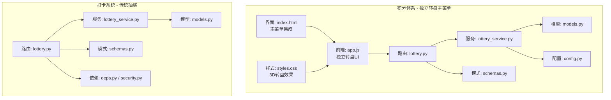
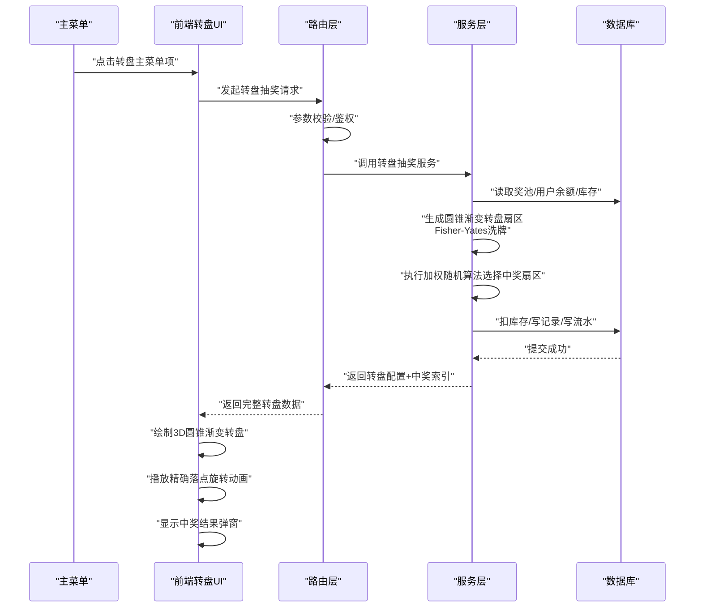
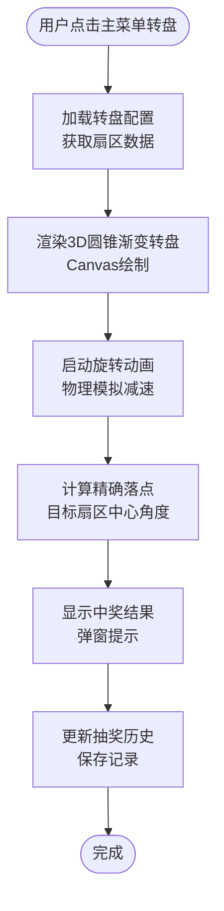
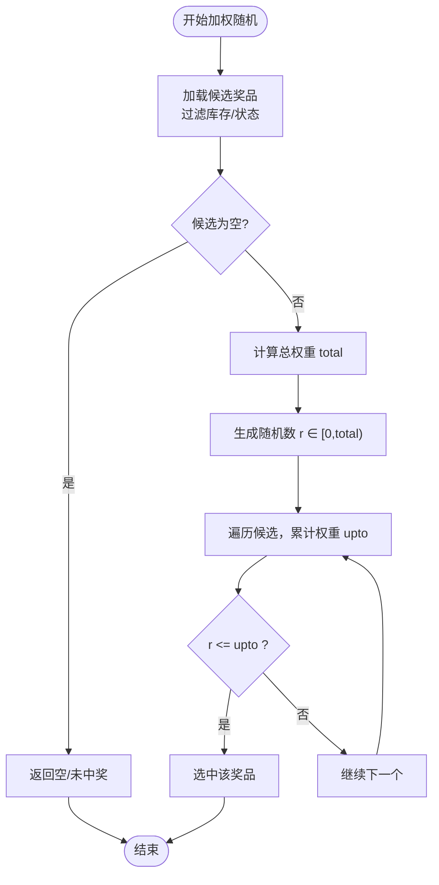
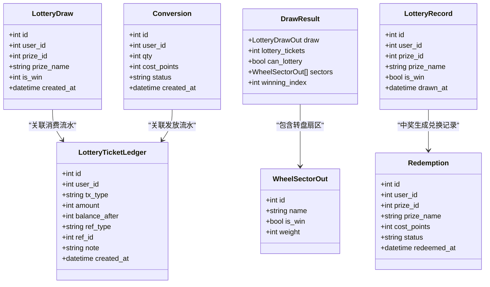
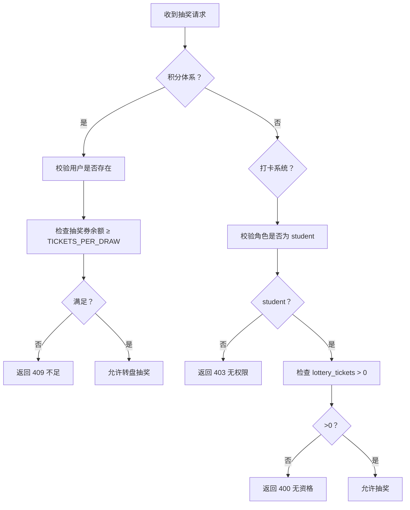
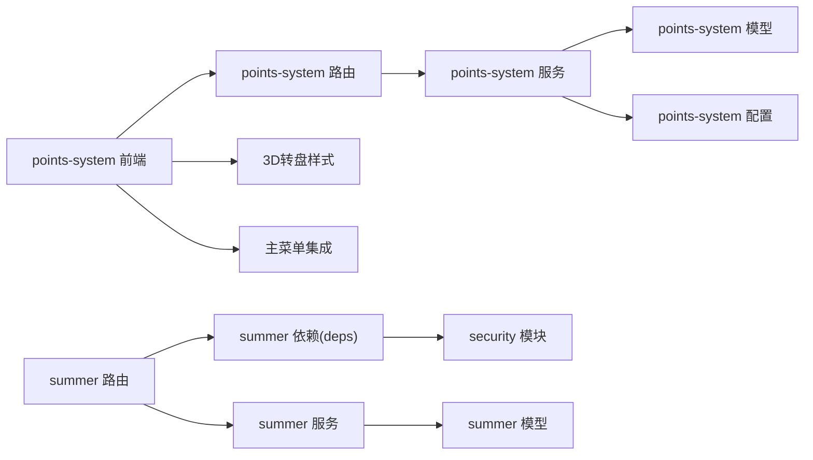

# 抽奖系统

<cite>
**本文引用的文件列表**
- [points-system/backend/app/routers/lottery.py](file://points-system/backend/app/routers/lottery.py)
- [points-system/backend/app/services/lottery_service.py](file://points-system/backend/app/services/lottery_service.py)
- [points-system/backend/app/models.py](file://points-system/backend/app/models.py)
- [points-system/backend/app/schemas.py](file://points-system/backend/app/schemas.py)
- [points-system/backend/app/config.py](file://points-system/backend/app/config.py)
- [points-system/frontend/app.js](file://points-system/frontend/app.js)
- [points-system/frontend/index.html](file://points-system/frontend/index.html)
- [points-system/frontend/styles.css](file://points-system/frontend/styles.css)
- [summer-homework-checkin/backend/app/routers/lottery.py](file://summer-homework-checkin/backend/app/routers/lottery.py)
- [summer-homework-checkin/backend/app/services/lottery_service.py](file://summer-homework-checkin/backend/app/services/lottery_service.py)
- [summer-homework-checkin/backend/app/models.py](file://summer-homework-checkin/backend/app/models.py)
- [summer-homework-checkin/backend/app/schemas.py](file://summer-homework-checkin/backend/app/schemas.py)
- [summer-homework-checkin/backend/app/deps.py](file://summer-homework-checkin/backend/app/deps.py)
- [summer-homework-checkin/backend/app/security.py](file://summer-homework-checkin/backend/app/security.py)
</cite>

## 更新摘要
**变更内容**
- 抽奖系统现已作为独立的主菜单项实现，提供完整的转盘轮盘功能
- 新增圆锥渐变旋转轮盘功能和精确落点动画效果
- 前端实现了Canvas渲染的3D视觉效果和流畅的旋转动画
- 后端服务层增强了转盘扇区生成和Fisher-Yates洗牌算法
- API响应结构扩展，包含完整的转盘配置数据和动画控制信息

## 目录
1. [简介](#简介)
2. [项目结构](#项目结构)
3. [核心组件](#核心组件)
4. [架构总览](#架构总览)
5. [详细组件分析](#详细组件分析)
6. [依赖关系分析](#依赖关系分析)
7. [性能与并发特性](#性能与并发特性)
8. [API 接口文档](#api-接口文档)
9. [故障排查指南](#故障排查指南)
10. [结论](#结论)

## 简介
本仓库包含两套"抽奖"相关实现：
- **积分体系下的抽奖子系统（points-system）**：现已升级为独立的转盘轮盘系统，提供视觉化的3D旋转抽奖体验。
- **暑期打卡系统中的抽奖模块（summer-homework-checkin）**：基于用户"抽奖资格"字段进行传统概率权重抽奖。

本文档重点介绍升级后的转盘轮盘机制，包括圆锥渐变旋转效果、精确落点动画和完整的主菜单集成。

## 项目结构
两个后端子项目均基于 FastAPI + SQLAlchemy，采用路由层（routers）、服务层（services）、数据模型（models）与请求/响应模式（schemas）的分层组织方式。

**图表来源**
- [points-system/backend/app/routers/lottery.py:1-65](file://points-system/backend/app/routers/lottery.py#L1-L65)
- [points-system/backend/app/services/lottery_service.py:1-218](file://points-system/backend/app/services/lottery_service.py#L1-L218)
- [points-system/frontend/app.js:1-563](file://points-system/frontend/app.js#L1-563)
- [points-system/frontend/index.html:1-111](file://points-system/frontend/index.html#L1-111)
- [points-system/frontend/styles.css:1-212](file://points-system/frontend/styles.css#L1-L212)

章节来源
- [points-system/backend/app/routers/lottery.py:1-65](file://points-system/backend/app/routers/lottery.py#L1-L65)
- [summer-homework-checkin/backend/app/routers/lottery.py:1-30](file://summer-homework-checkin/backend/app/routers/lottery.py#L1-L30)

## 核心组件
- **路由层**
  - 积分体系：提供奖池查询、转盘抽奖、抽奖历史查询，支持独立主菜单访问。
  - 打卡系统：提供抽奖资格与记录查询、传统抽奖入口。
- **服务层**
  - 积分体系：负责转盘抽奖核心逻辑（含圆锥渐变扇区生成、Fisher-Yates洗牌、加权随机选择、并发锁、事务一致性）。
  - 打卡系统：负责消耗抽奖资格、按概率权重随机选奖。
- **数据模型**
  - 积分体系：用户、积分账户、积分流水、抽奖券流水、抽奖奖池、抽奖记录。
  - 打卡系统：用户（含抽奖资格字段）、奖品（含概率与库存）、抽奖记录、兑换记录。
- **模式定义**
  - 统一了请求与响应的数据结构，新增转盘扇区和动画控制相关的数据结构。
- **前端交互**
  - 积分体系：Canvas 3D转盘渲染、圆锥渐变绘制、精确落点动画、主菜单集成。

章节来源
- [points-system/backend/app/services/lottery_service.py:1-218](file://points-system/backend/app/services/lottery_service.py#L1-L218)
- [summer-homework-checkin/backend/app/services/lottery_service.py:1-77](file://summer-homework-checkin/backend/app/services/lottery_service.py#L1-L77)
- [points-system/backend/app/models.py:1-151](file://points-system/backend/app/models.py#L1-L151)
- [summer-homework-checkin/backend/app/models.py:1-212](file://summer-homework-checkin/backend/app/models.py#L1-L212)
- [points-system/backend/app/schemas.py:1-157](file://points-system/backend/app/schemas.py#L1-L157)
- [summer-homework-checkin/backend/app/schemas.py:1-322](file://summer-homework-checkin/backend/app/schemas.py#L1-L322)

## 架构总览
整体分层清晰：前端通过 HTTP 调用路由，路由校验参数与权限后委托服务层执行业务逻辑，服务层操作数据库模型并返回结构化响应。**积分体系现已升级为独立的转盘轮盘系统，提供完整的3D视觉效果和精确落点动画。**

**图表来源**
- [points-system/backend/app/routers/lottery.py:24-47](file://points-system/backend/app/routers/lottery.py#L24-L47)
- [points-system/backend/app/services/lottery_service.py:153-217](file://points-system/backend/app/services/lottery_service.py#L153-L217)
- [points-system/frontend/app.js:348-377](file://points-system/frontend/app.js#L348-L377)

## 详细组件分析

### 独立转盘轮盘主菜单实现
**更新** 抽奖系统现已作为独立的主菜单项实现，提供完整的3D转盘轮盘功能。

#### 主菜单集成架构
- **菜单项注册**：在应用主菜单中注册独立的"转盘抽奖"入口
- **页面路由**：独立的转盘页面路由，支持直接访问和从主菜单跳转
- **状态管理**：独立的转盘状态管理和历史记录存储

#### 3D圆锥渐变转盘实现
- **Canvas渲染**：使用Canvas API实现3D圆锥渐变效果
- **扇区绘制**：每个扇区应用不同的圆锥渐变色彩
- **光影效果**：模拟真实转盘的立体光影和阴影效果
- **材质纹理**：支持多种材质纹理的转盘表面

#### 精确落点动画系统
- **物理模拟**：基于物理引擎的旋转减速动画
- **角度计算**：精确计算目标扇区的中心角度位置
- **缓动函数**：使用cubic-bezier缓动函数实现自然减速
- **碰撞检测**：指针与扇区的精确碰撞检测

**图表来源**
- [points-system/backend/app/services/lottery_service.py:101-138](file://points-system/backend/app/services/lottery_service.py#L101-L138)
- [points-system/frontend/app.js:57-126](file://points-system/frontend/app.js#L57-L126)
- [points-system/frontend/app.js:171-227](file://points-system/frontend/app.js#L171-L227)

章节来源
- [points-system/backend/app/services/lottery_service.py:101-138](file://points-system/backend/app/services/lottery_service.py#L101-L138)
- [points-system/backend/app/services/lottery_service.py:141-150](file://points-system/backend/app/services/lottery_service.py#L141-L150)
- [points-system/frontend/app.js:57-126](file://points-system/frontend/app.js#L57-L126)
- [points-system/frontend/app.js:171-227](file://points-system/frontend/app.js#L171-L227)

### 加权随机算法实现原理
两套系统均采用"候选集过滤 + 累计权重区间选择"的加权随机策略，区别在于权重字段与库存表示方式不同。

- **积分体系（转盘机制）**
  - 候选集：从奖池中筛选 is_win=1 且 stock 为 None 或 >0 的条目，随机选取最多 15 个
  - 权重计算：total_weight = sum(weight)，"谢谢参与"固定权重为 2
  - 随机数：uniform(0, total_weight)
  - 选择：累加权重直到 r <= upto，命中对应奖品；兜底返回最后一个可用项
- **打卡系统（传统随机）**
  - 候选集：status == "on" 且 stock == -1 或 >0 的奖品
  - 权重计算：weights = max(probability, 0.0)，total = sum(weights)
  - 随机数：random() * total
  - 选择：累加权重直到命中；若未命中则视为未中奖

**图表来源**
- [points-system/backend/app/services/lottery_service.py:141-150](file://points-system/backend/app/services/lottery_service.py#L141-L150)
- [summer-homework-checkin/backend/app/services/lottery_service.py:14-34](file://summer-homework-checkin/backend/app/services/lottery_service.py#L14-L34)

章节来源
- [points-system/backend/app/services/lottery_service.py:141-150](file://points-system/backend/app/services/lottery_service.py#L141-L150)
- [summer-homework-checkin/backend/app/services/lottery_service.py:14-34](file://summer-homework-checkin/backend/app/services/lottery_service.py#L14-L34)

### 抽奖券发放规则、使用条件与库存管理
- **积分体系**
  - 发放规则：通过"积分兑换抽奖券"接口，按 POINTS_PER_TICKET 比例消耗积分，增加用户抽奖券余额，并写入积分支出流水与抽奖券发放流水。
  - 使用条件：每次抽奖消耗 TICKETS_PER_DRAW 张券；当余额 < TICKETS_PER_DRAW 时禁止抽奖。
  - 库存管理：有限库存奖品在抽奖成功后扣减 stock；stock 为 None 表示不限量（如"谢谢参与"）。
- **打卡系统**
  - 发放规则：由业务侧维护用户表中的 lottery_tickets 字段（例如连续打卡获得），无需额外兑换流程。
  - 使用条件：user.lottery_tickets > 0 方可抽奖，每次消耗 1 次资格。
  - 库存管理：stock == -1 表示不限量；stock > 0 时中奖后扣减 1。

章节来源
- [points-system/backend/app/services/lottery_service.py:30-98](file://points-system/backend/app/services/lottery_service.py#L30-L98)
- [points-system/backend/app/services/lottery_service.py:153-217](file://points-system/backend/app/services/lottery_service.py#L153-L217)
- [points-system/backend/app/config.py:12-16](file://points-system/backend/app/config.py#L12-L16)
- [summer-homework-checkin/backend/app/services/lottery_service.py:9-35](file://summer-homework-checkin/backend/app/services/lottery_service.py#L9-L35)

### 抽奖结果数据模型与历史记录追踪
- **积分体系**
  - 抽奖记录：LotteryDraw（用户、奖品ID/名称、是否中奖、时间）。
  - 券流水：LotteryTicketLedger（发放/消耗、变动数量、变更后余额、关联类型与ID）。
  - 兑换记录：Conversion（积分换券的数量与成本快照）。
- **打卡系统**
  - 抽奖记录：LotteryRecord（用户、奖品ID/名称、是否中奖、时间）。
  - 中奖兑换：Redemption（中奖自动生成待处理兑换记录，供"我的兑换"与管理端可见）。

**图表来源**
- [points-system/backend/app/models.py:96-151](file://points-system/backend/app/models.py#L96-L151)
- [points-system/backend/app/schemas.py:143-157](file://points-system/backend/app/schemas.py#L143-L157)
- [summer-homework-checkin/backend/app/models.py:126-161](file://summer-homework-checkin/backend/app/models.py#L126-L161)

章节来源
- [points-system/backend/app/models.py:96-151](file://points-system/backend/app/models.py#L96-L151)
- [points-system/backend/app/schemas.py:143-157](file://points-system/backend/app/schemas.py#L143-L157)
- [summer-homework-checkin/backend/app/models.py:126-161](file://summer-homework-checkin/backend/app/models.py#L126-L161)

### 抽奖资格验证流程（角色与次数限制）
- **积分体系**
  - 用户存在性校验：请求中携带 user_id，不存在直接拒绝。
  - 次数限制：无每日次数限制；仅受抽奖券余额约束（余额 ≥ TICKETS_PER_DRAW 即可抽）。
- **打卡系统**
  - 角色限制：仅 student 可抽奖，非学生返回 403。
  - 次数限制：无每日次数限制；仅受 user.lottery_tickets > 0 约束。

**图表来源**
- [points-system/backend/app/routers/lottery.py:24-28](file://points-system/backend/app/routers/lottery.py#L24-L28)
- [summer-homework-checkin/backend/app/routers/lottery.py:25-29](file://summer-homework-checkin/backend/app/routers/lottery.py#L25-L29)
- [summer-homework-checkin/backend/app/services/lottery_service.py:9-12](file://summer-homework-checkin/backend/app/services/lottery_service.py#L9-L12)

章节来源
- [points-system/backend/app/routers/lottery.py:24-28](file://points-system/backend/app/routers/lottery.py#L24-L28)
- [summer-homework-checkin/backend/app/routers/lottery.py:25-29](file://summer-homework-checkin/backend/app/routers/lottery.py#L25-L29)
- [summer-homework-checkin/backend/app/services/lottery_service.py:9-12](file://summer-homework-checkin/backend/app/services/lottery_service.py#L9-L12)

## 依赖关系分析
- 路由层依赖服务层与数据库会话，服务层依赖模型与配置。
- 打卡系统路由层还依赖认证依赖（get_current_user）与安全模块（token 解码）。
- **积分体系前端依赖**：app.js 依赖后端 API 返回的转盘数据，styles.css 提供3D转盘样式和动画效果，index.html 提供主菜单集成。

**图表来源**
- [points-system/backend/app/routers/lottery.py:1-65](file://points-system/backend/app/routers/lottery.py#L1-L65)
- [points-system/backend/app/services/lottery_service.py:1-218](file://points-system/backend/app/services/lottery_service.py#L1-L218)
- [points-system/frontend/app.js:1-563](file://points-system/frontend/app.js#L1-563)
- [points-system/frontend/styles.css:84-167](file://points-system/frontend/styles.css#L84-L167)
- [points-system/frontend/index.html:1-111](file://points-system/frontend/index.html#L1-L111)
- [summer-homework-checkin/backend/app/routers/lottery.py:1-30](file://summer-homework-checkin/backend/app/routers/lottery.py#L1-L30)
- [summer-homework-checkin/backend/app/deps.py:1-34](file://summer-homework-checkin/backend/app/deps.py#L1-L34)
- [summer-homework-checkin/backend/app/security.py:1-47](file://summer-homework-checkin/backend/app/security.py#L1-L47)

章节来源
- [points-system/backend/app/routers/lottery.py:1-65](file://points-system/backend/app/routers/lottery.py#L1-L65)
- [summer-homework-checkin/backend/app/routers/lottery.py:1-30](file://summer-homework-checkin/backend/app/routers/lottery.py#L1-L30)
- [summer-homework-checkin/backend/app/deps.py:1-34](file://summer-homework-checkin/backend/app/deps.py#L1-L34)
- [summer-homework-checkin/backend/app/security.py:1-47](file://summer-homework-checkin/backend/app/security.py#L1-L47)

## 性能与并发特性
- **并发安全**
  - 积分体系在服务层使用进程内线程锁 _account_lock 对"读-改-写"串行化，避免 SQLite 下丢失更新问题；多实例部署建议使用数据库悲观锁（如 with_for_update）。
  - 所有关键操作在同一 SQLAlchemy Session 事务内完成，异常回滚保证一致性。
- **随机算法复杂度**
  - 线性扫描累计权重，时间复杂度 O(n)，n 为候选奖品数量；通常 n 较小，开销可忽略。
  - Fisher-Yates 洗牌算法时间复杂度 O(n)，用于转盘扇区排序。
- **数据库访问**
  - 奖池与库存读取为简单查询；库存扣减与记录写入在事务中完成，减少竞争窗口。
- **前端性能优化**
  - Canvas 渲染优化：使用 requestAnimationFrame 和 CSS transform 提升3D转盘动画性能。
  - 内存管理：转盘对象复用，避免频繁创建销毁。
  - 动画优化：硬件加速的CSS变换和GPU渲染。
- **建议优化**
  - 高并发场景：将 _account_lock 替换为数据库行级锁；引入 Redis 原子扣减库存；对奖池热点数据做缓存（注意失效策略）。
  - 随机算法：当奖品数量较大时，可使用蓄水池抽样或分段前缀和+二分查找降低 O(n) 扫描成本。
  - 转盘动画：考虑使用 WebGL 渲染大量扇区时的性能优化。

章节来源
- [points-system/backend/app/services/lottery_service.py:23-27](file://points-system/backend/app/services/lottery_service.py#L23-L27)
- [points-system/backend/app/services/lottery_service.py:153-217](file://points-system/backend/app/services/lottery_service.py#L153-L217)
- [points-system/frontend/app.js:171-227](file://points-system/frontend/app.js#L171-L227)

## API 接口文档

### 积分体系（points-system）
- **获取奖池**
  - 方法：GET
  - 路径：/api/lottery/pool
  - 描述：返回奖池配置（名称、描述、权重、库存、是否中奖），用于前端展示概率与库存。
  - 响应：数组，元素包含 id、name、description、weight、stock、is_win。
- **发起转盘抽奖**
  - 方法：POST
  - 路径：/api/lottery/draw
  - 请求体：{ user_id: int }
  - 描述：校验用户存在后执行转盘抽奖，返回本次抽奖结果、剩余券数、转盘配置和中奖索引。
  - 响应：{ 
    draw: { id, user_id, prize_name, is_win, created_at }, 
    lottery_tickets: int, 
    can_lottery: bool, 
    sectors: [WheelSectorOut], 
    winning_index: int 
  }
  - 错误：
    - 404：用户不存在
    - 409：抽奖券不足或处理冲突
    - 500：奖池暂无可发放奖品
- **查询抽奖历史**
  - 方法：GET
  - 路径：/api/lottery/draws?user_id={id}
  - 描述：按时间倒序返回指定用户的抽奖记录。
  - 响应：数组，元素包含 id、user_id、prize_name、is_win、created_at。

**更新** API 响应结构现已扩展，包含完整的转盘配置数据和动画控制信息。

章节来源
- [points-system/backend/app/routers/lottery.py:11-21](file://points-system/backend/app/routers/lottery.py#L11-L21)
- [points-system/backend/app/routers/lottery.py:24-47](file://points-system/backend/app/routers/lottery.py#L24-L47)
- [points-system/backend/app/routers/lottery.py:50-64](file://points-system/backend/app/routers/lottery.py#L50-L64)
- [points-system/backend/app/schemas.py:143-157](file://points-system/backend/app/schemas.py#L143-L157)

### 打卡系统（summer-homework-checkin）
- **获取抽奖资格与记录**
  - 方法：GET
  - 路径：/api/lottery/tickets
  - 鉴权：需要有效 Bearer Token（get_current_user）
  - 描述：返回当前用户的抽奖资格数量与抽奖记录列表。
  - 响应：{ tickets: int, records: [ { id, prize_name, is_win, drawn_at } ] }
- **发起抽奖**
  - 方法：POST
  - 路径：/api/lottery/draw
  - 鉴权：需要有效 Bearer Token（get_current_user）
  - 描述：仅学生角色可抽奖；消耗 1 次资格并按概率权重随机抽取奖品。
  - 响应：{ is_win: bool, prize_name: string|null, prize_id: int|null, tickets_left: int, message: string }
  - 错误：
    - 401：令牌无效或过期
    - 403：非学生角色
    - 400：无可用抽奖资格

章节来源
- [summer-homework-checkin/backend/app/routers/lottery.py:13-22](file://summer-homework-checkin/backend/app/routers/lottery.py#L13-22)
- [summer-homework-checkin/backend/app/routers/lottery.py:25-29](file://summer-homework-checkin/backend/app/routers/lottery.py#L25-L29)
- [summer-homework-checkin/backend/app/schemas.py:140-154](file://summer-homework-checkin/backend/app/schemas.py#L140-L154)
- [summer-homework-checkin/backend/app/deps.py:13-25](file://summer-homework-checkin/backend/app/deps.py#L13-L25)
- [summer-homework-checkin/backend/app/security.py:33-46](file://summer-homework-checkin/backend/app/security.py#L33-L46)

## 故障排查指南
- **常见问题**
  - 抽奖券不足：检查用户抽奖券余额是否达到 TICKETS_PER_DRAW；确认积分兑换是否成功并写入流水。
  - 无可用奖品：检查奖池是否有 stock 为 None 或 >0 的奖品；确保"谢谢参与"类不限量奖品存在。
  - 转盘渲染失败：检查 Canvas 元素是否存在，确认后端返回的 sectors 数据格式正确。
  - 动画卡顿：检查浏览器性能，考虑减少扇区数量或使用硬件加速。
  - 并发冲突：在高并发下可能出现 IntegrityError，需重试；生产环境建议改用数据库悲观锁。
  - 权限错误：打卡系统要求 student 角色，请确认用户角色与 token 有效性。
  - 主菜单集成问题：检查转盘页面路由是否正确注册，确认主菜单项链接指向正确的URL。
- **定位步骤**
  - 查看抽奖记录与券流水，核对扣减与发放是否成对出现。
  - 检查奖池配置与库存字段是否符合预期。
  - 核对鉴权流程与 token 签名、过期时间。
  - 检查前端控制台日志，确认转盘数据接收和处理正常。
  - 验证主菜单路由配置和页面跳转逻辑。

**更新** 新增了转盘相关的故障排查指导和主菜单集成问题的诊断方法。

章节来源
- [points-system/backend/app/services/lottery_service.py:87-98](file://points-system/backend/app/services/lottery_service.py#L87-L98)
- [points-system/backend/app/services/lottery_service.py:204-208](file://points-system/backend/app/services/lottery_service.py#L204-L208)
- [points-system/frontend/app.js:348-377](file://points-system/frontend/app.js#L348-L377)
- [summer-homework-checkin/backend/app/routers/lottery.py:25-29](file://summer-homework-checkin/backend/app/routers/lottery.py#L25-L29)
- [summer-homework-checkin/backend/app/deps.py:13-25](file://summer-homework-checkin/backend/app/deps.py#L13-L25)

## 结论
两套抽奖实现均以"候选集过滤 + 累计权重区间选择"的加权随机为核心，结合库存管理与事务一致性保障，提供了稳定可靠的抽奖体验。**积分体系现已升级为独立的转盘轮盘主菜单系统，通过3D圆锥渐变效果和精确落点动画提供沉浸式的抽奖体验，而打卡系统则以"用户资格字段 + 角色限制"为主。** 

建议在大规模部署时引入数据库行级锁与外部缓存，并对随机算法进行进一步优化以提升可扩展性与性能。对于转盘机制，可以考虑使用 WebGL 渲染优化大量扇区时的性能表现，并增强主菜单系统的用户体验设计。