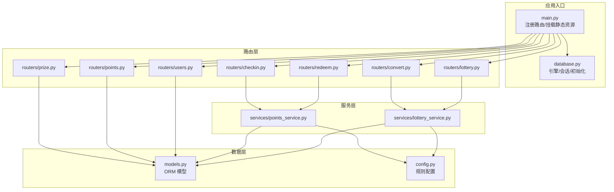
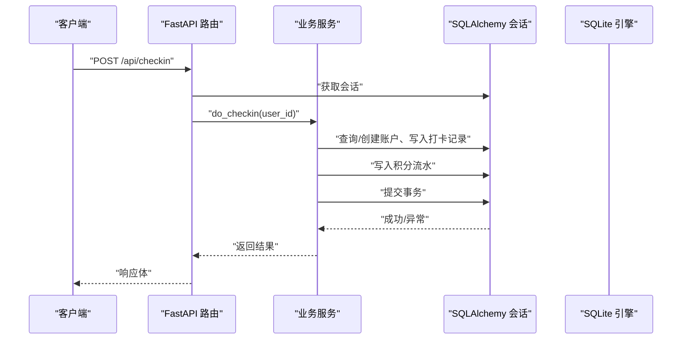
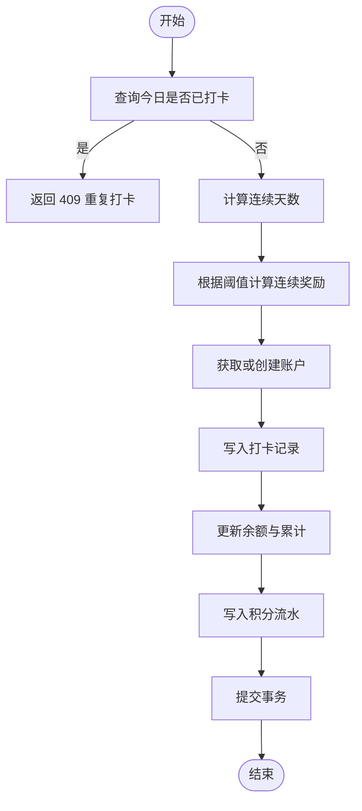
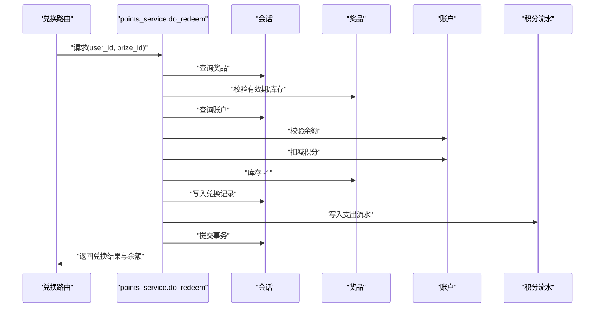
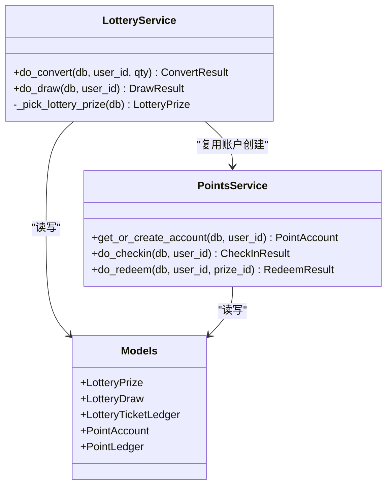
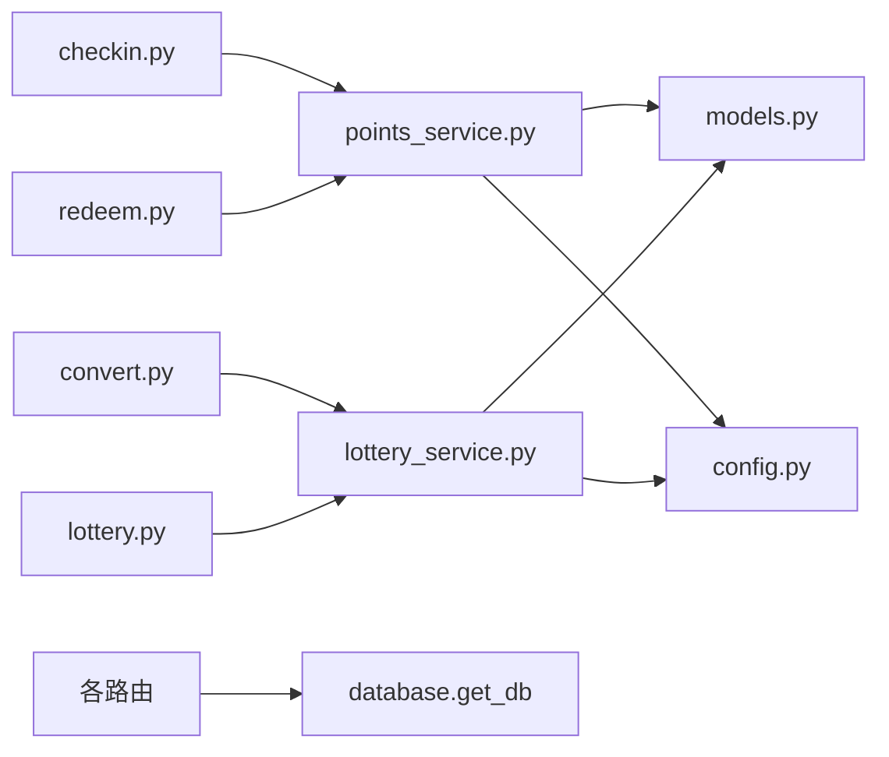

# 核心功能模块

<cite>
**本文引用的文件**   
- [main.py](file://points-system/backend/app/main.py)
- [models.py](file://points-system/backend/app/models.py)
- [schemas.py](file://points-system/backend/app/schemas.py)
- [config.py](file://points-system/backend/app/config.py)
- [database.py](file://points-system/backend/app/database.py)
- [points_service.py](file://points-system/backend/app/services/points_service.py)
- [lottery_service.py](file://points-system/backend/app/services/lottery_service.py)
- [checkin.py](file://points-system/backend/app/routers/checkin.py)
- [redeem.py](file://points-system/backend/app/routers/redeem.py)
- [convert.py](file://points-system/backend/app/routers/convert.py)
- [lottery.py](file://points-system/backend/app/routers/lottery.py)
- [prize.py](file://points-system/backend/app/routers/prize.py)
- [points.py](file://points-system/backend/app/routers/points.py)
- [users.py](file://points-system/backend/app/routers/users.py)
- [seed.py](file://points-system/backend/backend/seed.py)
</cite>

## 目录
1. [简介](#简介)
2. [项目结构](#项目结构)
3. [核心组件](#核心组件)
4. [架构总览](#架构总览)
5. [详细组件分析](#详细组件分析)
6. [依赖关系分析](#依赖关系分析)
7. [性能与并发](#性能与并发)
8. [故障排查指南](#故障排查指南)
9. [结论](#结论)
10. [附录：API 参考](#附录api-参考)

## 简介
本文件聚焦积分兑换系统的核心功能模块，围绕以下目标展开：
- 积分账户管理：积分计算规则、连续打卡奖励、账户流水对账机制。
- 抽奖服务：加权随机算法、奖品库存管理、抽奖资格校验。
- 数据模型与约束：实体关系映射、业务规则约束。
- 事务与一致性：单事务原子性、并发控制策略、SQLite 优化。
- 性能优化：WAL 模式、忙等待、进程内锁、索引设计。
- 使用示例与场景：通过 API 调用路径与流程图帮助开发者理解实现原理。

## 项目结构
后端采用 FastAPI + SQLAlchemy（SQLite）的轻量架构，路由层薄封装，核心业务集中在 services 层；数据模型集中定义在 models 层，配置项集中于 config 层。



图表来源
- [main.py:1-33](file://points-system/backend/app/main.py#L1-L33)
- [database.py:1-39](file://points-system/backend/app/database.py#L1-L39)
- [points_service.py:1-146](file://points-system/backend/app/services/points_service.py#L1-L146)
- [lottery_service.py:1-174](file://points-system/backend/app/services/lottery_service.py#L1-L174)
- [models.py:1-151](file://points-system/backend/app/models.py#L1-L151)
- [config.py:1-17](file://points-system/backend/app/config.py#L1-L17)

章节来源
- [main.py:1-33](file://points-system/backend/app/main.py#L1-L33)
- [database.py:1-39](file://points-system/backend/app/database.py#L1-L39)

## 核心组件
- 路由层：提供 RESTful 接口，负责参数校验、用户存在性检查、结果序列化。
- 服务层：封装积分与抽奖的核心业务逻辑，保证事务原子性与并发安全。
- 数据层：基于 SQLAlchemy 的 ORM 模型，定义表结构与约束。
- 配置层：集中管理打卡积分、连续奖励、兑换比例等规则。
- 数据库层：SQLite 引擎、WAL 模式、忙等待、会话生命周期管理。

章节来源
- [points_service.py:1-146](file://points-system/backend/app/services/points_service.py#L1-L146)
- [lottery_service.py:1-174](file://points-system/backend/app/services/lottery_service.py#L1-L174)
- [models.py:1-151](file://points-system/backend/app/models.py#L1-L151)
- [config.py:1-17](file://points-system/backend/app/config.py#L1-L17)
- [database.py:1-39](file://points-system/backend/app/database.py#L1-L39)

## 架构总览
系统遵循“路由薄、服务厚”的分层设计，所有写操作均在一个 SQLAlchemy Session 事务中完成，确保余额、库存与流水的一致性。



图表来源
- [checkin.py:1-16](file://points-system/backend/app/routers/checkin.py#L1-L16)
- [points_service.py:41-91](file://points-system/backend/app/services/points_service.py#L41-L91)
- [database.py:28-39](file://points-system/backend/app/database.py#L28-L39)

## 详细组件分析

### 数据模型与实体关系
- 用户与账户：User 与 PointAccount 一对一，PointAccount 维护 balance、total_earned、total_spent、lottery_tickets。
- 打卡记录：CheckIn 唯一约束 (user_id, check_date)，防止重复打卡。
- 积分流水：PointLedger 记录每笔收入/支出及变动后余额，便于对账。
- 奖品与兑换：Prize 与 Redemption 一对多，Redemption 快照 cost_points。
- 抽奖券与流水：Conversion 与 LotteryTicketLedger 分别记录积分扣减与券发放。
- 抽奖奖池与记录：LotteryPrize 支持 weight 与 stock（NULL 表示不限量），LotteryDraw 记录每次抽奖结果。

```mermaid
erDiagram
USER {
int id PK
string username UK
string display_name
datetime created_at
}
POINT_ACCOUNT {
int id PK
int user_id FK UK
int balance
int total_earned
int total_spent
int lottery_tickets
datetime updated_at
}
CHECKIN {
int id PK
int user_id FK
date check_date
int points_earned
int streak
int bonus
datetime created_at
}
POINT_LEDGER {
int id PK
int user_id FK
string tx_type
int amount
int balance_after
string ref_type
int ref_id
string note
datetime created_at
}
PRIZE {
int id PK
string name
text description
int cost_points
int stock
datetime valid_from
datetime valid_to
datetime created_at
}
REDEMPTION {
int id PK
int user_id FK
int prize_id FK
int cost_points
string status
datetime created_at
}
CONVERSION {
int id PK
int user_id FK
int qty
int cost_points
string status
datetime created_at
}
LOTTERY_TICKET_LEDGER {
int id PK
int user_id FK
string tx_type
int amount
int balance_after
string ref_type
int ref_id
string note
datetime created_at
}
LOTTERY_PRIZE {
int id PK
string name
text description
int weight
int stock
int is_win
int sort_order
datetime created_at
}
LOTTERY_DRAW {
int id PK
int user_id FK
int prize_id FK
string prize_name
int is_win
datetime created_at
}
USER ||--o{ POINT_ACCOUNT : "拥有"
USER ||--o{ CHECKIN : "打卡"
USER ||--o{ POINT_LEDGER : "流水"
USER ||--o{ REDEMPTION : "兑换"
USER ||--o{ CONVERSION : "兑换券"
USER ||--o{ LOTTERY_TICKET_LEDGER : "券流水"
USER ||--o{ LOTTERY_DRAW : "抽奖记录"
PRIZE ||--o{ REDEMPTION : "被兑换"
LOTTERY_PRIZE ||--o{ LOTTERY_DRAW : "中奖"
```

图表来源
- [models.py:10-151](file://points-system/backend/app/models.py#L10-L151)

章节来源
- [models.py:10-151](file://points-system/backend/app/models.py#L10-L151)

### 积分账户管理与打卡规则
- 连续天数计算：若上次打卡日期为今天的前一天，则 streak+1，否则重置为 1。
- 连续奖励：当 streak 达到阈值时额外奖励积分。
- 防重复打卡：先查后写 + 唯一约束兜底，并发冲突返回 409。
- 事务原子性：打卡记录、账户余额、积分流水在同一事务内提交。



图表来源
- [points_service.py:27-91](file://points-system/backend/app/services/points_service.py#L27-L91)
- [config.py:1-17](file://points-system/backend/app/config.py#L1-L17)

章节来源
- [points_service.py:27-91](file://points-system/backend/app/services/points_service.py#L27-L91)
- [config.py:1-17](file://points-system/backend/app/config.py#L1-L17)

### 积分兑换与库存一致性
- 有效期与库存校验：未开始/已过期/库存不足直接拒绝。
- 余额校验：账户余额不足拒绝兑换。
- 事务原子性：同一事务内扣减库存与积分，并写入兑换记录与积分支出流水。



图表来源
- [redeem.py:11-28](file://points-system/backend/app/routers/redeem.py#L11-L28)
- [points_service.py:94-146](file://points-system/backend/app/services/points_service.py#L94-L146)

章节来源
- [redeem.py:11-28](file://points-system/backend/app/routers/redeem.py#L11-L28)
- [points_service.py:94-146](file://points-system/backend/app/services/points_service.py#L94-L146)

### 抽奖服务：加权随机与库存管理
- 加权随机：从可发放奖池中按权重随机选择，stock 为 NULL 视为不限量。
- 库存管理：有限库存奖品在抽奖成功后扣减库存。
- 资格校验：account.lottery_tickets ≥ TICKETS_PER_DRAW 才允许抽奖。
- 事务原子性：扣券、选奖、扣库存、写记录与券消耗流水在同一事务内完成。



图表来源
- [lottery_service.py:30-174](file://points-system/backend/app/services/lottery_service.py#L30-L174)
- [points_service.py:18-24](file://points-system/backend/app/services/points_service.py#L18-L24)
- [models.py:125-151](file://points-system/backend/app/models.py#L125-L151)

章节来源
- [lottery_service.py:101-174](file://points-system/backend/app/services/lottery_service.py#L101-L174)
- [lottery.py:24-37](file://points-system/backend/app/routers/lottery.py#L24-L37)

### 积分兑换抽奖券流程
- 兑换数量校验：qty ≥ 1。
- 最低门槛与余额校验：至少满足 1 张券所需积分，且余额足够本次兑换。
- 事务原子性：扣积分、加券、写积分支出流水与券发放流水。

```mermaid
sequenceDiagram
participant API as "兑换路由"
participant SVC as "lottery_service.do_convert"
participant DB as "会话"
participant ACC as "账户"
participant CONV as "兑换记录"
participant PLED as "积分流水"
case TLED as "券流水"
API->>SVC : "请求(user_id, qty)"
SVC->>ACC : "获取或创建账户"
SVC->>ACC : "校验最低门槛与余额"
SVC->>ACC : "扣积分、加券"
SVC->>CONV : "写入兑换记录"
SVC->>PLED : "写入积分支出流水"
SVC->>TLED : "写入券发放流水"
SVC->>DB : "提交事务"
SVC-->>API : "返回兑换结果、余额、券数"
```

图表来源
- [convert.py:11-28](file://points-system/backend/app/routers/convert.py#L11-L28)
- [lottery_service.py:30-98](file://points-system/backend/app/services/lottery_service.py#L30-L98)

章节来源
- [convert.py:11-28](file://points-system/backend/app/routers/convert.py#L11-L28)
- [lottery_service.py:30-98](file://points-system/backend/app/services/lottery_service.py#L30-L98)

### 前端看板聚合接口
- 一次性返回用户信息、账户余额、连续天数、奖品列表（含 can_redeem）、兑换/券流水、抽奖记录与奖池配置。
- 简化前端多次请求，提升用户体验。

章节来源
- [users.py:30-192](file://points-system/backend/app/routers/users.py#L30-L192)

## 依赖关系分析
- 路由到服务：各路由仅做参数校验与结果包装，核心逻辑下沉至服务层。
- 服务到模型：服务层通过 ORM 访问数据层，避免在路由中直接操作数据库。
- 配置依赖：服务层读取 config 中的规则常量，便于统一调整。
- 数据库依赖：统一通过 database.get_db 获取会话，并在 finally 中关闭。



图表来源
- [checkin.py:1-16](file://points-system/backend/app/routers/checkin.py#L1-L16)
- [redeem.py:1-52](file://points-system/backend/app/routers/redeem.py#L1-L52)
- [convert.py:1-64](file://points-system/backend/app/routers/convert.py#L1-L64)
- [lottery.py:1-55](file://points-system/backend/app/routers/lottery.py#L1-L55)
- [points_service.py:1-146](file://points-system/backend/app/services/points_service.py#L1-L146)
- [lottery_service.py:1-174](file://points-system/backend/app/services/lottery_service.py#L1-L174)
- [models.py:1-151](file://points-system/backend/app/models.py#L1-L151)
- [config.py:1-17](file://points-system/backend/app/config.py#L1-L17)
- [database.py:28-39](file://points-system/backend/app/database.py#L28-L39)

章节来源
- [main.py:22-29](file://points-system/backend/app/main.py#L22-L29)
- [database.py:28-39](file://points-system/backend/app/database.py#L28-L39)

## 性能与并发
- SQLite WAL 模式：提高并发读能力，减少写阻塞。
- busy_timeout：设置写忙等待时间，降低竞争失败概率。
- 进程内锁：针对单进程多线程场景，使用 threading.Lock 串行化「读-改-写」，避免丢失更新。
- 索引设计：对高频查询字段建立索引（如 user_id、created_at、check_date）。
- 建议：多实例部署时改用数据库悲观锁（如 PostgreSQL with_for_update）替代进程内锁。

章节来源
- [database.py:16-23](file://points-system/backend/app/database.py#L16-L23)
- [lottery_service.py:23-27](file://points-system/backend/app/services/lottery_service.py#L23-L27)

## 故障排查指南
- 重复打卡：返回 409，检查唯一约束与并发重试逻辑。
- 积分不足：返回 400，核对余额与兑换比例配置。
- 库存不足：返回 409，确认库存扣减与事务提交顺序。
- 抽奖券不足：返回 409，确认兑换流程是否正确写入券流水。
- 数据库忙错误：检查 WAL 与 busy_timeout 配置，必要时增加超时或降级重试。

章节来源
- [points_service.py:77-83](file://points-system/backend/app/services/points_service.py#L77-L83)
- [lottery_service.py:87-92](file://points-system/backend/app/services/lottery_service.py#L87-L92)
- [lottery_service.py:161-166](file://points-system/backend/app/services/lottery_service.py#L161-L166)

## 结论
本系统以清晰的分层设计与严格的事务边界保障数据一致性；通过 WAL 与进程内锁缓解 SQLite 并发瓶颈；以流水表支撑对账与审计；以配置驱动的规则便于扩展与调优。建议在多实例部署下引入数据库级悲观锁进一步提升强一致性与吞吐。

## 附录：API 参考
- 打卡
  - POST /api/checkin
  - 输入：user_id
  - 输出：打卡记录、获得积分、连续奖励、连续天数、余额
- 积分查询
  - GET /api/points?user_id=...
  - 输出：账户余额、累计收支、更新时间
- 积分流水
  - GET /api/ledger?user_id=...&limit=...
  - 输出：最近 N 条流水
- 奖品列表
  - GET /api/prizes?user_id=...
  - 输出：奖品详情与 can_redeem 标记
- 积分兑换
  - POST /api/redeem
  - 输入：user_id, prize_id
  - 输出：兑换记录、余额
- 兑换记录
  - GET /api/redemptions?user_id=...
  - 输出：用户兑换历史
- 积分兑换抽奖券
  - POST /api/convert
  - 输入：user_id, qty
  - 输出：兑换记录、余额、券数
- 兑换记录与券流水
  - GET /api/conversions?user_id=...
  - GET /api/ticket-ledger?user_id=...
- 抽奖
  - GET /api/lottery/pool
  - POST /api/lottery/draw
  - GET /api/lottery/draws?user_id=...
- 用户注册与看板
  - POST /api/register
  - GET /api/dashboard?user_id=...

章节来源
- [checkin.py:11-15](file://points-system/backend/app/routers/checkin.py#L11-L15)
- [points.py:10-27](file://points-system/backend/app/routers/points.py#L10-L27)
- [prize.py:11-41](file://points-system/backend/app/routers/prize.py#L11-L41)
- [redeem.py:11-51](file://points-system/backend/app/routers/redeem.py#L11-L51)
- [convert.py:11-63](file://points-system/backend/app/routers/convert.py#L11-L63)
- [lottery.py:11-54](file://points-system/backend/app/routers/lottery.py#L11-L54)
- [users.py:11-22](file://points-system/backend/app/routers/users.py#L11-L22)
- [users.py:30-192](file://points-system/backend/app/routers/users.py#L30-L192)