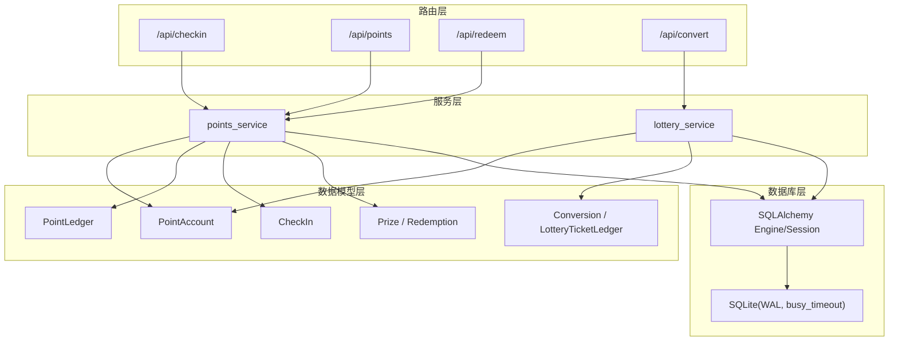
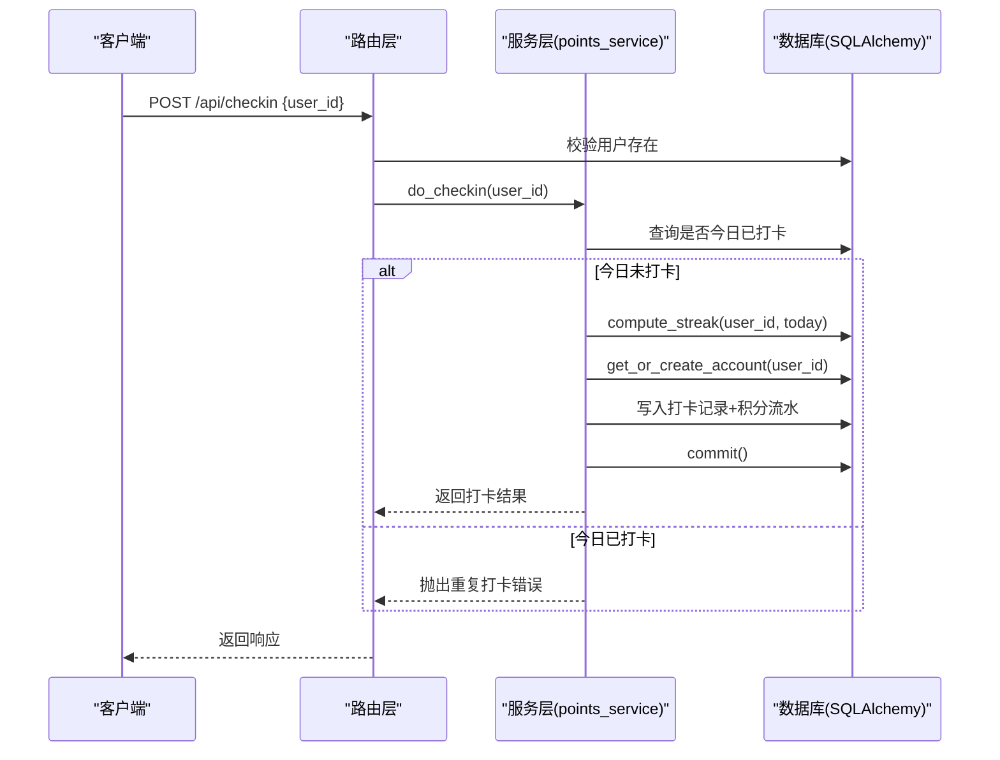
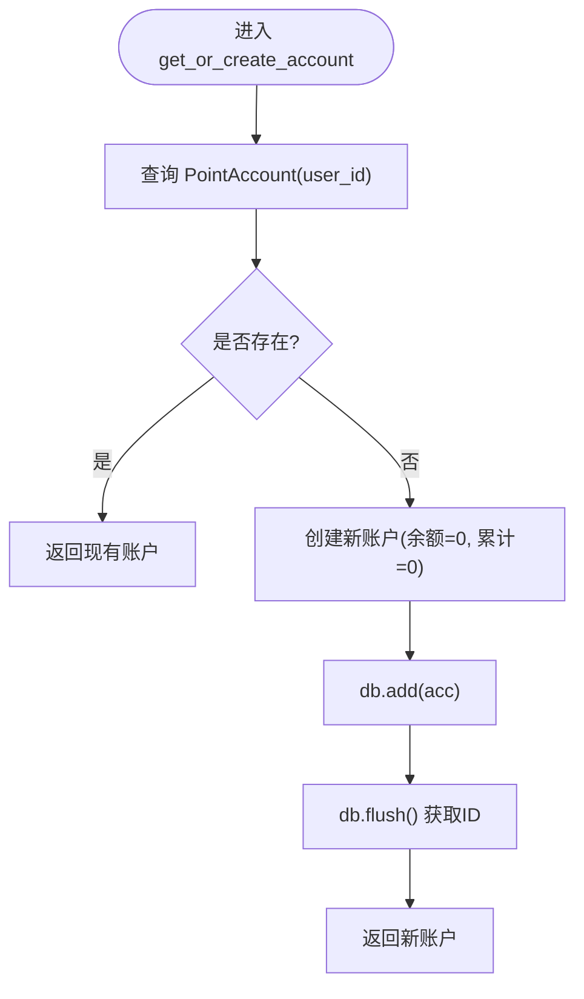
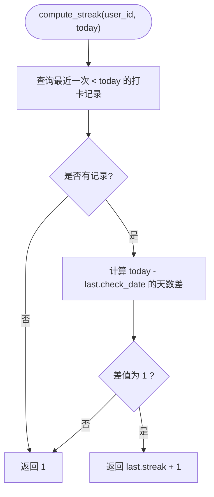
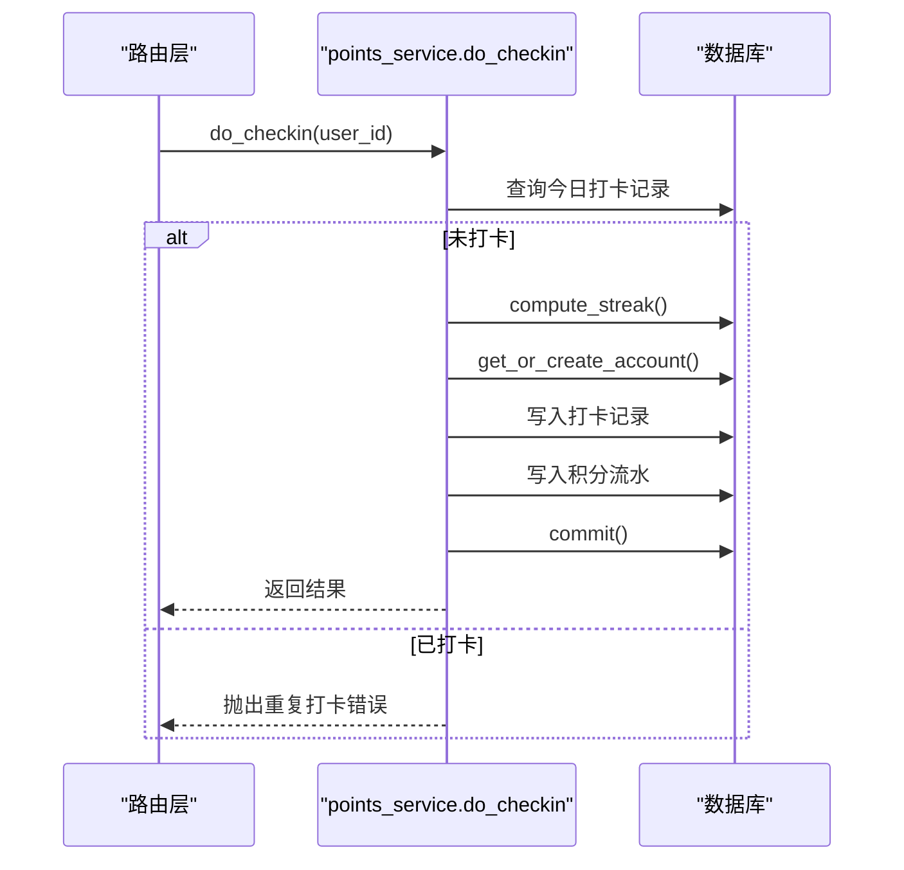
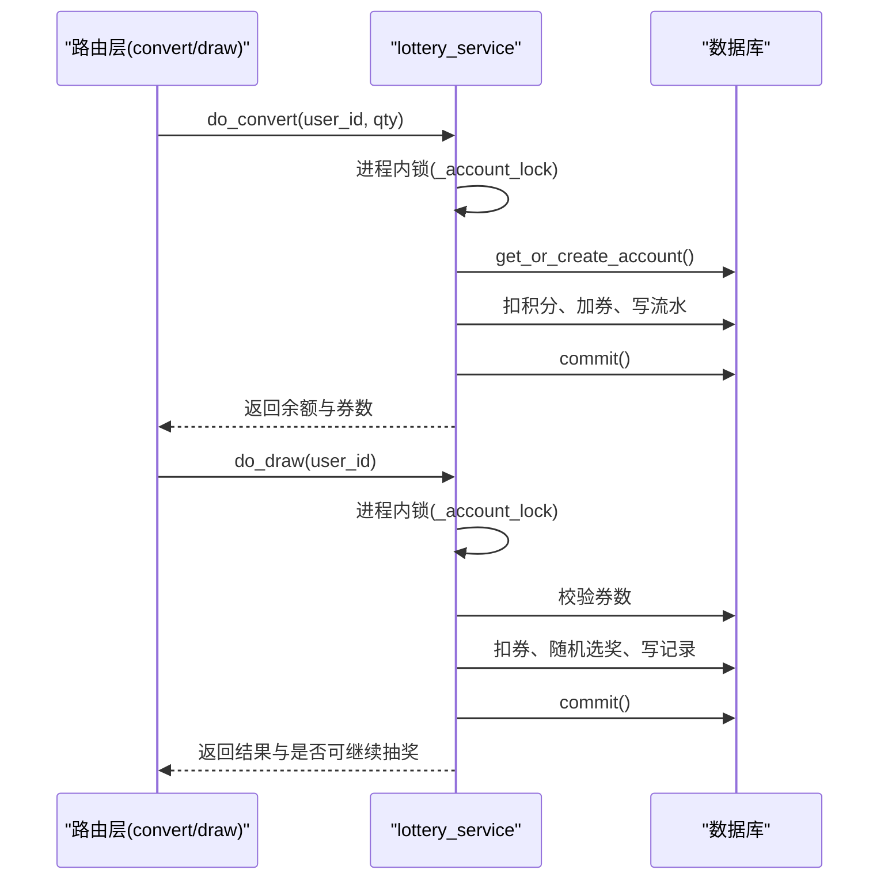
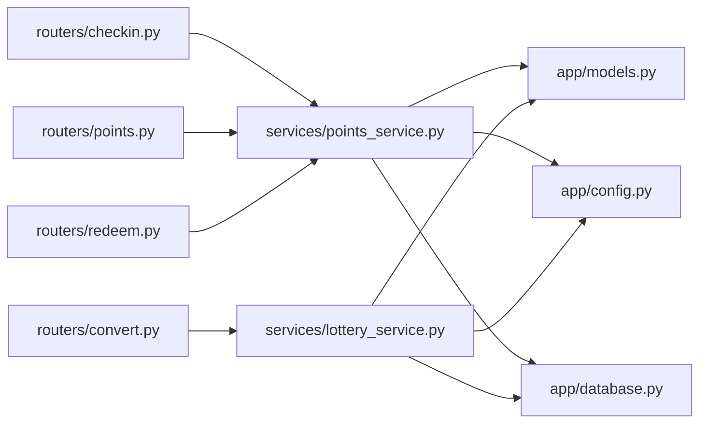

# 积分账户管理

<cite>
**本文引用的文件列表**
- [models.py](file://points-system/backend/app/models.py)
- [points_service.py](file://points-system/backend/app/services/points_service.py)
- [lottery_service.py](file://points-system/backend/app/services/lottery_service.py)
- [config.py](file://points-system/backend/app/config.py)
- [database.py](file://points-system/backend/app/database.py)
- [checkin.py](file://points-system/backend/app/routers/checkin.py)
- [points.py](file://points-system/backend/app/routers/points.py)
- [redeem.py](file://points-system/backend/app/routers/redeem.py)
- [convert.py](file://points-system/backend/app/routers/convert.py)
</cite>

## 目录
1. [简介](#简介)
2. [项目结构](#项目结构)
3. [核心组件](#核心组件)
4. [架构总览](#架构总览)
5. [详细组件分析](#详细组件分析)
6. [依赖关系分析](#依赖关系分析)
7. [性能与并发特性](#性能与并发特性)
8. [故障排查指南](#故障排查指南)
9. [结论](#结论)
10. [附录：最佳实践与示例路径](#附录最佳实践与示例路径)

## 简介
本文件面向“积分账户管理系统”，聚焦以下目标：
- 深入解析积分账户的创建、查询与更新机制，特别是 get_or_create_account 的实现原理。
- 详细说明连续打卡天数的计算逻辑 compute_streak，以及连续奖励的计算规则与配置参数。
- 文档化积分账户的数据模型设计，包括余额、累计获得、累计消费等字段的含义与维护策略。
- 提供具体代码示例路径，展示账户操作的最佳实践，涵盖并发安全处理与事务管理机制。

## 项目结构
后端采用 FastAPI + SQLAlchemy（SQLite）实现，分层清晰：
- 路由层：负责请求校验与响应封装
- 服务层：承载业务逻辑（打卡、兑换、抽奖券转换、抽奖）
- 数据模型层：定义表结构与关系
- 数据库层：连接、会话、初始化与 SQLite 并发优化

图表来源
- [checkin.py:1-16](file://points-system/backend/app/routers/checkin.py#L1-L16)
- [points.py:1-28](file://points-system/backend/app/routers/points.py#L1-L28)
- [redeem.py:1-52](file://points-system/backend/app/routers/redeem.py#L1-L52)
- [convert.py:1-64](file://points-system/backend/app/routers/convert.py#L1-L64)
- [points_service.py:1-146](file://points-system/backend/app/services/points_service.py#L1-L146)
- [lottery_service.py:1-174](file://points-system/backend/app/services/lottery_service.py#L1-L174)
- [models.py:1-151](file://points-system/backend/app/models.py#L1-L151)
- [database.py:1-39](file://points-system/backend/app/database.py#L1-L39)

章节来源
- [checkin.py:1-16](file://points-system/backend/app/routers/checkin.py#L1-L16)
- [points.py:1-28](file://points-system/backend/app/routers/points.py#L1-L28)
- [redeem.py:1-52](file://points-system/backend/app/routers/redeem.py#L1-L52)
- [convert.py:1-64](file://points-system/backend/app/routers/convert.py#L1-L64)
- [points_service.py:1-146](file://points-system/backend/app/services/points_service.py#L1-L146)
- [lottery_service.py:1-174](file://points-system/backend/app/services/lottery_service.py#L1-L174)
- [models.py:1-151](file://points-system/backend/app/models.py#L1-L151)
- [database.py:1-39](file://points-system/backend/app/database.py#L1-L39)

## 核心组件
- 积分账户 PointAccount：每个用户一行，维护当前可用积分 balance、累计获得 total_earned、累计支出 total_spent、抽奖券数量 lottery_tickets 及更新时间 updated_at。
- 积分流水 PointLedger：记录每笔收入/支出，包含变动后余额 balance_after，用于对账与审计。
- 打卡记录 CheckIn：每日一条，记录本次获得积分 points_earned、截至当天的连续天数 streak、连续奖励 bonus。
- 奖品与兑换 Prize/Redemption：支持有效期、库存控制与积分扣减。
- 积分换抽奖券 Conversion 与抽奖券流水 LotteryTicketLedger：记录积分消耗与券发放。
- 抽奖相关 LotteryPrize/LotteryDraw：按权重随机选奖并记录结果。

章节来源
- [models.py:20-151](file://points-system/backend/app/models.py#L20-L151)

## 架构总览
系统以“事务内原子性”为核心保障，所有读-改-写在同一 Session 事务中完成；结合唯一约束与异常捕获，确保并发场景下的数据一致性。

图表来源
- [checkin.py:11-16](file://points-system/backend/app/routers/checkin.py#L11-L16)
- [points_service.py:41-91](file://points-system/backend/app/services/points_service.py#L41-L91)
- [database.py:28-33](file://points-system/backend/app/database.py#L28-L33)

## 详细组件分析

### 数据模型设计与字段维护策略
- PointAccount
  - user_id：唯一关联用户，保证每人一个账户
  - balance：当前可用积分，随 earn/spend 变更
  - total_earned：历史累计获得，仅增不减
  - total_spent：历史累计支出，仅增不减
  - lottery_tickets：当前抽奖券数量，≥1 即解锁抽奖权限
  - updated_at：自动更新时间戳
- PointLedger
  - tx_type：earn/spend
  - amount：变动数量（正数）
  - balance_after：变动后的余额，便于对账
  - ref_type/ref_id：关联业务主键（如 checkin/redemption/convert/draw）
- CheckIn
  - check_date：自然日，配合唯一约束防重复打卡
  - points_earned：本次获得积分（基础+连续奖励）
  - streak：截至当天连续打卡天数
  - bonus：本次连续奖励积分
- Prize/Redemption
  - cost_points：兑换所需积分
  - stock：剩余库存
  - valid_from/valid_to：有效期控制
- Conversion/LotteryTicketLedger
  - qty/cost_points：兑换数量与消耗积分快照
  - tx_type：issue/consume
  - balance_after：券余额快照

维护策略要点
- 所有余额与累计值在同一个事务内更新，避免半更新
- 通过流水表记录每次变动后的余额，支持对账与审计
- 使用唯一约束与异常捕获双重保护并发安全

章节来源
- [models.py:20-151](file://points-system/backend/app/models.py#L20-L151)

### get_or_create_account 实现原理
- 功能：若用户无积分账户则创建初始账户（balance=0, total_earned=0, total_spent=0），否则直接返回已有账户
- 关键点：
  - 先查后写，减少不必要的插入
  - flush 后立即获取对象 ID，便于后续流水关联
  - 作为通用入口被多处复用（打卡、兑换、抽奖券转换）

图表来源
- [points_service.py:18-24](file://points-system/backend/app/services/points_service.py#L18-L24)

章节来源
- [points_service.py:18-24](file://points-system/backend/app/services/points_service.py#L18-L24)

### compute_streak 连续打卡天数计算逻辑
- 输入：用户ID、今天日期
- 逻辑：
  - 查询该用户今天之前的最近一次打卡记录
  - 如果上次打卡日期恰好是昨天，则连续天数 = 上次 streak + 1
  - 否则重置为 1（断签或首次打卡）
- 输出：截至今天的连续打卡天数

图表来源
- [points_service.py:27-38](file://points-system/backend/app/services/points_service.py#L27-L38)

章节来源
- [points_service.py:27-38](file://points-system/backend/app/services/points_service.py#L27-L38)

### 连续奖励计算规则与配置参数
- 基础积分：POINTS_PER_CHECKIN
- 连续奖励：POINTS_STREAK_BONUS
- 触发周期：STREAK_BONUS_EVERY（例如每 7 天）
- 规则：当 streak % STREAK_BONUS_EVERY == 0 时，额外获得 POINTS_STREAK_BONUS 积分；否则无连续奖励
- 总获得积分：POINTS_PER_CHECKIN + bonus

章节来源
- [points_service.py:49-51](file://points-system/backend/app/services/points_service.py#L49-L51)
- [config.py:1-17](file://points-system/backend/app/config.py#L1-L17)

### 打卡流程与事务管理
- 步骤：
  - 校验用户存在
  - 检查今日是否已打卡（防重复）
  - 计算 streak 与 bonus，得到本次获得积分 total
  - 获取或创建账户，写入打卡记录与积分流水
  - 提交事务；若发生唯一约束冲突，回滚并返回重复打卡错误
- 并发安全：
  - 业务层先查后写 + 数据库唯一约束兜底
  - IntegrityError 捕获并回滚，返回 409

图表来源
- [checkin.py:11-16](file://points-system/backend/app/routers/checkin.py#L11-L16)
- [points_service.py:41-91](file://points-system/backend/app/services/points_service.py#L41-L91)

章节来源
- [checkin.py:11-16](file://points-system/backend/app/routers/checkin.py#L11-L16)
- [points_service.py:41-91](file://points-system/backend/app/services/points_service.py#L41-L91)

### 积分查询与流水查询
- 查询账户：GET /api/points?user_id=...
- 查询流水：GET /api/ledger?user_id=...&limit=50（按时间倒序）

章节来源
- [points.py:10-27](file://points-system/backend/app/routers/points.py#L10-L27)

### 积分兑换与事务管理
- 步骤：
  - 校验用户存在
  - 校验奖品存在、有效期、库存、账户余额
  - 同一事务内扣减积分与库存，写入兑换记录与积分流水
  - 提交事务并刷新结果
- 并发安全：
  - 单事务原子性；SQLite 下行锁有限，依赖事务边界与 commit 原子性
  - 注释建议：PostgreSQL 可加 with_for_update() 悲观锁

章节来源
- [redeem.py:11-28](file://points-system/backend/app/routers/redeem.py#L11-L28)
- [points_service.py:94-145](file://points-system/backend/app/services/points_service.py#L94-L145)

### 积分兑换抽奖券与抽奖流程
- 积分兑换抽奖券：
  - 校验用户存在与数量合法性
  - 进程内锁 _account_lock 串行化读-改-写，防止 SQLite 丢失更新
  - 同事务内扣积分、加券，写入积分支出流水与券发放流水
- 抽奖：
  - 校验抽奖券数量 ≥ TICKETS_PER_DRAW
  - 同事务内扣券、加权随机选奖、扣库存（如有）、写抽奖记录与券消耗流水
  - 返回剩余券数与是否仍可抽奖（由券余额派生）

图表来源
- [convert.py:11-28](file://points-system/backend/app/routers/convert.py#L11-L28)
- [lottery_service.py:30-98](file://points-system/backend/app/services/lottery_service.py#L30-L98)
- [lottery_service.py:117-173](file://points-system/backend/app/services/lottery_service.py#L117-L173)

章节来源
- [convert.py:11-28](file://points-system/backend/app/routers/convert.py#L11-L28)
- [lottery_service.py:30-98](file://points-system/backend/app/services/lottery_service.py#L30-L98)
- [lottery_service.py:117-173](file://points-system/backend/app/services/lottery_service.py#L117-L173)

## 依赖关系分析
- 路由层依赖服务层进行业务处理
- 服务层依赖数据模型与配置
- 数据库层提供引擎与会话，并对 SQLite 做并发优化（WAL、busy_timeout）

图表来源
- [checkin.py:1-16](file://points-system/backend/app/routers/checkin.py#L1-L16)
- [points.py:1-28](file://points-system/backend/app/routers/points.py#L1-L28)
- [redeem.py:1-52](file://points-system/backend/app/routers/redeem.py#L1-L52)
- [convert.py:1-64](file://points-system/backend/app/routers/convert.py#L1-L64)
- [points_service.py:1-146](file://points-system/backend/app/services/points_service.py#L1-L146)
- [lottery_service.py:1-174](file://points-system/backend/app/services/lottery_service.py#L1-L174)
- [models.py:1-151](file://points-system/backend/app/models.py#L1-L151)
- [config.py:1-17](file://points-system/backend/app/config.py#L1-L17)
- [database.py:1-39](file://points-system/backend/app/database.py#L1-L39)

章节来源
- [checkin.py:1-16](file://points-system/backend/app/routers/checkin.py#L1-L16)
- [points.py:1-28](file://points-system/backend/app/routers/points.py#L1-L28)
- [redeem.py:1-52](file://points-system/backend/app/routers/redeem.py#L1-L52)
- [convert.py:1-64](file://points-system/backend/app/routers/convert.py#L1-L64)
- [points_service.py:1-146](file://points-system/backend/app/services/points_service.py#L1-L146)
- [lottery_service.py:1-174](file://points-system/backend/app/services/lottery_service.py#L1-L174)
- [models.py:1-151](file://points-system/backend/app/models.py#L1-L151)
- [config.py:1-17](file://points-system/backend/app/config.py#L1-L17)
- [database.py:1-39](file://points-system/backend/app/database.py#L1-L39)

## 性能与并发特性
- SQLite 并发优化：
  - WAL 日志模式提升并发读取能力
  - busy_timeout 降低写忙等待失败概率
- 事务边界：
  - 所有读-改-写在同一 Session 事务内，commit 前不持久化，异常统一 rollback
- 进程内锁：
  - 针对 SQLite 的丢失更新风险，在抽奖券转换与抽奖中使用 threading.Lock 串行化关键段
- 索引与唯一约束：
  - 高频查询字段建立索引（如 created_at、user_id）
  - 唯一约束（user_id, check_date）兜底重复打卡

章节来源
- [database.py:16-23](file://points-system/backend/app/database.py#L16-L23)
- [lottery_service.py:23-27](file://points-system/backend/app/services/lottery_service.py#L23-L27)
- [points_service.py:77-82](file://points-system/backend/app/services/points_service.py#L77-L82)

## 故障排查指南
- 重复打卡
  - 现象：返回 409 重复打卡错误
  - 原因：业务层先查后写 + 唯一约束拦截
  - 处理：确认请求时间是否为同日；必要时重试
- 积分不足
  - 现象：返回 400 积分不足错误
  - 原因：余额不足以支付兑换或抽奖券转换
  - 处理：增加积分或调整兑换数量
- 库存不足或过期
  - 现象：返回 409/400 库存不足或过期错误
  - 原因：prize.stock ≤ 0 或不在有效期内
  - 处理：检查奖品配置与时间窗口
- 并发冲突
  - 现象：返回 409 处理冲突错误
  - 原因：并发导致 IntegrityError
  - 处理：提示用户稍后重试；考虑迁移到 PostgreSQL 并使用悲观锁

章节来源
- [points_service.py:77-82](file://points-system/backend/app/services/points_service.py#L77-L82)
- [points_service.py:94-145](file://points-system/backend/app/services/points_service.py#L94-L145)
- [lottery_service.py:87-91](file://points-system/backend/app/services/lottery_service.py#L87-L91)
- [lottery_service.py:161-165](file://points-system/backend/app/services/lottery_service.py#L161-L165)

## 结论
本系统通过“事务内原子性 + 唯一约束 + 进程内锁”的组合策略，在 SQLite 环境下实现了可靠的积分账户管理与打卡、兑换、抽奖券转换与抽奖流程。数据模型设计清晰，字段维护策略明确，具备良好可追溯性与对账能力。生产环境建议评估数据库升级至 PostgreSQL 以获得更强的并发与锁控制能力。

## 附录：最佳实践与示例路径
- 账户创建与获取
  - 参考路径：[get_or_create_account:18-24](file://points-system/backend/app/services/points_service.py#L18-L24)
- 连续打卡与奖励计算
  - 参考路径：[compute_streak:27-38](file://points-system/backend/app/services/points_service.py#L27-L38)、[do_checkin:41-91](file://points-system/backend/app/services/points_service.py#L41-L91)、[配置参数:1-17](file://points-system/backend/app/config.py#L1-L17)
- 积分查询与流水查询
  - 参考路径：[GET /api/points:10-15](file://points-system/backend/app/routers/points.py#L10-L15)、[GET /api/ledger:18-27](file://points-system/backend/app/routers/points.py#L18-L27)
- 积分兑换
  - 参考路径：[POST /api/redeem:11-28](file://points-system/backend/app/routers/redeem.py#L11-L28)、[do_redeem:94-145](file://points-system/backend/app/services/points_service.py#L94-L145)
- 积分兑换抽奖券与抽奖
  - 参考路径：[POST /api/convert:11-28](file://points-system/backend/app/routers/convert.py#L11-L28)、[do_convert:30-98](file://points-system/backend/app/services/lottery_service.py#L30-L98)、[do_draw:117-173](file://points-system/backend/app/services/lottery_service.py#L117-L173)
- 并发与事务
  - 参考路径：[SQLite 并发优化:16-23](file://points-system/backend/app/database.py#L16-L23)、[进程内锁:23-27](file://points-system/backend/app/services/lottery_service.py#L23-L27)、[IntegrityError 处理:77-82](file://points-system/backend/app/services/points_service.py#L77-L82)