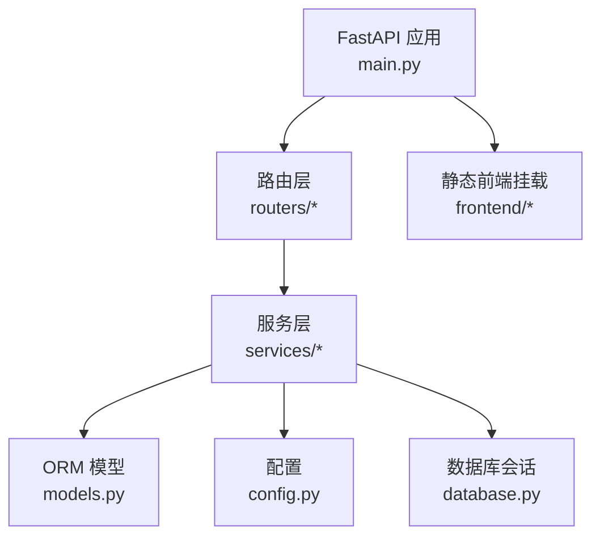
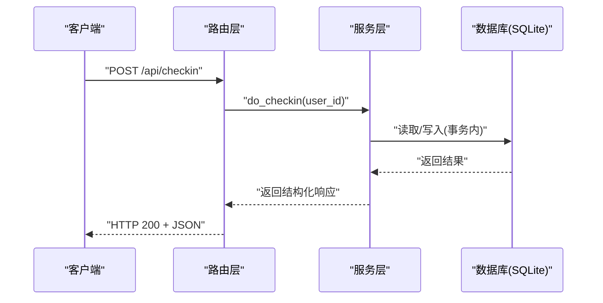
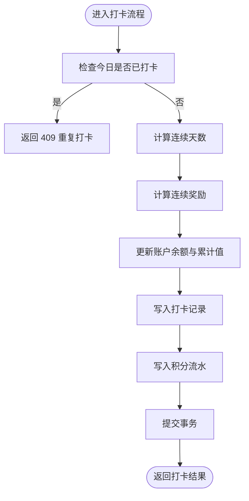
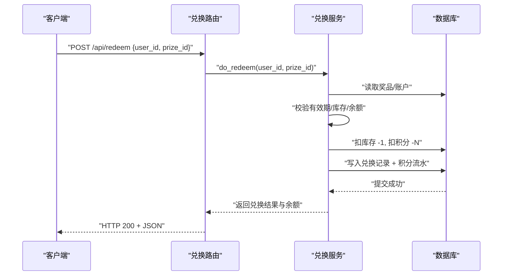
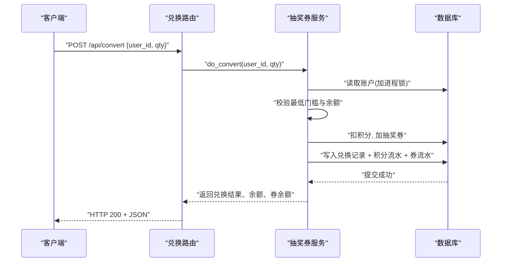
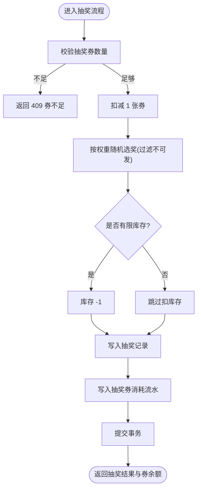
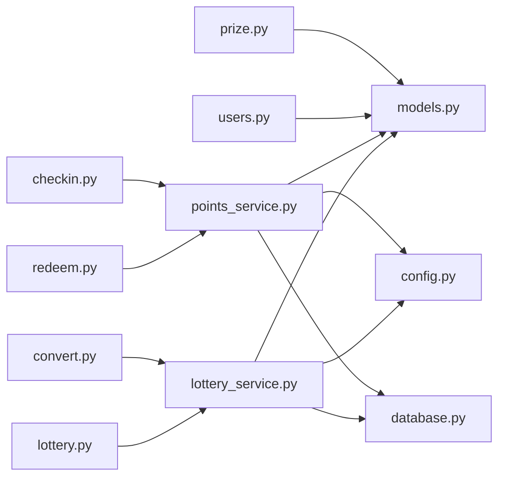
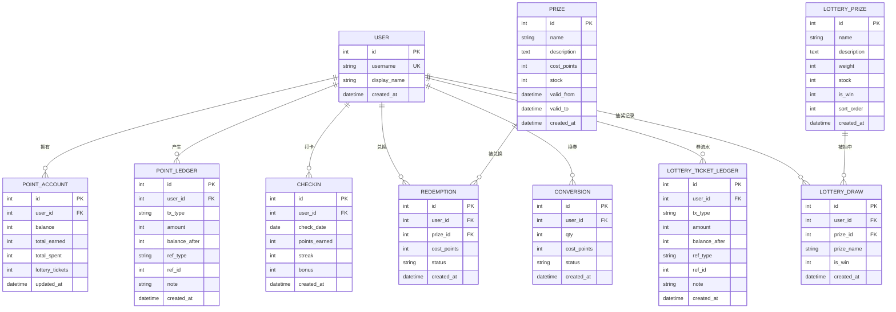

# 积分兑换系统

<cite>
**本文引用的文件**   
- [backend/app/main.py](file://points-system/backend/app/main.py)
- [backend/app/database.py](file://points-system/backend/app/database.py)
- [backend/app/models.py](file://points-system/backend/app/models.py)
- [backend/app/schemas.py](file://points-system/backend/app/schemas.py)
- [backend/app/config.py](file://points-system/backend/app/config.py)
- [backend/app/routers/checkin.py](file://points-system/backend/app/routers/checkin.py)
- [backend/app/routers/points.py](file://points-system/backend/app/routers/points.py)
- [backend/app/routers/prize.py](file://points-system/backend/app/routers/prize.py)
- [backend/app/routers/redeem.py](file://points-system/backend/app/routers/redeem.py)
- [backend/app/routers/users.py](file://points-system/backend/app/routers/users.py)
- [backend/app/routers/convert.py](file://points-system/backend/app/routers/convert.py)
- [backend/app/routers/lottery.py](file://points-system/backend/app/routers/lottery.py)
- [backend/app/services/points_service.py](file://points-system/backend/app/services/points_service.py)
- [backend/app/services/lottery_service.py](file://points-system/backend/app/services/lottery_service.py)
</cite>

## 目录
1. [简介](#简介)
2. [项目结构](#项目结构)
3. [核心组件](#核心组件)
4. [架构总览](#架构总览)
5. [详细组件分析](#详细组件分析)
6. [依赖关系分析](#依赖关系分析)
7. [性能与并发控制](#性能与并发控制)
8. [故障排查指南](#故障排查指南)
9. [结论](#结论)
10. [附录：API 参考与数据模型](#附录api-参考与数据模型)

## 简介
本系统是一个独立的后端服务，提供用户积分账户管理、打卡奖励、积分兑换奖品、积分兑换抽奖券以及加权随机抽奖等能力。系统采用 FastAPI + SQLAlchemy（SQLite）实现，强调事务一致性、流水对账与并发安全。通过配置化的规则驱动打卡奖励与兑换比例，并通过“账户余额派生权限”的设计避免状态不一致问题。

## 项目结构
后端采用分层组织：路由层负责 HTTP 接口定义与参数校验；服务层封装业务逻辑与事务边界；数据模型与 Pydantic Schema 分别描述持久化结构与 API 契约；数据库初始化与连接在独立模块中完成。

图表来源
- [backend/app/main.py:1-33](file://points-system/backend/app/main.py#L1-L33)
- [backend/app/routers/checkin.py:1-16](file://points-system/backend/app/routers/checkin.py#L1-L16)
- [backend/app/services/points_service.py:1-146](file://points-system/backend/app/services/points_service.py#L1-L146)
- [backend/app/database.py:1-39](file://points-system/backend/app/database.py#L1-L39)

章节来源
- [backend/app/main.py:1-33](file://points-system/backend/app/main.py#L1-L33)

## 核心组件
- 路由层：按功能域划分，包括打卡、积分查询、奖品列表、兑换、用户看板、积分换券、抽奖等。
- 服务层：封装事务性操作，保证余额、库存与流水的一致性；实现打卡连续天数计算、积分扣减、库存扣减、加权随机抽奖等核心算法。
- 数据模型：用户、积分账户、积分流水、打卡记录、奖品、兑换记录、积分换券记录、抽奖券流水、抽奖奖池、抽奖记录。
- 配置：打卡基础积分、连续奖励阈值与间隔、积分换券比例、每次抽奖消耗券数。
- 数据库：SQLite，开启 WAL 模式与忙等待，降低并发写冲突概率。

章节来源
- [backend/app/models.py:1-151](file://points-system/backend/app/models.py#L1-L151)
- [backend/app/schemas.py:1-147](file://points-system/backend/app/schemas.py#L1-L147)
- [backend/app/config.py:1-17](file://points-system/backend/app/config.py#L1-L17)
- [backend/app/database.py:1-39](file://points-system/backend/app/database.py#L1-L39)

## 架构总览
整体为典型的 Web 服务架构：客户端调用 RESTful API，路由层进行参数校验后委托服务层执行事务性业务逻辑，最终通过 ORM 写入 SQLite。

图表来源
- [backend/app/routers/checkin.py:11-16](file://points-system/backend/app/routers/checkin.py#L11-L16)
- [backend/app/services/points_service.py:41-91](file://points-system/backend/app/services/points_service.py#L41-L91)
- [backend/app/database.py:28-39](file://points-system/backend/app/database.py#L28-L39)

## 详细组件分析

### 打卡与积分发放
- 防重复打卡：先查当日是否已打卡，再插入；同时以唯一约束兜底并发场景。
- 连续天数计算：若上次打卡日期为昨天则 streak+1，否则重置为 1。
- 奖励规则：基础积分 + 连续奖励（达到阈值且每 N 天触发一次）。
- 原子更新：在同一事务内写入打卡记录、更新账户余额与累计值、写入积分支出流水。

图表来源
- [backend/app/services/points_service.py:41-91](file://points-system/backend/app/services/points_service.py#L41-L91)
- [backend/app/models.py:50-66](file://points-system/backend/app/models.py#L50-L66)

章节来源
- [backend/app/routers/checkin.py:11-16](file://points-system/backend/app/routers/checkin.py#L11-L16)
- [backend/app/services/points_service.py:27-91](file://points-system/backend/app/services/points_service.py#L27-L91)
- [backend/app/models.py:50-66](file://points-system/backend/app/models.py#L50-L66)

### 积分账户与流水对账
- 账户字段：当前可用余额、累计获得、累计支出、抽奖券数量。
- 流水表：每一笔收入或支出均落库，包含变动方向、金额、变动后余额、关联类型与 ID、备注。
- 对账机制：任意时刻可通过 sum(amount) 与 balance_after 序列验证一致性；余额由业务事务维护，流水作为审计依据。

章节来源
- [backend/app/models.py:20-48](file://points-system/backend/app/models.py#L20-L48)
- [backend/app/routers/points.py:10-27](file://points-system/backend/app/routers/points.py#L10-L27)

### 奖品与兑换
- 奖品维度：名称、描述、所需积分、剩余库存、有效期区间。
- 兑换流程：校验奖品存在、有效期、库存、用户积分余额；同一事务内扣减库存与积分，写入兑换记录与积分支出流水。
- 前端展示：可附带 can_redeem 标记，综合库存、有效期与余额判断。

图表来源
- [backend/app/routers/redeem.py:11-28](file://points-system/backend/app/routers/redeem.py#L11-L28)
- [backend/app/services/points_service.py:94-146](file://points-system/backend/app/services/points_service.py#L94-L146)
- [backend/app/models.py:68-94](file://points-system/backend/app/models.py#L68-L94)

章节来源
- [backend/app/routers/prize.py:11-42](file://points-system/backend/app/routers/prize.py#L11-L42)
- [backend/app/routers/redeem.py:11-52](file://points-system/backend/app/routers/redeem.py#L11-L52)
- [backend/app/services/points_service.py:94-146](file://points-system/backend/app/services/points_service.py#L94-L146)

### 积分兑换抽奖券
- 兑换比例：固定比例（POINTS_PER_TICKET），支持批量兑换（qty ≥ 1）。
- 并发控制：进程内锁将读-改-写串行化，避免 SQLite 下丢失更新。
- 原子更新：同一事务内扣积分、加抽奖券，并分别写入积分支出流水与抽奖券发放流水。

图表来源
- [backend/app/routers/convert.py:11-28](file://points-system/backend/app/routers/convert.py#L11-L28)
- [backend/app/services/lottery_service.py:30-98](file://points-system/backend/app/services/lottery_service.py#L30-L98)
- [backend/app/models.py:96-123](file://points-system/backend/app/models.py#L96-L123)

章节来源
- [backend/app/routers/convert.py:11-64](file://points-system/backend/app/routers/convert.py#L11-L64)
- [backend/app/services/lottery_service.py:30-98](file://points-system/backend/app/services/lottery_service.py#L30-L98)

### 加权随机抽奖与库存管理
- 权重选择：从可发放的奖池中按 weight 累加区间随机命中，stock 为 None 表示不限量。
- 库存策略：有限库存奖品在抽奖成功后扣减；未中奖或谢谢参与通常为不限量。
- 并发控制：同进程锁保护抽奖券扣减与结果落库的原子性。
- 权限派生：抽奖权限由 account.lottery_tickets ≥ TICKETS_PER_DRAW 动态决定，无需额外状态位。

图表来源
- [backend/app/services/lottery_service.py:101-174](file://points-system/backend/app/services/lottery_service.py#L101-L174)
- [backend/app/models.py:125-151](file://points-system/backend/app/models.py#L125-L151)

章节来源
- [backend/app/routers/lottery.py:11-55](file://points-system/backend/app/routers/lottery.py#L11-L55)
- [backend/app/services/lottery_service.py:101-174](file://points-system/backend/app/services/lottery_service.py#L101-L174)

### 用户看板聚合
- 一次性返回用户信息、积分余额、累计收支、抽奖券数量、是否可抽奖、最近打卡与连续天数、奖品列表（含 can_redeem）、兑换记录、兑换抽奖券记录、抽奖券流水、抽奖记录、奖池配置等。
- 时间处理：使用 naive UTC 时间与 SQLite 存储保持一致。

章节来源
- [backend/app/routers/users.py:30-192](file://points-system/backend/app/routers/users.py#L30-L192)

## 依赖关系分析
- 路由层依赖服务层与模型、Schema、配置与数据库会话。
- 服务层依赖模型、配置与数据库会话；抽奖服务还依赖线程锁用于单进程并发控制。
- 数据库层提供引擎、会话工厂与初始化函数，并在连接时设置 SQLite 的 WAL 与忙等待。

图表来源
- [backend/app/routers/checkin.py:1-16](file://points-system/backend/app/routers/checkin.py#L1-L16)
- [backend/app/routers/redeem.py:1-52](file://points-system/backend/app/routers/redeem.py#L1-L52)
- [backend/app/routers/convert.py:1-64](file://points-system/backend/app/routers/convert.py#L1-L64)
- [backend/app/routers/lottery.py:1-55](file://points-system/backend/app/routers/lottery.py#L1-L55)
- [backend/app/routers/prize.py:1-42](file://points-system/backend/app/routers/prize.py#L1-L42)
- [backend/app/routers/users.py:1-192](file://points-system/backend/app/routers/users.py#L1-L192)
- [backend/app/services/points_service.py:1-146](file://points-system/backend/app/services/points_service.py#L1-L146)
- [backend/app/services/lottery_service.py:1-174](file://points-system/backend/app/services/lottery_service.py#L1-L174)
- [backend/app/models.py:1-151](file://points-system/backend/app/models.py#L1-L151)
- [backend/app/config.py:1-17](file://points-system/backend/app/config.py#L1-L17)
- [backend/app/database.py:1-39](file://points-system/backend/app/database.py#L1-L39)

## 性能与并发控制
- 数据库层面：SQLite 开启 WAL 日志与 busy_timeout，减少读写阻塞与冲突失败率。
- 进程内并发：使用线程锁将关键路径（积分换券、抽奖）串行化，避免多请求并发导致的丢失更新。
- 事务边界：所有读-改-写均在单一 Session 事务内完成，异常统一回滚，确保一致性与幂等性。
- 扩展建议：多实例部署时改用数据库级悲观锁（如 PostgreSQL 的 with_for_update）替代进程内锁。

章节来源
- [backend/app/database.py:16-23](file://points-system/backend/app/database.py#L16-L23)
- [backend/app/services/lottery_service.py:23-28](file://points-system/backend/app/services/lottery_service.py#L23-L28)
- [backend/app/services/points_service.py:94-146](file://points-system/backend/app/services/points_service.py#L94-L146)

## 故障排查指南
- 重复打卡：返回 409，检查唯一约束与业务层先查后写逻辑。
- 奖品无效：返回 400/404，检查有效期、库存与奖品是否存在。
- 积分不足：返回 400，检查账户余额与兑换比例配置。
- 抽奖券不足：返回 409，检查兑换流程是否正确增加券余额。
- 并发冲突：返回 409，确认事务提交与 IntegrityError 捕获逻辑。

章节来源
- [backend/app/services/points_service.py:77-83](file://points-system/backend/app/services/points_service.py#L77-L83)
- [backend/app/services/points_service.py:94-146](file://points-system/backend/app/services/points_service.py#L94-L146)
- [backend/app/services/lottery_service.py:87-98](file://points-system/backend/app/services/lottery_service.py#L87-L98)
- [backend/app/services/lottery_service.py:161-166](file://points-system/backend/app/services/lottery_service.py#L161-L166)

## 结论
本系统在轻量技术栈上实现了完整的积分账户、兑换与抽奖闭环，通过事务与流水保障数据一致性，结合配置化规则与派生权限设计简化了状态管理。针对 SQLite 的并发限制，提供了进程内锁与数据库层面的优化建议，便于在生产环境平滑扩展。

## 附录：API 参考与数据模型

### RESTful API 概览
- 用户与看板
  - POST /api/register
  - GET /api/users
  - GET /api/dashboard?user_id=...
- 打卡与积分
  - POST /api/checkin
  - GET /api/points?user_id=...
  - GET /api/ledger?user_id=...&limit=...
- 奖品与兑换
  - GET /api/prizes?user_id=...
  - POST /api/redeem
  - GET /api/redemptions?user_id=...
- 积分换券与券流水
  - POST /api/convert
  - GET /api/conversions?user_id=...
  - GET /api/ticket-ledger?user_id=...
- 抽奖
  - GET /api/lottery/pool
  - POST /api/lottery/draw
  - GET /api/lottery/draws?user_id=...

章节来源
- [backend/app/routers/users.py:11-27](file://points-system/backend/app/routers/users.py#L11-L27)
- [backend/app/routers/users.py:30-192](file://points-system/backend/app/routers/users.py#L30-L192)
- [backend/app/routers/checkin.py:11-16](file://points-system/backend/app/routers/checkin.py#L11-L16)
- [backend/app/routers/points.py:10-27](file://points-system/backend/app/routers/points.py#L10-L27)
- [backend/app/routers/prize.py:11-42](file://points-system/backend/app/routers/prize.py#L11-L42)
- [backend/app/routers/redeem.py:11-52](file://points-system/backend/app/routers/redeem.py#L11-L52)
- [backend/app/routers/convert.py:11-64](file://points-system/backend/app/routers/convert.py#L11-L64)
- [backend/app/routers/lottery.py:11-55](file://points-system/backend/app/routers/lottery.py#L11-L55)

### 数据模型关系图

图表来源
- [backend/app/models.py:10-151](file://points-system/backend/app/models.py#L10-L151)

### 配置项说明
- 每次打卡基础积分
- 连续打卡额外奖励
- 连续奖励发放间隔
- 积分兑换抽奖券比例
- 每次抽奖消耗券数

章节来源
- [backend/app/config.py:1-17](file://points-system/backend/app/config.py#L1-L17)