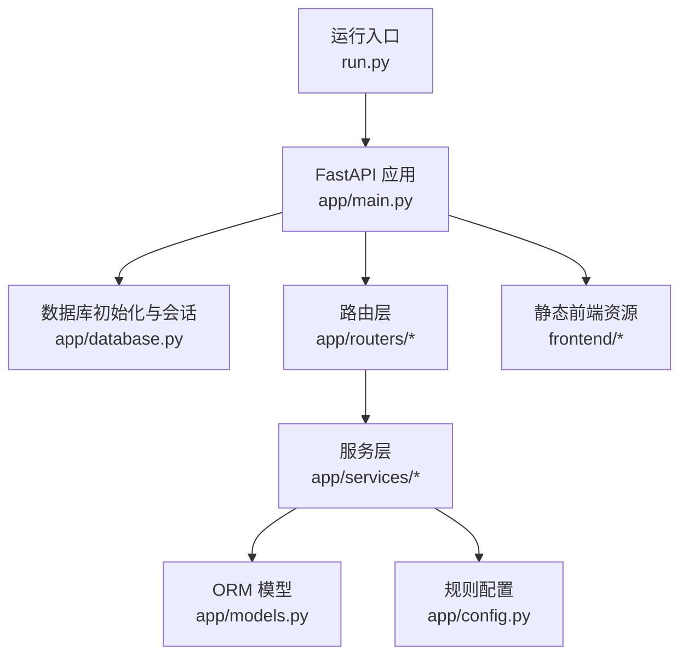
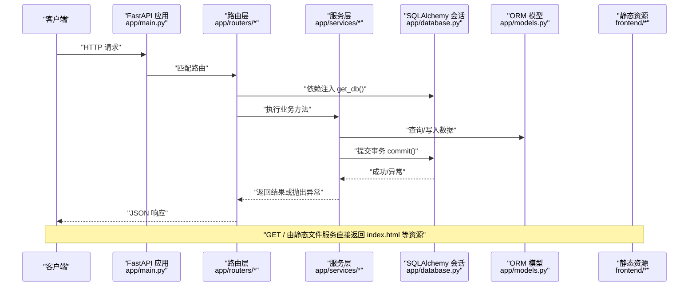
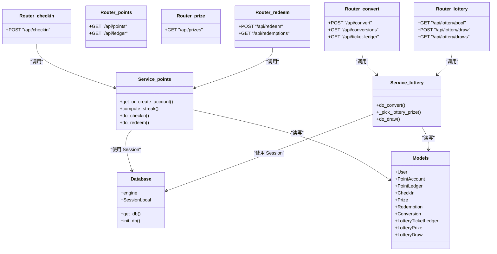
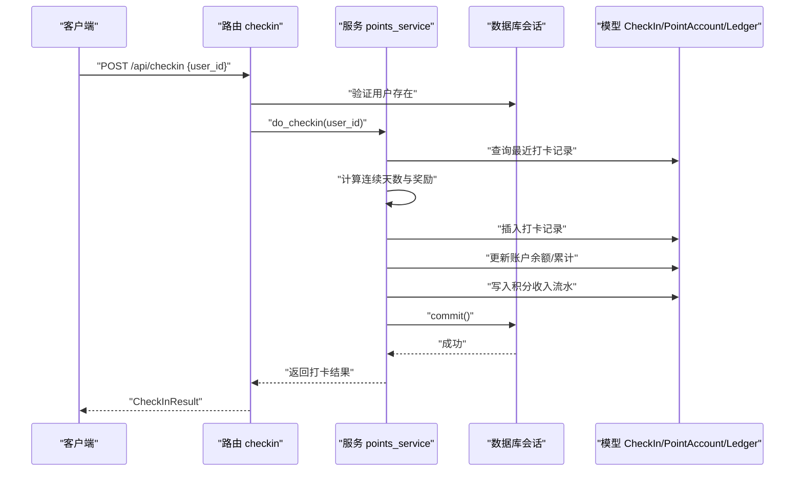
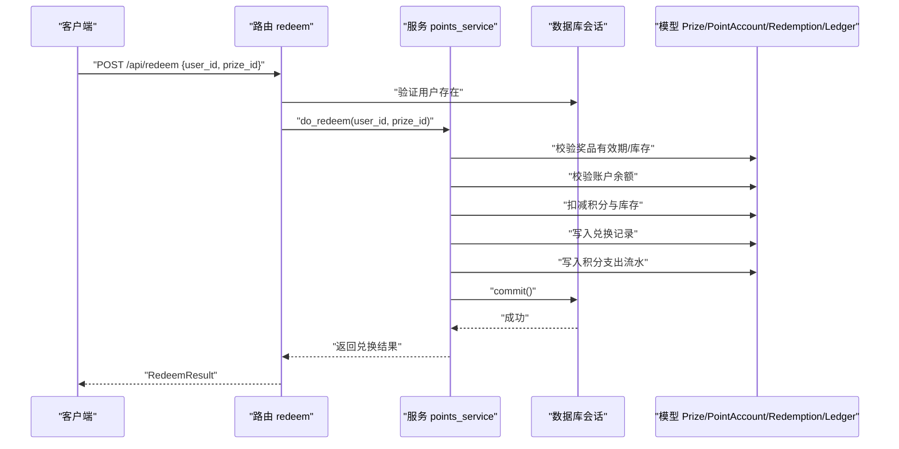
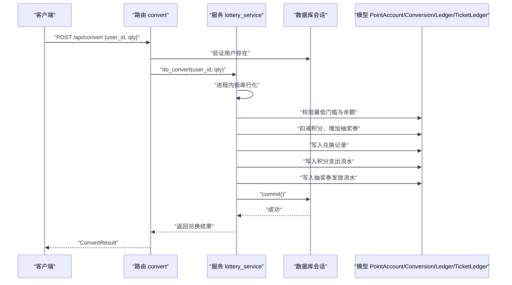
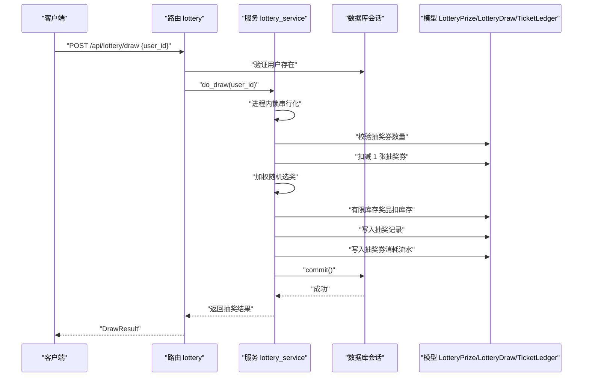
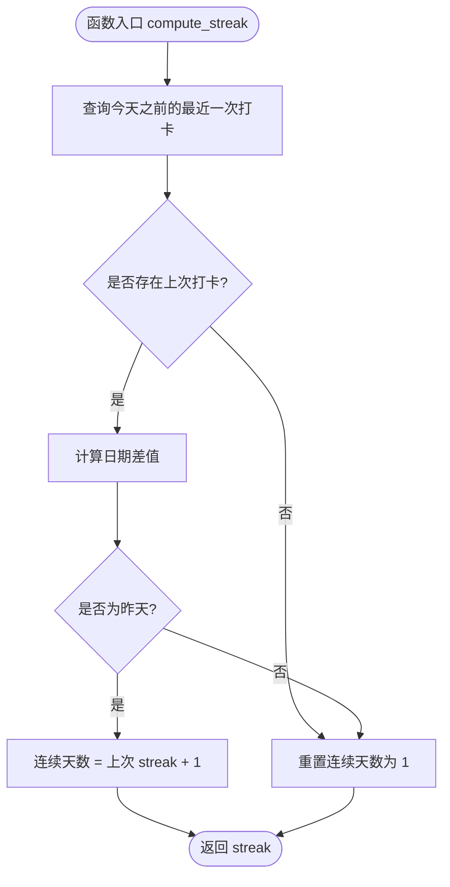
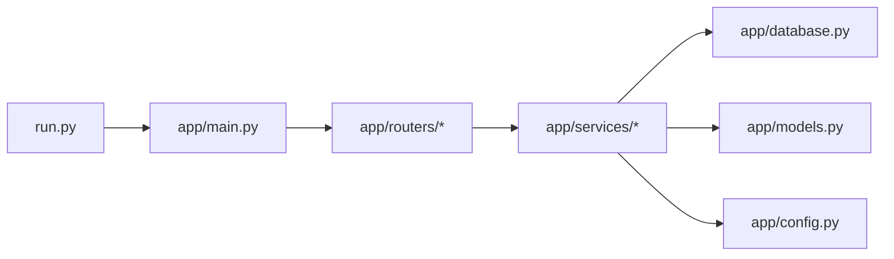

# 系统架构设计

<cite>
**本文引用的文件**   
- [main.py](file://points-system/backend/app/main.py)
- [run.py](file://points-system/backend/run.py)
- [config.py](file://points-system/backend/app/config.py)
- [database.py](file://points-system/backend/app/database.py)
- [models.py](file://points-system/backend/app/models.py)
- [schemas.py](file://points-system/backend/app/schemas.py)
- [checkin.py](file://points-system/backend/app/routers/checkin.py)
- [points.py](file://points-system/backend/app/routers/points.py)
- [prize.py](file://points-system/backend/app/routers/prize.py)
- [redeem.py](file://points-system/backend/app/routers/redeem.py)
- [users.py](file://points-system/backend/app/routers/users.py)
- [convert.py](file://points-system/backend/app/routers/convert.py)
- [lottery.py](file://points-system/backend/app/routers/lottery.py)
- [points_service.py](file://points-system/backend/app/services/points_service.py)
- [lottery_service.py](file://points-system/backend/app/services/lottery_service.py)
</cite>

## 目录
1. [简介](#简介)
2. [项目结构](#项目结构)
3. [核心组件](#核心组件)
4. [架构总览](#架构总览)
5. [详细组件分析](#详细组件分析)
6. [依赖关系分析](#依赖关系分析)
7. [性能与并发特性](#性能与并发特性)
8. [错误处理策略](#错误处理策略)
9. [扩展点与中间件集成方案](#扩展点与中间件集成方案)
10. [故障排查指南](#故障排查指南)
11. [结论](#结论)

## 简介
本文件面向“积分兑换系统”的独立 FastAPI 后端服务，系统性阐述其整体架构、分层职责、数据流与控制流、依赖注入与异步上下文管理、并发与一致性保障、静态资源挂载、以及可观测性与扩展方式。文档同时提供架构图与模块依赖图，帮助开发者快速理解并安全扩展该系统。

## 项目结构
后端采用清晰的分层组织：应用入口与生命周期管理位于 app/main.py；数据库连接与会话管理位于 app/database.py；领域模型定义在 app/models.py；请求/响应模式定义在 app/schemas.py；路由层按业务域拆分于 app/routers/*；服务层封装核心业务逻辑于 app/services/*；配置集中于 app/config.py；启动脚本为 run.py。

图表来源
- [run.py:1-6](file://points-system/backend/run.py#L1-L6)
- [main.py:1-33](file://points-system/backend/app/main.py#L1-L33)
- [database.py:1-39](file://points-system/backend/app/database.py#L1-L39)
- [models.py:1-151](file://points-system/backend/app/models.py#L1-L151)
- [config.py:1-17](file://points-system/backend/app/config.py#L1-L17)

章节来源
- [run.py:1-6](file://points-system/backend/run.py#L1-L6)
- [main.py:1-33](file://points-system/backend/app/main.py#L1-L33)
- [database.py:1-39](file://points-system/backend/app/database.py#L1-L39)
- [models.py:1-151](file://points-system/backend/app/models.py#L1-L151)
- [config.py:1-17](file://points-system/backend/app/config.py#L1-L17)

## 核心组件
- 应用启动与生命周期
  - 使用异步上下文管理器在应用启动时执行数据库建表，确保首次访问前完成表结构初始化。
  - 注册所有 API 路由后挂载静态前端目录，实现前后端一体化部署。
- 数据库与会话
  - 基于 SQLAlchemy 创建引擎与会话工厂，针对 SQLite 开启 WAL 日志与忙等待以提升并发读能力。
  - 通过依赖注入提供会话 get_db，保证请求级事务边界。
- 模型与模式
  - 领域模型覆盖用户、积分账户、流水、打卡、奖品、兑换、抽奖券及抽奖记录等实体。
  - Pydantic 模式统一输入校验与输出序列化。
- 路由与服务
  - 路由层仅做参数校验、权限/存在性检查与调用服务层。
  - 服务层封装事务内的一致性操作（读-改-写），并通过异常映射到 HTTP 状态码。
- 配置
  - 集中管理打卡奖励、连续奖励阈值、积分换券比例、单次抽奖消耗等规则。

章节来源
- [main.py:14-33](file://points-system/backend/app/main.py#L14-L33)
- [database.py:10-39](file://points-system/backend/app/database.py#L10-L39)
- [models.py:10-151](file://points-system/backend/app/models.py#L10-L151)
- [schemas.py:1-147](file://points-system/backend/app/schemas.py#L1-L147)
- [config.py:1-17](file://points-system/backend/app/config.py#L1-L17)

## 架构总览
下图展示从请求进入 FastAPI 到返回响应的端到端流程，包括依赖注入与会话生命周期、服务层事务、SQLite 并发优化与静态资源访问。

图表来源
- [main.py:20-33](file://points-system/backend/app/main.py#L20-L33)
- [database.py:28-39](file://points-system/backend/app/database.py#L28-L39)
- [points_service.py:41-91](file://points-system/backend/app/services/points_service.py#L41-L91)
- [lottery_service.py:30-98](file://points-system/backend/app/services/lottery_service.py#L30-L98)

## 详细组件分析

### 应用启动与生命周期
- 启动流程
  - 通过 uvicorn 加载 app.main:app，触发 lifespan 钩子执行 init_db()，确保表结构就绪。
  - 注册各业务路由后挂载静态目录，使根路径直接提供前端页面与资源。
- 关键点
  - 路由注册顺序优先于静态挂载，避免 API 被静态文件拦截。
  - 静态文件启用 html=True，支持 SPA 友好回退。

章节来源
- [run.py:1-6](file://points-system/backend/run.py#L1-L6)
- [main.py:14-33](file://points-system/backend/app/main.py#L14-L33)

### 数据库初始化与并发优化
- 初始化机制
  - 在 lifespan 中导入 models 以注册所有表，再调用 create_all 生成缺失表。
- 并发优化
  - 针对 SQLite 设置 journal_mode=WAL 与 busy_timeout，降低读写冲突与锁等待。
  - connect_args 允许线程池共享连接，适配 FastAPI 并发模型。

章节来源
- [main.py:14-20](file://points-system/backend/app/main.py#L14-L20)
- [database.py:10-26](file://points-system/backend/app/database.py#L10-L26)
- [database.py:36-39](file://points-system/backend/app/database.py#L36-L39)

### 分层架构与依赖注入
- 路由层
  - 负责参数解析、存在性校验、调用服务层，并将服务层返回的数据包装为 Pydantic 响应模型。
- 服务层
  - 封装事务内一致性操作，包含积分账户获取/创建、连续天数计算、打卡、兑换、积分换券、抽奖等。
- 数据访问层
  - 通过 SQLAlchemy Session 进行 CRUD，结合唯一约束与完整性错误捕获保证最终一致性。
- 依赖注入
  - 使用 Depends(get_db) 在每个请求中提供独立的数据库会话，并在请求结束时自动关闭。

图表来源
- [checkin.py:1-16](file://points-system/backend/app/routers/checkin.py#L1-L16)
- [points.py:1-28](file://points-system/backend/app/routers/points.py#L1-L28)
- [prize.py:1-42](file://points-system/backend/app/routers/prize.py#L1-L42)
- [redeem.py:1-52](file://points-system/backend/app/routers/redeem.py#L1-L52)
- [convert.py:1-64](file://points-system/backend/app/routers/convert.py#L1-L64)
- [lottery.py:1-55](file://points-system/backend/app/routers/lottery.py#L1-L55)
- [points_service.py:18-146](file://points-system/backend/app/services/points_service.py#L18-L146)
- [lottery_service.py:30-174](file://points-system/backend/app/services/lottery_service.py#L30-L174)
- [database.py:28-39](file://points-system/backend/app/database.py#L28-L39)
- [models.py:10-151](file://points-system/backend/app/models.py#L10-L151)

章节来源
- [checkin.py:1-16](file://points-system/backend/app/routers/checkin.py#L1-L16)
- [points.py:1-28](file://points-system/backend/app/routers/points.py#L1-L28)
- [prize.py:1-42](file://points-system/backend/app/routers/prize.py#L1-L42)
- [redeem.py:1-52](file://points-system/backend/app/routers/redeem.py#L1-L52)
- [convert.py:1-64](file://points-system/backend/app/routers/convert.py#L1-L64)
- [lottery.py:1-55](file://points-system/backend/app/routers/lottery.py#L1-L55)
- [points_service.py:18-146](file://points-system/backend/app/services/points_service.py#L18-L146)
- [lottery_service.py:30-174](file://points-system/backend/app/services/lottery_service.py#L30-L174)
- [database.py:28-39](file://points-system/backend/app/database.py#L28-L39)
- [models.py:10-151](file://points-system/backend/app/models.py#L10-L151)

### 关键业务流程时序

#### 打卡流程

图表来源
- [checkin.py:11-16](file://points-system/backend/app/routers/checkin.py#L11-L16)
- [points_service.py:41-91](file://points-system/backend/app/services/points_service.py#L41-L91)
- [models.py:50-66](file://points-system/backend/app/models.py#L50-L66)
- [models.py:20-33](file://points-system/backend/app/models.py#L20-L33)
- [models.py:35-48](file://points-system/backend/app/models.py#L35-L48)

章节来源
- [checkin.py:11-16](file://points-system/backend/app/routers/checkin.py#L11-L16)
- [points_service.py:41-91](file://points-system/backend/app/services/points_service.py#L41-L91)

#### 积分兑换奖品流程

图表来源
- [redeem.py:11-28](file://points-system/backend/app/routers/redeem.py#L11-L28)
- [points_service.py:94-146](file://points-system/backend/app/services/points_service.py#L94-L146)
- [models.py:68-94](file://points-system/backend/app/models.py#L68-L94)
- [models.py:20-33](file://points-system/backend/app/models.py#L20-L33)
- [models.py:35-48](file://points-system/backend/app/models.py#L35-L48)

章节来源
- [redeem.py:11-28](file://points-system/backend/app/routers/redeem.py#L11-L28)
- [points_service.py:94-146](file://points-system/backend/app/services/points_service.py#L94-L146)

#### 积分兑换抽奖券流程

图表来源
- [convert.py:11-28](file://points-system/backend/app/routers/convert.py#L11-L28)
- [lottery_service.py:30-98](file://points-system/backend/app/services/lottery_service.py#L30-L98)
- [models.py:96-108](file://points-system/backend/app/models.py#L96-L108)
- [models.py:20-33](file://points-system/backend/app/models.py#L20-L33)
- [models.py:35-48](file://points-system/backend/app/models.py#L35-L48)
- [models.py:110-123](file://points-system/backend/app/models.py#L110-L123)

章节来源
- [convert.py:11-28](file://points-system/backend/app/routers/convert.py#L11-L28)
- [lottery_service.py:30-98](file://points-system/backend/app/services/lottery_service.py#L30-L98)

#### 抽奖流程

图表来源
- [lottery.py:24-37](file://points-system/backend/app/routers/lottery.py#L24-L37)
- [lottery_service.py:117-174](file://points-system/backend/app/services/lottery_service.py#L117-L174)
- [models.py:125-151](file://points-system/backend/app/models.py#L125-L151)
- [models.py:110-123](file://points-system/backend/app/models.py#L110-L123)

章节来源
- [lottery.py:24-37](file://points-system/backend/app/routers/lottery.py#L24-L37)
- [lottery_service.py:117-174](file://points-system/backend/app/services/lottery_service.py#L117-L174)

### 复杂逻辑流程图：连续天数计算

图表来源
- [points_service.py:27-38](file://points-system/backend/app/services/points_service.py#L27-L38)

章节来源
- [points_service.py:27-38](file://points-system/backend/app/services/points_service.py#L27-L38)

## 依赖关系分析
- 模块耦合
  - 路由层对服务层低耦合，仅依赖接口契约（函数签名与异常）。
  - 服务层对数据库与会话解耦，通过 Session 抽象数据访问。
  - 模型与配置被服务层广泛引用，形成稳定的领域基础。
- 外部依赖
  - FastAPI 提供路由、依赖注入与静态文件服务。
  - SQLAlchemy 提供 ORM 与事务语义。
  - Uvicorn 作为 ASGI 服务器承载应用。

图表来源
- [main.py:20-33](file://points-system/backend/app/main.py#L20-L33)
- [run.py:1-6](file://points-system/backend/run.py#L1-L6)
- [points_service.py:1-146](file://points-system/backend/app/services/points_service.py#L1-L146)
- [lottery_service.py:1-174](file://points-system/backend/app/services/lottery_service.py#L1-L174)
- [database.py:1-39](file://points-system/backend/app/database.py#L1-L39)
- [models.py:1-151](file://points-system/backend/app/models.py#L1-L151)
- [config.py:1-17](file://points-system/backend/app/config.py#L1-L17)

章节来源
- [main.py:20-33](file://points-system/backend/app/main.py#L20-L33)
- [run.py:1-6](file://points-system/backend/run.py#L1-L6)
- [points_service.py:1-146](file://points-system/backend/app/services/points_service.py#L1-L146)
- [lottery_service.py:1-174](file://points-system/backend/app/services/lottery_service.py#L1-L174)
- [database.py:1-39](file://points-system/backend/app/database.py#L1-L39)
- [models.py:1-151](file://points-system/backend/app/models.py#L1-L151)
- [config.py:1-17](file://points-system/backend/app/config.py#L1-L17)

## 性能与并发特性
- SQLite 并发优化
  - 开启 WAL 模式提升并发读能力，busy_timeout 降低锁等待失败概率。
- 进程内串行化
  - 针对单进程多线程场景，使用 threading.Lock 将同一账户的「读-改-写」串行化，避免丢失更新。
- 事务原子性
  - 所有变更在同一 Session 事务内提交，异常时统一回滚，保证余额、库存与流水一致。
- 索引与分页
  - 常用查询字段建立索引（如 user_id、created_at），列表接口限制 limit 控制返回量。

[本节为通用性能建议，不直接分析具体文件]

## 错误处理策略
- 业务异常映射
  - 用户不存在、重复打卡、库存不足、积分不足、未解锁抽奖等场景均抛出 HTTPException，携带明确状态码与消息。
- 并发冲突兜底
  - 捕获 IntegrityError 并转换为 409 冲突提示，配合唯一约束防止重复写入。
- 全局异常
  - 当前未定义全局异常处理器，可在 main.py 中添加中间件或异常处理器统一收敛错误格式。

章节来源
- [checkin.py:11-16](file://points-system/backend/app/routers/checkin.py#L11-L16)
- [points_service.py:41-91](file://points-system/backend/app/services/points_service.py#L41-L91)
- [points_service.py:94-146](file://points-system/backend/app/services/points_service.py#L94-L146)
- [lottery_service.py:30-98](file://points-system/backend/app/services/lottery_service.py#L30-L98)
- [lottery_service.py:117-174](file://points-system/backend/app/services/lottery_service.py#L117-L174)

## 扩展点与中间件集成方案
- 扩展点
  - 新增业务路由：在 app/routers 下新建模块，注册至 main.py 的路由集合。
  - 新增服务逻辑：在 app/services 下新增服务模块，保持事务内一致性原则。
  - 新增模型与模式：在 models.py 与 schemas.py 中扩展实体与输入输出。
  - 配置项扩展：在 config.py 中新增常量，供服务层读取。
- 中间件集成
  - 可在 main.py 中通过 app.middleware 添加认证、鉴权、限流、审计等中间件。
  - 可添加全局异常处理器，统一错误响应格式与日志上报。
- 静态资源与多环境
  - 前端目录通过环境变量或配置文件动态指定，便于多环境部署。
  - 生产环境可替换静态文件服务为 Nginx 托管，后端专注 API。

章节来源
- [main.py:20-33](file://points-system/backend/app/main.py#L20-L33)
- [config.py:1-17](file://points-system/backend/app/config.py#L1-L17)

## 故障排查指南
- 常见问题定位
  - 重复打卡：检查唯一约束与 409 响应，确认并发请求是否命中进程内锁。
  - 积分不足/库存不足：核对业务校验分支与对应错误消息。
  - 抽奖券不足：确认 do_convert 成功后 account.lottery_tickets 是否 ≥ 1。
- 日志与追踪
  - 建议在服务层关键步骤添加结构化日志（用户 ID、操作类型、余额快照）。
  - 引入请求 ID 贯穿日志链路，便于问题回溯。
- 数据一致性验证
  - 对比 PointLedger 与 LotteryTicketLedger 的 balance_after 与账户余额，确保无漂移。

章节来源
- [points_service.py:41-91](file://points-system/backend/app/services/points_service.py#L41-L91)
- [points_service.py:94-146](file://points-system/backend/app/services/points_service.py#L94-L146)
- [lottery_service.py:30-98](file://points-system/backend/app/services/lottery_service.py#L30-L98)
- [lottery_service.py:117-174](file://points-system/backend/app/services/lottery_service.py#L117-L174)

## 结论
本系统采用清晰的三层架构与依赖注入，结合 SQLAlchemy 事务与 SQLite 并发优化，实现了打卡、积分兑换、抽奖券兑换与抽奖等核心业务的强一致性与高可用。通过模块化路由与服务拆分、集中式配置与可扩展的中间件接入点，系统具备良好的可维护性与演进空间。后续可按需引入全局异常处理、缓存层、消息队列与更完善的监控体系，进一步提升性能与可观测性。